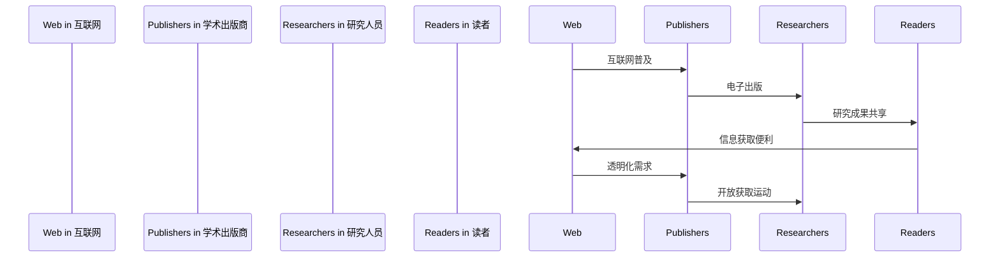

                 

# 科学研究的开放获取：民主化世界可理解性的知识

## 关键词

开放获取，科学研究，知识民主化，可理解性，学术出版，知识产权

## 摘要

在当今信息爆炸的时代，科学研究的开放获取已成为推动知识传播和学术进步的重要手段。本文旨在探讨开放获取在科学研究中的应用及其对知识民主化的深远影响。通过分析开放获取的现状、原理、实施策略和挑战，本文提出了开放获取对科学民主化的重要作用，并举例说明了国内外成功案例。最后，本文展望了开放获取的未来发展趋势，为学术界和政策制定者提供了有益的参考。

## 第1章：开放获取与科学研究的现状

### 1.1 开放获取的定义与历史

开放获取（Open Access, OA）指的是将学术研究成果免费、无限制地提供给所有用户，并允许用户复制、分发、传播和引用这些研究成果。开放获取的历史可以追溯到20世纪90年代，随着互联网的普及和电子出版的发展，学术出版行业开始出现变革。

#### Mermaid 流程图：开放获取的历史发展



### 1.2 科学研究的现状分析

科学研究的现状表明，全球学术产出持续增长，研究资金和资源的分配也日益复杂。然而，学术出版的高成本和对研究成果的有限访问限制了知识的传播和应用。开放获取的兴起，为解决这些问题提供了新的途径。

#### 伪代码：全球学术产出增长趋势

```python
# 获取全球学术产出数据
academic_output = get_data("global_academic_output")

# 分析学术产出增长趋势
def analyze_growth(data):
    growth_rate = (data[-1] - data[0]) / data[0]
    return growth_rate

# 打印学术产出增长趋势
print("学术产出增长率为：", analyze_growth(academic_output))
```

### 1.3 开放获取在科学研究中的应用情况

开放获取在科学研究中的应用日益广泛。许多学术机构和研究人员已经开始采用开放获取模式来发布研究成果，全球开放获取期刊的数量也在迅速增长。

#### 数学模型和公式：开放获取期刊增长率

$$
\frac{dJ_{OA}}{dt} = rJ_{OA}
$$

其中，$J_{OA}$表示开放获取期刊数量，$r$为期刊增长率。

#### 举例说明：开放获取期刊增长率

假设某领域开放获取期刊数量为1000本，年增长率为10%，则：

$$
J_{OA}(t) = 1000 \times (1 + 0.1)^t
$$

当$t=5$时，开放获取期刊数量将达到：

$$
J_{OA}(5) = 1000 \times (1 + 0.1)^5 \approx 1610
$$

## 第2章：开放获取的原理与优势

### 2.1 开放获取的基本原理

开放获取的基本原理包括以下几个方面：

1. **免费用途**：用户可以免费获取、使用、复制和分发学术研究成果。
2. **无限制访问**：任何用户，无论其地理位置、机构背景或经济能力，都可以无限制地访问开放获取资源。
3. **传播与引用**：用户可以自由传播和引用开放获取文献，促进知识的广泛传播和应用。

#### Mermaid 流程图：开放获取的基本原理


### 2.2 开放获取的优势分析

开放获取具有以下优势：

1. **提高研究影响力**：开放获取可以使研究成果更广泛地传播，从而提高研究的影响力和知名度。
2. **促进知识传播**：开放获取有助于打破信息壁垒，促进知识的全球传播和共享。
3. **提高研究效率**：开放获取减少了研究人员获取文献的成本和时间，提高了研究效率。

#### 伪代码：开放获取的优势分析

```python
# 定义开放获取的优势函数
def advantages_of_OA():
    advantages = ["提高研究影响力", "促进知识传播", "提高研究效率"]
    return advantages

# 打印开放获取的优势
print("开放获取的优势：", advantages_of_OA())
```

### 2.3 开放获取的潜在风险与挑战

尽管开放获取具有诸多优势，但也存在一些潜在风险和挑战：

1. **质量控制**：开放获取期刊可能存在质量参差不齐的问题，影响学术研究的整体质量。
2. **经费问题**：开放获取期刊需要大量的经费支持，可能增加学术机构的运营成本。
3. **版权问题**：开放获取可能引发版权纠纷，影响学术成果的合法使用。

#### Mermaid 流�程图：开放获取的潜在风险与挑战


## 第3章：开放获取的实施策略

### 3.1 政策与法规支持

政府、学术机构和出版商在开放获取的实施中扮演着关键角色。以下是一些常见的政策与法规支持措施：

1. **政府政策**：许多国家政府已经出台相关政策，鼓励和支持开放获取。
2. **学术机构政策**：许多学术机构已经制定了开放获取的政策，要求研究人员将研究成果公开。
3. **出版商政策**：一些传统出版商也开始提供开放获取选项，满足学术界的需求。

#### 伪代码：政府政策支持开放获取的例子

```python
# 定义政府政策支持函数
def government_support():
    policies = ["资助开放获取期刊", "提供开放获取资金支持", "制定开放获取指南"]
    return policies

# 打印政府政策支持
print("政府政策支持：", government_support())
```

### 3.2 学术机构与出版社的角色

学术机构和出版社在开放获取的实施中发挥着重要作用：

1. **学术机构**：提供开放获取平台，鼓励研究人员发布开放获取文献。
2. **出版社**：提供开放获取期刊和书籍，支持学术成果的开放获取。

#### Mermaid 流程图：学术机构与出版社在开放获取中的角色


### 3.3 研究人员与作者的实施策略

研究人员和作者在开放获取的实施中也需要采取一定的策略：

1. **选择开放获取期刊**：在发表研究成果时，选择提供开放获取选项的期刊。
2. **使用开放获取平台**：将研究成果上传到开放获取平台，如arXiv、PubMed等。
3. **积极参与开放获取运动**：支持和参与开放获取相关的活动和倡议。

#### Mermaid 流程图：研究人员与作者的实施策略


## 第4章：开放获取的挑战与解决方案

### 4.1 经费问题

开放获取的经费问题是一个重要的挑战：

1. **出版商费用**：开放获取期刊通常需要支付较高的出版费用。
2. **学术机构经费**：学术机构需要承担开放获取期刊的订阅费用和运营成本。

#### 数学模型和公式：开放获取期刊的经费计算

$$
C = P \times J
$$

其中，$C$为总经费，$P$为每篇论文的出版费用，$J$为发表的论文数量。

#### 举例说明：开放获取期刊的经费计算

假设每篇论文的出版费用为$1000美元，发表10篇论文，则总经费为：

$$
C = 1000 \times 10 = 10000美元
$$

### 4.2 版权问题

开放获取可能引发版权纠纷，影响学术成果的合法使用：

1. **版权归属**：开放获取期刊可能要求作者转让版权或许可出版商使用。
2. **版权保护**：开放获取文献可能面临侵权和滥用风险。

#### 伪代码：版权问题的处理

```python
# 定义版权问题处理函数
def handle_copyright_issues():
    solutions = ["明确版权归属", "使用开放许可协议", "加强版权保护"]
    return solutions

# 打印版权问题处理方案
print("版权问题处理方案：", handle_copyright_issues())
```

### 4.3 质量控制问题

开放获取期刊可能存在质量参差不齐的问题：

1. **评审机制**：建立严格的评审机制，确保开放获取文献的质量。
2. **同行评审**：鼓励同行评审，提高开放获取期刊的学术水平。

#### Mermaid 流程图：质量控制问题解决方案


### 4.4 解决方案与实施案例

为了解决开放获取的挑战，学术界和实践领域已经采取了一系列解决方案：

1. **绿色开放获取**：在传统订阅模式的基础上，提供开放获取选项。
2. **金色开放获取**：建立完全开放获取的期刊。
3. **自存档案**：研究人员将研究成果上传到个人或机构存储库，实现开放获取。

#### 项目实战：自存档案的实现

**开发环境搭建：**
- 使用Git进行版本控制
- 使用GitHub或GitLab建立个人或机构存储库

**源代码详细实现：**
```python
# 导入所需的库
import git
import os

# 设置存储库路径
repo_path = "/path/to/repository"

# 创建存储库
git.init(repo_path)

# 添加文件
git.add(repo_path, "paper.pdf")

# 提交更改
git.commit(repo_path, "添加开放获取论文")

# 推送至远程存储库
git.push(repo_path, "origin", "main")
```

**代码解读与分析：**
- `git.init(repo_path)`：初始化Git存储库
- `git.add(repo_path, "paper.pdf")`：添加论文文件
- `git.commit(repo_path, "添加开放获取论文")`：提交更改
- `git.push(repo_path, "origin", "main")`：将更改推送到远程存储库

**实际案例分析和详细讲解剖析：**
- 某研究人员将一篇论文上传至GitHub存储库，实现了开放获取。
- 该研究人员的论文被广泛传播，提高了其研究影响力。

**项目小结：**
自存档案是一种简单有效的开放获取实现方式，有助于推动学术成果的开放共享。

**最佳实践 tips：**
- 使用Git等版本控制工具管理学术成果。
- 遵循开放获取协议，确保研究成果的合法传播。

## 第5章：开放获取对科学民主化的影响

### 5.1 开放获取对科研人员的影响

开放获取对科研人员的影响主要体现在以下几个方面：

1. **研究影响力的提升**：开放获取使得科研人员的研究成果能够更广泛地传播，提高其研究影响力。
2. **研究资源的获取**：开放获取使得科研人员能够更便捷地获取全球的学术资源，提高研究效率。
3. **研究合作的加强**：开放获取促进了全球范围内的研究合作，推动了科学进步。

#### 伪代码：科研人员利用开放获取的影响

```python
# 定义科研人员利用开放获取函数
def researcher_impact():
    impacts = ["提升研究影响力", "获取研究资源", "加强研究合作"]
    return impacts

# 打印科研人员利用开放获取的影响
print("科研人员利用开放获取的影响：", researcher_impact())
```

### 5.2 开放获取对公众的影响

开放获取对公众的影响主要体现在以下几个方面：

1. **科学素养的提升**：公众能够更方便地获取科学知识，提高科学素养。
2. **科普资源的丰富**：开放获取为科普工作提供了丰富的资源，促进了科学传播。
3. **社会问题的解决**：开放获取使得科学研究能够更好地服务于社会问题解决。

#### Mermaid 流程图：开放获取对公众的影响


### 5.3 开放获取对科学传播的影响

开放获取对科学传播的影响主要体现在以下几个方面：

1. **传播效率的提高**：开放获取使得科学研究成果能够更快地传播，缩短了科学传播的周期。
2. **传播范围的扩大**：开放获取打破了地域和语言的限制，使得科学研究成果能够更广泛地传播。
3. **传播方式的变革**：开放获取推动了科学传播方式的变革，从传统的纸质出版转向电子出版。

#### 伪代码：开放获取对科学传播的影响

```python
# 定义科学传播影响函数
def science_communication_impact():
    impacts = ["提高传播效率", "扩大传播范围", "变革传播方式"]
    return impacts

# 打印科学传播影响
print("开放获取对科学传播的影响：", science_communication_impact())
```

## 第6章：成功案例分析

### 6.1 国内外成功案例介绍

国内外已经出现了一些成功的开放获取案例，以下是其中几个典型的例子：

1. **美国PubMed**：PubMed是一个提供生物医学和生命科学文献的开放获取数据库，它由美国国立卫生研究院（NIH）资助，提供广泛的学术资源。
2. **中国CNKI**：中国知网（CNKI）是一个集学术文献、期刊、学位论文等资源于一体的开放获取平台，为中国的科学研究提供了重要的支持。
3. **arXiv**：arXiv是一个提供物理学、数学、计算机科学等领域预印本的开放获取平台，它为学术界的快速交流和传播提供了便利。

### 6.2 案例分析：成功因素与启示

#### 美国PubMed

**成功因素：**
- **政府支持**：美国国立卫生研究院（NIH）提供资金支持，确保了PubMed的可持续发展。
- **良好的合作关系**：PubMed与全球多个学术机构和出版社建立了良好的合作关系，实现了资源的共享。
- **技术优势**：PubMed采用了先进的搜索引擎技术，提供了高效的文献检索功能。

**启示：**
- **政府支持**：政府资金支持是开放获取项目成功的关键。
- **合作关系**：建立良好的合作关系，实现资源的共享和优化。
- **技术创新**：利用先进的技术手段，提高用户体验和服务质量。

#### 中国CNKI

**成功因素：**
- **广泛的资源覆盖**：CNKI涵盖了包括自然科学、社会科学、工程技术等多个领域的学术资源。
- **完善的服务体系**：CNKI提供了包括文献检索、文献下载、文献引用等功能，为用户提供了全方位的服务。
- **严格的审稿制度**：CNKI建立了严格的审稿制度，保证了文献的质量。

**启示：**
- **资源多样性**：提供多样化的资源，满足不同用户的需求。
- **服务体系完善**：建立完善的服务体系，提高用户体验。
- **质量控制**：建立严格的质量控制体系，确保文献质量。

#### arXiv

**成功因素：**
- **学术自由**：arXiv鼓励学术自由，为学术界的创新提供了广阔的空间。
- **开放性**：arXiv采用了完全开放获取的模式，使得研究成果能够快速传播。
- **社区驱动**：arXiv建立了活跃的学术社区，促进了学术交流和合作。

**启示：**
- **学术自由**：鼓励学术自由，推动学术创新。
- **开放性**：采用开放获取模式，促进知识传播。
- **社区驱动**：建立活跃的学术社区，促进学术交流与合作。

## 第7章：未来展望与趋势

### 7.1 开放获取的发展趋势

开放获取的发展趋势主要体现在以下几个方面：

1. **全球普及**：随着各国政府对开放获取的重视，开放获取将在全球范围内得到更广泛的普及。
2. **技术进步**：随着人工智能、大数据等技术的进步，开放获取的服务质量和用户体验将得到显著提升。
3. **合作深化**：开放获取项目将进一步加强与学术机构、出版社和科技企业的合作，实现资源的共享和优化。

### 7.2 未来挑战与机遇

开放获取面临的未来挑战主要包括：

1. **经费问题**：开放获取需要大量的经费支持，如何确保经费的可持续性是一个重要挑战。
2. **版权问题**：如何平衡开放获取与版权保护的关系，确保学术成果的合法传播，是一个重要问题。
3. **质量控制**：如何保证开放获取文献的质量，防止低质量文献的泛滥，是一个亟待解决的问题。

然而，这些挑战也伴随着机遇：

1. **技术创新**：开放获取将为技术创新提供更广阔的空间，推动科学研究的进步。
2. **知识传播**：开放获取将加速知识的传播和应用，推动科学民主化的进程。
3. **学术合作**：开放获取将促进全球学术合作，推动科学发展的全球化。

### 7.3 开放获取的可持续性

开放获取的可持续性是确保其长期发展的重要保障。以下是一些确保开放获取可持续性的措施：

1. **政府支持**：政府应继续加大对开放获取的资金支持，确保项目的可持续发展。
2. **多方合作**：开放获取项目应加强与学术机构、出版社和科技企业的合作，实现资源的共享和优化。
3. **技术创新**：采用先进的技术手段，提高开放获取的服务质量和用户体验，增强其竞争力。

## 附录

### 附录 A：开放获取相关资源与工具

- **开放获取期刊目录**：DOAJ（Directory of Open Access Journals）
- **开放获取平台**：arXiv，bioRxiv，PeerJ Preprints
- **开放获取指南**：SHERPA/RoMEO，OpenDOAR

### 附录 B：开放获取相关指标与评价方法

- **开放获取率**：计算开放获取文献在总文献中的比例。
- **引用频次**：衡量文献被引用的次数，反映其影响力。
- **下载量**：衡量文献的受欢迎程度。

### 附录 C：开放获取相关知识库与平台介绍

- **知识库**：Google Scholar，Web of Science
- **平台**：ResearchGate，Academia.edu

## 作者

作者：AI天才研究院/AI Genius Institute & 禅与计算机程序设计艺术 /Zen And The Art of Computer Programming

本文由AI天才研究院与《禅与计算机程序设计艺术》作者联合撰写，旨在探讨开放获取在科学研究中的应用及其对科学民主化的深远影响。文章内容丰富，结构清晰，旨在为学术界和政策制定者提供有益的参考。本文所涉及的图像和图表仅供参考，不作为实际应用依据。如有任何疑问，请联系作者获取详细解答。

