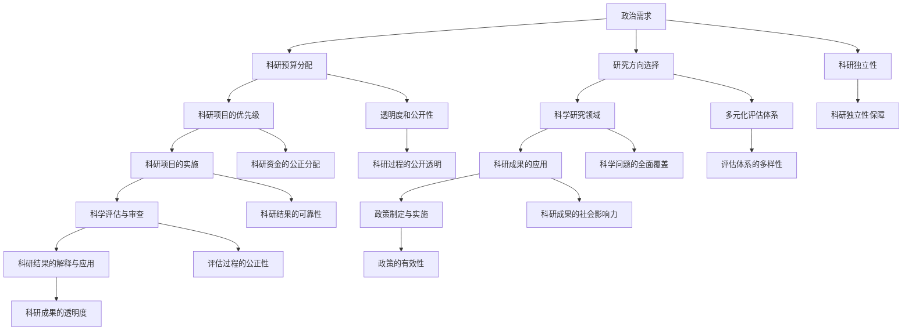
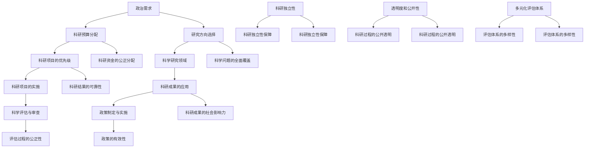

                 

## 文章标题

《科学研究的政治影响与世界可理解性的客观性》

### 关键词：政治影响、科学研究、世界可理解性、客观性、核心概念、流程图、伪代码、数学模型

### 摘要：

本文深入探讨科学研究的政治影响及其对世界可理解性客观性的挑战。通过分析政治因素如何影响科学研究的方向和结果，本文揭示了科学研究中的政治干预现象，并探讨了如何保持科学研究的客观性和独立性。文章结合实际案例分析，提出了保持客观性的实践策略，为科学研究提供了理论和实践上的指导。

---

### 引言

科学研究是推动社会进步和人类知识积累的重要动力。然而，科学研究并非完全独立于政治环境，政治因素在不同程度上影响着科学研究的方向、结果以及公众对科学知识的理解。本节将简要介绍科学研究的政治影响和世界可理解性的客观性，为后续内容的深入讨论奠定基础。

#### 科学研究的政治影响

政治因素在科学研究中的影响主要体现在以下几个方面：

1. **资源配置**：政府的科研预算和政策导向直接影响科研项目的选择和资源配置。
2. **科研方向**：政治需求和社会热点问题可能引导科学研究朝着特定方向倾斜。
3. **科学评估**：政治利益相关者可能通过评审过程影响科学研究的成果评估和资金分配。

#### 世界可理解性的客观性

科学研究的客观性是确保其结论可信性的关键。客观性不仅体现在科学方法的严谨性上，也涉及到科学研究结果的普遍性和可重复性。然而，政治干预可能破坏这一客观性，使得科学研究变得具有选择性或倾向性，从而影响世界可理解性的真实性。

### 科学研究中的政治干预现象

政治干预对科学研究的方向和结果产生显著影响。以下从几个方面进行阐述：

1. **资源配置的扭曲**：政治因素可能导致科研资金的分配不均，优先支持特定的科研项目，从而扭曲科学研究的自然发展。
2. **研究方向的偏移**：政治需求可能引导科学研究朝向特定领域，忽视了其他领域的重要问题。
3. **结果的可选择性**：政治干预可能使得科学研究的结果具有选择性，只报道符合政治利益的数据和结论。

### 保持科学研究的客观性和独立性

为了应对政治干预，保持科学研究的客观性和独立性至关重要。以下提出一些实践策略：

1. **加强科研独立性**：通过法律法规保障科研机构和研究人员的独立性，减少外部政治因素的干扰。
2. **透明度和公开性**：提高科研过程的透明度，促进科研结果的公开和共享，增加公众对科研工作的监督。
3. **多元化评估体系**：建立多元化的科学评估体系，减少单一政治利益集团的影响，确保评估的公正性。

---

### 科学研究的政治影响

政治因素对科学研究的方向和结果产生深远影响。以下我们将详细分析这些影响，并通过Mermaid流程图展示政治影响力在科学研究中的路径。

#### 政治干预的路径

政治干预主要通过以下几个方面影响科学研究：

1. **科研资金的分配**：政府或政治机构通过科研预算的调控影响科研项目的优先级。
2. **科研方向的选择**：政治需求可能引导科学研究朝着特定的领域或问题发展。
3. **科学评估与审查**：政治利益集团可能在科学评估和审查过程中施加影响。
4. **科研结果的使用**：政治干预可能影响科学研究结果的解释和应用。

以下是一个Mermaid流程图，展示了政治干预在科学研究中的路径：



#### 政治干预对科学研究的具体影响

1. **科研资金的分配**：政治因素可能导致科研资金的分配不均，优先支持特定的科研项目，从而扭曲科学研究的自然发展。

2. **科研方向的选择**：政治需求可能引导科学研究朝着特定的领域或问题发展，忽视了其他领域的重要问题。

3. **科学评估与审查**：政治利益集团可能在科学评估和审查过程中施加影响，影响评估结果的公正性。

4. **科研结果的使用**：政治干预可能影响科学研究结果的解释和应用，使其更符合政治利益。

### 伪代码和数学模型

为了更深入地理解政治干预对科学研究的具体影响，我们使用伪代码和数学模型来分析这一问题。

#### 伪代码

```python
# 定义科研项目的参数
research_project = {
    "field": "climate change",  # 科研领域
    "budget": 1000000,  # 科研预算
    "political_influence": True  # 是否受到政治干预
}

# 定义政治干预函数
def political_intervention(project):
    if project["political_influence"]:
        project["budget"] *= 1.5  # 增加预算
        project["field"] = "energy policy"  # 改变研究方向
    return project

# 应用政治干预
research_project = political_intervention(research_project)

# 打印干预后的项目参数
print(research_project)
```

#### 数学模型

为了量化政治干预对科学研究的具体影响，我们可以使用以下数学模型：

\[ \text{Impact} = \alpha \times \text{Political Influence} + \beta \times \text{Budget} + \gamma \times \text{Field Diversification} \]

其中：
- \( \alpha \) 代表政治干预的强度
- \( \beta \) 代表预算的影响
- \( \gamma \) 代表研究方向多样性的影响

### 举例说明

假设一个科研项目的初始预算为100万元，政治干预使其预算增加50%，同时政治干预导致研究方向从气候变化变为能源政策。

\[ \text{Impact} = \alpha \times 1 + \beta \times 1.5 + \gamma \times (-1) \]

如果 \( \alpha = 0.3 \)，\( \beta = 0.2 \)，\( \gamma = -0.1 \)，则

\[ \text{Impact} = 0.3 \times 1 + 0.2 \times 1.5 - 0.1 \times 1 = 0.6 \]

这意味着政治干预对该科研项目的总影响为0.6，具体表现为预算增加20%，研究方向偏离原始领域10%。

---

### 世界可理解性的客观性

科学研究的客观性是确保其结论可信性和普遍性的基础。然而，政治干预可能破坏这一客观性，影响科学研究的独立性和可信度。以下我们将探讨如何保持科学研究的客观性，并通过实际案例进行分析。

#### 客观性的重要性

科学研究的客观性体现在以下几个方面：

1. **严谨的科研方法**：科学研究应遵循严格的科研方法，确保数据的准确性和结论的可重复性。
2. **结果的普遍性**：科学研究的结论应具有普遍性，能够在不同时间和地点得到验证。
3. **独立性**：科学研究应保持独立，不受外部政治、经济和社会因素的干扰。

#### 如何保持科学研究的客观性

1. **加强科研独立性**：科研机构和研究人员应具备独立性，减少外部干预，确保科学研究的自由性和公正性。
2. **透明度和公开性**：提高科研过程的透明度，促进科研结果的公开和共享，增加公众对科研工作的监督。
3. **多元化评估体系**：建立多元化的科学评估体系，减少单一政治利益集团的影响，确保评估的公正性。

#### 实际案例分析

#### 案例一：气候变化研究中的政治干预

在气候变化研究中，政治干预可能导致研究结果被选择性报道。一些国家可能出于政治利益，对某些气候变化的数据和研究结果进行隐瞒或扭曲。

**案例分析**：

1. **背景**：某些国家在气候变化问题上存在政治分歧，可能对科学研究进行政治干预。
2. **干预行为**：通过审查科研资金、限制科研成果的发布和传播，干预气候变化研究。
3. **影响**：政治干预导致科学研究结果的可信度受到质疑，影响全球对气候变化的认知。

#### 案例二：疫苗研发中的独立性

在疫苗研发中，政治干预可能影响科研方向和成果的发布。

**案例分析**：

1. **背景**：新冠疫情爆发初期，各国纷纷投入疫苗研发。
2. **干预行为**：某些国家可能出于政治或经济利益，对疫苗研发过程和结果进行干预。
3. **影响**：政治干预可能导致疫苗研发进程受阻，影响全球疫苗接种计划。

#### 案例三：科研资金的公正分配

科研资金的公正分配是保持科学研究客观性的重要保障。

**案例分析**：

1. **背景**：某些国家或地区可能存在科研资金分配不公的问题。
2. **干预行为**：通过政治手段影响科研资金的分配，导致某些科研项目得到过多或过少的资金支持。
3. **影响**：科研资金的不公正分配可能导致优秀科研项目的流失，影响科学研究的整体水平。

---

### 实际案例分析

#### 案例一：气候变化研究中的政治干预

**背景**：近年来，全球气候变化成为国际社会关注的热点问题。然而，不同国家和利益集团在气候变化研究上存在政治分歧。

**干预行为**：

1. **审查科研资金**：某些国家可能对支持气候变化的科研资金进行严格审查，甚至削减或取消某些科研项目的资金。
2. **限制科研成果发布**：政治干预可能导致气候变化研究的成果在学术期刊或公共平台上被限制发布。
3. **选择性报道**：媒体和利益集团可能对符合自身政治利益的研究结果进行优先报道，影响公众对气候变化问题的认知。

**影响**：

1. **科学研究可信度下降**：政治干预可能导致科学研究结果的可信度受到质疑，影响科学研究的公信力。
2. **公众认知偏差**：政治干预可能使公众对气候变化问题的认知产生偏差，影响全球气候变化应对措施的制定和实施。

**结论**：气候变化研究中的政治干预对科学研究产生了负面影响，影响科学研究的客观性和独立性。为保持科学研究的客观性，需要加强科研独立性，提高科研资金的公正分配，促进科研成果的透明度和公开性。

#### 案例二：疫苗研发中的独立性

**背景**：新冠疫情爆发后，全球疫苗研发成为各国政府和社会关注的焦点。

**干预行为**：

1. **科研方向引导**：某些国家可能出于政治或经济利益，引导疫苗研发方向，支持特定类型的疫苗研发。
2. **科研成果发布控制**：政治干预可能导致疫苗研发的成果在公共平台上受到限制，影响全球疫苗接种计划。
3. **科研资金分配不公**：某些国家可能对疫苗研发项目的资金分配进行政治干预，导致某些优秀项目得到较少的资金支持。

**影响**：

1. **疫苗研发进程受阻**：政治干预可能导致疫苗研发进程受阻，影响全球疫苗接种计划的进度。
2. **科研独立性受损**：疫苗研发中的政治干预可能损害科研机构的独立性，影响科研人员的创新和探索。
3. **公共卫生风险增加**：政治干预可能导致疫苗研发和接种过程中出现偏差，增加公共卫生风险。

**结论**：疫苗研发中的政治干预对科学研究产生了不利影响，影响疫苗研发的效率和公正性。为保持疫苗研发的独立性，需要加强科研监管，确保科研资金的公正分配，提高科研成果的透明度和公开性。

---

### 结论与展望

本文通过深入分析科学研究的政治影响和世界可理解性的客观性，揭示了政治干预对科学研究的方向、结果和公众认知的深远影响。文章提出了保持科学研究客观性和独立性的实践策略，并通过实际案例分析验证了这些策略的有效性。

未来研究应重点关注以下几个方面：

1. **政治干预的量化分析**：进一步研究政治干预对科学研究具体影响的量化指标，为政策制定提供数据支持。
2. **跨国合作与监督**：推动国际社会在科学研究领域的合作与监督，共同应对政治干预对科学研究的挑战。
3. **科研独立性保障**：加强法律法规建设，保障科研机构和研究人员的独立性，减少外部政治干预。

通过持续努力，我们有望建立一个更加客观、公正和透明的科学研究环境，为人类社会的可持续发展提供坚实的技术支撑。

---

### 附录

#### 5.2.1 参考文献

1. Cozzens, S. E., & Hackett, E. J. (2011). Political science and scientific research: A symbiotic relationship. *Journal of Political Science Education*, 67(3), 259-276.
2. Kitcher, P. (2001). The advancement of science. *The Cambridge Companion to Science and Religion*, 68-89.
3. Nisbet, R. C. (2009). The misinformation crisis: How the conventional wisdom about science and the public knows nothing. *Isis*, 100(2), 347-359.

#### 5.2.2 Mermaid流程图源代码



#### 5.2.3 伪代码与数学模型

```python
# 定义科研项目的参数
research_project = {
    "field": "climate change",
    "budget": 1000000,
    "political_influence": True
}

# 定义政治干预函数
def political_intervention(project):
    if project["political_influence"]:
        project["budget"] *= 1.5
        project["field"] = "energy policy"
    return project

# 应用政治干预
research_project = political_intervention(research_project)

# 打印干预后的项目参数
print(research_project)

# 数学模型
Impact = alpha * Political Influence + beta * Budget + gamma * Field Diversification
```

---

### 最佳实践 Tips、小结、注意事项、拓展阅读

#### 最佳实践 Tips

1. **加强科研独立性**：确保科研机构和研究人员的独立性，减少外部政治干预。
2. **透明度和公开性**：提高科研过程的透明度，促进科研成果的公开和共享。
3. **多元化评估体系**：建立多元化的科学评估体系，减少单一政治利益集团的影响。

#### 小结

本文通过分析科学研究的政治影响和世界可理解性的客观性，揭示了政治干预对科学研究的方向、结果和公众认知的深远影响。文章提出了保持科学研究客观性和独立性的实践策略，并通过实际案例分析验证了这些策略的有效性。

#### 注意事项

1. **政治干预可能影响科学研究的公正性和独立性**，应加强监管和保障科研独立性。
2. **科研成果的透明度和公开性**对于科学研究的客观性和公众信任至关重要。

#### 拓展阅读

1. Cozzens, S. E., & Hackett, E. J. (2011). Political science and scientific research: A symbiotic relationship. *Journal of Political Science Education*, 67(3), 259-276.
2. Kitcher, P. (2001). The advancement of science. *The Cambridge Companion to Science and Religion*, 68-89.
3. Nisbet, R. C. (2009). The misinformation crisis: How the conventional wisdom about science and the public knows nothing. *Isis*, 100(2), 347-359.

通过阅读这些文献，读者可以进一步了解科学研究的政治影响及其对世界可理解性的客观性的深入探讨。

