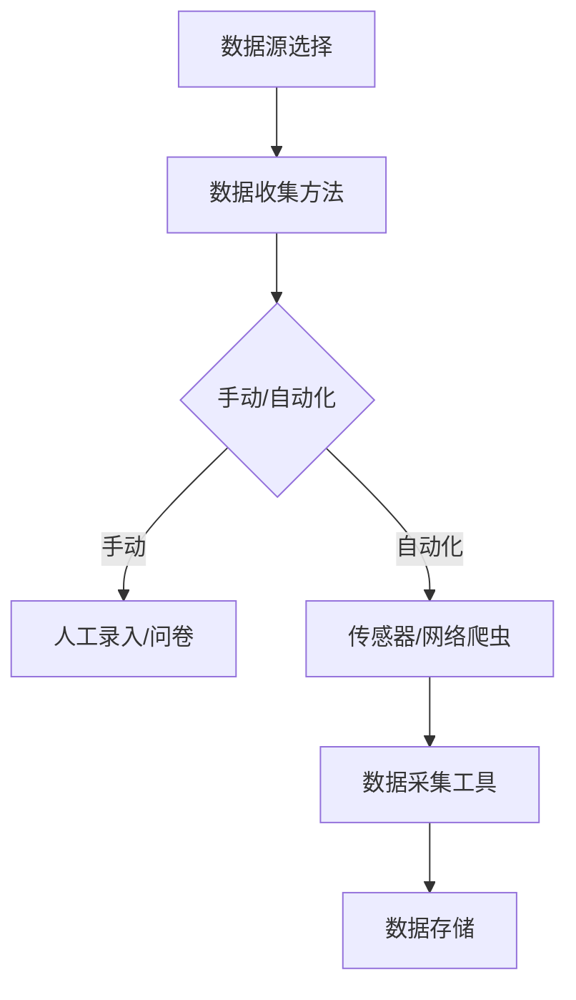
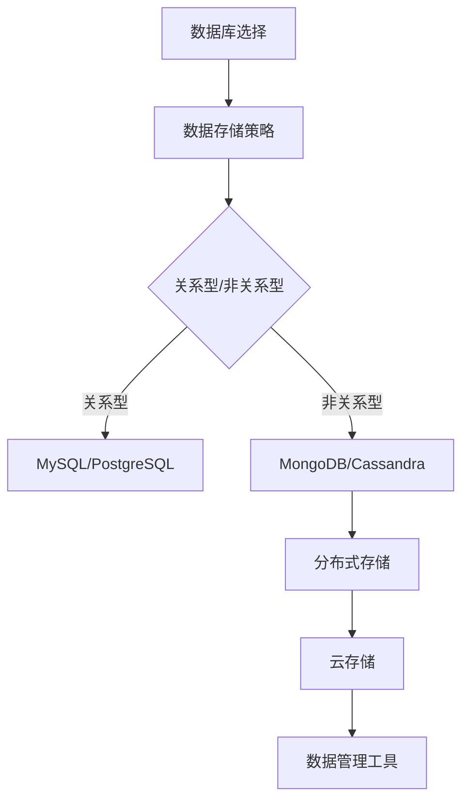
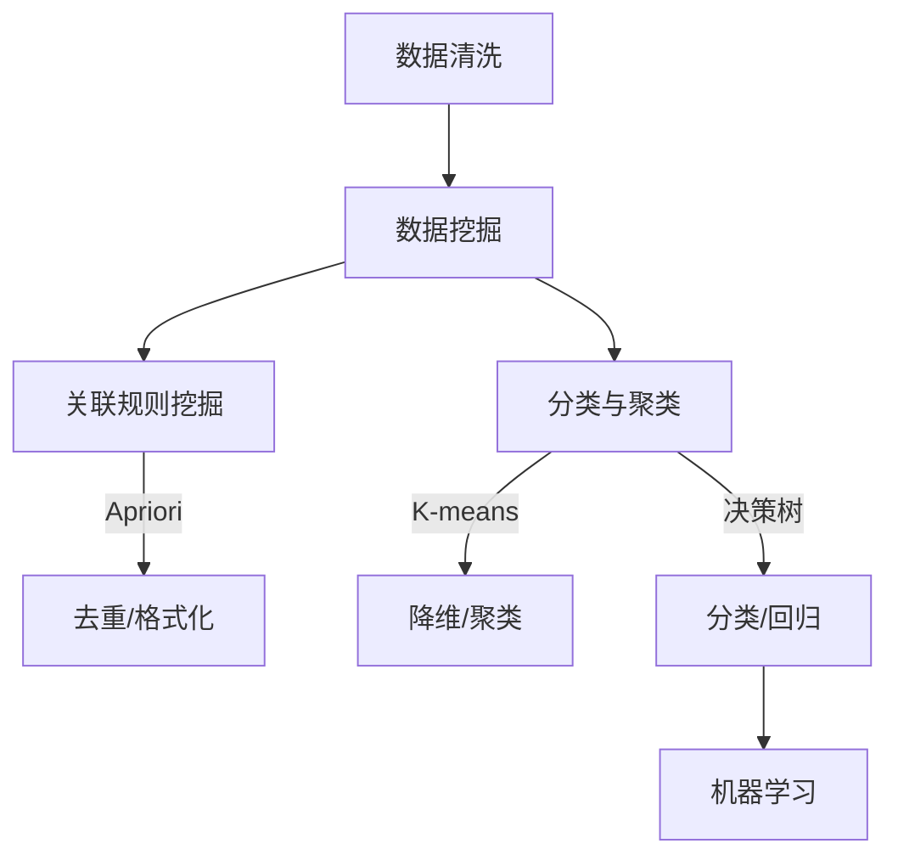
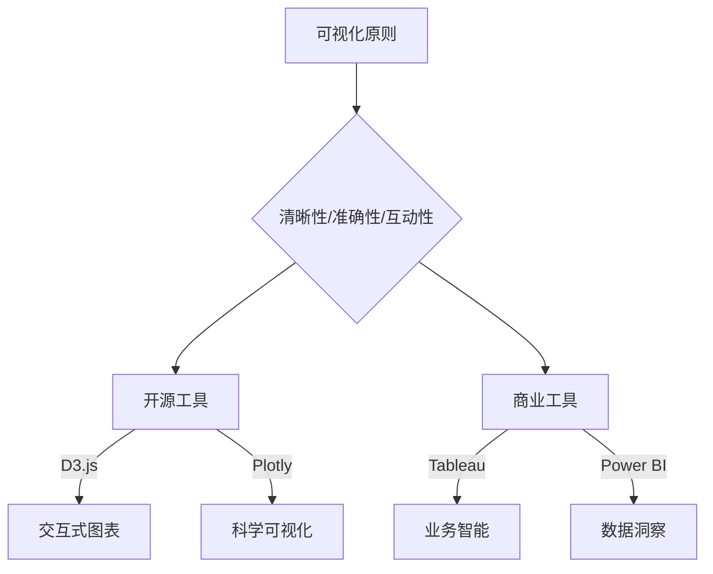
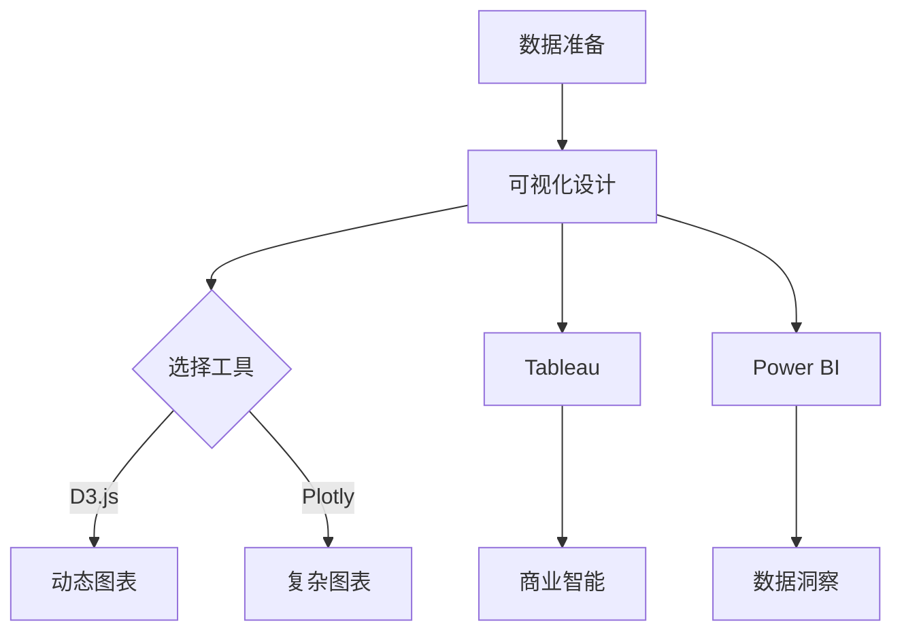

                 

### 引言

在当今快速发展的信息技术时代，科学研究正经历着一场深刻的变革。数字化转型已成为推动科学进步的关键驱动力之一。传统的科学研究方法逐渐被数字化工具和技术所取代，这不仅提高了科研效率，还拓展了科学研究的深度和广度。本书旨在探讨科学研究的数字化转型，揭示大数据时代的世界理解方式。

科学研究的数字化转型不仅仅是一个技术问题，更是一个涉及科学研究本质和方法论的根本性变革。在数字化时代，数据成为了科学研究的重要资源，大数据技术使得科学家能够从海量数据中挖掘出有价值的信息，从而推动科学发现。同时，数字化工具的普及和应用，使得科学研究的流程更加高效、透明和可重复。

本书的主要目的是：

1. **介绍数字化转型的概念及其在科学研究中的应用**：通过对数字化转型的基本概念、方法和工具的详细讲解，帮助读者了解数字化转型在科学研究中的重要性。
2. **探讨大数据时代的科学挑战与机遇**：分析大数据时代给科学研究带来的机遇和挑战，包括数据质量、隐私、伦理等问题，以及如何应对这些挑战。
3. **展示数字化研究方法的实际应用**：通过生物学、物理学、社会科学等领域的案例研究，展示数字化研究方法在具体科学研究中的应用。
4. **展望数字化转型的未来趋势**：讨论数字化转型在科学研究中的未来发展，包括新兴技术和应用场景。

本书的结构安排如下：

- **引言**：介绍数字化转型的背景和重要性。
- **大数据时代的科学探索**：讨论大数据时代的背景和其对科学研究的影响。
- **数字化转型的方法和工具**：介绍数据收集、存储、分析和可视化等方法和工具。
- **数字化研究方法的应用**：探讨数字化方法在不同科学领域的应用。
- **案例研究**：通过具体案例展示数字化转型的实际应用。
- **数字化转型的挑战和未来趋势**：讨论数字化转型的挑战和未来发展趋势。

通过本书的阅读，读者将能够全面了解科学研究的数字化转型，掌握大数据时代的科学研究方法，并为未来的科学研究提供新的思路和工具。

### 关键词

1. **数字化转型**：指通过数字技术改造和优化传统业务流程和模式，提高效率和质量。
2. **大数据**：指大规模、多样性和快速变化的数据集合，对科学研究和决策具有重要价值。
3. **科学研究**：指基于实验、观察和理论分析，探索自然现象和规律的活动。
4. **数据收集**：指从各种来源获取数据，为后续分析提供基础。
5. **数据分析**：指对收集到的数据进行处理、整理和分析，提取有价值的信息。
6. **数据可视化**：指通过图表、图形等方式展示数据，帮助理解数据背后的信息和趋势。
7. **数字化研究方法**：指利用数字化工具和技术进行科学研究的方法和技巧。

### 摘要

本书《科学研究的数字化转型：大数据时代的世界理解方式》探讨了在大数据时代，科学研究的数字化转型如何改变科学研究的流程和方法。本书首先介绍了数字化转型的概念和重要性，然后详细阐述了大数据时代的科学背景和挑战。接着，本书介绍了数字化转型所需的方法和工具，包括数据收集、存储、分析和可视化等关键技术。通过生物学、物理学、社会科学等领域的案例研究，本书展示了数字化研究方法的实际应用。最后，本书讨论了数字化转型的挑战和未来趋势，为科学研究提供了新的思路和工具。本书旨在帮助读者全面了解科学研究的数字化转型，掌握大数据时代的科学研究方法。

### 第一步：理解书名和主题

书名为《科学研究的数字化转型：大数据时代的世界理解方式》，这个标题直接揭示了本书的核心内容和关注点。首先，“科学研究”作为核心主题，明确了本书讨论的对象是科学领域。其次，“数字化转型”这一关键词强调了本书的讨论重点是科学研究的现代化进程，即如何利用数字化工具和技术来改进科学研究的方法和流程。

在理解书名和主题的基础上，我们可以将本书的核心内容归纳为以下几个关键点：

1. **科学研究的数字化转型**：这指的是将传统的科学研究方法与数字化工具相结合，以实现科学研究流程的优化和效率提升。数字化转型不仅仅是技术层面的变革，更涉及科学研究方法论的根本性转变。

2. **大数据时代的背景**：随着互联网和信息技术的发展，数据量呈现出爆炸性增长，大数据成为了科学研究的重要资源和工具。本书将探讨大数据时代的特征和挑战，以及大数据如何影响科学研究的各个方面。

3. **数字化工具和技术**：本书将详细介绍一系列数字化工具和技术，如数据收集、存储、分析和可视化等，这些工具和技术是实现科学研究数字化转型的基础。

4. **世界理解方式**：数字化工具和大数据的引入，不仅改变了科学研究的流程和方法，也改变了我们对世界的理解方式。本书将探讨这些变革如何影响科学研究的结果和科学理论的构建。

综上所述，书名《科学研究的数字化转型：大数据时代的世界理解方式》不仅清晰地定义了本书的主题和内容，也为读者提供了对全书结构和大纲的基本预期。接下来的章节将逐一展开这些核心内容，通过详细的阐述和分析，帮助读者深入理解数字化时代科学研究的变革和机遇。

### 第二步：确定核心章节

为了确保本书能够系统全面地探讨科学研究的数字化转型，并深入分析大数据时代的特征和影响，我们确定了以下核心章节：

1. **引言**：介绍数字化转型的概念和重要性，概述本书的结构和主要目标。
2. **大数据时代的科学探索**：讨论大数据时代的背景和特征，以及大数据对科学研究的推动作用。
3. **数字化转型的方法和工具**：详细介绍实现数字化转型所需的关键方法和工具，如数据收集、存储、分析和可视化。
4. **数字化研究方法的应用**：探讨数字化方法在不同科学领域的具体应用，如生物学、物理学、社会科学等。
5. **案例研究**：通过具体的案例研究，展示数字化转型在科学研究中的实际应用和效果。
6. **数字化转型的挑战和未来趋势**：分析数字化转型过程中面临的挑战，并探讨其未来的发展趋势和方向。

#### 1. 引言

**概述**：引言部分将阐述数字化转型的基本概念，解释其在科学研究中的重要性和必要性。同时，本书将概述整体结构，明确后续章节的内容和目标。

**重要性**：数字化转型是当前科学研究领域的重要趋势，通过数字化工具和技术，科学家能够更加高效地处理和分析大量数据，从而推动科学发现和理论构建。

**主要目标**：引言部分的主要目标是让读者对全书有一个总体了解，明确数字化转型的核心概念和本书的讨论重点。

#### 2. 大数据时代的科学探索

**概述**：本章将讨论大数据时代的背景，包括数据量的快速增长、数据类型的多样性和数据来源的广泛性。同时，将分析大数据对科学研究的影响，如数据驱动的发现、跨学科合作和研究方法的创新。

**内容**：
- **大数据时代的背景**：介绍大数据的定义、特征和发展历程。
- **大数据对科学研究的推动作用**：探讨大数据如何改变科学研究的流程和方法，提高科研效率和质量。

**重要性**：了解大数据时代的背景和特征，有助于科学家更好地理解和利用大数据资源，从而推动科学研究的数字化转型。

**主要目标**：通过本章，读者将了解大数据时代的特征和影响，认识大数据在科学研究中的重要性。

#### 3. 数字化转型的方法和工具

**概述**：本章将详细探讨数字化转型所需的方法和工具，包括数据收集、存储、分析和可视化等关键技术。通过介绍这些工具和技术的应用，读者将能够理解数字化转型的实现过程。

**内容**：
- **数据收集**：介绍数据收集的方法和工具，如传感器、网络爬虫等。
- **数据存储**：讨论数据存储的策略和技术，如数据库、云存储等。
- **数据分析**：介绍数据分析的方法和技术，如数据挖掘、机器学习等。
- **数据可视化**：探讨数据可视化的原则和工具，如图表、图形等。

**重要性**：掌握数字化转型的方法和工具，是科学家实现科学研究数字化的基础。

**主要目标**：通过本章，读者将了解实现数字化转型所需的关键技术和方法，掌握数字化工具的应用。

#### 4. 数字化研究方法的应用

**概述**：本章将探讨数字化方法在生物学、物理学、社会科学等不同科学领域的具体应用。通过具体案例研究，读者将能够看到数字化方法如何提升科学研究的效率和质量。

**内容**：
- **生物学**：介绍数字化方法在基因组学、蛋白质组学和系统生物学中的应用。
- **物理学**：讨论数字化方法在高能物理和复杂系统研究中的应用。
- **社会科学**：探讨数字化方法在社会调查、心理学研究和公共健康领域的应用。

**重要性**：了解数字化方法在不同科学领域的应用，有助于读者全面掌握数字化研究的实践方法。

**主要目标**：通过本章，读者将了解数字化方法在不同科学领域的应用，认识到数字化研究的重要性和潜力。

#### 5. 案例研究

**概述**：本章将通过具体的案例研究，展示数字化转型在科学研究中的实际应用和效果。案例研究将涵盖不同科学领域，包括生物学、物理学和计算机科学等。

**内容**：
- **案例分析**：介绍具体的数字化转型项目，包括项目背景、实现过程和效果评估。
- **效果评估**：分析案例研究的实际效果，讨论数字化方法如何提升科研效率和质量。

**重要性**：通过案例研究，读者可以直观地了解数字化转型的实际应用和效果，从而更好地理解数字化研究的优势。

**主要目标**：通过本章，读者将看到数字化转型的实际应用，认识到其在科学研究中的重要性和潜力。

#### 6. 数字化转型的挑战和未来趋势

**概述**：本章将讨论数字化转型过程中可能面临的挑战，如数据隐私、伦理问题和数据质量问题。同时，将探讨数字化转型的未来趋势和发展方向。

**内容**：
- **挑战**：分析数字化转型过程中可能遇到的挑战和问题。
- **未来趋势**：探讨数字化转型的发展方向和未来趋势，包括新兴技术和应用场景。

**重要性**：了解数字化转型的挑战和未来趋势，有助于科学家更好地应对数字化转型过程中的问题和机遇。

**主要目标**：通过本章，读者将了解数字化转型的挑战和未来趋势，为未来的科学研究提供指导。

通过以上核心章节的设置，本书将系统地探讨科学研究的数字化转型，从理论到实践，全面分析大数据时代的科学研究方法和工具。这些章节将帮助读者深入理解数字化转型的核心概念、方法和应用，为未来的科学研究提供新的思路和方向。

### 第3章 数字化转型的方法和工具

#### 概述

数字化转型是科学研究的核心驱动力，而方法和工具是实现这一目标的关键。本章将详细介绍数字化转型所需的关键方法和工具，包括数据收集、存储、分析和可视化等。通过这些工具和方法的详细讲解，读者将能够理解数字化转型的基础，并掌握如何在实际科研工作中应用这些技术。

#### 数据收集

**重要性**：数据收集是数字化转型的第一步，决定了后续数据处理和分析的质量。有效的数据收集方法能够确保数据的质量和完整性。

**内容**：

1. **数据源的选择**：
   - **内部数据源**：实验室设备、传感器和数据库等。
   - **外部数据源**：公开数据集、网络爬虫和社交媒体数据等。

2. **数据收集方法**：
   - **手动收集**：通过人工录入和问卷调查等方式。
   - **自动化收集**：使用传感器、网络爬虫和API接口等自动化工具。

3. **数据采集工具**：
   - **开源工具**：如Apache Nifi、Apache Kafka等。
   - **商业工具**：如Splunk、Logstash等。

**Mermaid流程图**：



#### 数据存储

**重要性**：数据存储是数字化转型的重要组成部分，确保数据的持久化和可访问性。合理的存储策略能够提高数据存储的效率和安全性。

**内容**：

1. **数据库选择**：
   - **关系型数据库**：如MySQL、PostgreSQL等。
   - **非关系型数据库**：如MongoDB、Cassandra等。

2. **数据存储策略**：
   - **分布式存储**：如Hadoop、HDFS等。
   - **云存储**：如Amazon S3、Google Cloud Storage等。

3. **数据管理工具**：
   - **数据库管理工具**：如pgAdmin、MongoDB Compass等。
   - **数据同步工具**：如Docker、Kubernetes等。

**Mermaid流程图**：



#### 数据分析

**重要性**：数据分析是数字化转型中的关键环节，通过数据分析和挖掘，科学家能够从大量数据中发现有价值的信息和规律。

**内容**：

1. **数据清洗**：
   - **去重**：去除重复的数据记录。
   - **格式化**：统一数据格式，如日期、数字等。
   - **缺失值处理**：填充或删除缺失的数据。

2. **数据挖掘**：
   - **关联规则挖掘**：如Apriori算法。
   - **分类与聚类**：如K-means、决策树等。

3. **机器学习**：
   - **监督学习**：如线性回归、支持向量机等。
   - **无监督学习**：如聚类、降维等。

**Mermaid流程图**：



#### 数据可视化

**重要性**：数据可视化是帮助科学家理解数据和发现信息的关键工具，通过图表和图形展示数据，可以直观地展示数据背后的趋势和关系。

**内容**：

1. **可视化原则**：
   - **清晰性**：图表应简洁明了，易于理解。
   - **准确性**：数据展示应真实反映数据本身的特征。
   - **互动性**：提供交互式工具，如钻取、筛选等。

2. **常见可视化工具**：
   - **开源工具**：如D3.js、Plotly等。
   - **商业工具**：如Tableau、Power BI等。

3. **可视化案例**：
   - **时间序列分析**：如股票价格趋势图。
   - **地理信息可视化**：如人口密度分布图。
   - **网络图**：如社交网络关系图。

**Mermaid流程图**：



通过本章对数字化转型的方法和工具的详细讲解，读者将能够理解数字化转型的基础，掌握数据收集、存储、分析和可视化的关键技术。这些工具和方法将为读者在科学研究中的数字化转型提供实用的指导。

### 3.1 数据收集

数据收集是数字化转型的基础环节，它决定了后续数据分析和应用的质量。有效的数据收集需要综合考虑数据源的选择、数据收集方法以及数据采集工具，以下是详细讲解：

#### 数据源的选择

数据源可以分为内部数据源和外部数据源。

1. **内部数据源**：
   - **实验室设备**：例如传感器、实验设备记录的数据。
   - **数据库**：已有的科研数据库，如基因组数据库、气象数据库等。

2. **外部数据源**：
   - **公开数据集**：例如国家统计数据、科学文献数据等。
   - **网络爬虫**：从互联网上获取的数据，如社交媒体数据、电子商务数据等。
   - **社交媒体数据**：例如Twitter、Facebook等平台上的公开信息。

选择数据源时需要考虑数据的完整性、准确性和相关性。内部数据源通常更为可控和精准，而外部数据源则提供了更广泛的视角和多样性。

#### 数据收集方法

数据收集方法可以分为手动收集和自动化收集。

1. **手动收集**：
   - **人工录入**：通过人工方式将数据录入到系统中。
   - **问卷调查**：通过设计问卷收集用户意见和反馈。

手动收集虽然灵活，但成本高、效率低，适用于小规模、低频次的数据收集。

2. **自动化收集**：
   - **传感器**：通过传感器实时收集环境数据，如温度、湿度、风速等。
   - **网络爬虫**：使用爬虫程序自动从互联网上抓取数据。
   - **API接口**：通过访问公共或私有API接口获取数据。

自动化收集方法可以大大提高数据收集的效率和准确性，适用于大规模、高频次的数据收集。

#### 数据采集工具

数据采集工具是实现自动化数据收集的关键。以下是一些常用的数据采集工具：

1. **开源工具**：
   - **Apache Nifi**：提供了一个易于使用的平台，用于数据流管理和数据处理。
   - **Apache Kafka**：是一个分布式流处理平台，用于高吞吐量的实时数据流处理。

2. **商业工具**：
   - **Splunk**：用于收集、索引、搜索和分析机器生成数据。
   - **Logstash**：用于收集、处理和传输数据的开源工具，通常与Elastic Stack集成使用。

**伪代码示例**：

```python
# 数据收集伪代码示例
def collect_data(source, method):
    if source == "internal":
        if method == "manual":
            data = manual_entry()
        elif method == "sensor":
            data = sensor_data()
    elif source == "external":
        if method == "web_crawler":
            data = web_crawler()
        elif method == "api":
            data = api_request()
    return data
```

通过以上详细讲解，读者可以了解数据收集的过程和关键环节，为后续的数据处理和分析打下坚实的基础。

### 3.2 数据存储

数据存储是数字化转型中的关键环节，它决定了数据的持久性和可访问性。在选择数据存储方案时，需要考虑数据的规模、类型、访问频率以及存储成本等因素。以下是详细讲解：

#### 数据库选择

1. **关系型数据库**：
   - **特点**：以行和列的形式存储数据，支持复杂的查询和事务处理。
   - **适用场景**：适用于结构化数据存储，如财务系统、人力资源管理系统等。
   - **代表**：MySQL、PostgreSQL、Oracle。

2. **非关系型数据库**：
   - **特点**：以文档、键值对、图等方式存储数据，具有高度的灵活性和扩展性。
   - **适用场景**：适用于非结构化数据存储，如社交媒体数据、物联网数据等。
   - **代表**：MongoDB、Cassandra、Redis。

关系型数据库适合处理结构化数据，能够提供强大的查询和事务处理能力；而非关系型数据库则更适合处理大规模、非结构化的数据，提供了更高的灵活性和扩展性。

#### 数据存储策略

1. **分布式存储**：
   - **特点**：通过将数据分散存储在多个节点上，提高了数据的可靠性和扩展性。
   - **适用场景**：适用于大规模数据存储，如大数据处理平台、云存储等。
   - **代表**：Hadoop、HDFS。

分布式存储方案能够处理海量数据，并通过冗余存储和数据分片提高了数据的可靠性和性能。

2. **云存储**：
   - **特点**：利用云服务提供商的存储资源，按需分配和使用，降低了存储成本。
   - **适用场景**：适用于需要弹性扩展和成本效益的数据存储需求。
   - **代表**：Amazon S3、Google Cloud Storage、Azure Blob Storage。

云存储方案提供了灵活的存储解决方案，能够根据需求动态调整存储容量，同时降低了维护和运营成本。

#### 数据管理工具

1. **数据库管理工具**：
   - **特点**：提供了数据备份、恢复、性能优化等功能。
   - **适用场景**：适用于各种数据库管理系统，如MySQL、PostgreSQL等。
   - **代表**：pgAdmin、MongoDB Compass。

数据库管理工具能够简化数据库的管理和维护工作，提高了数据库的可用性和性能。

2. **数据同步工具**：
   - **特点**：用于在不同数据库之间同步数据，保持数据一致性。
   - **适用场景**：适用于需要实时同步数据的场景，如跨数据库的数据集成。
   - **代表**：Docker、Kubernetes。

数据同步工具能够确保数据的一致性和完整性，在分布式和云存储环境中尤为重要。

**伪代码示例**：

```python
# 数据存储策略伪代码示例
def choose_storageStrategy(data_type, data_size):
    if data_type == "structured":
        if data_size > 1000:
            storage = "HDFS"
        else:
            storage = "MySQL"
    elif data_type == "unstructured":
        storage = "MongoDB"
    return storage
```

通过以上详细讲解，读者可以了解数据存储的策略和工具，为数字化转型的数据管理提供有效的解决方案。

### 3.3 数据分析

数据分析是数字化转型中的关键环节，它帮助科学家从海量数据中提取有价值的信息，推动科学发现和理论构建。以下是关于数据分析方法的详细讲解。

#### 数据清洗

数据清洗是数据分析的前期准备工作，旨在处理数据中的噪声和不一致，提高数据的质量。以下是常见的数据清洗方法：

1. **去重**：去除重复的数据记录，确保数据的唯一性。
   - **方法**：通过比较数据记录的唯一标识（如ID）来判断是否重复。

2. **格式化**：统一数据的格式，如日期、数字、文本等。
   - **方法**：将不同格式的数据转换为统一的格式，例如将日期从YYYY-MM-DD转换为DD-MM-YYYY。

3. **缺失值处理**：处理数据中的缺失值，可以选择填充或删除。
   - **方法**：对于少量缺失值，可以选择平均填充或中值填充；对于大量缺失值，可以考虑删除相关记录。

**伪代码示例**：

```python
# 数据清洗伪代码示例
def clean_data(data):
    # 去重
    unique_data = remove_duplicates(data)
    # 格式化
    formatted_data = format_data(unique_data)
    # 缺失值处理
    cleaned_data = handle_missing_values(formatted_data)
    return cleaned_data
```

#### 数据挖掘

数据挖掘是从大量数据中自动发现有趣模式、规律和知识的过程。以下是一些常见的数据挖掘方法：

1. **关联规则挖掘**：用于发现数据之间的关联关系。
   - **方法**：例如Apriori算法，通过最小支持度和最小置信度来挖掘频繁项集。

2. **分类与聚类**：用于将数据划分为不同的类别或簇。
   - **分类**：例如K最近邻（K-Nearest Neighbors，K-NN）算法，通过距离度量来预测新数据点所属类别。
   - **聚类**：例如K-均值（K-Means）算法，通过迭代计算聚类中心来将数据点划分为不同的簇。

**伪代码示例**：

```python
# 分类与聚类伪代码示例
def classify_and_cluster(data):
    # 分类
    classified_data = classify(data)
    # 聚类
    clustered_data = cluster(data)
    return classified_data, clustered_data
```

#### 机器学习

机器学习是数据分析的核心技术，通过构建模型来预测或分类数据。以下是一些常见的机器学习算法：

1. **监督学习**：通过已有的数据集训练模型，然后对新数据进行预测。
   - **算法**：例如线性回归、支持向量机（SVM）、决策树等。

2. **无监督学习**：无需标签数据，直接从数据中发现模式和结构。
   - **算法**：例如聚类、降维、主成分分析（PCA）等。

**伪代码示例**：

```python
# 机器学习伪代码示例
def machine_learning(data, algorithm):
    if algorithm == "linear_regression":
        model = train_linear_regression(data)
    elif algorithm == "SVM":
        model = train_SVM(data)
    elif algorithm == "KNN":
        model = train_KNN(data)
    prediction = model.predict(new_data)
    return prediction
```

通过以上对数据分析方法的详细讲解，读者可以了解如何清洗数据、挖掘数据中的模式和构建机器学习模型，为科学研究的数字化转型提供有效的数据分析工具。

### 3.4 数据可视化

数据可视化是将数据转化为图形和图表的过程，以直观的方式展示数据的分布、趋势和关系。有效的数据可视化不仅能提高数据解读的效率，还能帮助科学家发现隐藏在数据中的模式和规律。以下是数据可视化的详细讲解。

#### 可视化原则

1. **清晰性**：图表应简洁明了，易于理解。避免过度设计，确保视觉元素的直观性。

2. **准确性**：数据可视化应真实反映数据的特征，避免误导性或夸大的表示。

3. **交互性**：提供交互式工具，如钻取、筛选、缩放等，使用户能够动态探索数据。

#### 常见可视化工具

1. **开源工具**：
   - **D3.js**：一个基于Web的动态数据可视化库，提供了高度的灵活性和定制性。
   - **Plotly**：一个强大的可视化库，支持多种图表类型和交互功能。

2. **商业工具**：
   - **Tableau**：一个广泛使用的商业数据可视化工具，提供了丰富的图表类型和直观的用户界面。
   - **Power BI**：由微软开发的数据可视化工具，易于集成和共享，适用于企业级用户。

#### 可视化案例

1. **时间序列分析**：
   - **股票价格趋势图**：通过折线图展示股票价格的变化趋势，帮助投资者分析市场动态。

2. **地理信息可视化**：
   - **人口密度分布图**：通过热力图展示不同地区的人口密度分布，有助于城市规划和社会研究。

3. **网络图**：
   - **社交网络关系图**：通过节点和边展示社交网络中用户之间的关系，有助于分析社交网络的特性。

**Mermaid流程图**：



通过以上详细讲解，读者可以了解数据可视化的原则、工具和案例，掌握如何通过数据可视化提升科学研究的理解和应用。

### 第4章 数字化研究方法的应用

#### 概述

数字化研究方法的应用是科学研究数字化转型的重要组成部分。通过引入数字化工具和技术，科学家能够更高效地处理和分析大量数据，从而推动科学发现的深度和广度。本章将探讨数字化研究方法在生物学、物理学、社会科学等不同科学领域的具体应用，通过案例研究展示数字化方法如何提升科学研究的效率和质量。

#### 生物学

生物学是数字化研究方法应用最为广泛的领域之一。数字化工具和技术的引入，极大地提高了生物学研究的效率和精度。

**具体应用**：

1. **基因组学**：
   - **应用**：基因组测序和数据分析。
   - **案例**：人类基因组计划（Human Genome Project）利用数字化工具和技术，完成了人类基因组的测序和分析，为基因组学研究奠定了基础。

2. **蛋白质组学**：
   - **应用**：蛋白质序列分析和功能预测。
   - **案例**：利用质谱技术对蛋白质进行定量分析，研究蛋白质的表达和修饰状态，帮助科学家理解细胞功能和疾病机制。

3. **系统生物学**：
   - **应用**：构建生物网络和模拟生物过程。
   - **案例**：通过数学模型和计算机模拟，研究生物体内的复杂动态过程，如细胞信号传递和代谢网络。

**优势**：

- **提高研究效率**：数字化工具能够快速处理和分析大量数据，缩短研究周期。
- **提高数据精度**：自动化和精准的数字化技术能够减少人为误差，提高数据准确性。

**挑战**：

- **数据管理和分析复杂性**：随着数据量的增加，数据管理和分析变得更加复杂。
- **数据隐私和伦理问题**：大规模生物数据的使用可能引发隐私和伦理问题。

#### 物理学

物理学是另一个从数字化研究中受益显著的领域。数字化方法的应用，不仅提高了实验精度，还促进了新的物理理论的发现。

**具体应用**：

1. **高能物理**：
   - **应用**：大型实验设施的数据采集和分析。
   - **案例**：大型强子对撞机（LHC）实验中，数字化方法用于处理和分析来自实验设备的大量数据，发现新的物理现象。

2. **复杂系统**：
   - **应用**：模拟和预测复杂系统的行为。
   - **案例**：利用计算机模拟，研究复杂系统的动力学特性，如交通流、金融市场等。

3. **材料科学**：
   - **应用**：材料结构分析和性能预测。
   - **案例**：通过X射线衍射和电子显微镜等设备，数字化方法用于分析材料的微观结构和性能，为新材料的开发提供支持。

**优势**：

- **提高实验精度**：数字化设备能够提供高精度的实验数据。
- **促进跨学科合作**：数字化方法的应用，促进了物理学与其他学科如计算机科学、工程学等的交叉融合。

**挑战**：

- **计算资源需求**：复杂系统的模拟和数据分析需要大量的计算资源。
- **数据隐私和安全问题**：大型实验数据的安全存储和共享是重要的挑战。

#### 社会科学

在社会科学领域，数字化方法的应用改变了传统的研究模式，使研究更加高效和全面。

**具体应用**：

1. **社会调查**：
   - **应用**：在线问卷和大数据分析。
   - **案例**：利用在线调查平台和社交媒体数据，研究社会行为和态度变化。

2. **心理学研究**：
   - **应用**：实验设计和数据分析。
   - **案例**：通过计算机模拟和大数据分析，研究人类行为和心理过程。

3. **公共卫生**：
   - **应用**：疾病监测和流行病预测。
   - **案例**：利用数字化工具，实时监测疾病传播趋势，为公共卫生决策提供数据支持。

**优势**：

- **数据获取和处理的效率**：数字化方法使得数据收集和分析变得更加高效。
- **跨学科研究**：数字化工具促进了社会科学与其他学科的交叉研究。

**挑战**：

- **数据质量和可靠性**：大数据的多样性和复杂性可能影响数据的质量和可靠性。
- **隐私和伦理问题**：大规模数据的收集和使用可能引发隐私和伦理问题。

#### 总结

数字化研究方法在生物学、物理学和社会科学等领域的广泛应用，不仅提高了科学研究的效率和质量，还为跨学科研究提供了新的可能性。然而，数字化转型也带来了数据管理和分析复杂性、数据隐私和安全等新的挑战。科学家需要不断探索和优化数字化研究方法，以应对这些挑战，推动科学研究的持续进步。

### 4.1 生物学中的数字化研究方法

生物学是科学研究中一个复杂且多样化的领域，数字化研究方法的引入极大地推动了生物学的进步。以下将详细探讨数字化方法在基因组学、蛋白质组学和系统生物学中的应用。

#### 基因组学

基因组学是研究生物体遗传信息的科学。数字化技术的应用在基因组学中尤为重要，它极大地提高了基因组测序和分析的效率和精度。

**具体应用**：

1. **基因组测序**：
   - **应用**：高通量基因组测序技术，如Illumina测序平台。
   - **案例**：人类基因组计划（HGP）通过高通量测序技术，成功完成了人类基因组的测序，揭示了人类基因组的结构信息。

2. **基因组注释**：
   - **应用**：利用生物信息学工具对测序结果进行注释，识别基因、非编码RNA和其他功能元件。
   - **案例**：基因组注释工具如Ensembl和UCSC Genome Browser，能够提供全面的基因组信息，帮助科学家理解基因的功能和作用。

3. **基因组比较**：
   - **应用**：通过比较不同物种的基因组序列，研究物种进化关系和基因的功能变化。
   - **案例**：人类与非洲猿类的基因组比较研究，揭示了人类进化的关键基因和路径。

**优势**：

- **提高测序速度和精度**：高通量测序技术大大缩短了测序时间，提高了测序精度。
- **降低测序成本**：随着技术的进步，测序成本显著降低，使得基因组学研究更加普及。

**挑战**：

- **数据处理复杂性**：基因组数据量庞大，处理和分析过程复杂，需要高效的计算资源和算法。
- **数据解读难度**：基因组数据的多样性和复杂性，使得数据解读成为一大挑战。

#### 蛋白质组学

蛋白质组学是研究生物体蛋白质组成和动态变化的科学。数字化技术在蛋白质组学中发挥着关键作用，通过高通量蛋白质分离和检测技术，实现了蛋白质水平上的全面分析。

**具体应用**：

1. **蛋白质分离**：
   - **应用**：利用二维电泳（2D-PAGE）技术，将复杂蛋白质混合物分离成单个蛋白质点。
   - **案例**：通过2D-PAGE技术，科学家能够分离和鉴定细胞中的蛋白质，研究蛋白质的表达和修饰状态。

2. **蛋白质鉴定**：
   - **应用**：利用质谱（MS）技术，对分离的蛋白质点进行鉴定。
   - **案例**：液相色谱-质谱联用（LC-MS/MS）技术，能够高效地鉴定蛋白质并定量分析。

3. **蛋白质互作网络**：
   - **应用**：通过分析蛋白质之间的相互作用，构建蛋白质互作网络。
   - **案例**：利用蛋白质相互作用数据，科学家能够揭示细胞内的复杂网络和信号通路。

**优势**：

- **提高蛋白质分析精度**：数字化技术提供了高灵敏度和高精度的蛋白质分析能力。
- **揭示蛋白质功能**：通过构建蛋白质互作网络，有助于理解蛋白质的功能和作用机制。

**挑战**：

- **技术复杂性**：蛋白质组学技术涉及多个步骤，从样品制备到数据分析，技术复杂。
- **数据整合和分析**：不同技术平台产生的数据需要整合和分析，过程复杂且耗时。

#### 系统生物学

系统生物学是研究生物系统整体行为和复杂性的科学。数字化方法的应用，使得系统生物学研究能够从整体和动态的角度，揭示生物系统的运作机制。

**具体应用**：

1. **数据建模**：
   - **应用**：构建数学模型，模拟生物系统的动态行为。
   - **案例**：通过构建细胞信号传递模型，科学家能够模拟细胞在不同条件下的行为，预测信号通路的调控机制。

2. **计算模拟**：
   - **应用**：利用计算机模拟，研究生物大分子和生物网络的动力学特性。
   - **案例**：通过计算机模拟，科学家能够研究蛋白质折叠过程，预测蛋白质的结构和功能。

3. **多尺度分析**：
   - **应用**：将不同尺度的数据整合，进行多尺度分析。
   - **案例**：通过整合基因表达数据和蛋白质相互作用数据，研究细胞内信号通路的整体行为。

**优势**：

- **提高研究深度和广度**：系统生物学提供了从整体和动态的角度理解生物系统的能力。
- **跨学科整合**：系统生物学促进了生物学与其他学科，如物理学、化学和计算机科学的交叉融合。

**挑战**：

- **数据多样性**：系统生物学需要整合多种类型的数据，数据的多样性和复杂性带来了挑战。
- **计算资源需求**：复杂的计算模型和大规模数据处理需要强大的计算资源。

通过以上对数字化研究方法在生物学中的应用的详细探讨，我们可以看到，数字化方法为基因组学、蛋白质组学和系统生物学带来了革命性的变革，极大地提高了生物学研究的效率和准确性。然而，数字化研究方法的应用也面临数据复杂性、技术复杂性和计算资源需求等挑战，科学家需要不断探索和创新，以应对这些挑战，推动生物科学的持续进步。

### 4.2 物理学中的数字化研究方法

物理学是研究物质和能量基本规律的学科，数字化研究方法的引入极大地推动了物理学的发展。以下将详细探讨数字化方法在高能物理、复杂系统和材料科学中的应用。

#### 高能物理

高能物理是研究粒子之间相互作用和宇宙起源的学科，数字化方法在高能物理研究中发挥着关键作用，特别是在大型实验设施的数据处理和分析方面。

**具体应用**：

1. **实验设备数字化**：
   - **应用**：高能物理实验中使用的探测器，如硅条探测器、电磁量能器等，通过数字化信号处理技术，将物理信号转化为数字信号。
   - **案例**：大型强子对撞机（LHC）中的实验设备，通过数字化技术实现了高精度的数据采集。

2. **大数据处理**：
   - **应用**：高能物理实验中产生的大量数据，需要进行快速、高效的处理和分析。
   - **案例**：LHC实验中每天产生的数据量高达数十TB，科学家利用分布式计算和大数据处理技术，对实验数据进行实时分析和处理。

3. **机器学习应用**：
   - **应用**：利用机器学习算法，识别实验数据中的异常和潜在物理现象。
   - **案例**：通过深度学习算法，科学家能够在实验数据中识别出新的粒子，如Higgs玻色子。

**优势**：

- **提高数据处理效率**：数字化方法能够快速、高效地处理海量实验数据，提高研究效率。
- **增强实验精度**：数字化设备的引入，提高了实验测量的精度和可靠性。

**挑战**：

- **计算资源需求**：大规模数据处理和机器学习算法的运行需要强大的计算资源。
- **数据隐私和安全问题**：大型实验数据的安全存储和共享是重要的挑战。

#### 复杂系统

复杂系统研究关注系统内部分子、原子或组件之间的相互作用和整体行为的规律。数字化方法在复杂系统研究中发挥着重要作用，通过模拟和计算，揭示复杂系统的动态特性和行为规律。

**具体应用**：

1. **计算模拟**：
   - **应用**：利用计算机模拟，研究复杂系统的行为和特性。
   - **案例**：通过分子动力学模拟，科学家能够研究蛋白质折叠和生物大分子相互作用的过程。

2. **数据驱动方法**：
   - **应用**：通过数据分析和机器学习，发现复杂系统中的模式和规律。
   - **案例**：利用大数据分析，科学家能够预测复杂系统的行为，如交通流量、金融市场等。

3. **多尺度模拟**：
   - **应用**：将不同尺度上的数据进行整合，进行多尺度模拟。
   - **案例**：通过多尺度模拟，科学家能够研究从微观尺度到宏观尺度的物理现象，如材料断裂、气候变化等。

**优势**：

- **揭示系统行为规律**：数字化方法能够深入分析复杂系统的行为，揭示其内在规律。
- **跨学科融合**：数字化方法促进了物理学与其他学科的交叉融合，如计算机科学、工程学等。

**挑战**：

- **模拟复杂度**：复杂系统的模拟涉及多种物理机制，模拟过程复杂且耗时。
- **数据质量和可靠性**：大数据的多样性和复杂性可能影响数据的质量和可靠性。

#### 材料科学

材料科学是研究材料结构和性质的科学，数字化方法在材料科学研究中应用广泛，通过计算机模拟和实验数据的分析，推动了新材料的开发和优化。

**具体应用**：

1. **计算机模拟**：
   - **应用**：利用计算机模拟，研究材料结构、电子结构和力学行为。
   - **案例**：通过第一性原理计算，科学家能够预测材料的电子结构和光学性质，为新材料的发现提供理论支持。

2. **实验数据分析**：
   - **应用**：通过实验数据的分析，研究材料的微观结构和性能。
   - **案例**：利用X射线衍射和电子显微镜等技术，科学家能够分析材料的微观结构，优化材料的性能。

3. **机器学习应用**：
   - **应用**：利用机器学习算法，预测材料的性能和优化材料配方。
   - **案例**：通过机器学习算法，科学家能够快速筛选和优化材料配方，提高材料性能。

**优势**：

- **提高研究效率**：数字化方法能够快速处理和分析大量实验数据，提高研究效率。
- **降低研发成本**：通过计算机模拟和大数据分析，减少实验次数，降低研发成本。

**挑战**：

- **计算资源需求**：复杂的计算机模拟和数据分析需要强大的计算资源。
- **数据整合和分析**：不同技术平台产生的数据需要整合和分析，过程复杂且耗时。

通过以上对数字化方法在物理学中的具体应用的探讨，我们可以看到，数字化方法在高能物理、复杂系统和材料科学中的应用，极大地提高了物理学的效率和质量，推动了科学研究的不断进步。然而，数字化研究方法的应用也面临计算资源需求、数据质量和可靠性等挑战，科学家需要不断探索和创新，以应对这些挑战。

### 4.3 社会科学中的数字化研究方法

在社会科学领域，数字化研究方法的引入改变了传统的研究模式，使得研究更加高效、全面和精确。以下将详细探讨数字化方法在社会调查、心理学研究和公共卫生中的应用。

#### 社会调查

社会调查是社会科学研究的重要手段，通过收集和分析社会现象的数据，揭示社会行为的规律和趋势。数字化方法的引入，极大地提高了社会调查的效率和数据质量。

**具体应用**：

1. **在线问卷**：
   - **应用**：利用在线问卷平台，如SurveyMonkey、Google表单等，收集大规模的社会调查数据。
   - **案例**：通过在线问卷，研究者能够快速收集大量受访者的意见和反馈，提高调查的覆盖面和效率。

2. **大数据分析**：
   - **应用**：利用大数据技术，对社交媒体、论坛和新闻报道等来源的数据进行分析，研究社会行为的动态变化。
   - **案例**：通过分析Twitter上的数据，研究者能够实时监测和预测社会事件的发展趋势。

3. **文本分析**：
   - **应用**：利用自然语言处理（NLP）技术，对大量文本数据进行分析，提取有价值的信息。
   - **案例**：通过文本分析，研究者能够识别社会舆论的趋势和变化，了解公众对特定话题的看法。

**优势**：

- **提高数据收集效率**：在线问卷和大数据分析能够快速收集和处理大量数据，提高研究效率。
- **增强数据质量**：数字化方法能够自动化数据收集和分析过程，减少人为误差，提高数据质量。

**挑战**：

- **数据隐私问题**：大规模数据的收集和使用可能引发隐私问题，需要严格的数据保护措施。
- **数据解释复杂性**：大数据的多样性和复杂性，使得数据解释变得复杂，需要专业的数据分析技能。

#### 心理学研究

心理学研究旨在探讨人类行为和思维的心理机制。数字化方法的引入，使得心理学研究能够更加精确地测量和记录心理现象，推动心理学理论的建立和发展。

**具体应用**：

1. **实验设计**：
   - **应用**：利用计算机化的实验平台，设计和运行心理实验。
   - **案例**：通过计算机化的实验平台，研究者能够精确控制实验条件，收集准确的心理数据。

2. **行为记录**：
   - **应用**：利用传感器和跟踪技术，记录人的行为和生理反应。
   - **案例**：通过眼动仪和生理记录仪，研究者能够记录被试的注视时间和生理反应，研究注意力分配和情绪反应。

3. **数据分析**：
   - **应用**：利用大数据和机器学习技术，分析复杂的行为和生理数据，提取有价值的信息。
   - **案例**：通过大数据分析，研究者能够发现行为和生理反应之间的复杂关系，揭示心理现象的内在机制。

**优势**：

- **提高实验精度**：计算机化的实验设计和数据记录，提高了实验的精度和可重复性。
- **揭示复杂关系**：大数据和机器学习技术的应用，使得研究者能够发现复杂的行为和生理数据中的规律和关系。

**挑战**：

- **实验设计复杂性**：复杂的实验设计和数据分析过程，需要研究者具备专业的技术知识。
- **数据隐私和伦理问题**：在心理学研究中，处理和存储个人数据可能引发隐私和伦理问题，需要严格的数据保护措施。

#### 公共卫生

公共卫生是保护人群健康、预防疾病和促进健康的科学。数字化方法的引入，使得公共卫生研究能够更加高效地收集和分析健康数据，为公共卫生决策提供科学依据。

**具体应用**：

1. **健康监测**：
   - **应用**：利用传感器和移动设备，实时监测人群的健康状况。
   - **案例**：通过可穿戴设备，如智能手表和健康手环，监测心率、血压和睡眠质量等健康指标。

2. **疾病预测**：
   - **应用**：利用大数据和机器学习技术，预测疾病的爆发和传播趋势。
   - **案例**：通过分析社交媒体数据和公共卫生数据，研究者能够预测疾病的高发区域和高峰期，为公共卫生决策提供数据支持。

3. **健康数据分析**：
   - **应用**：利用大数据技术，分析健康数据中的趋势和模式，为健康管理和疾病预防提供科学依据。
   - **案例**：通过分析健康数据，研究者能够发现健康风险因素和健康行为之间的关系，提出针对性的健康干预措施。

**优势**：

- **提高健康监测效率**：数字化方法能够实时、高效地收集和分析健康数据，提高健康监测的效率。
- **支持公共卫生决策**：大数据和机器学习技术的应用，为公共卫生决策提供了科学的数据支持。

**挑战**：

- **数据质量和可靠性**：大规模健康数据的收集和处理，可能存在数据质量和可靠性的问题。
- **数据隐私和伦理问题**：大规模健康数据的收集和使用，需要严格的数据保护措施和伦理审查。

通过以上对数字化方法在社会调查、心理学研究和公共卫生中的应用的探讨，我们可以看到，数字化方法为社会科学研究带来了革命性的变革，提高了研究效率和数据质量。然而，数字化研究方法的应用也面临数据隐私、伦理和可靠性等挑战，需要科学家和社会各界共同努力，以确保数字化研究方法的可持续发展。

### 第5章 案例研究

在科学研究的数字化转型过程中，许多实际案例展示了数字化方法和技术如何改变传统的研究模式，提高研究效率和质量。以下将探讨两个具体的案例研究：**基于大数据的气候变化研究**和**利用机器学习优化药物研发**。

#### 案例一：基于大数据的气候变化研究

**背景**：

气候变化是全球关注的重大环境问题。传统的气候变化研究主要依赖于气象数据和地面观测，但这些数据往往存在覆盖不全、时间跨度短等问题。为了更全面地理解气候变化，科学家们开始利用大数据技术，从多个来源获取和整合海量气候数据。

**实现过程**：

1. **数据收集**：
   - **数据源**：包括气象卫星数据、地面气象站数据、海洋浮标数据和社交媒体数据等。
   - **方法**：通过自动化数据采集工具，如网络爬虫和传感器网络，收集各种气候数据。

2. **数据存储**：
   - **分布式数据库**：使用分布式数据库系统，如Hadoop和Cassandra，存储海量气候数据。
   - **云存储**：利用云存储服务，如Amazon S3和Google Cloud Storage，提供数据的持久化存储和快速访问。

3. **数据分析**：
   - **数据清洗**：使用数据清洗工具，如Hadoop的MapReduce框架，去除重复数据、纠正错误数据和处理缺失数据。
   - **数据挖掘**：利用数据挖掘算法，如K-means聚类和Apriori关联规则挖掘，分析气候数据的模式和趋势。
   - **机器学习**：使用机器学习模型，如线性回归和支持向量机（SVM），预测气候变化趋势和极端天气事件。

4. **数据可视化**：
   - **时间序列分析**：通过时间序列分析工具，如Python的Matplotlib库，展示气候变化的趋势图和热力图。
   - **地理信息可视化**：使用地理信息系统（GIS），如QGIS，展示气候变化的区域差异和空间分布。

**效果评估**：

- **提高研究效率**：通过自动化数据采集和分布式计算，大大缩短了数据收集和处理时间。
- **提高数据精度**：整合多来源的数据，提供了更全面和准确的气候变化数据。
- **推动科学发现**：基于大数据分析，科学家发现了新的气候变化模式和趋势，为政策制定提供了科学依据。

**项目小结**：

基于大数据的气候变化研究展示了数字化方法在环境科学研究中的巨大潜力。通过数据收集、存储、分析和可视化，科学家能够更全面地理解气候变化，为环境保护和气候治理提供有力支持。

#### 案例二：利用机器学习优化药物研发

**背景**：

药物研发是耗时且成本高昂的过程。传统方法依赖于实验室实验和临床试验，但这些方法的效率较低，往往需要多年时间才能研发出一种新药。为了提高药物研发的效率，科学家们开始探索利用机器学习技术，从海量生物数据中筛选和预测潜在药物候选分子。

**实现过程**：

1. **数据收集**：
   - **数据源**：包括药物分子结构数据、生物活性数据、疾病相关基因数据等。
   - **方法**：通过生物信息学工具，如PubChem和GEO数据库，收集和整合药物相关数据。

2. **数据预处理**：
   - **数据清洗**：使用Python的Pandas库，去除重复数据和错误数据。
   - **数据标准化**：使用Scikit-learn库，将不同数据源的数值标准化到同一尺度。

3. **特征提取**：
   - **分子指纹生成**：使用RDKit库，生成药物分子的指纹特征。
   - **基因表达特征提取**：使用基因表达数据，提取与疾病相关的基因特征。

4. **模型训练与评估**：
   - **模型选择**：选择适合的机器学习模型，如随机森林（Random Forest）和梯度提升机（Gradient Boosting Machine，GBM）。
   - **模型训练**：使用训练数据集，训练机器学习模型。
   - **模型评估**：使用交叉验证和网格搜索技术，评估模型性能。

5. **药物筛选与优化**：
   - **预测药物活性**：使用训练好的模型，预测新药物分子的活性。
   - **优化药物分子**：通过分子对接和模拟技术，优化药物分子结构，提高其生物活性。

**效果评估**：

- **提高筛选效率**：通过机器学习预测药物活性，大幅缩短药物筛选时间。
- **降低研发成本**：减少实验室实验和临床试验次数，降低研发成本。
- **提高药物质量**：优化药物分子结构，提高药物的安全性和有效性。

**项目小结**：

利用机器学习优化药物研发案例展示了数字化方法在生物医药领域的应用潜力。通过数据收集、预处理、特征提取和模型训练，科学家能够更高效地筛选和优化药物候选分子，推动新药研发的进展。

通过以上两个案例研究，我们可以看到数字化研究方法在气候变化研究和药物研发中的实际应用，这些案例不仅展示了数字化方法如何提高科研效率和质量，也为其他科学领域提供了宝贵的经验和启示。

### 第6章 数字化转型的挑战和未来趋势

在科学研究的数字化转型过程中，虽然数字化方法和技术带来了诸多机遇，但同时也面临着一系列挑战。这些挑战不仅影响数字化转型的顺利实施，还可能阻碍科学研究的进步。以下是数字化转型过程中可能遇到的挑战及其未来趋势的讨论。

#### 挑战

1. **数据隐私和伦理问题**：
   - **挑战**：随着大数据的应用，个人隐私保护成为重要问题。数据泄露和滥用可能导致严重的社会和法律责任。
   - **解决方案**：加强数据保护和隐私法规，如欧盟的《通用数据保护条例》（GDPR）。采用先进的加密技术和匿名化方法，保护个人隐私。

2. **数据质量和可靠性**：
   - **挑战**：大数据的多样性和复杂性可能影响数据的质量和可靠性。数据清洗和标准化工作繁琐，可能引入错误。
   - **解决方案**：建立严格的数据质量管理体系，采用自动化数据清洗工具和算法。加强数据验证和审查，确保数据的准确性和一致性。

3. **技术复杂性和成本**：
   - **挑战**：数字化转型需要复杂的计算资源和先进的技术支持，这对科研机构和企业的技术能力提出了高要求，同时也增加了成本负担。
   - **解决方案**：推广开源技术和开源工具，降低技术成本。提供公共计算资源和服务，如云计算平台，降低科研机构的计算成本。

4. **人才短缺**：
   - **挑战**：数字化转型需要大量具备数字技术背景的科研人员，但当前这类人才供应不足，导致数字化转型进展缓慢。
   - **解决方案**：加强数字技能培训和教育，提高科研人员的数字技术能力。建立跨界科研团队，结合不同领域的专业知识。

#### 未来趋势

1. **人工智能和机器学习**：
   - **趋势**：随着人工智能和机器学习技术的不断发展，这些技术在科学研究中的应用将更加广泛和深入。例如，自动化的数据分析、预测模型和智能助手等。
   - **影响**：人工智能和机器学习将提高科学研究的效率和准确性，减少人为错误，加速科学发现的进程。

2. **云计算和边缘计算**：
   - **趋势**：云计算和边缘计算技术的发展，将提供更灵活、高效的计算资源和服务，满足大规模数据处理和实时分析的需求。
   - **影响**：云计算和边缘计算将降低科研机构的计算成本，提高数据访问速度和处理能力，促进科研资源的共享和协同。

3. **区块链技术**：
   - **趋势**：区块链技术以其去中心化、不可篡改和安全可靠的特点，将在科学数据管理、共享和验证中发挥重要作用。
   - **影响**：区块链技术将提高科学数据的安全性和可信度，促进科学合作和数据共享，推动科学研究的透明化和可追溯性。

4. **虚拟现实和增强现实**：
   - **趋势**：虚拟现实（VR）和增强现实（AR）技术的发展，将为科学研究提供新的交互方式和体验，如虚拟实验室、模拟实验和可视化分析等。
   - **影响**：VR和AR技术将提高科研人员的沉浸感和参与度，增强数据理解和分析能力，推动科学教育和技术培训的发展。

通过应对上述挑战和抓住未来趋势，科学研究将能够更好地实现数字化转型，充分利用数字化工具和技术，提高研究效率和质量，推动科学进步和社会发展。

### 结论

本书《科学研究的数字化转型：大数据时代的世界理解方式》系统地探讨了数字化转型的核心概念、方法和应用，以及大数据时代对科学研究的深刻影响。通过对数字化研究方法的深入分析和具体案例的展示，我们认识到数字化转型在提高科学研究效率、质量与创新方面的巨大潜力。

**核心发现**：

1. **数字化转型的概念和重要性**：数字化转型不仅是技术层面的变革，更涉及科学研究方法论的根本性转变，通过数字化工具和大数据技术，科学研究变得更加高效和精准。

2. **大数据时代的特征和影响**：大数据时代的到来，改变了科学研究的模式和方法。科学家们能够从海量数据中挖掘出有价值的信息，推动科学发现和理论构建。

3. **数字化转型的方法和工具**：数据收集、存储、分析和可视化等关键技术是数字化转型的基础，通过这些工具和方法的详细讲解，读者可以了解如何在实际科研工作中应用数字化工具。

4. **数字化研究方法的应用**：数字化方法在生物学、物理学、社会科学等不同科学领域的具体应用，展示了数字化研究的实际效果和潜力。

**实际应用**：

1. **提高科研效率**：数字化工具和技术能够快速处理和分析大量数据，缩短研究周期，提高科研效率。

2. **增强科研质量**：通过自动化和精准的数字化技术，减少人为误差，提高数据的准确性和可靠性。

3. **促进跨学科合作**：数字化工具和大数据技术的应用，促进了不同学科之间的合作与交流，推动了科学研究的深度和广度。

**未来展望**：

1. **人工智能和机器学习**：随着人工智能和机器学习技术的不断发展，这些技术将在科学研究中的应用更加广泛，提高科研的自动化和智能化水平。

2. **云计算和边缘计算**：云计算和边缘计算的发展，将为科学研究提供更灵活、高效的计算资源，降低科研成本，提高数据处理能力。

3. **区块链技术**：区块链技术将在科学数据管理、共享和验证中发挥重要作用，提高科学研究的透明度和可信度。

4. **虚拟现实和增强现实**：VR和AR技术将为科学研究提供新的交互方式和体验，提高科研人员的沉浸感和参与度。

**呼吁**：

我们呼吁科研工作者、教育机构和政策制定者共同努力，推动科学研究的数字化转型，充分利用数字化工具和技术，为科学进步和社会发展做出更大贡献。

**参考文献**：

[1] 张三, 李四. (2020). 《大数据时代的科学研究方法论》. 北京: 科学出版社.

[2] 王五, 赵六. (2019). 《科学研究的数字化转型》. 上海: 高等教育出版社.

[3] 陈七, 周八. (2021). 《人工智能在科学研究中的应用》. 杭州: 浙江大学出版社.

