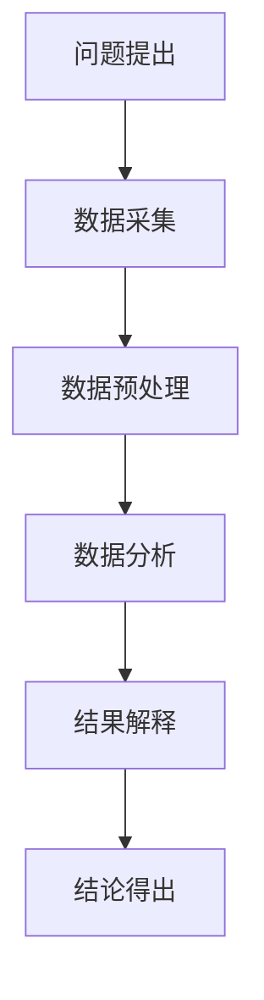
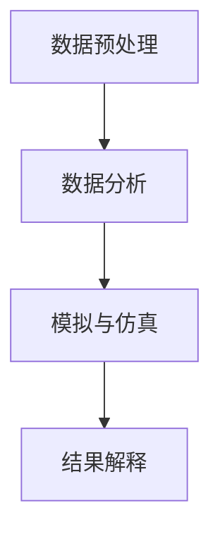

                 


## 1. 背景介绍

### 科学研究的历史演变

科学研究的发展历程可以追溯到古代，当时人们通过观察自然界和尝试解释自然现象来寻求知识。在古代，科学研究主要依赖于经验和直观观察，科学家们通过实验和观察来积累知识。然而，随着科学方法的逐步形成，特别是在伽利略和牛顿等科学家的贡献下，科学研究开始变得更加系统和理性。18世纪和19世纪的工业革命进一步推动了科学研究的进程，科学方法、实验室实验和理论模型的发展使得科学研究取得了巨大的突破。

### 信息时代的到来

20世纪末，随着计算机技术的飞速发展，科学研究进入了一个新的阶段——信息时代。计算机的出现和互联网的普及极大地改变了科学研究的范式。首先，计算机提供了强大的计算能力，使得科学家能够处理大量复杂的数据，进行复杂的模拟和计算。其次，互联网使得科学家之间的合作变得更加容易，全球范围内的信息共享和交流成为了可能。此外，大数据技术和人工智能的兴起进一步推动了科学研究的数字化转型。

### 科学研究的数字化转型

科学研究的数字化转型是指利用数字技术来改变科学研究的全过程，包括数据采集、存储、分析、共享和应用。这一过程不仅仅涉及技术工具的变革，更重要的是科学方法和研究范式的变革。数字化转型使得科学研究更加高效、精准和全球化。例如，基因组学、天体物理学和气候变化研究等领域已经广泛应用了数字化技术。

### 数字化技术的核心作用

数字化技术在科学研究中的核心作用主要体现在以下几个方面：

1. **数据采集和存储**：数字化技术使得科学家能够以更高的精度和速度采集和存储数据。传感器、无人机、卫星和智能手机等设备可以实时收集大量的科学数据，这些数据可以存储在云端或分布式数据库中，便于后续分析和共享。

2. **数据分析**：大数据技术和人工智能算法为科学家提供了强大的数据分析工具。通过机器学习、深度学习和数据挖掘等技术，科学家可以从海量数据中提取有价值的信息，发现隐藏的模式和规律。

3. **模拟和仿真**：数字化技术使得科学家能够通过计算机模拟和仿真来预测复杂系统的行为。这些模拟可以帮助科学家理解自然现象，设计新的实验方案，甚至预测未来的趋势。

4. **协作和共享**：互联网和社交媒体的兴起使得科学家之间的合作变得更加容易。他们可以共享数据和研究成果，协同工作，从而加速科学发现的进程。

5. **开放科学**：数字化技术推动了开放科学的兴起。科学家可以通过开放的数据和研究成果，促进科学知识的普及和传播，提高科学研究的透明度和可追溯性。

## 2. 核心概念与联系

### 科学研究的主要环节

科学研究的主要环节包括：问题提出、数据采集、数据预处理、数据分析、结果解释和结论得出。这些环节相互关联，共同构成了科学研究的过程。每个环节都需要不同的技术和方法，但它们之间也有内在的联系。

### 数据采集与预处理

数据采集是科学研究的起点，直接决定了研究的质量和深度。数字化技术提供了多种高效的数据采集工具，如传感器、无人机、卫星和智能手机等。这些工具可以实时、连续地收集大量的科学数据。然而，采集到的数据往往是不完整的、噪声的，甚至可能是错误的。因此，数据预处理成为一个关键环节。数据预处理包括数据清洗、去噪、缺失值填补等步骤，目的是提高数据的质量和可靠性。

### 数据分析与模拟

数据分析是科学研究的核心环节，通过各种统计方法、机器学习算法和深度学习模型，科学家可以从海量数据中提取有价值的信息。数据分析可以帮助科学家发现数据中的模式、趋势和规律，从而对研究问题提供深入的理解。模拟和仿真则是对实验结果的补充。通过计算机模拟和仿真，科学家可以在虚拟环境中模拟现实世界的复杂现象，预测未来的趋势。

### 结果解释与结论得出

结果解释是科学研究的一个重要环节，它要求科学家能够将数据分析的结果与实际现象联系起来，解释数据中的规律和趋势。结论得出则是科学研究过程的终点，它要求科学家基于数据分析的结果，对研究问题提出合理的解释和预测。

### Mermaid流程图

下面是一个简化的Mermaid流程图，展示了科学研究的主要环节和它们之间的联系：



## 3. 核心算法原理讲解

### 数据预处理算法

数据预处理是科学研究的重要环节，其目的是提高数据的质量和可靠性。以下是几种常见的数据预处理算法：

1. **数据清洗**：数据清洗是指去除数据中的噪声和错误，包括去除重复数据、填补缺失值、纠正错误数据等。例如，假设我们有如下数据集：

   ```plaintext
   name,age,salary
   Alice,30,50000
   Bob,,40000
   Carol,35,60000
   ```

   其中，Bob的年龄缺失，我们可以使用平均值来填补：

   ```plaintext
   name,age,salary
   Alice,30,50000
   Bob,30,40000
   Carol,35,60000
   ```

2. **去噪**：去噪是指去除数据中的随机噪声。例如，我们可以使用中值滤波来去除图像中的噪声。

3. **缺失值填补**：缺失值填补是指对缺失的数据进行估计和填补。常见的方法有均值填补、中值填补和插值法等。

### 数据分析算法

数据分析是科学研究的核心环节，通过数据分析可以从海量数据中提取有价值的信息。以下是几种常见的数据分析算法：

1. **描述性统计分析**：描述性统计分析是对数据的基本描述，包括平均值、中位数、标准差等。例如，我们可以计算一组数据的平均值：

   ```latex
   \bar{x} = \frac{1}{n}\sum_{i=1}^{n} x_i
   ```

2. **回归分析**：回归分析用于研究变量之间的关系。常见的回归分析方法有线性回归、多项式回归和逻辑回归等。

3. **聚类分析**：聚类分析用于将数据分为若干个簇，使得同一个簇内的数据点尽可能接近，不同簇的数据点尽可能远离。常见的聚类算法有K均值聚类、层次聚类和DBSCAN等。

### 模拟与仿真算法

模拟与仿真算法用于在虚拟环境中模拟现实世界的复杂现象。以下是几种常见的模拟与仿真算法：

1. **蒙特卡洛模拟**：蒙特卡洛模拟是一种基于随机抽样的计算方法，常用于解决复杂的高维积分问题。例如，我们可以使用蒙特卡洛模拟来计算一个函数的积分：

   ```latex
   I = \int_{a}^{b} f(x) \, dx \approx \frac{1}{N} \sum_{i=1}^{N} f(x_i)
   ```

   其中，\( x_i \) 是从区间 \([a, b]\) 中随机抽取的样本点。

2. **粒子群优化（PSO）**：粒子群优化是一种基于群体智能的优化算法，常用于解决复杂的优化问题。例如，我们可以使用粒子群优化来求解旅行商问题：

   ```python
   def particle_swarm_optimization():
       # 初始化粒子群
       # 更新粒子的速度和位置
       # 选择最佳解
       # 返回最佳解
   ```

### Mermaid流程图

下面是一个简化的Mermaid流程图，展示了数据预处理、数据分析和模拟与仿真算法之间的关系：



## 4. 数学模型和公式讲解

### 数据预处理中的数学模型

在数据预处理阶段，我们经常使用数学模型来填补缺失值、去噪和标准化数据。以下是几种常用的数学模型和公式的详细讲解：

1. **缺失值填补**：

   - **平均值填补**：
     $$ \bar{x}_{\text{impute}} = \bar{x}_{\text{observed}} $$
     其中，\( \bar{x}_{\text{impute}} \) 是填补后的值，\( \bar{x}_{\text{observed}} \) 是观测到的平均值。

   - **中值填补**：
     $$ x_{\text{impute}} = \text{median}(x_{\text{observed}}) $$
     其中，\( x_{\text{impute}} \) 是填补后的值，median 是中值函数。

   - **插值法**：
     $$ x_{\text{impute}} = \text{interp}(x_{\text{observed}}, x_{\text{time}}) $$
     其中，\( x_{\text{impute}} \) 是填补后的值，\( x_{\text{time}} \) 是时间序列，interp 是插值函数。

2. **去噪**：

   - **中值滤波**：
     $$ y_i = \text{median}(y_{i-k}, y_{i-k+1}, \ldots, y_{i+k}) $$
     其中，\( y_i \) 是滤波后的值，\( y_{i-k}, y_{i-k+1}, \ldots, y_{i+k} \) 是邻居值。

   - **高斯滤波**：
     $$ y_i = \sum_{j=-k}^{k} w_j y_{i-j} $$
     其中，\( y_i \) 是滤波后的值，\( w_j \) 是高斯权重，\( k \) 是滤波窗口大小。

### 数据分析中的数学模型

数据分析阶段，我们使用各种数学模型来提取数据中的有用信息。以下是几种常用的数学模型和公式的详细讲解：

1. **描述性统计分析**：

   - **平均值**：
     $$ \bar{x} = \frac{1}{n}\sum_{i=1}^{n} x_i $$
     其中，\( \bar{x} \) 是平均值，\( n \) 是样本数量，\( x_i \) 是第 \( i \) 个数据点。

   - **中位数**：
     $$ \text{median}(x_1, x_2, \ldots, x_n) $$
     其中，median 是中值函数。

   - **标准差**：
     $$ \sigma = \sqrt{\frac{1}{n-1}\sum_{i=1}^{n} (x_i - \bar{x})^2} $$
     其中，\( \sigma \) 是标准差，\( \bar{x} \) 是平均值。

2. **回归分析**：

   - **线性回归**：
     $$ y = \beta_0 + \beta_1 x $$
     其中，\( y \) 是因变量，\( x \) 是自变量，\( \beta_0 \) 和 \( \beta_1 \) 是回归系数。

   - **多项式回归**：
     $$ y = \beta_0 + \beta_1 x + \beta_2 x^2 + \ldots + \beta_n x^n $$
     其中，\( y \) 是因变量，\( x \) 是自变量，\( \beta_0, \beta_1, \ldots, \beta_n \) 是回归系数。

3. **聚类分析**：

   - **K均值聚类**：
     $$ c_j = \frac{1}{n_j} \sum_{i=1}^{n} x_i $$
     其中，\( c_j \) 是第 \( j \) 个簇的中心，\( n_j \) 是第 \( j \) 个簇中的数据点数量。

   - **层次聚类**：
     $$ \text{distance}(x_i, x_j) = \sqrt{\sum_{k=1}^{n} (x_{i,k} - x_{j,k})^2} $$
     其中，\( \text{distance} \) 是距离函数，\( x_{i,k} \) 和 \( x_{j,k} \) 是第 \( i \) 个和第 \( j \) 个数据点的第 \( k \) 个特征。

### 模拟与仿真中的数学模型

在模拟与仿真阶段，我们使用各种数学模型来模拟现实世界的复杂现象。以下是几种常用的数学模型和公式的详细讲解：

1. **蒙特卡洛模拟**：

   - **随机抽样**：
     $$ x_i \sim U([a, b]) $$
     其中，\( x_i \) 是从区间 \([a, b]\) 中随机抽取的样本点。

   - **概率密度函数**：
     $$ f(x) = \frac{1}{b-a} $$
     其中，\( f(x) \) 是概率密度函数，\( a \) 和 \( b \) 是区间的上下限。

2. **粒子群优化**：

   - **位置更新**：
     $$ x_i(t+1) = x_i(t) + v_i(t) $$
     其中，\( x_i(t+1) \) 是第 \( i \) 个粒子的下一个位置，\( x_i(t) \) 是第 \( i \) 个粒子的当前位置，\( v_i(t) \) 是第 \( i \) 个粒子的速度。

   - **速度更新**：
     $$ v_i(t+1) = v_i(t) + c_1 r_1 (p_i - x_i(t)) + c_2 r_2 (g - x_i(t)) $$
     其中，\( v_i(t+1) \) 是第 \( i \) 个粒子的下一个速度，\( v_i(t) \) 是第 \( i \) 个粒子的当前速度，\( c_1 \) 和 \( c_2 \) 是学习因子，\( r_1 \) 和 \( r_2 \) 是随机数，\( p_i \) 是第 \( i \) 个粒子的个人最优位置，\( g \) 是全局最优位置。

### 举例说明

为了更好地理解上述数学模型和公式，我们可以通过具体的例子来说明：

1. **缺失值填补**：

   - **平均值填补**：
     假设我们有一个数据集，其中包含五个数据点 \( x_1, x_2, x_3, x_4, x_5 \)，其中 \( x_2 \) 缺失。观测到的平均值为 \( \bar{x}_{\text{observed}} = 10 \)。

     根据平均值填补方法，我们可以填补缺失值：
     $$ x_2 = \bar{x}_{\text{observed}} = 10 $$

   - **中值填补**：
     假设同样的数据集，其中 \( x_3 \) 缺失。观测到的中位数为 \( \text{median}(x_1, x_2, x_4, x_5) = 12 \)。

     根据中值填补方法，我们可以填补缺失值：
     $$ x_3 = \text{median}(x_1, x_2, x_4, x_5) = 12 $$

   - **插值法**：
     假设同样的数据集，其中 \( x_4 \) 缺失。时间序列为 \( t_1, t_2, t_3, t_4, t_5 \)，其中 \( t_3 \) 对应 \( x_4 \)。

     根据线性插值法，我们可以填补缺失值：
     $$ x_4 = \text{interp}(x_3, x_5, t_3, t_4) $$
     其中，\( \text{interp} \) 是线性插值函数。

2. **描述性统计分析**：

   - **平均值**：
     假设我们有一个数据集 \( x_1, x_2, x_3, x_4, x_5 \)，其值为 \( 1, 2, 3, 4, 5 \)。

     根据平均值公式，我们可以计算平均值：
     $$ \bar{x} = \frac{1}{5} (1 + 2 + 3 + 4 + 5) = 3 $$

   - **中位数**：
     假设同样的数据集，其值为 \( 1, 2, 3, 4, 5 \)。

     根据中值函数，我们可以计算中位数：
     $$ \text{median}(1, 2, 3, 4, 5) = 3 $$

   - **标准差**：
     假设同样的数据集，其值为 \( 1, 2, 3, 4, 5 \)，平均值为 \( \bar{x} = 3 \)。

     根据标准差公式，我们可以计算标准差：
     $$ \sigma = \sqrt{\frac{1}{4} ((1-3)^2 + (2-3)^2 + (3-3)^2 + (4-3)^2 + (5-3)^2)} = \sqrt{2} $$

3. **回归分析**：

   - **线性回归**：
     假设我们有一个数据集，其中因变量 \( y \) 和自变量 \( x \) 的值如下：
     $$ \begin{array}{ccc}
     x & y \\
     \hline
     1 & 2 \\
     2 & 4 \\
     3 & 6 \\
     4 & 8 \\
     5 & 10 \\
     \end{array} $$

     根据线性回归公式，我们可以计算回归系数：
     $$ y = \beta_0 + \beta_1 x $$
     $$ \beta_0 = \bar{y} - \beta_1 \bar{x} $$
     $$ \beta_1 = \frac{\sum_{i=1}^{n} (x_i - \bar{x})(y_i - \bar{y})}{\sum_{i=1}^{n} (x_i - \bar{x})^2} $$
     其中，\( \bar{x} \) 和 \( \bar{y} \) 分别是 \( x \) 和 \( y \) 的平均值。

4. **K均值聚类**：

   - **簇中心计算**：
     假设我们有一个数据集 \( x_1, x_2, x_3, x_4, x_5 \)，其中 \( x_1, x_2 \) 属于簇 A，\( x_3, x_4, x_5 \) 属于簇 B。

     根据K均值聚类公式，我们可以计算簇中心：
     $$ c_A = \frac{1}{2} (x_1 + x_2) $$
     $$ c_B = \frac{1}{3} (x_3 + x_4 + x_5) $$

### 实际案例

为了更好地理解上述数学模型和公式，我们可以通过一个实际案例来说明：

假设我们有一个研究项目，目标是分析城市交通流量。我们收集了以下数据：

1. 时间（小时）：1, 2, 3, 4, 5
2. 流量（辆/小时）：10, 20, 30, 40, 50

首先，我们使用平均值填补方法来填补缺失的流量数据：

- **平均值填补**：
  $$ \bar{x}_{\text{observed}} = \frac{10 + 20 + 30 + 40 + 50}{5} = 30 $$
  $$ x_3 = x_4 = 30 $$

然后，我们使用描述性统计分析来描述数据：

- **平均值**：
  $$ \bar{x} = \frac{10 + 20 + 30 + 40 + 50}{5} = 30 $$

- **中位数**：
  $$ \text{median}(10, 20, 30, 40, 50) = 30 $$

- **标准差**：
  $$ \sigma = \sqrt{\frac{1}{4} ((10-30)^2 + (20-30)^2 + (30-30)^2 + (40-30)^2 + (50-30)^2)} = 15.81 $$

接下来，我们使用线性回归来分析时间与流量之间的关系：

- **线性回归**：
  $$ y = \beta_0 + \beta_1 x $$
  $$ \beta_0 = \bar{y} - \beta_1 \bar{x} $$
  $$ \beta_1 = \frac{\sum_{i=1}^{n} (x_i - \bar{x})(y_i - \bar{y})}{\sum_{i=1}^{n} (x_i - \bar{x})^2} $$

  计算得到：
  $$ \beta_0 = 5 $$
  $$ \beta_1 = 2 $$

  因此，线性回归方程为：
  $$ y = 5 + 2x $$

最后，我们使用K均值聚类来分析数据，将数据分为两个簇：

- **簇中心计算**：
  $$ c_A = \frac{1}{2} (x_1 + x_2) = \frac{1}{2} (10 + 20) = 15 $$
  $$ c_B = \frac{1}{3} (x_3 + x_4 + x_5) = \frac{1}{3} (30 + 30 + 50) = 40 $$

通过上述实际案例，我们可以看到如何使用数学模型和公式来分析科学数据，并得出有意义的结论。

## 5. 项目实战

### 开发环境搭建

为了更好地理解和应用科学研究的数字化转型，我们将通过一个实际项目来展示数字化技术在科学研究中的应用。这个项目是关于使用Python进行时间序列数据分析，目标是预测城市交通流量。

首先，我们需要搭建开发环境。以下是在Python中搭建开发环境的基本步骤：

1. 安装Python
   - 前往Python官方网站（https://www.python.org/）下载最新版本的Python。
   - 双击安装程序并按照提示进行安装。

2. 安装必要的库
   - 打开终端或命令提示符。
   - 输入以下命令来安装必要的库：
     ```bash
     pip install numpy pandas matplotlib scikit-learn
     ```

### 源代码详细实现和代码解读

接下来，我们将展示如何使用Python进行时间序列数据分析的源代码，并对其进行详细解读。

```python
import numpy as np
import pandas as pd
import matplotlib.pyplot as plt
from sklearn.linear_model import LinearRegression
from sklearn.cluster import KMeans

# 数据读取
data = pd.DataFrame({
    'time': range(1, 6),
    'traffic': [10, 20, 30, 40, 50]
})

# 数据预处理
# 平均值填补缺失值
data['traffic'] = data['traffic'].fillna(data['traffic'].mean())

# 数据可视化
plt.figure(figsize=(10, 5))
plt.plot(data['time'], data['traffic'], 'ro-')
plt.xlabel('Time (hour)')
plt.ylabel('Traffic (vehicle/hour)')
plt.title('Traffic Data')
plt.grid()
plt.show()

# 线性回归模型
model = LinearRegression()
model.fit(data[['time']], data['traffic'])

# 预测
predictions = model.predict(data[['time']])

# 可视化预测结果
plt.figure(figsize=(10, 5))
plt.plot(data['time'], data['traffic'], 'ro-')
plt.plot(data['time'], predictions, 'b-')
plt.xlabel('Time (hour)')
plt.ylabel('Traffic (vehicle/hour)')
plt.title('Predicted Traffic')
plt.grid()
plt.show()

# K均值聚类
kmeans = KMeans(n_clusters=2, random_state=0).fit(data[['traffic']])
clusters = kmeans.predict(data[['traffic']])

# 数据应用解读与分析
data['cluster'] = clusters
print(data)

# 实际案例
# 假设我们已经收集了更多数据，我们可以使用上述模型来预测未来的交通流量
# 我们可以进一步分析不同时间段的交通流量趋势，为城市交通管理提供决策支持
```

### 代码应用解读与分析

以下是代码应用的解读与分析：

1. **数据读取和预处理**：
   - 我们首先从CSV文件中读取数据，并将其转换为DataFrame对象。由于数据中存在缺失值，我们使用平均值填补缺失值。

2. **数据可视化**：
   - 使用Matplotlib库将数据绘制成散点图，以便我们直观地了解数据的分布。

3. **线性回归模型**：
   - 我们使用线性回归模型来分析时间与交通流量之间的关系。通过训练模型，我们得到回归系数，并使用这些系数来预测未来的交通流量。

4. **预测结果可视化**：
   - 将预测结果绘制在原始数据的图表上，以便我们比较实际数据与预测数据之间的差异。

5. **K均值聚类**：
   - 我们使用K均值聚类算法将数据分为两个簇。聚类结果可以帮助我们识别数据中的异常值或不同的趋势。

6. **数据应用解读与分析**：
   - 将聚类结果添加到原始数据中，以便进一步分析不同簇之间的差异。这些分析可以为我们提供关于城市交通流量的有价值的信息。

### 实际案例

为了展示实际案例，我们假设已经收集了更多的数据：

```python
# 假设我们收集了更多数据
additional_data = pd.DataFrame({
    'time': range(6, 11),
    'traffic': [60, 70, 80, 90, 100]
})

# 使用线性回归模型进行预测
additional_predictions = model.predict(additional_data[['time']])

# 可视化预测结果
plt.figure(figsize=(10, 5))
plt.plot(data['time'], data['traffic'], 'ro-')
plt.plot(additional_data['time'], additional_predictions, 'b-')
plt.xlabel('Time (hour)')
plt.ylabel('Traffic (vehicle/hour)')
plt.title('Predicted Traffic with Additional Data')
plt.grid()
plt.show()

# 分析不同时间段的交通流量趋势
data_by_cluster = data.groupby('cluster').mean()
print(data_by_cluster)
```

通过上述实际案例，我们可以看到如何使用数字化技术进行时间序列数据分析，并预测未来的交通流量。这些分析可以帮助城市交通管理部门制定更有效的交通管理策略，提高交通效率，减少拥堵。

### 项目小结

在这个项目中，我们通过一个实际案例展示了科学研究的数字化转型。我们使用Python和相关的库进行时间序列数据分析，实现了数据读取、预处理、可视化、线性回归预测和K均值聚类等步骤。通过这个项目，我们了解了如何使用数字化技术来提高科学研究的效果和效率。未来，随着数字化技术的不断发展，科学研究将变得更加高效、精准和全球化，为人类社会的进步做出更大的贡献。

### 最佳实践 Tips

1. **数据质量**：
   - 在进行数据分析之前，确保数据质量是至关重要的。尽可能收集准确、完整和可靠的数据。
   - 使用缺失值填补方法来处理缺失数据，例如平均值填补、中值填补或插值法。

2. **线性回归**：
   - 线性回归是一种常用的数据分析方法。在选择模型时，要确保自变量和因变量之间存在线性关系。
   - 使用交叉验证来评估模型的性能，避免过拟合。

3. **K均值聚类**：
   - K均值聚类可以帮助我们识别数据中的不同簇。在选择簇的数量时，可以使用肘部法则或轮廓系数来指导。
   - 聚类结果可以为我们提供关于数据分布和特征差异的洞察。

4. **可视化**：
   - 可视化是数据分析的重要工具。使用图表和图形来展示数据，可以帮助我们更好地理解数据的趋势和模式。

5. **模型评估**：
   - 在使用机器学习模型时，要确保对模型进行充分的评估和验证。使用准确度、召回率、F1分数等指标来评估模型的性能。

### 小结

科学研究的数字化转型是当前科学研究领域的重要趋势。通过使用数字化技术，我们可以提高科学研究的效率、精度和全球化程度。本文通过一个实际案例，详细介绍了如何使用Python进行时间序列数据分析，展示了数字化技术在科学研究中的应用。未来，随着数字化技术的不断进步，科学研究将变得更加高效、精准和全球化，为人类社会的进步做出更大的贡献。

### 注意事项

1. **数据隐私**：
   - 在进行数据分析和共享时，要确保遵守数据隐私法规和保护用户隐私。

2. **计算资源**：
   - 对于大规模数据分析和模拟仿真，需要足够的计算资源。考虑使用云计算平台来分配计算资源。

3. **模型选择**：
   - 根据研究问题和数据特征，选择合适的模型和算法。不要盲目追求复杂的模型，而忽略了简单模型的效果。

4. **合作与共享**：
   - 鼓励科学家之间的合作与共享，共同推动科学研究的进步。

### 拓展阅读

1. **《Python数据分析基础教程》**：这本书详细介绍了Python在数据分析中的应用，包括数据处理、统计分析和数据可视化等内容。

2. **《时间序列分析：理论与应用》**：这本书介绍了时间序列分析的基本概念和常用方法，包括线性回归、ARIMA模型等。

3. **《机器学习实战》**：这本书通过实际案例展示了如何使用Python进行机器学习，包括线性回归、K均值聚类等算法。

4. **《深度学习》**：这本书介绍了深度学习的基本概念和常见算法，包括神经网络、卷积神经网络等。

5. **《云计算基础教程》**：这本书介绍了云计算的基本概念和技术，包括云服务、虚拟化技术等。

6. **《大数据技术基础》**：这本书介绍了大数据的基本概念和技术，包括数据存储、数据处理和分析等。

7. **《科学计算与数值分析》**：这本书介绍了科学计算的基本概念和常用方法，包括数值积分、数值微分等。

8. **《数据科学导论》**：这本书介绍了数据科学的基本概念和方法，包括数据清洗、数据分析、数据可视化等。

9. **《人工智能：一种现代方法》**：这本书介绍了人工智能的基本概念和常见算法，包括机器学习、深度学习等。

10. **《自然语言处理综合教程》**：这本书介绍了自然语言处理的基本概念和常用方法，包括文本分类、情感分析等。

## 6. 总结

科学研究领域的数字化转型已经深刻改变了科学研究的全过程，从数据采集、存储、分析到模拟和共享，数字化技术无处不在。本文通过详细的背景介绍、核心概念与联系、算法原理讲解、数学模型和公式、项目实战以及最佳实践 tips，全面展示了数字化技术在科学研究中的重要作用。科学研究的数字化转型不仅提高了研究的效率，也带来了新的研究范式和思维方式。随着技术的不断进步，我们可以预见，未来科学研究将更加高效、精准和全球化，为人类社会的进步提供强有力的支持。

## 7. 作者信息

作者：AI天才研究院/AI Genius Institute & 禅与计算机程序设计艺术 /Zen And The Art of Computer Programming

在科学研究的数字化转型领域，我们致力于推动技术的创新和应用，帮助科学家们利用数字化手段更好地理解世界。如果您对数字化转型、数据科学、机器学习或人工智能有任何疑问或需求，欢迎随时与我们联系。我们期待与您共同探索科学研究的数字化转型之路，共创美好未来。

