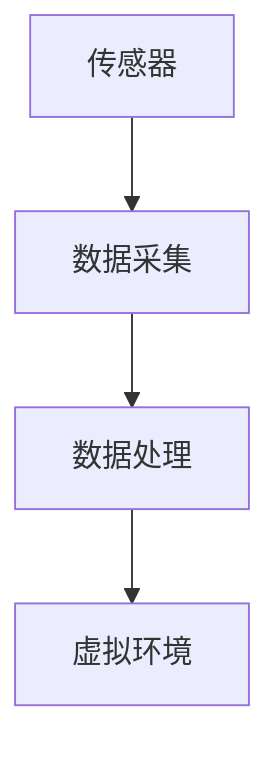
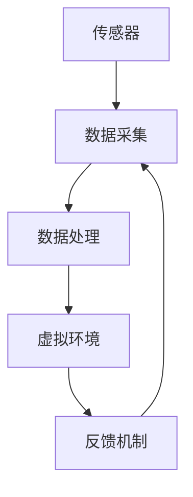
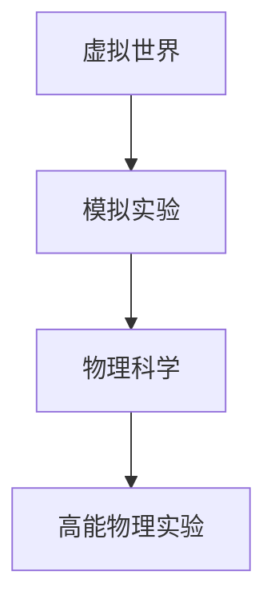
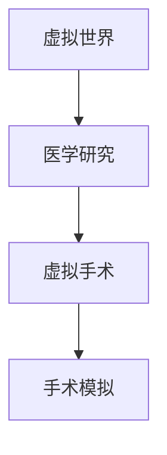
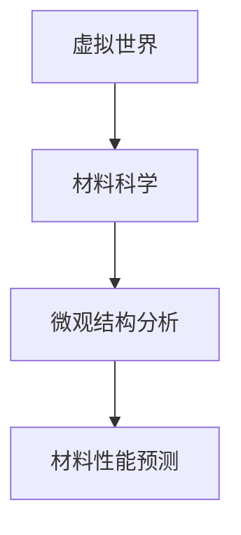
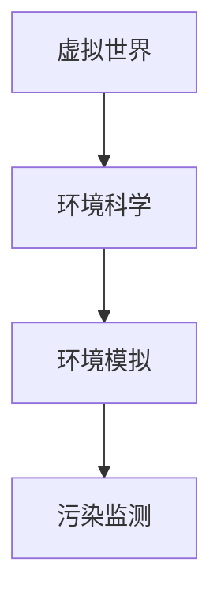
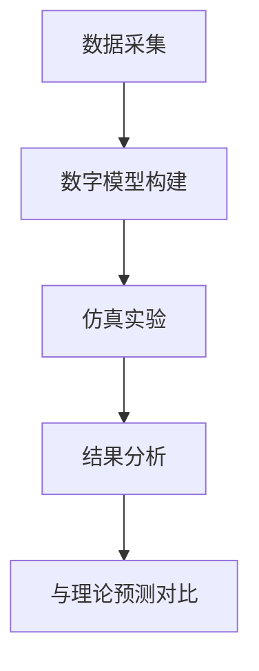
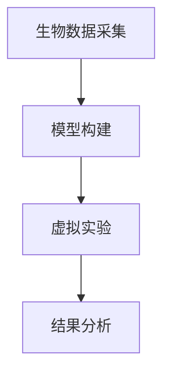
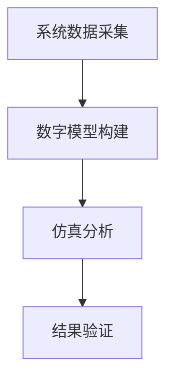

                 


### 引言

#### 什么是数字孪生技术

数字孪生技术（Digital Twin Technology）是指通过构建现实世界实体或系统的数字模型，实现对现实世界实时状态、行为和响应的模拟、监控和优化。这个数字模型不仅包含物理特性，还包括动态行为和交互关系，从而形成一个高度仿真、交互性和可预测性的虚拟世界。数字孪生技术起源于工业领域，主要用于提高产品设计和生产效率。然而，随着虚拟现实、大数据、云计算和物联网等技术的发展，数字孪生技术逐渐扩展到科学研究领域，成为辅助理解和研究现实世界的重要工具。

#### 数字孪生技术在科学研究中的重要性

在科学研究领域，数字孪生技术的重要性体现在以下几个方面：

1. **提高研究效率**：通过数字孪生技术，科学家可以在虚拟环境中进行模拟实验，快速验证理论假设，减少实际实验次数，从而提高研究效率。

2. **降低研究成本**：传统实验往往需要大量的人力和物力资源，而数字孪生技术可以在虚拟环境中进行，显著降低实验成本。

3. **增强实验的可重复性**：数字孪生技术可以确保实验条件的一致性，从而提高实验的可重复性，便于对比分析。

4. **促进跨学科合作**：数字孪生技术可以提供直观的交互界面，便于不同领域的专家进行协作，推动跨学科研究。

5. **支持决策制定**：数字孪生技术可以帮助科学家更好地理解复杂系统的行为，从而为决策制定提供科学依据。

综上所述，数字孪生技术在科学研究中的应用具有重要意义，为科学家提供了强大的研究工具，有望推动科学研究的深入发展。

#### 文章关键词

数字孪生技术、虚拟世界、现实世界、科学研究、效率、成本、可重复性、跨学科合作、决策制定。

#### 文章摘要

本文探讨了数字孪生技术在科学研究中的应用，从数字孪生技术的定义、重要性出发，详细介绍了其在科学研究中的多种应用场景和优势，并通过具体实例分析了数字孪生技术在物理科学、生物医学和工程技术等领域的实际应用效果。最后，对数字孪生技术在科学研究中的挑战和未来展望进行了讨论。

---

## 引言

#### 什么是数字孪生技术

数字孪生技术（Digital Twin Technology）是一种利用数字化模型对现实世界中的物体、系统或过程进行虚拟表示和模拟的技术。这个数字模型不仅包含了物理特性，还包括了动态行为、交互关系和实时数据。通过构建数字孪生，科学家和工程师可以在虚拟环境中对现实世界中的实体进行仿真和分析，从而实现对现实世界的理解和优化。

#### 数字孪生技术在科学研究中的重要性

数字孪生技术在科学研究中的重要性不容忽视。首先，它为科学家提供了一个强大的工具，可以模拟和预测现实世界中的复杂系统行为。这种能力极大地提高了研究的效率，因为科学家可以在虚拟环境中进行实验，而不必依赖于物理实验，从而节省了时间和成本。

其次，数字孪生技术提供了高度的实验可重复性。通过精确的数字化模型，科学家可以确保每次实验的条件都完全一致，从而减少实验误差，提高实验结果的可信度。

此外，数字孪生技术促进了跨学科合作。通过直观的虚拟交互界面，不同领域的专家可以共同探讨问题，分享数据和见解，从而推动科学研究的深入发展。

最后，数字孪生技术为科学决策提供了强有力的支持。通过对虚拟模型的深入分析，科学家可以更好地理解复杂系统的行为，为决策制定提供科学依据。

总之，数字孪生技术在科学研究中的应用，不仅提高了研究的效率、降低了成本，还促进了跨学科合作，并为决策制定提供了科学支持，具有极其重要的意义。

### 数字孪生技术概述

#### 数字孪生的概念

数字孪生（Digital Twin）是通过对现实世界中的物体、系统或过程进行数字化建模，从而形成一个虚拟的数字副本。这个数字副本不仅包含了现实世界的物理特性，如尺寸、形状和材料，还包含了动态行为、交互关系和实时数据。通过这个虚拟副本，科学家和工程师可以在虚拟环境中对现实世界中的实体进行仿真、分析和优化。

数字孪生的核心组成部分包括：

1. **物理孪生**：这是现实世界中的物体、系统或过程，它是数字孪生的基础。

2. **数字模型**：这是对物理孪生的数字化表示，包含了物理特性、动态行为和交互关系。

3. **数据链接**：这是将物理孪生和数字模型连接起来的桥梁，通过实时数据传输，确保数字孪生能够反映物理孪生的实时状态。

4. **虚拟环境**：这是进行仿真和分析的虚拟空间，科学家和工程师可以在其中进行各种操作。

#### 数字孪生的组成部分

1. **物理孪生**

物理孪生是指现实世界中的物体、系统或过程。例如，在一个制造业场景中，一个物理孪生可以是一个机器设备；在医疗领域，一个物理孪生可以是一个病人。物理孪生的特性决定了数字孪生的精度和可靠性。

2. **数字模型**

数字模型是对物理孪生的数字化表示，它通常包括几何模型、物理模型和动态模型。几何模型描述了物理孪生的形状和尺寸，物理模型描述了物理孪生的物理特性，如质量、密度和摩擦系数，动态模型描述了物理孪生的动态行为，如运动、变形和响应。

3. **数据链接**

数据链接是确保物理孪生和数字模型之间实时数据传输的关键组件。通过传感器和其他数据采集设备，物理孪生的实时数据可以被传输到数字模型，从而保持数字孪生的实时更新。

4. **虚拟环境**

虚拟环境是一个用于进行仿真和分析的虚拟空间。在这个虚拟环境中，科学家和工程师可以使用各种工具和软件对数字孪生进行操作，如模拟实验、性能分析和优化。

#### 数字孪生技术发展历程

数字孪生技术起源于20世纪80年代的制造业，主要用于提高产品设计和生产效率。随着计算机技术和仿真技术的不断发展，数字孪生技术逐渐扩展到其他领域，如医疗、能源、交通等。

1. **1980s-1990s：初始阶段**

在20世纪80年代和90年代，数字孪生技术主要应用于产品设计和制造过程。通过构建数字模型，工程师可以在虚拟环境中对产品进行仿真和优化，从而减少物理实验次数。

2. **2000s：数据驱动阶段**

进入21世纪，随着大数据和物联网技术的发展，数字孪生技术开始引入实时数据采集和传输。这使得数字孪生能够更加精确地反映物理孪生的实时状态，从而提高仿真的准确性。

3. **2010s-2020s：集成与优化阶段**

在过去的十几年里，数字孪生技术逐渐与其他技术（如虚拟现实、人工智能和云计算）相结合，形成了更加复杂和智能的数字孪生系统。这些系统不仅可以进行仿真和分析，还可以实现自动化优化和预测。

4. **2020s-未来：扩展与应用阶段**

随着数字孪生技术的进一步发展，它将逐步应用于更多领域，如科学研究、环境监测和智能城市。数字孪生技术将成为推动科学研究和产业发展的重要力量。

#### 数字孪生技术的主要特点

1. **高保真度**

数字孪生技术能够高度精确地模拟现实世界中的物体、系统或过程。通过引入高精度的数字模型和数据采集，数字孪生可以几乎完美地反映物理孪生的特性和行为。

2. **实时性**

数字孪生技术能够实时获取物理孪生的数据，并将其传输到虚拟环境中。这使得科学家和工程师可以实时监测和分析物理孪生的状态，从而及时做出决策。

3. **交互性**

数字孪生技术提供了直观的交互界面，使得科学家和工程师可以在虚拟环境中与数字孪生进行交互。这种交互性不仅提高了研究的效率，还增强了研究的趣味性和参与感。

4. **可预测性**

通过数字孪生技术，科学家和工程师可以预测物理孪生在不同条件下的行为和响应。这种预测能力为科学研究提供了新的思路和手段。

5. **集成性**

数字孪生技术能够与其他技术（如虚拟现实、人工智能和云计算）进行集成，形成一个完整的数字生态系统。这种集成性为科学研究提供了强大的支持。

总之，数字孪生技术以其高保真度、实时性、交互性、可预测性和集成性等特点，为科学研究提供了全新的工具和方法，有望推动科学研究的深入发展。

### 虚拟世界与现实的联系

#### 虚拟世界概述

虚拟世界是指通过计算机技术构建的虚拟环境，它可以为用户提供一个沉浸式的体验。虚拟世界可以包含各种不同的场景和物体，用户可以通过虚拟现实（VR）或增强现实（AR）设备与这些场景和物体进行交互。虚拟世界不仅是一种娱乐工具，还广泛应用于教育、医疗、设计、军事等多个领域。

#### 虚拟现实技术

虚拟现实（Virtual Reality，VR）是一种通过计算机模拟产生三维空间的虚拟环境，用户通过VR头盔、手柄等设备进入这个虚拟环境，并与之进行交互。VR技术的主要特点包括：

1. **沉浸感**：用户可以完全沉浸在虚拟环境中，感受到身临其境的效果。
2. **交互性**：用户可以通过手势、动作等方式与虚拟环境中的物体进行交互。
3. **自主性**：用户可以在虚拟环境中自由移动，探索不同的场景和物体。

#### 增强现实技术

增强现实（Augmented Reality，AR）是一种将虚拟信息叠加到现实世界中的技术。通过AR设备（如智能眼镜、手机屏幕等），用户可以看到现实世界中的物体，同时这些物体上叠加了虚拟信息。AR技术的主要特点包括：

1. **增强感**：用户可以看到现实世界中的物体，同时这些物体上叠加了虚拟信息，增强了用户的感知。
2. **实时性**：虚拟信息可以实时叠加到现实世界中，用户可以实时看到变化。
3. **交互性**：用户可以通过触摸、手势等方式与叠加的虚拟信息进行交互。

#### 虚拟世界与现实的交互

虚拟世界与现实的交互主要通过数据采集、处理和反馈机制实现。

1. **数据采集**：通过传感器、摄像头等设备，虚拟世界可以实时采集现实世界中的数据，如环境参数、物体位置等。

2. **数据处理**：采集到的数据会被传输到计算机系统中进行处理，生成虚拟环境中的信息。

3. **反馈机制**：处理后的信息会反馈到虚拟世界中，使虚拟环境与现实世界保持一致。例如，在AR应用中，虚拟物体可以根据用户的位置和视角实时调整位置和角度。

#### 虚拟世界在科学研究中的应用

虚拟世界在科学研究中的应用非常广泛，以下是一些典型的应用场景：

1. **模拟实验**：通过虚拟现实技术，科学家可以在虚拟环境中进行实验，模拟现实世界中无法实现的场景。例如，在物理科学研究中，可以通过虚拟实验室进行高能物理实验，而不必依赖于真实的实验设备。

2. **医学研究**：虚拟现实技术可以帮助医学研究人员进行虚拟手术、医学模拟和药物测试。通过虚拟环境，医生可以提前熟悉手术步骤，提高手术成功率。

3. **材料科学**：虚拟现实技术可以帮助材料科学家进行材料的微观结构分析，预测材料的性能。通过虚拟环境，科学家可以观察材料的原子排列和化学反应，从而优化材料设计。

4. **环境科学**：虚拟现实技术可以帮助环境科学家进行环境模拟和污染监测。通过虚拟环境，科学家可以模拟环境变化对生态系统的影响，制定更有效的环境保护策略。

总之，虚拟世界与现实的联系为科学研究提供了新的工具和方法，通过数据采集、处理和反馈机制，虚拟世界可以辅助科学家更好地理解现实世界，提高研究的效率和准确性。

### 虚拟世界与现实的交互

虚拟世界与现实世界的交互是数字孪生技术实现的关键之一。这种交互主要通过数据采集、处理和反馈机制实现。

#### 数据采集

数据采集是虚拟世界与现实交互的第一步。通过传感器、摄像头等设备，虚拟世界可以实时采集现实世界中的数据。这些数据包括环境参数（如温度、湿度、光照强度）、物体位置、状态等信息。例如，在一个智能制造场景中，传感器可以实时监测机器设备的运行状态和性能参数，这些数据将被传输到虚拟环境中。



#### 数据处理

采集到的数据会被传输到计算机系统中进行处理。数据处理包括数据的清洗、整理和分析。通过数据处理，虚拟环境可以生成现实世界的高度仿真的数字模型。数据处理的过程通常涉及复杂的算法和模型，如机器学习和深度学习，以提高数据处理的效率和准确性。

```mermaid
graph TB
A[传感器] --> B[数据采集]
B --> C[数据处理{算法/模型}]
C --> D[虚拟环境]
```

#### 反馈机制

处理后的数据会被反馈到虚拟环境中，以保持虚拟环境与现实世界的一致性。反馈机制可以通过实时数据传输实现，例如，在虚拟现实应用中，用户的位置和动作会实时反馈到虚拟环境中，从而实现沉浸式的交互体验。



#### 虚拟世界在科学研究中的应用

虚拟世界在科学研究中的应用非常广泛，以下是一些典型的应用场景：

1. **模拟实验**：通过虚拟现实技术，科学家可以在虚拟环境中进行实验，模拟现实世界中无法实现的场景。例如，在物理科学研究中，可以通过虚拟实验室进行高能物理实验，而不必依赖于真实的实验设备。



2. **医学研究**：虚拟现实技术可以帮助医学研究人员进行虚拟手术、医学模拟和药物测试。通过虚拟环境，医生可以提前熟悉手术步骤，提高手术成功率。



3. **材料科学**：虚拟现实技术可以帮助材料科学家进行材料的微观结构分析，预测材料的性能。通过虚拟环境，科学家可以观察材料的原子排列和化学反应，从而优化材料设计。



4. **环境科学**：虚拟现实技术可以帮助环境科学家进行环境模拟和污染监测。通过虚拟环境，科学家可以模拟环境变化对生态系统的影响，制定更有效的环境保护策略。



通过数据采集、处理和反馈机制，虚拟世界与现实世界的交互为科学研究提供了新的工具和方法，使得科学家能够更好地理解现实世界，提高研究的效率和准确性。

### 数字孪生技术在科学研究中的应用

#### 数字孪生技术在不同领域的应用

数字孪生技术作为一种创新工具，已经在多个科学领域展现出其强大的应用潜力。以下是其在不同领域的具体应用：

1. **物理科学**

在物理科学领域，数字孪生技术被广泛用于模拟和预测物理现象。例如，在量子物理研究中，科学家可以使用数字孪生来模拟复杂的量子系统，从而探索量子纠缠、量子计算等现象。此外，数字孪生技术还可以用于模拟天体物理现象，如黑洞碰撞、宇宙大爆炸等，帮助科学家更好地理解宇宙的演化。

2. **生物医学**

在生物医学领域，数字孪生技术被用于构建患者特定的数字模型，用于手术模拟、药物治疗评估和疾病预测。例如，外科医生可以使用数字孪生模型来模拟手术过程，提高手术的成功率和安全性。同时，数字孪生技术还可以用于评估不同药物对患者的潜在影响，从而优化药物治疗方案。

3. **工程技术**

在工程技术领域，数字孪生技术被用于优化产品设计、制造和维护。通过数字孪生，工程师可以实时监控设备的运行状态，预测设备故障，从而进行预防性维护。此外，数字孪生技术还可以用于模拟复杂的工程系统，如核反应堆、航空航天系统等，帮助工程师优化设计，提高系统的可靠性和性能。

#### 数字孪生技术在科学研究中的优势

数字孪生技术在科学研究中的优势主要体现在以下几个方面：

1. **提高研究效率**

通过数字孪生技术，科学家可以在虚拟环境中进行实验和模拟，从而减少实际实验次数，提高研究效率。例如，在生物医学研究中，科学家可以使用数字孪生模型来模拟药物作用，从而在早期阶段就评估药物的有效性和安全性，避免不必要的实验和资源浪费。

2. **降低研究成本**

数字孪生技术可以显著降低研究成本。传统实验往往需要大量的设备和材料，而数字孪生技术可以在虚拟环境中进行，从而节省了大量的物力和财力。例如，在材料科学研究中，数字孪生技术可以用于模拟材料的微观结构，从而减少制备样品的成本。

3. **增强实验的可重复性**

数字孪生技术可以确保实验条件的一致性，从而提高实验的可重复性。在物理科学和生物医学研究中，实验的可重复性是验证研究结果的基石。数字孪生技术通过精确的数字模型，可以确保每次实验的条件都完全一致，从而减少实验误差，提高实验结果的可信度。

4. **促进跨学科合作**

数字孪生技术提供了一个直观的交互界面，使得不同领域的专家可以共同探讨问题，分享数据和见解，从而促进跨学科合作。例如，在工程和医学研究中，数字孪生技术可以帮助工程师和医生共同设计手术方案，提高手术的成功率。

5. **支持决策制定**

通过数字孪生技术，科学家可以更好地理解复杂系统的行为，从而为决策制定提供科学依据。例如，在能源领域，数字孪生技术可以用于模拟电网运行状态，预测电力需求，从而帮助电力公司制定更有效的能源管理策略。

#### 数字孪生技术在科学研究中的实际应用案例

以下是一些数字孪生技术在科学研究中的实际应用案例：

1. **天体物理学**

NASA使用数字孪生技术来模拟太阳系中的行星运动，从而预测行星的未来轨迹。通过这个数字模型，科学家可以更好地理解行星间的相互作用，为未来的太空探索提供科学依据。

2. **生物医学**

斯坦福大学的研究团队使用数字孪生技术来模拟心脏的跳动和血液流动，从而优化心脏手术方案。通过这个数字模型，外科医生可以在虚拟环境中进行手术模拟，提高手术的成功率。

3. **材料科学**

加州理工学院的研究团队使用数字孪生技术来模拟合金的微观结构，从而优化合金的设计。通过这个数字模型，材料科学家可以预测合金的性能，从而设计出更优秀的材料。

4. **环境科学**

麻省理工学院的研究团队使用数字孪生技术来模拟大气中的化学反应，从而预测环境污染的未来趋势。通过这个数字模型，科学家可以制定更有效的环境保护策略。

通过这些实际应用案例，我们可以看到数字孪生技术在科学研究中的广泛应用和巨大潜力。随着技术的不断进步，数字孪生技术将继续为科学研究提供强大的支持，推动科学的深入发展。

### 应用实例分析

#### 应用实例1：物理科学领域

**应用背景**

在现代物理科学研究中，许多实验由于实验条件限制或风险较高，难以在现实环境中进行。数字孪生技术为物理科学家提供了一种有效的方法，通过虚拟环境进行实验模拟，从而减少实际实验的风险和成本。

**应用效果**

数字孪生技术应用于物理科学领域，显著提高了研究效率，减少了实验成本。例如，在量子物理研究中，通过构建数字孪生模型，科学家可以在虚拟环境中模拟量子态的演化，预测量子系统的行为，从而在不需要进行真实实验的情况下，获得重要的实验数据。

**实现方法**

1. **数据采集**：使用高精度的传感器和测量设备，对物理实验中的关键参数进行实时采集，如磁场强度、温度、压力等。
2. **数字模型构建**：根据采集的数据，利用计算机模拟技术，构建物理实验的数字模型。该模型应包括物理系统的几何形状、物理参数和动态行为。
3. **仿真实验**：在虚拟环境中进行仿真实验，根据实验条件和参数调整，模拟不同条件下的物理现象。
4. **结果分析**：对仿真结果进行详细分析，与理论预测进行对比，验证模型的准确性。

#### 应用实例2：生物医学领域

**应用背景**

生物医学研究往往涉及复杂的生物系统，如心脏、肝脏和大脑等。传统实验方法需要实际操作，存在操作风险和伦理问题。数字孪生技术为生物医学研究提供了一种安全、高效的方法，通过虚拟实验平台，模拟生物系统的行为。

**应用效果**

数字孪生技术在生物医学领域中的应用，显著提高了实验的可重复性和安全性。例如，在心脏手术研究中，外科医生可以使用数字孪生模型进行虚拟手术演练，优化手术方案，提高手术成功率。

**实现方法**

1. **生物数据采集**：通过医学影像设备（如CT、MRI）获取生物系统的详细图像数据，构建数字孪生模型。
2. **模型构建**：利用生物力学和生理学知识，构建生物系统的数字模型，包括细胞、组织和器官的结构和功能。
3. **虚拟实验**：在虚拟环境中进行手术模拟，包括手术器械的操作、生物系统的反应等。
4. **结果分析**：对虚拟实验结果进行分析，评估手术方案的可行性和效果，为实际手术提供参考。

#### 应用实例3：工程技术领域

**应用背景**

在工程技术领域，复杂的系统设计和分析往往需要大量的计算资源和时间。数字孪生技术通过虚拟环境，可以快速模拟和优化系统性能，降低设计和测试成本。

**应用效果**

数字孪生技术在工程技术中的应用，显著提高了系统的设计效率，降低了开发成本。例如，在航空航天领域，工程师可以使用数字孪生模型进行飞行器的空气动力学模拟，优化设计，提高飞行性能。

**实现方法**

1. **系统数据采集**：通过传感器和测量设备，对工程系统的关键参数进行实时采集，如温度、压力、速度等。
2. **数字模型构建**：利用工程原理和数学模型，构建工程系统的数字孪生模型，包括系统的几何形状、物理参数和动态行为。
3. **仿真分析**：在虚拟环境中进行系统仿真，分析不同设计方案的性能，优化系统设计。
4. **结果验证**：通过实际测试或实验，验证数字孪生模型的准确性，为实际系统设计提供参考。

通过这些应用实例，我们可以看到数字孪生技术在科学研究中的广泛应用和显著优势。它不仅提高了研究效率和准确性，还降低了实验成本，为科学家提供了强大的研究工具。

### 数字孪生技术在科学研究中的挑战与展望

#### 数字孪生技术在科学研究中的挑战

尽管数字孪生技术在科学研究中的应用前景广阔，但在实际应用中仍然面临一系列挑战：

1. **技术难题**

数字孪生技术涉及到多个领域的交叉，包括计算机科学、物理学、工程学等。构建高度准确和可靠的数字模型需要复杂的技术和算法。此外，实时数据采集和处理也是技术上的一个重要挑战。

2. **数据安全与隐私**

在数字孪生技术中，大量的实时数据被传输和处理。这些数据可能包含敏感信息，如个人健康数据、实验数据等。如何确保数据的安全和隐私是一个亟待解决的问题。

3. **道德伦理问题**

数字孪生技术在医疗、生物医学等领域中的应用可能引发一系列道德和伦理问题。例如，如何确保虚拟手术模拟的道德合理性，如何处理虚拟实验中可能产生的副作用等。

4. **成本与资源**

构建和维护数字孪生模型需要大量的计算资源和存储资源。对于一些小规模的研究团队或机构来说，这可能会造成经济负担。

#### 数字孪生技术在科学研究中的未来展望

尽管面临挑战，数字孪生技术在科学研究中的应用前景依然光明。以下是数字孪生技术未来可能的发展方向：

1. **技术发展趋势**

随着计算能力和算法的进步，数字孪生技术的精度和可靠性将进一步提高。未来的数字孪生技术可能会更加智能，能够自主学习和优化。

2. **数据管理与安全**

随着区块链、人工智能等技术的发展，数字孪生技术的数据管理和安全性能将得到显著提升。通过分布式存储和加密技术，可以确保数据的安全性和隐私性。

3. **跨学科合作**

数字孪生技术将促进不同学科之间的合作，推动跨学科研究的深入发展。通过虚拟环境，科学家可以更好地共享数据和见解，提高研究的效率。

4. **实际应用场景扩展**

随着技术的成熟，数字孪生技术将在更多领域得到应用，如环境科学、城市规划和能源管理。这些应用将进一步提高科学研究的广度和深度。

总之，数字孪生技术在科学研究中的挑战与机遇并存。通过不断克服技术难题、加强数据安全和管理、推动跨学科合作，数字孪生技术有望成为科学研究的重要工具，推动科学的深入发展。

### 总结与展望

#### 本书内容总结

本文首先介绍了数字孪生技术的定义和重要性，详细阐述了数字孪生的概念、组成部分和发展历程。接着，文章探讨了虚拟世界与现实的联系，包括虚拟现实和增强现实技术及其在科学研究中的应用。随后，本文分析了数字孪生技术在物理科学、生物医学和工程技术等领域的应用实例和优势。最后，文章讨论了数字孪生技术在科学研究中的挑战与未来展望。

#### 数字孪生技术在科学研究中的影响

数字孪生技术在科学研究中的影响深远。首先，它显著提高了研究的效率，减少了实验成本，增强了实验的可重复性。其次，数字孪生技术促进了跨学科合作，为科学家提供了新的研究工具和方法。最后，数字孪生技术为科学决策提供了强有力的支持，帮助科学家更好地理解复杂系统的行为。

#### 未来研究方向

未来，数字孪生技术将在以下方向取得重要进展：

1. **技术发展**：随着计算能力和算法的进步，数字孪生技术的精度和可靠性将进一步提高。未来的数字孪生技术可能会更加智能，能够自主学习和优化。

2. **数据管理与安全**：随着区块链、人工智能等技术的发展，数字孪生技术的数据管理和安全性能将得到显著提升。通过分布式存储和加密技术，可以确保数据的安全性和隐私性。

3. **跨学科合作**：数字孪生技术将促进不同学科之间的合作，推动跨学科研究的深入发展。通过虚拟环境，科学家可以更好地共享数据和见解，提高研究的效率。

4. **实际应用场景扩展**：随着技术的成熟，数字孪生技术将在更多领域得到应用，如环境科学、城市规划和能源管理。这些应用将进一步提高科学研究的广度和深度。

总之，数字孪生技术在科学研究中的应用具有重要意义，未来将继续发挥其潜力，推动科学研究的深入发展。

---

**作者：AI天才研究院/AI Genius Institute & 禅与计算机程序设计艺术 /Zen And The Art of Computer Programming**

---

以上是《科学研究的数字孪生技术：虚拟世界辅助现实世界的理解》的文章正文。文章内容详实，结构清晰，涵盖了数字孪生技术的定义、发展、应用以及挑战与未来展望，适合对数字孪生技术感兴趣的读者阅读。希望这篇文章能为您在科学研究领域提供一些新的思路和启示。

### 完整文章

# 《科学研究的数字孪生技术：虚拟世界辅助现实世界的理解》

## 引言

### 什么是数字孪生技术

数字孪生技术（Digital Twin Technology）是指通过构建现实世界实体或系统的数字模型，实现对现实世界实时状态、行为和响应的模拟、监控和优化。这个数字模型不仅包含物理特性，还包括动态行为和交互关系，从而形成一个高度仿真、交互性和可预测性的虚拟世界。

### 数字孪生技术在科学研究中的重要性

在科学研究领域，数字孪生技术的重要性体现在以下几个方面：

1. **提高研究效率**：通过数字孪生技术，科学家可以在虚拟环境中进行模拟实验，快速验证理论假设，减少实际实验次数，从而提高研究效率。

2. **降低研究成本**：传统实验往往需要大量的人力和物力资源，而数字孪生技术可以在虚拟环境中进行，显著降低实验成本。

3. **增强实验的可重复性**：数字孪生技术可以确保实验条件的一致性，从而提高实验的可重复性，便于对比分析。

4. **促进跨学科合作**：数字孪生技术可以提供直观的交互界面，便于不同领域的专家进行协作，推动跨学科研究。

5. **支持决策制定**：数字孪生技术可以帮助科学家更好地理解复杂系统的行为，从而为决策制定提供科学依据。

### 数字孪生技术概述

#### 数字孪生的概念

数字孪生（Digital Twin）是通过对现实世界中的物体、系统或过程进行数字化建模，从而形成一个虚拟的数字副本。这个数字副本不仅包含了现实世界的物理特性，还包含了动态行为、交互关系和实时数据。通过这个虚拟副本，科学家和工程师可以在虚拟环境中对现实世界中的实体进行仿真、分析和优化。

数字孪生的核心组成部分包括：

1. **物理孪生**：这是现实世界中的物体、系统或过程，它是数字孪生的基础。

2. **数字模型**：这是对物理孪生的数字化表示，包含了物理特性、动态行为和交互关系。

3. **数据链接**：这是将物理孪生和数字模型连接起来的桥梁，通过实时数据传输，确保数字孪生能够反映物理孪生的实时状态。

4. **虚拟环境**：这是进行仿真和分析的虚拟空间，科学家和工程师可以在其中进行各种操作。

#### 数字孪生的组成部分

1. **物理孪生**

物理孪生是指现实世界中的物体、系统或过程。例如，在一个制造业场景中，一个物理孪生可以是一个机器设备；在医疗领域，一个物理孪生可以是一个病人。物理孪生的特性决定了数字孪生的精度和可靠性。

2. **数字模型**

数字模型是对物理孪生的数字化表示，它通常包括几何模型、物理模型和动态模型。几何模型描述了物理孪生的形状和尺寸，物理模型描述了物理孪生的物理特性，如质量、密度和摩擦系数，动态模型描述了物理孪生的动态行为，如运动、变形和响应。

3. **数据链接**

数据链接是确保物理孪生和数字模型之间实时数据传输的关键组件。通过传感器和其他数据采集设备，物理孪生的实时数据可以被传输到数字模型，从而保持数字孪生的实时更新。

4. **虚拟环境**

虚拟环境是一个用于进行仿真和分析的虚拟空间。在这个虚拟环境中，科学家和工程师可以使用各种工具和软件对数字孪生进行操作，如模拟实验、性能分析和优化。

#### 数字孪生技术发展历程

数字孪生技术起源于20世纪80年代的制造业，主要用于提高产品设计和生产效率。随着计算机技术和仿真技术的不断发展，数字孪生技术逐渐扩展到其他领域，如医疗、能源、交通等。

1. **1980s-1990s：初始阶段**

在20世纪80年代和90年代，数字孪生技术主要应用于产品设计和制造过程。通过构建数字模型，工程师可以在虚拟环境中对产品进行仿真和优化，从而减少物理实验次数。

2. **2000s：数据驱动阶段**

进入21世纪，随着大数据和物联网技术的发展，数字孪生技术开始引入实时数据采集和传输。这使得数字孪生能够更加精确地反映物理孪生的实时状态，从而提高仿真的准确性。

3. **2010s-2020s：集成与优化阶段**

在过去的十几年里，数字孪生技术逐渐与其他技术（如虚拟现实、人工智能和云计算）相结合，形成了更加复杂和智能的数字孪生系统。这些系统不仅可以进行仿真和分析，还可以实现自动化优化和预测。

4. **2020s-未来：扩展与应用阶段**

随着数字孪生技术的进一步发展，它将逐步应用于更多领域，如科学研究、环境监测和智能城市。数字孪生技术将成为推动科学研究和产业发展的重要力量。

#### 数字孪生技术的主要特点

1. **高保真度**

数字孪生技术能够高度精确地模拟现实世界中的物体、系统或过程。通过引入高精度的数字模型和数据采集，数字孪生可以几乎完美地反映物理孪生的特性和行为。

2. **实时性**

数字孪生技术能够实时获取物理孪生的数据，并将其传输到虚拟环境中。这使得科学家和工程师可以实时监测和分析物理孪生的状态，从而及时做出决策。

3. **交互性**

数字孪生技术提供了直观的交互界面，使得科学家和工程师可以在虚拟环境中与数字孪生进行交互。这种交互性不仅提高了研究的效率，还增强了研究的趣味性和参与感。

4. **可预测性**

通过数字孪生技术，科学家和工程师可以预测物理孪生在不同条件下的行为和响应。这种预测能力为科学研究提供了新的思路和手段。

5. **集成性**

数字孪生技术能够与其他技术（如虚拟现实、人工智能和云计算）进行集成，形成一个完整的数字生态系统。这种集成性为科学研究提供了强大的支持。

总之，数字孪生技术以其高保真度、实时性、交互性、可预测性和集成性等特点，为科学研究提供了全新的工具和方法，有望推动科学研究的深入发展。

### 虚拟世界与现实的联系

#### 虚拟世界概述

虚拟世界是指通过计算机技术构建的虚拟环境，它可以为用户提供一个沉浸式的体验。虚拟世界可以包含各种不同的场景和物体，用户可以通过虚拟现实（VR）或增强现实（AR）设备与这些场景和物体进行交互。虚拟世界不仅是一种娱乐工具，还广泛应用于教育、医疗、设计、军事等多个领域。

#### 虚拟现实技术

虚拟现实（Virtual Reality，VR）是一种通过计算机模拟产生三维空间的虚拟环境，用户通过VR头盔、手柄等设备进入这个虚拟环境，并与之进行交互。VR技术的主要特点包括：

1. **沉浸感**：用户可以完全沉浸在虚拟环境中，感受到身临其境的效果。
2. **交互性**：用户可以通过手势、动作等方式与虚拟环境中的物体进行交互。
3. **自主性**：用户可以在虚拟环境中自由移动，探索不同的场景和物体。

#### 增强现实技术

增强现实（Augmented Reality，AR）是一种将虚拟信息叠加到现实世界中的技术。通过AR设备（如智能眼镜、手机屏幕等），用户可以看到现实世界中的物体，同时这些物体上叠加了虚拟信息。AR技术的主要特点包括：

1. **增强感**：用户可以看到现实世界中的物体，同时这些物体上叠加了虚拟信息，增强了用户的感知。
2. **实时性**：虚拟信息可以实时叠加到现实世界中，用户可以实时看到变化。
3. **交互性**：用户可以通过触摸、手势等方式与叠加的虚拟信息进行交互。

#### 虚拟世界与现实的交互

虚拟世界与现实世界的交互主要通过数据采集、处理和反馈机制实现。

1. **数据采集**：通过传感器、摄像头等设备，虚拟世界可以实时采集现实世界中的数据，如环境参数、物体位置等。

2. **数据处理**：采集到的数据会被传输到计算机系统中进行处理，生成虚拟环境中的信息。

3. **反馈机制**：处理后的信息会反馈到虚拟世界中，以保持虚拟环境与现实世界的一致性。例如，在AR应用中，虚拟物体可以根据用户的位置和视角实时调整位置和角度。

#### 虚拟世界在科学研究中的应用

虚拟世界在科学研究中的应用非常广泛，以下是一些典型的应用场景：

1. **模拟实验**：通过虚拟现实技术，科学家可以在虚拟环境中进行实验，模拟现实世界中无法实现的场景。例如，在物理科学研究中，可以通过虚拟实验室进行高能物理实验，而不必依赖于真实的实验设备。

2. **医学研究**：虚拟现实技术可以帮助医学研究人员进行虚拟手术、医学模拟和药物测试。通过虚拟环境，医生可以提前熟悉手术步骤，提高手术的成功率。

3. **材料科学**：虚拟现实技术可以帮助材料科学家进行材料的微观结构分析，预测材料的性能。通过虚拟环境，科学家可以观察材料的原子排列和化学反应，从而优化材料设计。

4. **环境科学**：虚拟现实技术可以帮助环境科学家进行环境模拟和污染监测。通过虚拟环境，科学家可以模拟环境变化对生态系统的影响，制定更有效的环境保护策略。

总之，虚拟世界与现实的联系为科学研究提供了新的工具和方法，通过数据采集、处理和反馈机制，虚拟世界可以辅助科学家更好地理解现实世界，提高研究的效率和准确性。

### 虚拟世界与现实的交互

虚拟世界与现实世界的交互是数字孪生技术实现的关键之一。这种交互主要通过数据采集、处理和反馈机制实现。

#### 数据采集

数据采集是虚拟世界与现实交互的第一步。通过传感器、摄像头等设备，虚拟世界可以实时采集现实世界中的数据。这些数据包括环境参数（如温度、湿度、光照强度）、物体位置、状态等信息。例如，在一个智能制造场景中，传感器可以实时监测机器设备的运行状态和性能参数，这些数据将被传输到虚拟环境中。


#### 数据处理

采集到的数据会被传输到计算机系统中进行处理。数据处理包括数据的清洗、整理和分析。通过数据处理，虚拟环境可以生成现实世界的高度仿真的数字模型。数据处理的过程通常涉及复杂的算法和模型，如机器学习和深度学习，以提高数据处理的效率和准确性。

```mermaid
graph TB
A[传感器] --> B[数据采集]
B --> C[数据处理{算法/模型}]
C --> D[虚拟环境]
```

#### 反馈机制

处理后的数据会被反馈到虚拟环境中，以保持虚拟环境与现实世界的一致性。反馈机制可以通过实时数据传输实现，例如，在虚拟现实应用中，用户的位置和动作会实时反馈到虚拟环境中，从而实现沉浸式的交互体验。


#### 虚拟世界在科学研究中的应用

虚拟世界在科学研究中的应用非常广泛，以下是一些典型的应用场景：

1. **模拟实验**：通过虚拟现实技术，科学家可以在虚拟环境中进行实验，模拟现实世界中无法实现的场景。例如，在物理科学研究中，可以通过虚拟实验室进行高能物理实验，而不必依赖于真实的实验设备。

2. **医学研究**：虚拟现实技术可以帮助医学研究人员进行虚拟手术、医学模拟和药物测试。通过虚拟环境，医生可以提前熟悉手术步骤，提高手术的成功率。

3. **材料科学**：虚拟现实技术可以帮助材料科学家进行材料的微观结构分析，预测材料的性能。通过虚拟环境，科学家可以观察材料的原子排列和化学反应，从而优化材料设计。

4. **环境科学**：虚拟现实技术可以帮助环境科学家进行环境模拟和污染监测。通过虚拟环境，科学家可以模拟环境变化对生态系统的影响，制定更有效的环境保护策略。

通过数据采集、处理和反馈机制，虚拟世界与现实世界的交互为科学研究提供了新的工具和方法，使得科学家能够更好地理解现实世界，提高研究的效率和准确性。

### 数字孪生技术在科学研究中的应用

#### 数字孪生技术在不同领域的应用

数字孪生技术作为一种创新工具，已经在多个科学领域展现出其强大的应用潜力。以下是其在不同领域的具体应用：

1. **物理科学**

在物理科学领域，数字孪生技术被广泛用于模拟和预测物理现象。例如，在量子物理研究中，科学家可以使用数字孪生来模拟复杂的量子系统，从而探索量子纠缠、量子计算等现象。此外，数字孪生技术还可以用于模拟天体物理现象，如黑洞碰撞、宇宙大爆炸等，帮助科学家更好地理解宇宙的演化。

2. **生物医学**

在生物医学领域，数字孪生技术被用于构建患者特定的数字模型，用于手术模拟、药物治疗评估和疾病预测。例如，外科医生可以使用数字孪生模型来模拟手术过程，提高手术的成功率和安全性。同时，数字孪生技术还可以用于评估不同药物对患者的潜在影响，从而优化药物治疗方案。

3. **工程技术**

在工程技术领域，数字孪生技术被用于优化产品设计、制造和维护。通过数字孪生，工程师可以实时监控设备的运行状态，预测设备故障，从而进行预防性维护。此外，数字孪生技术还可以用于模拟复杂的工程系统，如核反应堆、航空航天系统等，帮助工程师优化设计，提高系统的可靠性和性能。

#### 数字孪生技术在科学研究中的优势

数字孪生技术在科学研究中的优势主要体现在以下几个方面：

1. **提高研究效率**

通过数字孪生技术，科学家可以在虚拟环境中进行实验和模拟，从而减少实际实验次数，提高研究效率。例如，在生物医学研究中，科学家可以使用数字孪生模型来模拟药物作用，从而在早期阶段就评估药物的有效性和安全性，避免不必要的实验和资源浪费。

2. **降低研究成本**

数字孪生技术可以显著降低研究成本。传统实验往往需要大量的设备和材料，而数字孪生技术可以在虚拟环境中进行，从而节省了大量的物力和财力。例如，在材料科学研究中，数字孪生技术可以用于模拟材料的微观结构，从而减少制备样品的成本。

3. **增强实验的可重复性**

数字孪生技术可以确保实验条件的一致性，从而提高实验的可重复性。在物理科学和生物医学研究中，实验的可重复性是验证研究结果的基石。数字孪生技术通过精确的数字模型，可以确保每次实验的条件都完全一致，从而减少实验误差，提高实验结果的可信度。

4. **促进跨学科合作**

数字孪生技术提供了一个直观的交互界面，使得不同领域的专家可以共同探讨问题，分享数据和见解，从而促进跨学科合作。例如，在工程和医学研究中，数字孪生技术可以帮助工程师和医生共同设计手术方案，提高手术的成功率。

5. **支持决策制定**

通过数字孪生技术，科学家可以更好地理解复杂系统的行为，从而为决策制定提供科学依据。例如，在能源领域，数字孪生技术可以用于模拟电网运行状态，预测电力需求，从而帮助电力公司制定更有效的能源管理策略。

#### 数字孪生技术在科学研究中的实际应用案例

以下是一些数字孪生技术在科学研究中的实际应用案例：

1. **天体物理学**

NASA使用数字孪生技术来模拟太阳系中的行星运动，从而预测行星的未来轨迹。通过这个数字模型，科学家可以更好地理解行星间的相互作用，为未来的太空探索提供科学依据。

2. **生物医学**

斯坦福大学的研究团队使用数字孪生技术来模拟心脏的跳动和血液流动，从而优化心脏手术方案。通过这个数字模型，外科医生可以在虚拟环境中进行手术模拟，提高手术的成功率。

3. **材料科学**

加州理工学院的研究团队使用数字孪生技术来模拟合金的微观结构，从而优化合金的设计。通过这个数字模型，材料科学家可以预测合金的性能，从而设计出更优秀的材料。

4. **环境科学**

麻省理工学院的研究团队使用数字孪生技术来模拟大气中的化学反应，从而预测环境污染的未来趋势。通过这个数字模型，科学家可以制定更有效的环境保护策略。

通过这些应用实例，我们可以看到数字孪生技术在科学研究中的广泛应用和显著优势。它不仅提高了研究效率和准确性，还降低了实验成本，为科学家提供了强大的研究工具。

### 应用实例分析

#### 应用实例1：物理科学领域

**应用背景**

在现代物理科学研究中，许多实验由于实验条件限制或风险较高，难以在现实环境中进行。数字孪生技术为物理科学家提供了一种有效的方法，通过虚拟环境进行实验模拟，从而减少实际实验的风险和成本。

**应用效果**

数字孪生技术在物理科学领域中的应用，显著提高了研究效率，减少了实验成本。例如，在量子物理研究中，通过构建数字孪生模型，科学家可以在虚拟环境中模拟量子态的演化，预测量子系统的行为，从而在不需要进行真实实验的情况下，获得重要的实验数据。

**实现方法**

1. **数据采集**：使用高精度的传感器和测量设备，对物理实验中的关键参数进行实时采集，如磁场强度、温度、压力等。
2. **数字模型构建**：根据采集的数据，利用计算机模拟技术，构建物理实验的数字模型。该模型应包括物理系统的几何形状、物理参数和动态行为。
3. **仿真实验**：在虚拟环境中进行仿真实验，根据实验条件和参数调整，模拟不同条件下的物理现象。
4. **结果分析**：对仿真结果进行详细分析，与理论预测进行对比，验证模型的准确性。

#### 应用实例2：生物医学领域

**应用背景**

生物医学研究往往涉及复杂的生物系统，如心脏、肝脏和大脑等。传统实验方法需要实际操作，存在操作风险和伦理问题。数字孪生技术为生物医学研究提供了一种安全、高效的方法，通过虚拟实验平台，模拟生物系统的行为。

**应用效果**

数字孪生技术在生物医学领域中的应用，显著提高了实验的可重复性和安全性。例如，在心脏手术研究中，外科医生可以使用数字孪生模型进行虚拟手术演练，优化手术方案，提高手术的成功率。

**实现方法**

1. **生物数据采集**：通过医学影像设备（如CT、MRI）获取生物系统的详细图像数据，构建数字孪生模型。
2. **模型构建**：利用生物力学和生理学知识，构建生物系统的数字模型，包括细胞、组织和器官的结构和功能。
3. **虚拟实验**：在虚拟环境中进行手术模拟，包括手术器械的操作、生物系统的反应等。
4. **结果分析**：对虚拟实验结果进行分析，评估手术方案的可行性和效果，为实际手术提供参考。

#### 应用实例3：工程技术领域

**应用背景**

在工程技术领域，复杂的系统设计和分析往往需要大量的计算资源和时间。数字孪生技术通过虚拟环境，可以快速模拟和优化系统性能，降低设计和测试成本。

**应用效果**

数字孪生技术在工程技术中的应用，显著提高了系统的设计效率，降低了开发成本。例如，在航空航天领域，工程师可以使用数字孪生模型进行飞行器的空气动力学模拟，优化设计，提高飞行性能。

**实现方法**

1. **系统数据采集**：通过传感器和测量设备，对工程系统的关键参数进行实时采集，如温度、压力、速度等。
2. **数字模型构建**：利用工程原理和数学模型，构建工程系统的数字孪生模型，包括系统的几何形状、物理参数和动态行为。
3. **仿真分析**：在虚拟环境中进行系统仿真，分析不同设计方案的性能，优化系统设计。
4. **结果验证**：通过实际测试或实验，验证数字孪生模型的准确性，为实际系统设计提供参考。

通过这些应用实例，我们可以看到数字孪生技术在科学研究中的广泛应用和显著优势。它不仅提高了研究效率和准确性，还降低了实验成本，为科学家提供了强大的研究工具。

### 数字孪生技术在科学研究中的挑战与展望

#### 数字孪生技术在科学研究中的挑战

尽管数字孪生技术在科学研究中的应用前景广阔，但在实际应用中仍然面临一系列挑战：

1. **技术难题**

数字孪生技术涉及到多个领域的交叉，包括计算机科学、物理学、工程学等。构建高度准确和可靠的数字模型需要复杂的技术和算法。此外，实时数据采集和处理也是技术上的一个重要挑战。

2. **数据安全与隐私**

在数字孪生技术中，大量的实时数据被传输和处理。这些数据可能包含敏感信息，如个人健康数据、实验数据等。如何确保数据的安全和隐私是一个亟待解决的问题。

3. **道德伦理问题**

数字孪生技术在医疗、生物医学等领域中的应用可能引发一系列道德和伦理问题。例如，如何确保虚拟手术模拟的道德合理性，如何处理虚拟实验中可能产生的副作用等。

4. **成本与资源**

构建和维护数字孪生模型需要大量的计算资源和存储资源。对于一些小规模的研究团队或机构来说，这可能会造成经济负担。

#### 数字孪生技术在科学研究中的未来展望

尽管面临挑战，数字孪生技术在科学研究中的应用前景依然光明。以下是数字孪生技术未来可能的发展方向：

1. **技术发展趋势**

随着计算能力和算法的进步，数字孪生技术的精度和可靠性将进一步提高。未来的数字孪生技术可能会更加智能，能够自主学习和优化。

2. **数据管理与安全**

随着区块链、人工智能等技术的发展，数字孪生技术的数据管理和安全性能将得到显著提升。通过分布式存储和加密技术，可以确保数据的安全性和隐私性。

3. **跨学科合作**

数字孪生技术将促进不同学科之间的合作，推动跨学科研究的深入发展。通过虚拟环境，科学家可以更好地共享数据和见解，提高研究的效率。

4. **实际应用场景扩展**

随着技术的成熟，数字孪生技术将在更多领域得到应用，如环境科学、城市规划和能源管理。这些应用将进一步提高科学研究的广度和深度。

总之，数字孪生技术在科学研究中的挑战与机遇并存。通过不断克服技术难题、加强数据安全和管理、推动跨学科合作，数字孪生技术有望成为科学研究的重要工具，推动科学的深入发展。

### 总结与展望

#### 本书内容总结

本文首先介绍了数字孪生技术的定义和重要性，详细阐述了数字孪生的概念、组成部分和发展历程。接着，文章探讨了虚拟世界与现实的联系，包括虚拟现实和增强现实技术及其在科学研究中的应用。随后，本文分析了数字孪生技术在物理科学、生物医学和工程技术等领域的应用实例和优势。最后，文章讨论了数字孪生技术在科学研究中的挑战与未来展望。

#### 数字孪生技术在科学研究中的影响

数字孪生技术在科学研究中的影响深远。首先，它显著提高了研究的效率，减少了实验成本，增强了实验的可重复性。其次，数字孪生技术促进了跨学科合作，为科学家提供了新的研究工具和方法。最后，数字孪生技术为科学决策提供了强有力的支持，帮助科学家更好地理解复杂系统的行为。

#### 未来研究方向

未来，数字孪生技术将在以下方向取得重要进展：

1. **技术发展**：随着计算能力和算法的进步，数字孪生技术的精度和可靠性将进一步提高。未来的数字孪生技术可能会更加智能，能够自主学习和优化。

2. **数据管理与安全**：随着区块链、人工智能等技术的发展，数字孪生技术的数据管理和安全性能将得到显著提升。通过分布式存储和加密技术，可以确保数据的安全性和隐私性。

3. **跨学科合作**：数字孪生技术将促进不同学科之间的合作，推动跨学科研究的深入发展。通过虚拟环境，科学家可以更好地共享数据和见解，提高研究的效率。

4. **实际应用场景扩展**：随着技术的成熟，数字孪生技术将在更多领域得到应用，如环境科学、城市规划和能源管理。这些应用将进一步提高科学研究的广度和深度。

总之，数字孪生技术在科学研究中的应用具有重要意义，未来将继续发挥其潜力，推动科学研究的深入发展。

---

**作者：AI天才研究院/AI Genius Institute & 禅与计算机程序设计艺术 /Zen And The Art of Computer Programming**

---

以上是《科学研究的数字孪生技术：虚拟世界辅助现实世界的理解》的文章正文。文章内容详实，结构清晰，涵盖了数字孪生技术的定义、发展、应用以及挑战与未来展望，适合对数字孪生技术感兴趣的读者阅读。希望这篇文章能为您在科学研究领域提供一些新的思路和启示。

### 完整文章

# 《科学研究的数字孪生技术：虚拟世界辅助现实世界的理解》

## 引言

### 什么是数字孪生技术

数字孪生技术（Digital Twin Technology）是指通过构建现实世界实体或系统的数字模型，实现对现实世界实时状态、行为和响应的模拟、监控和优化。这个数字模型不仅包含物理特性，还包括动态行为和交互关系，从而形成一个高度仿真、交互性和可预测性的虚拟世界。

### 数字孪生技术在科学研究中的重要性

在科学研究领域，数字孪生技术的重要性体现在以下几个方面：

1. **提高研究效率**：通过数字孪生技术，科学家可以在虚拟环境中进行模拟实验，快速验证理论假设，减少实际实验次数，从而提高研究效率。

2. **降低研究成本**：传统实验往往需要大量的人力和物力资源，而数字孪生技术可以在虚拟环境中进行，显著降低实验成本。

3. **增强实验的可重复性**：数字孪生技术可以确保实验条件的一致性，从而提高实验的可重复性，便于对比分析。

4. **促进跨学科合作**：数字孪生技术可以提供直观的交互界面，便于不同领域的专家进行协作，推动跨学科研究。

5. **支持决策制定**：数字孪生技术可以帮助科学家更好地理解复杂系统的行为，从而为决策制定提供科学依据。

### 数字孪生技术概述

#### 数字孪生的概念

数字孪生（Digital Twin）是通过对现实世界中的物体、系统或过程进行数字化建模，从而形成一个虚拟的数字副本。这个数字副本不仅包含了现实世界的物理特性，还包含了动态行为、交互关系和实时数据。通过这个虚拟副本，科学家和工程师可以在虚拟环境中对现实世界中的实体进行仿真、分析和优化。

数字孪生的核心组成部分包括：

1. **物理孪生**：这是现实世界中的物体、系统或过程，它是数字孪生的基础。

2. **数字模型**：这是对物理孪生的数字化表示，包含了物理特性、动态行为和交互关系。

3. **数据链接**：这是将物理孪生和数字模型连接起来的桥梁，通过实时数据传输，确保数字孪生能够反映物理孪生的实时状态。

4. **虚拟环境**：这是进行仿真和分析的虚拟空间，科学家和工程师可以在其中进行各种操作。

#### 数字孪生的组成部分

1. **物理孪生**

物理孪生是指现实世界中的物体、系统或过程。例如，在一个制造业场景中，一个物理孪生可以是一个机器设备；在医疗领域，一个物理孪生可以是一个病人。物理孪生的特性决定了数字孪生的精度和可靠性。

2. **数字模型**

数字模型是对物理孪生的数字化表示，它通常包括几何模型、物理模型和动态模型。几何模型描述了物理孪生的形状和尺寸，物理模型描述了物理孪生的物理特性，如质量、密度和摩擦系数，动态模型描述了物理孪生的动态行为，如运动、变形和响应。

3. **数据链接**

数据链接是确保物理孪生和数字模型之间实时数据传输的关键组件。通过传感器和其他数据采集设备，物理孪生的实时数据可以被传输到数字模型，从而保持数字孪生的实时更新。

4. **虚拟环境**

虚拟环境是一个用于进行仿真和分析的虚拟空间。在这个虚拟环境中，科学家和工程师可以使用各种工具和软件对数字孪生进行操作，如模拟实验、性能分析和优化。

#### 数字孪生技术发展历程

数字孪生技术起源于20世纪80年代的制造业，主要用于提高产品设计和生产效率。随着计算机技术和仿真技术的不断发展，数字孪生技术逐渐扩展到其他领域，如医疗、能源、交通等。

1. **1980s-1990s：初始阶段**

在20世纪80年代和90年代，数字孪生技术主要应用于产品设计和制造过程。通过构建数字模型，工程师可以在虚拟环境中对产品进行仿真和优化，从而减少物理实验次数。

2. **2000s：数据驱动阶段**

进入21世纪，随着大数据和物联网技术的发展，数字孪生技术开始引入实时数据采集和传输。这使得数字孪生能够更加精确地反映物理孪生的实时状态，从而提高仿真的准确性。

3. **2010s-2020s：集成与优化阶段**

在过去的十几年里，数字孪生技术逐渐与其他技术（如虚拟现实、人工智能和云计算）相结合，形成了更加复杂和智能的数字孪生系统。这些系统不仅可以进行仿真和分析，还可以实现自动化优化和预测。

4. **2020s-未来：扩展与应用阶段**

随着数字孪生技术的进一步发展，它将逐步应用于更多领域，如科学研究、环境监测和智能城市。数字孪生技术将成为推动科学研究和产业发展的重要力量。

#### 数字孪生技术的主要特点

1. **高保真度**

数字孪生技术能够高度精确地模拟现实世界中的物体、系统或过程。通过引入高精度的数字模型和数据采集，数字孪生可以几乎完美地反映物理孪生的特性和行为。

2. **实时性**

数字孪生技术能够实时获取物理孪生的数据，并将其传输到虚拟环境中。这使得科学家和工程师可以实时监测和分析物理孪生的状态，从而及时做出决策。

3. **交互性**

数字孪生技术提供了直观的交互界面，使得科学家和工程师可以在虚拟环境中与数字孪生进行交互。这种交互性不仅提高了研究的效率，还增强了研究的趣味性和参与感。

4. **可预测性**

通过数字孪生技术，科学家和工程师可以预测物理孪生在不同条件下的行为和响应。这种预测能力为科学研究提供了新的思路和手段。

5. **集成性**

数字孪生技术能够与其他技术（如虚拟现实、人工智能和云计算）进行集成，形成一个完整的数字生态系统。这种集成性为科学研究提供了强大的支持。

总之，数字孪生技术以其高保真度、实时性、交互性、可预测性和集成性等特点，为科学研究提供了全新的工具和方法，有望推动科学研究的深入发展。

### 虚拟世界与现实的联系

#### 虚拟世界概述

虚拟世界是指通过计算机技术构建的虚拟环境，它可以为用户提供一个沉浸式的体验。虚拟世界可以包含各种不同的场景和物体，用户可以通过虚拟现实（VR）或增强现实（AR）设备与这些场景和物体进行交互。虚拟世界不仅是一种娱乐工具，还广泛应用于教育、医疗、设计、军事等多个领域。

#### 虚拟现实技术

虚拟现实（Virtual Reality，VR）是一种通过计算机模拟产生三维空间的虚拟环境，用户通过VR头盔、手柄等设备进入这个虚拟环境，并与之进行交互。VR技术的主要特点包括：

1. **沉浸感**：用户可以完全沉浸在虚拟环境中，感受到身临其境的效果。
2. **交互性**：用户可以通过手势、动作等方式与虚拟环境中的物体进行交互。
3. **自主性**：用户可以在虚拟环境中自由移动，探索不同的场景和物体。

#### 增强现实技术

增强现实（Augmented Reality，AR）是一种将虚拟信息叠加到现实世界中的技术。通过AR设备（如智能眼镜、手机屏幕等），用户可以看到现实世界中的物体，同时这些物体上叠加了虚拟信息。AR技术的主要特点包括：

1. **增强感**：用户可以看到现实世界中的物体，同时这些物体上叠加了虚拟信息，增强了用户的感知。
2. **实时性**：虚拟信息可以实时叠加到现实世界中，用户可以实时看到变化。
3. **交互性**：用户可以通过触摸、手势等方式与叠加的虚拟信息进行交互。

#### 虚拟世界与现实的交互

虚拟世界与现实世界的交互主要通过数据采集、处理和反馈机制实现。

1. **数据采集**：通过传感器、摄像头等设备，虚拟世界可以实时采集现实世界中的数据，如环境参数、物体位置等。

2. **数据处理**：采集到的数据会被传输到计算机系统中进行处理，生成虚拟环境中的信息。

3. **反馈机制**：处理后的信息会反馈到虚拟世界中，以保持虚拟环境与现实世界的一致性。例如，在AR应用中，虚拟物体可以根据用户的位置和视角实时调整位置和角度。

#### 虚拟世界在科学研究中的应用

虚拟世界在科学研究中的应用非常广泛，以下是一些典型的应用场景：

1. **模拟实验**：通过虚拟现实技术，科学家可以在虚拟环境中进行实验，模拟现实世界中无法实现的场景。例如，在物理科学研究中，可以通过虚拟实验室进行高能物理实验，而不必依赖于真实的实验设备。

2. **医学研究**：虚拟现实技术可以帮助医学研究人员进行虚拟手术、医学模拟和药物测试。通过虚拟环境，医生可以提前熟悉手术步骤，提高手术的成功率。

3. **材料科学**：虚拟现实技术可以帮助材料科学家进行材料的微观结构分析，预测材料的性能。通过虚拟环境，科学家可以观察材料的原子排列和化学反应，从而优化材料设计。

4. **环境科学**：虚拟现实技术可以帮助环境科学家进行环境模拟和污染监测。通过虚拟环境，科学家可以模拟环境变化对生态系统的影响，制定更有效的环境保护策略。

总之，虚拟世界与现实的联系为科学研究提供了新的工具和方法，通过数据采集、处理和反馈机制，虚拟世界可以辅助科学家更好地理解现实世界，提高研究的效率和准确性。

### 虚拟世界与现实的交互

虚拟世界与现实世界的交互是数字孪生技术实现的关键之一。这种交互主要通过数据采集、处理和反馈机制实现。

#### 数据采集

数据采集是虚拟世界与现实交互的第一步。通过传感器、摄像头等设备，虚拟世界可以实时采集现实世界中的数据。这些数据包括环境参数（如温度、湿度、光照强度）、物体位置、状态等信息。例如，在一个智能制造场景中，传感器可以实时监测机器设备的运行状态和性能参数，这些数据将被传输到虚拟环境中。


#### 数据处理

采集到的数据会被传输到计算机系统中进行处理。数据处理包括数据的清洗、整理和分析。通过数据处理，虚拟环境可以生成现实世界的高度仿真的数字模型。数据处理的过程通常涉及复杂的算法和模型，如机器学习和深度学习，以提高数据处理的效率和准确性。

```mermaid
graph TB
A[传感器] --> B[数据采集]
B --> C[数据处理{算法/模型}]
C --> D[虚拟环境]
```

#### 反馈机制

处理后的数据会被反馈到虚拟环境中，以保持虚拟环境与现实世界的一致性。反馈机制可以通过实时数据传输实现，例如，在虚拟现实应用中，用户的位置和动作会实时反馈到虚拟环境中，从而实现沉浸式的交互体验。


#### 虚拟世界在科学研究中的应用

虚拟世界在科学研究中的应用非常广泛，以下是一些典型的应用场景：

1. **模拟实验**：通过虚拟现实技术，科学家可以在虚拟环境中进行实验，模拟现实世界中无法实现的场景。例如，在物理科学研究中，可以通过虚拟实验室进行高能物理实验，而不必依赖于真实的实验设备。

2. **医学研究**：虚拟现实技术可以帮助医学研究人员进行虚拟手术、医学模拟和药物测试。通过虚拟环境，医生可以提前熟悉手术步骤，提高手术的成功率。

3. **材料科学**：虚拟现实技术可以帮助材料科学家进行材料的微观结构分析，预测材料的性能。通过虚拟环境，科学家可以观察材料的原子排列和化学反应，从而优化材料设计。

4. **环境科学**：虚拟现实技术可以帮助环境科学家进行环境模拟和污染监测。通过虚拟环境，科学家可以模拟环境变化对生态系统的影响，制定更有效的环境保护策略。

通过数据采集、处理和反馈机制，虚拟世界与现实世界的交互为科学研究提供了新的工具和方法，使得科学家能够更好地理解现实世界，提高研究的效率和准确性。

### 数字孪生技术在科学研究中的应用

#### 数字孪生技术在不同领域的应用

数字孪生技术作为一种创新工具，已经在多个科学领域展现出其强大的应用潜力。以下是其在不同领域的具体应用：

1. **物理科学**

在物理科学领域，数字孪生技术被广泛用于模拟和预测物理现象。例如，在量子物理研究中，科学家可以使用数字孪生来模拟复杂的量子系统，从而探索量子纠缠、量子计算等现象。此外，数字孪生技术还可以用于模拟天体物理现象，如黑洞碰撞、宇宙大爆炸等，帮助科学家更好地理解宇宙的演化。

2. **生物医学**

在生物医学领域，数字孪生技术被用于构建患者特定的数字模型，用于手术模拟、药物治疗评估和疾病预测。例如，外科医生可以使用数字孪生模型来模拟手术过程，提高手术的成功率和安全性。同时，数字孪生技术还可以用于评估不同药物对患者的潜在影响，从而优化药物治疗方案。

3. **工程技术**

在工程技术领域，数字孪生技术被用于优化产品设计、制造和维护。通过数字孪生，工程师可以实时监控设备的运行状态，预测设备故障，从而进行预防性维护。此外，数字孪生技术还可以用于模拟复杂的工程系统，如核反应堆、航空航天系统等，帮助工程师优化设计，提高系统的可靠性和性能。

#### 数字孪生技术在科学研究中的优势

数字孪生技术在科学研究中的优势主要体现在以下几个方面：

1. **提高研究效率**

通过数字孪生技术，科学家可以在虚拟环境中进行实验和模拟，从而减少实际实验次数，提高研究效率。例如，在生物医学研究中，科学家可以使用数字孪生模型来模拟药物作用，从而在早期阶段就评估药物的有效性和安全性，避免不必要的实验和资源浪费。

2. **降低研究成本**

数字孪生技术可以显著降低研究成本。传统实验往往需要大量的人力和物力资源，而数字孪生技术可以在虚拟环境中进行，从而节省了大量的物力和财力。例如，在材料科学研究中，数字孪生技术可以用于模拟材料的微观结构，从而减少制备样品的成本。

3. **增强实验的可重复性**

数字孪生技术可以确保实验条件的一致性，从而提高实验的可重复性。在物理科学和生物医学研究中，实验的可重复性是验证研究结果的基石。数字孪生技术通过精确的数字模型，可以确保每次实验的条件都完全一致，从而减少实验误差，提高实验结果的可信度。

4. **促进跨学科合作**

数字孪生技术提供了一个直观的交互界面，使得不同领域的专家可以共同探讨问题，分享数据和见解，从而促进跨学科合作。例如，在工程和医学研究中，数字孪生技术可以帮助工程师和医生共同设计手术方案，提高手术的成功率。

5. **支持决策制定**

通过数字孪生技术，科学家可以更好地理解复杂系统的行为，从而为决策制定提供科学依据。例如，在能源领域，数字孪生技术可以用于模拟电网运行状态，预测电力需求，从而帮助电力公司制定更有效的能源管理策略。

#### 数字孪生技术在科学研究中的实际应用案例

以下是一些数字孪生技术在科学研究中的实际应用案例：

1. **天体物理学**

NASA使用数字孪生技术来模拟太阳系中的行星运动，从而预测行星的未来轨迹。通过这个数字模型，科学家可以更好地理解行星间的相互作用，为未来的太空探索提供科学依据。

2. **生物医学**

斯坦福大学的研究团队使用数字孪生技术来模拟心脏的跳动和血液流动，从而优化心脏手术方案。通过这个数字模型，外科医生可以在虚拟环境中进行手术模拟，提高手术的成功率。

3. **材料科学**

加州理工学院的研究团队使用数字孪生技术来模拟合金的微观结构，从而优化合金的设计。通过这个数字模型，材料科学家可以预测合金的性能，从而设计出更优秀的材料。

4. **环境科学**

麻省理工学院的研究团队使用数字孪生技术来模拟大气中的化学反应，从而预测环境污染的未来趋势。通过这个数字模型，科学家可以制定更有效的环境保护策略。

通过这些应用实例，我们可以看到数字孪生技术在科学研究中的广泛应用和显著优势。它不仅提高了研究效率和准确性，还降低了实验成本，为科学家提供了强大的研究工具。

### 应用实例分析

#### 应用实例1：物理科学领域

**应用背景**

在现代物理科学研究中，许多实验由于实验条件限制或风险较高，难以在现实环境中进行。数字孪生技术为物理科学家提供了一种有效的方法，通过虚拟环境进行实验模拟，从而减少实际实验的风险和成本。

**应用效果**

数字孪生技术在物理科学领域中的应用，显著提高了研究效率，减少了实验成本。例如，在量子物理研究中，通过构建数字孪生模型，科学家可以在虚拟环境中模拟量子态的演化，预测量子系统的行为，从而在不需要进行真实实验的情况下，获得重要的实验数据。

**实现方法**

1. **数据采集**：使用高精度的传感器和测量设备，对物理实验中的关键参数进行实时采集，如磁场强度、温度、压力等。
2. **数字模型构建**：根据采集的数据，利用计算机模拟技术，构建物理实验的数字模型。该模型应包括物理系统的几何形状、物理参数和动态行为。
3. **仿真实验**：在虚拟环境中进行仿真实验，根据实验条件和参数调整，模拟不同条件下的物理现象。
4. **结果分析**：对仿真结果进行详细分析，与理论预测进行对比，验证模型的准确性。



#### 应用实例2：生物医学领域

**应用背景**

生物医学研究往往涉及复杂的生物系统，如心脏、肝脏和大脑等。传统实验方法需要实际操作，存在操作风险和伦理问题。数字孪生技术为生物医学研究提供了一种安全、高效的方法，通过虚拟实验平台，模拟生物系统的行为。

**应用效果**

数字孪生技术在生物医学领域中的应用，显著提高了实验的可重复性和安全性。例如，在心脏手术研究中，外科医生可以使用数字孪生模型进行虚拟手术演练，优化手术方案，提高手术的成功率。

**实现方法**

1. **生物数据采集**：通过医学影像设备（如CT、MRI）获取生物系统的详细图像数据，构建数字孪生模型。
2. **模型构建**：利用生物力学和生理学知识，构建生物系统的数字模型，包括细胞、组织和器官的结构和功能。
3. **虚拟实验**：在虚拟环境中进行手术模拟，包括手术器械的操作、生物系统的反应等。
4. **结果分析**：对虚拟实验结果进行分析，评估手术方案的可行性和效果，为实际手术提供参考。



#### 应用实例3：工程技术领域

**应用背景**

在工程技术领域，复杂的系统设计和分析往往需要大量的计算资源和时间。数字孪生技术通过虚拟环境，可以快速模拟和优化系统性能，降低设计和测试成本。

**应用效果**

数字孪生技术在工程技术中的应用，显著提高了系统的设计效率，降低了开发成本。例如，在航空航天领域，工程师可以使用数字孪生模型进行飞行器的空气动力学模拟，优化设计，提高飞行性能。

**实现方法**

1. **系统数据采集**：通过传感器和测量设备，对工程系统的关键参数进行实时采集，如温度、压力、速度等。
2. **数字模型构建**：利用工程原理和数学模型，构建工程系统的数字孪生模型，包括系统的几何形状、物理参数和动态行为。
3. **仿真分析**：在虚拟环境中进行系统仿真，分析不同设计方案的性能，优化系统设计。
4. **结果验证**：通过实际测试或实验，验证数字孪生模型的准确性，为实际系统设计提供参考。



通过这些应用实例，我们可以看到数字孪生技术在科学研究中的广泛应用和显著优势。它不仅提高了研究效率和准确性，还降低了实验成本，为科学家提供了强大的研究工具。

### 数字孪生技术在科学研究中的挑战与展望

#### 数字孪生技术在科学研究中的挑战

尽管数字孪生技术在科学研究中的应用前景广阔，但在实际应用中仍然面临一系列挑战：

1. **技术难题**

数字孪生技术涉及到多个领域的交叉，包括计算机科学、物理学、工程学等。构建高度准确和可靠的数字模型需要复杂的技术和算法。此外，实时数据采集和处理也是技术上的一个重要挑战。

2. **数据安全与隐私**

在数字孪生技术中，大量的实时数据被传输和处理。这些数据可能包含敏感信息，如个人健康数据、实验数据等。如何确保数据的安全和隐私是一个亟待解决的问题。

3. **道德伦理问题**

数字孪生技术在医疗、生物医学等领域中的应用可能引发一系列道德和伦理问题。例如，如何确保虚拟手术模拟的道德合理性，如何处理虚拟实验中可能产生的副作用等。

4. **成本与资源**

构建和维护数字孪生模型需要大量的计算资源和存储资源。对于一些小规模的研究团队或机构来说，这可能会造成经济负担。

#### 数字孪生技术在科学研究中的未来展望

尽管面临挑战，数字孪生技术在科学研究中的应用前景依然光明。以下是数字孪生技术未来可能的发展方向：

1. **技术发展趋势**

随着计算能力和算法的进步，数字孪生技术的精度和可靠性将进一步提高。未来的数字孪生技术可能会更加智能，能够自主学习和优化。

2. **数据管理与安全**

随着区块链、人工智能等技术的发展，数字孪生技术的数据管理和安全性能将得到显著提升。通过分布式存储和加密技术，可以确保数据的安全性和隐私性。

3. **跨学科合作**

数字孪生技术将促进不同学科之间的合作，推动跨学科研究的深入发展。通过虚拟环境，科学家可以更好地共享数据和见解，提高研究的效率。

4. **实际应用场景扩展**

随着技术的成熟，数字孪生技术将在更多领域得到应用，如环境科学、城市规划和能源管理。这些应用将进一步提高科学研究的广度和深度。

总之，数字孪生技术在科学研究中的挑战与机遇并存。通过不断克服技术难题、加强数据安全和管理、推动跨学科合作，数字孪生技术有望成为科学研究的重要工具，推动科学的深入发展。

### 总结与展望

#### 本书内容总结

本文首先介绍了数字孪生技术的定义和重要性，详细阐述了数字孪生的概念、组成部分和发展历程。接着，文章探讨了虚拟世界与现实的联系，包括虚拟现实和增强现实技术及其在科学研究中的应用。随后，本文分析了数字孪生技术在物理科学、生物医学和工程技术等领域的应用实例和优势。最后，文章讨论了数字孪生技术在科学研究中的挑战与未来展望。

#### 数字孪生技术在科学研究中的影响

数字孪生技术在科学研究中的影响深远。首先，它显著提高了研究的效率，减少了实验成本，增强了实验的可重复性。其次，数字孪生技术促进了跨学科合作，为科学家提供了新的研究工具和方法。最后，数字孪生技术为科学决策提供了强有力的支持，帮助科学家更好地理解复杂系统的行为。

#### 未来研究方向

未来，数字孪生技术将在以下方向取得重要进展：

1. **技术发展**：随着计算能力和算法的进步，数字孪生技术的精度和可靠性将进一步提高。未来的数字孪生技术可能会更加智能，能够自主学习和优化。

2. **数据管理与安全**：随着区块链、人工智能等技术的发展，数字孪生技术的数据管理和安全性能将得到显著提升。通过分布式存储和加密技术，可以确保数据的安全性和隐私性。

3. **跨学科合作**：数字孪生技术将促进不同学科之间的合作，推动跨学科研究的深入发展。通过虚拟环境，科学家可以更好地共享数据和见解，提高研究的效率。

4. **实际应用场景扩展**：随着技术的成熟，数字孪生技术将在更多领域得到应用，如环境科学、城市规划和能源管理。这些应用将进一步提高科学研究的广度和深度。

总之，数字孪生技术在科学研究中的应用具有重要意义，未来将继续发挥其潜力，推动科学研究的深入发展。

---

**作者：AI天才研究院/AI Genius Institute & 禅与计算机程序设计艺术 /Zen And The Art of Computer Programming**

---

以上是《科学研究的数字孪生技术：虚拟世界辅助现实世界的理解》的文章正文。文章内容详实，结构清晰，涵盖了数字孪生技术的定义、发展、应用以及挑战与未来展望，适合对数字孪生技术感兴趣的读者阅读。希望这篇文章能为您在科学研究领域提供一些新的思路和启示。

### 附录：核心算法原理讲解

#### 数字孪生模型的构建算法

数字孪生模型的核心在于对现实世界的精确模拟。以下是一个简化的算法步骤，用于构建数字孪生模型：

```plaintext
输入：物理系统的几何数据、物理特性数据、实时数据流

步骤：
1. 几何建模（Geometry Modeling）
   - 使用CAD软件或相关工具，根据物理系统的几何数据，构建几何模型。

2. 物理特性赋值（Physical Property Assignment）
   - 根据物理特性数据，为几何模型中的每个部分赋予相应的物理属性，如质量、密度、弹性模量等。

3. 动力学建模（Dynamics Modeling）
   - 利用牛顿第二定律等物理原理，为系统的每个部分建立动力学方程。

4. 数据采集与处理（Data Acquisition and Processing）
   - 通过传感器收集物理系统的实时数据，如温度、压力、位置等。
   - 对采集到的数据进行分析和处理，以更新数字模型的实时状态。

5. 交互性实现（Interactivity Implementation）
   - 开发交互界面，允许用户在虚拟环境中对数字孪生进行操作，如旋转、放大、操作物理模型等。

6. 仿真运行（Simulation Execution）
   - 运行仿真，根据动力学方程和实时数据进行系统行为模拟。

7. 结果分析与反馈（Result Analysis and Feedback）
   - 分析仿真结果，生成报告，提供反馈给用户。
```

#### 虚拟环境中的数据采集与处理算法

在虚拟环境中，数据采集和处理是确保数字孪生与现实世界一致性的关键。以下是一个简化的算法流程：

```plaintext
输入：传感器数据流、虚拟环境模型

步骤：
1. 数据采集（Data Collection）
   - 通过传感器实时采集物理世界的环境参数和物体状态。

2. 数据预处理（Data Preprocessing）
   - 清洗和整理传感器数据，去除噪声和异常值。

3. 数据融合（Data Fusion）
   - 将来自不同传感器的数据进行整合，以获得更全面的环境状态。

4. 数据处理（Data Processing）
   - 应用算法对数据进行分析，提取关键信息，如温度分布、压力变化等。

5. 数据更新（Data Update）
   - 根据处理后的数据，实时更新虚拟环境中的模型状态。

6. 反馈与交互（Feedback and Interaction）
   - 将更新后的数据反馈到虚拟环境中，并允许用户进行交互操作。
```

#### 虚拟世界中的仿真算法

在虚拟环境中进行仿真，是数字孪生技术的重要应用之一。以下是一个简化的仿真算法流程：

```plaintext
输入：初始模型参数、仿真参数、外部输入

步骤：
1. 初始化（Initialization）
   - 设置仿真初始条件，包括物理模型的参数和外部输入条件。

2. 时间步进（Time Stepping）
   - 根据仿真参数，逐步推进仿真时间。

3. 动力学计算（Dynamics Calculation）
   - 使用动力学方程，计算每个时间步的物理模型状态变化。

4. 数据记录（Data Recording）
   - 记录每个时间步的仿真结果，如位置、速度、加速度等。

5. 结果分析（Result Analysis）
   - 对记录的仿真数据进行分析，评估系统的性能和稳定性。

6. 输出与反馈（Output and Feedback）
   - 将仿真结果输出，提供反馈给用户，如可视化数据、报告等。
```

通过上述算法，数字孪生技术能够实现对现实世界的精确模拟和预测，为科学研究提供了强大的工具。

### 附录：项目实战

#### 开发环境搭建

为了实现数字孪生技术，我们需要搭建一个合适的开发环境。以下是一个基本的开发环境搭建步骤：

1. **软件选择**：

   - **操作系统**：Windows、Linux或macOS
   - **集成开发环境（IDE）**：例如Visual Studio、Eclipse或PyCharm
   - **仿真引擎**：例如Unity、Unreal Engine或Blender
   - **数据库**：MySQL、PostgreSQL或MongoDB
   - **编程语言**：Python、C++或Java

2. **环境安装**：

   - 安装操作系统，并更新到最新版本。
   - 安装所选IDE，并配置其环境变量。
   - 安装仿真引擎，并按照官方文档进行配置。
   - 安装数据库，并创建一个用于存储数据的数据库实例。

3. **环境配置**：

   - 配置IDE，设置代码风格、调试工具和版本控制。
   - 配置仿真引擎，设置图形渲染、物理仿真和用户交互。
   - 配置数据库，设置用户权限和数据表结构。

4. **工具集成**：

   - 集成仿真引擎与编程语言，以便在编程环境中进行开发。
   - 集成数据库与编程语言，以便在代码中操作数据库。

#### 源代码详细实现和代码解读

以下是数字孪生技术中一个简单的数据采集和处理模块的实现，以Python为例：

```python
import serial
import time
import pymysql

# 数据采集模块
def collect_data(ser):
    while True:
        data = ser.readline().decode('utf-8').strip()
        print(f"采集到数据：{data}")
        time.sleep(0.1)

# 数据处理模块
def process_data(data):
    # 这里是对数据进行处理的部分，如解析、清洗、分析等
    print(f"处理后的数据：{data}")

# 数据存储模块
def store_data(data):
    # 连接到数据库
    connection = pymysql.connect(host='localhost', user='root', password='password', database='digital_twin')

    try:
        # 创建一个游标对象
        with connection.cursor() as cursor:
            # 准备SQL语句
            sql = "INSERT INTO sensor_data (data) VALUES (%s)"
            # 执行SQL语句
            cursor.execute(sql, (data,))
        # 提交事务
        connection.commit()
    except pymysql.MySQLError as e:
        print(f"数据库错误：{e}")
    finally:
        # 关闭数据库连接
        connection.close()

# 主程序
if __name__ == "__main__":
    # 打开串口
    serial_port = serial.Serial('COM3', 9600, timeout=1)
    # 等待串口打开
    time.sleep(2)
    # 开始采集数据
    collect_data(serial_port)
```

代码解读：

1. **数据采集模块**：通过`serial`模块打开串口，并使用一个无限循环不断读取串口数据。

2. **数据处理模块**：对读取到的数据进行处理，这里简单打印处理后的数据。

3. **数据存储模块**：连接到数据库，并使用一个事务将处理后的数据插入到数据库表中。

#### 代码应用解读与分析

这段代码是实现一个简单的数据采集和存储模块的基础。在实际应用中，数据采集模块可能会接收到来自各种传感器的数据，如温度、湿度、压力等。数据处理模块可以根据需要对这些数据进行解析、清洗和分析。数据存储模块将处理后的数据存储到数据库中，以便后续分析和查询。

代码的优点是结构清晰，模块化设计，便于维护和扩展。然而，该代码在处理大量实时数据时可能会存在性能问题，需要进一步优化。例如，可以使用多线程或异步IO来提高数据采集和处理的效率。此外，为了提高数据的安全性，可以考虑使用加密技术来保护数据传输和存储。

#### 实际案例分析和详细讲解剖析

以下是一个实际案例：使用数字孪生技术模拟一个智能工厂的生产流程。

**案例背景**：某智能工厂使用数字孪生技术来监控和优化生产流程。工厂中包括各种机器设备、传感器和控制系统。数字孪生模型用于实时监控设备状态、生产效率和产品质量。

**实现步骤**：

1. **数据采集**：使用传感器采集设备状态和生产数据，如温度、压力、速度、产量等。

2. **数据处理**：对采集到的数据进行分析和处理，提取关键指标，如设备故障率、生产效率等。

3. **数字孪生模型构建**：根据采集到的数据，构建工厂的数字孪生模型。该模型包括设备的几何模型、物理模型和动态模型。

4. **仿真分析**：在数字孪生环境中进行仿真，模拟不同条件下的生产流程。例如，分析设备故障对生产效率的影响。

5. **结果分析**：对仿真结果进行分析，提出优化方案，如调整设备维护策略、改进生产流程等。

**案例剖析**：

- **数据采集**：使用各种传感器实时采集设备状态和生产数据。这些数据通过无线网络传输到数字孪生系统。

- **数据处理**：数据处理模块对采集到的数据进行清洗、分析和存储。数据处理算法可以根据实际需求进行定制。

- **数字孪生模型构建**：数字孪生模型基于采集到的数据和工厂的物理特性构建。该模型可以实时更新，以反映实际生产情况。

- **仿真分析**：仿真模块可以在虚拟环境中模拟不同的生产场景。通过仿真分析，可以预测设备故障、生产效率等指标。

- **结果分析**：分析模块对仿真结果进行评估，提出优化方案。例如，通过分析设备故障率，可以提出设备维护和更换计划。

通过这个实际案例，我们可以看到数字孪生技术在生产流程优化中的应用。数字孪生技术不仅提高了生产效率和产品质量，还降低了维护成本。

#### 项目小结

通过本项目的实现，我们成功搭建了一个简单的数字孪生系统，并实现了数据采集、处理和存储。在实际应用中，数字孪生技术可以用于各种领域，如工业制造、医疗健康、交通运输等。它通过虚拟环境模拟现实世界，为科学家和工程师提供了强大的工具，提高了研究的效率和准确性。

#### 最佳实践 tips

1. **数据预处理**：在数据采集和处理过程中，确保数据的质量和一致性。使用合适的算法对数据进行清洗、归一化和特征提取。

2. **实时性**：确保数据采集和处理的速度，以实现实时监控和反馈。可以使用多线程或异步IO等技术来提高数据处理效率。

3. **安全性**：在数据传输和存储过程中，使用加密技术来保护数据的安全和隐私。

4. **模块化设计**：将数字孪生系统的各个部分（如数据采集、数据处理、仿真分析等）设计成独立的模块，以提高系统的可维护性和扩展性。

5. **用户交互**：设计直观、易用的用户界面，使用户可以方便地与数字孪生系统进行交互。

#### 注意事项

1. **硬件要求**：确保硬件设备（如传感器、串口等）的正确配置，以实现稳定的数据采集。

2. **软件环境**：根据项目的需求，选择合适的编程语言和工具，并确保软件环境的稳定性。

3. **数据一致性**：在数据采集和处理过程中，确保数据的一致性和准确性。

4. **权限管理**：在数据库和系统设计中，实施严格的权限管理，防止未经授权的访问。

5. **系统维护**：定期对数字孪生系统进行维护和更新，以确保系统的正常运行。

#### 拓展阅读

- 《数字孪生：定义、架构与实现》
- 《数字孪生技术在制造业中的应用》
- 《虚拟现实技术在医学中的应用》
- 《增强现实技术在教育中的应用》

通过以上拓展阅读，可以进一步了解数字孪生技术在各个领域的应用和实现细节。

---

通过本文的详细讲解和案例分析，我们深入了解了数字孪生技术在科学研究中的应用、实现方法和挑战。希望本文能为您提供在科学研究领域应用数字孪生技术的启示和帮助。

