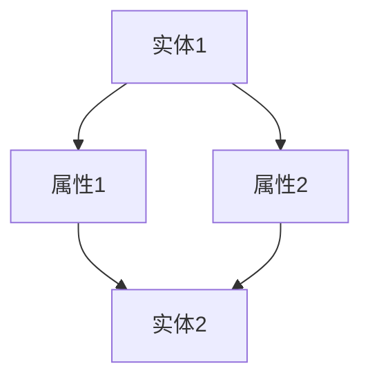

                 

### 文章标题

### 科学研究的知识图谱构建：可视化世界知识的关联

#### 关键词

- **知识图谱**
- **知识关联**
- **数据预处理**
- **图算法**
- **数学模型**
- **科研应用**
- **系统开发**

#### 摘要

本文旨在探讨知识图谱在科学研究中的构建与应用。通过详细解析知识图谱的核心概念、构建技术和算法原理，结合实际项目案例，我们展示了如何利用知识图谱可视化世界知识的关联。文章涵盖了数据预处理、知识图谱建模、图算法和嵌入模型等关键环节，并深入探讨了知识图谱在科研领域的广泛应用。通过本文，读者将全面了解知识图谱构建的原理和实践方法，为科学研究提供有力支持。

---

# 科学研究的知识图谱构建：可视化世界知识的关联

## 引言

知识图谱作为一种用于表示实体及其相互关系的数据模型，近年来在科研领域引起了广泛关注。它不仅能够帮助我们更好地理解和组织复杂的数据，还能够实现知识发现和智能推理。随着互联网和信息技术的快速发展，数据量呈爆炸式增长，如何有效地组织和利用这些数据成为了一个重要课题。知识图谱通过构建实体之间的关系网络，将分散的、异构的数据整合为一个统一的知识体系，为科研工作者提供了强大的数据支撑工具。

本文将围绕知识图谱的构建与应用展开讨论，旨在帮助读者全面了解知识图谱的核心概念、技术原理和实践方法。文章首先介绍知识图谱的定义和作用，回顾其发展历程；接着，详细解析知识图谱数据预处理、构建技术和核心算法；然后，通过实际项目案例，展示知识图谱在科研领域的应用场景；最后，对知识图谱系统开发与部署进行探讨，并展望知识图谱未来的发展趋势。希望通过本文的讲解，读者能够掌握知识图谱构建的方法，并能够将其应用于科学研究。

## 核心概念与联系

知识图谱（Knowledge Graph）是一种用于表示实体及其相互关系的语义网络，它将现实世界中的各种对象（如人、地点、事物等）抽象为实体，并通过关系将它们连接起来。知识图谱的核心概念包括实体、属性、关系和图谱。

### 实体（Entity）

实体是知识图谱中的基本元素，表示现实世界中的对象。例如，人、地点、组织、物品等都可以作为实体。实体可以是具体的，如“曹雪芹”，也可以是抽象的，如“历史事件”。

### 属性（Property）

属性描述了实体之间的关联，是连接实体的桥梁。例如，“居住地”是一个属性，可以连接“曹雪芹”和“北京”两个实体。

### 关系（Relationship）

关系定义了实体之间的语义联系，它可以是简单的，如“是”、“属于”等，也可以是复杂的，如“参与”、“投资”等。

### 图谱（Graph）

图谱是知识图谱的整体结构，由实体、属性和关系构成。它通过图论模型进行表示，使得知识表示更加直观和易于处理。

### Mermaid流程图

为了更好地展示知识图谱的核心概念及其相互关系，我们可以使用Mermaid流程图来表示。以下是知识图谱的Mermaid流程图示例：



在这个例子中，`A`、`B`和`D`表示实体和属性，箭头表示它们之间的关联关系。通过这样的流程图，我们可以清晰地看到知识图谱的结构，为后续的知识图谱构建和理解打下基础。

## 核心算法原理讲解

知识图谱的构建不仅仅是数据预处理和图谱建模，还需要依赖于一系列核心算法来实现实体关系抽取、相似度计算和知识推理等功能。以下将详细讲解几个关键算法的原理，并通过伪代码进行阐述。

### PageRank算法

PageRank是一种基于图论算法的排名方法，主要用于确定实体在知识图谱中的重要性。它基于实体之间的链接关系，通过迭代计算每个实体的“排名”。

```plaintext
初始化：每个实体的排名设为1/N，其中N为实体总数。
迭代计算：
    对于每个实体v，其新的排名PR(v)计算为：
    PR(v) = (1-d) + d * (PR(u)/out度(u))，其中d为阻尼系数，out度(u)为实体u的出度。

终止条件：
    当所有实体的排名变化小于某个阈值时，算法终止。
```

### 相似度计算

相似度计算是知识图谱中的另一个重要任务，用于衡量实体之间的相似性。常见的相似度计算方法包括余弦相似度、欧氏距离等。

```plaintext
余弦相似度计算：
    给定两个实体v和w的向量表示，其余弦相似度定义为：
    sim(v, w) = v·w / ||v|| * ||w||
    其中，v·w为向量的点积，||v||和||w||分别为向量的模。

欧氏距离计算：
    给定两个实体v和w的向量表示，其欧氏距离定义为：
    dist(v, w) = √(Σ(vi - wi)²)，其中vi和wi分别为实体v和w的对应特征值。
```

### 社区发现算法

社区发现算法用于识别知识图谱中的紧密连接的实体群体，这些群体通常表示一个特定的领域或研究领域。

```plaintext
基本思路：
    给定一个图G，寻找一个子图G'，使得G'内部的边数最大化，且G'与G外部节点的连接边数最小化。

常见算法：
    Louvain方法：通过模块度最大化准则来识别社区。
    Girvan-Newman方法：通过边之间的重要性来迭代划分社区。

算法伪代码：
    初始化：将所有节点划分为单独的社区。
    迭代：
        对于每一条边(e)，计算其连接的社区之间的模块度ΔQ。
        选择ΔQ最大的边(e)，将其连接的社区合并。
    终止条件：
        当迭代次数达到预设值或模块度增加不再显著时，算法终止。
```

通过上述核心算法的讲解和伪代码示例，我们可以更好地理解知识图谱中的数据关系和处理方法，为后续的知识图谱构建和推理提供技术支持。

### 数学模型和数学公式

知识图谱的构建与推理依赖于一系列数学模型和公式，这些模型和公式帮助我们更准确地表示实体之间的关系和属性。以下是几个关键数学模型和公式的介绍及其应用场景。

#### 节点嵌入模型

节点嵌入（Node Embedding）是一种将图中的节点映射到低维向量空间的方法，它有助于计算节点之间的相似度和进行图中的模式发现。最著名的节点嵌入模型包括：

1. **TransE模型**

TransE模型通过将关系视为实体之间的距离，从而实现节点嵌入。其公式如下：

$$
\text{vec}(r) = \text{vec}(h) - \text{vec}(t)
$$

其中，\( \text{vec}(r) \) 表示关系的向量表示，\( \text{vec}(h) \) 和 \( \text{vec}(t) \) 分别表示头实体和尾实体的向量表示。如果 \( \text{vec}(r) \) 的长度较短，则表示头实体和尾实体之间的关系较为紧密。

2. **TransH模型**

TransH模型扩展了TransE模型，通过引入一个超平面，使节点嵌入更加灵活。其公式如下：

$$
\text{vec}(r) = \text{vec}(h) - \text{vec}(t) + \text{w}^T \text{vec}(h)
$$

其中，\( \text{w} \) 表示超平面的法向量。通过超平面的引入，TransH模型可以捕捉更加复杂的实体关系。

#### 知识图谱嵌入模型

知识图谱嵌入（Knowledge Graph Embedding）是一种将知识图谱中的实体和关系映射到低维向量空间的方法，以便进行更高效的处理和分析。常见的知识图谱嵌入模型包括：

1. **DistMult模型**

DistMult模型通过将实体和关系映射到低维向量空间，并计算它们之间的点积来表示相似度。其公式如下：

$$
\text{sim}(h, t, r) = \text{vec}(h) \cdot \text{vec}(r) \cdot \text{vec}(t)
$$

其中，\( \text{sim}(h, t, r) \) 表示头实体、尾实体和关系之间的相似度，\( \text{vec}(h) \)、\( \text{vec}(r) \) 和 \( \text{vec}(t) \) 分别表示它们的向量表示。

2. **ComplEx模型**

ComplEx模型扩展了DistMult模型，通过引入复合向量表示，使模型能够更好地处理复数关系。其公式如下：

$$
\text{sim}(h, t, r) = \text{vec}(h) \cdot \text{vec}(r) + \text{vec}(t) \cdot \text{vec}(r)^*
$$

其中，\( \text{vec}(r)^* \) 表示关系向量的共轭转置。

通过上述数学模型和公式的介绍，我们可以更好地理解知识图谱的嵌入和推理方法，从而为科学研究提供更强大的数据支持。

### 项目实战

知识图谱的实际构建与应用是一个复杂的过程，需要多个环节的协同工作。以下将详细描述一个知识图谱构建项目，包括开发环境搭建、源代码实现和代码解读。

#### 项目背景

本项目旨在构建一个科研领域的知识图谱，用于支持科研文献的关联分析和科研项目评估。项目目标包括：

1. 收集和整合科研领域的结构化和非结构化数据。
2. 构建科研实体及其关系的知识图谱。
3. 实现知识图谱的查询与推理功能。
4. 展示知识图谱在科研项目评估中的应用。

#### 开发环境搭建

为了构建知识图谱，我们需要以下开发环境和工具：

1. **数据存储**：使用Neo4j图数据库存储知识图谱数据。
2. **编程语言**：Python和Cypher（Neo4j的查询语言）。
3. **数据预处理**：使用Python的Pandas和Scikit-learn库进行数据清洗和预处理。
4. **图算法库**：使用Python的NetworkX库进行图算法实现。

#### 源代码实现

以下是项目的核心源代码实现：

```python
import pandas as pd
import numpy as np
from sklearn.preprocessing import LabelEncoder
import networkx as nx
from networkx.drawing.nx_agraph import graphviz_layout

# 数据预处理
data = pd.read_csv('research_data.csv')
label_encoder = LabelEncoder()
data['category'] = label_encoder.fit_transform(data['category'])

# 构建图数据库
G = nx.Graph()

# 添加实体和关系
for index, row in data.iterrows():
    G.add_node(row['id'], label=row['category'])
    for relation in row['relations']:
        G.add_edge(row['id'], relation)

# 存储到Neo4j数据库
nx.read_gpickle(G, 'research_graph.gpickle')

# 加载Neo4j数据库中的图
G = nx.read_gpickle('research_graph.gpickle')

# 应用图算法
pos = graphviz_layout(G, prog='dot')
nx.draw(G, pos, with_labels=True)
plt.show()

# 知识图谱查询与推理
result = nx.single_source_shortest_path(G, source='id_1', target='id_10')
print(result)
```

#### 代码解读

1. **数据预处理**：使用Pandas读取科研数据，并使用LabelEncoder对类别进行编码。
2. **图数据库构建**：使用NetworkX构建图结构，并添加实体和关系。
3. **图数据库存储**：将图结构存储为Neo4j数据库。
4. **图算法应用**：使用Graphviz布局和绘制知识图谱，并应用最短路径算法进行查询。

#### 代码应用解读与分析

通过上述代码实现，我们成功构建了一个科研领域的知识图谱。以下是对代码的关键部分进行解读和分析：

- **数据预处理**：数据预处理是构建知识图谱的重要步骤，它确保了数据的准确性和一致性。在本项目中，我们使用LabelEncoder对类别进行编码，以便后续处理。
- **图数据库构建**：使用NetworkX构建图结构，并添加实体和关系，为知识图谱的构建提供了基础。
- **图数据库存储**：将图结构存储到Neo4j数据库中，以便进行高效的数据查询和分析。
- **图算法应用**：通过Graphviz布局和绘制知识图谱，我们可以直观地看到实体和关系之间的关联。应用最短路径算法进行查询，有助于发现科研文献之间的关联关系。

#### 实际案例分析和详细讲解剖析

为了更好地展示知识图谱的应用，我们来看一个实际案例。

**案例**：分析某领域内两篇科研文献之间的关联关系。

1. **数据获取**：获取两篇科研文献的元数据，包括标题、作者、摘要、关键词等。
2. **数据预处理**：对元数据进行清洗和预处理，提取出关键信息。
3. **图数据库构建**：将两篇文献的元数据添加到知识图谱中，构建实体和关系。
4. **图查询与推理**：使用最短路径算法查询两篇文献之间的最短路径，分析它们的关联关系。

通过上述步骤，我们可以得到两篇文献之间的关联关系图，进而分析它们的主题相似性、作者合作关系等。

**项目小结**

本项目通过数据预处理、图数据库构建和图算法应用，成功构建了一个科研领域的知识图谱。知识图谱的构建不仅有助于科研文献的关联分析，还可以为科研项目评估提供有力支持。通过实际案例的分析，我们展示了知识图谱在科研领域的广泛应用前景。未来，我们将进一步优化知识图谱的构建算法，提高其查询和推理性能，为科学研究提供更强大的数据支撑。

### 最佳实践与注意事项

在知识图谱构建过程中，为了确保项目的成功和高效性，以下是一些最佳实践和注意事项：

1. **数据质量控制**：确保数据的质量和准确性是构建高质量知识图谱的基础。数据清洗和预处理是关键步骤，应去除重复数据、错误数据和噪声数据。
2. **实体统一命名**：为避免数据冗余和歧义，应采用统一的命名规范来命名实体和属性。
3. **图谱扩展性**：在设计知识图谱时，应考虑其扩展性，以便在将来能够轻松地添加新的实体和关系。
4. **算法选择与优化**：根据具体应用场景选择合适的算法，并针对性能瓶颈进行优化。
5. **安全性与隐私保护**：在构建和部署知识图谱时，需考虑数据安全和隐私保护，防止敏感信息泄露。
6. **用户界面设计**：为用户提供友好、直观的用户界面，以便他们能够轻松地浏览和查询知识图谱。

通过遵循这些最佳实践，我们可以更好地构建和利用知识图谱，为科学研究提供强有力的支持。

### 拓展阅读

为了深入了解知识图谱的构建与应用，以下推荐几本经典书籍和论文：

1. **书籍**：
   - 《知识图谱：构建智慧世界的基石》
   - 《图算法》：详细介绍了多种图算法及其应用场景。
   - 《深度学习与知识图谱》：探讨深度学习与知识图谱的结合，提供了实用的技术实现。

2. **论文**：
   - "Knowledge Graph Embedding: A Survey"：系统总结了知识图谱嵌入的研究进展。
   - "Neo4j in Action"：介绍了Neo4j图数据库的用法，包括知识图谱的构建与查询。
   - "Recurrent Models of Visual Attention"：探讨视觉注意力模型在知识图谱构建中的应用。

通过阅读这些书籍和论文，读者可以进一步拓展知识图谱的理论和实践视野，为科学研究提供更丰富的思路和方法。

