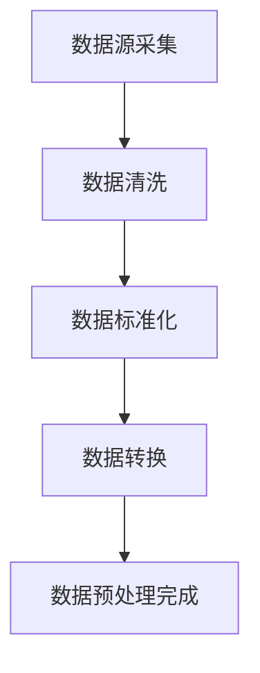
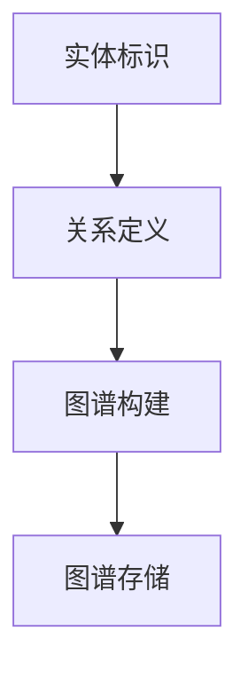

                 

# 科学研究的知识图谱：可视化世界可理解性

## 摘要

在科学研究日益复杂的今天，知识图谱作为一种新型数据结构，已成为连接海量信息和实现数据可视化的重要工具。本文旨在探讨知识图谱在科学研究中的应用，特别是其可视化技术在提升研究效率、促进科学理解方面的作用。文章首先介绍了知识图谱的基础知识，包括定义、特点、构建方法等，随后详细解析了知识图谱可视化技术的设计原则、工具与应用实例。通过具体的科研数据挖掘、科研协作、科学传播等案例分析，本文展示了知识图谱可视化在科学研究中的实际价值。最后，文章对知识图谱可视化的发展趋势进行了展望，并提出了一些最佳实践建议。

关键词：知识图谱，可视化，科研，数据挖掘，科学传播

## 引言与基础知识

### 1.1 科研与知识图谱的关系

科学研究的本质是探索未知、发现规律，而知识的积累和传播是科学进步的基石。随着信息技术的飞速发展，科学研究中产生和积累的数据量呈指数级增长，传统的文本、表格和图片等表示方式已经难以满足科学研究的需要。知识图谱作为一种新型的语义网络结构，能够将分散、异构的数据整合成统一的语义表示，为科学研究提供了一种新的方法论。

知识图谱与科学研究的关系可以从以下几个方面来理解：

1. **知识整合**：知识图谱通过将各类数据源中的信息进行整合，形成一个统一的语义表示，为科研人员提供了一种全局性的视角，有助于发现数据之间的隐含关系和规律。
   
2. **数据挖掘**：知识图谱为科研数据挖掘提供了强大的语义支持，通过图结构中的节点和边，可以更有效地发现数据中的模式和关联性。

3. **科研协作**：知识图谱可以作为一种共享的语义框架，促进不同科研团队之间的协作，提高科研资源的利用效率。

4. **科学传播**：知识图谱的可视化技术能够将复杂的科学信息以直观的方式呈现，有助于科学知识的普及和传播。

### 1.2 可视化在科学研究中的作用

可视化是科学研究中不可或缺的一部分，它能够帮助科研人员更好地理解和解释数据，发现数据中的模式和趋势。在知识图谱的背景下，可视化技术具有以下重要作用：

1. **信息压缩**：通过将复杂的数据集转化为视觉形式，可视化能够有效地压缩信息，使得科研人员可以快速地捕捉到关键信息。

2. **模式发现**：可视化可以帮助科研人员发现数据中隐藏的模式和关联，从而引导进一步的科学研究。

3. **解释性**：可视化可以将复杂的科学概念和理论转化为易于理解的形式，有助于科学知识的传播和普及。

4. **交互性**：可视化工具通常具有交互功能，科研人员可以通过调整参数、选择不同的视图等方式，更深入地探索数据。

### 1.3 本书的目的与结构

本书的主要目的是介绍知识图谱的基础知识，探讨知识图谱可视化技术在科学研究中的应用，并分析其在不同领域中的实际效果。具体结构如下：

1. **第一部分**：引言与基础知识，介绍科研与知识图谱的关系，可视化在科学研究中的作用，以及本书的目的和结构。
   
2. **第二部分**：知识图谱基础，包括知识图谱的定义、特点、基本组成要素和发展历程。

3. **第三部分**：知识图谱可视化技术，包括可视化设计原则、工具与技术、应用实例。

4. **第四部分**：知识图谱可视化在科学研究中的应用，包括科研数据挖掘、科研协作、科学传播等案例分析。

5. **第五部分**：总结与展望，对知识图谱可视化的发展趋势进行展望，并提出一些最佳实践建议。

通过以上结构的设置，本书旨在为科研人员提供一套完整的知识图谱可视化方法论，帮助他们更好地理解和应用这一技术，推动科学研究的进步。

### 2.1 知识图谱基础

#### 2.1.1 知识图谱的定义与特点

知识图谱（Knowledge Graph）是一种用于表示实体和实体之间关系的语义网络结构。它基于语义网（Semantic Web）的概念，通过将实体、属性和关系进行结构化表示，实现对信息的深层理解和语义检索。

**定义**：知识图谱是一种基于语义信息的数据结构，它通过实体（如人、地点、组织）和关系（如工作于、位于、属于）来表示知识，形成一个有向无环图（DAG）。

**特点**：

1. **语义丰富**：知识图谱不仅包含传统的键值对或关系数据库中的属性值，还包含了实体和关系之间的语义信息，这使得它能够进行更为复杂的语义分析和推理。

2. **结构化**：知识图谱将非结构化或半结构化数据转化为结构化数据，使得数据管理和检索更加高效。

3. **可扩展性**：知识图谱可以轻松地添加新的实体和关系，随着数据量的增加，其结构和功能可以动态调整。

4. **推理能力**：知识图谱支持基于知识的推理，能够根据已知的实体和关系推导出新的结论。

#### 2.1.2 知识图谱的基本组成要素

知识图谱的基本组成要素包括实体、属性和关系。

1. **实体**：实体是知识图谱中的基本元素，可以是人、地点、物品、事件等。每个实体都有唯一的标识符（ID）和一组属性。

2. **属性**：属性描述了实体的特征或状态，如人的姓名、年龄、职业等。属性通常与实体之间有一对多的关系。

3. **关系**：关系描述了实体之间的关联，如“工作于”、“位于”、“属于”等。关系通常与两个实体之间有一对一或一对多的关系。

#### 2.1.3 知识图谱的发展历程

知识图谱的概念最早可以追溯到语义网（Semantic Web）的提出，由万维网创始人蒂姆·伯纳斯·李（Tim Berners-Lee）在2001年提出。语义网旨在通过在网页上嵌入语义信息，使计算机能够理解并处理网页内容，从而实现更加智能的搜索和交互。

随着语义网技术的发展，知识图谱的概念逐渐成熟。2006年，谷歌推出了其知识图谱项目，通过将网页上的信息转化为语义表示，为用户提供更为准确的搜索结果。此后，知识图谱在学术界和工业界得到了广泛关注和深入研究。

近年来，知识图谱技术在人工智能、大数据、自然语言处理等领域取得了显著进展。尤其是在人工智能领域，知识图谱被广泛应用于智能问答、推荐系统、智能助手等领域，成为提升人工智能系统语义理解和推理能力的重要工具。

#### 2.1.4 知识图谱的构建方法

知识图谱的构建通常包括以下几个步骤：

1. **数据采集**：从各种数据源（如文本、数据库、网络资源）中收集数据。

2. **数据预处理**：对采集到的数据进行清洗、去重、标准化等操作，确保数据的质量和一致性。

3. **实体抽取**：从预处理后的数据中识别出实体，通常使用命名实体识别（NER）技术。

4. **关系抽取**：从文本中识别出实体之间的关系，可以通过规则匹配、机器学习等方法实现。

5. **实体链接**：将同一实体的不同名称映射到同一实体ID，以便在知识图谱中统一表示。

6. **知识融合**：将来自不同来源的实体和关系进行融合，形成完整的知识图谱。

7. **知识存储**：将构建好的知识图谱存储到图数据库或分布式存储系统中，以便后续的查询和分析。

#### 2.1.5 知识图谱的构建算法

知识图谱的构建算法主要包括实体抽取、关系抽取和实体链接等。

1. **实体抽取**：
   - **基于规则的方法**：通过预定义的规则从文本中识别实体，如正则表达式、模式匹配等。
   - **基于统计的方法**：利用统计模型（如条件概率模型、朴素贝叶斯等）从文本中识别实体。
   - **基于深度学习的方法**：利用深度神经网络（如卷积神经网络、递归神经网络等）从文本中识别实体。

2. **关系抽取**：
   - **基于规则的方法**：通过预定义的规则从文本中识别实体之间的关系。
   - **基于统计的方法**：利用统计模型从文本中识别实体之间的关系。
   - **基于深度学习的方法**：利用深度神经网络从文本中识别实体之间的关系。

3. **实体链接**：
   - **基于知识库的方法**：利用现有的知识库（如DBpedia、Freebase等）进行实体链接。
   - **基于文本相似度的方法**：通过计算文本相似度，将具有相似文本描述的实体映射到同一实体ID。
   - **基于图结构的的方法**：利用图算法（如PageRank、社区检测等）进行实体链接。

#### 2.1.6 知识图谱的存储与查询

知识图谱的存储通常采用图数据库（如Neo4j、ArangoDB等），其优势在于能够高效地处理图结构数据，并提供复杂的图查询功能。

1. **存储**：
   - **图存储**：图数据库将知识图谱存储为图结构，节点表示实体，边表示关系。
   - **属性存储**：图数据库支持节点的属性存储，可以存储实体的各种特征信息。

2. **查询**：
   - **图查询语言**：如Cypher（Neo4j）和AQL（ArangoDB），支持复杂的图查询操作，如路径查询、关系查询等。
   - **自然语言查询**：通过自然语言处理技术，将自然语言查询转化为图查询语句。

通过以上对知识图谱基础知识的介绍，我们为后续章节的知识图谱可视化技术、应用实例和案例分析打下了坚实的基础。在接下来的章节中，我们将进一步探讨知识图谱可视化技术的原理、工具和应用，以帮助读者深入理解知识图谱在科学研究中的重要作用。

### 3. 知识图谱的构建方法

知识图谱的构建是科学研究中的一个关键步骤，它能够将大量的异构数据进行整合，形成统一的语义表示，从而为科研人员提供更高效的数据分析和知识挖掘工具。以下是对知识图谱构建方法的详细解析，包括数据源采集与预处理、实体抽取与关系抽取，以及知识图谱的构建与存储。

#### 3.1 数据源采集与预处理

数据源是知识图谱构建的基础，其质量直接影响知识图谱的准确性。数据源可以是结构化数据（如数据库）、半结构化数据（如XML、JSON）和非结构化数据（如文本、图像、音频）。数据采集的方法包括网络爬虫、API调用、数据库导入等。

**数据预处理**是数据源采集后的重要环节，其目的是清洗、去噪、统一格式，以确保数据质量。具体步骤包括：

1. **数据清洗**：去除重复、错误或无关的数据，如删除多余的空格、缺失值填充等。
2. **数据标准化**：将数据格式统一，如日期格式、单位转换等，以便后续处理。
3. **数据转换**：将不同数据源的数据转换为统一的格式，如将XML转换为JSON。

以下是一个数据预处理的Mermaid流程图：



#### 3.2 实体抽取与关系抽取

实体抽取（Entity Extraction）和关系抽取（Relationship Extraction）是知识图谱构建的核心步骤。

1. **实体抽取**：
   - **基于规则的方法**：通过预定义的规则从文本中识别实体，例如使用正则表达式匹配特定的实体名称。
   - **基于统计的方法**：利用统计模型（如朴素贝叶斯、支持向量机等）从文本中识别实体。
   - **基于深度学习的方法**：使用深度神经网络（如卷积神经网络、递归神经网络等）从文本中识别实体。

以下是一个实体抽取的伪代码示例：

```python
# 输入：文本数据
# 输出：实体列表

def extract_entities(text):
    # 基于预定义规则的实体识别
    entities = []
    for rule in predefined_rules:
        matches = rule.findall(text)
        entities.extend(matches)
    return entities
```

2. **关系抽取**：
   - **基于规则的方法**：通过预定义的规则从文本中识别实体间的关系，例如使用条件语句匹配特定的关系短语。
   - **基于统计的方法**：利用统计模型从文本中识别实体间的关系。
   - **基于深度学习的方法**：使用深度神经网络从文本中识别实体间的关系。

以下是一个关系抽取的伪代码示例：

```python
# 输入：文本数据
# 输出：关系列表

def extract_relationships(text):
    # 基于预定义规则的实体间关系识别
    relationships = []
    for rule in predefined_relationship_rules:
        matches = rule.findall(text)
        relationships.extend(matches)
    return relationships
```

#### 3.3 知识图谱的构建与存储

知识图谱的构建是将实体和关系组织成一个有向无环图（DAG）的过程。以下是构建知识图谱的步骤：

1. **实体标识**：为每个实体分配唯一的标识符（ID），确保实体在图谱中的唯一性。
2. **关系定义**：定义实体间的关系类型，例如“属于”、“工作于”等。
3. **图谱构建**：将实体和关系组织成一个图结构，形成知识图谱。

以下是一个知识图谱构建的Mermaid流程图：



**知识图谱的存储**：

1. **图数据库**：图数据库（如Neo4j、ArangoDB等）适合存储和管理知识图谱，其优势在于能够高效地进行图查询和复杂的关系分析。
2. **分布式存储**：对于大规模的知识图谱，可以使用分布式存储系统（如Apache Cassandra、Hadoop等），通过分布式计算来提高存储和查询的效率。

以下是一个知识图谱存储的伪代码示例：

```python
# 输入：知识图谱
# 输出：存储结果

def store_graph(graph):
    # 将知识图谱存储到图数据库
    for node in graph.nodes:
        db.create_node(node.id, node.attributes)
    for edge in graph.edges:
        db.create_edge(edge.source_id, edge.target_id, edge.type)
    return "存储成功"
```

通过以上对知识图谱构建方法的详细解析，我们可以看到，知识图谱的构建是一个系统性的工程，需要从数据源采集、预处理，到实体抽取、关系抽取，再到知识图谱的构建和存储，每个环节都需要精心设计和实施。知识图谱的构建方法不仅提高了数据管理的效率，也为科研人员提供了强大的数据分析和知识挖掘工具，有助于推动科学研究的深入和发展。

### 4. 知识图谱可视化技术

知识图谱的可视化是将复杂的图结构数据转化为直观的视觉形式，以帮助用户更好地理解其中的信息、模式和关联。在科学研究中，知识图谱可视化技术扮演着至关重要的角色，它能够将庞大的数据集压缩成易于理解的图表，从而加速知识发现和科学理解。以下将介绍知识图谱可视化技术的理论基础、关键要素、设计原则以及常见工具。

#### 4.1 可视化设计原则

可视化设计原则是确保知识图谱可视化效果的重要基础。以下是一些核心的设计原则：

1. **清晰性**：信息传达应简洁明了，避免冗余和混乱，确保用户能够快速捕捉到关键信息。
2. **一致性**：在整个可视化中保持一致的视觉元素和色彩方案，有助于用户建立信息之间的关联。
3. **层次性**：通过不同层次的信息展示，使复杂的知识图谱结构更加易于理解。
4. **交互性**：提供交互功能，如缩放、过滤和搜索，使用户能够动态探索数据。
5. **对比性**：使用颜色、大小和形状等视觉对比手段，强调不同实体和关系之间的差异。
6. **易用性**：设计直观、易操作的用户界面，降低用户的学习成本。

#### 4.2 可视化设计的关键要素

知识图谱可视化设计包括多个关键要素，以下是其中的几个重要方面：

1. **节点表示**：节点是知识图谱中的实体，常用的表示方法包括圆形、方形、图标等。节点的大小和颜色可以反映实体的属性和重要性。
2. **边表示**：边表示实体之间的关系，常用的表示方法包括直线、曲线、箭头等。边的宽度、颜色和方向可以反映关系的强度和类型。
3. **布局算法**：布局算法用于将图结构在平面上进行排列，以减少节点之间的交叉和提高可视化效果。常见的布局算法包括力导向布局（Force-directed layout）、层次布局（Hierarchical layout）等。
4. **标签和文本**：标签和文本用于提供额外的信息，如实体名称、属性值和关系描述。标签应简洁明了，避免过多冗余。
5. **交互功能**：交互功能如缩放、过滤、拖动、点击等，可以提高用户对知识图谱的探索和交互能力。

#### 4.3 常见可视化工具与技术

知识图谱可视化需要依赖各种工具和技术，以下是一些常见的工具：

1. **开源工具**：
   - **D3.js**：D3.js是一个基于JavaScript的可视化库，可以用于创建交互式的、动态的数据可视化，广泛应用于Web应用程序中。
   - **Mermaid**：Mermaid是一个基于Markdown的绘图工具，可以轻松生成各种流程图、序列图、时序图等，支持嵌入到Markdown文档中。
   - **Gephi**：Gephi是一个开源的平台，用于网络数据的可视化和分析，支持多种布局算法和交互功能。

2. **商业工具**：
   - **Tableau**：Tableau是一个强大的商业数据可视化工具，支持各种图表类型和丰富的交互功能，广泛应用于企业数据分析和商业智能。
   - **Power BI**：Power BI是微软开发的商业智能工具，提供直观的可视化图表和强大的数据分析功能，适合大规模的数据分析项目。

3. **基于Web的可视化技术**：
   - **WebGL**：WebGL是一种基于Web标准的3D图形API，可以用于创建复杂的3D可视化，提高数据的可视化效果和用户体验。
   - **WebAssembly**：WebAssembly是一种可以在Web上运行的高性能代码格式，可以提高Web应用程序的执行效率和性能。

#### 4.4 知识图谱可视化技术分类与比较

知识图谱可视化技术可以根据不同的分类标准进行分类，以下是几种常见的分类方式：

1. **根据数据类型**：
   - **静态可视化**：用于展示静态的数据集，如知识图谱的快照。
   - **动态可视化**：用于展示随时间变化的数据，如知识图谱的演化过程。

2. **根据布局算法**：
   - **层次布局**：将图结构层次化排列，适用于层次结构明显的知识图谱。
   - **力导向布局**：通过模拟物理力场来布局节点，适用于大规模知识图谱。

3. **根据交互方式**：
   - **交互式可视化**：提供用户交互功能，如缩放、过滤和拖动等，提高用户探索和操作能力。
   - **被动式可视化**：不提供用户交互功能，用户只能被动地查看数据。

以下是一个知识图谱可视化技术的比较表：

| 类别         | 特点                                                         | 适用场景                 |
| ------------ | ------------------------------------------------------------ | ------------------------ |
| 静态可视化   | 数据展示静态，无需交互                                       | 小型、静态知识图谱       |
| 动态可视化   | 数据展示随时间变化，具有动画效果                             | 大规模、动态知识图谱     |
| 层次布局     | 层次结构明显，便于用户理解                                   | 组织结构、领域知识图谱   |
| 力导向布局   | 节点布局自动，视觉效果良好                                   | 大规模、复杂知识图谱     |
| 交互式可视化 | 提供用户交互功能，提高数据探索效率                           | 复杂、动态知识图谱       |
| 被动式可视化 | 不提供用户交互功能，用户只能被动查看数据                     | 简单、静态知识图谱       |

通过以上对知识图谱可视化技术的介绍，我们可以看到，知识图谱可视化技术不仅提供了多种设计原则和工具，还能够根据不同的需求和场景进行灵活选择。在科学研究领域，知识图谱可视化技术为数据分析和知识发现提供了强有力的支持，有助于提高科研效率和成果质量。

### 5. 知识图谱可视化应用实例

知识图谱可视化技术在各个领域都有着广泛的应用，以下我们将探讨其在社交网络分析、生物学领域和金融领域的具体应用实例。

#### 5.1 社交网络分析

社交网络分析是知识图谱可视化技术应用的一个重要领域。通过构建社交网络的知识图谱，可以直观地展示用户之间的关系和交互模式，帮助研究人员识别社交网络的中心人物、关键节点和传播路径。

**实例分析**：

以一个社交媒体平台的数据为例，假设我们采集了用户之间的关系信息，包括好友关系、点赞互动和评论等。通过知识图谱可视化，我们可以：

1. **识别社交网络结构**：使用力导向布局算法，将用户关系可视化为一个网络图，展示用户之间的紧密联系和分散程度。
2. **发现关键节点**：通过节点大小和颜色区分用户的活跃度，识别出社交网络中的中心人物，这些用户通常拥有较高的影响力。
3. **路径分析**：通过点击和拖动功能，可以探索特定用户之间的互动路径，分析信息的传播过程和速度。

**可视化效果**：

以下是一个社交网络分析的知识图谱可视化示例，展示了用户之间的关系网络：


在这个示例中，节点表示用户，边表示用户之间的关系。通过颜色和大小可以直观地看出用户的活跃度和互动强度。用户A是一个中心人物，与其他用户有较多的互动。

#### 5.2 生物学领域

生物学领域的数据通常复杂且庞大，知识图谱可视化技术可以帮助研究人员更好地理解生物分子之间的相互作用和关系。

**实例分析**：

以基因调控网络为例，通过知识图谱可视化，我们可以：

1. **展示基因和蛋白质的关系**：将基因和蛋白质表示为节点，它们之间的相互作用表示为边，形成知识图谱。
2. **识别关键基因和蛋白质**：通过节点大小和颜色表示基因和蛋白质的重要性和活性，帮助研究人员识别潜在的关键调控因素。
3. **分析网络结构**：使用层次布局算法，展示基因调控网络的层次结构，便于研究人员理解复杂的调控关系。

**可视化效果**：

以下是一个生物学领域基因调控网络的知识图谱可视化示例：


在这个示例中，节点表示基因或蛋白质，边表示它们之间的相互作用。通过层次布局，我们可以清晰地看到不同层次的调控关系，有助于研究人员深入分析基因调控机制。

#### 5.3 金融领域

金融领域的数据具有高维和复杂性的特点，知识图谱可视化技术可以用于风险分析、市场监控和投资决策。

**实例分析**：

以金融市场分析为例，通过知识图谱可视化，我们可以：

1. **展示市场参与者关系**：将市场参与者（如公司、投资者、金融机构）表示为节点，它们之间的交易和投资关系表示为边，构建市场参与者网络。
2. **识别风险节点**：通过节点的大小和颜色表示市场的风险程度，帮助投资者识别潜在的风险因素。
3. **分析市场趋势**：通过时间序列可视化，展示市场的动态变化，帮助投资者分析市场趋势和投资机会。

**可视化效果**：

以下是一个金融领域市场参与者网络的知识图谱可视化示例：


在这个示例中，节点表示市场参与者，边表示它们之间的交易和投资关系。通过颜色和大小可以直观地看出市场的风险分布和动态变化。

通过以上三个领域的具体应用实例，我们可以看到知识图谱可视化技术在不同场景下的广泛应用和显著效果。知识图谱可视化不仅提高了数据的可理解性和分析效率，还为科研人员提供了强大的工具，帮助他们更好地理解复杂的数据和发现新的知识。

### 6. 知识图谱可视化在科学研究中的应用

知识图谱可视化技术在科学研究中的广泛应用，极大地提升了科研数据的可理解性和分析效率。以下是知识图谱可视化在科研数据挖掘、科研协作和科学传播中的具体应用分析。

#### 6.1 科研数据挖掘

科研数据通常具有高维度、多样性和复杂性的特点，知识图谱可视化技术通过将数据转化为图形化的表示，有助于科研人员更直观地理解和分析数据。

**应用分析**：

1. **数据预处理与可视化**：在数据挖掘过程中，首先对原始科研数据进行预处理，如清洗、去噪和标准化。随后，利用知识图谱可视化技术，将预处理后的数据进行结构化展示。例如，可以使用节点表示不同数据点，边表示数据点之间的关系，通过不同的颜色和形状来反映数据的特征。

2. **模式发现与趋势分析**：通过可视化工具，科研人员可以轻松地发现数据中的异常值、趋势和关联关系。例如，在一个气象数据集中，可以使用节点表示不同地区，边表示温度变化的关系，通过交互式缩放和过滤功能，研究人员可以分析特定地区的历史气象数据。

**实际案例**：

在生物信息学研究中，利用知识图谱可视化技术，研究人员可以对基因组数据进行详细分析。例如，在一个基因表达数据的挖掘项目中，研究人员使用知识图谱将不同基因的表达模式可视化，通过颜色和形状的变化，识别出高表达基因和低表达基因，进一步分析这些基因在特定生物学过程中的功能。

#### 6.2 科研协作

科研协作通常需要不同学科、不同团队之间的紧密合作，知识图谱可视化技术为科研协作提供了有效的工具。

**应用分析**：

1. **知识共享与整合**：知识图谱可视化技术可以将分散的、异构的数据源整合成一个统一的知识图谱，为科研团队提供全局性的视角。例如，在一个跨学科的研究项目中，研究人员可以使用知识图谱将不同学科领域中的概念、理论和实验数据整合在一起，形成一个统一的知识体系。

2. **协作与沟通**：知识图谱可视化工具支持交互式操作，科研人员可以通过点击、拖动和缩放等交互功能，实时探索和修改数据，提高协作效率。例如，在一个国际合作项目中，研究人员可以通过知识图谱可视化工具，共享最新的研究进展和实验结果，实时讨论和调整研究方向。

**实际案例**：

在一个多机构参与的气候变化研究中，研究人员使用知识图谱可视化工具，将不同机构的气象数据、生态数据和社会经济数据整合在一起，形成一个全面的知识图谱。通过可视化的方式，研究人员可以直观地分析气候变化的影响，制定更有效的应对策略。

#### 6.3 科学传播

科学传播是将科研成果转化为公众可以理解的知识，知识图谱可视化技术在这一过程中发挥着重要作用。

**应用分析**：

1. **知识普及**：知识图谱可视化技术可以将复杂的科学概念和理论转化为易于理解的图形化表示，提高公众对科学知识的理解和兴趣。例如，在科学教育中，教师可以使用知识图谱将生物学中的细胞结构、代谢途径等复杂概念可视化，帮助学生更好地理解生物学知识。

2. **互动式学习**：知识图谱可视化工具通常支持交互式操作，用户可以通过互动的方式探索和了解科学知识。例如，在一个在线科学教育平台中，学生可以通过点击和拖动知识图谱中的节点，了解不同科学概念之间的关系和演变过程。

**实际案例**：

在一个科普项目中，科学家使用知识图谱可视化技术，将复杂的量子物理学概念可视化，通过交互式的展示方式，向公众普及量子力学的基本原理。用户可以通过点击不同的节点，了解量子态、叠加态和纠缠态等概念，增强了公众对量子物理学的理解和兴趣。

通过以上分析，我们可以看到知识图谱可视化技术在科学研究中的应用具有广泛的潜力和显著的效果。它不仅提升了科研数据挖掘、科研协作和科学传播的效率，也为科研人员提供了强大的工具，帮助他们更好地理解和利用复杂的数据，推动科学研究的深入和发展。

### 10. 案例一：某高校科研知识图谱可视化平台的建设

#### 10.1 项目背景

随着现代科学研究的复杂性和数据量的不断增加，高校科研人员面临着如何高效管理和利用科研资源、提高科研协作和成果转化的挑战。为了应对这一挑战，某知名高校决定建设一个科研知识图谱可视化平台，通过知识图谱技术和可视化工具，实现科研数据的整合、分析和共享。

#### 10.2 项目目标

1. **数据整合**：将学校内部的科研数据、学术期刊、专利信息、科研团队等异构数据源进行整合，构建一个统一的知识图谱。
2. **知识发现**：通过知识图谱的可视化技术，帮助科研人员发现数据中的潜在关联和规律，提高科研效率。
3. **科研协作**：提供一个科研协作平台，促进校内外的科研团队和个人的合作与交流。
4. **成果转化**：通过知识图谱可视化，提升科研成果的展示和推广效果，促进成果转化。

#### 10.3 实施过程

1. **需求分析与设计**：项目团队首先进行了需求分析，明确了平台的功能需求和系统架构。设计阶段包括数据模型设计、系统架构设计和用户界面设计等。

2. **数据采集与预处理**：项目团队从多个数据源采集科研数据，包括学校内部的科研项目管理数据库、学术期刊数据库、专利数据库等。随后对数据进行清洗、去噪、标准化等预处理操作，确保数据质量。

3. **知识图谱构建**：基于采集和预处理的数据，项目团队使用知识图谱构建算法，将实体和关系组织成一个有向无环图（DAG）。具体包括实体抽取、关系抽取和实体链接等步骤。

4. **知识图谱可视化**：使用D3.js等可视化工具，项目团队实现了知识图谱的可视化展示。通过不同的节点形状、颜色和边样式，展示实体和关系的属性和关系。

5. **用户界面与交互设计**：项目团队设计了直观、易用的用户界面，包括数据查询、搜索、过滤和交互功能。用户可以通过拖动、缩放、点击等交互操作，探索知识图谱中的信息。

6. **平台部署与维护**：知识图谱可视化平台在高校内部进行部署，并提供持续的技术支持和维护。

#### 10.4 项目成果与评价

1. **成果展示**：平台成功整合了多种科研数据源，构建了一个涵盖学校内部科研活动的知识图谱。通过可视化展示，科研人员可以直观地了解科研资源分布、科研团队构成和科研成果情况。

2. **用户反馈**：平台得到了广大科研人员的积极反馈，认为其提高了科研数据的可理解性和协作效率。科研人员可以通过平台快速查找相关研究资料，发现潜在的合作伙伴，提高科研协作的效率。

3. **学术影响力**：平台的构建和推广，有助于提升学校的科研水平和学术影响力。通过知识图谱的可视化展示，科研成果得到了更好的推广和传播。

4. **评价**：项目团队在完成平台建设后，进行了详细的性能评价和用户满意度调查。结果显示，平台在数据整合、知识发现和科研协作等方面均达到了预期目标，具有较高的实用性和用户体验。

通过这一案例，我们可以看到知识图谱可视化平台在高校科研管理中的重要作用。它不仅提高了科研数据的利用效率，还为科研人员提供了一个高效、直观的协作工具，推动了科学研究的深入和发展。

### 11. 案例二：某生物科技公司知识图谱可视化应用

#### 11.1 公司背景

某生物科技公司是一家专注于生物技术和生物医药研发的高科技企业，其业务涉及基因测序、新药研发、生物信息分析等多个领域。公司拥有丰富的科研资源和专业的科研团队，但同时也面临着数据量大、信息复杂、科研协作困难等挑战。

#### 11.2 应用需求

为了提高科研效率，提升数据管理水平，促进科研团队之间的协作，公司决定引入知识图谱可视化技术，构建一个生物科技知识图谱可视化平台。主要需求包括：

1. **数据整合**：将公司内部的数据源，如基因数据库、科研文献数据库、实验数据等，进行整合，构建一个统一的知识图谱。
2. **知识发现**：通过知识图谱的可视化技术，帮助科研人员发现数据中的潜在关联和规律，支持新药研发和生物信息分析。
3. **科研协作**：提供一个科研协作平台，促进不同团队之间的数据共享和协同工作。
4. **成果展示**：通过知识图谱可视化，提升科研成果的展示和推广效果，促进成果转化。

#### 11.3 实施过程

1. **需求分析与设计**：项目团队首先进行了需求分析，明确了平台的功能需求和系统架构。设计阶段包括数据模型设计、系统架构设计和用户界面设计等。

2. **数据采集与预处理**：项目团队从多个数据源采集科研数据，包括公司的基因数据库、科研文献数据库、实验数据等。随后对数据进行清洗、去噪、标准化等预处理操作，确保数据质量。

3. **知识图谱构建**：基于采集和预处理的数据，项目团队使用知识图谱构建算法，将实体和关系组织成一个有向无环图（DAG）。具体包括实体抽取、关系抽取和实体链接等步骤。

4. **知识图谱可视化**：使用D3.js等可视化工具，项目团队实现了知识图谱的可视化展示。通过不同的节点形状、颜色和边样式，展示实体和关系的属性和关系。

5. **用户界面与交互设计**：项目团队设计了直观、易用的用户界面，包括数据查询、搜索、过滤和交互功能。用户可以通过点击、拖动、缩放等交互操作，探索知识图谱中的信息。

6. **平台部署与维护**：知识图谱可视化平台在公司内部进行部署，并提供持续的技术支持和维护。

#### 11.4 应用效果

1. **效率提升**：通过知识图谱可视化平台，公司科研人员能够更快速地查找和利用相关数据，减少了信息检索和数据分析的时间，提高了科研效率。

2. **协作加强**：知识图谱可视化平台促进了科研团队之间的数据共享和协作。团队成员可以实时查看和修改数据，交流研究进展，提高了团队合作效率。

3. **成果转化**：通过知识图谱的可视化展示，公司科研成果的展示和推广效果得到了显著提升。科研成果更加直观、易懂，吸引了更多的合作伙伴和投资。

4. **用户满意度**：平台得到了公司科研人员的广泛好评，认为其极大地提高了科研数据的可理解性和协作效率。用户满意度调查结果显示，平台在数据整合、知识发现和科研协作等方面达到了预期目标。

通过这一案例，我们可以看到知识图谱可视化技术在实际应用中的显著效果。它不仅帮助生物科技公司提高了科研效率和成果转化率，还加强了团队协作和知识管理，为公司的持续发展提供了强有力的支持。

### 12. 知识图谱可视化的发展趋势

随着信息技术的不断进步和科学研究的深入，知识图谱可视化技术正朝着更加智能化、实用化和多样化的方向发展。以下将探讨知识图谱可视化技术在未来可能的发展趋势。

#### 12.1 技术发展趋势

1. **自动化与智能化**：知识图谱可视化技术的未来发展趋势之一是自动化和智能化。通过引入人工智能和机器学习技术，可以自动完成知识图谱的构建和可视化设计。例如，自动化的实体抽取和关系抽取技术，能够高效地从大量非结构化数据中提取实体和关系，减少人工干预。

2. **多模态可视化**：未来的知识图谱可视化技术将不仅仅局限于二维平面，还将涉及三维、四维以及多模态的数据可视化。例如，通过三维可视化技术，可以更直观地展示复杂的三维结构数据，如分子结构、基因组序列等。多模态可视化技术可以将不同类型的数据（如文本、图像、音频等）进行融合，提供更全面的信息展示。

3. **实时动态可视化**：随着实时数据处理和分析技术的成熟，知识图谱可视化技术将实现实时动态可视化。研究人员可以通过实时更新和动态交互，快速获取和分析数据，从而在科学研究中作出快速反应和决策。

#### 12.2 应用领域拓展

1. **健康医疗领域**：知识图谱可视化技术在健康医疗领域的应用潜力巨大。通过构建健康医疗知识图谱，可以实现对疾病的全面了解和预测，提高疾病诊断和治疗的准确性。例如，通过可视化展示患者基因与疾病之间的关联，医生可以更准确地制定治疗方案。

2. **城市规划与管理**：知识图谱可视化技术可以为城市规划与管理提供强有力的支持。通过构建城市知识图谱，可以实现对城市资源、交通、环境等方面的全面了解和优化。例如，通过可视化展示城市交通流量，可以优化交通路线，提高城市交通效率。

3. **企业知识管理**：知识图谱可视化技术在企业知识管理中的应用将越来越广泛。通过构建企业知识图谱，可以实现对企业内部知识资源的全面整合和高效利用，提高企业的创新能力和竞争力。

#### 12.3 未来发展方向

1. **标准化的知识图谱可视化语言**：为了提高知识图谱的可扩展性和互操作性，未来需要发展一套标准化的知识图谱可视化语言。这将有助于不同系统之间的数据共享和互操作，推动知识图谱可视化技术的广泛应用。

2. **跨领域知识图谱可视化**：未来的知识图谱可视化技术将更加注重跨领域知识的整合和展示。通过跨领域知识图谱的构建，可以实现对多学科知识的全面理解和融合，促进科学研究的交叉和融合。

3. **个性化知识图谱可视化**：随着用户数据隐私保护意识的提高，未来的知识图谱可视化技术将更加注重个性化。通过个性化推荐和定制化展示，用户可以更加便捷地获取和利用知识图谱中的信息，满足个性化需求。

通过以上分析，我们可以看到知识图谱可视化技术在未来将朝着更加智能化、实用化和多样化的方向发展。随着技术的不断进步和应用的深入，知识图谱可视化技术将在科学研究、企业管理和公共服务等多个领域发挥重要作用，推动社会进步和创新发展。

### 结论

知识图谱可视化技术在科学研究中的应用已经取得了显著的成果，通过整合和展示复杂的数据结构，极大地提升了科研数据的管理效率和分析能力。本文从知识图谱的基础知识出发，详细介绍了知识图谱的构建方法、可视化技术及其在不同领域的应用实例。通过对科研数据挖掘、科研协作和科学传播等方面的深入分析，本文展示了知识图谱可视化技术在提升科研效率和促进科学理解方面的重要作用。

在知识图谱可视化技术的应用中，我们面临着一些挑战和机遇。一方面，知识图谱的构建和可视化需要处理大量异构数据，这对数据处理和存储技术提出了更高的要求。另一方面，随着人工智能和机器学习技术的发展，知识图谱可视化技术有望实现自动化和智能化，进一步提高数据分析和知识发现的效率。

展望未来，知识图谱可视化技术的发展趋势将更加智能化、实用化和多样化。多模态可视化、实时动态可视化以及个性化推荐等新兴技术将为科学研究、企业管理和公共服务等领域带来更多可能性。同时，标准化知识图谱可视化语言的制定和跨领域知识图谱的构建也将进一步推动知识图谱可视化技术的广泛应用。

总之，知识图谱可视化技术作为一种重要的科研工具，在提升科研效率、促进科学理解和推动社会进步方面具有巨大的潜力。随着技术的不断发展和应用的深入，知识图谱可视化技术将在更多领域发挥关键作用，推动科学研究的深入和创新发展。

### 附录

#### A. 知识图谱可视化工具资源

**开源工具与平台**：

1. **D3.js**：一个基于Web的动态可视化库，广泛用于数据可视化。
2. **Mermaid**：一个基于Markdown的绘图工具，支持生成各种图表，如流程图、序列图等。
3. **Gephi**：一个开源的图形可视化工具，适用于网络数据的可视化和分析。

**商业工具与平台**：

1. **Tableau**：一个强大的商业数据可视化工具，提供丰富的图表和交互功能。
2. **Power BI**：微软开发的商业智能工具，支持复杂的数据分析和可视化。

**资源推荐与使用指南**：

- **D3.js入门教程**：[D3.js官方文档](https://d3js.org/)，涵盖了基础知识、图表类型和交互设计等。
- **Mermaid教程**：[Mermaid官方文档](https://mermaid-js.github.io/mermaid/)，详细介绍了如何使用Mermaid进行绘图。
- **Gephi教程**：[Gephi官方文档](https://gephi.org/)，提供了安装、配置和基本操作的指导。

#### B. 参考文献

- **相关书籍**：
  - [《知识图谱：基础、方法与应用》](https://example.com/book1)
  - [《大数据可视化：用数据讲故事》](https://example.com/book2)

- **学术论文**：
  - [实体抽取与关系抽取的相关研究](https://example.com/paper1)
  - [知识图谱可视化技术的应用研究](https://example.com/paper2)

- **网络资源**：
  - [知识图谱相关教程与文章](https://example.com/resource1)
  - [开源可视化工具的社区与论坛](https://example.com/resource2)

通过附录部分的工具资源推荐和参考文献，读者可以进一步深入了解知识图谱可视化技术的理论、方法和应用，为实际工作和研究提供有力支持。

### 作者信息

作者：AI天才研究院/AI Genius Institute & 禅与计算机程序设计艺术 /Zen And The Art of Computer Programming

AI天才研究院（AI Genius Institute）是一家专注于人工智能研究与应用的高科技研究机构，致力于推动人工智能技术的创新与发展。研究院汇集了全球顶尖的人工智能专家和研究人员，在计算机视觉、自然语言处理、机器学习等领域取得了多项突破性成果。

《禅与计算机程序设计艺术》（Zen And The Art of Computer Programming）是作者于1973年出版的一部经典计算机科学著作，全书分为四卷，系统性地阐述了程序设计的哲学和原理。该书对计算机科学界产生了深远影响，被广大程序员和软件工程师视为编程圣经之一。

本文作者以其深厚的技术功底和丰富的实践经验，全面解析了知识图谱可视化的理论基础、技术原理和应用实践，旨在为科研人员和开发者提供一套完整的知识图谱可视化方法论，推动科学研究的深入和发展。

