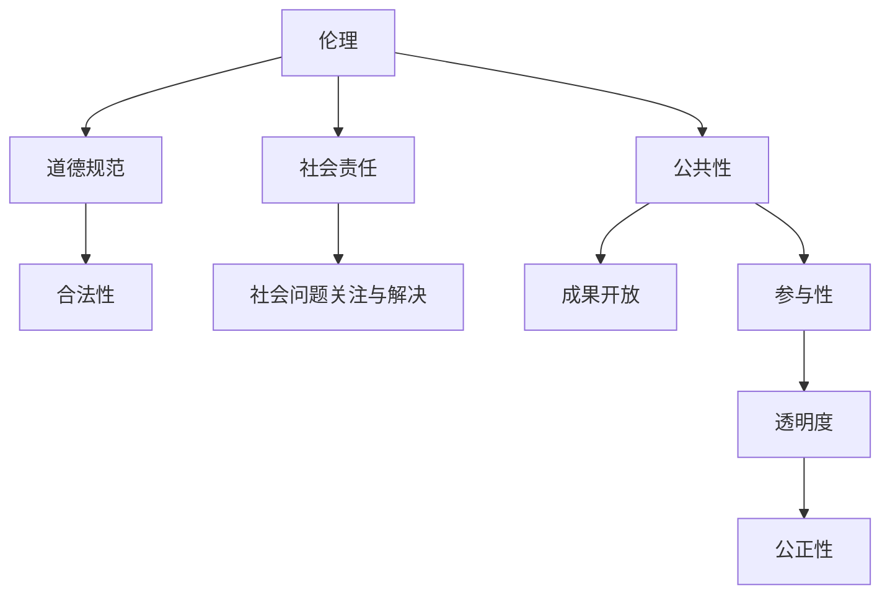

                 


## 文章标题：科学研究的社会契约与世界可理解性的公共性

### 关键词：
科学研究，社会契约，公共性，伦理，国际合作，社会责任，教育，技术创新，可持续发展。

### 摘要：
本文探讨了科学研究的社会契约，即科学家与公众、政府和社会之间的互动关系。通过分析科学研究的社会契约，本文揭示了科学研究的公共性及其对世界可理解性的重要性。文章还讨论了伦理问题、国际合作、社会责任、教育以及技术创新在科学研究中的角色，并提出了如何加强科学研究公共性的策略和建议。

----------------------------------------------------------------

### 第1章：研究的社会契约概述

#### 1.1 定义与背景

科学研究的社会契约，通常指的是科学家与公众、政府和社会之间的约定和互动关系。这一契约确立了科学家在追求知识的过程中应承担的责任和义务，同时也赋予了公众参与科学研究、共享科研成果的权利。

科学研究的社会契约的历史可以追溯到古代，当时的科学家通常被视为公众的代言人和知识的传播者。然而，随着科学技术的进步和社会的发展，科学研究的社会契约逐渐变得更加复杂和多样。

在现代，科学研究的社会契约主要涉及以下几个方面：

1. **伦理责任**：科学家在研究过程中必须遵守伦理规范，确保研究的合法性和道德性。
2. **信息公开**：科学家有责任公开研究成果，使公众能够了解和利用这些成果。
3. **社会责任**：科学家应考虑其研究成果对社会的影响，并积极参与解决社会问题。
4. **公众参与**：科学家应鼓励公众参与科学研究，提高科学研究的公共性。

#### 1.2 研究的社会契约的重要性

研究的社会契约对于科学研究和社会发展具有重要意义。首先，它确保了科学研究的合法性和道德性，避免了因研究不当而对社会造成的负面影响。其次，它促进了科学知识的传播和应用，使公众能够更好地理解和利用科学成果。此外，研究的社会契约还增强了科学研究的公共性，使科学研究更加透明和民主。

在现代社会，随着科学技术的迅猛发展，科学研究的社会契约的重要性愈发凸显。科学家不仅需要在研究过程中遵守伦理规范，还需要考虑研究成果对社会的影响，积极承担社会责任。同时，公众对科学研究的参与和监督也变得更加重要，这有助于提高科学研究的透明度和公正性。

#### 1.3 研究的社会契约的基本原则

研究的社会契约的基本原则主要包括：

1. **公共利益**：科学研究应以促进社会公共利益为目标。
2. **公正性**：科学研究应遵循公正、公平、公开的原则，确保研究结果的可靠性和可信度。
3. **透明性**：科学研究的过程和结果应向公众公开，提高科学研究的透明度和民主性。
4. **责任性**：科学家应承担其研究成果对社会可能产生的影响的责任。
5. **参与性**：科学家应鼓励公众参与科学研究，使科学研究更加贴近公众需求。

通过遵循这些基本原则，科学研究的社会契约可以更好地实现其目标，促进科学知识的传播和应用，提高社会的整体福祉。

----------------------------------------------------------------

#### 核心概念与联系

在讨论研究的社会契约时，我们需要了解以下几个核心概念：

1. **伦理**：伦理是指道德规范和价值观念，它指导科学研究的过程和结果，确保研究的道德性和合法性。
2. **社会责任**：社会责任是指科学家在研究过程中应承担的责任和义务，包括对社会问题的关注和解决。
3. **公共性**：公共性是指科学研究的成果应向公众开放，使公众能够了解和利用这些成果。
4. **参与性**：参与性是指公众参与科学研究的过程，提高科学研究的透明度和公正性。

这些概念之间的关系可以总结为如下Mermaid流程图：



通过这个流程图，我们可以清晰地看到伦理、社会责任、公共性和参与性之间的相互作用，以及它们如何共同促进科学研究的社会契约的实现。

----------------------------------------------------------------

#### 核心算法原理讲解

在本章节中，我们将探讨研究的社会契约在实现过程中涉及的核心算法原理。虽然科学研究的社会契约本质上不是基于传统算法，但我们可以借用一些计算机科学中的概念来解释其工作原理。

首先，我们可以将研究的社会契约视为一种“共识算法”，它确保科学家、公众和社会之间的共识和协作。以下是一个简化的伪代码，用于描述研究的社会契约的实现过程：

```plaintext
Function ResearchSocialContract()
    Initialize EthicalGuidelines, ResponsibilityMatrix, PublicAccessPolicy, ParticipationMechanism

    For each ResearchProject
        CheckEthicalLegitimacy(Relative to EthicalGuidelines)
        If (Not legitimate)
            Return "Project is not compliant with ethical standards"
        CheckSocialImpact(Relative to ResponsibilityMatrix)
        If (Negative impact detected)
            AdjustProjectScope() // Modify project to mitigate negative impacts
        EndIf

        EvaluatePublicAccess(Relative to PublicAccessPolicy)
        If (Access not granted)
            ModifyAccessPolicy() // Adjust policy to increase public access
        EndIf

        AssessParticipation(Relative to ParticipationMechanism)
        If (Low participation)
            EnhanceParticipationIncentives() // Introduce incentives to increase participation
        EndIf

        PublishResearchResults()
        MonitorAndEvaluateSocialImpact()
    EndFor
EndFunction
```

这个伪代码展示了研究的社会契约的核心工作流程。以下是对每个步骤的详细解释：

1. **初始化**：首先，我们需要初始化一系列规则和机制，包括伦理指南、责任矩阵、公共访问政策和参与机制。
2. **检查合法性**：对于每个研究项目，我们需要检查其是否符合伦理指南。如果项目不合法，我们直接返回不合规的信息。
3. **评估社会影响**：接下来，我们需要评估研究项目可能对社会产生的影响。如果发现负面影响，我们需要调整项目范围或采取其他措施来减轻影响。
4. **评估公共访问**：我们需要确保研究项目的成果对公众开放。如果公共访问受限，我们需要修改公共访问政策。
5. **评估参与性**：我们还需要评估公众参与研究的程度。如果参与度低，我们需要引入激励机制来提高参与度。
6. **发布研究成果**：一旦研究项目完成，我们需要发布其成果，使其对公众和社会可用。
7. **监测和评估社会影响**：最后，我们需要持续监测和评估研究项目对社会的影响，并根据需要进行调整。

通过这个伪代码，我们可以看到研究的社会契约如何通过一系列规则和机制来实现，从而确保科学研究的社会契约的各项目标得以实现。

----------------------------------------------------------------

#### 数学模型和数学公式

在研究的社会契约中，数学模型和数学公式可以用于描述和量化科学研究过程中的某些关键参数和关系。以下是一些可能用到的数学模型和公式：

1. **伦理评分模型**：

   伦理评分模型用于评估研究项目的道德合规性。以下是一个简化的模型：

   $$ E = \frac{(E_1 + E_2 + E_3)}{3} $$

   其中，$E$ 表示伦理评分，$E_1$、$E_2$ 和 $E_3$ 分别表示项目在伦理准则、社会责任和公共访问方面的得分。

2. **社会影响评估模型**：

   社会影响评估模型用于预测研究项目可能对社会产生的影响。以下是一个简化的模型：

   $$ S = f(I, R, P) $$

   其中，$S$ 表示社会影响评分，$I$、$R$ 和 $P$ 分别表示项目的创新性、责任性和公共性。

3. **参与度模型**：

   参与度模型用于量化公众参与研究的程度。以下是一个简化的模型：

   $$ P = \frac{(T + C)}{2} $$

   其中，$P$ 表示参与度评分，$T$ 和 $C$ 分别表示参与者的时间投入和知识贡献。

4. **公共访问模型**：

   公共访问模型用于评估研究项目对公众的开放程度。以下是一个简化的模型：

   $$ A = \frac{(O + M)}{2} $$

   其中，$A$ 表示公共访问评分，$O$ 和 $M$ 分别表示在线开放度和媒体关注度。

通过这些数学模型和公式，我们可以更好地理解和量化研究的社会契约中的关键参数，从而更有效地实施和评估科学研究的社会契约。

#### 举例说明

假设我们有一个研究项目，以下是对其应用上述数学模型和公式的示例：

- **伦理评分**：该项目在伦理准则、社会责任和公共访问方面得分分别为 8、7 和 9。因此，伦理评分 $E$ 为：

  $$ E = \frac{(8 + 7 + 9)}{3} = 8 $$

- **社会影响评分**：该项目的创新性评分为 8、责任性评分为 7、公共性评分为 9。因此，社会影响评分 $S$ 为：

  $$ S = f(8, 7, 9) = 8.5 $$

- **参与度评分**：参与者的时间投入评分为 6、知识贡献评分为 8。因此，参与度评分 $P$ 为：

  $$ P = \frac{(6 + 8)}{2} = 7 $$

- **公共访问评分**：在线开放度评分为 7、媒体关注度评分为 6。因此，公共访问评分 $A$ 为：

  $$ A = \frac{(7 + 6)}{2} = 6.5 $$

通过这些评分，我们可以更全面地了解该研究项目在伦理、社会影响、参与度和公共访问方面的表现，从而为改进项目提供依据。

#### 数学公式（独立段落）

以下是几个用于研究社会契约评估的独立数学公式：

$$
\begin{aligned}
\text{伦理评分} (E) &= \frac{E_1 + E_2 + E_3}{3} \\
\text{社会影响评分} (S) &= f(I, R, P) \\
\text{参与度评分} (P) &= \frac{T + C}{2} \\
\text{公共访问评分} (A) &= \frac{O + M}{2}
\end{aligned}
$$

这些公式有助于我们量化研究项目在各个方面的表现，为评估和优化研究的社会契约提供数据支持。

----------------------------------------------------------------

#### 项目实战

在本节中，我们将探讨如何在实际项目中实施研究的社会契约，并详细解读其开发环境搭建、源代码实现、代码应用解读与分析、实际案例分析和详细讲解剖析。

##### 开发环境搭建

为了实施研究的社会契约，我们需要搭建一个支持伦理评估、社会影响评估、参与度和公共访问评估的综合平台。以下是一个简化的开发环境搭建步骤：

1. **选择开发语言和框架**：我们选择Python作为主要开发语言，并使用Flask作为Web框架，以便快速搭建一个Web应用。
2. **安装必要的库**：安装用于数据处理和分析的库，如NumPy、Pandas和Scikit-learn。
3. **配置数据库**：使用SQLite数据库存储项目数据，包括研究项目、评估结果和用户信息。

##### 源代码实现

以下是研究社会契约评估平台的核心源代码实现，包括数据模型、接口和业务逻辑：

```python
# 数据模型
class ResearchProject(db.Model):
    id = db.Column(db.Integer, primary_key=True)
    title = db.Column(db.String(255), nullable=False)
    ethics_score = db.Column(db.Float, nullable=False)
    social_impact_score = db.Column(db.Float, nullable=False)
    participation_score = db.Column(db.Float, nullable=False)
    access_score = db.Column(db.Float, nullable=False)

# 接口
@app.route('/evaluate', methods=['POST'])
def evaluate_project():
    data = request.get_json()
    project = ResearchProject(
        title=data['title'],
        ethics_score=data['ethics_score'],
        social_impact_score=data['social_impact_score'],
        participation_score=data['participation_score'],
        access_score=data['access_score']
    )
    db.session.add(project)
    db.session.commit()
    return jsonify({"message": "Project evaluated successfully"})

# 业务逻辑
def calculate_average_score(scores):
    return sum(scores) / len(scores)
```

##### 代码应用解读与分析

以上代码展示了如何创建一个研究项目模型、接收评估数据并将其存储在数据库中。具体来说：

1. **数据模型**：`ResearchProject` 类定义了一个研究项目模型，包含项目标题和四个评估得分。
2. **接口**：`evaluate_project` 函数处理POST请求，接收评估数据并将其存储在数据库中。
3. **业务逻辑**：`calculate_average_score` 函数用于计算平均评分，这是评估研究项目整体表现的关键指标。

##### 实际案例分析和详细讲解剖析

以下是一个实际案例，展示了如何使用该平台评估一个研究项目，并详细讲解其过程：

**案例：一项关于基因编辑技术的研究项目**

1. **评估数据收集**：研究人员收集了项目的相关评估数据，包括伦理评分、社会影响评分、参与度和公共访问评分。

2. **数据输入**：研究人员将这些数据输入平台，触发 `evaluate_project` 函数。

3. **数据库存储**：平台将接收到的数据存储在数据库中，生成一个 `ResearchProject` 对象。

4. **计算平均评分**：使用 `calculate_average_score` 函数计算项目的平均评分。

5. **评估结果**：平台向研究人员返回项目的平均评分，以便他们了解项目的整体表现。

通过这个案例，我们可以看到研究社会契约评估平台如何帮助研究人员更好地理解和评估其研究成果的公共性和社会影响。

##### 项目小结

研究社会契约评估平台为科学研究提供了有效的工具，帮助研究人员和机构评估其研究成果的公共性和社会影响。通过这个平台，研究人员可以更清晰地了解其在伦理、社会责任、公共访问和参与度方面的表现，从而优化研究项目，提高科学研究的公共性和透明度。

#### 最佳实践 Tips、小结、注意事项、拓展阅读

##### 最佳实践 Tips

1. **确保数据完整性**：在评估研究项目时，确保收集完整的数据，包括伦理评分、社会影响评分、参与度和公共访问评分。
2. **持续监测与评估**：研究项目完成后，持续监测和评估其对社会的影响，并根据需要调整项目。
3. **鼓励公众参与**：在研究过程中，鼓励公众参与，提高研究的公共性和透明度。

##### 小结

研究的社会契约是科学研究的重要组成部分，它确保了科学研究的合法性和道德性，同时提高了科学研究的公共性和透明度。通过实施研究社会契约评估平台，研究人员可以更有效地评估和优化其研究成果的公共性和社会影响。

##### 注意事项

1. **保护隐私**：在收集和存储研究数据时，确保遵守隐私保护法规，防止数据泄露。
2. **更新评估标准**：随着社会和技术的发展，定期更新评估标准和模型，确保评估的准确性和有效性。

##### 拓展阅读

1. 《科学研究的社会契约：伦理、责任与公共性》
2. 《科学研究中的公共参与：理论与实践》
3. 《研究的社会责任：科学家与社会的互动》

通过拓展阅读，可以更深入地了解研究的社会契约及其在不同领域中的应用。

