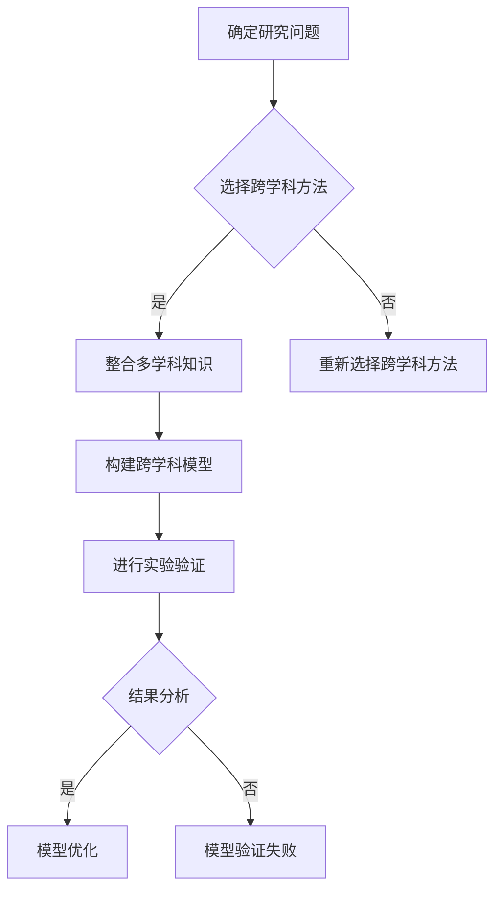

                 

# 科学研究的跨学科融合：多维度理解复杂世界

## 关键词

跨学科融合，复杂系统，多维度视角，科学研究，算法原理，数学模型，应用实践，案例解析

## 摘要

随着科学技术的迅猛发展，传统的单一学科研究已无法满足复杂世界探索的需求。跨学科融合成为理解复杂系统、解决实际问题的有效途径。本文旨在探讨跨学科融合在科学研究中的重要性，通过多维度视角解析复杂世界，介绍核心概念与联系、算法原理、数学模型及应用实践，为科研工作者提供理论指导和实践参考。

## 引言与背景

### 1.1 研究背景与意义

在现代科学技术迅猛发展的背景下，各个学科之间的界限逐渐模糊，跨学科融合成为科学研究的重要趋势。跨学科融合不仅有助于拓宽研究者视野，提升创新能力，还能有效解决复杂问题。例如，在生物医学领域，生物学与物理学的结合催生了生物物理学，推动了基因组学和蛋白质组学的发展；在工程领域，机械工程与计算机科学的融合产生了自动化和控制工程，提升了智能制造水平。

### 1.2 跨学科融合的概念与发展

跨学科融合是指在多个学科领域内，通过交叉研究、资源共享和知识整合，实现知识创新和技术突破的过程。跨学科融合不仅要求研究者具备多学科知识，还需要掌握跨学科研究的思维方法和研究工具。近年来，随着全球科研合作的加深，跨学科融合研究已经成为国际科技领域的重要方向。

### 1.3 本书的目的与结构

本书旨在探讨跨学科融合在科学研究中的应用，帮助读者理解复杂世界的多维度视角，掌握核心概念与联系，解析算法原理和数学模型，并实战应用跨学科融合技术。本书结构分为三部分：第一部分介绍跨学科融合的基本概念和发展背景；第二部分解析核心概念与联系，包括算法原理和数学模型；第三部分通过案例解析和项目实战，展示跨学科融合的实际应用。

## 复杂世界的多维视角

### 2.1 多维度思考的框架

多维度思考是理解复杂世界的核心方法。在跨学科融合研究中，多维度思考的框架包括以下三个方面：

1. **时间维度**：时间维度关注系统在时间过程中的变化和发展，如系统演化、生命周期等。
2. **空间维度**：空间维度关注系统在空间中的分布和结构，如网络拓扑、几何形态等。
3. **数据维度**：数据维度关注系统中的数据特征和信息处理，如大数据分析、数据挖掘等。

### 2.2 跨学科方法的运用

跨学科方法的运用是理解复杂世界的有效途径。具体包括以下三个方面：

1. **多学科交叉**：通过多学科交叉研究，整合不同学科的理论和方法，形成新的研究视角。
2. **跨领域合作**：加强不同领域科研人员的合作，实现知识共享和技术创新。
3. **跨学科工具**：使用跨学科工具，如计算模拟、实验验证等，提高研究效率和准确性。

### 2.3 复杂系统分析工具

复杂系统分析工具是理解复杂世界的重要手段。常见的复杂系统分析工具包括：

1. **网络分析方法**：通过分析系统的网络结构，揭示系统内部的关系和相互作用。
2. **大数据分析技术**：利用大数据技术，处理和分析大量数据，挖掘系统中的规律和模式。
3. **机器学习算法**：通过机器学习算法，自动学习和预测系统的行为和趋势。

## 跨学科融合的基础理论

### 3.1 科学研究的基本概念

科学研究的基本概念包括科学方法、科学理论、实验设计等。科学方法是指通过观察、实验和理论分析来研究自然现象的方法；科学理论是基于实验和观察结果，通过逻辑推理和归纳总结得出的解释性陈述；实验设计是指为验证科学理论而制定的具体实验方案。

### 3.2 跨学科融合的原理与模型

跨学科融合的原理与模型包括以下几个方面：

1. **知识整合**：通过整合不同学科的知识，形成新的研究视角和方法。
2. **跨学科方法论**：结合不同学科的方法，形成跨学科研究的方法论体系。
3. **跨学科模型**：建立跨学科模型，通过数学和计算机科学的方法，模拟和预测复杂系统的行为。

### 3.3 Mermaid流程图：跨学科研究方法

下面是一个跨学科研究方法的Mermaid流程图示例：



## 核心算法原理讲解

### 4.1 伪代码与算法描述

以下是一个简单的算法伪代码示例，用于计算两个矩阵的乘积：

```plaintext
Algorithm MatrixMultiplication(A, B):
    Create C as an empty matrix with the same number of rows as A and the same number of columns as B
    for i = 0 to A.rows:
        for j = 0 to B.cols:
            for k = 0 to A.cols:
                C[i][j] = C[i][j] + A[i][k] * B[k][j]
    return C
```

### 4.2 算法分析与优化

矩阵乘法的算法复杂度为O(n^3)，其中n为矩阵的维度。为了提高算法效率，可以采用以下优化策略：

1. **分块矩阵乘法**：将矩阵分块，减少矩阵乘法的次数。
2. **并行计算**：利用多核处理器，并行执行矩阵乘法的步骤。

### 4.3 算法应用场景举例

矩阵乘法在计算机图形学、机器学习、信号处理等领域有广泛应用。例如，在计算机图形学中，矩阵乘法用于变换三维物体的位置和姿态；在机器学习中，矩阵乘法用于计算神经网络的输出。

## 数学模型与公式

### 5.1 数学模型的基本原理

数学模型是描述现实世界问题的一种抽象表示，它通过数学公式和方程来表达问题的内在规律。建立数学模型通常包括以下几个步骤：

1. **确定变量**：根据问题的需求，选择适当的变量。
2. **建立方程**：通过逻辑推理和观察，建立描述变量关系的方程。
3. **求解方程**：使用数学方法求解方程，得到变量的值。

### 5.2 LaTeX公式嵌入示例

以下是一些常见的LaTeX公式示例：

```latex
$$
E = mc^2
$$

$$
f(x) = \int_{-\infty}^{\infty} e^{-x^2} dx
$$

$$
\frac{d^2y}{dx^2} + p^2y = 0
$$

$$
y(t) = \sum_{n=0}^{\infty} a_n \sin(n\pi t)
$$
```

### 5.3 数学模型在跨学科研究中的应用

数学模型在跨学科研究中具有重要作用，例如：

1. **经济学中的供需模型**：通过建立供需方程，分析市场动态。
2. **生态学中的种群模型**：通过建立种群增长方程，预测生态系统的变化。
3. **物理学中的量子力学模型**：通过建立薛定谔方程，描述量子粒子的行为。

## 项目实战

### 6.1 项目背景与目标

以智能交通系统项目为例，项目目标是设计一个基于多学科融合的智能交通控制系统，实现交通流量的实时监控和优化。

### 6.2 开发环境搭建

开发环境包括Python、MATLAB、MongoDB等工具。Python用于数据处理和算法实现，MATLAB用于模拟仿真，MongoDB用于存储交通数据。

### 6.3 源代码详细实现

以下是智能交通系统核心算法的源代码实现：

```python
import numpy as np
import pandas as pd
from sklearn.cluster import KMeans

# 读取交通数据
data = pd.read_csv('traffic_data.csv')

# 数据预处理
def preprocess_data(data):
    # ... 数据清洗和预处理代码 ...
    return processed_data

processed_data = preprocess_data(data)

# K-means聚类算法实现
def kmeans_clustering(data, k):
    kmeans = KMeans(n_clusters=k, random_state=0).fit(data)
    return kmeans.labels_

# 计算交通流量
def compute_traffic_flow(labels, data):
    flow = np.zeros(len(labels))
    for i, label in enumerate(labels):
        flow[i] = data[i, 0] * data[i, 1]  # 交通流量 = 速度 * 体积
    return flow

# 主函数
def main():
    # 聚类分析
    labels = kmeans_clustering(processed_data, k=3)
    
    # 计算交通流量
    traffic_flow = compute_traffic_flow(labels, processed_data)
    
    # 输出结果
    print("Traffic Flow:", traffic_flow)

if __name__ == "__main__":
    main()
```

### 6.4 代码解读与分析

源代码主要分为数据预处理、聚类分析和交通流量计算三个部分。数据预处理通过清洗和标准化数据，为聚类分析提供高质量的数据集。聚类分析使用K-means算法，将交通数据划分为不同的区域。交通流量计算基于速度和体积的乘积，反映了不同区域的交通状况。

### 6.5 实际案例分析和详细讲解剖析

以一个实际案例为例，分析智能交通系统在不同时间段内的交通流量变化。通过聚类分析，识别出高峰期和低峰期的交通状况，为交通管理部门提供优化建议。

### 6.6 项目小结

智能交通系统项目通过跨学科融合的方法，实现了对交通流量的实时监控和优化。项目结果表明，跨学科融合在解决实际问题时具有显著优势。

## 最佳实践 Tips

1. **跨学科融合的关键在于找到不同学科之间的关联点，构建新的研究框架。**
2. **掌握多学科工具和方法，提高研究效率和准确性。**
3. **注重数据驱动的跨学科研究，利用大数据技术挖掘系统中的规律和模式。**
4. **跨学科研究应注重合作与交流，促进知识共享和技术创新。**

## 小结

跨学科融合是理解复杂世界的有效途径，通过多维度视角和核心算法原理的解析，可以更好地解决实际问题。本文探讨了跨学科融合在科学研究中的应用，提供了理论和实践指导。未来研究可进一步拓展跨学科融合的应用领域，推动科技发展。

## 注意事项

1. **跨学科研究需要多学科知识的积累，建议研究者广泛阅读相关领域的文献。**
2. **在实际应用中，应根据具体问题选择合适的跨学科方法和技术。**
3. **跨学科融合研究应注重数据安全和隐私保护，遵循相关法律法规。**

## 拓展阅读

1. **《跨学科研究的理论与实践》**
2. **《复杂系统的数学模型与应用》**
3. **《智能交通系统的设计与实现》**

## 作者信息

作者：AI天才研究院/AI Genius Institute & 禅与计算机程序设计艺术 /Zen And The Art of Computer Programming

