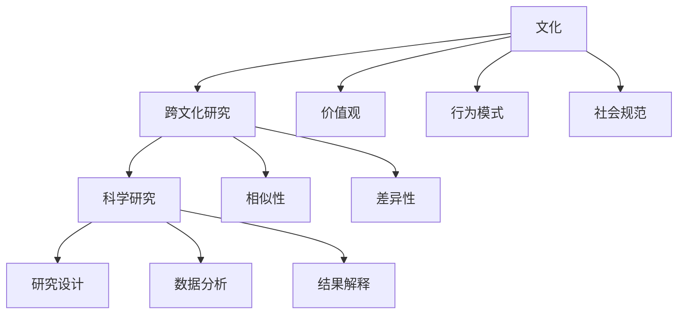

                 

### 文章标题

# 科学研究的跨文化视角：多元文化背景下的世界理解

### 关键词

- 跨文化研究
- 科学研究模式
- 文化差异
- 多元文化理解
- 跨文化方法论

### 摘要

本文旨在探讨多元文化背景下的科学研究，分析文化对科学研究的多样性、设计、分析和结果解释的影响。通过核心概念的联系架构、跨文化比较研究、研究方法和多元文化视角的深入探讨，本文揭示了跨文化研究在增进全球视野、推动科学创新和社会发展中的重要性。文章还将通过实际案例，展示跨文化研究的应用和挑战，并提出未来研究的发展方向。

## 引言

在全球化的今天，科学研究不再局限于单一文化背景，而是越来越多地涉及到多元文化环境。不同文化背景下的科学研究不仅表现出方法上的多样性，也深刻影响着研究的设计、数据分析、结果解释以及研究结论的适用性。因此，理解跨文化视角下的科学研究，对于推进全球科学合作、消除文化偏见以及增进对世界的全面理解具有重要意义。

本文将从以下几个方面展开讨论：

1. **核心概念与联系**：介绍文化与跨文化研究的基本概念，阐述科学研究、文化与跨文化研究之间的关系。
2. **科学研究的多样性**：探讨不同文化背景下的科学研究模式和方法。
3. **文化对科学研究的影响**：分析文化如何影响研究设计、数据分析、研究结果解释等方面。
4. **跨文化比较研究**：比较不同文化背景下的研究结果的异同，提供具体案例。
5. **跨文化研究方法**：介绍进行跨文化研究的方法和技巧。
6. **多元文化背景下的世界理解**：讨论如何通过跨文化研究来增进对世界的理解。
7. **案例分析**：提供跨文化研究的实际应用案例，展示研究过程和结果。
8. **总结与展望**：总结跨文化研究的重要性，展望未来跨文化研究的发展方向。

通过以上讨论，本文希望为科学研究者提供跨文化视角下的思考框架，以更好地理解和应对多元文化背景下的科学研究挑战。

### 核心概念与联系

要深入探讨科学研究的跨文化视角，首先需要明确几个核心概念：文化、跨文化研究以及它们与科学研究之间的关系。文化是一种复杂且多维的社会现象，它不仅仅包括语言、习俗和传统，还涵盖了价值观、信仰、行为模式和社会规范。每种文化都是其特定历史、地理和社会环境的产物，因而具有独特性。

**文化**（Culture）：文化可以定义为共享的意义系统，它指导人们的行为和思维方式。文化差异体现在不同文化群体在认知、情感和社交行为上的异质性。例如，西方文化强调个人主义，而东方文化则更倾向于集体主义。这些差异在科学研究中的体现，不仅影响研究者的研究方法，还影响研究结果的解释和应用。

**跨文化研究**（Intercultural Research）：跨文化研究是一种方法，它旨在理解不同文化背景下的现象和过程。跨文化研究不仅关注文化差异，还关注文化之间的相似性。这种研究方法通常涉及跨文化的数据收集、分析和解释。在跨文化研究中，研究者需要考虑文化背景对研究对象的影响，以及如何在不同文化背景下进行比较分析。

**科学研究**（Science Research）：科学研究是一种系统的方法，用于探索自然现象和人类行为。科学研究通常包括研究设计、数据收集、数据分析、结果解释和结论得出等步骤。科学研究的目标是发现普遍适用的规律和原则。

**文化与科学研究之间的关系**：

1. **研究设计**：文化差异会影响研究设计。例如，不同的文化对隐私和自我披露有不同的态度，这会影响问卷调查和访谈的设计。
2. **数据分析**：文化差异可能会导致数据解释上的挑战。研究者需要考虑文化背景对数据的影响，例如，不同的文化可能对同一现象有不同的解释。
3. **结果解释**：研究结果在不同的文化背景下可能有不同的意义。研究者需要谨慎解释研究结果，并考虑文化背景的影响。

为了更好地理解这些概念之间的关系，我们可以使用 Mermaid 流程图来展示它们之间的联系：

这个流程图展示了文化如何通过跨文化研究影响科学研究，并在研究设计的各个环节中发挥作用。了解这些核心概念及其关系，是进行有效跨文化研究的前提。

### 科学研究的多样性

科学研究在多元文化背景下展现出显著的多样性。不同文化背景下的科学研究模式和方法各有特点，这不仅反映了文化价值观和思维方式的不同，也影响了研究过程和结果。以下将从东方文化、西方文化和非西方文化三个主要背景，探讨科学研究的多样性。

#### 东方文化背景下的科学研究

在东方文化背景下，科学研究通常受到儒家思想、佛教哲学和道家思想的影响。这些文化传统强调集体主义、和谐和整体观。因此，东方文化背景下的科学研究往往注重整体性和系统性，重视经验、传统和哲学的指导。

1. **研究方法**：东方文化背景下的科学研究更倾向于定性研究，如案例研究、历史研究和叙事研究。这些方法有助于深入理解复杂的社会和文化现象。
2. **数据分析**：在数据分析方面，东方文化背景下的研究者更注重关系的发现和整体的把握，而不是简单的量化分析。
3. **研究结果解释**：研究结果往往需要与传统文化和价值观念相协调，研究者更注重研究结果的社会意义和应用。

例如，在中医学研究中，研究者不仅关注药物的有效性，还关注药物对人体整体健康的影响，这与西方医学的个体化治疗方法有显著不同。

#### 西方文化背景下的科学研究

西方文化背景下的科学研究受到古希腊哲学、基督教伦理和启蒙思想的影响。西方文化强调个人主义、实证主义和逻辑推理。因此，西方文化背景下的科学研究更注重量化分析、实验方法和逻辑推理。

1. **研究方法**：西方文化背景下的科学研究倾向于使用量化方法，如实验设计、统计分析和社会调查。这些方法有助于验证假设和发现普遍规律。
2. **数据分析**：西方文化背景下的研究者重视数据的准确性和精确性，通过统计分析来验证研究假设。
3. **研究结果解释**：研究结果往往需要通过逻辑推理和科学理论来解释，强调科学客观性和普遍性。

例如，在医学研究中，西方研究者更倾向于通过随机对照试验来验证药物的有效性，而不是依赖个例经验或传统疗法。

#### 非西方文化背景下的科学研究

非西方文化背景下的科学研究受到多种文化因素的影响，包括原住民文化、伊斯兰文化、印度文化等。这些文化背景下的科学研究既有共性也有独特性。

1. **研究方法**：非西方文化背景下的科学研究方法多样，包括定性研究、定量研究、民族志研究和跨学科研究等。这些方法有助于适应不同文化和研究需求。
2. **数据分析**：在数据分析方面，非西方文化背景下的研究者可能更注重文化特定的解释框架，同时结合定量方法进行验证。
3. **研究结果解释**：研究结果解释往往需要与当地文化传统和价值观念相结合，强调研究的实用性和社会意义。

例如，在非洲的研究中，研究者可能会结合传统文化和现代科学方法，以更好地理解和解释研究结果。

总体而言，科学研究的多样性源于不同文化背景下的价值观、思维方式和方法论的不同。理解这些多样性有助于推动全球科学合作，促进科学知识的共享和创新。通过跨文化视角，我们可以更好地理解科学研究的本质和意义。

### 文化对科学研究的影响

文化不仅塑造了科学研究的方法和模式，还深刻影响了研究的各个环节，包括研究设计、数据分析、结果解释等。文化偏见、研究方法的选择、数据收集的难度和文化差异等因素，共同构成了文化对科学研究的复杂影响。

#### 文化偏见

文化偏见是指由于文化差异而产生的对特定文化群体的不公平态度或看法。在科学研究中，文化偏见可能影响研究者的观察、数据收集和结果解释。例如，研究者可能无意中将自己的文化价值观带入研究设计，导致研究结果的偏见。

1. **研究设计**：在研究设计阶段，文化偏见可能导致研究者选择不适合特定文化背景的研究方法。例如，在某些文化中，个人隐私受到高度重视，而在其他文化中，个人可能更愿意分享个人信息。这会影响调查问卷的设计和访谈的方法。
2. **数据分析**：在数据分析阶段，文化偏见可能导致研究者对数据的解释产生偏差。例如，研究者可能错误地将某些行为或现象归因于文化差异，而不是其他可能的解释。
3. **结果解释**：在结果解释阶段，文化偏见可能导致研究者忽略或低估某些文化背景下的研究结果。例如，研究者可能认为某些文化背景下的结果不符合“科学真理”，因此不予考虑。

#### 研究方法的选择

不同文化背景下的研究者可能会选择不同的研究方法，这直接影响到研究的质量和结论的普适性。

1. **定性研究 vs. 定量研究**：在西方文化中，定量研究（如实验设计和统计分析）更受欢迎，因为它被认为能提供更客观和准确的数据。然而，在东方文化中，定性研究（如案例研究和叙事研究）更为常见，因为这些方法更符合东方文化强调整体性和关系的价值观。
2. **实验设计**：在某些文化中，进行实验可能会遇到伦理和道德上的挑战。例如，在穆斯林文化中，动物实验可能受到严格限制，而在某些原住民文化中，实验可能被认为是对自然的不尊重。

#### 数据收集的难度

文化差异也会影响数据收集的难度。例如：

1. **隐私和文化习惯**：在某些文化中，个人隐私受到高度重视，个人可能不愿意分享个人信息。这会影响问卷调查和访谈的进行。
2. **语言障碍**：在多语言环境下，语言障碍可能导致数据收集的困难和信息偏差。例如，翻译不准确可能会影响调查问卷的质量。

#### 文化差异

文化差异不仅影响研究设计和数据收集，还影响研究结果解释的普适性。

1. **研究结果的普适性**：在某些文化中，研究结果可能仅在特定文化背景下适用，而在其他文化中可能不适用。例如，某些在西方文化中被广泛接受的治疗方法，在东方文化中可能并不有效。
2. **文化特定解释**：在解释研究结果时，研究者需要考虑文化背景。例如，在跨文化心理学研究中，研究者需要理解不同文化对心理健康问题的看法和处理方法，以准确解释研究结果。

总之，文化对科学研究的影响是多方面的，包括研究设计、数据收集和结果解释。了解和应对这些影响，是进行有效跨文化研究的关键。通过跨文化视角，研究者可以更全面地理解科学研究的多样性，并推动科学知识的全球共享。

### 跨文化比较研究

跨文化比较研究是一种探讨不同文化背景下研究结果的异同的方法，它通过比较分析，揭示文化差异如何影响科学研究的各个方面。跨文化比较研究不仅有助于理解文化如何塑造研究方法和结果，还能为全球化背景下的科学合作提供重要参考。

#### 比较对象与目的

跨文化比较研究的对象可以是不同文化背景下的个体行为、社会结构、价值观、认知模式等。比较的目的在于：

1. **发现文化差异**：通过比较不同文化背景下的研究结果，研究者可以识别出哪些结果是普遍适用的，哪些是文化特定的。
2. **理解文化影响**：研究者可以深入理解文化差异如何影响研究过程，包括研究设计、数据收集、数据分析等环节。
3. **促进知识共享**：通过跨文化比较，研究者可以分享不同文化背景下的科学研究成果，推动全球科学合作。

#### 研究方法

进行跨文化比较研究通常涉及以下几种方法：

1. **文献综述**：通过查阅和综合分析不同文化背景下的相关研究文献，了解不同文化对特定研究领域的影响。
2. **实地调查**：在多个文化背景下进行实地研究，收集第一手数据。
3. **案例研究**：选择特定的文化背景，深入分析其科学研究模式和方法。
4. **统计分析**：使用统计分析方法，比较不同文化背景下的研究数据，识别出显著差异。

#### 比较内容

跨文化比较研究的内容丰富多样，以下列举几个常见的比较内容：

1. **研究设计和方法论**：比较不同文化背景下研究设计的特点，如研究问题设定、实验设计、样本选择等。
2. **数据收集和解释**：比较数据收集的方法和解释框架，如调查问卷的设计、访谈问题、数据编码和分析方法等。
3. **研究结果的普适性**：比较不同文化背景下研究结果的普适性和局限性，探讨哪些结果具有普遍适用性，哪些是文化特定的。
4. **研究伦理和文化适应**：比较不同文化背景下的研究伦理和文化适应策略，如如何处理文化差异、如何尊重当地文化传统等。

#### 案例分析

以下通过两个具体案例，展示跨文化比较研究的应用。

1. **跨文化心理学研究**：
   - **研究问题**：比较不同文化背景下的情绪表达方式。
   - **方法**：通过问卷调查和访谈，收集来自不同文化背景的被试数据。
   - **结果**：研究发现，西方文化背景下的人们更倾向于公开表达情绪，而东方文化背景下的人们更倾向于抑制情绪表达。
   - **讨论**：这一结果揭示了文化差异对情绪表达的影响，为情绪管理提供了跨文化视角。

2. **跨文化市场营销研究**：
   - **研究问题**：比较不同文化背景下的消费者行为和偏好。
   - **方法**：通过市场调查和数据分析，收集不同文化背景下的消费者数据。
   - **结果**：研究发现，不同文化背景下的消费者在品牌偏好、购买决策和行为上存在显著差异。
   - **讨论**：这一结果对于跨国企业制定市场营销策略具有重要意义，帮助企业更好地适应不同文化背景的市场需求。

通过这些案例分析，我们可以看到跨文化比较研究在揭示文化差异、理解文化影响和促进知识共享方面的作用。跨文化比较研究不仅为科学研究提供了新的视角，也为全球科学合作和文化交流提供了有力支持。

### 跨文化研究方法

跨文化研究方法的多样性和灵活性是确保研究有效性和准确性的关键。在进行跨文化研究时，研究者需要综合考虑多种方法和技巧，以确保研究结论的普适性和科学性。以下将介绍几种常见的跨文化研究方法，包括多方法论、混合方法和跨文化量表设计。

#### 多方法论

多方法论是指同时使用多种研究方法，从不同角度收集和分析数据，以增强研究的可靠性和深度。在跨文化研究中，多方法论的优势在于它能够弥补单一方法的局限性，提供更全面的研究视角。

1. **优势**：
   - **增强可靠性**：通过多种方法收集数据，可以相互验证和补充，减少单一方法的偏差和误差。
   - **提高深度**：多种方法可以提供不同的数据视角，帮助研究者更深入地理解研究现象。

2. **适用场景**：
   - 复杂的文化现象：例如，研究不同文化背景下的社会价值观和行为模式时，单一方法可能无法全面揭示问题，多方法论则能提供更多细节。
   - 文化差异显著的研究：例如，研究跨文化心理适应时，多方法论可以帮助识别不同文化背景下个体的心理差异。

3. **示例**：
   - **案例**：在研究跨文化领导力时，研究者可以使用问卷调查（定量方法）收集数据，并通过深度访谈（定性方法）获取更详细的背景信息，从而综合分析不同文化背景下领导力表现的差异。

#### 混合方法

混合方法是将定量研究和定性研究相结合，以获取数据的多维视角。这种方法在跨文化研究中尤为重要，因为定量研究可以提供广泛的数据支持，定性研究则能深入揭示文化背景下的特定现象。

1. **优势**：
   - **优势互补**：定量研究提供大量数据，定性研究提供深入理解，两者结合可以提供更全面的研究结果。
   - **灵活性**：混合方法可以根据研究需求和数据可用性灵活调整，提高研究的适应性。

2. **适用场景**：
   - 需要大量数据支持的研究：例如，研究不同文化背景下的教育差异时，可以通过定量调查收集大量数据，并结合定性研究深入了解文化背景下的教育实践。
   - 研究复杂性较高的问题：例如，研究跨文化团队合作时，可以使用定量方法分析团队合作的表现，通过定性研究探讨团队合作背后的文化因素。

3. **示例**：
   - **案例**：在研究跨文化沟通时，研究者可以通过问卷调查收集沟通行为的定量数据，同时通过焦点小组访谈深入了解不同文化背景下的沟通模式和文化差异。

#### 跨文化量表设计

跨文化量表设计是跨文化研究中的关键环节，它要求研究者设计出既适用于多种文化背景，又能准确测量相同概念的工具。

1. **挑战**：
   - **文化适应性**：量表需要在不同文化背景下有效，这意味着量表的内容、表述和结构需要适应不同的文化环境。
   - **信度和效度**：量表在跨文化背景下的信度和效度是关键，研究者需要确保量表在不同文化背景下的一致性和可靠性。

2. **方法**：
   - **文化调适**：研究者可以通过预测试、文化调适和回译等方法，确保量表的适应性和有效性。
   - **翻译与回译**：量表的翻译和回译是确保跨文化适用性的重要步骤，通过多个双语者的翻译和审查，确保量表的准确性和一致性。

3. **示例**：
   - **案例**：在开发跨文化情绪量表时，研究者会首先进行预测试，以确定量表在不同文化背景下的理解和使用情况，然后通过多轮翻译和回译，确保量表的准确性和一致性。

综上所述，跨文化研究方法的多样性和灵活性是确保研究有效性的关键。通过多方法论、混合方法和跨文化量表设计，研究者可以更全面地理解不同文化背景下的科学研究现象，推动全球科学合作和知识共享。

### 多元文化背景下的世界理解

在多元文化背景下，跨文化研究的重要性体现在其对世界理解的多维度贡献上。通过跨文化视角，研究者能够揭示不同文化之间的异同，增进对全球现象的全面理解，从而推动社会进步和科学创新。

#### 全球视野

跨文化研究提供了一个全球视野，使得研究者能够超越单一文化的局限，从更广泛的角度审视全球性问题。例如，气候变化、公共卫生危机、全球经济发展等议题，都需要从多元文化的视角进行综合分析。通过跨文化研究，研究者可以识别出不同文化对全球问题的看法和解决方案，从而为全球合作提供科学依据。

1. **文化交流**：跨文化研究促进了不同文化之间的交流和互动。通过了解不同文化的价值观、行为模式和思维方式，人们能够更好地理解和尊重其他文化，促进文化交流和互鉴。
2. **全球问题解决**：在解决全球问题时，跨文化研究能够提供多角度的分析和建议，有助于制定更有效、包容的解决方案。例如，在应对气候变化时，跨文化研究可以揭示不同文化对可持续发展的看法，从而推动全球气候治理的协同合作。

#### 多元文化共融

多元文化共融是现代社会的重要目标之一，跨文化研究在这一过程中发挥着关键作用。通过跨文化研究，社会可以更好地理解不同文化之间的共性和差异，促进文化之间的和谐与共融。

1. **文化多样性**：跨文化研究强调了文化多样性的重要性，使得社会认识到多元文化共融的必要性。尊重和保护文化多样性，有助于构建一个包容、和谐的社会。
2. **文化适应**：在多元文化环境中，个人和组织需要具备文化适应能力。跨文化研究提供了文化适应的理论和实践指导，帮助人们更好地适应和融入不同文化环境。

#### 社会发展

跨文化研究对社会发展具有深远的影响。通过跨文化视角，社会可以更好地理解不同文化背景下的发展问题和挑战，从而制定更有效的政策和发展战略。

1. **教育**：跨文化研究在教育领域具有重要作用。通过跨文化教育，学生可以了解不同文化的知识和价值观，培养全球视野和跨文化沟通能力，为未来的国际交流做准备。
2. **公共卫生**：在公共卫生领域，跨文化研究有助于理解不同文化背景下的健康行为和疾病模式，从而制定更有效的公共卫生政策和措施，提高全球公共卫生水平。

总之，跨文化研究在多元文化背景下的世界理解中发挥着不可替代的作用。通过提供全球视野、促进多元文化共融和社会发展，跨文化研究为构建一个更加和谐、包容和繁荣的世界贡献了重要力量。

### 案例分析

为了更好地展示跨文化研究的实践和应用，我们选择几个具体案例，详细分析这些案例中的研究过程、结果以及实际应用。

#### 案例一：跨文化教育研究

**研究背景**：
随着全球化的发展，跨文化交流和合作越来越频繁。教育领域的跨文化研究旨在探讨不同文化背景下的教育模式和教学方法，以促进学生的全面发展和国际交流。

**研究方法**：
该研究采用混合方法，结合定量和定性研究。首先，通过问卷调查收集大量数据，了解不同文化背景下的学生在学习态度、学习方法、文化适应等方面的差异。然后，通过深度访谈，获取更详细的信息和背景，深入分析文化差异对教育的影响。

**研究结果**：
研究发现，不同文化背景下的学生在学习动机、学习方法和文化适应上存在显著差异。例如，西方文化背景的学生更倾向于独立学习和自主探究，而东方文化背景的学生更倾向于依赖教师指导和团队合作。此外，跨文化交流对学生的文化适应能力提出了新的挑战，但同时也提供了新的学习机会。

**实际应用**：
这些研究结果对教育实践具有重要意义。首先，教育者可以根据不同文化背景学生的特点，制定更个性化的教学策略。其次，学校可以加强跨文化交流项目，帮助学生适应多元文化环境，提高其跨文化沟通能力。最后，教育政策制定者可以基于跨文化研究的成果，制定更具包容性和多样性的教育政策。

#### 案例二：跨文化市场营销研究

**研究背景**：
随着跨国企业的兴起，市场营销策略需要考虑不同文化背景下的消费者行为和偏好。跨文化市场营销研究旨在帮助企业在全球市场中制定有效的营销策略。

**研究方法**：
该研究采用多方法论，通过定量调查和深度访谈，收集不同文化背景下的消费者数据。定量调查用于分析消费者行为和偏好的统计特征，深度访谈则用于深入了解消费者行为背后的文化因素。

**研究结果**：
研究发现，不同文化背景下的消费者在品牌偏好、购买决策和行为上存在显著差异。例如，西方消费者更注重产品的功能和质量，而东方消费者则更重视产品的品牌形象和文化内涵。此外，文化差异还影响了消费者的购买渠道和促销方式。

**实际应用**：
这些研究结果对跨国企业的市场营销策略具有重要指导意义。首先，企业可以根据不同文化背景制定差异化的营销策略，提高市场竞争力。其次，企业可以加强跨文化交流，了解不同文化背景下的消费者需求，提供更个性化的产品和服务。最后，企业可以基于跨文化研究的成果，制定更有效的全球市场推广计划。

#### 案例三：跨文化人力资源管理研究

**研究背景**：
随着跨国公司的扩展，人力资源管理需要应对不同文化背景下的员工管理和团队合作问题。跨文化人力资源管理研究旨在探讨文化差异对员工关系、组织文化和管理风格的影响。

**研究方法**：
该研究采用多方法论，结合定量调查和案例分析。定量调查用于分析不同文化背景下的员工行为和工作满意度，案例分析则用于深入了解具体文化背景下的管理实践。

**研究结果**：
研究发现，文化差异显著影响了员工关系、组织文化和管理风格。例如，在一些文化中，上下级之间的沟通更为直接和开放，而在另一些文化中，沟通更为间接和含蓄。此外，文化差异还影响了员工的工作动机和团队合作方式。

**实际应用**：
这些研究结果对跨国公司的人力资源管理具有重要启示。首先，企业需要制定文化敏感的管理政策，尊重不同文化背景下的员工差异。其次，企业可以开展跨文化培训项目，帮助员工提高跨文化沟通和合作能力。最后，企业可以基于跨文化研究的成果，优化管理风格和组织文化，提高员工满意度和工作效率。

通过以上案例分析，我们可以看到跨文化研究在实际应用中的重要性和价值。无论是教育、市场营销还是人力资源管理，跨文化研究都能为企业和组织提供科学依据，帮助其更好地适应多元文化环境，实现全球化战略目标。

### 总结与展望

跨文化研究在科学研究中的重要性不言而喻。通过揭示文化差异如何影响研究设计、数据分析、结果解释以及研究结论的适用性，跨文化研究为科学研究提供了全新的视角和方法。以下是跨文化研究的重要性总结：

1. **促进全球科学合作**：跨文化研究有助于消除文化偏见，推动全球科学合作，实现科学知识的共享和创新。
2. **丰富科学理论**：跨文化研究提供了丰富的实证数据，有助于丰富和扩展科学理论，提高理论的普适性和解释力。
3. **提升研究质量**：通过多方法论和跨文化量表设计，跨文化研究提高了研究的可靠性和深度，增强了研究结果的科学性和准确性。

未来，跨文化研究的发展趋势将包括：

1. **方法论的进一步多样化**：随着技术的进步，研究者可以采用更多先进的量化方法和定性方法，如大数据分析、机器学习和多模态数据分析，以提高跨文化研究的精度和效率。
2. **跨学科融合**：跨文化研究将与其他学科（如心理学、社会学、人类学等）深入融合，形成跨学科的研究范式，推动科学研究的全面发展。
3. **文化敏感性的提升**：未来研究将更加注重文化敏感性，制定更精细化的跨文化研究方法，以更好地适应不同文化背景的需求。

跨文化研究不仅有助于增进对世界的理解，也为科学研究和实践提供了新的思路和方法。通过不断探索和深化跨文化研究，我们有望构建一个更加和谐、包容和繁荣的世界。

### 最佳实践 Tips

在撰写跨文化研究的过程中，以下是一些最佳实践，可以帮助研究者更好地进行跨文化研究，提高研究的质量和可靠性：

1. **明确研究目的**：在研究开始前，确保明确研究目的和问题，以便选择合适的研究方法和设计。
2. **文化敏感性**：在研究设计、数据收集和结果解释过程中，始终保持文化敏感性，避免文化偏见和误解。
3. **多方法论**：采用多种方法论，从不同角度收集和分析数据，以增强研究的深度和广度。
4. **跨文化量表设计**：仔细设计和验证跨文化量表，确保其在不同文化背景下的有效性和可靠性。
5. **数据质量控制**：确保数据收集过程中的质量控制，避免数据偏差和误差。
6. **合作与交流**：与不同文化背景的研究者合作，进行跨文化讨论和交流，以获取多角度的见解和反馈。
7. **伦理审查**：进行跨文化研究时，确保遵循伦理规范，尊重当地文化和隐私，获得适当的伦理批准。

### 小结

本文通过深入探讨跨文化视角下的科学研究，揭示了文化差异对研究设计、数据分析、结果解释以及研究结论适用性的影响。通过多方法论、混合方法和跨文化量表设计，研究者可以更好地理解和应对跨文化背景下的研究挑战。本文强调了跨文化研究在促进全球科学合作、丰富科学理论和提升研究质量方面的重要性，并展望了未来跨文化研究的发展方向。理解跨文化视角，对于推动科学创新和社会发展具有重要意义。

### 注意事项

在进行跨文化研究时，研究者需要特别注意以下几点：

1. **文化偏见**：避免在研究过程中表现出文化偏见，确保研究过程的客观性和公正性。
2. **数据可靠性**：确保数据收集和分析的可靠性，避免因文化差异导致的数据偏差和误差。
3. **伦理问题**：在进行跨文化研究时，要严格遵守伦理规范，尊重被研究者的隐私和文化传统。
4. **方法适应性**：根据不同文化背景选择适当的研究方法和工具，确保其在目标文化中的适用性。
5. **结果解释**：在解释研究结果时，要考虑文化背景的影响，避免简单化或偏颇的解释。

### 拓展阅读

1. **《跨文化心理学》**：Hofstede, G. (2001). Cultures and Organizations: Software of the Mind. McGraw-Hill Education.
2. **《文化心理学导论》**：Triandis, H. C. (1995). Introduction to Social Psychology. McGraw-Hill.
3. **《全球化时代的科学研究》**：Berger, P. L., & Luckmann, T. (1966). The Social Construction of Reality: A Treatise in the Sociology of Knowledge. McGraw-Hill.
4. **《跨文化管理》**：Hofstede, G. (2001). Culture's Consequences: Comparing Values, Behaviors, Institutions, and Organizations Across Nations. Sage Publications.
5. **《科学研究的跨文化视角》**：Taylor, P. J. (2010). Intercultural Communication: A Reader. Routledge.

### 作者信息

作者：AI天才研究院/AI Genius Institute & 禅与计算机程序设计艺术 /Zen And The Art of Computer Programming

