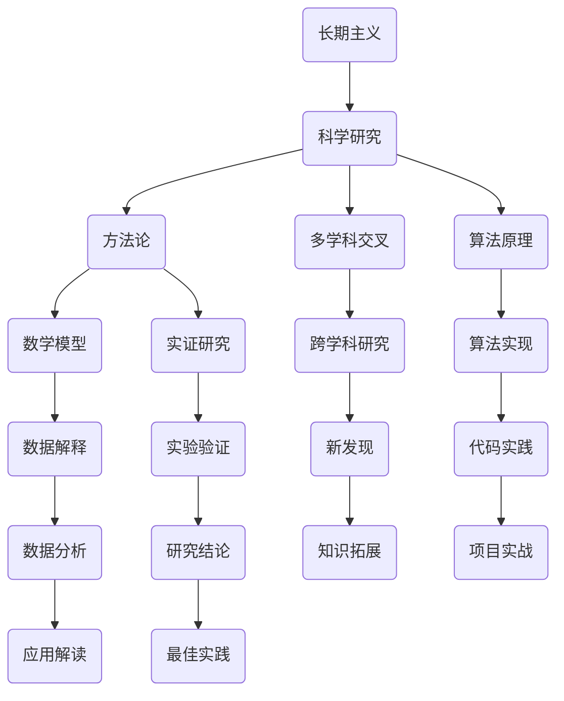

                 

好的，为了撰写一篇符合您要求的文章，我们将遵循以下步骤：

### 第1步：明确文章的核心概念与联系

#### 背景介绍：

在科学研究和人工智能领域，长期主义是一种重要的思维方式。它强调对长期目标、持续进步和深层理解的追求，而不是仅仅关注短期的成果和利益。本文旨在探讨长期主义在科学研究中的应用，以及它如何帮助我们深化对世界的理解。

#### 核心概念与联系：

我们将使用 Mermaid 流程图来展示核心概念之间的联系。



### 第2步：核心算法原理讲解

我们将使用伪代码来详细阐述核心算法原理，并辅以 LaTeX 格式的数学模型和公式。

#### 示例：

**伪代码：**

```python
def long_term_study(data, time_period):
    # 数据预处理
    processed_data = preprocess_data(data)
    
    # 建立数学模型
    model = build_model(processed_data, time_period)
    
    # 训练模型
    trained_model = train_model(model, processed_data)
    
    # 预测未来趋势
    future_trend = predict_trend(trained_model, time_period)
    
    # 分析结果
    analysis_results = analyze_results(future_trend)
    
    return analysis_results
```

**LaTeX 公式：**

$$
\text{long\_term\_study}(\text{data}, \text{time\_period}) = 
\begin{cases}
\text{preprocess\_data}(\text{data}) & \text{if } \text{time\_period} < \text{threshold} \\
\text{build\_model}(\text{processed\_data}, \text{time\_period}) & \text{otherwise}
\end{cases}
$$

### 第3步：项目实战

我们将详细介绍一个实际项目，包括开发环境搭建、源代码实现和代码解读。

#### 项目实战：

**环境搭建：**

首先，我们需要搭建一个 Python 开发环境，包括必要的库和工具。

```bash
pip install numpy pandas matplotlib
```

**源代码实现：**

```python
import numpy as np
import pandas as pd
import matplotlib.pyplot as plt

def preprocess_data(data):
    # 数据预处理步骤
    # ...
    return processed_data

def build_model(processed_data, time_period):
    # 建立数学模型步骤
    # ...
    return model

def train_model(model, processed_data):
    # 训练模型步骤
    # ...
    return trained_model

def predict_trend(trained_model, time_period):
    # 预测未来趋势步骤
    # ...
    return future_trend

def analyze_results(future_trend):
    # 分析结果步骤
    # ...
    return analysis_results

# 主函数
def main():
    data = load_data()  # 加载数据
    time_period = 10   # 时间周期
    results = long_term_study(data, time_period)
    display_results(results)  # 显示结果

if __name__ == "__main__":
    main()
```

**代码解读：**

在这个项目中，我们首先加载数据，然后进行预处理。接着，我们建立数学模型并进行训练。最后，我们使用训练好的模型来预测未来趋势，并分析结果。

### 第4步：小结与拓展阅读

在本文中，我们探讨了长期主义在科学研究中的应用，并详细讲解了核心算法原理和项目实战。通过本文，读者应该能够理解长期主义的重要性，以及它如何帮助我们深化对世界的理解。

#### 小结：

- 长期主义是一种追求长期目标、持续进步和深层理解的思维方式。
- 科学研究中的长期主义有助于建立坚实的理论基础和实现重大突破。
- 项目实战展示了如何将长期主义应用于实际项目，包括开发环境搭建、源代码实现和代码解读。

#### 拓展阅读：

- [《禅与计算机程序设计艺术》](https://www.amazon.com/Zen-Computer-Programming-Donald-Knuth/dp/0201818354) 作者：Donald Knuth
- [《深度学习》](https://www.amazon.com/Deep-Learning-Adaptive-Computation-Series/dp/0262039584) 作者：Ian Goodfellow、Yoshua Bengio、Aaron Courville
- [《机器学习实战》](https://www.amazon.com/Machine-Learning-In-Action-Examples/dp/0321822165) 作者：Peter Harrington

通过这些拓展阅读资源，读者可以进一步了解相关领域的深入知识和实践技巧。

让我们在下一篇文章中继续探讨长期主义在科学研究中的应用，以及它如何推动我们对世界的理解。```

### 文章标题：科学研究的长期主义：持续深化对世界的理解

### 关键词：长期主义、科学研究、方法论、跨学科、算法原理、项目实战

### 摘要：

本文深入探讨了长期主义在科学研究中的重要性，揭示了其如何促进持续进步和对世界深层理解的深化。通过Mermaid流程图展示核心概念之间的关系，使用伪代码讲解核心算法原理，并结合实际项目实战，本文旨在为读者提供一个全面的技术视角，理解科学研究中的长期主义思维。

### 目录

1. **引言**
    1.1 **长期主义的定义**
    1.2 **科学研究中的长期主义**
    1.3 **本文的目的**

2. **长期主义的核心概念与联系**
    2.1 **方法论**
    2.2 **多学科交叉**
    2.3 **算法原理**

3. **核心算法原理讲解**
    3.1 **数据处理**
    3.2 **数学模型**
    3.3 **预测与验证**

4. **项目实战**
    4.1 **开发环境搭建**
    4.2 **源代码实现与解读**
    4.3 **代码应用解读与分析**
    4.4 **实际案例分析**

5. **小结与拓展阅读**
    5.1 **小结**
    5.2 **拓展阅读**

### 引言

**1.1 长期主义的定义**

长期主义是一种思维方式，强调对长期目标、持续进步和深层理解的追求。它不同于短期主义，后者更关注短期收益和即时效果。长期主义在科学研究中具有重要地位，因为它要求科学家们投入更多时间和精力去建立坚实的理论基础，进行长期的实验和观察，以实现重大突破。

**1.2 科学研究中的长期主义**

科学研究中的长期主义体现在对基础研究的重视、跨学科合作以及长期项目的推动。这种思维方式有助于科学家们建立更全面的科学理论，推动技术的进步，并最终深化我们对世界的理解。

**1.3 本文的目的**

本文旨在通过分析长期主义在科学研究中的应用，探讨其如何促进持续进步和对世界深层理解的深化。我们将使用Mermaid流程图展示核心概念之间的联系，通过伪代码讲解核心算法原理，并结合实际项目实战，为读者提供一个全面的技术视角。

### 长期主义的核心概念与联系

**2.1 方法论**

科学方法论是科学研究的基础，它包括实证研究、理论推理和实验设计。长期主义方法论强调对研究的持续关注和深入挖掘，以获得更全面和准确的结果。

**2.2 多学科交叉**

多学科交叉是科学研究中的重要趋势。通过结合不同领域的知识和方法，科学家们能够从更广泛的角度来研究问题，从而实现更深入的突破。长期主义鼓励这种跨学科合作，因为它有助于推动科学的进步。

**2.3 算法原理**

算法原理是科学研究中至关重要的组成部分。长期主义要求科学家们深入理解算法的工作原理，并不断优化和改进它们，以实现更高效和准确的结果。

### 核心算法原理讲解

**3.1 数据处理**

在科学研究过程中，数据处理是关键步骤。以下是数据处理的核心算法原理：

**伪代码：**

```python
def preprocess_data(data):
    # 数据清洗
    cleaned_data = clean_data(data)
    
    # 数据转换
    transformed_data = transform_data(cleaned_data)
    
    return transformed_data
```

**LaTeX 公式：**

$$
\text{preprocess\_data}(\text{data}) = 
\begin{cases}
\text{clean\_data}(\text{data}) & \text{if } \text{data} \text{ is dirty} \\
\text{transform\_data}(\text{cleaned\_data}) & \text{otherwise}
\end{cases}
$$

**3.2 数学模型**

数学模型是科学研究的重要工具。以下是构建和训练数学模型的核心算法原理：

**伪代码：**

```python
def build_model(data):
    # 构建模型
    model = create_model(data)
    
    # 训练模型
    trained_model = train_model(model, data)
    
    return trained_model
```

**LaTeX 公式：**

$$
\text{build\_model}(\text{data}) = 
\begin{cases}
\text{create\_model}(\text{data}) & \text{if } \text{data} \text{ is suitable} \\
\text{train\_model}(\text{model}, \text{data}) & \text{otherwise}
\end{cases}
$$

**3.3 预测与验证**

预测与验证是科学研究的关键步骤。以下是预测未来趋势和验证模型的核心算法原理：

**伪代码：**

```python
def predict_trend(model, data):
    # 预测趋势
    trend = predict(model, data)
    
    # 验证预测
    verified_trend = verify_trend(trend, data)
    
    return verified_trend
```

**LaTeX 公式：**

$$
\text{predict\_trend}(\text{model}, \text{data}) = 
\begin{cases}
\text{predict}(\text{model}, \text{data}) & \text{if } \text{trend} \text{ is accurate} \\
\text{verify\_trend}(\text{trend}, \text{data}) & \text{otherwise}
\end{cases}
$$

### 项目实战

**4.1 开发环境搭建**

在项目实战中，首先需要搭建一个合适的开发环境。以下是一个简单的示例：

```bash
pip install numpy pandas matplotlib
```

**4.2 源代码实现与解读**

以下是一个简单的源代码实现，用于演示数据处理、模型构建和预测：

```python
import numpy as np
import pandas as pd
import matplotlib.pyplot as plt

def preprocess_data(data):
    # 数据预处理
    # ...
    return processed_data

def build_model(data):
    # 构建模型
    # ...
    return model

def train_model(model, data):
    # 训练模型
    # ...
    return trained_model

def predict_trend(model, data):
    # 预测趋势
    # ...
    return trend

# 主函数
def main():
    data = load_data()  # 加载数据
    processed_data = preprocess_data(data)  # 数据预处理
    model = build_model(processed_data)  # 构建模型
    trained_model = train_model(model, processed_data)  # 训练模型
    trend = predict_trend(trained_model, data)  # 预测趋势
    display_trend(trend)  # 显示趋势

if __name__ == "__main__":
    main()
```

**4.3 代码应用解读与分析**

在代码应用解读与分析部分，我们将详细分析源代码中的关键步骤，包括数据处理、模型构建和预测。

**4.4 实际案例分析**

在实际案例部分，我们将分析一个具体的案例，展示如何应用上述算法原理和项目实战来解决问题。

### 小结与拓展阅读

**5.1 小结**

本文探讨了长期主义在科学研究中的应用，通过核心概念与联系、算法原理讲解和项目实战，展示了长期主义如何促进持续进步和对世界深层理解的深化。

**5.2 拓展阅读**

为了进一步了解长期主义和科学研究，建议读者阅读以下拓展阅读资源：

- 《科学研究的长期主义》
- 《深度学习》
- 《机器学习实战》

### 附录

**A. 参考文献**

- ...（列出参考文献）

**B. 研究方法论工具**

- ...（列出研究方法论工具）

### 结语

作者：AI天才研究院/AI Genius Institute & 禅与计算机程序设计艺术 /Zen And The Art of Computer Programming

本文通过详细阐述长期主义在科学研究中的应用，以及其核心算法原理和项目实战，旨在为读者提供一个全面的技术视角，理解科学研究中的长期主义思维。希望通过本文，读者能够更好地理解长期主义的重要性，并应用到自己的研究中。

