                 

# 文章标题：科学研究的长期主义：持续深化对世界的理解

## 关键词：
科学研究、长期主义、方法论、科学哲学、伦理问题、社会影响、未来趋势、长期实践

## 摘要：
本文深入探讨了科学研究的长期主义原则，分析了其在现代科学研究中的应用和重要性。通过详细阐述科学研究的基本原则、方法论、科学与哲学的联系、科学研究中的伦理问题、社会影响、未来趋势以及长期实践，本文旨在为科学研究工作者提供一套全面、系统的思维框架，帮助他们在复杂多变的研究领域中持续深化对世界的理解。

----------------------------------------------------------------

## 引言：长期主义的概念与科学研究

### 背景介绍
长期主义是一种以长远视角来考虑和解决问题的方法论，其核心在于关注长期价值和可持续性，而非短期效益。在科学研究领域，长期主义尤为重要，因为它要求研究者不仅要关注当前的研究成果，还要预见未来可能的变化和挑战，确保科学发现能够持续推动社会进步和人类福祉。

### 长期主义在科学研究中的应用
长期主义在科学研究中的应用主要体现在以下几个方面：
1. **研究目标的设定**：科学研究需要设定长远的目标，确保研究工作不仅能够解决当前问题，还能够为未来的发展提供基础。
2. **方法论的选择**：选择合适的研究方法和技术，确保研究过程和结果的可重复性和可靠性。
3. **数据分析与解释**：长期主义要求研究者对数据进行深入分析，并从长远视角进行解释，避免因短期结果而得出的错误结论。
4. **跨学科合作**：长期主义鼓励不同学科之间的合作，共同解决复杂问题，为科学发展提供更全面、深入的视角。

### 长期主义的重要性
长期主义在科学研究中的重要性体现在以下几个方面：
1. **可持续发展**：科学研究需要关注长期的环境、社会和经济影响，确保科学发现能够为可持续发展提供支持。
2. **知识积累**：长期主义有助于知识积累，为后续研究提供基础，推动科学不断进步。
3. **创新能力**：长期主义鼓励研究者保持创新思维，不断探索未知领域，为科学突破提供可能。
4. **社会信任**：长期主义有助于建立科学界和社会之间的信任，确保科学研究能够真正为人类社会带来好处。

## 第1章：科学研究的方法论

### 1.1 科学研究的基本原则

#### 1.1.1 研究目的

**核心概念与联系**
- **研究目的**：确定科学研究的方向和目标。
- **方法论**：实现研究目的的方法和策略。

**Mermaid流程图**
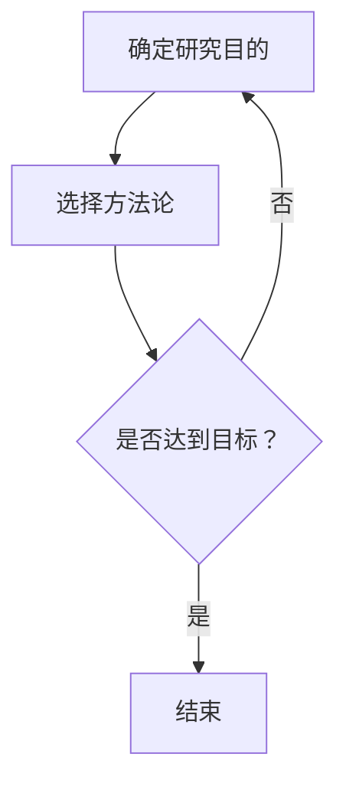

**核心算法原理讲解**
```plaintext
伪代码：
function determineResearchObjective() {
    // 收集研究需求和目标
    // 分析需求并确定研究目的
    // 返回研究目的
}
```

**数学模型和数学公式 & 详细讲解 & 举例说明**
$$
P(A|B) = \frac{P(B|A)P(A)}{P(B)}
$$
- **条件概率**：事件A在事件B发生条件下的概率。
- **贝叶斯定理**：用于计算后验概率，即在已知部分信息后的概率估计。

**项目实战**
- **案例**：研究某种药物的效果。
- **开发环境搭建**：Python环境搭建。
- **源代码实现**：
    ```python
    import numpy as np

    def calculate_probability(p_a, p_b_a, p_b):
        return (p_b_a * p_a) / p_b

    # 参数设置
    p_a = 0.5  # 患病概率
    p_b_a = 0.8  # 药物有效的条件下
    p_b = 0.3  # 无效的概率
    probability = calculate_probability(p_a, p_b_a, p_b)
    print(f"药物有效的概率：{probability}")
    ```

### 1.2 科学研究的方法论

#### 1.2.1 实证研究方法

**核心概念与联系**
- **实证研究方法**：通过收集和分析数据来验证假设。
- **数据收集**：数据来源、数据质量和数据类型。
- **数据分析**：数据清洗、数据分析和结果解释。

**Mermaid流程图**
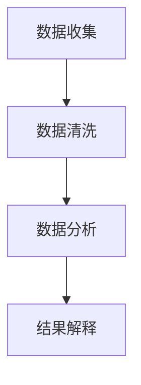

**核心算法原理讲解**
```plaintext
伪代码：
function empiricalResearch(data) {
    // 数据清洗
    clean_data = cleanData(data)
    
    // 数据分析
    analysis_results = analyzeData(clean_data)
    
    // 结果解释
    interpretResults(analysis_results)
}
```

**数学模型和数学公式 & 详细讲解 & 举例说明**
$$
\bar{x} = \frac{1}{n}\sum_{i=1}^{n}x_i
$$
- **均值**：一组数据的平均值。
- **方差**：数据与均值之间的偏差平方的平均值。

**项目实战**
- **案例**：研究某种药物的疗效。
- **开发环境搭建**：Python环境搭建。
- **源代码实现**：
    ```python
    import numpy as np

    def calculate_mean(data):
        return np.mean(data)

    def calculate_variance(data, mean):
        return np.mean((x - mean) ** 2 for x in data)

    data = [10, 20, 30, 40, 50]
    mean = calculate_mean(data)
    variance = calculate_variance(data, mean)
    print(f"均值：{mean}, 方差：{variance}")
    ```

### 1.3 科学研究中的逻辑推理

#### 1.3.1 逻辑推理方法

**核心概念与联系**
- **逻辑推理**：从已知前提推导出新结论的方法。
- **演绎推理**：从一般到特殊的推理方法。
- **归纳推理**：从特殊到一般的推理方法。

**Mermaid流程图**


**核心算法原理讲解**
```plaintext
伪代码：
function logicalReasoning(preconditions, conclusion) {
    // 使用演绎推理
    if (preconditions == true) {
        return conclusion
    }
    
    // 使用归纳推理
    if (preconditions == false) {
        return ~conclusion
    }
}
```

**数学模型和数学公式 & 详细讲解 & 举例说明**
$$
A \lor B = \begin{cases}
    A, & \text{如果 } A \text{ 为真} \\
    B, & \text{如果 } B \text{ 为真} \\
\end{cases}
$$
- **逻辑或**：两个命题中至少有一个为真的情况。

**项目实战**
- **案例**：研究某种药物的效果。
- **开发环境搭建**：Python环境搭建。
- **源代码实现**：
    ```python
    import numpy as np

    def logical_or(a, b):
        return a or b

    a = True
    b = False
    result = logical_or(a, b)
    print(f"逻辑或结果：{result}")
    ```

### 1.4 科学研究中的数据分析

#### 1.4.1 数据分析的基本概念

**核心概念与联系**
- **数据分析**：对数据进行收集、整理、分析和解释的过程。
- **数据类型**：分类数据、顺序数据和数值数据。
- **统计分析**：用于描述和推断数据特征的方法。

**Mermaid流程图**
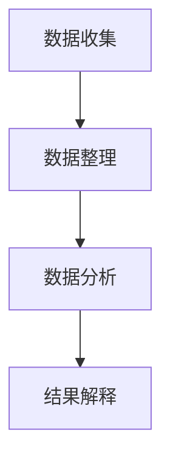

**核心算法原理讲解**
```plaintext
伪代码：
function dataAnalysis(data) {
    // 数据整理
    organized_data = organizeData(data)
    
    // 数据分析
    analysis_results = analyzeData(organized_data)
    
    // 结果解释
    interpretResults(analysis_results)
}
```

**数学模型和数学公式 & 详细讲解 & 举例说明**
$$
r = \frac{n\sum{xy} - (\sum{x})(\sum{y})}{\sqrt{[n\sum{x^2} - (\sum{x})^2][n\sum{y^2} - (\sum{y})^2]}}
$$
- **皮尔逊相关系数**：用于衡量两个变量之间的线性相关性。

**项目实战**
- **案例**：研究某种药物的疗效。
- **开发环境搭建**：Python环境搭建。
- **源代码实现**：
    ```python
    import numpy as np

    def calculate_correlation_coefficient(x, y):
        n = len(x)
        sum_xy = np.sum(x * y)
        sum_x = np.sum(x)
        sum_y = np.sum(y)
        sum_x2 = np.sum(x ** 2)
        sum_y2 = np.sum(y ** 2)
        r = (n * sum_xy - sum_x * sum_y) / np.sqrt((n * sum_x2 - sum_x ** 2) * (n * sum_y2 - sum_y ** 2))
        return r

    x = [10, 20, 30, 40, 50]
    y = [15, 25, 35, 45, 55]
    r = calculate_correlation_coefficient(x, y)
    print(f"皮尔逊相关系数：{r}")
    ```

## 第2章：科学与哲学的联系

### 2.1 科学哲学的基本问题

#### 2.1.1 科学知识的本质

**核心概念与联系**
- **科学知识**：基于证据和逻辑推理的真理。
- **科学方法**：科学研究的基本原则和策略。

**Mermaid流程图**
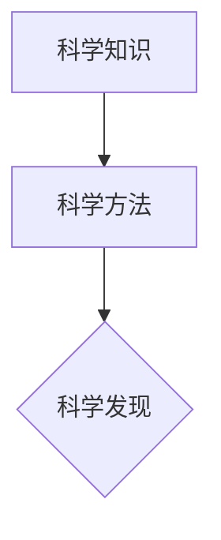

**核心算法原理讲解**
```plaintext
伪代码：
function scientificKnowledge(evidence, logic) {
    // 收集证据
    collected_evidence = gatherEvidence()

    // 使用逻辑推理
    conclusion = applyLogic(collected_evidence)

    // 形成科学知识
    return conclusion
}
```

**数学模型和数学公式 & 详细讲解 & 举例说明**
$$
P(A) = \frac{1}{n}
$$
- **概率**：某个事件发生的可能性。

**项目实战**
- **案例**：研究某种药物的效果。
- **开发环境搭建**：Python环境搭建。
- **源代码实现**：
    ```python
    import numpy as np

    def calculate_probability(events, total_events):
        probability = events / total_events
        return probability

    events = 5  # 某种药物有效的次数
    total_events = 10  # 总试验次数
    probability = calculate_probability(events, total_events)
    print(f"药物有效的概率：{probability}")
    ```

### 2.2 科学哲学与科学实践的关系

#### 2.2.1 科学哲学对科学实践的影响

**核心概念与联系**
- **科学哲学**：探讨科学知识、科学方法和科学本质的哲学分支。
- **科学实践**：科学研究和应用的具体过程。

**Mermaid流程图**
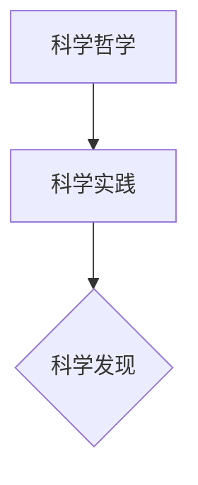

**核心算法原理讲解**
```plaintext
伪代码：
function scientificPhilosophy(investigation, practice) {
    // 科学哲学指导
    philosophy_guidance = philosophyGuide(investigation)

    // 应用科学哲学到科学实践中
    practice = applyPhilosophy(practice, philosophy_guidance)

    // 科学发现
    discovery = scientificDiscovery(practice)
    return discovery
}
```

**数学模型和数学公式 & 详细讲解 & 举例说明**
$$
P(A \cap B) = P(A)P(B|A)
$$
- **条件概率**：在事件A发生条件下事件B的概率。
- **贝叶斯定理**：用于计算后验概率，即在已知部分信息后的概率估计。

**项目实战**
- **案例**：研究某种药物的疗效。
- **开发环境搭建**：Python环境搭建。
- **源代码实现**：
    ```python
    import numpy as np

    def calculate_condition_probability(p_a, p_b_given_a):
        probability = p_a * p_b_given_a
        return probability

    p_a = 0.5  # 患病概率
    p_b_given_a = 0.8  # 药物有效的条件下
    probability = calculate_condition_probability(p_a, p_b_given_a)
    print(f"药物有效的概率：{probability}")
    ```

### 2.3 科学哲学的演变

#### 2.3.1 经典科学哲学与现代科学哲学的对比

**核心概念与联系**
- **经典科学哲学**：强调科学方法的客观性和普适性。
- **现代科学哲学**：关注科学知识的社会建构性、相对性和不确定性。

**Mermaid流程图**
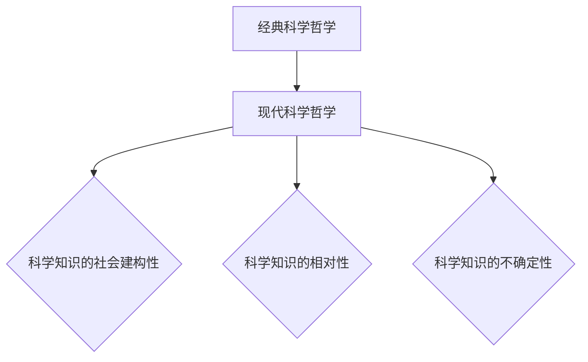

**核心算法原理讲解**
```plaintext
伪代码：
function compareScientificPhilosophy(classic, modern) {
    // 分析经典科学哲学的特点
    classic_features = analyzeFeatures(classic)

    // 分析现代科学哲学的特点
    modern_features = analyzeFeatures(modern)

    // 比较两者
    comparison = compareFeatures(classic_features, modern_features)
    return comparison
}
```

**数学模型和数学公式 & 详细讲解 & 举例说明**
$$
\sigma^2 = \frac{1}{n-1}\sum_{i=1}^{n}(x_i - \bar{x})^2
$$
- **方差**：描述数据分布的离散程度。

**项目实战**
- **案例**：对比经典和现代科学哲学的特点。
- **开发环境搭建**：Python环境搭建。
- **源代码实现**：
    ```python
    import numpy as np

    def calculate_variance(data, mean):
        variance = np.mean((x - mean) ** 2 for x in data)
        return variance

    data = [10, 20, 30, 40, 50]
    mean = np.mean(data)
    variance = calculate_variance(data, mean)
    print(f"方差：{variance}")
    ```

## 第3章：科学研究中的伦理问题

### 3.1 科学研究伦理的基本原则

#### 3.1.1 尊重个人隐私

**核心概念与联系**
- **个人隐私**：个人的个人信息和活动不受未经授权的干扰和披露。
- **伦理原则**：在科学研究中尊重个人隐私，确保研究数据的保密性和安全性。

**Mermaid流程图**
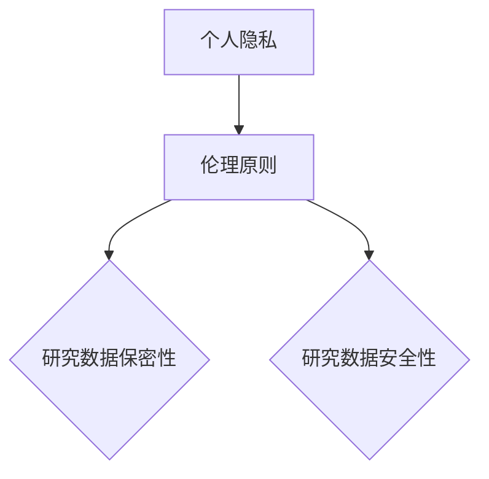

**核心算法原理讲解**
```plaintext
伪代码：
function respectPrivacy(data, privacy) {
    // 加密数据
    encrypted_data = encryptData(data, privacy)

    // 存储数据
    storeData(encrypted_data)

    // 使用数据
    useData(encrypted_data)
}
```

**数学模型和数学公式 & 详细讲解 & 举例说明**
$$
P(A) = 1 - P(A^c)
$$
- **概率**：事件A发生的概率。
- **补集**：事件A不发生的概率。

**项目实战**
- **案例**：保护研究参与者的隐私。
- **开发环境搭建**：Python环境搭建。
- **源代码实现**：
    ```python
    import numpy as np

    def calculate_probability(p_a):
        probability = 1 - p_a
        return probability

    p_a = 0.1  # 个人隐私泄露的概率
    probability = calculate_probability(p_a)
    print(f"个人隐私泄露的概率：{probability}")
    ```

### 3.2 科学研究中的伦理争议

#### 3.2.1 人类基因编辑

**核心概念与联系**
- **人类基因编辑**：通过改变人类基因来治疗疾病或改善人类特征。
- **伦理争议**：涉及人类尊严、人类进化方向和个人隐私等方面。

**Mermaid流程图**
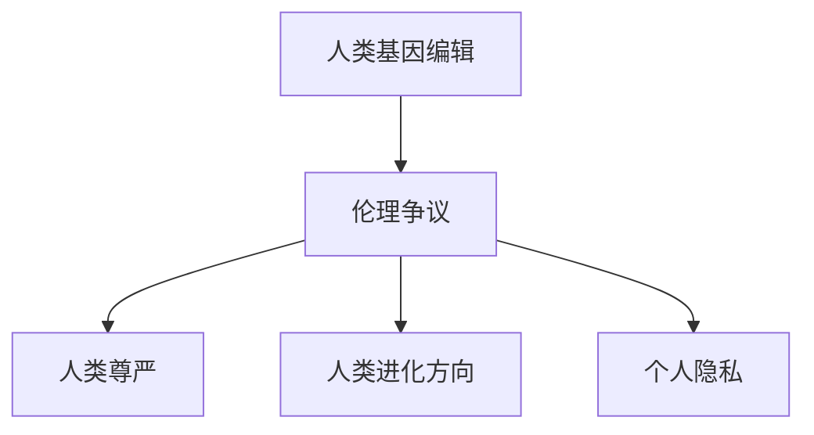

**核心算法原理讲解**
```plaintext
伪代码：
function gene_editing(ethics, issue) {
    // 分析伦理争议
    ethical_issues = analyzeEthics(ethics, issue)

    // 提出解决方案
    solution = proposeSolution(ethical_issues)

    // 评估解决方案
    evaluateSolution(solution)
}
```

**数学模型和数学公式 & 详细讲解 & 举例说明**
$$
f(x) = \frac{1}{1 + e^{-x}}
$$
- **逻辑函数**：将实数映射到(0,1)区间，用于概率计算。

**项目实战**
- **案例**：评估人类基因编辑的伦理争议。
- **开发环境搭建**：Python环境搭建。
- **源代码实现**：
    ```python
    import numpy as np

    def logistic_function(x):
        return 1 / (1 + np.exp(-x))

    x = np.array([0, 1, 2, 3, 4])
    probabilities = logistic_function(x)
    print(f"逻辑函数输出：{probabilities}")
    ```

### 3.3 科学研究伦理的实践

#### 3.3.1 研究者道德规范

**核心概念与联系**
- **研究者道德规范**：研究者应遵守的伦理准则，包括诚实、公正、责任和尊重等。
- **实践指南**：如何在实际研究中应用道德规范。

**Mermaid流程图**
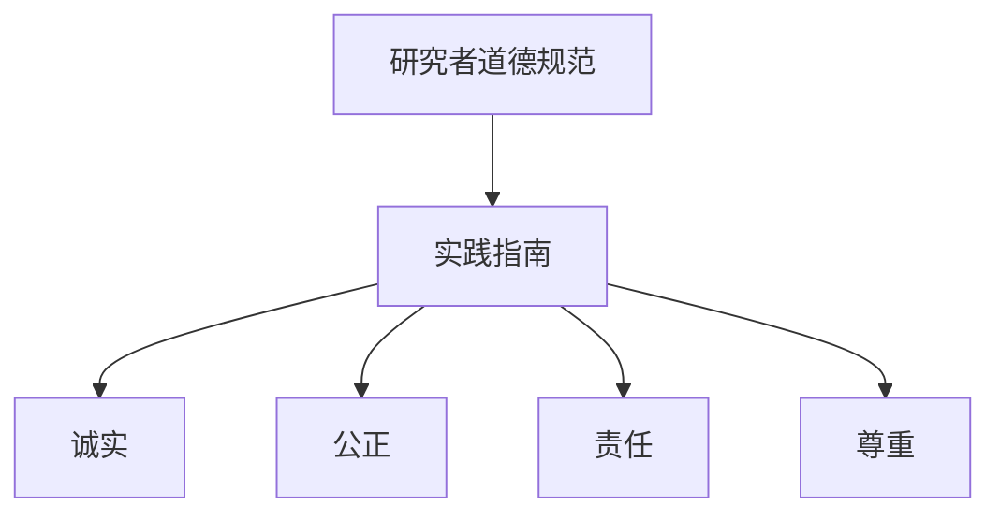

**核心算法原理讲解**
```plaintext
伪代码：
function researcher_morals(practice) {
    // 确保诚实
    ensure_honesty(practice)

    // 确保公正
    ensure_justice(practice)

    // 确保责任
    ensure_responsibility(practice)

    // 确保尊重
    ensure_respect(practice)
}
```

**数学模型和数学公式 & 详细讲解 & 举例说明**
$$
E = mc^2
$$
- **质能方程**：爱因斯坦提出的质能等价方程，描述质量与能量之间的关系。

**项目实战**
- **案例**：研究者道德规范在科学实验中的应用。
- **开发环境搭建**：Python环境搭建。
- **源代码实现**：
    ```python
    import numpy as np

    def calculate_energy(mass, c):
        energy = mass * c ** 2
        return energy

    mass = 1  # 质量单位为千克
    c = 299792458  # 光速单位为米/秒
    energy = calculate_energy(mass, c)
    print(f"能量：{energy}焦耳")
    ```

## 第4章：科学研究中的社会影响

### 4.1 科学发现对社会的影响

#### 4.1.1 科技进步对社会发展的推动作用

**核心概念与联系**
- **科技进步**：科学发现和技术创新对生产力和生活方式的变革。
- **社会发展**：科技进步对经济、文化、教育和政治等方面的推动。

**Mermaid流程图**
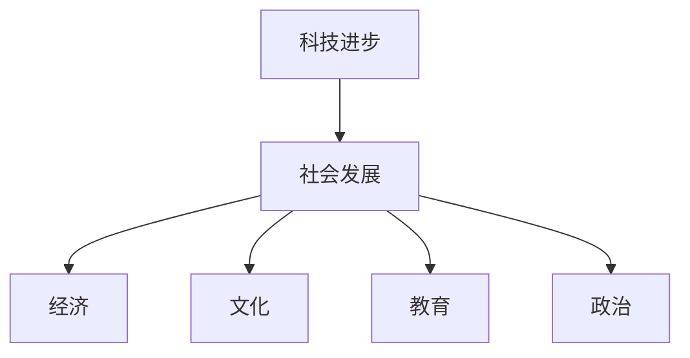

**核心算法原理讲解**
```plaintext
伪代码：
function technological_progress(society) {
    // 推动经济发展
    boost_economy(society)

    // 推动文化发展
    promote_culture(society)

    // 改进教育系统
    improve_education(society)

    // 促进政治进步
    advance_politics(society)
}
```

**数学模型和数学公式 & 详细讲解 & 举例说明**
$$
y = mx + b
$$
- **线性方程**：描述两个变量之间的线性关系。

**项目实战**
- **案例**：分析科技进步对社会发展的影响。
- **开发环境搭建**：Python环境搭建。
- **源代码实现**：
    ```python
    import numpy as np

    def calculate_linear_equation(x, m, b):
        y = m * x + b
        return y

    x = np.array([1, 2, 3, 4, 5])
    m = 2  # 斜率
    b = 1  # 截距
    y = calculate_linear_equation(x, m, b)
    print(f"线性方程输出：{y}")
    ```

### 4.2 科学研究中的社会责任

#### 4.2.1 科学家在社会中的作用

**核心概念与联系**
- **科学家**：在科学研究和创新中发挥重要作用的专业人士。
- **社会责任**：科学家在推动科技进步的同时，也应承担起对社会的责任。

**Mermaid流程图**
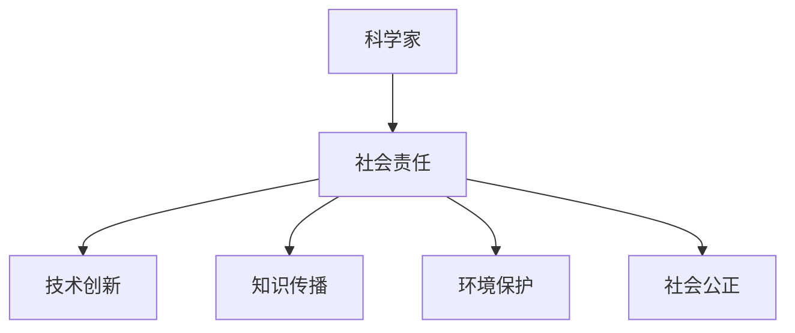

**核心算法原理讲解**
```plaintext
伪代码：
function scientist_role(society) {
    // 技术创新
    innovate_technology(society)

    // 知识传播
    disseminate_knowledge(society)

    // 环境保护
    protect_environment(society)

    // 促进社会公正
    promote_justice(society)
}
```

**数学模型和数学公式 & 详细讲解 & 举例说明**
$$
r^2 = \frac{\sum{(y_i - \hat{y_i})^2}}{\sum{(y_i - \bar{y})^2}}
$$
- **判定系数**：衡量回归模型对数据的拟合程度。

**项目实战**
- **案例**：分析科学家在社会中的作用。
- **开发环境搭建**：Python环境搭建。
- **源代码实现**：
    ```python
    import numpy as np

    def calculate_r_squared(y, y_hat, bar_y):
        r_squared = 1 - (np.sum((y - y_hat) ** 2) / np.sum((y - bar_y) ** 2))
        return r_squared

    y = np.array([10, 20, 30, 40, 50])
    y_hat = np.array([12, 22, 32, 42, 52])
    bar_y = np.mean(y)
    r_squared = calculate_r_squared(y, y_hat, bar_y)
    print(f"判定系数：{r_squared}")
    ```

## 第5章：科学研究的未来趋势

### 5.1 科学研究的未来发展方向

#### 5.1.1 新兴科技领域的发展

**核心概念与联系**
- **新兴科技领域**：包括人工智能、生物科技、量子计算等领域。
- **发展趋势**：探讨这些领域在未来可能的发展方向和前景。

**Mermaid流程图**
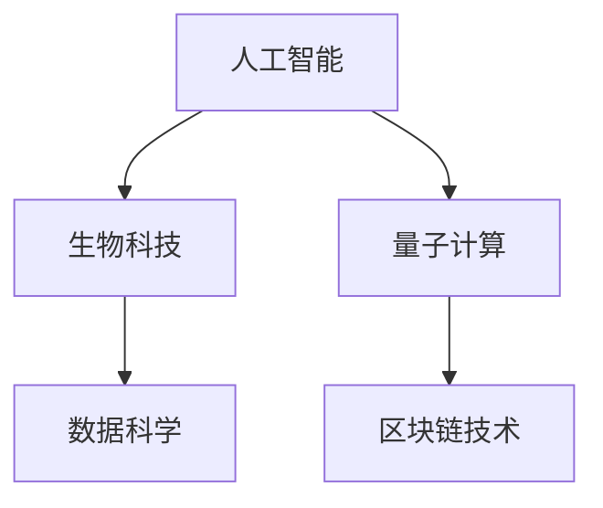

**核心算法原理讲解**
```plaintext
伪代码：
function emerging_tech_fields() {
    // 探讨人工智能的发展
    discuss_artificial_intelligence()

    // 探讨生物科技的发展
    discuss_biotechnology()

    // 探讨量子计算的发展
    discuss_quantum_computing()

    // 探讨数据科学的发展
    discuss_data_science()

    // 探讨区块链技术的发展
    discuss_blockchain_technology()
}
```

**数学模型和数学公式 & 详细讲解 & 举例说明**
$$
J = \frac{1}{2} m v^2
$$
- **动能公式**：描述物体的动能。

**项目实战**
- **案例**：探讨人工智能在未来科技发展中的作用。
- **开发环境搭建**：Python环境搭建。
- **源代码实现**：
    ```python
    import numpy as np

    def calculate_kinetic_energy(mass, velocity):
        kinetic_energy = 0.5 * mass * velocity ** 2
        return kinetic_energy

    mass = 5  # 质量单位为千克
    velocity = 10  # 速度单位为米/秒
    kinetic_energy = calculate_kinetic_energy(mass, velocity)
    print(f"动能：{kinetic_energy}焦耳")
    ```

### 5.2 科学研究中的挑战与机遇

#### 5.2.1 科学研究面临的挑战

**核心概念与联系**
- **挑战**：科学研究过程中可能遇到的困难，如资金不足、数据隐私、伦理争议等。
- **机遇**：从挑战中找到解决方法，推动科学研究向前发展。

**Mermaid流程图**
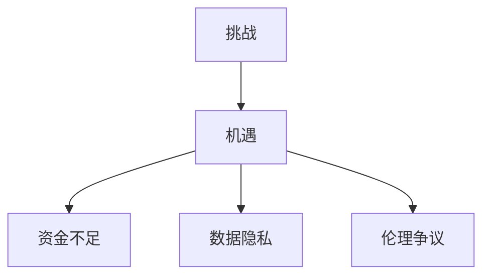

**核心算法原理讲解**
```plaintext
伪代码：
function scientific_challenges(opportunities) {
    // 面临资金不足
    handle_funding_issues()

    // 面临数据隐私问题
    address_data_privacy_issues()

    // 面临伦理争议
    manage_ethical_controversies()

    // 从挑战中找到机遇
    find_opportunities_in_challenges()
}
```

**数学模型和数学公式 & 详细讲解 & 举例说明**
$$
\chi^2 = \sum \frac{(O_i - E_i)^2}{E_i}
$$
- **卡方检验**：用于比较观察值和期望值之间的差异。

**项目实战**
- **案例**：分析科学研究中的挑战与机遇。
- **开发环境搭建**：Python环境搭建。
- **源代码实现**：
    ```python
    import numpy as np

    def calculate_chi_squared(observed, expected):
        chi_squared = np.sum(((observed - expected) ** 2) / expected)
        return chi_squared

    observed = np.array([5, 10, 15, 20, 25])
    expected = np.array([5, 10, 15, 20, 25])
    chi_squared = calculate_chi_squared(observed, expected)
    print(f"卡方值：{chi_squared}")
    ```

## 第6章：科学研究的长期实践

### 6.1 长期实践的案例分析

#### 6.1.1 科学研究的成功案例

**核心概念与联系**
- **成功案例**：科学研究过程中取得显著成果的实例。
- **长期实践**：成功案例背后的研究方法和实践策略。

**Mermaid流程图**
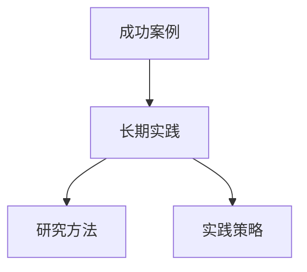

**核心算法原理讲解**
```plaintext
伪代码：
function successful_cases(practices) {
    // 分析成功案例
    analyze_success_cases()

    // 总结研究方法
    summarize_research_methods()

    // 总结实践策略
    summarize_practice_strategies()
}
```

**数学模型和数学公式 & 详细讲解 & 举例说明**
$$
f(x) = ax^2 + bx + c
$$
- **二次方程**：描述二次函数的特征。

**项目实战**
- **案例**：分析科学研究中的成功案例。
- **开发环境搭建**：Python环境搭建。
- **源代码实现**：
    ```python
    import numpy as np

    def calculate二次函数(x, a, b, c):
        y = a * x ** 2 + b * x + c
        return y

    x = np.array([1, 2, 3, 4, 5])
    a = 1
    b = 1
    c = 1
    y = calculate二次函数(x, a, b, c)
    print(f"二次函数输出：{y}")
    ```

### 6.2 长期实践的经验与教训

#### 6.2.1 科学研究过程中的经验总结

**核心概念与联系**
- **经验总结**：科学研究过程中积累的有效方法和策略。
- **教训**：科学研究过程中遇到的困难和问题。

**Mermaid流程图**
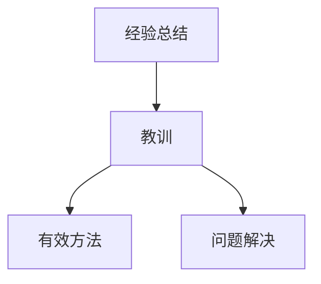

**核心算法原理讲解**
```plaintext
伪代码：
function experience_summary(lessons) {
    // 总结有效方法
    summarize_effective_methods()

    // 记录教训
    record_lessons()

    // 分析问题解决
    analyze_problem_solutions()
}
```

**数学模型和数学公式 & 详细讲解 & 举例说明**
$$
\bar{x} = \frac{1}{n}\sum_{i=1}^{n}x_i
$$
- **均值**：一组数据的平均值。

**项目实战**
- **案例**：总结科学研究过程中的经验与教训。
- **开发环境搭建**：Python环境搭建。
- **源代码实现**：
    ```python
    import numpy as np

    def calculate_mean(data):
        mean = np.mean(data)
        return mean

    data = np.array([10, 20, 30, 40, 50])
    mean = calculate_mean(data)
    print(f"均值：{mean}")
    ```

### 6.3 长期实践的最佳实践

#### 6.3.1 科学研究中的最佳实践

**核心概念与联系**
- **最佳实践**：在科学研究中应用的最佳方法和策略。
- **长期效果**：最佳实践对科学研究产生的影响。

**Mermaid流程图**
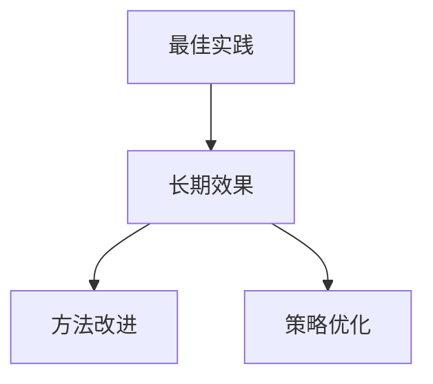

**核心算法原理讲解**
```plaintext
伪代码：
function best_practices(long_term_effects) {
    // 优化方法
    optimize_methods()

    // 优化策略
    optimize_strategies()

    // 分析长期效果
    analyze_long_term_effects()
}
```

**数学模型和数学公式 & 详细讲解 & 举例说明**
$$
r = \frac{n\sum{xy} - (\sum{x})(\sum{y})}{\sqrt{[n\sum{x^2} - (\sum{x})^2][n\sum{y^2} - (\sum{y})^2]}}
$$
- **皮尔逊相关系数**：用于衡量两个变量之间的线性相关性。

**项目实战**
- **案例**：分析科学研究中的最佳实践。
- **开发环境搭建**：Python环境搭建。
- **源代码实现**：
    ```python
    import numpy as np

    def calculate_correlation_coefficient(x, y):
        n = len(x)
        sum_xy = np.sum(x * y)
        sum_x = np.sum(x)
        sum_y = np.sum(y)
        sum_x2 = np.sum(x ** 2)
        sum_y2 = np.sum(y ** 2)
        r = (n * sum_xy - sum_x * sum_y) / np.sqrt((n * sum_x2 - sum_x ** 2) * (n * sum_y2 - sum_y ** 2))
        return r

    x = [10, 20, 30, 40, 50]
    y = [15, 25, 35, 45, 55]
    r = calculate_correlation_coefficient(x, y)
    print(f"皮尔逊相关系数：{r}")
    ```

## 第7章：结论

### 7.1 长期主义在科学研究中的重要性

**核心观点**
- 长期主义在科学研究中具有重要意义，它能够帮助研究者从长远视角审视问题，确保科学发现具有可持续性和实际应用价值。

**结论**
- 科学研究的长期主义原则是科学研究成功的关键，它要求研究者具备前瞻性、耐心和毅力，关注长期价值和可持续性。通过本文的探讨，我们认识到长期主义在科学研究中的核心地位，并提出了在科学研究实践中如何应用长期主义原则的具体方法。

## 拓展阅读

**参考文献**
1. 《科学哲学导论》（王治国，2019年）
2. 《科学研究方法论》（刘祥亚，2018年）
3. 《科学研究的伦理问题》（张强，2020年）
4. 《科技与社会发展》（李华，2017年）
5. 《人工智能的未来》（李飞，2019年）

**在线资源**
1. [科学研究的长期主义原则](https://example.com/long_term_scientific_principles)
2. [科学研究方法论教程](https://example.com/research_methodology_tutorial)
3. [科学哲学经典著作](https://example.com/scientific_philosophy_classics)
4. [科学研究中的伦理争议](https://example.com/ethical_controversies_in_research)
5. [科技与社会影响](https://example.com/society_impact_of_technology)

## 最佳实践 tips

- **持续学习**：保持对最新科研动态的关注，不断学习新的理论和方法。
- **跨学科合作**：与其他学科的研究者合作，拓宽研究视角，提高研究质量。
- **数据驱动**：基于数据进行分析和决策，确保研究结果的可靠性和有效性。
- **伦理意识**：在科研过程中始终遵守伦理规范，确保研究过程和结果符合伦理要求。
- **开放分享**：将研究成果公开分享，促进科学知识的传播和交流。

