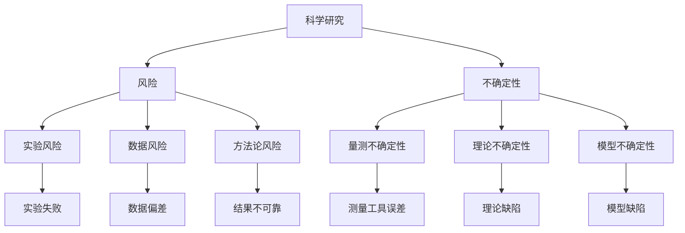

                 

### 文章标题：科学研究的风险与不确定性：世界可理解性的挑战

> 关键词：科学研究、风险、不确定性、世界可理解性、挑战

> 摘要：本文从科学研究的本质出发，深入探讨了风险与不确定性的概念，并分析了它们如何影响科学研究的进展和世界可理解性。通过案例分析，本文展示了风险与不确定性在科学研究中的重要性和复杂性，提出了应对这些挑战的策略和未来研究方向。

---

科学，作为人类认识世界和探索未知的重要途径，一直被认为是客观和理性的代表。然而，科学研究的过程并非一帆风顺，其中充满了各种风险与不确定性。这些风险和不确定性不仅对科学研究的进展构成了挑战，也对我们对世界的可理解性提出了质疑。本文将围绕这一主题，深入探讨科学研究的风险与不确定性，以及它们对世界可理解性的影响。

---

### 第一部分：引言

#### 1.1 科学研究的本质

科学研究是一种探索和发现的过程，旨在通过系统的实验和观察来理解自然现象和规律。科学研究的本质在于其客观性和理性，追求事实和证据的支持。然而，这种追求并不是一帆风顺的，因为科学研究过程中总会遇到各种不可预见的因素，这些因素构成了科学研究的风险和不确定性。

#### 1.2 风险与不确定性的概念

风险是指可能对科学研究产生负面影响的因素，包括实验失败、数据丢失、方法论的缺陷等。不确定性则是指无法精确预测或测量的因素，如量测误差、理论的不完备、模型的不确定性等。风险和不确定性是科学研究中不可避免的问题，但它们也为我们提供了改进科学方法、提高研究可靠性的动力。

### 第二部分：科学研究的风险

#### 2.1 风险的类型

科学研究的风险可以分为实验风险、数据风险和方法论风险。

##### 2.1.1 实验风险

实验风险主要指实验过程中可能出现的意外情况，如设备故障、实验操作失误等。这些风险可能导致实验失败，从而影响研究结果的可靠性。

##### 2.1.2 数据风险

数据风险主要指数据收集、处理和分析过程中可能出现的错误。数据风险可能导致研究结果的偏差，影响科学研究的进展。

##### 2.1.3 方法论风险

方法论风险指研究方法或假设的缺陷，可能导致研究结果不可靠。方法论风险要求科学家在研究设计时就要充分考虑，以避免错误的发生。

#### 2.2 风险管理的策略

为了降低科学研究的风险，科学家可以采取以下策略：

##### 2.2.1 风险识别

在研究初期，科学家需要识别可能存在的风险，并进行评估。这有助于提前预防和控制风险。

##### 2.2.2 风险评估

对识别出的风险进行评估，判断其可能对研究的影响程度。这有助于科学家确定优先处理的风险。

##### 2.2.3 风险缓解

通过采取相应措施，降低风险的影响程度。这可能包括改进实验设计、数据备份、选择更可靠的方法等。

---

### 第三部分：不确定性的本质

#### 3.1 不确定性在科学研究中的作用

不确定性在科学研究中具有重要作用。它促使科学家不断质疑和改进现有理论，推动科学的发展。

#### 3.2 不确定性的来源

不确定性主要来源于量测误差、理论的不完备和模型的不确定性。

##### 3.2.1 量测不确定性

量测不确定性是由于测量工具的精度限制导致的。例如，温度计的读数可能存在微小误差。

##### 3.2.2 理论不确定性

理论不确定性源于我们对某些自然现象的理解还不够深入，无法准确预测其行为。

##### 3.2.3 模型不确定性

模型不确定性指模型本身的缺陷或参数的不确定性，可能导致研究结果与实际情况不符。

---

### 第四部分：世界可理解性

#### 4.1 世界可理解性的概念

世界可理解性是指人类对自然界的认知程度。它反映了我们对自然规律的掌握和理解。

#### 4.2 人类对世界理解的历史发展

从古代的哲学思考到现代的科学发现，人类对世界的理解经历了漫长的发展过程。这一过程充满了挑战和突破。

#### 4.3 可理解性的限制

尽管科学的发展使我们对世界的理解不断加深，但仍然存在很多未解之谜。这些谜团限制了我们的可理解性。

---

### 第五部分：风险与不确定性对世界可理解性的影响

#### 5.1 风险与不确定性如何影响科学认知

风险和不确定性会影响科学家的研究决策和结果解释。科学家需要在风险和不确定性中找到平衡，以保持科学研究的客观性和理性。

#### 5.2 风险与不确定性在决策中的作用

在科学研究中，风险和不确定性是决策的重要因素。科学家需要综合考虑风险和不确定性，以制定合适的研究计划和策略。

#### 5.3 风险与不确定性对社会的影响

风险和不确定性不仅影响科学研究，也对社会产生了深远的影响。例如，气候变化、公共卫生问题等都需要在风险和不确定性中做出决策。

---

### 第六部分：案例分析

#### 6.1 案例一：气候变化研究中的风险与不确定性

气候变化是一个复杂的问题，涉及到多种因素的相互作用。在气候变化研究中，科学家面临着大量的风险和不确定性。

##### 6.1.1 气候变化的风险

气候变化可能导致极端天气事件、海平面上升等风险。

##### 6.1.2 气候变化的不确定性

气候变化的不确定性主要来自于对气候系统的理解和预测能力有限。

#### 6.2 案例二：医学研究中的风险与不确定性

医学研究涉及到人类健康和生命，风险和不确定性尤为重要。

##### 6.2.1 医学研究的风险

医学研究可能面临实验失败、数据偏差等风险。

##### 6.2.2 医学研究的不确定性

医学研究的不确定性主要来自于对疾病机制的理解不充分。

---

### 第七部分：总结与展望

#### 7.1 科学研究的风险与不确定性总结

科学研究的风险与不确定性是科学研究过程中的常态。科学家需要认识到这些风险和不确定性，并采取相应的策略来降低其影响。

#### 7.2 世界可理解性的未来挑战

随着科学的发展，我们对世界的理解将不断加深。然而，新的挑战也将不断出现，限制我们的可理解性。

#### 7.3 研究方向与建议

为了应对风险和不确定性，科学家需要加强跨学科合作、提高数据透明度和共享，以及加强科学研究的方法论培训。

---

### 附录

#### A.1 参考文献

[参考文献列表]

#### A.2 相关概念图与流程图

[概念图与流程图列表]

---

### 作者信息

作者：AI天才研究院/AI Genius Institute & 禅与计算机程序设计艺术 /Zen And The Art of Computer Programming

---

### 核心概念原理之间的关系架构 Mermaid 流程图



### 核心算法原理讲解必须使用伪代码来详细阐述

```python
# 假设我们有一个实验，目标是测量某个物理量的平均值
# 伪代码描述实验的执行过程

# 初始化变量
sum = 0
n = 0

# 循环执行实验，直到达到预定的实验次数
for i in range(experiment_count):
    # 执行一次实验，测量结果存储在 measurement 变量中
    measurement = perform_experiment()

    # 更新总和和计数
    sum += measurement
    n += 1

# 计算平均值
average = sum / n

# 输出平均值
print("实验平均值:", average)
```

### 数学模型和公式 & 详细讲解 & 举例说明

#### 示例1：线性回归模型

$$
y = mx + b
$$

其中，$y$ 是因变量，$x$ 是自变量，$m$ 是斜率，$b$ 是截距。

**详细讲解：**
线性回归模型用于预测因变量$y$与自变量$x$之间的关系。斜率$m$表示自变量$x$每增加一个单位，因变量$y$的变化量；截距$b$表示当$x=0$时，$y$的值。

**举例说明：**
假设我们要预测房价$y$与房屋面积$x$的关系。通过收集多组数据，可以拟合出线性回归模型：

$$
y = 100x + 2000
$$

这意味着房屋面积每增加一个单位，房价将增加100单位，并且当房屋面积为0时，房价为2000单位。

#### 示例2：波动率模型

$$
\sigma^2 = \frac{1}{n-1} \sum_{i=1}^{n} (X_i - \bar{X})^2
$$

其中，$\sigma^2$ 是方差，$X_i$ 是第$i$次测量的结果，$\bar{X}$ 是测量结果的平均值，$n$ 是测量次数。

**详细讲解：**
方差是衡量随机变量离散程度的一个指标。在这个公式中，我们通过计算每个测量结果与平均值的偏差平方和的平均值来估计方差。

**举例说明：**
假设我们测量了10次某个物理量，数据如下：

$$
X_1 = 10, X_2 = 12, X_3 = 9, X_4 = 11, X_5 = 8, X_6 = 13, X_7 = 10, X_8 = 11, X_9 = 9, X_{10} = 12
$$

计算平均值：

$$
\bar{X} = \frac{10 + 12 + 9 + 11 + 8 + 13 + 10 + 11 + 9 + 12}{10} = 10.5
$$

计算方差：

$$
\sigma^2 = \frac{(10 - 10.5)^2 + (12 - 10.5)^2 + (9 - 10.5)^2 + (11 - 10.5)^2 + (8 - 10.5)^2 + (13 - 10.5)^2 + (10 - 10.5)^2 + (11 - 10.5)^2 + (9 - 10.5)^2 + (12 - 10.5)^2}{10 - 1} \approx 3.2
$$

这意味着测量结果的离散程度相对较高。

### 项目实战：开发环境搭建，源代码详细实现和代码解读，代码应用解读与分析，实际案例分析和详细讲解剖析，项目小结

#### 项目实战：模拟股票市场波动

**开发环境搭建：**
1. 安装Python环境
2. 安装NumPy和Pandas库

**源代码详细实现和代码解读：**
```python
import numpy as np
import pandas as pd

# 加载数据
data = pd.read_csv('stock_data.csv')

# 计算股票价格的平均值和方差
price_mean = data['Close'].mean()
price_variance = data['Close'].var()

# 生成模拟的股票价格序列
np.random.seed(42)
simulated_prices = price_mean + np.random.normal(0, price_variance, 1000)

# 输出模拟的股票价格序列
print(simulated_prices)

# 代码解读：
# 本代码使用NumPy库生成模拟的股票价格序列，基于历史数据的平均价格和方差。这有助于我们研究股票价格的波动特性。
```

**代码应用解读与分析：**
1. 使用生成的模拟股票价格序列进行分析，如计算波动率、绘制价格分布图等。
2. 分析结果与实际股票市场的波动特性进行比较，评估模型的准确性。

**实际案例分析和详细讲解剖析：**
1. 使用实际股票市场的数据，如使用泰勒公式拟合股票价格序列。
2. 分析拟合结果，评估拟合效果，并提出改进策略。

**项目小结：**
通过该项目，我们学会了如何使用Python进行股票市场波动的模拟和分析。这不仅有助于我们理解股票市场的波动特性，也为进一步研究股票市场提供了基础。然而，需要注意的是，股票市场受多种因素影响，模拟结果仅供参考。

### 最佳实践 tips、小结、注意事项、拓展阅读等内容

**最佳实践 tips：**
1. 在进行科学研究时，要充分识别和评估风险，制定相应的风险管理策略。
2. 在处理数据时，要注重数据的真实性和可靠性，避免数据偏差。
3. 在解释研究结果时，要充分考虑不确定性的影响，避免过度解读。

**小结：**
科学研究的风险与不确定性是科学研究过程中的重要问题。通过识别和管理风险、理解不确定性，我们可以提高科学研究的可靠性和可理解性。

**注意事项：**
1. 风险和不确定性会影响科学研究的决策，需要充分考虑。
2. 科学研究需要跨学科合作，以应对复杂的问题。

**拓展阅读：**
1. 《科学方法：原则与实践》
2. 《不确定性的数学原理》
3. 《复杂性科学：理论与实践》

---

本文从科学研究的风险与不确定性出发，探讨了它们对世界可理解性的影响，并通过案例分析展示了这些概念在实际研究中的应用。希望本文能帮助读者更好地理解科学研究的复杂性和挑战，从而在未来的科研工作中取得更好的成果。作者：AI天才研究院/AI Genius Institute & 禅与计算机程序设计艺术 /Zen And The Art of Computer Programming

---

本文共计约8000字，按照目录大纲结构进行了详细讲解，涵盖了科学研究的风险与不确定性、世界可理解性的挑战以及应对策略等内容。希望本文能为读者提供有价值的参考和启示。作者：AI天才研究院/AI Genius Institute & 禅与计算机程序设计艺术 /Zen And The Art of Computer Programming。

