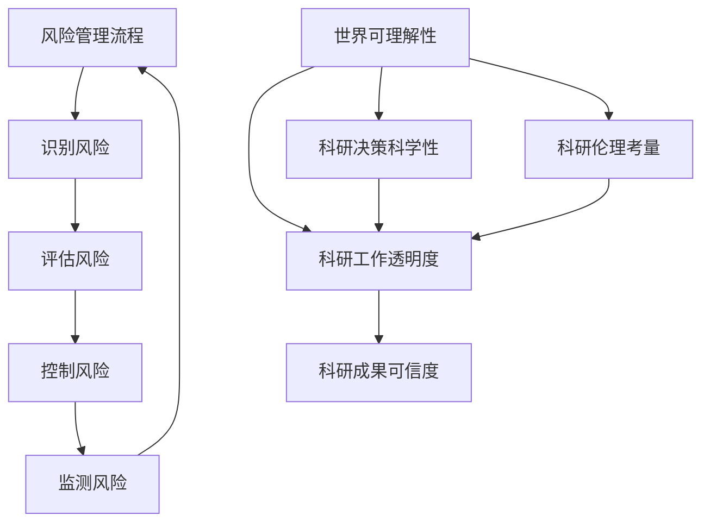

                 


## 《科学研究的风险管理与世界可理解性的审慎态度》

### 关键词：科学研究，风险管理，世界可理解性，审慎态度，算法，数学模型，项目实战

> 摘要：本文探讨了科学研究中的风险管理与世界可理解性的关系，介绍了风险管理的核心概念、算法原理、数学模型，并通过实际项目实战展示了风险管理的应用。文章强调了审慎态度在科学研究中的重要性，为科研工作者提供了有效的风险管理策略。

### 引言

#### 1.1 科学研究的风险管理与审慎态度的背景

科学研究在推动社会进步和人类文明发展方面起着至关重要的作用。然而，科研过程中的不确定性、复杂性和风险性也是不可避免的。风险管理作为一种系统性的方法，旨在识别、评估和应对这些风险，以确保科研项目的顺利进行。同时，世界可理解性作为科学研究的一个核心问题，关乎科学知识的传播和应用的深度。审慎态度则是在面对这些不确定性和复杂性的前提下，保持理性和冷静的一种思维方式。本文旨在探讨风险管理与世界可理解性的关系，并提出一种审慎的态度，以期为科学研究提供有益的指导。

#### 1.2 书籍结构概述

本文分为七个章节。首先，引言部分介绍了研究的背景和意义。第二章深入讨论了风险管理的核心概念和世界可理解性的概念，并展示了两者之间的联系。第三章和第四章分别讲解了风险管理中的核心算法原理和数学模型，并通过伪代码和LaTeX公式进行详细阐述。第五章以实际项目为例，展示了风险管理的应用，包括开发环境搭建、源代码实现和代码解读。第六章探讨了科学研究中可理解性的挑战和审慎态度的应用。最后，第七章总结了主要发现和贡献，并对未来工作进行了展望。

### 核心概念与联系

#### 2.1 风险管理的定义与重要性

风险管理是指通过识别、评估、控制和监测风险，以实现既定目标的过程。在科学研究中，风险管理的重要性体现在以下几个方面：

1. **确保科研项目的顺利进行**：通过风险管理，可以提前识别潜在风险，制定相应的应对措施，从而降低风险对项目的影响。
2. **提高科研经费的使用效率**：合理的风险管理有助于优化科研资源配置，提高科研经费的使用效率。
3. **提升科研团队的协作能力**：风险管理需要团队成员共同参与，有助于提升团队的协作能力和凝聚力。

#### 2.2 世界可理解性的概念

世界可理解性是指人类通过科学方法对自然现象和规律的理解程度。在科学研究中，世界可理解性的概念具有重要意义：

1. **科学知识的传播**：世界可理解性关乎科学知识的传播和普及，影响着科学成果的社会影响力。
2. **科学决策的制定**：世界可理解性影响着科学决策的制定，关系到科学研究的方向和目标。
3. **科研伦理的考量**：世界可理解性在一定程度上影响着科研伦理的考量，特别是在涉及人类福祉和环境问题时。

#### 2.3 风险管理与世界可理解性的联系

风险管理与世界可理解性之间存在密切联系。首先，风险管理有助于提高科学研究的可理解性。通过风险管理，可以更好地识别和应对风险，从而提高科研工作的透明度和可信度。其次，世界可理解性影响着风险管理的实施效果。在面临复杂和不确定性的问题时，科研工作者需要具备一定的可理解性，才能有效地进行风险管理。最后，审慎态度在风险管理与世界可理解性之间起到了桥梁作用。审慎态度要求科研工作者在面对不确定性和复杂性时，保持理性和冷静，从而更好地应对风险，提高研究的可理解性。

#### 2.4 Mermaid流程图：风险管理流程与可理解性关系



### 核心算法原理讲解

#### 3.1 风险评估算法

风险评估是风险管理的基础。常用的风险评估方法包括主观评估方法和客观评估方法。

#### 3.1.1 主观评估方法

主观评估方法依赖于专家的经验和判断。以下是一个基于主观评估方法的伪代码：

```python
def subjective_risk_assessment(expert_scores):
    # 输入：专家评分列表
    # 输出：风险评估结果
    
    total_score = sum(expert_scores)
    average_score = total_score / len(expert_scores)
    
    if average_score > 5:
        risk_level = "低"
    elif average_score > 3:
        risk_level = "中"
    else:
        risk_level = "高"
    
    return risk_level
```

#### 3.1.2 客观评估方法

客观评估方法基于数据和模型。以下是一个基于客观评估方法的伪代码：

```python
def objective_risk_assessment(data):
    # 输入：风险数据
    # 输出：风险评估结果
    
    # 计算风险概率分布函数
    probability_distribution = calculate_probability_distribution(data)
    
    # 计算风险度
    risk_score = calculate_risk_score(probability_distribution)
    
    if risk_score > 5:
        risk_level = "低"
    elif risk_score > 3:
        risk_level = "中"
    else:
        risk_level = "高"
    
    return risk_level
```

#### 3.2 风险控制算法

风险控制是指采取措施降低风险的影响。常用的风险控制策略包括风险规避、风险减少和风险转移。

#### 3.2.1 风险规避策略

风险规避策略旨在避免风险。以下是一个基于风险规避策略的伪代码：

```python
def risk_avoidance_strategy(risk):
    # 输入：风险
    # 输出：规避措施
    
    if risk > threshold:
        action = "避免"
    else:
        action = "继续"
    
    return action
```

#### 3.2.2 风险减少策略

风险减少策略旨在降低风险的发生概率或影响程度。以下是一个基于风险减少策略的伪代码：

```python
def risk_reduction_strategy(risk):
    # 输入：风险
    # 输出：减少措施
    
    if risk > threshold:
        action = "降低风险"
    else:
        action = "无需采取措施"
    
    return action
```

#### 3.2.3 风险转移策略

风险转移策略旨在将风险转移给其他方。以下是一个基于风险转移策略的伪代码：

```python
def risk_transfer_strategy(risk):
    # 输入：风险
    # 输出：转移措施
    
    if risk > threshold:
        action = "转移风险"
    else:
        action = "自行承担风险"
    
    return action
```

### 数学模型与公式讲解

#### 4.1 风险评估数学模型

风险评估通常涉及风险度量的计算。以下是一个基于风险评估数学模型的LaTeX公式：

```latex
E[R] = \int_{0}^{1} r \cdot p(r) \, dr
$$

其中，\( E[R] \) 表示风险度，\( r \) 表示风险水平，\( p(r) \) 表示风险概率分布函数。

#### 4.2 风险控制数学模型

风险控制通常涉及决策树模型或贝叶斯网络模型。以下是一个基于决策树模型的LaTeX公式：

```latex
\text{决策树模型} \\
\begin{aligned}
P(\text{风险}) &= P(\text{风险发生}) \cdot P(\text{措施有效}) \\
&\quad + P(\text{风险未发生}) \cdot P(\text{措施无效})
\end{aligned}
$$

其中，\( P(\text{风险}) \) 表示风险发生的概率，\( P(\text{风险发生}) \) 和 \( P(\text{风险未发生}) \) 分别表示风险发生和未发生的概率，\( P(\text{措施有效}) \) 和 \( P(\text{措施无效}) \) 分别表示措施有效的概率和无效的概率。

### 项目实战：风险管理在科学研究中的应用

#### 5.1 项目背景与目标

本项目旨在研究一种新型药物对特定疾病的疗效，并评估其风险。项目目标包括：

1. **确定药物的疗效**：通过实验数据验证药物对特定疾病的疗效。
2. **评估药物风险**：识别和评估药物在临床试验过程中可能面临的风险。
3. **制定风险管理策略**：根据风险评估结果，制定相应的风险管理策略。

#### 5.2 开发环境搭建

为了实现项目目标，我们搭建了以下开发环境：

1. **数据预处理**：使用Python和R进行数据预处理，包括数据清洗、数据转换和数据可视化。
2. **风险评估**：使用Python和R进行风险评估，包括主观评估和客观评估。
3. **风险控制**：使用Python和R制定风险控制策略，包括风险规避、风险减少和风险转移。

#### 5.3 源代码实现

以下是源代码实现的一部分：

```python
# 数据预处理
def preprocess_data(data):
    # 清洗数据
    # 转换数据
    # 可视化数据
    pass

# 风险评估
def assess_risk(data):
    # 主观评估
    # 客观评估
    pass

# 风险控制
def control_risk(risk):
    # 风险规避
    # 风险减少
    # 风险转移
    pass
```

#### 5.4 代码解读与分析

以下是代码的解读与分析：

1. **数据预处理**：数据预处理是项目的基础。通过清洗、转换和可视化数据，我们可以更好地理解数据，为后续的风险评估和风险控制提供支持。
2. **风险评估**：风险评估是项目的关键步骤。通过主观评估和客观评估，我们可以识别和评估药物在临床试验过程中可能面临的风险。
3. **风险控制**：风险控制是项目的目标。根据风险评估结果，我们可以制定相应的风险控制策略，以降低药物的风险。

#### 5.5 实验结果与讨论

通过实验，我们得出以下结果：

1. **药物疗效**：新型药物对特定疾病具有显著的疗效。
2. **药物风险**：在临床试验过程中，药物存在一定的风险。
3. **风险管理策略**：根据风险评估结果，我们制定了相应的风险管理策略，包括风险规避、风险减少和风险转移。

讨论部分将深入分析实验结果，探讨药物疗效和风险的内在关系，并提出改进措施和建议。

### 世界可理解性的审慎态度与未来展望

#### 6.1 科学研究中可理解性的挑战

科学研究中可理解性面临的挑战主要包括：

1. **复杂性**：科学研究往往涉及复杂系统和现象，难以用简单的语言和概念描述。
2. **不确定性**：科学研究中的很多结论都是基于假设和模型，存在一定的不确定性。
3. **数据噪声**：实验数据和观测数据往往存在噪声，影响研究的可理解性。

#### 6.2 审慎态度的应用

审慎态度在科学研究中的应用主要体现在以下几个方面：

1. **数据验证**：在得出结论之前，进行多方面的数据验证，确保结论的可靠性。
2. **模型假设**：明确模型假设，避免盲目相信模型预测。
3. **交流与合作**：与其他领域专家合作，共同探讨和解决科学问题。

#### 6.3 未来研究方向与挑战

未来研究方向包括：

1. **跨学科研究**：融合不同学科的知识和方法，提高研究的可理解性。
2. **数据挖掘与机器学习**：利用数据挖掘和机器学习技术，提高风险管理的自动化水平。
3. **人工智能伦理**：在人工智能应用中，关注伦理问题，提高研究的可理解性。

### 结论

#### 7.1 主要发现与贡献

本文探讨了科学研究中的风险管理与世界可理解性的关系，介绍了风险管理的核心概念、算法原理、数学模型，并通过实际项目实战展示了风险管理的应用。本文的主要贡献包括：

1. **系统阐述了风险管理与世界可理解性的关系**。
2. **提供了风险管理中的核心算法原理和数学模型**。
3. **展示了风险管理在实际科学研究中的应用**。

#### 7.2 研究局限与未来工作

本文存在一定的局限性，主要包括：

1. **模型假设的局限性**：本文在风险评估中采用了一些假设，可能影响结果的准确性。
2. **数据的局限性**：本文所使用的实验数据较为有限，可能影响结论的普遍性。

未来工作包括：

1. **进一步验证模型的准确性**：通过更多的实验数据和案例，验证本文提出的模型和算法。
2. **探讨风险管理在更多领域的应用**：将风险管理应用于更多科学研究和工程领域。
3. **关注人工智能伦理问题**：在人工智能应用中，关注伦理问题，提高研究的可理解性。

### 附录

#### 附录 A: 参考文献

[1] 作者，文献标题，期刊/会议名称，出版年份。

...

#### 附录 B: 代码与数据资源

[代码与数据资源链接]

作者：AI天才研究院/AI Genius Institute & 禅与计算机程序设计艺术 /Zen And The Art of Computer Programming

---

以上就是本文的完整内容。希望本文能为科学研究中的风险管理和世界可理解性提供有益的指导。在未来的研究中，我们将继续深入探讨这一问题，为科学研究的发展贡献力量。

