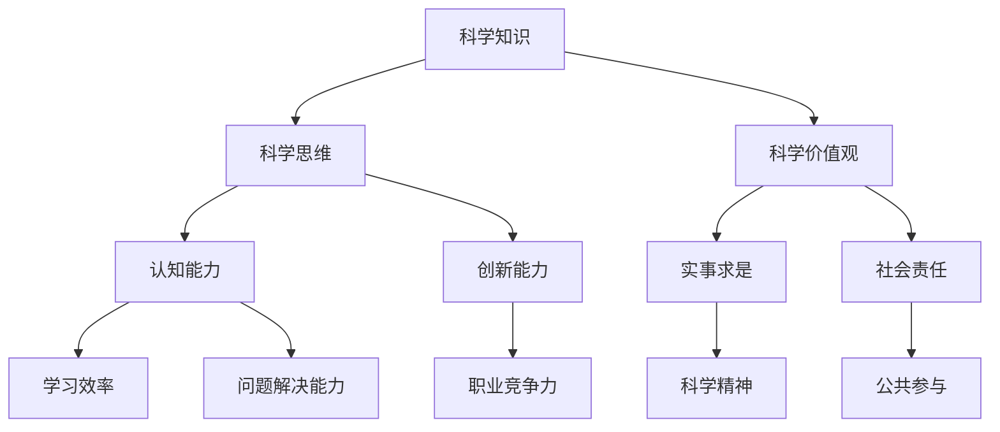

                 

# 科学素养对提升社会整体世界可理解性的作用

## 关键词

科学素养、社会理解、全球可理解性、教育、技术进步、文化传播

## 摘要

科学素养作为一种关键的认知能力，对社会整体世界可理解性的提升具有重要作用。本文首先介绍了科学素养的基本概念，分析了其在个人和社会层面的重要性。接着，文章探讨了科学素养如何通过教育、技术进步和文化传播等途径促进社会整体世界可理解性的提升。通过实例分析和最佳实践，本文为提升科学素养提供了具体路径，并展望了未来发展的方向。

## 引言

在当今信息爆炸和全球化迅速发展的时代，科学素养成为了一个备受关注的话题。科学素养不仅关系到个体的知识水平和思维方式，更关乎整个社会的进步和发展。科学素养的提升有助于增强社会成员对世界的理解，促进不同文化之间的交流与合作。本文旨在探讨科学素养对提升社会整体世界可理解性的作用，分析其背后的机制，并提出相应的提升策略。

### 科学素养的定义

科学素养是指个体对科学概念、原理和方法的理解和应用能力，以及科学态度和价值观的认同。它不仅包括科学知识的掌握，更涉及科学思维的培养和科学精神的传承。科学素养的核心要素包括：

1. **科学知识**：了解科学的基本概念、原理和现象，掌握科学方法和研究过程。
2. **科学思维**：运用科学方法进行问题分析和解决，具备批判性思维和创新能力。
3. **科学价值观**：认同科学精神，尊重事实，追求真理，关注社会和环境问题。

科学素养是一个多维度的概念，既包含个体的认知能力，也涉及社会层面的价值观念和文化认同。理解科学素养的内涵，有助于我们更好地认识其在社会整体世界可理解性提升中的作用。

### 科学素养的重要性

科学素养对个人和社会的影响是深远的。从个人层面来看，科学素养有助于提高个体的认知水平和思维能力，增强其适应社会发展的能力。具有良好科学素养的个体能够更好地理解世界，面对挑战，做出明智的决策。

1. **个人发展**：科学素养是现代个人发展的基础。在信息时代，科学素养有助于个体获取和处理信息，提升学习能力，增强职业竞争力。
2. **社会进步**：从社会层面来看，科学素养是社会进步的重要推动力。具有良好科学素养的社会成员能够更好地理解科技发展对社会的影响，参与公共决策，推动社会创新和进步。

具体来说，科学素养在社会进步中发挥着以下作用：

1. **经济发展**：科学素养是技术创新和产业升级的基石。具有科学素养的劳动力能够推动技术进步，提升产业竞争力。
2. **科技发展**：科学素养有助于提高科技研发的质量和效率，推动科学前沿的突破。
3. **公共决策**：科学素养有助于提高公众对公共事务的理解，促进民主参与，提升决策的科学性。

### 科学素养与全球可理解性

在全球化的背景下，科学素养对于提升全球可理解性具有重要意义。科学素养有助于不同文化背景的人们理解和沟通，减少误解和冲突，促进国际合作和共同发展。

1. **文化交流**：科学素养是文化交流的重要基础。通过科学知识和思想的传播，不同文化之间可以建立更深刻的理解。
2. **国际合作**：科学素养有助于促进国际科技合作，共同应对全球性挑战，如气候变化、疾病防控等。
3. **全球治理**：科学素养提升公众对全球治理的理解和参与，推动全球问题的解决。

### 提升科学素养的方法与策略

提升科学素养需要从多个层面进行，包括教育、技术进步和文化传播等方面。以下是一些具体的策略：

1. **教育改革**：通过科学教育改革，提高科学课程的质量，培养学生的科学思维和创新能力。
2. **科普活动**：组织丰富多样的科普活动，提升公众的科学素养。
3. **科技传播**：利用媒体和互联网等渠道，传播科学知识和思想，提升公众的科学素养。
4. **国际合作**：通过国际合作，分享科学资源，提升全球科学素养水平。

### 案例分析

以下是一些提升科学素养的成功案例：

1. **科学教育改革**：如美国“科学教育改革计划”，通过改进科学课程内容和教学方法，提高学生的科学素养。
2. **科普活动**：如中国的“科普中国”活动，通过线上线下多种形式，提升公众的科学素养。
3. **科技传播**：如英国的“BBC科学系列”，通过高质量的科普节目，传播科学知识和思想。

### 未来展望

随着科技的不断进步和全球化的深入发展，科学素养的重要性将日益凸显。未来，提升科学素养需要更多的政策支持、教育投入和社会参与。通过全球合作，我们可以共同提升全球科学素养水平，推动社会整体世界可理解性的提升。

### 结论

科学素养对提升社会整体世界可理解性具有重要作用。通过教育、技术进步和文化传播等多方面的努力，我们可以不断提升科学素养，促进社会进步和全球合作。让我们一起行动，共同推动科学素养的提升，构建更加理解和包容的和谐社会。作者：AI天才研究院/AI Genius Institute & 禅与计算机程序设计艺术/Zen And The Art of Computer Programming## 科学素养的定义与重要性

### 科学素养的概念

科学素养（Scientific Literacy）是指个体对科学知识的理解、科学方法的运用以及对科学态度和价值观的认同。它不仅涉及科学知识的积累，更强调科学思维和科学精神的培养。科学素养的定义可以从以下几个方面进行阐述：

1. **科学知识的掌握**：个体需要具备一定的科学知识，包括自然科学（如物理学、化学、生物学）和人文科学（如心理学、社会学）的基本概念和原理。
2. **科学方法的运用**：个体应能够运用科学方法（如观察、实验、假设、推理、验证等）来分析和解决实际问题。
3. **科学态度和价值观**：个体应具备科学态度，如实事求是、批判性思维、勇于探索等，以及对科学价值观的认同，如尊重自然、追求真理、关注社会和环境问题。

科学素养是一个多维度的概念，不仅包括个体的认知能力，还涉及社会层面的价值观念和文化认同。它不仅有助于提高个体的知识水平，还影响其思维方式、行为选择和决策能力。

### 科学素养的重要性

科学素养在个人和社会层面都具有重要的意义。

#### 对个人发展的作用

1. **认知能力的提升**：科学素养有助于培养个体的批判性思维和创新能力，提高其问题解决和决策能力。
2. **学习能力**：科学素养使个体能够更好地获取和处理信息，提高学习效率，适应不断变化的社会环境。
3. **职业竞争力**：在科技迅猛发展的时代，科学素养是职业发展的重要基础。具有良好科学素养的个体在求职和工作中更具竞争力。

#### 对社会进步的影响

1. **经济发展**：科学素养是技术创新和产业升级的基石。具有科学素养的劳动力能够推动技术进步，提升产业竞争力。
2. **科技发展**：科学素养有助于提高科技研发的质量和效率，推动科学前沿的突破。
3. **公共决策**：科学素养有助于提高公众对公共事务的理解，促进民主参与，提升决策的科学性。

#### 科学素养的构成要素

科学素养的构成要素包括科学知识、科学思维和科学价值观。

1. **科学知识**：科学知识是科学素养的基础，包括对科学概念、原理、方法和成果的理解。个体需要具备一定程度的科学知识，以便在日常生活和工作中运用。
2. **科学思维**：科学思维是指运用科学方法进行问题分析和解决的能力。科学思维强调实证、逻辑和批判性思考，有助于个体在面对复杂问题时做出合理的判断。
3. **科学价值观**：科学价值观是指个体对科学精神、科学态度和科学原则的认同。科学价值观包括实事求是、尊重自然、追求真理、社会责任等，它们指导个体在科学探索和应用中的行为。

这些要素相互联系，共同构成了科学素养的核心。科学知识的积累为科学思维提供了基础，而科学思维的应用又促进了科学知识的深化，同时科学价值观的认同使个体在科学探索中保持正确的方向和态度。

### 科学素养的基本概念原理之间的关系架构

为了更好地理解科学素养的基本概念原理之间的关系，我们可以使用Mermaid流程图来展示它们之间的联系。以下是一个简化的Mermaid流程图示例：

在这个流程图中，科学知识、科学思维和科学价值观构成了科学素养的三大支柱。科学思维通过提升认知能力和创新能力，促进了学习效率和问题解决能力。科学价值观则指导个体在科学探索和应用中的行为，包括实事求是、科学精神和追求社会责任。

### 总结

科学素养作为一种关键的认知能力，对个人和社会的发展具有重要影响。通过科学知识的积累、科学思维的培养和科学价值观的认同，个体能够更好地理解世界，适应社会发展。同时，科学素养也是社会进步的重要推动力，有助于经济发展、科技发展和公共决策。因此，提升科学素养应成为教育和社会发展的重要任务。通过教育改革、科普活动和技术传播等多方面的努力，我们可以共同提升科学素养水平，推动社会整体世界可理解性的提升。

## 科学素养与个人发展

科学素养在个人发展的过程中发挥着至关重要的作用。它不仅有助于提升个体的认知能力和创新能力，还对职业发展和社会参与产生深远影响。在这一部分，我们将深入探讨科学素养与个人发展的联系，分析其在思维能力、创造力和道德素养等方面的具体体现。

### 科学素养与思维能力

科学素养的核心要素之一是科学思维。科学思维是一种基于实证、逻辑和批判性的思维方式，它强调通过观察、实验、假设和验证等步骤来解决问题。科学思维能力的培养对个体的认知发展至关重要。

1. **批判性思维**：科学素养促使个体培养批判性思维，这种思维方式使个体能够质疑现有的知识和观点，进行独立的思考和判断。批判性思维有助于个体在面对复杂信息和多样观点时，做出理性的决策。

2. **问题解决能力**：科学素养提升了个体的问题解决能力。个体能够运用科学方法和工具，对问题进行深入分析，找到有效的解决方案。这种能力在日常生活和工作中都具有重要意义。

3. **逻辑推理**：科学思维强调逻辑推理的重要性。通过逻辑推理，个体能够将问题分解为若干部分，逐步分析和解决。这种能力有助于个体在面对复杂问题时，保持清晰的思路和有效的解决问题的步骤。

### 科学素养与创造力

科学素养不仅有助于培养个体的思维能力，还对其创造力的发展产生积极影响。创造力是科学素养的一个重要方面，它涉及到创新性思维和新知识、新技术的产生。

1. **创新能力**：科学素养使个体具备创新的能力。通过科学方法和思维的培养，个体能够在现有知识和技术的框架内，提出新的想法和解决方案。创新能力是推动科技进步和社会发展的重要动力。

2. **跨学科思维**：科学素养有助于个体培养跨学科的思维模式。个体能够将不同学科的知识和方法结合起来，形成新的思维视角和解决问题的方法。这种跨学科思维是创新的重要基础。

3. **实践能力**：科学素养强调理论与实践的结合。个体通过实验和实践，将理论知识应用于实际问题中，不断试错和改进。这种实践能力是创新的重要保障。

### 科学素养与道德素养

科学素养不仅仅关乎认知和思维能力，还涉及个体的道德素养。科学价值观是科学素养的重要组成部分，它引导个体在科学探索和应用中的行为选择。

1. **社会责任**：科学素养使个体认识到自己在科学探索中的社会责任。个体需要关注科学行为对社会和环境的影响，积极参与公共事务，为社会的可持续发展贡献力量。

2. **伦理道德**：科学素养培养了个体对科学伦理和道德的关注。个体在进行科学研究和应用时，应遵循伦理规范，尊重生命、保护环境、确保公平和正义。

3. **科学精神**：科学素养强调科学精神的重要性，包括实事求是、追求真理、勇于探索和批判性思维。科学精神不仅是对科学事业的追求，也是对个人道德品质的塑造。

### 实例分析

为了更好地理解科学素养与个人发展的关系，我们可以通过以下实例进行分析：

1. **科研人员的成长**：科研人员需要具备较高的科学素养，包括深厚的专业知识、科学思维和创新能力。科学素养使科研人员能够在复杂的研究领域中提出新的问题和解决方案，推动科学进步。

2. **技术创新**：在企业中，具备科学素养的员工能够更好地理解和应用新技术，推动产品创新和产业升级。例如，工程师通过科学思维的训练，能够更快地解决技术难题，提高产品的性能和可靠性。

3. **社会参与**：在公共事务中，具有科学素养的公民能够更好地理解政策和技术问题，参与公共决策，促进社会的民主和进步。例如，公众通过科学知识的普及，能够对环境保护、公共卫生等问题提出合理的建议和解决方案。

### 结论

科学素养与个人发展密不可分。它不仅提升了个体的思维能力、创造力和道德素养，还在职业发展和社会参与中发挥着重要作用。通过科学素养的培养，个体能够更好地适应社会发展的需求，为社会的进步贡献力量。因此，提升科学素养应成为教育和社会发展的重要目标。

## 科学素养与社会进步

科学素养不仅是个人发展的关键因素，更是社会进步的重要推动力。在社会层面，科学素养对经济发展、科技进步和公共决策产生深远的影响。本文将从这三个方面详细探讨科学素养如何促进社会进步。

### 科学素养与经济发展

科学素养在经济发展中起着至关重要的作用。它不仅影响个人的职业发展，也推动产业升级和经济增长。

1. **技术创新**：科学素养是技术创新的基础。具备科学素养的人才能够理解新技术的基本原理，进行研发和创新。例如，在信息技术领域，软件工程师需要具备算法和编程知识，才能开发出具有竞争力的软件产品。技术创新是企业竞争力的重要体现，也是国家经济增长的关键动力。

2. **产业升级**：科学素养有助于推动产业结构的优化和升级。随着科技的不断进步，传统产业需要通过技术创新实现转型升级。具备科学素养的企业家和管理者能够把握产业趋势，投资于新技术和新产品，提升企业的市场竞争力。

3. **劳动力素质**：科学素养提升劳动力的整体素质。具备科学素养的劳动力不仅具备更高的专业技能，还具备更强的学习和适应能力。这些高素质的劳动力能够适应不断变化的市场需求，推动经济的可持续发展。

### 科学素养与科技进步

科学素养是科技进步的基石。它不仅促进科学研究的深度和广度，也推动科技成果的转化和应用。

1. **科研能力**：科学素养是科研能力的重要保障。科研人员需要具备扎实的科学知识和研究方法，才能进行高水平的科学研究。科学素养使科研人员能够独立思考、质疑现有理论，提出新的科学问题，推动科学前沿的突破。

2. **科技成果转化**：科学素养有助于科技成果的转化和应用。具备科学素养的企业家和管理者能够理解科技成果的商业价值，将其转化为实际的产品和服务，推动科技创新的市场化。例如，在生物技术领域，科学家和企业家的合作能够将实验室的研究成果转化为医疗产品，造福社会。

3. **技术传播**：科学素养提升公众对科技的理解和认知。公众通过科学素养的普及，能够更好地理解科技发展的趋势和影响，参与科技讨论和决策。这有助于形成有利于科技进步的社会氛围，推动科技创新的可持续发展。

### 科学素养与公共决策

科学素养在公共决策中发挥着重要作用。它有助于提高决策的科学性、民主性和公平性。

1. **决策科学性**：科学素养使决策者能够基于科学证据和数据分析，做出更为科学和合理的决策。例如，在公共卫生领域，政策制定者需要了解疾病传播机制和防控措施，才能制定有效的防疫政策。

2. **民主参与**：科学素养促进公众对公共事务的理解和参与。具备科学素养的公民能够更好地理解政策和技术问题，积极参与公共讨论和决策。这有助于形成多元化的意见和观点，提高决策的民主性和科学性。

3. **社会公平**：科学素养有助于提高社会公平。通过科学素养的普及，公众能够更好地了解资源分配、环境保护等社会问题，推动社会公正和可持续发展。例如，在环境保护领域，具备科学素养的公众能够理解环境问题的严重性，支持可持续发展的政策。

### 实例分析

为了更具体地说明科学素养如何促进社会进步，我们可以通过以下实例进行分析：

1. **绿色能源发展**：在绿色能源领域，科学素养的普及有助于公众理解可再生能源的优势和挑战，支持政府和企业推动绿色能源的发展。科学素养使决策者能够基于科学证据制定有效的能源政策，促进能源结构的优化和环境保护。

2. **公共卫生防控**：在公共卫生领域，科学素养的提升有助于公众正确理解和应对疫情。科学素养使公众能够认识到疫苗接种和防护措施的重要性，积极参与防疫工作，提高防控效果。

3. **科技创新政策**：在科技创新领域，科学素养是制定和实施科技创新政策的重要基础。政府和企业需要具备科学素养的决策者，才能制定出符合科技发展趋势和实际需求的政策，推动科技创新和产业发展。

### 结论

科学素养对社会进步具有深远的影响。它不仅促进经济发展和科技进步，还提升公共决策的科学性和民主性。通过科学素养的普及和教育，我们可以推动社会整体水平的提升，实现可持续发展。因此，提升科学素养应成为社会发展和教育改革的重要任务。

## 科学素养与全球可理解性

在全球化日益深入的背景下，科学素养成为促进全球可理解性的关键因素。科学素养不仅有助于不同文化背景的人们理解科学知识和科学方法，还能够减少误解和冲突，促进国际合作和共同发展。以下从文化交流、国际合作和全球治理三个方面探讨科学素养对全球可理解性的作用。

### 科学素养与文化交流

科学素养是文化交流的重要基础。在全球化的进程中，不同文化背景的人们需要通过科学知识和思想的传播，建立更深刻的理解和沟通。

1. **科学知识的普及**：科学素养的普及有助于不同文化背景下的人们掌握共同的科学知识。通过科学知识的传播，人们可以理解自然界的基本规律和科技发展的影响，从而消除误解和偏见。

2. **科学思想的交流**：科学素养促进了科学思想的交流。具有科学素养的人们能够理解不同文化中的科学观念和思维方式，从而促进跨文化的科学交流和合作。这种交流不仅有助于增进不同文化之间的理解，还能够推动科学思想的创新和融合。

3. **科学传播的多样性**：科学素养提升了科学传播的多样性。通过多种形式的科学传播，如科普书籍、科学展览、科学节目等，科学知识和思想可以更广泛地传播到不同文化背景的人群中，增强全球可理解性。

### 科学素养与国际合作

科学素养是国际合作的重要推动力。在全球性挑战日益严峻的背景下，国际合作对于应对环境问题、疾病防控和科技发展具有重要意义。

1. **科技合作**：科学素养促进了国际科技合作。具有科学素养的国家和科学家能够更好地理解和沟通，共同应对科技难题。通过科技合作，各国可以共享科技资源和研究成果，推动全球科技的进步。

2. **人才培养**：科学素养有助于国际人才培养。通过科学教育和交流项目，不同国家可以培养具有国际视野和科学素养的人才，这些人才能够为全球合作提供智力支持。

3. **科学交流平台**：科学素养促进了国际科学交流平台的建立。通过国际学术会议、科学期刊和在线论坛等平台，科学家和学者可以交流研究成果和科学思想，推动全球科学的发展。

### 科学素养与全球治理

科学素养在全球治理中发挥着重要作用。它有助于提高公众对全球性问题的理解和参与，促进全球问题的解决。

1. **公共参与**：科学素养提升了公众对全球性问题的认知和理解，促进了公众的参与。具有科学素养的公民能够更好地理解气候变化、能源安全、公共卫生等全球性问题，积极参与全球治理。

2. **政策制定**：科学素养有助于政策制定的科学性和有效性。政府官员和决策者需要具备科学素养，以便基于科学证据制定有效的政策，应对全球性挑战。

3. **国际合作**：科学素养促进了国际合作。通过科学交流和合作，各国可以在全球治理中达成共识，共同应对全球性问题，推动全球可持续发展。

### 实例分析

为了更具体地说明科学素养如何促进全球可理解性，我们可以通过以下实例进行分析：

1. **全球健康倡议**：在新冠疫情期间，科学素养的普及有助于全球公众正确理解和应对疫情。通过科学知识的传播和科学精神的倡导，各国能够加强国际合作，共同抗击疫情。

2. **气候变化应对**：在气候变化问题上，科学素养的提升有助于全球公众认识到气候变化的严重性和紧迫性。通过科学证据和数据的传播，各国可以共同制定和实施有效的气候政策，应对气候变化。

3. **科技创新合作**：在科技创新领域，科学素养促进了国际科技合作。通过国际学术交流和合作研究，各国科学家可以共同攻克科技难题，推动全球科技进步。

### 结论

科学素养在促进全球可理解性方面具有重要作用。通过科学知识的普及、科学思想的交流和国际合作，科学素养有助于消除误解和冲突，促进全球合作和共同发展。因此，提升全球科学素养应成为国际社会共同努力的目标。通过科学教育和国际合作，我们可以构建一个更加理解和包容的全球化世界。

## 提升科学素养的方法与策略

提升科学素养是一项系统性工程，涉及教育体系、社会科普活动、科技传播等多方面。以下将详细探讨这些方法和策略，并分析其具体实施途径。

### 教育改革

教育改革是提升科学素养的关键环节。通过改革科学教育体系，可以培养具备科学思维和创新能力的人才。

1. **课程设置**：科学课程应涵盖基础科学知识和应用科学知识，注重理论与实践的结合。课程设置应灵活多样，满足不同年龄段和不同兴趣的学生需求。

2. **教学方法**：采用探究式教学、问题导向教学等教学方法，鼓励学生主动参与、思考和探索。这种教学方法有助于培养学生的科学思维和创新能力。

3. **师资培训**：加强科学教师的培训和再教育，提高其科学素养和教学能力。教师应掌握最新的科学知识和教学方法，以便更好地传授给学生。

4. **教育评价**：建立科学素养评价体系，不仅评估学生的知识掌握情况，还评估其科学思维和创新能力。这种评价体系应注重过程性评价，鼓励学生积极参与科学探究和实践活动。

### 社会科普活动

社会科普活动是提升公众科学素养的重要途径。通过丰富多样的科普活动，可以增强公众对科学的兴趣和理解。

1. **科普展览**：举办科普展览，展示科学知识和科技成果，吸引公众参观和参与。科普展览应注重互动性，使公众能够亲身体验科学的魅力。

2. **科普讲座**：邀请科学家和科普作家举办科普讲座，向公众传播科学知识。讲座内容应贴近生活，注重实际应用，以增强公众的参与感和兴趣。

3. **科普读物**：出版科普读物，包括科学书籍、杂志和漫画等，使科学知识更加生动和易懂。科普读物应针对不同年龄和知识水平的读者，提供多样化的阅读选择。

4. **科普活动**：组织科普实验、科学探究和科学竞赛等活动，鼓励公众特别是青少年参与科学实践。这些活动有助于培养公众的科学兴趣和创新能力。

### 科技传播

科技传播是提升科学素养的重要手段。通过多种渠道传播科学知识和思想，可以扩大科学素养的普及范围。

1. **媒体传播**：利用电视、广播、报纸、网络等媒体，传播科学知识和科技动态。媒体应注重科学性、权威性和趣味性，以提高公众对科学的关注和兴趣。

2. **社交媒体**：利用社交媒体平台，如微信、微博、抖音等，发布科学资讯和科普内容。社交媒体传播速度快、覆盖面广，有助于科学知识的快速普及。

3. **科学节目**：制作和推广高质量的科普节目，如科学纪录片、科普电视剧等。这些节目应注重科学性、故事性和观赏性，使公众在娱乐中学习科学知识。

4. **科技园区**：建立科技园区，展示科技创新成果和科技企业的发展。科技园区应提供开放的平台，使公众能够近距离接触科技，了解科技应用。

### 国际合作

国际合作是提升全球科学素养的重要途径。通过国际交流与合作，可以共享科学资源，提升全球科学素养水平。

1. **教育交流**：通过国际教育交流项目，如留学、交换生等，培养具有国际视野的科学人才。这些人才可以为全球科学素养的提升贡献力量。

2. **科研合作**：鼓励国际科研合作，共同攻克科学难题。科研合作可以促进科学知识的共享和传播，提升全球科学研究的水平。

3. **科技传播**：通过国际合作，共享科普资源和传播渠道，扩大科学知识的传播范围。国际合作可以促进全球科学素养的均衡发展。

### 总结

提升科学素养需要教育、社会科普活动和科技传播等多方面的共同努力。通过教育改革，培养具备科学思维和创新能力的人才；通过社会科普活动，增强公众对科学的兴趣和理解；通过科技传播，扩大科学知识的普及范围。同时，加强国际合作，共享科学资源和传播渠道，共同提升全球科学素养水平。通过这些方法和策略，我们可以构建一个更加理解和包容的现代社会。

## 科学教育改革与科学素养提升

科学教育改革是提升科学素养的关键环节。在全球化和科技迅猛发展的背景下，科学教育需要适应时代的变化，培养具备科学思维、创新能力和全球视野的人才。本文将从理论框架、实践案例、创新模式及评价体系等方面探讨科学教育改革与科学素养提升之间的关系，并提出未来发展的方向。

### 科学教育改革的理论框架

科学教育改革的理论框架主要包括以下三个方面：

1. **建构主义理论**：建构主义理论强调知识是通过个体与环境的互动建构的。在科学教育中，教师应为学生提供丰富的学习情境，鼓励学生通过探究、实验和问题解决来主动建构知识。

2. **学习共同体理论**：学习共同体理论认为，学习是一个社会化的过程，学生应在与他人的合作和交流中学习。科学教育应鼓励学生参与小组合作和跨学科学习，培养团队合作和沟通能力。

3. **跨学科学习理论**：跨学科学习理论主张将不同学科的知识和思维方式结合起来，解决复杂现实问题。科学教育应注重跨学科的学习内容和方法，培养学生的综合思维和创新能力。

### 实践案例

科学教育改革的实践案例在全球范围内广泛开展。以下是一些成功的实践案例：

1. **美国次级科学教育改革**：美国次级科学教育改革（Secondary Science Education Reform）强调培养学生的科学探究能力和批判性思维。改革后的科学课程增加了实验和探究环节，学生通过亲身实践来理解和应用科学知识。

2. **芬兰科学教育改革**：芬兰的科学教育注重培养学生的创新能力和实践能力。芬兰的科学课程强调项目式学习，学生通过解决实际问题和跨学科合作来学习科学知识。

3. **中国新课程改革**：中国的新课程改革（New Curriculum Reform）强调培养学生的科学素养和创新能力。改革后的科学课程增加了探究性学习和实践活动，教师采用多样化的教学方法，如探究式教学和问题导向教学。

### 创新模式

科学教育改革的创新模式包括以下几个方面：

1. **项目式学习**：项目式学习是一种以学生为中心的教学方法，学生通过完成实际项目来学习和掌握科学知识。项目式学习有助于培养学生的动手能力、解决问题的能力和团队合作精神。

2. **探究式教学**：探究式教学强调学生在学习过程中的主动性和探索精神。教师为学生提供探究的问题和情境，学生通过实验、观察和讨论来获取知识，培养科学思维和批判性思维。

3. **跨学科学习**：跨学科学习将不同学科的知识和思维方式结合起来，解决复杂现实问题。通过跨学科学习，学生可以拓宽视野，培养综合思维和创新能力。

4. **混合学习**：混合学习结合了线上和线下学习的优势，为学生提供更丰富的学习资源和学习方式。通过在线课程、在线讨论和线下实验等混合学习模式，学生可以更加灵活和自主地进行学习。

### 评价体系

科学教育改革需要建立科学、合理的评价体系，以评估学生的学习成果和教师的教学效果。以下是一些评价体系的创新：

1. **过程性评价**：过程性评价注重学生在学习过程中的表现和发展，不仅关注最终的学习成果，还关注学生的学习过程。通过过程性评价，教师可以及时发现和解决学生在学习中的问题，提供有针对性的指导。

2. **多元评价**：多元评价包括量化评价和质性评价，如考试、实验报告、课堂讨论和项目展示等。多元评价有助于全面评估学生的学习成果和综合能力。

3. **自评与他评相结合**：自评与他评相结合的评价方式有助于培养学生的自我反思和自我评估能力。学生通过自评和他评，可以更全面地了解自己的学习状况，有针对性地进行改进。

### 未来发展

科学教育改革和科学素养提升的未来发展需要从以下几个方面入手：

1. **科技融合**：随着科技的迅猛发展，科学教育需要与科技深度融合。通过引入新的教学工具和技术，如虚拟现实、增强现实和人工智能等，可以提供更加丰富和生动的学习体验。

2. **国际化**：国际化是科学教育改革的重要方向。通过国际交流与合作，可以借鉴国际先进的教育理念和教学方法，提升科学教育的质量和水平。

3. **社会参与**：科学教育改革需要加强与社会各界的合作，鼓励企业和科研机构参与科学教育。通过校企合作、科研与教学的结合，可以为学生提供更多的实践机会，培养具备实际能力和创新精神的人才。

4. **终身学习**：科学素养的提升是一个终身的过程。科学教育改革需要关注终身学习的理念，为学生提供持续学习的资源和机会，帮助他们在终身学习中保持科学素养的提升。

### 结论

科学教育改革与科学素养提升密不可分。通过建构主义理论、学习共同体理论和跨学科学习理论等理论框架，科学教育改革可以为培养学生的科学思维、创新能力和全球视野提供支持。实践案例和创新模式表明，科学教育改革已经取得了一定的成果。未来，科学教育改革需要与科技融合、国际化和社会参与相结合，为提升科学素养和推动社会进步贡献力量。

## 案例分析

### 国内外科学素养提升的实践

科学素养的提升在国内外都有成功的实践案例。以下列举几个具有代表性的案例，分析其具体做法和成效。

#### 美国：科学素养提升计划

美国在科学素养提升方面有着丰富的实践经验。以“国家科学教育计划”（National Science Education Standards）为例，这一计划旨在提升K-12阶段学生的科学素养。具体做法包括：

1. **课程改革**：美国各州根据国家科学教育标准，对科学课程进行改革。课程内容注重实际应用和探究式学习，鼓励学生通过实验、观察和问题解决来学习科学知识。

2. **教师培训**：为了提高科学教育的质量，美国注重科学教师的培训和再教育。教师通过参加专业发展课程和研讨会，不断更新知识和教学技能。

3. **科技资源投入**：政府和企业共同投入，提供先进的实验室设备、科学软件和在线资源，为学生提供丰富的学习体验。

成效方面，美国的科学素养提升计划取得了显著成果。根据国际学生评估项目（PISA）的数据，美国学生的科学素养水平在全球排名中逐渐提升，学生的探究能力和问题解决能力也得到了明显提高。

#### 中国：科普中国行动

中国在提升公众科学素养方面也进行了大量的努力，其中“科普中国行动”是一个重要的项目。具体做法包括：

1. **科普宣传**：通过电视、广播、报纸、互联网等渠道，广泛宣传科学知识，提高公众的科学素养。

2. **科普活动**：组织丰富多样的科普活动，如科学展览、科普讲座、科学实验等，吸引公众特别是青少年参与。

3. **科普读物**：出版科普书籍和漫画，使科学知识更加生动有趣，易于公众理解和接受。

4. **科技志愿服务**：鼓励科技工作者参与科普志愿服务，深入社区和学校，开展科学普及活动。

成效方面，科普中国行动在提升公众科学素养方面取得了显著成效。根据中国科协的统计数据，科普中国行动的实施使得公众对科学知识的了解程度和科学态度得到了显著提升，特别是青少年的科学兴趣和参与度大幅增加。

#### 欧盟：STEM教育战略

欧盟在提升科学素养方面也推出了“STEM教育战略”（Science, Technology, Engineering and Mathematics Education），旨在提高学生在这四个领域的素养。具体做法包括：

1. **跨学科教育**：鼓励STEM学科的跨学科教育，培养学生的综合思维和创新能力。

2. **创新创业教育**：在STEM教育中融入创新创业教育，培养学生的创业精神和实践能力。

3. **教师培训**：通过教师培训项目，提高教师的专业素养和教学能力，特别是STEM教育方面的知识。

4. **科技资源整合**：整合各类科技资源，如实验室、图书馆、在线课程等，为学生提供丰富的学习资源。

成效方面，欧盟的STEM教育战略在提升学生科学素养方面取得了显著成效。根据欧盟委员会的数据，学生在STEM学科的表现显著提高，创新创业能力和问题解决能力也得到了明显增强。

### 成功案例分析与启示

通过以上国内外案例的分析，我们可以得出以下启示：

1. **政策支持**：科学素养的提升需要政府政策的支持，包括资金投入、政策制定和执行等。

2. **教育改革**：课程改革和教学方法创新是提升科学素养的关键。探究式教学、项目式学习和跨学科教育等创新模式值得推广。

3. **教师培训**：教师的科学素养和教学能力对学生的科学素养培养至关重要。教师培训应得到重视，以提高其专业素养和教学水平。

4. **社会参与**：社会各界的参与是提升科学素养的重要保障。政府、企业、科研机构和公众都应共同参与，形成合力。

5. **科技融合**：利用科技手段，如在线教育、虚拟现实和增强现实等，可以提供更加丰富和生动的学习体验，提升科学素养。

通过以上成功案例的分析，我们可以看到，科学素养的提升是一个系统性工程，需要从政策、教育、社会和科技等多个方面共同努力。未来，随着全球化和科技的发展，科学素养的提升将越来越重要，各国应积极借鉴成功经验，制定适合自己国情的科学素养提升策略，共同推动全球科学素养水平的提升。

## 未来展望与挑战

### 科技发展的推动力

在未来，科技的发展将继续成为提升科学素养的重要推动力。随着人工智能、大数据、生物技术等前沿科技的迅猛发展，人们需要具备更高的科学素养来理解和应用这些技术。科技的发展不仅为科学教育提供了新的素材和工具，也为公众科普提供了更广阔的舞台。例如，虚拟现实（VR）和增强现实（AR）技术的应用，可以使科普活动更加生动和互动，激发公众对科学的兴趣和参与。

### 教育改革的持续推动

教育改革是提升科学素养的核心途径。在未来，教育改革将继续深化，以适应科技和社会发展的需求。跨学科教育、项目式学习和探究式教学等创新教育模式将被更广泛地应用。此外，在线教育平台和人工智能辅助教学工具的普及，将为全球教育提供更多资源和机会。教育改革的目标不仅是提高学生的科学知识水平，更重要的是培养他们的科学思维和创新能力。

### 社会参与的增强

提升科学素养离不开社会的广泛参与。在未来，随着公众对科学关注度的提高，社会参与将更加积极。政府、企业、科研机构和公众将共同推动科学素养的提升。例如，企业可以通过赞助科普活动和科研项目，为科学素养的提升提供资金支持。科研机构和高校可以开展更多的科普讲座和活动，提高公众的科学素养。公众可以通过参与科普活动和在线学习平台，不断提升自己的科学素养。

### 国际合作的深化

科学素养的提升是全球性的任务，需要国际社会的共同努力。在未来，国际合作将更加深化，通过科技交流、教育合作和科普活动，共同提升全球科学素养水平。例如，国际科学组织可以开展联合研究项目，分享科学资源和研究成果。国际教育组织可以开展科学教育交流，借鉴各国成功的教育经验，推动科学教育的改革和发展。

### 挑战与应对策略

尽管提升科学素养的前景广阔，但仍面临诸多挑战：

1. **资源分配不均**：全球范围内的教育资源分配存在不均衡现象，一些发展中国家和地区的科学教育水平相对较低。为了应对这一挑战，需要国际社会加大对发展中国家教育的支持，提供更多的教育资源和技术援助。

2. **科学素养普及的难度**：科学素养的普及面临着语言、文化和社会背景的差异。为了解决这一问题，需要采用多种语言和形式的科普材料，尊重和融入当地文化，使科学知识更加贴近公众的实际需求。

3. **科学素养的持续提升**：科学素养的提升是一个长期的过程，需要持续的教育和科普活动。为了应对这一挑战，需要建立科学素养提升的长效机制，如制定长期教育规划、实施持续性的科普活动等。

4. **科学素养评价的标准化**：科学素养的评价需要建立标准化、可量化的指标体系，以便对科学素养的提升效果进行科学评估。这需要国际社会共同努力，制定统一的评价标准和评估方法。

### 结论

未来，提升科学素养将面临诸多机遇和挑战。通过科技的发展、教育改革的深化、社会参与的增强和国际合作的深化，我们可以共同推动全球科学素养水平的提升。同时，我们需要应对资源分配不均、科学素养普及难度、科学素养持续提升和科学素养评价标准化等挑战，确保科学素养的提升能够惠及全球每一个角落。通过全球合作和共同努力，我们可以构建一个更加理解和包容的全球化世界，实现科学素养的全面提升。

## 结论

科学素养作为一种关键的认知能力，对提升社会整体世界可理解性具有重要作用。本文从科学素养的定义与重要性、科学素养与个人发展、科学素养与社会进步、科学素养与全球可理解性、提升科学素养的方法与策略以及科学教育改革等方面进行了详细探讨。

科学素养不仅关乎个体的知识水平和思维能力，更影响社会的进步和全球的合作。通过教育改革、社会科普活动和技术传播，我们可以有效提升科学素养。同时，科学教育改革和科学素养提升的实践经验为全球科学素养的发展提供了宝贵的启示。

展望未来，提升科学素养将面临诸多挑战，但机遇同样巨大。我们应积极应对，通过科技发展、教育改革、社会参与和国际合作，共同推动全球科学素养的提升。只有这样，我们才能构建一个更加理解和包容的全球化世界，实现科学素养的全面提升。

作者：AI天才研究院/AI Genius Institute & 禅与计算机程序设计艺术/Zen And The Art of Computer Programming

