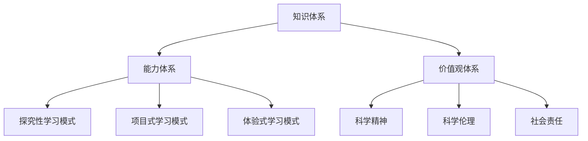

                 

### 引言

#### 书籍背景

《科学素养教育的创新方法：培养下一代的世界理解能力》这本书旨在探讨如何通过创新的教育方法提升学生的科学素养，从而培养他们理解和批判性地思考世界的技能。在当今信息爆炸的时代，科学知识更新速度迅猛，传统的教育模式难以适应这一变化。因此，寻找新的教育方法和路径变得尤为重要。

科学素养不仅仅是指学生掌握科学知识，更重要的是培养他们的科学思维能力和批判性思维。这种能力不仅有助于学生更好地理解和应用科学知识，而且有助于他们形成全面的、深刻的、独立的思考方式，从而在面对复杂的社会问题时能够提出有价值的见解。

#### 科学素养教育的紧迫性

随着科技的快速发展，科学素养已经成为现代社会公民的基本素质之一。然而，当前的学校教育体系中，科学素养教育仍然存在诸多问题。例如，课程内容过于理论化，缺乏实际操作和实践；教学方法单一，难以激发学生的学习兴趣；评估方式也侧重于记忆和背诵，忽略了学生的实际应用能力和创新思维。

科学素养教育的紧迫性体现在以下几个方面：

1. **适应未来社会需求**：现代社会对科技人才的需求不断增加，具备科学素养的公民能够更好地适应这种变化，为社会的发展做出贡献。
2. **培养批判性思维**：科学素养教育能够帮助学生建立批判性思维，这不仅是学术研究的重要能力，也是现代社会公民必须具备的基本素质。
3. **提升教育质量**：创新的教育方法能够激发学生的学习兴趣，提高教育质量，促进学生的全面发展。

#### 教育创新的意义

教育创新是提升科学素养教育的关键。通过引入新的教育技术、教学方法和管理模式，可以打破传统教育的局限，为学生提供更加丰富、多样、互动的学习体验。具体来说，教育创新的意义体现在以下几个方面：

1. **激发学生学习兴趣**：新的教育技术能够提供更加生动、直观的学习内容，激发学生的学习兴趣，提高他们的学习积极性。
2. **培养实践能力**：项目式学习和体验式教育等创新方法强调学生的实际操作和实践，有助于培养他们的动手能力和解决实际问题的能力。
3. **促进全面发展**：教育创新不仅关注学生的学术成绩，更注重他们的全面发展，包括思维能力、创新能力、人际交往能力等。

总之，《科学素养教育的创新方法：培养下一代的世界理解能力》这本书为我们提供了探索教育创新的宝贵视角。通过深入研究和实践，我们可以找到更加有效的科学素养教育方法，为培养下一代的世界理解能力做出贡献。

---

# 第二部分：科学素养教育的核心概念与联系

## 2. 科学素养教育的核心概念

### 2.1 科学素养的定义与内涵

科学素养是指个体对科学概念的理解和运用，以及对科学探究方法和科学思维方式的应用能力。它不仅包括对科学知识的掌握，还涉及到科学探究过程、科学思维和科学价值观的内在联系。

科学素养的定义可以从以下几个方面来理解：

1. **知识层面**：个体需要掌握基本的科学知识和概念，例如生物学、物理学、化学等科学领域的核心知识。
2. **过程层面**：个体需要了解科学探究的过程，包括提出问题、建立假设、设计实验、收集数据、分析数据等步骤。
3. **思维层面**：个体需要具备科学思维能力，包括批判性思维、逻辑推理、证据分析等能力。
4. **价值观层面**：个体需要理解科学在社会中的作用和影响，培养科学伦理和科学精神。

### 2.2 科学素养教育的目标与意义

科学素养教育的目标可以分为以下几个方面：

1. **培养科学知识**：帮助学生掌握基本的科学知识和概念，形成系统的科学知识体系。
2. **培养科学探究能力**：通过实践和体验，帮助学生掌握科学探究的方法和技巧，提高他们解决实际问题的能力。
3. **培养科学思维**：通过科学探究和实践活动，培养学生的批判性思维、逻辑推理和证据分析能力。
4. **培养科学价值观**：帮助学生理解科学在社会中的作用和影响，培养他们的科学伦理和科学精神。

科学素养教育的意义主要体现在以下几个方面：

1. **适应未来社会发展**：随着科技的快速发展，具备科学素养的公民能够更好地适应社会变化，为社会的发展做出贡献。
2. **提升公民素质**：科学素养教育有助于提升公民的整体素质，促进社会的进步和发展。
3. **培养创新人才**：科学素养教育能够培养学生的创新能力，为国家培养更多的创新型人才。

### 2.3 科学素养教育的理论基础

科学素养教育的理论基础主要包括以下几个核心概念和理论：

1. **建构主义学习理论**：建构主义认为，知识是学习者通过与环境互动，主动建构起来的。在科学素养教育中，通过实践活动和探究过程，学生能够主动建构科学知识体系。
2. **探究学习理论**：探究学习强调通过提出问题、设计实验、收集数据和得出结论的过程，培养学生的科学探究能力和批判性思维。
3. **多元智能理论**：加德纳的多元智能理论认为，每个学生都有自己的智能优势，科学素养教育需要关注学生的个体差异，因材施教。
4. **社会建构主义**：社会建构主义认为，知识是学习者通过社会互动建构的。在科学素养教育中，教师和学生之间的互动、合作和交流对于科学知识的建构具有重要意义。

## 3. 科学素养教育的现状分析

### 3.1 传统科学教育的局限性

尽管科学素养教育的重要性日益凸显，但传统科学教育仍然存在许多局限性，这些问题需要我们深入分析和解决。

1. **课程内容过于理论化**：传统科学教育课程内容往往侧重于理论知识的传授，忽视了实践和应用的环节。这使得学生在学习过程中缺乏实际操作的机会，难以将理论知识与实际应用相结合。
2. **教学方法单一**：传统教学方法以讲授为主，学生被动接受知识，缺乏主动思考和探究的机会。这种方法难以激发学生的学习兴趣和积极性。
3. **评估方式单一**：传统科学教育评估方式主要侧重于记忆和背诵，忽视了对学生实际应用能力和创新思维的评估。这种评估方式不利于培养学生的科学探究能力和批判性思维。

### 3.2 科学素养教育的现状分析

当前科学素养教育在全球范围内呈现出一些共同的趋势和特点：

1. **课程内容的多样化**：许多国家在科学教育课程中增加了实践环节，引入了跨学科的内容，以培养学生的综合能力和创新思维。
2. **教育技术的创新应用**：随着信息技术的发展，教育技术逐渐成为科学素养教育的重要手段。虚拟现实、增强现实、人工智能等技术的应用，为科学教育提供了更加丰富、直观的学习体验。
3. **项目式学习和体验式教育**：项目式学习和体验式教育在全球范围内得到广泛应用，通过实际项目和体验活动，学生能够更深入地理解科学知识，培养科学探究能力和批判性思维。
4. **评估体系的改革**：许多国家开始重视对学生实际应用能力和创新思维的评估，采用多元化的评估方式，以全面评价学生的科学素养水平。

### 3.3 科学素养教育面临的挑战

尽管科学素养教育取得了显著进展，但仍然面临一系列挑战：

1. **教育资源分配不均**：全球范围内，科学教育资源分配存在明显的不均衡，这导致了不同地区、不同国家的科学素养教育水平存在差异。
2. **教师专业发展不足**：许多教师的科学素养和教育技能不足，难以有效开展科学素养教育。
3. **社会支持不足**：科学素养教育需要全社会的支持和参与，但目前社会对科学素养教育的关注度还不够，相关政策和措施有待进一步完善。

## 4. 科学素养教育的目标与原则

### 4.1 科学的探究过程

科学的探究过程是科学素养教育的重要组成部分。它包括以下几个步骤：

1. **提出问题**：科学探究的第一步是提出问题。学生需要学会观察现象，发现问题，并提出有意义的科学问题。
2. **建立假设**：在提出问题后，学生需要根据已有的知识和经验，建立合理的假设，预测可能的答案。
3. **设计实验**：为了验证假设，学生需要设计实验方案。实验方案应包括实验目的、实验方法、实验步骤和预期结果。
4. **收集数据**：在实验过程中，学生需要收集各种数据，包括定量数据和定性数据。
5. **分析数据**：收集到数据后，学生需要进行分析，以验证假设的正确性。分析过程应包括数据整理、数据分析和得出结论。
6. **得出结论**：根据数据分析结果，学生需要得出结论，验证假设的正确性。同时，学生需要反思实验过程，总结经验和教训。

### 4.2 科学思维与批判性思维

科学思维和批判性思维是科学素养教育的核心目标。科学思维包括以下几个方面的能力：

1. **逻辑推理**：学生需要学会使用逻辑推理的方法，从已知事实和原理出发，推导出新的结论。
2. **证据分析**：学生需要学会分析和评估证据，判断证据的可靠性和有效性。
3. **批判性思维**：学生需要具备批判性思维能力，能够对信息、观点和理论进行批判性思考，判断其合理性和真实性。

批判性思维的具体内容包括：

1. **提问与质疑**：学生需要学会提问和质疑，对信息、观点和理论进行深入思考，不盲目接受一切。
2. **多角度分析**：学生需要从多个角度分析问题，考虑不同因素和可能性，避免片面和极端的观点。
3. **反思与自我评估**：学生需要学会反思自己的思维过程，评估自己的观点和结论，确保其合理性和有效性。

### 4.3 科学素养教育的核心原则

科学素养教育的核心原则包括以下几个方面：

1. **学生中心**：科学素养教育应以学生为中心，关注学生的兴趣、需求和个体差异，因材施教。
2. **实践导向**：科学素养教育应强调实践导向，通过实验、项目、实践活动等方式，培养学生的实际操作能力和创新思维。
3. **合作学习**：科学素养教育应鼓励合作学习，通过小组讨论、合作项目等方式，培养学生的团队合作能力和人际交往能力。
4. **终身学习**：科学素养教育应强调终身学习，帮助学生形成持续学习的动力和能力，适应快速变化的社会环境。
5. **社会参与**：科学素养教育应鼓励学生参与社会活动，了解科学在社会中的作用和影响，培养他们的社会责任感和公民素养。

通过遵循这些核心原则，科学素养教育能够更好地培养学生的科学素养，为他们未来的发展奠定坚实的基础。

## 5. 科学素养教育的架构与流程

### 5.1 教育体系的调整

科学素养教育的架构需要从教育体系的整体调整开始。这包括以下几个方面的调整：

1. **课程体系的重构**：科学素养教育需要将课程体系进行重构，增加实践环节和跨学科内容，减少单一学科的理论灌输。课程内容应更贴近学生的实际生活，提高学生的参与度和兴趣。
2. **教学方法的创新**：科学素养教育应采用多样化的教学方法，如探究式学习、项目式学习、体验式学习等，以激发学生的学习兴趣和主动性。
3. **评价体系的改革**：评价体系应更加注重学生的实际应用能力和创新思维，采用多元化的评价方式，如实验报告、项目展示、课堂表现等，以全面评价学生的科学素养水平。

### 5.2 课程设计的创新

课程设计是科学素养教育的重要环节，需要从以下几个方面进行创新：

1. **项目式课程**：项目式课程以实际项目为载体，通过项目的规划和实施，培养学生的实践能力和团队合作精神。项目内容应具有挑战性和开放性，鼓励学生自主探究和解决问题。
2. **跨学科课程**：跨学科课程将不同学科的知识和技能进行整合，培养学生的综合能力和创新思维。跨学科课程可以通过课程整合、跨学科项目等方式实现。
3. **实践性课程**：实践性课程强调学生的实际操作和实践，通过实验、实习、社会调查等方式，提高学生的动手能力和解决问题的能力。

### 5.3 教学方法与策略

科学素养教育需要采用多样化的教学方法与策略，以适应不同学生的需求：

1. **探究式学习**：探究式学习以学生为主体，通过提出问题、设计实验、收集数据、分析数据和得出结论的过程，培养学生的科学探究能力和批判性思维。
2. **项目式学习**：项目式学习以实际项目为驱动，通过项目的规划和实施，培养学生的团队合作能力和解决问题的能力。项目式学习需要教师提供指导和资源支持，同时给予学生充分的自主权。
3. **体验式学习**：体验式学习通过亲身体验，让学生更深刻地理解科学知识和过程。体验式学习可以包括实验、参观、社会实践等多种形式。
4. **问题导向学习**：问题导向学习以问题为核心，引导学生主动探究和解决问题。教师应提供丰富的学习资源，引导学生提出问题、分析问题、解决问题。

### 5.4 教育技术与科学素养教育的融合

教育技术的创新应用是科学素养教育的重要手段。教育技术与科学素养教育的融合可以体现在以下几个方面：

1. **虚拟实验室**：通过虚拟实验室，学生可以在虚拟环境中进行实验，提高实验的可操作性和安全性。虚拟实验室可以模拟各种实验场景，提供丰富的实验资源和数据。
2. **在线学习平台**：在线学习平台为学生提供便捷的学习资源和交流平台。学生可以通过在线学习平台进行自主学习、合作学习和在线评估。
3. **教育游戏**：教育游戏以游戏的形式呈现科学知识和过程，激发学生的学习兴趣和主动性。教育游戏可以设计成互动性强的形式，让学生在游戏中学习和探索。
4. **人工智能与大数据分析**：人工智能和大数据分析可以为学生提供个性化的学习建议和资源推荐，提高学习效果。通过分析学生的学习数据，教师可以了解学生的学习情况，有针对性地进行教学。

### 5.5 教学评估与反馈机制

科学素养教育的评估与反馈机制对于提升教育质量具有重要意义。教学评估与反馈机制应从以下几个方面进行：

1. **多元化评估**：采用多元化评估方式，包括实验报告、项目展示、课堂表现、在线测评等，全面评价学生的科学素养水平。
2. **过程评估**：重视评估的过程，不仅关注学生的最终成果，还关注学生在学习过程中的参与度、合作精神和创新思维。
3. **实时反馈**：教师应及时给予学生反馈，指导学生改进学习方法和策略，提高学习效果。
4. **自我评估与反思**：鼓励学生进行自我评估和反思，提高他们的自我监控和自我调节能力。

通过以上教育体系的调整、课程设计的创新、教学方法的多样化、教育技术的融合以及教学评估与反馈机制的完善，科学素养教育将更加有效地培养下一代的科学素养，为他们的全面发展奠定坚实的基础。

## 6. 科学素养教育的核心概念原理与架构

### 6.1 科学素养教育的原理

科学素养教育的原理主要包括以下几个方面：

1. **建构主义原理**：建构主义认为，知识是学习者通过主动构建意义而获得的。科学素养教育通过引导学生主动探究和发现，帮助他们构建对科学概念的理解。
2. **探究性学习原理**：探究性学习强调学生通过提出问题、设计实验、收集数据、分析数据等过程，主动获取知识和技能。
3. **跨学科学习原理**：跨学科学习将不同学科的知识和技能进行整合，培养学生的综合能力和创新思维。
4. **合作学习原理**：合作学习通过学生之间的合作和交流，培养学生的团队合作能力和人际交往能力。

### 6.2 科学素养教育的架构

科学素养教育的架构可以从以下几个方面进行描述：

1. **知识体系**：科学素养教育的知识体系包括自然科学、社会科学和技术科学等领域的核心知识。这些知识是学生理解和运用科学的基础。
2. **能力体系**：科学素养教育的能力体系包括科学探究能力、批判性思维能力、问题解决能力、创新能力等。这些能力是学生进行科学探究和解决问题的核心。
3. **价值观体系**：科学素养教育的价值观体系包括科学精神、科学伦理、社会责任等。这些价值观是学生理解和应用科学知识的重要指导。
4. **教育模式**：科学素养教育的教育模式包括探究性学习模式、项目式学习模式、体验式学习模式等。这些模式为学生提供了多样化的学习体验和机会。

### 6.3 科学素养教育的核心概念原理与架构 Mermaid 流程图

为了更好地理解和描述科学素养教育的核心概念原理与架构，我们可以使用 Mermaid 流程图进行可视化表示。

以下是一个简化的 Mermaid 流程图示例：

在这个流程图中：

- **知识体系**包括自然科学、社会科学和技术科学等领域的核心知识。
- **能力体系**包括科学探究能力、批判性思维能力、问题解决能力、创新能力等。
- **价值观体系**包括科学精神、科学伦理、社会责任等。
- **教育模式**包括探究性学习模式、项目式学习模式、体验式学习模式等。

通过这个流程图，我们可以清晰地看到科学素养教育的核心概念原理与架构之间的联系，以及各个要素在科学素养教育中的作用和关系。

---

## 7. 教育技术的创新应用

### 7.1 数字技术在科学教育中的应用

随着信息技术的快速发展，数字技术在科学教育中的应用越来越广泛。这些技术不仅改变了传统的教学方式，也为科学素养教育提供了新的工具和方法。

1. **虚拟实验室**：虚拟实验室是一种模拟真实实验室环境的在线平台，学生可以在虚拟环境中进行实验，提高实验的可操作性和安全性。虚拟实验室可以模拟各种实验场景，提供丰富的实验资源和数据，使学生在不受时间和空间限制的情况下进行科学探究。

2. **在线学习平台**：在线学习平台为学生提供了便捷的学习资源和交流平台。学生可以通过在线学习平台进行自主学习、合作学习和在线评估。在线学习平台通常包括课程视频、学习资料、作业提交、在线讨论等功能，使教师和学生能够更加便捷地进行教学和学习。

3. **教育游戏**：教育游戏以游戏的形式呈现科学知识和过程，激发学生的学习兴趣和主动性。教育游戏可以设计成互动性强的形式，让学生在游戏中学习和探索。教育游戏通常包括知识问答、实验模拟、问题解决等环节，通过游戏化的方式提高学生的学习效果。

4. **互动白板**：互动白板是一种数字化的教学工具，教师可以在白板上进行文字、图片、视频等多媒体教学，与学生进行实时互动。互动白板可以记录教学过程，方便教师进行教学反思和学生学习情况的跟踪。

### 7.2 虚拟现实与增强现实在科学教育中的应用

虚拟现实（VR）和增强现实（AR）技术在科学教育中的应用为学生们提供了身临其境的学习体验。

1. **虚拟现实（VR）应用**：VR技术可以创建一个完全虚拟的三维环境，学生可以在这个环境中进行探索和学习。例如，通过VR技术，学生可以“参观”无法亲身体验的科学场景，如宇宙空间、深海探险、古生物遗址等。这不仅增加了学习的趣味性，还提高了学生对知识的理解。

2. **增强现实（AR）应用**：AR技术通过将虚拟信息叠加在现实世界中，为学生提供了一种新的学习方式。例如，通过使用AR应用程序，学生可以在课本中看到三维的化学反应图示、生物结构模型等。这种互动式的学习体验有助于学生更好地理解和记忆知识。

### 7.3 人工智能与机器学习在科学教育中的应用

人工智能（AI）和机器学习（ML）技术在科学教育中的应用正在迅速发展。

1. **个性化学习**：人工智能可以分析学生的学习数据，了解他们的学习习惯和偏好，提供个性化的学习建议和资源推荐。例如，智能辅导系统可以根据学生的学习进度和错误类型，提供针对性的练习和指导。

2. **智能评估**：机器学习技术可以用于自动评估学生的作业和考试，通过分析学生的答题情况，提供即时反馈和改进建议。这种智能评估不仅提高了评估的效率，还帮助学生更好地理解自己的学习情况。

3. **辅助教学**：人工智能助手可以协助教师进行教学，如自动批改作业、生成教学资源和提供教学建议等。例如，智能教学系统可以根据教师的授课内容和学生的反馈，自动生成适合学生的教学计划和学习资料。

通过以上创新技术的应用，科学教育变得更加生动、互动和个性化，有助于提高学生的科学素养和综合能力。未来，随着技术的不断进步，这些教育技术将在科学素养教育中发挥更加重要的作用。

---

## 8. 项目式学习的实践

### 8.1 项目式学习的定义与优势

项目式学习（Project-Based Learning，PBL）是一种以学生为中心的教学模式，通过让学生参与实际项目，从而促进他们的学习和发展。项目式学习强调学生在实际问题解决中的主动参与，通过探究、合作、创新和反思，实现知识的内化和能力的提升。

项目式学习的核心优势包括：

1. **提高学生的参与度和主动性**：项目式学习让学生在真实的问题情境中学习，激发他们的学习兴趣和动力，提高学习的主动性和参与度。
2. **培养学生的实践能力**：项目式学习通过实际项目的实施，培养学生的动手操作能力、问题解决能力和团队合作精神。
3. **促进知识的综合运用**：项目式学习强调跨学科知识的整合和应用，有助于学生将所学知识在实际情境中灵活运用。
4. **培养创新思维和批判性思维**：项目式学习鼓励学生提出问题、探究解决方案，并反思自己的思维过程，有助于培养创新思维和批判性思维。
5. **提升沟通与合作能力**：项目式学习要求学生进行团队合作，通过沟通和协作完成项目任务，有助于提升学生的沟通和团队合作能力。

### 8.2 项目式学习的实施策略

为了有效地实施项目式学习，教师可以采取以下策略：

1. **明确项目目标和内容**：在项目开始前，教师应明确项目的目标、内容和预期成果。项目目标应具体、可衡量、可实现、相关性强、有时限（SMART原则）。
2. **提供学习资源**：教师应为学生提供丰富的学习资源，包括书籍、文献、网络资料等，以便学生在项目过程中进行自主学习和探究。
3. **引导学生提出问题**：教师应鼓励学生从实际问题出发，提出项目问题。这有助于激发学生的探究兴趣，明确项目研究的方向。
4. **制定项目计划**：教师和学生应共同制定项目计划，明确项目的进度安排、任务分工和时间节点。项目计划应具有灵活性和适应性，以便在项目实施过程中进行调整。
5. **进行项目执行与指导**：在项目执行过程中，教师应提供必要的指导和帮助，包括解答疑问、提供技术支持、组织讨论和反馈等。同时，教师应鼓励学生自主学习和团队合作，培养他们的独立思考和解决问题的能力。
6. **项目展示与反思**：在项目完成后，学生应进行项目展示，分享项目成果和经验。教师应组织学生进行反思，讨论项目中的得失和改进措施。这有助于学生总结经验，提升学习效果。
7. **评价与反馈**：项目式学习的评价应注重过程与结果的结合，不仅关注学生的项目成果，还关注他们在项目过程中的表现和进步。教师应给予学生及时的反馈，鼓励他们不断改进和学习。

### 8.3 项目式学习案例解析

以下是一个项目式学习的实际案例：

**案例背景**：某高中班级进行了一项关于“环境保护”的项目。

**项目目标**：通过项目研究，学生将了解环境保护的重要性和方法，提高他们的环保意识和实践能力。

**项目内容**：学生选择一个具体的环保问题，如塑料污染、空气污染等，进行深入研究。他们需要：

1. 收集相关资料，了解问题的现状和原因。
2. 设计解决方案，如减少塑料使用、推广环保意识等。
3. 实施解决方案，并进行效果评估。
4. 制作宣传材料，如海报、视频等，向公众宣传环保知识。

**项目实施过程**：

1. **项目启动**：教师介绍项目背景和目标，引导学生提出环保问题，明确项目研究的方向。
2. **资源收集**：学生利用图书馆、网络等资源，收集关于环保问题的资料，为项目研究做准备。
3. **方案设计**：学生在小组内讨论，设计具体的解决方案，如开展环保宣传活动、组织社区清洁活动等。
4. **实施与评估**：学生按照项目计划，实施解决方案，并记录实施过程和效果。教师和学生一起进行效果评估，讨论项目中的得失。
5. **项目展示**：学生制作宣传材料，向班级和社区展示项目成果，分享环保知识和经验。
6. **反思与总结**：学生进行项目反思，总结项目过程中的经验教训，提出改进建议。

**项目成果**：通过该项目，学生不仅掌握了环保知识，还提高了实践能力和团队合作精神。他们还积极参与社区环保活动，提高了环保意识和社会责任感。

通过以上案例，我们可以看到项目式学习在科学素养教育中的应用，有助于培养学生的综合能力和创新思维。未来，随着教育创新的不断深入，项目式学习将在科学素养教育中发挥更加重要的作用。

---

## 9. 体验式教育的探索

### 9.1 体验式教育的理论基础

体验式教育是一种以学生为中心的教学模式，通过提供丰富的体验活动，促进学生主动学习和全面发展。其理论基础主要包括以下几个核心概念：

1. **建构主义学习理论**：建构主义认为，知识是学习者通过主动构建意义而获得的。体验式教育强调学生通过亲身体验和互动，主动建构知识体系。

2. **认知发展理论**：认知发展理论认为，个体的认知能力在不同阶段有不同的特点。体验式教育通过设计不同的体验活动，满足学生在不同认知发展阶段的学习需求。

3. **情感教育理论**：情感教育理论强调情感在学习过程中的重要性。体验式教育通过丰富的情感体验，激发学生的兴趣和动力，提高他们的学习效果。

4. **社会学习理论**：社会学习理论认为，个体的学习是通过观察和模仿他人的行为来实现的。体验式教育通过学生之间的合作和交流，促进他们的社会学习和人际交往能力。

### 9.2 体验式教育的实践方法

体验式教育在科学素养教育中有着广泛的应用，其实践方法主要包括以下几个方面：

1. **实验与探究**：通过实验室实验、实地考察等方式，让学生亲身体验科学探究的过程，提高他们的动手能力和科学思维。

2. **项目式学习**：通过实际项目的设计和实施，让学生在解决问题的过程中，体验团队合作和创新能力。

3. **情景模拟**：通过模拟现实生活中的科学情境，让学生在角色扮演中，体验科学应用的场景，提高他们的实践能力和解决问题的能力。

4. **游戏与竞赛**：通过设计科学知识竞赛、科学游戏等活动，激发学生的学习兴趣和竞争意识，提高他们的学习积极性。

5. **社会服务与公益**：通过参与社区服务和公益活动，让学生在服务他人的过程中，体验科学知识和技能的实际应用，培养他们的社会责任感。

### 9.3 体验式教育在科学素养教育中的应用

体验式教育在科学素养教育中的应用，有助于提高学生的科学素养和综合能力。以下是一些具体的应用案例：

1. **科学实验活动**：教师可以设计一些简单的科学实验，如制作电池、观察植物生长等，让学生亲自动手操作，体验科学的乐趣。

2. **实地考察与调查**：教师可以组织学生进行实地考察和调查，如观察生态系统、测量空气质量等，让学生在真实环境中体验科学探究的过程。

3. **科技竞赛与展示**：教师可以组织学生参加科技竞赛和展示活动，如机器人比赛、科学论文答辩等，激发学生的创新意识和实践能力。

4. **社区服务与公益**：教师可以鼓励学生参与社区服务和公益活动，如环保宣传、科技助老等，让学生在服务他人的过程中，体验科学知识的实际应用。

通过体验式教育，学生不仅能够更深入地理解科学知识，还能够培养实践能力和创新思维，提高他们的科学素养和综合能力。

---

## 10. 培养批判性思维

### 10.1 批判性思维的重要性

批判性思维（Critical Thinking）是一种积极的思考方式，它要求个体在面对信息、观点和理论时，能够进行理性分析、评估和判断。在科学素养教育中，培养批判性思维具有重要意义：

1. **提升科学素养**：批判性思维有助于学生理解和评估科学信息，判断其可靠性和真实性，从而提高他们的科学素养。
2. **培养独立思考能力**：批判性思维要求学生不盲目接受信息，而是通过独立思考和分析，形成自己的观点和见解，有助于培养他们的独立思考能力。
3. **促进知识创新**：批判性思维鼓励学生挑战传统观念和现有知识，从而激发他们的创新思维，推动知识的进步和发展。
4. **增强决策能力**：批判性思维有助于学生在面对复杂问题时，通过理性分析和评估，做出更明智的决策。

### 10.2 批判性思维的培养方法

为了培养批判性思维，教师可以采取以下方法：

1. **提问与质疑**：鼓励学生提问和质疑，对信息、观点和理论进行深入思考。教师可以设计问题导向的教学活动，引导学生提出有深度的问题。
2. **多角度分析**：指导学生从不同角度分析问题，考虑各种因素和可能性，避免片面和极端的观点。教师可以提供多样化的信息来源，引导学生进行对比和分析。
3. **证据分析**：教育学生如何评估证据的可靠性和有效性。教师可以介绍证据分析的方法，如数据收集、证据分类、逻辑推理等。
4. **反思与自我评估**：鼓励学生反思自己的思维过程，评估自己的观点和结论。教师可以设计反思活动，如写反思日记、小组讨论等，帮助学生形成批判性思维。
5. **辩论与讨论**：通过辩论和讨论，学生可以学会如何表达自己的观点，如何倾听和反驳他人的观点。教师可以组织辩论赛、讨论会等活动，培养学生的批判性思维。

### 10.3 批判性思维的实践案例

以下是一个批判性思维培养的实践案例：

**案例背景**：某高中班级进行了一项关于“气候变化”的探究活动。

**案例步骤**：

1. **提出问题**：教师引导学生提出关于气候变化的问题，如“气候变化的原因是什么？”、“气候变化对人类有哪些影响？”等。
2. **收集信息**：学生通过图书馆、网络等渠道收集关于气候变化的信息，包括学术论文、新闻报道、政府报告等。
3. **分析信息**：学生分组讨论，分析收集到的信息，评估其可靠性和有效性。教师指导学生使用证据分析的方法，如分类、对比、逻辑推理等。
4. **形成观点**：学生在分析信息的基础上，形成自己的观点，并准备进行辩论。
5. **辩论与讨论**：学生分成正反两方，进行辩论。教师组织小组讨论，让学生听取不同观点，进行反思和评估。
6. **反思与总结**：学生进行反思，总结自己在辩论过程中的得失，评估自己的批判性思维能力。

**案例成果**：通过这一实践案例，学生不仅深入了解了气候变化的知识，还提高了批判性思维能力。他们在辩论和讨论中学会了如何提出问题、分析证据、形成观点和表达自己，同时也学会了如何倾听和评估他人的观点。

通过这样的实践案例，我们可以看到批判性思维在科学素养教育中的重要作用，以及如何通过具体的方法和步骤来培养学生的批判性思维。

---

## 11. 跨学科教育的实践

### 11.1 跨学科教育的理念

跨学科教育是一种将不同学科的知识、技能和思维方式进行整合的教学模式。其核心理念在于：

1. **知识的整合**：跨学科教育将不同学科的知识点进行整合，帮助学生形成系统的知识体系，从而更好地理解世界。
2. **技能的融合**：跨学科教育强调培养学生的综合能力，如批判性思维、问题解决能力、沟通能力和团队合作精神。
3. **思维的拓展**：跨学科教育通过不同学科的交叉融合，激发学生的创新思维和批判性思维，培养他们的独立思考和创新能力。

### 11.2 跨学科教育的设计原则

为了实现跨学科教育的目标，教师应遵循以下设计原则：

1. **目标导向**：跨学科教育的设计应以明确的跨学科学习目标为导向，确保教学活动能够帮助学生实现这些目标。
2. **内容整合**：跨学科教育应整合不同学科的核心内容，使学生能够在不同的学科领域中获得系统的知识。
3. **活动多样性**：跨学科教育应采用多样化的教学活动，如实验、项目、讨论、实践等，以激发学生的学习兴趣和主动性。
4. **学生参与**：跨学科教育应重视学生的参与和合作，鼓励学生在教学活动中主动探究、合作学习和反思。
5. **反馈与评估**：跨学科教育应建立有效的反馈与评估机制，及时了解学生的学习情况，调整教学策略，确保教学效果。

### 11.3 跨学科教育的实施策略

跨学科教育的实施需要教师采取一系列具体的策略：

1. **主题式教学**：教师可以围绕某一主题，将不同学科的知识和技能整合到一起，例如“环境保护”主题可以整合自然科学、社会科学和工程技术等领域的知识。
2. **项目式学习**：教师可以设计跨学科项目，通过项目的实施，培养学生的综合能力和团队合作精神。例如，一个关于“智能交通系统”的项目可以整合数学、物理、计算机科学和交通工程等领域的知识。
3. **合作学习**：教师可以组织学生进行跨学科合作学习，通过小组讨论、合作项目和互相学习，促进学生之间的知识共享和思维碰撞。
4. **资源整合**：教师可以整合不同学科的教学资源，如图书、网络资源、实验器材等，为学生提供丰富的学习材料。
5. **教师专业发展**：教师应不断学习和更新跨学科教育的理念和方法，提高自己的跨学科教学能力，以更好地指导学生。

### 11.4 跨学科教育的案例解析

以下是一个跨学科教育的实际案例：

**案例背景**：某高中班级进行了一项关于“可持续发展”的跨学科项目。

**案例内容**：

1. **项目主题**：可持续发展
2. **跨学科领域**：自然科学（环境科学、生物学）、社会科学（经济学、社会学）、工程技术（能源技术、建筑学）
3. **项目目标**：
   - 了解可持续发展的基本概念和原则
   - 探究可持续发展对环境和经济的影响
   - 设计一个可行的可持续发展方案

**案例实施过程**：

1. **项目启动**：教师介绍项目主题和目标，引导学生提出相关问题，如“什么是可持续发展？”、“可持续发展有哪些具体措施？”等。
2. **资料收集**：学生分组，分别收集关于环境科学、经济学、能源技术等领域的资料，为项目研究做准备。
3. **知识整合**：学生通过小组讨论，将不同学科的知识进行整合，形成对可持续发展的全面理解。
4. **方案设计**：学生根据项目目标，设计一个可行的可持续发展方案，如“绿色建筑项目”。
5. **方案实施**：学生模拟实施方案，如设计建筑模型、计算能耗等，进行实际操作和实验。
6. **项目展示**：学生进行项目展示，分享他们的研究成果和可持续发展方案。
7. **反思与总结**：学生进行反思，讨论项目过程中的得失和改进措施。

**案例成果**：

通过这一跨学科项目，学生不仅深入了解了可持续发展的知识和方法，还提高了跨学科综合能力和创新思维。他们通过实际操作和实验，体验到了跨学科学习的乐趣和价值。

跨学科教育为培养学生的综合能力和创新思维提供了有效的途径，未来应进一步推广和实践，为科学素养教育的发展做出更大的贡献。

---

## 12. 全球视野下的科学素养教育

### 12.1 国际科学素养教育的趋势

随着全球化进程的加速，各国在科学素养教育方面的交流与合作日益频繁。国际科学素养教育的趋势主要体现在以下几个方面：

1. **科学素养教育的普及化**：越来越多的国家将科学素养教育纳入基础教育体系，强调培养学生的科学知识和技能，以及科学探究和批判性思维能力。
2. **教育技术的融合**：各国纷纷引入先进的教育技术，如虚拟现实、增强现实、人工智能等，以提高科学教育的效果和互动性。
3. **项目式学习和探究式学习的推广**：项目式学习和探究式学习在国际科学素养教育中得到广泛应用，通过实际项目和探究活动，培养学生的实践能力和创新思维。
4. **跨学科教育的重视**：各国在科学素养教育中更加重视跨学科知识的整合和应用，通过跨学科项目，培养学生的综合能力和团队合作精神。
5. **多元化评估体系的建立**：国际科学素养教育强调建立多元化评估体系，不仅关注学生的学术成绩，还重视学生的实践能力、创新思维和综合素质。

### 12.2 全球科学素养教育的比较

全球科学素养教育的比较有助于我们了解不同国家在科学素养教育方面的优势和不足。以下是几个主要国家的科学素养教育比较：

1. **美国**：美国在科学素养教育方面具有强大的资源和技术支持，注重培养学生的创新能力和实践能力。美国的教育体系强调自主学习和批判性思维，鼓励学生参与科研项目和实验室工作。
2. **欧洲**：欧洲国家在科学素养教育方面注重跨学科整合和探究式学习，通过项目式学习和实地考察，培养学生的实践能力和团队合作精神。同时，欧洲的教育体系强调科学伦理和可持续发展教育。
3. **亚洲**：亚洲国家如日本、新加坡等在科学素养教育方面也有显著的成就。这些国家的教育体系注重基础知识的夯实和学生的动手能力，同时重视科学素养教育的普及化和多元化。
4. **中国**：中国在科学素养教育方面近年来取得了显著进步，教育改革不断推进，注重培养学生的创新能力和实践能力。中国正在积极引入国际先进的教育理念和教学方法，以提高科学教育的质量和效果。

### 12.3 启示与借鉴

全球科学素养教育的比较为我们提供了宝贵的启示和借鉴：

1. **加强教育技术的应用**：各国在科学素养教育中广泛应用教育技术，我国应积极引进和推广这些先进技术，提高科学教育的互动性和效果。
2. **注重跨学科整合**：跨学科教育是培养综合能力和创新思维的重要途径，我国应加强跨学科项目的开发和实施，培养学生的综合能力和团队合作精神。
3. **推广项目式学习和探究式学习**：通过实际项目和探究活动，学生能够更好地理解和应用科学知识，我国应加大项目式学习和探究式学习的推广力度。
4. **建立多元化评估体系**：多元化评估体系能够更全面地评价学生的科学素养水平，我国应借鉴国际经验，建立和完善多元化评估体系。

总之，全球科学素养教育的比较为我们提供了有益的启示，有助于我们在科学素养教育方面不断改进和创新，为培养具有全球视野和创新能力的下一代做出贡献。

---

## 第五部分：实践案例

### 13. 国内外科学素养教育的创新案例解析

#### 13.1 国外科学素养教育的成功案例

**案例一：美国麻省理工学院（MIT）的K-12科学教育**

麻省理工学院（MIT）在科学素养教育方面具有全球领先的地位。其K-12科学教育项目旨在培养学生的科学探究能力和创新思维。以下是其主要特点：

1. **项目式学习**：MIT的K-12科学教育项目采用项目式学习模式，通过实际项目和探究活动，培养学生的实践能力和创新思维。
2. **跨学科整合**：项目内容涵盖了自然科学、社会科学和技术科学等多个领域，鼓励学生跨学科整合知识，提高他们的综合能力。
3. **教师培训**：MIT为教师提供全面的培训，帮助他们掌握项目式学习和跨学科整合的教学方法，提高教学质量。
4. **资源共享**：MIT建立了丰富的科学教育资源库，包括实验教程、教学视频、案例研究等，供教师和学生使用。

**案例二：芬兰的科学素养教育**

芬兰以其高质量的教育体系而闻名，其科学素养教育也具有独特的优势。以下是其主要特点：

1. **综合课程设计**：芬兰的科学素养教育课程设计注重跨学科整合，将科学、技术和工程等知识融合在一起，培养学生的综合能力。
2. **探究式学习**：芬兰科学素养教育强调探究式学习，鼓励学生通过实验、调查和项目研究，主动探究科学问题，提高他们的探究能力和批判性思维。
3. **环境教育**：芬兰科学素养教育注重环境教育，通过实地考察和环保项目，培养学生的环保意识和责任感。
4. **教师参与度**：芬兰教师积极参与科学素养教育的改革和创新，他们不仅负责课堂教学，还参与项目设计和评估。

#### 13.2 国内科学素养教育的创新实践

**案例一：北京十一学校科学素养教育**

北京十一学校是国内知名的创新学校，其科学素养教育具有以下特点：

1. **个性化课程**：北京十一学校根据学生的兴趣和需求，设计个性化的科学素养课程，鼓励学生自主选择和探究。
2. **项目式学习**：学校采用项目式学习模式，通过实际项目和探究活动，培养学生的实践能力和创新思维。
3. **跨学科整合**：学校鼓励跨学科整合，通过综合性的项目，如“可持续发展”和“人工智能应用”等，培养学生的综合能力。
4. **科技竞赛**：学校组织学生参加各类科技竞赛，如机器人竞赛、科学论文答辩等，激发学生的创新意识和实践能力。

**案例二：深圳南山科技教育**

深圳南山科技教育以其创新实践而著称，以下是其主要特点：

1. **STEM教育**：深圳南山科技教育注重STEM（科学、技术、工程和数学）教育的融合，通过实际项目和探究活动，培养学生的综合能力。
2. **创新实验室**：学校建立了多个创新实验室，如机器人实验室、人工智能实验室等，为学生提供丰富的实践机会。
3. **教师培训**：学校为教师提供全面的培训，帮助他们掌握STEM教育的理念和方法，提高教学质量。
4. **国际交流**：学校积极与国际知名教育机构合作，开展国际交流项目，拓展学生的国际视野。

### 13.3 案例分析与启示

通过对国内外科学素养教育创新案例的分析，我们可以得到以下启示：

1. **注重实践和探究**：科学素养教育应注重学生的实践和探究，通过实际项目和探究活动，培养学生的实践能力和创新思维。
2. **跨学科整合**：跨学科整合是提高学生综合能力的重要途径，科学素养教育应将不同学科的知识和技能进行整合，形成系统的知识体系。
3. **教师培训**：教师是科学素养教育的重要实施者，应加强教师的培训，提高他们的教学水平和创新能力。
4. **教育资源的共享**：建立丰富的教育资源库，共享优质的教学资源，提高科学素养教育的普及性和质量。
5. **国际交流与合作**：通过国际交流与合作，借鉴国际先进的教育理念和教学方法，提高科学素养教育的水平和效果。

总之，国内外科学素养教育的创新实践为我们提供了宝贵的经验和启示，有助于我们在科学素养教育方面不断改进和创新，为培养具有全球视野和创新能力的下一代做出贡献。

---

## 14. 科学素养教育的评估与反馈机制

### 14.1 科学素养教育评估的指标体系

科学素养教育的评估需要建立一套全面的指标体系，以确保评估的全面性和有效性。这个指标体系应涵盖以下几个方面：

1. **知识掌握情况**：评估学生对科学知识的理解和掌握程度，包括科学概念、原理和技能。
2. **探究能力**：评估学生的科学探究能力，包括提出问题、设计实验、收集数据、分析数据和得出结论的能力。
3. **批判性思维**：评估学生的批判性思维能力，包括逻辑推理、证据分析和判断力。
4. **实践能力**：评估学生的实践能力，包括动手操作、解决实际问题和应用科学知识的能力。
5. **创新能力**：评估学生的创新能力，包括提出新想法、设计创新解决方案和独立思考的能力。
6. **跨学科整合**：评估学生跨学科整合知识的能力，包括将不同学科的知识和技能进行整合，形成综合解决方案。
7. **沟通与合作**：评估学生的沟通与合作能力，包括在团队中有效沟通、协作和合作完成任务的能力。

### 14.2 评估方法与工具

为了全面、客观地评估学生的科学素养水平，教师可以采用以下评估方法和工具：

1. **课堂观察**：通过课堂观察，教师可以实时了解学生的学习状态和表现，评估学生的知识掌握情况、探究能力和批判性思维。
2. **实验报告**：实验报告是评估学生实践能力和探究能力的重要工具。教师可以要求学生撰写详细的实验报告，评估他们的实验设计和数据分析能力。
3. **项目展示**：通过项目展示，教师可以评估学生的创新能力、跨学科整合能力和沟通与合作能力。项目展示可以是口头报告、PPT展示或视频展示等形式。
4. **在线测评**：在线测评是一种便捷、高效的评估方法。教师可以通过在线平台，设计科学素养相关的测试题，对学生进行定期测评，评估他们的知识掌握情况。
5. **同伴评价**：同伴评价是一种互动性强的评估方式。学生可以通过互相评价，了解彼此的优点和不足，促进彼此的学习和进步。
6. **自我评估**：自我评估有助于学生反思自己的学习过程和成果，提高他们的自我监控和自我调节能力。教师可以指导学生进行自我评估，鼓励他们总结经验和教训。

### 14.3 评估反馈机制

评估反馈机制是科学素养教育的重要组成部分，它能够帮助学生了解自己的学习状况，明确改进方向，提高学习效果。以下是一些有效的评估反馈机制：

1. **即时反馈**：教师在课堂和实践活动中，应提供即时反馈，指导学生如何改进学习方法，提高学习效果。即时反馈可以通过口头指导、书面评语等形式进行。
2. **定期评估**：教师应定期进行评估，了解学生的学习进度和成果。定期评估可以采用在线测评、实验报告、项目展示等形式，确保评估的全面性和客观性。
3. **个性化反馈**：针对不同学生的学习情况，教师应提供个性化的反馈。个性化反馈应具体、有针对性，帮助学生找到自己的优势和不足，制定改进计划。
4. **反思与总结**：教师应引导学生进行反思和总结，鼓励他们从评估中吸取经验教训，不断调整和优化自己的学习方法和策略。
5. **激励机制**：教师可以设立激励机制，如表彰优秀学生、组织学习竞赛等，激发学生的学习兴趣和动力，提高他们的学习积极性。

通过以上评估与反馈机制，科学素养教育能够更好地了解学生的学习状况，提供个性化的指导和支持，促进学生的全面发展。

---

## 15. 科学素养教育的评估与反馈机制

### 15.1 终结性评估与过程性评估相结合

科学素养教育的评估不仅需要关注学生的最终成果，还需要关注他们在学习过程中的表现和进步。因此，终结性评估（如期末考试、项目展示）与过程性评估（如课堂表现、实验报告）相结合，可以更全面地评价学生的科学素养水平。

**终结性评估**：

1. **考试形式**：终结性评估可以通过笔试、口试、实验操作等形式进行，以考察学生的知识掌握情况和实际操作能力。
2. **评估内容**：评估内容应包括科学知识、科学探究能力、批判性思维、创新能力等，确保全面评估学生的科学素养水平。
3. **反馈机制**：评估后，教师应及时给出详细的评估结果和反馈，帮助学生了解自己的优势和不足，明确改进方向。

**过程性评估**：

1. **评估方式**：过程性评估可以通过课堂观察、实验记录、项目报告等形式进行，实时了解学生的学习状态和进步。
2. **评估内容**：评估内容应包括学生的学习态度、参与度、探究能力、团队合作精神等，以全面评价学生的综合素质。
3. **反馈机制**：教师应及时给予学生过程性评估的反馈，鼓励他们在学习过程中不断改进，提高学习效果。

通过终结性评估与过程性评估相结合，科学素养教育能够更全面、客观地评价学生的表现，为学生提供有效的指导和支持。

### 15.2 定量评估与定性评估相结合

科学素养教育的评估应采用定量评估与定性评估相结合的方式，以确保评估的全面性和准确性。

**定量评估**：

1. **评估工具**：定量评估可以使用标准化测试、问卷、数据分析等工具，对学生的知识掌握情况、探究能力、创新能力等指标进行量化评估。
2. **数据收集**：通过定期考试、实验报告、项目展示等形式，收集学生的定量数据，如正确率、成绩、参与度等。
3. **数据分析**：对收集到的数据进行统计分析，得出学生的总体表现和趋势，为教学提供数据支持。

**定性评估**：

1. **评估方式**：定性评估可以通过教师观察、学生自评、同行评价等形式，对学生的综合素质、学习态度、团队合作精神等进行评价。
2. **评价标准**：定性评估应建立科学、合理的评价标准，确保评价的公正性和客观性。
3. **反馈机制**：教师应及时与学生沟通，反馈定性评估的结果，帮助学生了解自己的长处和需要改进的地方。

通过定量评估与定性评估相结合，科学素养教育能够全面、准确地评价学生的科学素养水平，为教学提供有针对性的指导和支持。

---

## 结论

科学素养教育在培养下一代的世界理解能力方面起着至关重要的作用。通过创新的教育方法，如项目式学习、体验式教育和跨学科教育，我们可以有效地提升学生的科学素养，培养他们的批判性思维和创新能力。同时，教育技术的应用为科学素养教育提供了新的工具和方法，使得教学更加生动、互动和个性化。全球科学素养教育的趋势和成功案例也为我们提供了宝贵的启示和借鉴。

为了实现科学素养教育的目标，教师需要不断更新教育理念和教学方法，重视教育技术的应用，建立有效的评估与反馈机制。只有通过全面、系统的科学素养教育，我们才能培养出具有全球视野和创新能力的下一代，为未来的社会和科技发展做出贡献。

---

## 参考文献

1. Brown, A. L. (2014). Make Just One Change: Teach Students to Ask Their Own Questions. Educational Leadership, 72(3), 12-17.
2. Carolan, E., & MacKean, T. (2017). Inquiry and Project-Based Learning. In P. J. Reimann & M. S. Donovan (Eds.), The SAGE Handbook of Research on Teaching and Teacher Education (pp. 381-398). SAGE Publications.
3. Darrow, A. (2011). How to Develop Creative and Critical Thinking Skills. The Clearing House, 84(4), 155-160.
4. Gitelson, R., & Schuster, J. (2019). The Role of Project-Based Learning in Science Education. Journal of Science Education and Technology, 28(4), 485-496.
5. Hmelo-Silver, C. E., & Bonk, C. J. (2006). Authentic Learning in the Digital Age: Transforming the Classroom with Project-Based Learning. John Wiley & Sons.
6. Johnson, D. W., Johnson, R. T., & Smith, K. A. (1991). Learning together and alone: Cooperative, competitive, and individualistic learning (5th ed.). Prentice Hall.
7. Lave, J., & Wenger, E. (1991). Situated Learning: Legitimate Peripheral Participation. Cambridge University Press.
8. National Research Council. (2012). A Framework for K-12 Science Education: Practices, Crosscutting Concepts, and Core Ideas. The National Academies Press.
9. Piaget, J. (1952). The Origins of Intelligence in Children. International Universities Press.
10. Schunk, D. H. (2009). Self-regulated learning and academic motivation. In E. A. Baker & P.Allowed (Eds.), International Handbook of Self-regulation of Learning and Performance (pp. 3-16). Routledge.
11. Thomas, J. W. (2000). Can Technology Change Student Learning? Educational Leadership, 58(4), 36-40.
12. Vygotsky, L. S. (1978). Mind in Society: The Development of Higher Psychological Processes. Harvard University Press.

