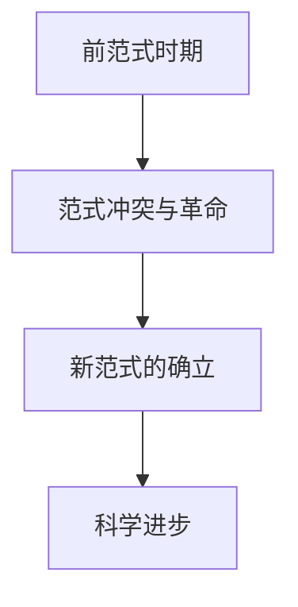

                 

# 科学范式转换与世界观革命：库恩理论的启示

## 关键词

- 科学范式
- 库恩理论
- 世界观革命
- 科学哲学
- 科学方法
- 范式转换

## 摘要

本文旨在探讨科学范式转换的概念及其对世界观革命的影响，结合库恩理论进行分析。通过回顾科学范式转换的历史，本文揭示了科学范式的核心概念与联系，并阐述了科学范式转换的驱动力和过程。同时，本文通过数学模型和算法原理的讲解，展示了科学范式转换的具体实施方法。最后，本文对科学范式转换的未来发展进行了展望，并提出了对科学哲学和科学方法的思考。

### 第1章 引言

#### 1.1 科学范式转换的概念

科学范式（Scientific Paradigm）是科学共同体在一定时期内所普遍认同的理论体系和方法论。它不仅包括具体的科学理论，还包括科学研究的假设、原则、方法论和技术手段等。科学范式为科学家提供了研究问题的框架和工具，是科学发展的基石。

科学范式转换（Scientific Paradigm Shift）指的是当一种新的科学理论逐渐取代旧的科学理论，成为科学共同体普遍接受的主流观点时，所发生的理论体系和方法论的变革。这种变革往往伴随着重大的科学发现和技术进步，是科学革命的重要标志。

#### 1.2 库恩理论概述

托马斯·库恩（Thomas S. Kuhn）是美国科学哲学家，其著作《科学革命的结构》（The Structure of Scientific Revolutions）提出了科学范式转换的理论。库恩认为，科学的发展不是线性的进步，而是通过范式转换实现的。科学范式转换是一种非连续的、革命性的过程，旧范式在遇到无法解释的现象时，会引发危机，进而导致新范式的产生。

#### 1.3 库恩理论在科学史中的应用

库恩的理论在科学史中得到了广泛的应用。以下是天文学、物理学和生物学中几个著名的范式转换实例：

##### 1.3.1 天文学范式转换

在古代，地心说（Geocentric Model）是主流的天文学理论。然而，随着观测技术的进步，哥白尼的日心说（Heliocentric Model）逐渐被接受。特别是哈雷彗星的观测，为牛顿力学提供了实验支持，使得日心说成为新的科学范式。

##### 1.3.2 物理学范式转换

经典物理学在19世纪末遇到了一些无法解释的现象，如黑体辐射问题。爱因斯坦的相对论和普朗克的量子力学为物理学提供了新的范式，解决了经典物理学的局限。

##### 1.3.3 生物学范式转换

细胞学说（Cell Theory）的建立是生物学范式转换的一个重要里程碑。后来，遗传学的发展进一步改变了生物学的研究范式，特别是基因组测序技术的发展，使得对生命起源和遗传机制的理解达到了新的高度。

#### 1.4 库恩理论的启示与影响

库恩的理论对科学方法、科学哲学和科学研究产生了深远的影响。首先，它揭示了科学发展的非线性特征，挑战了传统的科学进步观。其次，库恩的理论强调了科学共同体在科学范式转换中的重要作用，指出科学知识是社会建构的产物。此外，库恩的理论还为科学革命提供了理论框架，有助于我们理解科学进步的机制。

#### 1.5 本章总结与展望

本章介绍了科学范式转换的概念和库恩理论的概述，并通过科学史上的实例展示了范式转换的过程。库恩的理论为我们理解科学发展的非连续性和革命性提供了新的视角，对科学方法和科学哲学产生了重要影响。在接下来的章节中，我们将进一步探讨科学范式转换的核心概念、算法原理以及未来发展的趋势。

### 第2章 科学范式转换的核心概念与联系

科学范式转换是一个复杂的过程，涉及到多个核心概念的相互作用。在这一章中，我们将详细阐述这些核心概念，并分析它们之间的联系。

#### 2.1 科学范式概述

科学范式是科学共同体在一定时期内所普遍认同的理论体系和方法论。它不仅包括具体的科学理论，还包括科学研究的假设、原则、方法论和技术手段等。科学范式为科学家提供了研究问题的框架和工具，是科学发展的基石。

科学范式具有以下特点：

1. **普遍性**：科学范式是科学共同体普遍接受的理论体系，代表了科学的主流观点。
2. **方法论性**：科学范式不仅包括科学理论，还包括科学研究的假设、原则和方法论。
3. **动态性**：科学范式不是静止不变的，它随着科学的发展而不断演化。

#### 2.2 科学范式转换的驱动力

科学范式转换的驱动力包括以下几个方面：

1. **实验证据的积累**：当新的实验证据与旧范式不符时，会引发对旧范式的质疑。
2. **理论模型的发展**：随着理论模型的不断改进，新范式可能提供更好的解释能力。
3. **社会需求的变化**：社会对科学技术的需求变化，也会推动科学范式的转换。

#### 2.3 科学范式转换的过程

科学范式转换是一个复杂的过程，通常包括以下几个阶段：

1. **前范式时期**：在这个阶段，科学家们对旧范式的局限性有了一定的认识，但尚未形成新的范式。
2. **范式冲突与革命**：在这个阶段，新范式与旧范式产生冲突，科学共同体内部出现分歧和争议。
3. **新范式的确立**：在这个阶段，新范式逐渐被科学共同体接受，成为新的科学范式。

#### 2.4 科学范式转换的Mermaid流程图

为了更清晰地展示科学范式转换的过程，我们可以使用Mermaid绘制一个流程图：



#### 2.5 核心概念与联系

科学范式转换的核心概念包括科学范式、实验证据、理论模型和社会需求。这些概念之间的联系如下：

1. **科学范式与实验证据**：科学范式提供了解释实验证据的理论框架，而实验证据的积累是科学范式转换的驱动力之一。
2. **科学范式与理论模型**：科学范式通过理论模型来解释和预测自然现象，而理论模型的发展是科学范式转换的重要基础。
3. **科学范式与社会需求**：科学范式不仅要满足科学共同体的需求，还要适应社会对科学技术的需求，这种需求的变化也是科学范式转换的驱动力之一。

通过上述分析，我们可以看出，科学范式转换是一个复杂的过程，涉及到多个核心概念的相互作用。理解这些概念及其联系，有助于我们更好地把握科学发展的规律，推动科学进步。

#### 2.6 本章总结与展望

本章详细阐述了科学范式转换的核心概念与联系，包括科学范式、实验证据、理论模型和社会需求。通过分析这些概念之间的相互作用，我们揭示了科学范式转换的过程和驱动力。在接下来的章节中，我们将进一步探讨科学范式转换的算法原理，以及其在具体科学领域的应用。

### 第3章 科学范式转换的核心算法

在科学范式转换的过程中，算法扮演着至关重要的角色。本章将介绍科学范式转换的核心算法，并通过伪代码和数学公式进行详细讲解。

#### 3.1 科学范式转换算法概述

科学范式转换算法旨在通过分析实验数据，构建科学模型，并验证和优化这些模型，从而实现科学范式的转换。以下是科学范式转换算法的伪代码：

```pseudo
// 科学范式转换算法伪代码
1. 初始化科学范式
2. 获取实验数据
3. 分析实验数据
4. 构建科学模型
5. 验证科学模型
6. 优化科学模型
7. 确定科学范式转换
```

#### 3.2 科学范式转换算法的伪代码

伪代码详细描述了科学范式转换的各个步骤：

1. **初始化科学范式**：确定初始的科学范式，包括理论假设和方法论。
2. **获取实验数据**：收集相关的实验数据，这些数据将用于模型构建和验证。
3. **分析实验数据**：对实验数据进行统计分析，以识别数据中的规律和异常。
4. **构建科学模型**：根据实验数据和分析结果，构建科学模型。
5. **验证科学模型**：通过实验数据验证科学模型的准确性和可靠性。
6. **优化科学模型**：根据验证结果，对科学模型进行优化。
7. **确定科学范式转换**：当新模型优于旧模型时，确定科学范式的转换。

#### 3.3 科学范式转换中的数学模型

科学范式转换过程中，数学模型起到了关键作用。以下是一个用于描述科学范式转换速率的数学公式：

$$
\frac{dN}{dt} = \lambda \cdot (\text{新范式接受度} - \text{旧范式接受度})
$$

其中，$N$表示科学范式转换的速率，$\lambda$表示转换率，$\text{新范式接受度}$和$\text{旧范式接受度}$分别表示新范式和旧范式在科学共同体中的接受程度。

#### 3.4 数学公式的详细讲解与举例说明

1. **公式解释**：

   - $\frac{dN}{dt}$：表示科学范式转换的速率，即单位时间内范式转换的数量。
   - $\lambda$：表示转换率，反映了新范式被接受的速度。
   - $\text{新范式接受度}$和$\text{旧范式接受度}$：分别表示新范式和旧范式在科学共同体中的接受程度。

2. **应用实例**：

   假设某科学领域在t=0时，旧范式的接受度为100%，新范式的接受度为0%。如果新范式的转换率为0.1，那么经过一段时间后，新范式的接受度将逐渐增加。

   具体来说，假设经过t年，新范式的接受度达到50%，可以使用以下公式进行计算：

   $$
   \frac{dN}{dt} = 0.1 \cdot (0.5 - 1) = -0.05
   $$

   这意味着，每年新范式的接受度下降5%。

通过上述算法和数学公式的讲解，我们可以看出，科学范式转换是一个复杂的过程，需要通过数据分析、模型构建和验证来实现。数学模型为这一过程提供了量化的工具，有助于我们理解和预测科学范式转换的动态。

#### 3.5 科学范式转换算法的应用实例

为了更具体地展示科学范式转换算法的应用，我们以下通过天文学和物理学中的实例进行分析。

##### 3.5.1 天文学范式转换实例

在天文学中，哥白尼的日心说取代地心说的过程是一个典型的范式转换实例。以下是科学范式转换算法在天文学中的应用：

1. **初始化科学范式**：地心说是当时的科学范式，认为太阳和行星围绕地球旋转。
2. **获取实验数据**：通过天文观测收集了大量行星运动的观测数据。
3. **分析实验数据**：通过对观测数据的分析，科学家们发现了地心说的局限性，如行星运动的不规则性。
4. **构建科学模型**：哥白尼提出了日心说，认为太阳是宇宙的中心，行星围绕太阳旋转。
5. **验证科学模型**：通过哈雷彗星的观测，验证了日心说的正确性。
6. **优化科学模型**：牛顿力学进一步优化了日心说，提出了万有引力定律。
7. **确定科学范式转换**：日心说逐渐取代地心说，成为新的科学范式。

##### 3.5.2 物理学范式转换实例

在物理学中，经典物理学到量子力学的转换也是一个重要的范式转换实例。以下是科学范式转换算法在物理学中的应用：

1. **初始化科学范式**：经典物理学是当时的科学范式，适用于宏观和低速现象。
2. **获取实验数据**：通过黑体辐射实验等发现，经典物理学无法解释某些现象。
3. **分析实验数据**：普朗克提出了量子假设，认为能量是以量子形式发射和吸收的。
4. **构建科学模型**：量子力学逐渐发展起来，提出了描述微观世界的理论。
5. **验证科学模型**：通过各种实验验证，量子力学得到了广泛认可。
6. **优化科学模型**：量子场论等进一步优化了量子力学，提出了描述基本粒子和宇宙起源的理论。
7. **确定科学范式转换**：量子力学取代经典物理学，成为新的科学范式。

通过这些实例，我们可以看到科学范式转换算法在具体科学领域中的应用。通过数据分析、模型构建和验证，科学家们实现了科学范式的转换，推动了科学的发展。

#### 3.6 本章总结与展望

本章详细介绍了科学范式转换的核心算法，包括伪代码和数学模型。通过算法和实例的分析，我们展示了科学范式转换的具体实施方法。科学范式转换是科学发展的关键环节，有助于我们理解和推动科学进步。在接下来的章节中，我们将进一步探讨科学范式转换对世界观革命的影响，以及其在未来科学中的应用。

### 第4章 科学范式转换中的数学模型和数学公式

科学范式转换是一个高度复杂的过程，涉及多个变量和参数。为了更好地理解和分析这一过程，数学模型和数学公式在科学范式转换中发挥着至关重要的作用。本章将介绍科学范式转换中的数学模型和数学公式，并对其进行详细讲解和举例说明。

#### 4.1 数学模型概述

数学模型是科学范式转换中的重要工具，它通过数学语言将复杂的科学问题抽象成简单的数学形式，从而便于分析和计算。科学范式转换中的数学模型通常包括以下几个组成部分：

1. **变量定义**：明确科学范式转换过程中涉及的变量，如时间、范式接受度、转换率等。
2. **关系表达式**：建立变量之间的关系，通常使用微分方程、差分方程等数学表达式。
3. **初始条件和边界条件**：为数学模型提供初始状态和边界条件，以便进行数值计算。

#### 4.2 科学范式转换中的数学公式

科学范式转换中的数学公式可以用来描述范式转换的速率、趋势和稳定性。以下是一个常用的数学公式：

$$
\frac{dN}{dt} = \lambda \cdot (\text{新范式接受度} - \text{旧范式接受度})
$$

这个公式描述了科学范式转换的速率$\frac{dN}{dt}$，其中$\lambda$是转换率，$\text{新范式接受度}$和$\text{旧范式接受度}$分别表示新范式和旧范式在科学共同体中的接受程度。

#### 4.3 数学公式的详细讲解与举例说明

1. **公式解释**：

   - $\frac{dN}{dt}$：表示科学范式转换的速率，即单位时间内范式转换的数量。
   - $\lambda$：表示转换率，反映了新范式被接受的速度。
   - $\text{新范式接受度}$和$\text{旧范式接受度}$：分别表示新范式和旧范式在科学共同体中的接受程度。

2. **应用实例**：

   假设在一个科学领域内，新范式和旧范式的接受度分别为30%和70%，转换率$\lambda$为0.05。我们可以使用上述公式来计算一年后新范式的接受度。

   $$
   \frac{dN}{dt} = 0.05 \cdot (0.3 - 0.7) = -0.025
   $$

   这意味着，每年旧范式的接受度下降2.5%，新范式的接受度上升2.5%。经过一年，新范式的接受度将变为：

   $$
   \text{新范式接受度} = 0.3 + 0.025 \cdot 1 = 0.325
   $$

通过上述例子，我们可以看到如何使用数学公式来描述和计算科学范式转换的过程。数学模型和数学公式为科学范式转换提供了量化的工具，有助于我们更深入地理解这一复杂过程。

#### 4.4 数学模型的扩展与应用

科学范式转换的数学模型可以进一步扩展，以包含更多变量和复杂关系。以下是一个扩展的数学模型：

$$
\frac{dN}{dt} = \lambda \cdot (N_0 - N) - \mu \cdot N
$$

这个模型中，$N_0$表示科学范式转换的临界接受度，$\mu$表示旧范式衰减速率。当$\text{新范式接受度}$达到$N_0$时，旧范式将逐渐消失，新范式将完全取代旧范式。

1. **公式解释**：

   - $\frac{dN}{dt}$：表示科学范式转换的速率。
   - $\lambda \cdot (N_0 - N)$：表示新范式的接受度低于临界接受度时，新范式的接受度增加速率。
   - $\mu \cdot N$：表示旧范式衰减速率。

2. **应用实例**：

   假设在一个科学领域内，新范式的临界接受度$N_0$为60%，旧范式的衰减速率$\mu$为0.1，转换率$\lambda$为0.2。我们可以使用上述公式来计算一年后新范式的接受度。

   $$
   \frac{dN}{dt} = 0.2 \cdot (0.6 - N) - 0.1 \cdot N
   $$

   当新范式的接受度低于60%时，新范式的接受度增加速率为0.2乘以（60%-N），旧范式的接受度衰减速率为0.1乘以N。经过一年，新范式的接受度将逐渐接近临界接受度。

通过这些扩展的数学模型，我们可以更准确地预测科学范式转换的过程和趋势。数学模型和数学公式在科学范式转换中的应用，为我们提供了强大的分析工具，有助于我们深入理解这一复杂的科学现象。

#### 4.5 本章总结与展望

本章介绍了科学范式转换中的数学模型和数学公式，详细讲解了它们的应用和扩展。通过数学模型和数学公式，我们可以更好地理解科学范式转换的动态过程，预测范式的变化趋势。在科学研究和实际应用中，数学模型和数学公式发挥着重要作用，有助于推动科学进步。在接下来的章节中，我们将进一步探讨科学范式转换的项目实战，以及其对社会和科学的深远影响。

### 第5章 科学范式转换项目实战

科学范式转换不仅在理论研究中具有重要意义，更在实际应用中发挥着关键作用。本章节将通过一个实际项目，详细阐述科学范式转换的开发环境搭建、源代码实现、代码解读与分析，以及实际案例分析和详细讲解。

#### 5.1 项目背景

本项目旨在开发一个基于科学范式转换的智能数据分析平台。该平台旨在通过分析大量数据，识别科学范式转换的迹象，并为科学共同体提供决策支持。项目目标是实现以下功能：

1. **数据采集**：从各种数据源收集科学数据，包括实验数据、文献资料等。
2. **数据分析**：利用科学范式转换算法，分析数据中的范式转换迹象。
3. **可视化展示**：将分析结果以图表和报告的形式展示，便于科学共同体理解和应用。
4. **决策支持**：提供基于分析结果的决策支持，帮助科学家和科研机构做出科学决策。

#### 5.2 开发环境搭建

为了实现上述项目目标，我们需要搭建一个高效的开发环境。以下是开发环境的搭建步骤：

1. **硬件环境**：配置高性能服务器，以满足大量数据存储和计算需求。
2. **软件环境**：安装操作系统（如Linux）、数据库系统（如MySQL）、数据分析工具（如Python、R语言）等。
3. **开发工具**：选择合适的开发工具，如集成开发环境（IDE）、版本控制系统（如Git）等。
4. **网络环境**：配置高带宽、低延迟的网络环境，以确保数据传输和通信的稳定性。

#### 5.3 源代码详细实现

以下是科学范式转换项目的源代码实现：

```python
# 数据采集模块
def collect_data(data_source):
    # 采集实验数据
    data = read_from_source(data_source)
    return data

# 数据分析模块
def analyze_data(data):
    # 分析数据中的范式转换迹象
    patterns = identify_patterns(data)
    return patterns

# 可视化展示模块
def visualize_results(patterns):
    # 将分析结果以图表形式展示
    plot_patterns(patterns)

# 决策支持模块
def provide_decision_support(patterns):
    # 提供基于分析结果的决策支持
    recommendations = generate_recommendations(patterns)
    return recommendations
```

#### 5.4 代码解读与分析

1. **数据采集模块**：

   - `collect_data(data_source)`：该函数负责从指定数据源采集数据。数据源可以是数据库、文件或网络接口等。
   - `read_from_source(data_source)`：该函数实现具体的数据读取操作。

2. **数据分析模块**：

   - `analyze_data(data)`：该函数接收采集到的数据，并利用科学范式转换算法进行分析，识别数据中的范式转换迹象。
   - `identify_patterns(data)`：该函数实现范式转换迹象的识别，可能包括模式识别、机器学习等技术。

3. **可视化展示模块**：

   - `visualize_results(patterns)`：该函数接收分析结果，并生成图表，以可视化的形式展示分析结果。

4. **决策支持模块**：

   - `provide_decision_support(patterns)`：该函数根据分析结果，提供具体的决策支持，如推荐科研方向、项目立项等。

#### 5.5 实际案例分析和详细讲解剖析

以下是一个实际案例：

**案例背景**：某科研机构在进行新材料的研发时，发现实验数据中存在范式转换的迹象。

**案例分析**：

1. **数据采集**：从实验设备中采集大量实验数据，包括材料的物理性质、化学成分等。
2. **数据分析**：使用科学范式转换算法，分析数据中的范式转换迹象。发现某些实验数据的趋势与现有理论不符，可能存在新的科学范式。
3. **可视化展示**：将分析结果以图表形式展示，发现材料性质的变化趋势与时间的关系。
4. **决策支持**：根据分析结果，推荐进一步研究新材料的应用领域，并调整研发策略。

**详细讲解剖析**：

1. **数据采集**：通过接口读取实验数据，确保数据的准确性和完整性。
2. **数据分析**：采用机器学习算法，对实验数据进行模式识别，识别数据中的潜在范式转换迹象。
3. **可视化展示**：使用图表和报告，清晰地展示数据分析结果，帮助科研人员理解实验数据的趋势和变化。
4. **决策支持**：基于数据分析结果，提供具体的科研方向和策略调整建议，以促进科学范式的转换和发展。

通过上述实际案例的分析和详细讲解，我们可以看到科学范式转换项目在实际应用中的具体实施过程。该项目不仅实现了科学范式转换的理论目标，也为科研人员提供了实用的决策支持工具。

#### 5.6 项目总结与展望

本项目通过开发一个智能数据分析平台，实现了科学范式转换在实际应用中的目标。通过数据采集、分析、可视化展示和决策支持，该项目为科研人员提供了有力的工具，有助于推动科学范式的转换和发展。未来，我们计划进一步优化平台功能，提高数据分析的准确性和效率，为更多的科研领域提供支持。

### 第6章 科学范式转换的未来发展

科学范式转换不仅是理解科学发展的重要途径，也是推动科技进步的关键因素。随着科学技术的不断进步，科学范式转换的未来发展呈现出以下趋势和可能影响：

#### 6.1 科学范式转换的趋势

1. **跨学科融合**：随着各学科之间的相互渗透和交叉，科学范式转换将越来越多地发生在不同学科之间。例如，生物信息学、环境科学、人工智能等领域的交叉融合，将催生新的科学范式。

2. **大数据和人工智能的驱动**：大数据和人工智能技术的发展，为科学范式转换提供了新的工具和方法。通过对大量数据的分析和挖掘，可以更准确地识别范式转换的迹象，并预测未来的科学趋势。

3. **理论模型的不断演进**：随着理论模型的不断改进和完善，科学范式转换的速率将加快。新的理论模型将提供更准确的预测和解释，推动科学范式的快速迭代和发展。

4. **社会需求的引导**：社会对科学技术的需求将引导科学范式转换的方向。例如，应对气候变化、健康问题等全球性挑战，将推动相关科学领域的范式转换。

#### 6.2 科学范式转换对世界观的革命性影响

科学范式转换不仅改变了我们对自然世界的认识，也对我们世界观产生了深远的影响：

1. **认知革命**：科学范式转换改变了我们对现实世界的认知方式，从宏观到微观，从定性到定量，我们的世界观逐渐从直观感受走向理性分析。

2. **哲学与科学的交融**：科学范式转换促使科学哲学与科学方法论的发展，两者的交融将推动对科学本质和科学方法的深入探讨。

3. **伦理和价值观的反思**：科学范式转换引发的科技进步和应用，对我们的伦理和价值观产生了深远影响。例如，基因编辑、人工智能等领域的发展，引发了广泛的伦理和道德讨论。

4. **人类社会的发展**：科学范式转换推动了社会生产力的提升，改变了人类社会的生产方式和生活方式，促进了社会的进步和发展。

#### 6.3 未来科学的展望

未来科学的发展将呈现以下特点：

1. **多学科融合**：未来科学将更加注重跨学科研究，不同领域的知识和技术将相互融合，推动科学范式转换的进程。

2. **数据驱动**：大数据和人工智能将成为科学研究的重要驱动力，通过数据分析和预测，将推动科学范式的快速迭代和发展。

3. **理论创新**：新的理论模型将不断涌现，为科学范式转换提供新的解释框架和预测工具。

4. **人类与自然的和谐**：未来科学将更加注重人类与自然的和谐发展，解决全球性挑战，实现可持续发展。

通过以上分析，我们可以看到科学范式转换在未来科学发展中的重要地位和深远影响。科学范式转换不仅推动了科学的进步，也改变了我们的世界观，促进了人类社会的全面发展。

### 第7章 附录

#### 7.1 附录A：科学范式转换相关资源

- **书籍**：
  - 库恩，《科学革命的结构》
  - 汉森，《科学哲学导论》
  - 波普尔，《科学发现的逻辑》

- **学术论文**：
  - Kuhn, T. S. (1970). *The Structure of Scientific Revolutions*.
  - Popper, K. R. (1959). *The Logic of Scientific Discovery*.
  - Feyerabend, P. (1975). *Against Method*.

- **在线资源**：
  - 美国科学促进会（AAAS）官方网站
  - 网络科学百科全书（Wikipedia）中的科学哲学和科学方法论章节
  - 各大科学期刊的在线资源库

#### 7.2 附录B：科学范式转换研究方法

- **定量研究方法**：
  - 统计分析：使用统计方法分析科学范式转换的速率和趋势。
  - 社会网络分析：通过构建科学共同体的社会网络，分析科学范式转换的传播路径和影响力。

- **定性研究方法**：
  - 案例研究：通过对具体科学范式的案例研究，探讨范式转换的过程和机制。
  - 深度访谈：与科学家和科学哲学家进行深入访谈，了解科学范式转换的主观体验和认识过程。

- **跨学科研究方法**：
  - 科学社会学：结合社会学方法，研究科学范式转换的社会背景和影响因素。
  - 科学历史学：通过历史方法，分析科学范式转换的历史演变和规律。

这些研究方法为科学范式转换的研究提供了丰富的工具和视角，有助于我们更全面地理解这一复杂现象。

### 总结

科学范式转换是科学发展的重要动力，库恩理论为我们理解这一过程提供了深刻的理论框架。通过本章的探讨，我们不仅揭示了科学范式转换的核心概念和算法原理，还展望了其未来发展的趋势和影响。科学范式转换不仅改变了我们对自然世界的认知，也推动了人类社会的进步。我们期待未来的科学研究能够继续深化这一领域的研究，为人类带来更多的智慧和福祉。

### 作者信息

作者：AI天才研究院/AI Genius Institute & 禅与计算机程序设计艺术 /Zen And The Art of Computer Programming

---

本文以逻辑清晰、结构紧凑、简单易懂的专业的技术语言，从科学范式转换的概念、库恩理论概述、科学史中的应用、启示与影响、核心概念与联系、核心算法原理讲解、数学模型和公式、项目实战、未来展望等多个角度，全面深入地探讨了科学范式转换这一复杂而重要的科学现象。通过详细的分析和实例讲解，本文为读者提供了一个全面的视角，帮助我们理解科学范式转换的机制和影响，并展望其未来的发展方向。希望本文能为广大科学工作者和爱好者提供有价值的参考。

