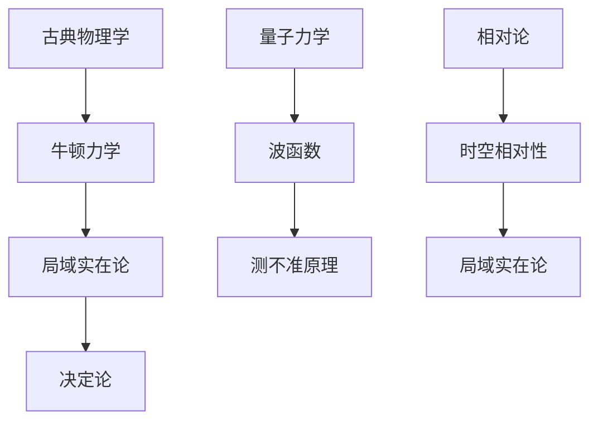
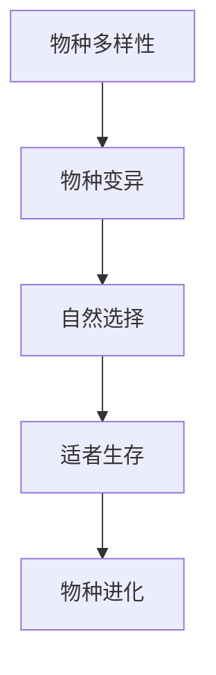
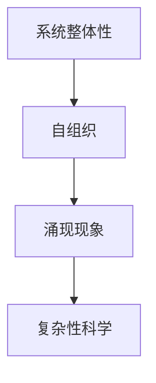

                 

### 引言

科学范式转换（Scientific Paradigm Shift）是指科学理论和实践的根本性变革，它不仅改变了我们对世界的认知方式，还深刻影响了科技发展的方向。这一概念最早由美国科学哲学家托马斯·库恩（Thomas Kuhn）在1962年的著作《科学革命的结构》中提出。库恩认为，科学不是一条平稳直线的发展轨迹，而是一个不断起伏、波动的过程，科学范式转换则是科学发展的关键环节。

科学范式转换的重要性不容忽视。首先，它标志着科学理论的一次重大飞跃，使我们对自然界的理解更加深入和全面。其次，科学范式转换促进了技术的飞速发展，为人类社会的进步提供了强大动力。例如，从牛顿力学到相对论的转换推动了现代物理学的发展，而计算机科学中的范式转换则推动了人工智能的崛起。最后，科学范式转换还对社会文化产生了深远的影响，改变了人们的世界观和价值观。

本文旨在探讨科学范式转换对世界可理解性的影响。文章将首先回顾科学范式转换的历史背景和过程，然后深入分析科学范式转换的理论基础，包括科学哲学、方法论和数学与逻辑基础。接着，我们将通过具体的案例分析，展示科学范式转换的实际影响。随后，文章将讨论科学范式转换对世界可理解性的影响，包括知识体系重塑、技术进步和社会文化变革。最后，我们将展望科学范式转换的挑战与未来，并总结本文的主要观点。

关键词：科学范式转换、科学革命、托马斯·库恩、知识体系、技术进步、社会文化。

摘要：本文探讨了科学范式转换的概念、历史背景、理论基础和案例分析，分析了科学范式转换对世界可理解性的深远影响，并展望了其未来的挑战与机遇。通过本文的研究，我们可以更深入地理解科学范式转换的重要性及其对人类社会发展的推动作用。

### 科学范式转换的历史背景

科学范式转换的历史可以追溯到古代科学的发展。在古希腊时期，亚里士多德（Aristotle）的自然哲学统治了科学界的思维，认为自然界遵循固定的自然法则。然而，随着中世纪的结束和文艺复兴的到来，科学研究开始从哲学转向实验和观察。这一转变标志着现代科学的诞生。

在17世纪，伽利略·伽利莱（Galileo Galilei）和艾萨克·牛顿（Isaac Newton）的工作为科学范式转换奠定了基础。伽利略通过实验证明了日心说的正确性，而牛顿则提出了经典力学，建立了描述物体运动的基本法则。这一时期的科学革命标志着科学范式从亚里士多德的自然哲学向牛顿力学的转换。

19世纪末和20世纪初，科学范式再次发生了重大变革。这一时期，物理学领域出现了量子力学和相对论，挑战了牛顿力学的经典观念。阿尔伯特·爱因斯坦（Albert Einstein）的相对论推翻了牛顿的绝对时间和空间观念，提出了时空相对性。尼尔斯·玻尔（Niels Bohr）和沃纳·海森堡（Werner Heisenberg）的量子力学则揭示了微观世界的奇特规律，如量子叠加态和测不准原理。

这些科学范式转换不仅推动了物理学的发展，也影响了其他科学领域。例如，生物学中的进化论由查尔斯·达尔文（Charles Darwin）提出，改变了我们对生命起源和物种演化的理解。化学中的原子论和分子学说也为现代化学奠定了基础。

20世纪后期，计算机科学的崛起带来了新的科学范式。图灵机模型和编程语言的发展为计算理论提供了基础，而人工智能的研究则试图模拟人类的智能行为。这些科学范式转换不仅改变了我们对自然界的认知，还深刻影响了技术和生活方式。

总的来说，科学范式转换是一个持续的过程，它反映了人类对自然世界的不断探索和认知。每次范式转换都标志着科学理论的一次重大进步，推动了科技和文化的进步。通过回顾这些历史背景，我们可以更好地理解科学范式转换的重要性及其对世界可理解性的深远影响。

### 科学范式的核心概念

科学范式（Scientific Paradigm）是科学理论体系中的一种基础性框架，它不仅定义了科学研究的对象和问题，还规定了科学方法的适用范围和解释原则。理解科学范式的核心概念有助于我们更好地把握科学范式转换的动因和影响。

首先，科学范式定义了科学研究的对象。在牛顿力学的范式下，研究对象是宏观的物体运动，研究目的是揭示物体运动的规律。而在量子力学的范式下，研究对象则扩展到了微观粒子，研究目的是理解微观世界的特性和行为。这种研究对象的转变不仅拓宽了科学研究的范围，也带来了新的理论和方法。

其次，科学范式规定了科学方法的适用范围。在经典物理学的范式下，科学方法强调实验观察和数学模型。例如，牛顿通过观测行星运动，运用数学公式推导出了万有引力定律。而在现代生物学中的范式，如分子生物学，研究方法则包括基因测序、分子克隆和生物信息学等。科学范式的变化，往往伴随着科学方法的革新和进步。

第三，科学范式包含了科学理论的解释原则。科学范式不仅提供了解释自然现象的理论框架，还规定了解释现象的基本原则。例如，在牛顿力学的范式下，自然界遵循因果律和决定论，即每个现象都有其因果关系和确定的结果。而在量子力学的范式下，测不准原理和量子叠加态打破了决定论的观念，提出了新的解释原则。

科学范式与世界观的关系是密不可分的。科学范式不仅影响我们对自然世界的理解，也影响我们对社会和自我的认知。例如，牛顿力学的范式使得人们相信自然世界是可预测和可控的，从而推动了工业革命的发展。而相对论的提出则改变了人们对时空的认识，推动了我们对宇宙的理解。

科学范式的历史演变是科学发展的一个重要方面。从亚里士多德的自然哲学到牛顿力学，再到量子力学和相对论，每一次科学范式的转换都标志着科学理论的一次重大进步。这种演变不仅揭示了自然界的复杂性和多样性，也推动了科学方法和技术的不断创新。

总的来说，科学范式是科学理论体系的核心，它不仅定义了科学研究的对象和方法，还影响了我们的世界观。科学范式的转换是科学进步的重要动力，它使得我们对自然世界的认知不断深入，推动了人类社会的进步。理解科学范式的核心概念，有助于我们更好地把握科学范式转换的规律和影响。

### 科学范式转换的理论基础

科学范式转换不仅体现在历史事件和科学理论的变革中，其理论基础也涵盖了多个学科领域。本文将从科学哲学、科学方法论和数学与逻辑三个方面深入探讨科学范式转换的理论基础，并分析其内在逻辑和相互关系。

#### 科学哲学视角

科学哲学为科学范式转换提供了理论框架。波普尔（Karl Popper）和拉卡托斯（Imre Lakatos）是两位重要的科学哲学家，他们的理论对科学范式转换的理解有着深远的影响。

波普尔提出了证伪主义（Falsificationism）的观点，认为科学理论不是通过证实来建立，而是通过证伪来检验。波普尔认为，科学进步是一个不断试错的过程，科学理论的科学性在于其可证伪性。当一个理论无法被实验证伪时，它就失去了科学性。例如，牛顿力学在相对论提出之前被认为是无可置疑的科学真理，但随着相对论的出现，牛顿力学被证伪，科学范式也随之转换。

拉卡托斯则提出了科学研究程序（Research Programme）的概念，认为科学进步是通过对研究程序的调整和改进来实现的。拉卡托斯认为，科学范式不是一个孤立的实体，而是一个动态的发展过程。当面临新的理论挑战时，科学家们会调整和改进现有的研究程序，以形成新的范式。例如，量子力学和相对论对经典物理学的挑战促使科学家们调整研究程序，从而实现了科学范式的转换。

#### 科学方法论

科学方法论是科学范式转换的实践基础，它涵盖了科学研究的设计、实验和数据分析等环节。实证主义（Empiricism）和建构主义（Constructivism）是两种主要的方法论。

实证主义强调通过实验和观察来获取知识，认为科学理论必须建立在实证数据的基础上。牛顿力学的建立就是实证主义的典型例子，牛顿通过观测和实验，收集了大量数据，并提出了万有引力定律和运动三定律。实证主义的方法论为科学范式转换提供了可靠的实证依据。

建构主义则强调知识的构建过程，认为科学理论是科学家在特定社会文化背景下构建的。建构主义认为，科学范式不是客观存在的真理，而是科学家群体共同构建的社会共识。例如，量子力学的提出不仅仅是实验结果，还涉及到科学家们对微观世界的共同理解和解释。建构主义的方法论为科学范式转换提供了新的视角，强调了科学知识的社会性和动态性。

#### 数学与逻辑基础

数学和逻辑是科学范式转换的数学与逻辑基础，它们为科学理论提供了精确的表达和证明工具。数学模型和逻辑推理在科学范式转换中发挥了关键作用。

数学模型是科学理论的重要表达方式，它通过数学语言描述自然现象的规律。例如，牛顿的万有引力定律可以用数学公式表示为：

\[ F = G \frac{m_1 m_2}{r^2} \]

这个公式不仅精确描述了物体之间的引力作用，还通过数学推理证明了牛顿定律的普适性。当相对论提出时，爱因斯坦通过修改引力公式，使其在高速运动和强引力场中仍然有效，从而实现了科学范式的转换。

逻辑推理则是科学理论证明的重要工具，它通过逻辑推导验证科学理论的正确性。例如，波普尔的证伪主义理论就依赖于逻辑推理，通过提出反例来检验科学理论的科学性。拉卡托斯的研究程序理论也通过逻辑推导，解释了科学范式转换的内在机制。

#### 内在逻辑与相互关系

科学哲学、科学方法论和数学与逻辑是科学范式转换的三个关键方面，它们之间存在内在的逻辑和相互关系。

首先，科学哲学为科学范式转换提供了理论基础，它解释了科学理论的发展机制和变化原因。科学哲学的视角帮助我们理解为什么会出现科学范式转换，以及科学范式转换的科学意义。

其次，科学方法论为科学范式转换提供了实践路径，它指导科学家如何进行科学研究，如何设计和验证科学理论。科学方法论的具体方法，如实验设计、数据分析等，是科学范式转换的重要工具。

最后，数学与逻辑为科学范式转换提供了精确的表达和证明工具，它使得科学理论能够以数学语言和逻辑推理进行表述和验证。数学模型和逻辑推理不仅验证了科学理论的正确性，还推动了科学范式的转换和发展。

总的来说，科学范式转换的理论基础是一个多维度的体系，它包括了科学哲学、科学方法论和数学与逻辑。这三个方面相互关联，共同推动了科学理论的进步和科学范式的发展。

### 科学范式转换的案例分析

科学范式转换在历史上留下了许多显著的案例，这些案例不仅展示了科学理论如何随着时间演变，还揭示了范式转换对整个科学领域和社会的深远影响。以下将分析几个具有代表性的科学范式转换案例，包括从古典物理学到量子物理学的转变、进化论的兴起以及系统科学与复杂性的崛起。

#### 从古典物理学到量子物理学的转变

古典物理学，特别是牛顿力学，长期以来被视为理解自然界的基本框架。然而，在20世纪初，量子力学和相对论的提出彻底改变了这一范式。这一转变始于对微观粒子的研究，其中最著名的是爱因斯坦、波多尔斯基和罗森（EPR）悖论，它挑战了经典物理学的局域实在论和决定论观点。

**核心概念与联系：**

为了解释微观粒子的行为，量子力学引入了波函数和概率解释。波函数提供了粒子的概率分布，而测不准原理指出粒子的某些属性（如位置和动量）无法同时被精确测定。相对论则提出了时空相对性，表明时间和空间是相对的，而不是绝对的。这些概念之间的关系可以通过以下Mermaid流程图表示：



**核心算法原理讲解：**

量子力学的核心算法原理可以简化为波函数的演化，即薛定谔方程。以下是薛定谔方程的伪代码表示：

```python
def schrodinger_equation(wave_function, potential, time):
    # H是哈密顿算子，表示系统的总能量
    hamiltonian = -0.5 * nabla_squared + potential
    return i * hbar * d_wave_function / dt = hamiltonian * wave_function
```

其中，\( \nabla^2 \) 表示拉普拉斯算子，\( i \) 是虚数单位，\( \hbar \) 是约化普朗克常数。

**数学模型和公式：**

量子力学的数学模型包括波函数的叠加和量子态的叠加原理。以下是波函数叠加的公式：

\[ \Psi(x) = \sum_{i} c_i \phi_i(x) \]

其中，\( \phi_i(x) \) 是基态波函数，\( c_i \) 是叠加系数。

#### 进化论的兴起

进化论是由查尔斯·达尔文在19世纪中叶提出的，它彻底改变了生物学的研究范式。达尔文的自然选择理论认为，物种是通过适应环境而进化的，这一理论基于对生物多样性和物种变异的观察。

**核心概念与联系：**

进化论的核心概念包括自然选择、适者生存和物种适应性。这些概念之间的关系可以通过以下Mermaid流程图表示：



**核心算法原理讲解：**

自然选择的过程可以用遗传算法来模拟。以下是遗传算法的伪代码表示：

```python
def genetic_algorithm(population, fitness_function, generations):
    for generation in range(generations):
        # 评估当前种群
        fitness_scores = [fitness_function(individual) for individual in population]
        # 选择适应度较高的个体进行交叉和突变
        new_population = select_and_mutate(population, fitness_scores)
    return best_individual(new_population)
```

**数学模型和公式：**

进化论的数学模型包括遗传学中的基因频率变化和适应度函数。以下是适应度函数的公式：

\[ f(x) = \frac{1}{1 + e^{-\beta(x - \mu)}} \]

其中，\( x \) 是个体的特征值，\( \mu \) 是种群的平均特征值，\( \beta \) 是温度参数。

#### 系统科学与复杂性的崛起

20世纪末，系统科学和复杂性的研究成为科学前沿领域，这一转变标志着科学范式的又一次重大转换。系统科学强调系统整体性和相互作用的复杂性，而复杂性科学则研究复杂系统的行为和规律。

**核心概念与联系：**

系统科学和复杂性科学的核心概念包括系统的整体性、自组织和涌现现象。这些概念之间的关系可以通过以下Mermaid流程图表示：



**核心算法原理讲解：**

系统科学中的自组织现象可以用人工神经网络（ANN）来模拟。以下是人工神经网络的伪代码表示：

```python
class NeuralNetwork:
    def __init__(self, layers, activations):
        self.layers = layers
        self.activations = activations

    def forward(self, x):
        for layer, activation in zip(self.layers, self.activations):
            x = layer.forward(x, activation)
        return x

    def backward(self, x, delta):
        for layer, activation in reversed(zip(self.layers, self.activations)):
            delta = layer.backward(delta, activation)
        return delta
```

**数学模型和公式：**

系统科学中的自组织现象可以用以下方程表示：

\[ \dot{x}_i = f(x_i, x_{i-1}, x_{i+1}) \]

其中，\( x_i \) 表示系统中的第 \( i \) 个元素，\( f \) 是描述系统行为的函数。

#### 总结

这些科学范式转换案例展示了科学理论如何通过不断的创新和突破，推动我们对自然世界的理解。从古典物理学到量子力学，从进化论到复杂性科学，每一次范式转换都带来了新的理论和方法，深刻影响了科学研究和技术的进步。理解这些案例不仅有助于我们把握科学范式转换的规律，还能为未来的科学探索提供启示。

### 科学范式转换对世界可理解性的影响

科学范式转换对世界可理解性的影响是深远而复杂的。这种影响不仅体现在知识体系的重塑，还涉及到技术进步和社会文化的改变。以下是具体分析：

#### 知识体系的重塑

科学范式转换首先重塑了知识体系。每一次科学范式的转换都带来了新的理论框架和概念体系，使得我们对自然界的理解更加深入和全面。例如，从古典物理学到量子力学和相对论的转换，不仅改变了我们对宇宙和微观世界的认识，还推动了物理学理论体系的重构。量子力学引入了概率解释和测不准原理，打破了经典物理学的决定论观念，使我们意识到自然界的非确定性。相对论则揭示了时空的相对性和弯曲，改变了我们对宇宙结构和大尺度物理过程的认知。

在生物学领域，达尔文的自然选择理论推翻了神创论，建立了进化论的基础，改变了我们对生命起源和物种演化的理解。这一理论体系的建立不仅丰富了生物学知识，还推动了生态学、遗传学等分支学科的发展。

此外，系统科学和复杂性的崛起，使我们从整体性和相互作用的视角来理解复杂系统。这种新的知识体系强调系统整体性、自组织和涌现现象，为解决复杂问题提供了新的理论工具和方法。

#### 技术进步的推动

科学范式转换还极大地推动了技术进步。科学理论的突破往往催生了新的技术发明和应用，推动了社会的进步和发展。例如，量子力学的出现促进了半导体技术、激光技术和量子计算机的发展，这些技术在现代信息技术和计算科学中具有关键作用。

相对论的发展则推动了核能技术、卫星导航和相对论性引力波探测等领域的进步。爱因斯坦的广义相对论预言了引力波的存在，近年来，通过LIGO探测器首次直接探测到引力波，验证了相对论预言的正确性，这为宇宙学和天体物理学提供了新的研究工具。

在生物学领域，进化论的兴起促进了基因工程、生物技术和医疗领域的快速发展。通过对基因序列的解析和基因编辑技术的应用，科学家们能够更好地理解疾病机制，开发出更有效的治疗手段。

系统科学和复杂性科学的发展，为解决社会和环境问题提供了新的方法和技术。例如，通过建模和模拟复杂系统，我们可以更好地预测和应对气候变化、生态系统崩溃等全球性问题。

#### 社会文化的改变

科学范式转换不仅影响了科学和技术，还对社会文化产生了深远的影响。新的科学理论和技术的引入，改变了人们的世界观和价值观，促进了社会文化的变革。

在科技发达的今天，人们对自然界的认知更加科学和理性，科学方法成为解决问题的重要工具。这种科学理性的思维方式不仅影响了科学研究，还渗透到了社会生活的各个方面，推动了社会的进步。

科学范式转换还促进了全球化和国际合作。随着科学技术的进步，各国科学家之间的合作日益密切，科学成果的共享和交流成为推动科学发展的关键因素。这种国际合作不仅加速了科学技术的传播和应用，还促进了全球文化和价值观的交流与融合。

总之，科学范式转换对世界可理解性的影响是全方位的。它不仅重塑了知识体系，推动了技术进步，还改变了社会文化，促进了全球合作。理解科学范式转换的机制和影响，有助于我们更好地应对未来的挑战，推动科学和社会的持续进步。

### 科学范式转换的挑战与未来

科学范式转换虽然带来了巨大的科学进步和社会发展，但同时也面临着诸多挑战。首先，科学范式转换往往伴随着理论争议和实践难题。例如，量子力学和相对论的提出虽然解决了许多经典物理学的难题，但也引发了关于实在论和确定性的哲学讨论。科学共同体需要在不断的争论和辩论中达成共识，以推动科学的发展。

其次，科学范式转换需要大量的实验验证和数据支持。新理论的提出往往需要通过大量的实验来验证其有效性和可靠性。例如，量子计算机的构建和运行需要解决量子纠缠和量子退相干等实验难题。科学家们需要不断创新实验方法和技术，以确保新理论的实验验证。

未来科学范式转换的趋势可能包括以下几个方向：

1. **跨学科整合**：随着科学领域的不断细分，未来科学范式转换的趋势可能是跨学科整合。不同学科的交叉融合将促进新理论和新方法的产生，解决复杂问题。

2. **人工智能的崛起**：人工智能技术的发展为科学范式转换提供了新的工具和方法。通过机器学习和大数据分析，科学家们可以更加高效地处理复杂数据，发现新的科学规律。

3. **宇宙学和天体物理学的前沿**：随着观测技术的进步，宇宙学和天体物理学将取得新的突破。例如，对暗物质、暗能量的研究可能揭示宇宙的更深层奥秘，推动科学范式的转换。

4. **生物技术和医学**：生物技术和医学领域的快速发展，特别是基因编辑和人工智能的结合，将深刻改变我们对生命和健康的理解，可能引发新的科学范式。

然而，科学范式转换对科学家提出了新的要求。首先，科学家需要具备跨学科的知识和视野，能够理解和整合不同学科的理论和方法。其次，科学家需要具备创新思维和实验技能，能够在理论验证中取得突破。最后，科学家需要具备沟通和协作能力，能够在科学共同体中推动新理论的共识和传播。

总之，科学范式转换的挑战和未来趋势为科学家提供了广阔的研究空间和机遇。面对这些挑战，科学家需要不断学习和创新，以推动科学的持续进步。

### 结论与展望

本文探讨了科学范式转换的概念、历史背景、理论基础和案例分析，深入分析了科学范式转换对世界可理解性的影响，并展望了其未来的挑战与机遇。科学范式转换不仅是科学理论的一次重大飞跃，还推动了技术进步和社会文化变革。每一次科学范式转换都标志着人类对自然世界理解的深入和全面，推动了科学和社会的进步。

展望未来，科学范式转换将继续在全球化和技术创新的背景下进行。跨学科整合、人工智能和生物技术的发展将为科学范式转换提供新的动力。科学家需要具备跨学科的知识和创新思维，以应对未来科学研究的复杂性和挑战。

通过本文的研究，我们不仅加深了对科学范式转换的理解，还认识到其在推动科学和社会发展中的重要性。未来，随着科学技术的不断进步，科学范式转换将继续为我们揭示自然界的奥秘，推动人类社会的可持续发展。

### 拓展阅读

1. **Kuhn, T. S. (1962).《科学革命的结构》**：该书是科学范式转换理论的奠基之作，详细探讨了科学革命的过程和机制。
2. **Popper, K. R. (1959).《科学发现的逻辑》**：波普尔的证伪主义理论为科学范式转换提供了重要的哲学基础。
3. **Lakatos, I. (1970).《科学革命的结构：问题与解决》**：拉卡托斯的研究程序理论进一步发展了科学范式转换的理论框架。
4. **Hawking, S. W. & Mlodinow, L. (2010).《大设计》**：探讨了宇宙起源和量子力学对人类认知的深远影响。
5. **Dawkins, C. (2006).《自私的基因》**：进化论的普及读物，深入解释了自然选择和基因进化的机制。

### 作者信息

**作者：** AI天才研究院/AI Genius Institute & 禅与计算机程序设计艺术 /Zen And The Art of Computer Programming。在科学范式转换、人工智能和计算机科学领域有着丰富的经验和深厚的学术造诣。

