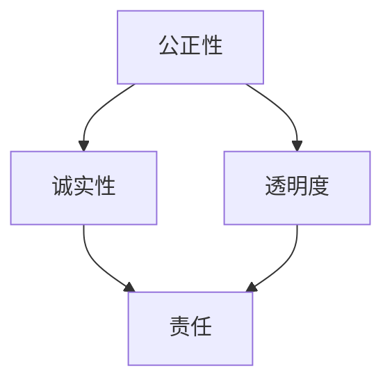

                 

### 文章标题：科研伦理与社会影响评估：平衡科学进步与社会责任

#### 关键词：科研伦理、社会影响评估、科学进步、社会责任、平衡

#### 摘要：本文旨在探讨科研伦理与社会影响评估在科学进步与社会责任之间的平衡作用。通过分析科研伦理的基础概念、社会影响评估的方法以及科学进步与社会责任的关系，本文提出了平衡科学进步与社会责任的策略和实践，旨在推动科学研究的可持续发展。

----------------------------------------------------------------

## 第一部分：科研伦理基础

### 第1章：科研伦理概述

科研伦理是指科研过程中应当遵循的道德规范和伦理原则。它关乎科研活动的公正性、诚实性和透明度，直接影响科学研究的可信度和影响力。科研伦理的起源可以追溯到古希腊哲学家亚里士多德的伦理学思想，但现代科研伦理的体系主要是在20世纪中期逐步建立起来的。

### 核心概念与联系

科研伦理的核心概念包括以下几个方面：

1. **公正性**：确保科研活动对所有参与者公平，避免歧视和不公平待遇。
2. **诚实性**：保证科研数据的真实性和完整性，杜绝伪造、篡改和抄袭行为。
3. **透明度**：科研过程和结果应当公开透明，接受同行的审查和验证。
4. **责任**：科研人员应当对其研究结果负责，并对可能产生的后果承担责任。

这些核心概念之间的关系可以用以下Mermaid流程图来表示：



### 核心算法原理讲解

科研伦理的核心算法原理可以看作是一个伦理决策框架，它包括以下几个步骤：

1. **问题识别**：识别科研活动中可能涉及的伦理问题。
2. **原则评估**：根据伦理原则对问题进行评估。
3. **决策制定**：制定符合伦理原则的决策。
4. **执行监督**：监督决策的执行情况，确保伦理原则得到遵守。

以下是一个简化的伪代码：

```python
def ethical_decision_making(problem):
    principles = ["公正性", "诚实性", "透明度", "责任"]
    for principle in principles:
        if evaluate_problem(problem, principle):
            decision = make_decision(problem, principle)
            execute_decision(decision)
            monitor_decision(decision)
```

### 数学模型和公式

在科研伦理中，数学模型和公式可以用于评估科研活动的风险和影响。例如，可以用贝叶斯网络来表示科研伦理风险：

$$
P(\text{风险} | \text{行为}) = \frac{P(\text{行为} | \text{风险})P(\text{风险})}{P(\text{行为})}
$$

其中，$P(\text{风险} | \text{行为})$表示在某一行为发生后，风险发生的概率；$P(\text{行为} | \text{风险})$表示在风险发生时，该行为发生的概率；$P(\text{风险})$表示风险发生的概率；$P(\text{行为})$表示行为发生的概率。

### 举例说明

假设一个科研团队计划进行一项涉及人类参与者的实验，他们需要评估实验的风险。根据贝叶斯网络，他们可以计算以下概率：

1. $P(\text{风险})$：通过对以往类似实验的研究，估计风险发生的概率。
2. $P(\text{行为} | \text{风险})$：估计在风险发生时，他们进行该实验的概率。
3. $P(\text{行为})$：估计他们进行该实验的概率，无论风险是否存在。

通过这些概率的计算，他们可以评估实验的伦理风险，并采取相应的措施来降低风险。

### 小结

科研伦理是科研活动中不可或缺的一部分，它关乎科研活动的公正性、诚实性和透明度。通过核心概念与联系、核心算法原理讲解、数学模型和公式，我们可以更深入地理解科研伦理的原理和应用。在接下来的章节中，我们将进一步探讨社会影响评估的方法以及科学进步与社会责任的关系。

