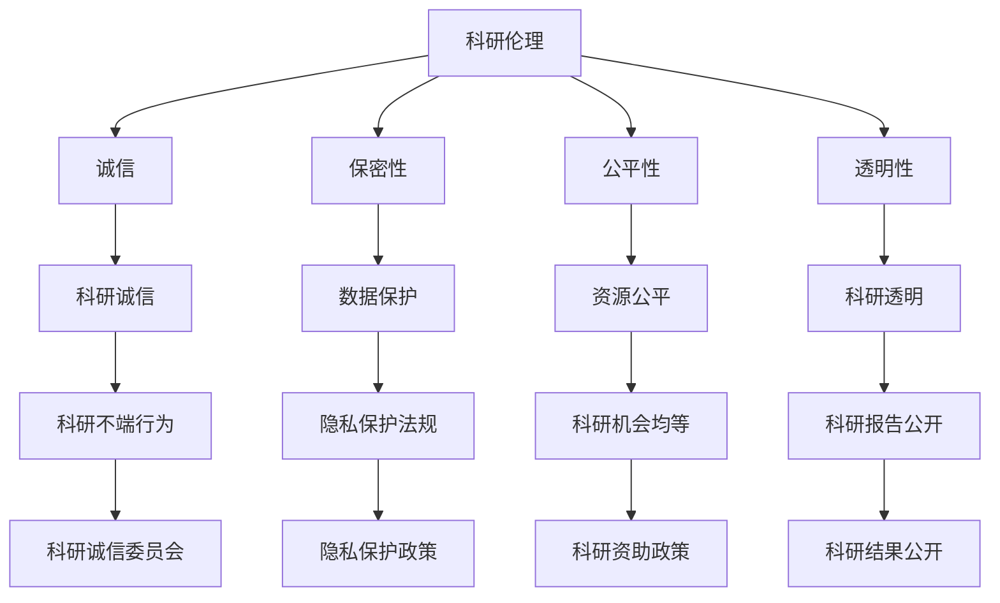

                 

### 1.3 科研伦理的核心概念与联系

#### 1.3.1 核心概念

科研伦理是指在科学研究和实验活动中应遵循的道德规范和行为准则。核心概念包括但不限于以下几个方面：

1. **诚信**：科研诚信是科研伦理的核心，它要求科研工作者在研究过程中保持诚实、公正、透明，不得伪造、篡改、剽窃他人成果，确保研究成果的可靠性和可信度。

2. **保密性**：保密性涉及对科研数据和参与者个人隐私的保护，确保科研活动的隐私性和信息安全。

3. **公平性**：公平性包括资源分配的公平和科研机会的平等，要求科研资源分配合理，确保不同背景和能力的科研人员都有平等的发展机会。

4. **透明性**：透明性要求科研过程和结果公开透明，便于同行评审和社会监督，提高科研活动的可信度和公信力。

#### 1.3.2 联系与关系架构

为了更好地理解科研伦理的核心概念及其相互关系，我们可以使用Mermaid流程图进行直观展示：

在此流程图中，我们可以看到各个核心概念之间的关系。例如，诚信直接关联到科研诚信，保密性关系到数据保护法规，公平性涉及资源公平和科研机会均等，透明性则关联到科研报告的公开和科研结果的公开。这些核心概念相互支持，共同构成了科研伦理的框架。

#### 1.3.3 核心概念与实际应用

在科研活动中，这些核心概念的具体应用如下：

- **诚信**：在实验设计、数据收集、数据分析、论文撰写等各个环节，科研工作者都需要严格遵守诚信原则，确保研究过程的科学性和结果的可靠性。

- **保密性**：对于涉及个人隐私的数据，如临床试验中的患者信息，需要采取严格的保密措施，防止数据泄露。

- **公平性**：科研项目的资金、设备、人才等资源的分配应该公平合理，确保不同研究方向的科研人员都能获得必要的支持。

- **透明性**：科研项目的申请、评审、执行、成果发布等过程应该公开透明，接受同行和公众的监督。

### 1.3.4 核心概念与算法原理

在构建科研伦理新框架时，算法原理也发挥了重要作用。伦理决策算法通过分析科研过程中的各种数据和信息，提供伦理判断和决策支持。以下是科研伦理决策算法的核心原理和步骤：

1. **伦理模型构建**：基于科研伦理的核心概念，构建包含诚信、保密性、公平性和透明性等要素的伦理模型。

2. **数据输入**：将科研过程中的相关数据输入到伦理模型中，如实验数据、参与者信息、资源分配情况等。

3. **算法分析**：利用伦理模型对输入数据进行分析，评估科研活动的伦理风险。

4. **伦理判断**：根据算法分析结果，做出伦理决策，如是否需要调整研究方法、是否需要加强保密措施等。

5. **决策执行**：根据伦理判断结果，执行相应的措施，确保科研活动符合伦理要求。

### 1.3.5 数学模型和数学公式

为了更精确地评估科研活动的伦理风险，可以采用数学模型和公式。以下是一个简单的伦理风险评估模型：

$$
R = f(P, C, T)
$$

其中，\( R \) 表示伦理风险水平，\( P \) 表示潜在危害，\( C \) 表示控制措施，\( T \) 表示时间因素。通过这个模型，我们可以量化伦理风险，为科研管理提供决策依据。

#### 1.3.6 举例说明

假设一个科研项目的潜在危害 \( P \) 为5，控制措施 \( C \) 为4，时间因素 \( T \) 为3，则其伦理风险水平 \( R \) 可以计算为：

$$
R = f(5, 4, 3) = 5 \times 0.6 + 4 \times 0.3 + 3 \times 0.1 = 3.7
$$

这意味着该科研项目的伦理风险水平为3.7，处于中等风险水平。针对这一风险水平，科研团队需要采取相应的措施，如加强数据保密、提高控制措施的有效性等，以降低伦理风险。

### 1.3.7 核心概念与联系总结

科研伦理的核心概念包括诚信、保密性、公平性和透明性，这些概念相互关联，共同构成了科研伦理的框架。通过构建伦理模型和算法，我们可以对科研活动进行伦理风险评估和决策支持。数学模型和公式则为量化伦理风险提供了工具。这些理论和工具相辅相成，为科研伦理的实践提供了坚实的理论基础。

---

在接下来的章节中，我们将进一步探讨科研伦理的核心原则及其在具体科研活动中的应用，分析科研伦理面临的挑战和争议，并探讨构建科研伦理新框架的必要性和原则。通过这一步步的分析，我们希望为科研工作者提供有益的道德指引，确保科研活动在追求真理的过程中始终遵循伦理规范。

