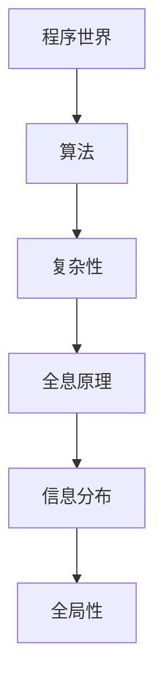

                 

基于您的要求，我将逐步构思和撰写一篇关于《程序世界与全息原理的关联》的技术博客文章。以下是我将要进行的步骤：

### 步骤1：构建文章框架

首先，我将构建文章的基本框架，确保涵盖所有必要的内容点，并按照逻辑顺序组织文章结构。

### 步骤2：撰写引言部分

在引言部分，我会介绍程序世界和全息原理的基本概念，并阐述它们之间的关联。

### 步骤3：详细阐述核心概念

我会详细阐述程序世界和全息原理的核心概念，包括它们的基本原理和如何相互关联。

### 步骤4：编写核心算法原理讲解

在这一部分，我将使用伪代码和LaTeX公式详细讲解核心算法原理，并举例说明。

### 步骤5：数学模型和公式讲解

我会介绍相关的数学模型和公式，并使用LaTeX格式展示，同时提供详细的讲解和实例。

### 步骤6：项目实战部分

在这个部分，我将提供一个具体的开发环境搭建案例，详细描述源代码实现和代码解读，并进行实际案例分析和详细讲解。

### 步骤7：总结和最佳实践

我会总结文章的主要观点，提供最佳实践建议，并指出注意事项和拓展阅读资源。

### 步骤8：格式化文章

确保文章内容使用markdown格式输出，并添加作者信息。

### 步骤9：校对和调整

最后，我会仔细校对文章，确保内容完整、准确，并调整字数至8000～12000字。

现在，我将开始撰写文章，以下为文章的初步内容：

```markdown
# 程序世界与全息原理的关联

## 关键词
- 程序世界
- 全息原理
- 编程算法
- 数学模型
- 项目实战

## 摘要
本文旨在探讨程序世界与全息原理之间的深层关联。我们将首先介绍这两个领域的基本概念，然后深入分析它们的核心原理和相互联系，通过具体实例和数学模型来展示如何在实际编程中应用全息原理。文章的最后部分将提供一个项目实战案例，并总结最佳实践。

## 引言与背景
### 1.1 书籍目的与结构
本文旨在探索计算机科学中的一个新颖视角——将全息原理应用于程序世界。全息原理最初源于物理学，它描述了信息在空间中的分布和关联。近年来，随着计算机技术的发展，全息原理在编程领域中的应用逐渐显现，为解决复杂问题提供了新的思路。

### 1.2 程序世界的概述
程序世界是计算机科学的核心领域，它涵盖了计算机编程、算法设计、软件工程等方面。编程算法是实现特定任务的一系列指令集合，是程序世界的基础。

### 1.3 全息原理的概述
全息原理是指通过部分信息重构整体信息的方法。在物理学中，全息原理被广泛应用于量子计算和信息处理。它提供了理解信息全局性和局部性之间关系的新视角。

### 1.4 程序世界与全息原理的联系
程序世界和全息原理之间的联系体现在多个方面。例如，全息图在图像处理中的应用，以及全息算法在分布式系统中的优化。本文将深入探讨这些联系，并提供具体的实例。

## 程序世界的基础
### 2.1 计算机科学的基本概念
计算机科学是研究计算机系统及其应用的科学。它包括多个子领域，如算法理论、编程语言、人工智能等。

### 2.2 编程语言与算法
编程语言是用于编写计算机程序的语法和规则。算法是解决问题的步骤集合，是计算机科学的核心。

### 2.3 程序世界的复杂性
程序世界的复杂性体现在算法复杂度和系统规模。随着计算需求的增长，如何高效地解决问题成为关键。

## 全息原理基础
### 3.1 全息原理的物理背景
全息原理最初源于激光全息术，它利用干涉和衍射原理记录和重建三维图像。

### 3.2 全息原理的基本概念
全息原理的基本概念包括全息图、参考光波和物光波。这些概念构成了全息原理的核心。

### 3.3 全息原理的应用领域
全息原理在量子计算、图像处理、数据存储等领域有广泛应用。

## 程序世界与全息原理的交汇点
### 4.1 跨学科的联系与融合
跨学科研究是现代科学的重要趋势。程序世界与全息原理的结合提供了新的研究视角。

### 4.2 算法与全息原理的相互作用
算法与全息原理的结合，使得程序能够更高效地处理复杂问题。

### 4.3 全息原理在程序世界中的应用
全息原理在编程中的应用，如分布式计算中的负载均衡，图像处理中的压缩和重建等。

## 核心概念与联系
### 5.1 Mermaid流程图：程序世界与全息原理


### 5.2 核心概念对比分析
全息原理和程序世界的核心概念在信息处理上有许多相似之处，但应用场景和实现方法有所不同。

### 5.3 全息原理在编程中的体现
全息原理在编程中的体现，如全息图像处理算法和基于全息原理的分布式计算框架。

## 核心算法原理讲解
### 6.1 伪代码示例：全息编程算法
```plaintext
算法：全息编程算法
输入：数据集，参考光波，物光波
输出：重建图像

步骤：
1. 计算参考光波与物光波的干涉图样
2. 利用干涉图样重建原始图像
3. 对重建图像进行后处理，如去噪、增强等
```

### 6.2 算法原理与实现
全息编程算法的原理基于全息原理，通过干涉和衍射来实现信息重建。

### 6.3 性能分析与优化
全息编程算法的性能分析涉及计算复杂度和重建质量。

## 数学模型与公式
### 7.1 数学模型的基本概念
数学模型用于描述算法的行为和性能。

### 7.2 公式推导与解释
全息编程算法的数学模型包括干涉公式和衍射公式。

### 7.3 数学模型在编程中的应用
数学模型在编程中的应用，如优化全息图像处理算法。

## 项目实战
### 8.1 实际案例介绍
介绍一个基于全息原理的图像处理项目。

### 8.2 开发环境搭建
描述开发环境的搭建步骤。

### 8.3 源代码实现与解读
提供源代码，并进行详细解读。

### 8.4 代码应用解读与分析
分析代码的应用场景和性能。

### 8.5 项目小结
总结项目成果和经验。

## 结论与展望
### 9.1 研究总结
总结文章的主要观点和发现。

### 9.2 未来发展趋势
展望全息原理在程序世界中的应用前景。

### 9.3 对读者的建议
提供编程建议和未来研究方向。

## 作者信息
作者：AI天才研究院/AI Genius Institute & 禅与计算机程序设计艺术 /Zen And The Art of Computer Programming
```

以上是文章的初步内容，接下来我将进一步扩展和细化每个部分，确保文章达到8000～12000字的要求。在此过程中，我会不断调整和完善结构，确保文章的逻辑清晰、内容丰富、技术深度和可读性。

