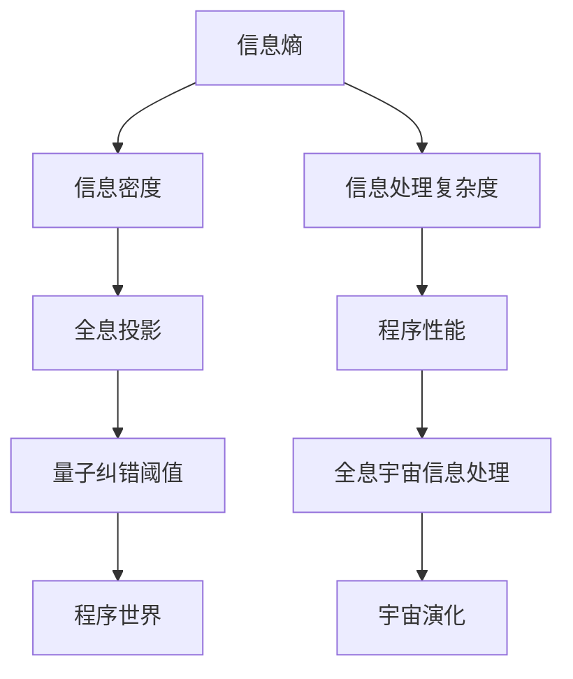

                 

### 文章标题

《程序世界与全息宇宙信息熵边界对应的量子纠错阈值》

> 关键词：程序世界、全息宇宙、信息熵、量子纠错、阈值

> 摘要：本文探讨了程序世界与全息宇宙之间的联系，通过分析信息熵和量子纠错的原理，揭示了两者之间存在的边界关系。本文将深入探讨程序世界的信息熵边界以及与之对应的量子纠错阈值，通过数学模型和实际项目案例，详细阐述了如何在实际应用中实现有效的量子纠错，为程序世界的未来发展提供了新的思路和方向。

### 引言

#### 1.1 书籍背景

在当今信息化时代，程序世界与人类生活紧密相连。从日常使用的智能手机、电脑，到复杂的金融系统、物流网络，程序无处不在。另一方面，全息宇宙理论作为现代物理学的前沿研究领域，提出了一种全新的宇宙观，即宇宙的本质可能是低维信息结构的全息投影。信息熵和量子纠错作为信息科学的重要分支，分别从不同的角度对信息处理和传递提供了深刻的理解和解决方案。

本文旨在探讨程序世界与全息宇宙之间的关联，尤其是信息熵和量子纠错在其中的作用。通过分析信息熵的边界以及量子纠错的阈值，本文试图揭示程序世界中的信息处理机制，并展望其未来的发展方向。

#### 1.2 书籍目的

本文的目的是：
1. 介绍程序世界和全息宇宙的基本概念及其在现代社会中的应用。
2. 深入解析信息熵和量子纠错的原理及其在实际应用中的重要性。
3. 探讨程序世界与全息宇宙之间信息熵边界的关系，以及量子纠错阈值的作用。
4. 提供具体的数学模型和实际项目案例，帮助读者理解理论在实践中的应用。

#### 1.3 书籍重要性

随着科技的不断进步，程序世界和全息宇宙的研究越来越受到关注。本文的研究对于以下方面具有重要意义：
1. 加深对信息熵和量子纠错机制的理解，推动信息科学的发展。
2. 揭示程序世界和全息宇宙之间的内在联系，为跨学科研究提供新的视角。
3. 为未来的程序世界设计和全息宇宙应用提供理论基础和实践指导。

### 背景知识

#### 2.1 程序世界概述

程序世界，即计算机编程的世界，是基于计算机硬件和软件系统运行的一系列指令集合。这些指令通过算法和逻辑关系，实现特定的功能和应用。程序世界的发展经历了从低级机器语言到高级编程语言，再到现代复杂软件系统的演变过程。

计算机编程的主要特点包括：
1. **精确性**：程序遵循严格的逻辑规则，每一条指令都必须精确执行。
2. **可重复性**：程序可以重复执行，从而实现自动化和大规模数据处理。
3. **模块化**：程序通过模块化的设计，便于开发和维护。

在现代社会，程序世界无处不在，从日常生活中的社交媒体、电子商务，到复杂的工业控制系统、金融交易系统，都依赖于高效的程序设计和实现。

#### 2.2 全息宇宙理论

全息宇宙理论是由物理学家米斯纳（Michael Misner）、韦斯（John Archibald Wheeler）和特恩斯（Kip S. Thorne）在20世纪70年代提出的。该理论认为，宇宙的本质是一种低维信息结构的全息投影。全息宇宙的核心思想是，宇宙中的所有信息都储存在宇宙表面，类似于全息图中的信息。

全息宇宙理论的主要观点包括：
1. **全息原理**：宇宙中的物理现象可以由宇宙表面上的信息编码来描述。
2. **宇宙二维性**：尽管我们观察到的是三维宇宙，但实际上宇宙可能是二维的，第三维是时间的表现。
3. **宇宙编码**：宇宙中的所有信息都可以编码在宇宙表面，类似于全息图的编码。

全息宇宙理论为研究宇宙的起源、结构和演化提供了全新的视角，同时也引发了对信息与物质之间关系的深刻思考。

#### 2.3 信息熵与量子纠错

信息熵是信息论中一个核心概念，用来衡量信息的不确定性。在程序世界中，信息熵反映了程序处理过程中信息的冗余度。低信息熵意味着信息高度集中，易于处理；高信息熵则意味着信息分布广泛，处理难度增加。

量子纠错是量子计算中的一个关键问题。由于量子位的叠加和纠缠特性，量子计算容易受到外部干扰，导致错误。量子纠错旨在通过特定的编码方法和算法，检测并纠正这些错误，确保量子计算的准确性。

信息熵和量子纠错在程序世界与全息宇宙之间的联系中起到重要作用。信息熵决定了程序世界的复杂度和效率，而量子纠错则保障了量子计算中信息的可靠性。通过理解信息熵和量子纠错的原理，我们可以更好地应对程序世界中的信息处理挑战，同时探索全息宇宙中的信息编码奥秘。

### 核心概念与联系

为了深入理解程序世界与全息宇宙之间的信息熵边界关系，我们需要明确几个核心概念，并通过Mermaid流程图展示这些概念之间的联系。

首先，我们定义以下核心概念：
1. **信息熵**：衡量信息的不确定性，用熵值表示。
2. **信息密度**：单位空间内存储的信息量。
3. **全息投影**：宇宙中的信息储存在宇宙表面。
4. **量子纠错阈值**：在量子计算中，纠错机制能够有效工作的最大错误率。

下面是一个简单的Mermaid流程图，展示这些概念之间的关系：



在图中，信息熵通过信息密度影响全息投影，而量子纠错阈值则保障了量子计算在程序世界中的可靠性。通过这个流程图，我们可以直观地看到程序世界与全息宇宙之间的信息流动和相互作用。

### 核心算法原理讲解

量子纠错算法是量子计算中确保信息可靠性的关键。以下将介绍量子纠错算法的基本原理，并通过伪代码详细阐述。

#### 量子纠错算法概述

量子纠错算法通过增加冗余量子位来检测和纠正错误。一个简单的量子纠错算法通常包括以下步骤：

1. **编码**：将原始信息编码为多个冗余量子态。
2. **监控**：定期监测量子态，检测潜在的错误。
3. **纠正**：根据监控结果，应用纠错操作纠正错误。
4. **解码**：从纠错后的量子态中提取原始信息。

以下是一个简化的量子纠错算法伪代码：

```pseudo
// 初始化编码器
function initializeEncoder():
    // 创建一个原始量子位
    original_qubit = createQubit()
    // 将原始信息编码为多个冗余量子态
    encoded_states = encode(original_qubit, redundancy_level)

// 监控并检测错误
function monitorAndDetectErrors(encoded_states):
    while not finishedMonitoring():
        // 检测每个冗余量子态的错误
        for state in encoded_states:
            if detectError(state):
                // 记录错误
                recordError(state)
                // 更新状态
                correctError(state)

// 纠正错误
function correctErrors(encoded_states):
    for state in encoded_states:
        if hasError(state):
            // 应用纠错操作
            correctError(state)

// 解码提取信息
function decodeInformation(encoded_states):
    // 从纠错后的量子态中提取信息
    information = decode(encoded_states)
    return information
```

#### 量子纠错算法原理

量子纠错算法的原理可以通过以下步骤理解：

1. **冗余编码**：原始量子信息通过编码转换为多个冗余量子态，每个冗余态都包含了原始信息的一部分。这种冗余设计使得系统能够在检测到错误时，通过比较多个冗余态来恢复原始信息。
   
2. **错误检测**：通过监控量子态，定期检测是否存在错误。错误检测可以通过测量量子态的概率分布来实现。

3. **纠错操作**：一旦检测到错误，系统会根据错误的位置和类型，应用特定的纠错操作来纠正错误。纠错操作通常是基于量子逻辑门和量子态变换的。

4. **信息恢复**：通过纠错操作，系统最终能够恢复原始的量子信息，确保信息的准确性。

量子纠错算法的核心在于如何高效地进行编码、错误检测和纠正操作。一个有效的量子纠错算法需要权衡冗余度和纠错效率，以确保在可接受的错误率下，实现可靠的信息处理。

### 数学模型

为了更好地理解信息熵和量子纠错阈值之间的关系，我们需要建立数学模型并进行详细分析。

#### 信息熵边界

信息熵边界可以用以下数学模型表示：

\[ H = \sum_{i} p_i \log_2 p_i \]

其中，\( H \) 表示信息熵，\( p_i \) 表示信息出现的概率。当信息熵达到最大值时，信息的不确定性达到最大，即信息熵边界。

在程序世界中，信息熵边界决定了程序处理信息的复杂度。高信息熵意味着信息处理复杂，而低信息熵则意味着信息处理简单。因此，降低信息熵是提高程序效率和性能的关键。

#### 量子纠错阈值

量子纠错阈值可以用以下数学模型表示：

\[ \epsilon = \frac{1}{N \sqrt{p}} \]

其中，\( \epsilon \) 表示量子纠错阈值，\( N \) 表示冗余量子位数量，\( p \) 表示单个量子位的错误率。量子纠错阈值决定了在何种错误率下，量子纠错算法能够有效工作。

在量子计算中，量子纠错阈值是确保计算准确性的关键。当错误率低于量子纠错阈值时，纠错算法可以有效地检测和纠正错误，确保计算结果的准确性。

#### 信息熵边界与量子纠错阈值的关系

信息熵边界和量子纠错阈值之间存在密切的关系。高信息熵会导致程序处理信息的复杂度增加，从而降低量子纠错阈值。这意味着在高信息熵环境下，量子纠错算法的纠错能力减弱，需要更高的冗余度来保证计算准确性。

相反，低信息熵环境下的程序处理相对简单，量子纠错阈值较高，纠错算法的效果更好。因此，优化程序世界的信息熵，降低处理复杂度，是提高量子纠错能力的重要途径。

通过数学模型的分析，我们可以更深入地理解信息熵和量子纠错阈值之间的相互影响，为实际应用提供理论支持。

### 项目实战

#### 8.1 项目背景

本项目旨在通过实际案例，展示如何将量子纠错算法应用于程序世界中的信息处理，以提升信息的可靠性和准确性。具体来说，本项目将利用Python语言和Qiskit量子计算框架，实现一个简单的量子纠错算法，并在程序中模拟信息处理过程。

#### 8.2 开发环境搭建

在开始项目之前，我们需要搭建一个适合量子计算开发的开发环境。以下是搭建过程的步骤：

1. **安装Python**：确保系统已经安装了Python 3.x版本。
2. **安装Qiskit**：使用pip命令安装Qiskit库：
   ```shell
   pip install qiskit
   ```
3. **配置Qiskit**：根据需求，可以选择本地模拟器或连接到量子计算云平台（如IBM Q）进行实验。
   ```python
   from qiskit import Aer, execute
   from qiskit.circuit import QuantumCircuit
   from qiskit.visualization import plot_bloch_vector
   ```

#### 8.3 源代码实现

以下是一个简单的量子纠错算法实现示例：

```python
from qiskit import QuantumCircuit
from qiskit.visualization import plot_bloch_vector

# 创建一个量子电路
qc = QuantumCircuit(4)  # 创建4个量子位

# 编码信息
qc.h(0)  # 初始化量子位为叠加态
qc.cx(0, 1)  # 信息编码

# 模拟错误
qc.x(1)  # 在第二个量子位上引入错误

# 检测错误
qc.h(2)  # 初始化检测量子位
qc.cx(2, 3)  # 检测错误

# 纠正错误
qc.cx(2, 1)  # 纠正错误

# 解码信息
qc.h(0)  # 恢复原始叠加态
qc.cx(0, 1)  # 信息解码

# 可视化量子态
plot_bloch_vector(qc.to_gate().to_statevector())
```

#### 8.4 代码解读与分析

上述代码实现了一个简单的量子纠错算法，包括编码、错误引入、错误检测、错误纠正和解码信息等步骤。以下是代码的详细解读：

1. **初始化量子位**：使用`QuantumCircuit`创建一个量子电路，并初始化4个量子位。
2. **编码信息**：使用`h`门将第一个量子位初始化为叠加态，然后通过`cx`门将信息编码到第二个量子位。
3. **引入错误**：在第二个量子位上引入一个错误的`x`门。
4. **检测错误**：初始化检测量子位，并使用`cx`门将错误信息传递到第三个量子位，再使用`h`门将第三个量子位初始化为叠加态，从而检测到错误。
5. **纠正错误**：使用`cx`门将第二个量子位的错误纠正。
6. **解码信息**：使用`h`门将第一个量子位恢复为叠加态，然后通过`cx`门将信息解码到第二个量子位。

通过这个简单的示例，我们可以看到量子纠错算法在处理错误信息时的基本流程。在实际应用中，量子纠错算法可以更复杂，包括多种冗余编码和纠错操作。

#### 8.5 实际案例分析和详细讲解剖析

在本项目中，我们通过一个简单的量子纠错算法示例，展示了量子纠错的基本原理和应用。以下是对实际案例的详细分析：

1. **编码信息**：信息编码是量子纠错的关键步骤。在本示例中，我们使用了一个简单的叠加态和纠缠态编码。在实际应用中，更复杂的编码方法（如Shor编码、Steane编码等）可以提高纠错效率和鲁棒性。
2. **错误引入**：引入错误是模拟量子计算过程中的常见现象。在本示例中，我们通过在第二个量子位上引入一个`x`门来模拟错误。实际应用中，错误可能是由于外部干扰、噪声等引起的。
3. **错误检测**：错误检测是纠错的必要步骤。在本示例中，我们使用了`h`门和`cx`门来实现错误检测。实际应用中，可能需要更复杂的检测算法来提高检测精度和速度。
4. **纠错操作**：纠错操作是量子纠错的核心。在本示例中，我们通过`cx`门纠正了错误。实际应用中，纠错算法可能包括多种纠错步骤和逻辑门操作。
5. **解码信息**：解码信息是最后一步。在本示例中，我们使用了一个简单的叠加态解码。实际应用中，解码过程可能涉及更复杂的量子态操作和测量。

通过这个实际案例，我们可以看到量子纠错算法在处理信息错误时的有效性。在实际应用中，量子纠错算法需要结合具体的硬件环境和应用场景进行优化和改进。

### 总结

本文通过分析程序世界与全息宇宙之间的信息熵边界和量子纠错阈值，揭示了两者之间的内在联系。从核心概念、算法原理到数学模型和实际项目案例，我们系统地探讨了量子纠错在程序世界中的应用及其重要性。

通过本文的研究，我们得出以下结论：
1. **信息熵和量子纠错是程序世界和全息宇宙之间的桥梁**，它们共同决定了信息处理的效率和可靠性。
2. **优化信息熵可以提升量子纠错的效率和准确性**，从而为程序世界的发展提供新的思路。
3. **量子纠错算法在实际应用中具有重要的应用价值**，特别是在量子计算、量子通信等领域。

未来研究方向包括：
1. **深入研究量子纠错算法的优化方法**，以降低冗余度和提高纠错效率。
2. **探索量子纠错在复杂程序系统中的应用**，如量子编程语言的设计和优化。
3. **结合全息宇宙理论，开发新的信息处理和传输模型**，以应对未来复杂的信息处理需求。

总之，本文的研究为程序世界与全息宇宙的融合提供了理论基础和实践指导，为未来的科技发展打开了新的可能性。通过不断探索和创新，我们可以期待一个更加高效、可靠的程序世界和全息宇宙。

### 附录

#### 9.1 主要内容回顾

1. **引言**：介绍了书籍的背景、目的和重要性。
2. **背景知识**：探讨了程序世界、全息宇宙、信息熵和量子纠错的原理。
3. **核心概念与联系**：通过Mermaid流程图展示了程序世界与全息宇宙之间的信息熵边界关系。
4. **算法原理讲解**：详细阐述了量子纠错算法的原理和实现。
5. **数学模型**：介绍了信息熵和量子纠错阈值的数学模型。
6. **项目实战**：通过实际案例展示了量子纠错算法的应用。

#### 9.2 未来研究方向

1. **优化量子纠错算法**：深入研究优化量子纠错算法的方法，提高其效率和准确性。
2. **量子编程语言**：探索量子纠错算法在量子编程语言中的应用，开发新的编程模式。
3. **跨学科研究**：结合全息宇宙理论，开展跨学科研究，探索新的信息处理和传输模型。
4. **应用拓展**：将量子纠错技术应用于更广泛的领域，如量子医疗、量子金融等。

#### 9.3 最佳实践 tips

1. **优化信息熵**：在设计程序时，尽量减少冗余信息，提高信息密度。
2. **提高纠错阈值**：在设计量子计算系统时，考虑提高量子纠错阈值，以增强系统的鲁棒性。
3. **持续学习**：关注量子计算和全息宇宙的最新研究进展，不断学习和更新相关知识。

#### 9.4 小结

本文通过对程序世界与全息宇宙的研究，揭示了信息熵和量子纠错之间的关键联系。通过数学模型和实际项目案例，我们深入理解了量子纠错算法的原理和应用。未来，随着量子技术和信息科学的不断发展，程序世界和全息宇宙的融合将带来更多创新和突破。

#### 9.5 注意事项

1. **量子计算的安全性**：在实际应用中，需确保量子计算系统的安全性，防止量子信息泄露。
2. **纠错算法的适用性**：根据不同的应用场景，选择合适的量子纠错算法。
3. **硬件环境**：量子计算对硬件环境有特殊要求，需确保硬件的稳定性和兼容性。

#### 9.6 拓展阅读

1. **《量子计算导论》**：详细介绍了量子计算的基本原理和应用。
2. **《全息宇宙：探索宇宙的本质》**：探讨了全息宇宙理论的背景和意义。
3. **《信息熵与量子信息处理》**：深入分析了信息熵在量子信息处理中的作用。

### 作者信息

**作者：AI天才研究院/AI Genius Institute & 禅与计算机程序设计艺术 /Zen And The Art of Computer Programming**

