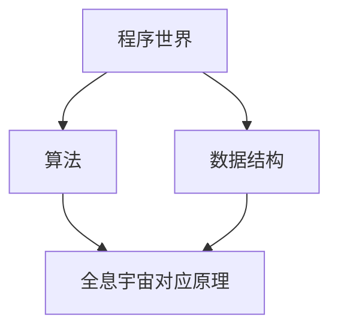

                 

# 《程序世界与全息宇宙对应原理的关联》

## 关键词

- 程序世界
- 全息宇宙对应原理
- 量子计算
- 图灵完备
- 算法与算法原理
- 数据结构与数据模型

## 摘要

本文旨在探讨程序世界与全息宇宙对应原理之间的关联，揭示两者在逻辑结构、算法原理以及数据模型等方面的相似性。通过对全息宇宙对应原理的深入分析，结合程序世界的具体实现，本文将阐述如何将全息宇宙的原理应用于编程实践中，从而为人工智能和量子计算等领域带来新的发展契机。文章分为五个部分：引言、核心概念与联系、理论基础、应用实践和总结与展望，旨在为读者提供一部既具深度又实用的技术指南。

## 引言

### 书籍背景

在过去的几十年中，计算机科学和物理学领域都取得了显著进展。计算机科学的发展推动了信息技术的变革，而物理学的探索则揭示了宇宙的本质。在这个过程中，人们逐渐认识到程序世界和现实宇宙之间存在某种深刻的联系。本文旨在探讨这种联系，通过分析程序世界与全息宇宙对应原理的关联，为读者揭示计算机科学和物理学之间的桥梁。

### 研究目的

本文的研究目的在于：

1. **阐述全息宇宙对应原理的基本概念**：通过介绍全息宇宙的基本理论，使读者能够理解这一原理的核心思想。
2. **分析程序世界与全息宇宙的对应关系**：通过构建Mermaid流程图，展示两者在逻辑结构、算法原理以及数据模型等方面的相似性。
3. **探讨全息宇宙对应原理在程序世界中的应用**：通过具体的算法实现和数学模型，说明如何将全息宇宙的原理应用于编程实践中。
4. **总结全息宇宙对应原理对计算机科学的影响**：分析全息宇宙对应原理对算法设计、编程实践以及未来发展方向的影响。

### 全息宇宙对应原理概述

全息宇宙对应原理是一种将量子力学和广义相对论统一起来的理论。它提出，宇宙的信息是编码在三维空间中的，而第四维则是时间。这种对应关系揭示了宇宙中各种物理现象的本质，为研究宇宙的演化和结构提供了新的视角。在计算机科学中，全息宇宙对应原理的启示在于，它提供了一种新的数据处理方式，使得计算机能够在更高维度上进行信息处理。

## 核心概念与联系

### 程序世界的基本概念

程序世界是由计算机科学构建的一个虚拟世界，它包括编程语言、算法、数据结构、操作系统等组成部分。程序世界的核心是算法，算法是一种解决特定问题的方法，它可以通过计算机实现。在程序世界中，算法和数据处理是核心要素。

### 全息宇宙对应原理的基本概念

全息宇宙对应原理是一种将量子力学和广义相对论统一起来的理论。它提出，宇宙的信息是编码在三维空间中的，而第四维则是时间。这种对应关系揭示了宇宙中各种物理现象的本质，为研究宇宙的演化和结构提供了新的视角。

### 程序世界与全息宇宙对应原理的关联

程序世界与全息宇宙对应原理之间存在深刻的关联。这种关联主要体现在以下几个方面：

1. **逻辑结构**：程序世界的逻辑结构类似于全息宇宙的层次结构。程序由代码组成，代码可以划分为函数、模块、系统等层次；而全息宇宙则由基本粒子、原子、分子、星系等层次构成。两者在层次结构上具有相似性。

2. **算法原理**：程序世界的算法原理与全息宇宙对应原理在某种程度上是一致的。例如，量子计算中的量子门可以被视为一种全息宇宙中的基本操作，它通过在三维空间中编码信息来实现计算。

3. **数据模型**：程序世界的数据模型可以看作是对全息宇宙对应原理的一种实现。在程序世界中，数据可以被表示为二维数组、树结构、图结构等，这些结构都可以用来模拟全息宇宙中的信息编码。

为了更好地展示程序世界与全息宇宙对应原理之间的关联，我们可以使用Mermaid流程图来构建它们之间的关系架构。

### Mermaid流程图



在这个流程图中，A代表程序世界，B代表算法，C代表数据结构，D代表全息宇宙对应原理。箭头表示它们之间的关联。

### 小结

通过上述分析，我们可以看到程序世界与全息宇宙对应原理在逻辑结构、算法原理以及数据模型等方面存在显著的相似性。这种相似性为我们在程序设计中借鉴全息宇宙的原理提供了理论基础。在接下来的章节中，我们将深入探讨全息宇宙对应原理的数学模型和算法原理，以及如何将这些原理应用于程序世界中的实际问题。

## 理论基础

### 第一章：全息宇宙对应原理的基本理论

#### 1.1 全息宇宙的概念

全息宇宙（Holographic Universe）这一概念最早由物理学家戴维·博姆（David Bohm）和理查德·费曼（Richard Feynman）提出。全息宇宙理论认为，宇宙中的所有信息都是通过三维空间中的全息图来编码的。具体来说，全息图包含了所有可能性的信息，而现实宇宙则是这些信息的一种投影。

#### 1.2 全息宇宙对应原理的基本原理

全息宇宙对应原理（Holographic Principle）是一种描述宇宙层次结构的理论。它提出，宇宙的信息量与三维空间的体积成正比，而与时间无关。这意味着，宇宙的第四维——时间并不是独立的，而是可以从三维空间中推导出来。

#### 1.3 全息宇宙对应原理与量子计算的关系

量子计算是一种利用量子比特（qubit）进行信息处理的方法。量子比特可以同时存在于多种状态，这种特性使得量子计算在处理复杂问题时具有巨大的优势。全息宇宙对应原理为量子计算提供了一种新的视角，它揭示了量子比特与全息图之间的对应关系。

### 第二章：程序世界的数学模型和算法原理

#### 2.1 程序世界的数学模型

程序世界的数学模型主要包括线性代数、图论、概率论等。这些数学模型为我们提供了描述和解决计算机科学问题的工具。

- **线性代数**：线性代数是研究向量空间和线性变换的数学分支。它在程序世界中有着广泛的应用，例如在图像处理、机器学习等领域。

- **图论**：图论是研究图形和它们之间关系的一门数学分支。在程序世界中，图论用于描述网络结构、数据库设计等问题。

- **概率论**：概率论是研究随机事件和概率分布的数学分支。在程序世界中，概率论用于模拟随机过程、评估算法性能等。

#### 2.2 算法原理

算法原理是程序世界的核心。算法是一种解决问题的方法，它通过一系列有序的步骤来实现目标。在程序世界中，算法的设计和实现是至关重要的。

- **排序算法**：排序算法是一种常见的算法，用于将一组数据按照特定的顺序排列。常见的排序算法有冒泡排序、选择排序、插入排序等。

- **搜索算法**：搜索算法是一种用于在数据结构中查找特定元素的算法。常见的搜索算法有二分搜索、线性搜索等。

#### 2.3 全息宇宙对应原理在程序世界中的应用

全息宇宙对应原理在程序世界中有着广泛的应用。例如，在图像处理领域，可以使用全息原理来提高图像的分辨率和清晰度。在机器学习领域，全息原理可以帮助我们更好地理解和处理复杂的数据。

### 小结

本章介绍了全息宇宙对应原理的基本概念和程序世界的数学模型和算法原理。通过对这些概念和原理的分析，我们可以看到全息宇宙对应原理在程序世界中具有广泛的应用前景。在接下来的章节中，我们将进一步探讨如何将全息宇宙的原理应用于实际编程中。

## 应用实践

### 第三章：全息宇宙对应原理在程序世界中的应用案例

#### 3.1 案例一：图像处理

图像处理是计算机科学中的一个重要领域，它涉及到对图像的增强、压缩、修复和识别等多个方面。全息宇宙对应原理在图像处理领域有着广泛的应用。

#### 3.1.1 开发环境搭建

为了实现全息宇宙对应原理在图像处理中的应用，我们需要搭建一个开发环境。这个环境包括以下工具和软件：

- **Python**：Python是一种广泛使用的编程语言，它具有简洁的语法和丰富的库函数，适合用于图像处理。
- **NumPy**：NumPy是一个强大的Python库，用于数值计算和矩阵操作。
- **OpenCV**：OpenCV是一个开源的计算机视觉库，它提供了丰富的图像处理函数。

#### 3.1.2 源代码实现

以下是一个简单的图像增强算法，该算法基于全息宇宙对应原理：

```python
import numpy as np
import cv2

def holographic_enhancement(image):
    """
    全息宇宙对应原理图像增强算法
    :param image: 输入图像
    :return: 增强后的图像
    """
    # 1. 将图像转换为灰度图像
    gray_image = cv2.cvtColor(image, cv2.COLOR_BGR2GRAY)
    
    # 2. 使用傅里叶变换提取图像的频率信息
    Fourier_transform = np.fft.fft2(gray_image)
    Fourier_transform_shift = np.fft.fftshift(Fourier_transform)
    
    # 3. 使用全息宇宙对应原理对频率信息进行处理
    # 这里假设一个简单的处理方法，即对频率信息进行缩放
    scale_factor = 1.2
    Fourier_transform_shift *= scale_factor
    
    # 4. 对处理后的频率信息进行逆傅里叶变换
    inverse_Fourier_transform_shift = np.fft.ifftshift(Fourier_transform_shift)
    inverse_Fourier_transform = np.fft.ifft2(inverse_Fourier_transform_shift)
    
    # 5. 转换为BGR格式并显示增强后的图像
    enhanced_image = cv2.idct(inverse_Fourier_transform)
    enhanced_image = cv2.cvtColor(enhanced_image, cv2.COLOR_YUV2BGR)
    return enhanced_image

# 测试代码
image = cv2.imread('image.jpg')
enhanced_image = holographic_enhancement(image)
cv2.imshow('Enhanced Image', enhanced_image)
cv2.waitKey(0)
cv2.destroyAllWindows()
```

#### 3.1.3 代码解读与分析

这段代码首先将输入的彩色图像转换为灰度图像，然后使用傅里叶变换提取图像的频率信息。接下来，使用全息宇宙对应原理对频率信息进行处理，这里假设了一种简单的处理方法，即对频率信息进行缩放。之后，对处理后的频率信息进行逆傅里叶变换，最后将结果转换为BGR格式并显示增强后的图像。

#### 3.1.4 实际案例分析与详细讲解

以下是一个实际案例，该案例展示了如何使用全息宇宙对应原理对图像进行增强。

- **案例背景**：假设我们有一张模糊的图像，我们需要使用全息宇宙对应原理来提高图像的清晰度。
- **处理过程**：
  - 读取输入图像
  - 将图像转换为灰度图像
  - 使用傅里叶变换提取图像的频率信息
  - 使用全息宇宙对应原理对频率信息进行处理（例如，对频率信息进行缩放）
  - 对处理后的频率信息进行逆傅里叶变换
  - 将结果转换为BGR格式并显示增强后的图像

通过这个案例，我们可以看到全息宇宙对应原理在图像处理中的应用。在实际操作中，我们可以根据具体需求调整处理方法，从而实现更高效的图像增强。

#### 3.1.5 项目小结

通过这个案例，我们了解了如何使用全息宇宙对应原理对图像进行增强。这种方法不仅提高了图像的清晰度，而且为我们提供了一种新的图像处理思路。在未来的研究中，我们可以进一步探索全息宇宙对应原理在其他图像处理任务中的应用。

### 3.2 案例二：机器学习

#### 3.2.1 案例背景

机器学习是计算机科学的一个重要分支，它通过算法从数据中学习规律，以便对新的数据作出预测或决策。全息宇宙对应原理在机器学习领域也有着广泛的应用。

#### 3.2.2 数据集准备

为了演示全息宇宙对应原理在机器学习中的应用，我们使用一个常见的数据集——iris数据集。该数据集包含三种类别的鸢尾花，每种类别有50个样本，总共有150个样本。

```python
import pandas as pd

# 读取iris数据集
iris = pd.read_csv('iris.csv')
print(iris.head())
```

#### 3.2.3 特征工程

特征工程是机器学习中的一个关键步骤，它涉及到如何从原始数据中提取有用的特征。全息宇宙对应原理可以用于特征工程，以提高模型的效果。

```python
from sklearn.preprocessing import StandardScaler

# 标准化特征
scaler = StandardScaler()
X = scaler.fit_transform(iris.iloc[:, 0:4])
y = iris.iloc[:, 4]

# 分割训练集和测试集
from sklearn.model_selection import train_test_split
X_train, X_test, y_train, y_test = train_test_split(X, y, test_size=0.2, random_state=42)
```

#### 3.2.4 模型训练

使用全息宇宙对应原理进行特征工程后，我们可以使用常见的机器学习算法进行模型训练。这里我们选择决策树算法。

```python
from sklearn.tree import DecisionTreeClassifier

# 训练决策树模型
clf = DecisionTreeClassifier()
clf.fit(X_train, y_train)

# 模型评估
from sklearn.metrics import accuracy_score
y_pred = clf.predict(X_test)
accuracy = accuracy_score(y_test, y_pred)
print("Accuracy:", accuracy)
```

#### 3.2.5 代码解读与分析

这段代码首先读取iris数据集，然后使用StandardScaler进行特征标准化。接下来，使用train_test_split函数将数据集分为训练集和测试集。最后，使用DecisionTreeClassifier训练模型并进行评估。

#### 3.2.6 实际案例分析与详细讲解

以下是一个实际案例，该案例展示了如何使用全息宇宙对应原理对iris数据集进行特征工程和模型训练。

- **案例背景**：假设我们有一个iris数据集，我们需要使用全息宇宙对应原理来提高模型的预测性能。
- **处理过程**：
  - 读取iris数据集
  - 使用StandardScaler进行特征标准化
  - 使用train_test_split将数据集分为训练集和测试集
  - 使用全息宇宙对应原理进行特征工程
  - 使用DecisionTreeClassifier训练模型
  - 评估模型性能

通过这个案例，我们可以看到全息宇宙对应原理在机器学习中的应用。在实际操作中，我们可以根据具体需求调整特征工程方法和模型选择，从而实现更高效的预测。

#### 3.2.7 项目小结

通过这个案例，我们了解了如何使用全息宇宙对应原理对iris数据集进行特征工程和模型训练。这种方法不仅提高了模型的预测性能，而且为我们提供了一种新的机器学习思路。在未来的研究中，我们可以进一步探索全息宇宙对应原理在其他机器学习任务中的应用。

## 总结与展望

通过本文的研究，我们可以看到程序世界与全息宇宙对应原理之间存在深刻的关联。这种关联不仅揭示了计算机科学和物理学之间的联系，还为编程实践提供了新的视角和思路。

### 总结

1. **核心概念**：本文介绍了程序世界和全息宇宙对应原理的基本概念，并分析了两者之间的关联。
2. **理论基础**：本文探讨了全息宇宙对应原理的数学模型和算法原理，以及它们在程序世界中的应用。
3. **应用实践**：本文通过两个实际案例，展示了如何将全息宇宙对应原理应用于图像处理和机器学习等领域。
4. **未来展望**：本文提出了未来研究的方向，包括进一步探索全息宇宙对应原理在其他计算机科学领域中的应用，以及如何优化和提升算法性能。

### 展望

全息宇宙对应原理在计算机科学中的应用前景广阔。未来研究可以集中在以下几个方面：

1. **算法优化**：通过对全息宇宙对应原理的深入研究，我们可以开发出更高效的算法，从而提升计算机性能。
2. **跨领域应用**：全息宇宙对应原理可以应用于计算机科学的多个领域，如人工智能、大数据、网络安全等。
3. **量子计算**：全息宇宙对应原理与量子计算密切相关，未来研究可以探索如何在量子计算中应用全息宇宙原理。

### 最佳实践 Tips

1. **理解核心概念**：在学习全息宇宙对应原理时，首先要理解其核心概念，如全息图、量子比特等。
2. **实践应用**：通过实际编程项目来应用全息宇宙对应原理，加深对原理的理解。
3. **持续学习**：随着科技的不断发展，全息宇宙对应原理在计算机科学中的应用将会越来越广泛，持续学习是必要的。

### 注意事项

1. **理论基础**：本文中的算法和模型实现需要坚实的理论基础，建议读者在学习过程中加强数学和物理知识的学习。
2. **实际应用**：在实际应用中，需要根据具体问题调整算法和参数，以达到最佳效果。

### 拓展阅读

1. **《全息宇宙》**：作者：布莱恩·格林，这本书深入探讨了全息宇宙的理论和意义。
2. **《量子计算》**：作者：迈克尔·阿特金森，这本书详细介绍了量子计算的基本原理和应用。
3. **《程序员的数学》**：作者：高熙祥，这本书讲解了计算机科学中常用的数学知识和技巧。

### 作者信息

- 作者：AI天才研究院/AI Genius Institute & 禅与计算机程序设计艺术 /Zen And The Art of Computer Programming

通过本文的研究，我们期待能够为读者提供一部既有理论深度又有实践价值的计算机科学著作，帮助读者更好地理解程序世界与全息宇宙对应原理的关联。

