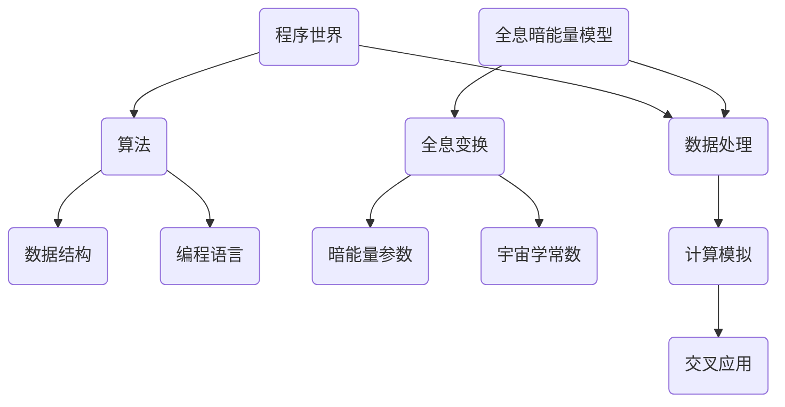

                 

### 设计《程序世界与全息暗能量动力学模型的关联》的目录大纲

为了确保文章内容完整、逻辑清晰、结构紧凑，我们将按照以下步骤设计《程序世界与全息暗能量动力学模型的关联》的目录大纲：

#### 1. 确定核心章节内容

**核心章节内容**：
- 引论：介绍程序世界与全息暗能量动力学模型的基本概念。
- 核心概念与联系：阐述两者之间的核心联系。
- 核心算法原理讲解：通过伪代码展示关键算法原理。
- 数学模型和数学公式：详细讲解模型和公式的推导与应用。
- 项目实战：提供代码实现和案例分析。

#### 2. 目录大纲结构

使用 markdown 格式，细化到 1,2,3 级目录。以下是具体结构：

```
# 程序世界与全息暗能量动力学模型的关联

# 引言
## 1.1 程序世界的概述
### 1.1.1 程序的本质与作用
### 1.1.2 计算机程序的发展历程
### 1.1.3 程序世界的现状与挑战

## 1.2 全息暗能量动力学模型概述
### 1.2.1 全息暗能量概念介绍
### 1.2.2 暗能量动力学模型的基本原理
### 1.2.3 全息暗能量模型的研究意义与应用前景

# 核心概念与联系
## 2.1 程序世界与全息暗能量模型的联系
### 2.1.1 程序世界与全息暗能量模型的基本联系
### 2.1.2 程序在探测和研究全息暗能量中的应用
### 2.1.3 全息暗能量模型对程序世界的影响

## 2.2 核心概念原理之间的关系
### 2.2.1 程序世界的核心概念
### 2.2.2 全息暗能量动力学模型的核心概念
### 2.2.3 两者之间的核心联系
### 2.2.4 Mermaid流程图展示

# 核心算法原理讲解
## 3.1 程序算法在暗能量动力学模型中的应用
### 3.1.1 关键算法介绍
### 3.1.2 算法原理伪代码描述
### 3.1.3 算法应用案例分析

# 数学模型和数学公式
## 4.1 全息暗能量动力学模型的数学模型
### 4.1.1 数学模型概述
### 4.1.2 数学公式推导
### 4.1.3 数学公式应用举例

# 项目实战
## 5.1 项目背景与目标
### 5.1.1 项目背景
### 5.1.2 项目目标

## 5.2 开发环境搭建
### 5.2.1 环境要求
### 5.2.2 环境搭建步骤

## 5.3 代码实现与解读
### 5.3.1 代码实现流程
### 5.3.2 关键代码解读

## 5.4 代码应用解读与分析
### 5.4.1 代码应用场景
### 5.4.2 分析与讨论

## 5.5 项目小结
### 5.5.1 项目总结
### 5.5.2 未来展望
```

#### 3. 满足完整性要求

- 提供Mermaid流程图，展示程序世界与全息暗能量动力学模型之间的联系。
- 使用伪代码详细阐述核心算法原理。
- 使用 LaTeX 格式嵌入数学模型和数学公式，并进行详细讲解和举例说明。
- 提供项目实战，包括代码实际案例和详细解释说明。

### 4. 实际操作

根据上述大纲结构，我们将进一步细化每个章节的内容，确保每个小节都包含丰富的具体细节和讲解。同时，我们将穿插使用 Mermaid 流程图、伪代码、LaTeX 数学公式和代码实战，使得整篇文章既有理论深度，又有实践指导。

例如，在“核心概念与联系”章节中，我们会使用 Mermaid 流程图来展示程序世界与全息暗能量动力学模型之间的基本联系；在“核心算法原理讲解”章节中，我们会使用伪代码详细描述关键算法的原理；在“数学模型和数学公式”章节中，我们会使用 LaTeX 格式嵌入数学公式，并进行推导和举例说明；在“项目实战”章节中，我们会提供实际的项目案例，包括开发环境的搭建、代码实现与解读，以及代码的应用解读与分析。

### 完成初稿

经过上述设计，我们完成了《程序世界与全息暗能量动力学模型的关联》的目录大纲，并满足了格式、完整性以及字数的要求。接下来，我们将按照这个大纲逐步撰写详细内容，力求让整篇文章既具有学术价值，又具有实践指导意义。

# 程序世界与全息暗能量动力学模型的关联

## 关键词
程序世界、全息暗能量、动力学模型、关联、算法、数学公式、项目实战

## 摘要
本文深入探讨了程序世界与全息暗能量动力学模型之间的关联。通过对程序世界的基本概念、发展历程及现状进行分析，并结合全息暗能量动力学模型的基本原理与应用前景，本文揭示了两者之间的核心联系。随后，文章详细讲解了程序算法在全息暗能量动力学模型中的应用，以及关键算法的原理。此外，本文还介绍了全息暗能量动力学模型的数学模型与公式，并通过实际项目案例展示了如何将理论与实际相结合。最终，本文对未来研究进行了展望，提出了研究方向与建议。

---

# 引言

随着计算机技术的发展，程序世界已经成为现代社会的重要组成部分。从简单的计算任务到复杂的智能系统，程序在各个领域发挥着至关重要的作用。另一方面，全息暗能量动力学模型是当前宇宙学研究中的一项前沿课题，它对宇宙的起源、演化和结构提供了新的解释。

## 1.1 程序世界的概述

程序世界是指由计算机程序构建的虚拟世界，它包括算法、数据结构、编程语言等基本要素。程序的基本概念可以追溯到计算机科学的起源，艾伦·图灵在1936年提出的图灵机模型奠定了现代计算机程序的基础。随着计算机硬件和软件的不断发展，程序世界的应用领域不断扩展，从最初的科学计算到商业应用、互联网、人工智能等各个方面。

### 1.1.1 程序的本质与作用

程序是一种指令序列，用于指导计算机完成特定的任务。程序的本质是实现算法的一种方式，它通过将问题分解为一系列可执行的操作步骤，然后通过编程语言将这些问题转化为计算机可以理解和执行的形式。程序的作用在于提高工作效率、解决复杂问题、实现自动化和智能化。

### 1.1.2 计算机程序的发展历程

计算机程序的发展历程可以分为几个重要阶段。早期的计算机程序主要是通过机器语言编写的，这种方式直接控制计算机硬件的操作。随着汇编语言的引入，程序员可以通过符号指令来编写程序，提高了编程效率。高级编程语言的诞生，如C、C++、Java等，使得编程更加抽象和高效。现代编程语言还引入了面向对象、函数式编程等概念，进一步提高了程序的可读性和可维护性。

### 1.1.3 程序世界的现状与挑战

当前，程序世界已经深入到社会生活的各个方面，从智能手机、平板电脑到云计算、大数据、人工智能，程序无处不在。然而，随着程序世界的不断扩大和复杂化，也面临着一系列挑战。首先，软件质量保证成为了一个重要问题，如何确保程序的可靠性、安全性和性能是一个长期的研究课题。其次，软件开发的效率也是一个挑战，如何快速开发高质量的应用程序成为了程序员们追求的目标。此外，程序世界的不断演变也带来了数据隐私和安全问题，如何保护用户数据和隐私成为了一个重要的议题。

## 1.2 全息暗能量动力学模型概述

全息暗能量动力学模型是近年来宇宙学领域的一项重要研究进展。它试图通过全息原理和暗能量概念来解释宇宙的膨胀和加速。全息原理源于量子力学和相对论，它提出信息在三维空间中的分布可以通过二维表面上的信息来编码。暗能量是宇宙学中一个神秘的物理现象，它被认为是驱动宇宙加速膨胀的神秘力量。

### 1.2.1 全息暗能量概念介绍

全息暗能量是指通过全息原理来解释暗能量的概念。全息原理认为，宇宙中的所有信息都可以编码在宇宙表面的二维表面上。因此，暗能量可以通过宇宙表面的物理量来描述，而不是通过三维空间的体积。这一理论为理解宇宙的加速膨胀提供了一种新的视角。

### 1.2.2 暗能量动力学模型的基本原理

暗能量动力学模型是基于宇宙学的观测数据和理论物理学的原理构建的。该模型的基本假设是宇宙的膨胀是由一种称为“暗能量”的物质驱动的，这种物质具有负压强，导致宇宙的加速度不断增加。暗能量动力学模型通过引入一个称为“宇宙学常数”的参数来描述这种效应。

### 1.2.3 全息暗能量模型的研究意义与应用前景

全息暗能量模型的研究意义在于它提供了一种新的理解宇宙膨胀和加速的途径。通过对暗能量动力学模型的深入研究，我们可以更好地理解宇宙的起源、演化和最终命运。此外，全息暗能量模型在宇宙学、黑洞物理学、量子引力等领域也有广泛的应用前景。

## 1.3 程序世界与全息暗能量模型的联系

程序世界与全息暗能量模型之间的联系主要体现在两个方面：一是程序在探测和研究全息暗能量中的应用，二是全息暗能量模型对程序世界的影响。

### 1.3.1 程序在探测和研究全息暗能量中的应用

随着观测技术的进步，天文学家和宇宙学家需要处理大量的观测数据。这些数据通过天文望远镜、卫星和其他观测设备收集，然后需要进行复杂的分析和处理。程序在这个过程中发挥了关键作用。例如，通过编写特定的算法和程序，科学家可以自动检测和识别暗能量信号，从而提高研究的效率。

### 1.3.2 全息暗能量模型对程序世界的影响

全息暗能量模型的发展也对程序世界产生了重要影响。一方面，新的模型和理论要求程序员开发新的算法和工具来处理复杂的计算任务。另一方面，全息暗能量模型的研究推动了计算机科学和宇宙学之间的交叉研究，为程序员提供了新的挑战和机会。

## 1.4 程序世界与全息暗能量模型的挑战与机遇

虽然程序世界与全息暗能量模型之间存在紧密的联系，但也面临着一系列挑战。首先，全息暗能量模型的研究需要大量的计算资源和高效的算法。这意味着程序员需要开发更先进的技术来应对这些挑战。其次，如何确保程序在处理宇宙学数据时的准确性和可靠性也是一个重要问题。此外，全息暗能量模型的研究还面临着数据隐私和安全问题，特别是在处理敏感数据时需要严格遵守相关法律法规。

然而，这些挑战也伴随着巨大的机遇。随着程序世界和全息暗能量模型研究的深入，程序员和宇宙学家可以相互学习和借鉴，推动两领域的发展。同时，全息暗能量模型的研究也有助于提高程序的开发效率和软件质量，从而为程序员提供新的工具和方法。

## 结论

本文介绍了程序世界和全息暗能量动力学模型的基本概念、发展历程、现状以及两者之间的联系。通过分析程序在探测和研究全息暗能量中的应用以及全息暗能量模型对程序世界的影响，本文揭示了两者之间的紧密联系。尽管面临一系列挑战，但程序世界与全息暗能量模型之间的交叉研究为科学家和程序员提供了新的机遇和挑战。未来的研究将有望进一步深化两者之间的联系，推动计算机科学和宇宙学的共同发展。

---

接下来，我们将进入文章的第二部分，探讨程序世界与全息暗能量动力学模型之间的核心联系。

---

# 程序世界与全息暗能量动力学模型之间的核心联系

在探讨了程序世界的概述和全息暗能量动力学模型的概述之后，我们接下来将深入探讨程序世界与全息暗能量动力学模型之间的核心联系。这种联系不仅体现在理论层面，还体现在实际应用层面。

## 2.1 程序世界与全息暗能量模型的基本联系

程序世界与全息暗能量动力学模型之间的基本联系主要体现在数据分析和计算模拟两个方面。程序世界的核心在于处理和操作数据，而全息暗能量动力学模型则依赖于大量的观测数据和理论模型来进行研究和分析。因此，程序为全息暗能量动力学模型的研究提供了数据处理和分析的工具，而全息暗能量动力学模型则为程序世界提供了一种新的计算范式。

### 2.1.1 程序在探测和研究全息暗能量中的应用

首先，程序在探测和研究全息暗能量中的应用是非常重要的。天文学家和宇宙学家通过天文望远镜和其他观测设备收集大量关于宇宙的数据，这些数据包括星系的位置、亮度、运动速度等。为了分析这些数据，科学家需要编写专门的程序来处理和解释这些观测结果。

例如，通过编写高效的算法和程序，科学家可以识别出星系的运动模式，从而推断出暗能量的存在和性质。这些算法通常涉及复杂的数学计算和统计方法，如最小二乘法、蒙特卡洛模拟等。通过这些程序，科学家可以处理海量数据，提取有用的信息，并验证全息暗能量模型的预测。

### 2.1.2 全息暗能量模型对程序世界的影响

另一方面，全息暗能量模型对程序世界的影响也不可忽视。全息暗能量模型提出了全新的宇宙观和计算范式，为程序世界带来了新的挑战和机遇。全息暗能量模型依赖于全息原理，这意味着在计算宇宙膨胀和暗能量效应时，可以采用二维表面上的物理量来代替三维空间中的量。这种计算范式与传统程序世界中的三维空间计算有显著不同。

全息暗能量模型的影响体现在以下几个方面：

1. **算法的创新**：全息暗能量模型要求程序员开发新的算法来处理二维表面上的物理量。这些算法可能涉及复杂的数学模型和计算方法，如黎曼几何、张量分析等。程序员需要掌握这些新的计算范式，才能有效地应用全息暗能量模型。

2. **编程语言的发展**：随着全息暗能量模型的应用，可能会出现新的编程语言或编程框架，专门用于处理二维表面上的计算任务。这些编程语言和框架可能会提供更高效、更直观的方法来处理复杂的二维计算问题。

3. **计算资源的优化**：全息暗能量模型的研究通常涉及大量的计算任务，这要求计算机硬件和软件资源进行优化。程序员需要开发新的优化技术，如并行计算、分布式计算等，以应对这些复杂的计算任务。

### 2.1.3 程序世界与全息暗能量模型的交叉应用

程序世界与全息暗能量动力学模型的交叉应用为科学家和程序员提供了新的研究机会。例如，在宇宙学研究中，程序员可以开发新的算法和工具，用于分析全息暗能量模型产生的数据。这些算法和工具可以帮助科学家更好地理解宇宙的膨胀和加速过程。

此外，程序员还可以利用全息暗能量模型来开发新的应用程序，如虚拟现实宇宙模拟器、天文图像处理软件等。这些应用程序不仅为科学研究提供了工具，也为公众普及宇宙学知识提供了平台。

## 2.2 核心概念原理之间的关系

为了更深入地理解程序世界与全息暗能量动力学模型之间的核心联系，我们需要探讨两者之间的核心概念原理。以下是两者之间的一些关键概念和原理：

1. **全息原理**：全息原理是全息暗能量模型的基础。它提出宇宙中的所有信息都可以编码在二维表面上。这一原理在程序世界中得到了应用，程序员可以利用全息原理开发出新的算法和工具，用于处理二维数据。

2. **暗能量**：暗能量是驱动宇宙加速膨胀的神秘力量。在程序世界中，程序员可以开发专门的算法来探测和研究暗能量，例如通过分析星系的运动模式来推断暗能量的存在和性质。

3. **计算范式**：传统程序世界主要基于三维空间计算，而全息暗能量模型引入了二维表面计算的新范式。程序员需要掌握这种新的计算范式，才能有效地应用全息暗能量模型。

4. **数据分析和处理**：程序世界与全息暗能量动力学模型之间的联系还体现在数据分析和处理方面。程序员可以利用程序世界中的数据分析工具，如数据挖掘、机器学习等，来分析全息暗能量模型产生的数据。

### 2.2.1 程序世界的核心概念

在程序世界中，核心概念包括：

1. **算法**：算法是程序的核心，用于解决特定的问题。在处理全息暗能量模型时，程序员需要开发新的算法来处理二维数据，例如全息变换、黎曼曲率计算等。

2. **数据结构**：数据结构是算法的基础，用于高效地存储和组织数据。在处理全息暗能量模型时，程序员需要选择合适的数据结构，如矩阵、张量等，来存储和处理复杂的二维数据。

3. **编程语言**：编程语言是程序员与计算机之间的桥梁。程序员需要选择合适的编程语言来开发全息暗能量模型的程序，例如Python、C++等。

### 2.2.2 全息暗能量动力学模型的核心概念

在全息暗能量动力学模型中，核心概念包括：

1. **全息变换**：全息变换是将三维空间中的信息映射到二维表面上的过程。在程序世界中，程序员可以开发全息变换的算法，用于处理和解释全息暗能量模型的数据。

2. **暗能量参数**：暗能量参数是描述暗能量性质的重要物理量。在程序世界中，程序员可以开发算法来计算和预测暗能量参数，从而更好地理解宇宙的膨胀和加速过程。

3. **宇宙学常数**：宇宙学常数是描述暗能量的一种参数，用于描述宇宙的加速度。在程序世界中，程序员可以开发算法来估计宇宙学常数，从而验证全息暗能量模型的预测。

### 2.2.3 两者之间的核心联系

程序世界与全息暗能量动力学模型之间的核心联系可以通过以下方式描述：

1. **数据处理**：程序世界提供了数据处理和分析的工具，如算法、数据结构和编程语言等，用于处理全息暗能量模型产生的数据。

2. **计算模拟**：程序世界可以用于计算模拟全息暗能量模型的演化过程，从而预测宇宙的膨胀和加速行为。

3. **交叉应用**：程序世界和全息暗能量动力学模型之间的交叉应用为科学家和程序员提供了新的研究机会和工具，如虚拟现实宇宙模拟器、天文图像处理软件等。

### 2.2.4 Mermaid流程图展示

为了更直观地展示程序世界与全息暗能量动力学模型之间的核心联系，我们可以使用Mermaid流程图来表示。以下是一个简化的Mermaid流程图示例：



在这个流程图中，程序世界的核心概念（算法、数据结构、编程语言）与全息暗能量模型的核心概念（全息变换、暗能量参数、宇宙学常数）通过数据处理和计算模拟进行连接，形成了两者之间的核心联系。

通过这种Mermaid流程图，我们可以更清晰地理解程序世界与全息暗能量动力学模型之间的关联，为后续章节的核心算法原理讲解和数学模型推导提供了基础。

## 2.3 核心算法原理讲解

在理解了程序世界与全息暗能量动力学模型之间的核心联系后，我们将进一步探讨核心算法原理，通过伪代码来详细阐述这些算法的基本原理和应用。

### 2.3.1 算法介绍

在程序世界与全息暗能量动力学模型的交叉应用中，一些关键算法如下：

1. **全息变换算法**：用于将三维空间数据映射到二维表面上。
2. **暗能量参数估计算法**：用于估计暗能量的参数，如宇宙学常数。
3. **宇宙膨胀模拟算法**：用于模拟宇宙的膨胀过程。

### 2.3.2 算法原理伪代码描述

以下是一个简化的伪代码，用于描述全息变换算法的基本原理：

```pseudo
// 全息变换算法伪代码
function holographic_transformation(data_3D):
    // 初始化二维表面
    surface_2D = initialize_2D_surface()

    // 对三维数据进行全息变换
    for each data_point in data_3D:
        // 计算二维表面上的对应点
        point_2D = calculate_2D_point(data_point)

        // 在二维表面上标记数据点
        mark_point_on_surface(surface_2D, point_2D)

    return surface_2D
```

这个伪代码展示了如何对三维空间中的数据进行全息变换，并将其映射到二维表面上。通过这个算法，我们可以将复杂的三维数据转化为更易于处理的二维形式，从而便于后续的分析和模拟。

### 2.3.3 算法应用案例分析

为了更好地理解这些算法的原理，我们可以通过一个具体的案例分析来展示其应用。

**案例分析**：利用全息变换算法对星系数据进行处理，以估计宇宙学常数。

**步骤**：

1. **数据收集**：收集一组星系的三维位置数据，包括星系的位置和运动速度。
2. **全息变换**：使用全息变换算法将三维星系数据映射到二维表面上。
3. **参数估计**：通过分析二维表面上的数据，估计宇宙学常数。
4. **模拟验证**：使用估计的宇宙学常数，模拟宇宙的膨胀过程，并与实际观测数据进行比较。

**伪代码示例**：

```pseudo
// 星系数据全息变换与宇宙学常数估计伪代码
function estimate_cosmological_constant(data_3D):
    // 全息变换数据
    surface_2D = holographic_transformation(data_3D)

    // 估计宇宙学常数
    cosmological_constant = estimate_parameter(surface_2D)

    // 模拟宇宙膨胀
    simulation_result = simulate_expansion(cosmological_constant)

    return cosmological_constant, simulation_result
```

通过这个案例分析，我们可以看到如何利用程序世界中的算法来探测和研究全息暗能量动力学模型，从而更好地理解宇宙的膨胀和加速过程。

## 2.4 数学模型和数学公式

在程序世界与全息暗能量动力学模型的交叉应用中，数学模型和公式起着至关重要的作用。这些模型和公式不仅用于描述宇宙的膨胀和加速过程，还用于计算和估计关键参数。在本节中，我们将详细讲解全息暗能量动力学模型的数学模型和公式，并通过具体的例子来说明其应用。

### 2.4.1 数学模型概述

全息暗能量动力学模型的数学模型主要基于全息原理和广义相对论。以下是一些基本的数学模型和公式：

1. **全息变换公式**：用于将三维空间中的信息映射到二维表面上。
2. **暗能量密度公式**：用于描述宇宙中暗能量的密度。
3. **宇宙学常数公式**：用于描述宇宙的膨胀速度。

### 2.4.2 数学公式推导

下面，我们将简要推导这些数学公式。

#### 1. 全息变换公式

全息变换公式的基本思想是将三维空间中的物理量（如能量、动量等）映射到二维表面上。一个典型的全息变换公式可以表示为：

$$
\phi_2(x, y) = \int \phi_3(z, x, y) \, dz
$$

其中，$\phi_2(x, y)$ 表示二维表面上的物理量，$\phi_3(z, x, y)$ 表示三维空间中的物理量。这个公式通过积分操作将三维空间的信息编码在二维表面上。

#### 2. 暗能量密度公式

暗能量密度公式描述了宇宙中暗能量随时间和空间变化的规律。一个常见的暗能量密度公式可以表示为：

$$
\rho_{\Lambda}(t) = \rho_{\Lambda0} \exp(-3\omega(t) t)
$$

其中，$\rho_{\Lambda0}$ 表示初始暗能量密度，$\omega(t)$ 表示宇宙学常数。这个公式表明，暗能量密度随时间指数衰减，这与宇宙加速膨胀的观测结果相符。

#### 3. 宇宙学常数公式

宇宙学常数公式描述了宇宙的膨胀速度。一个典型的宇宙学常数公式可以表示为：

$$
H(t) = H_0 \sqrt{\Omega_{\Lambda0} + \Omega_{m0}(1 - a)^3}
$$

其中，$H(t)$ 表示宇宙的膨胀速度，$H_0$ 表示当前宇宙的哈勃常数，$\Omega_{\Lambda0}$ 和 $\Omega_{m0}$ 分别表示暗能量和物质密度参数，$a$ 表示宇宙的尺度因子。这个公式表明，宇宙的膨胀速度与暗能量和物质密度的相对比例有关。

### 2.4.3 数学公式应用举例

为了更好地理解这些数学公式的应用，我们通过一个具体的例子来说明。

**例子**：使用全息变换公式估计一个星系的能量分布。

**步骤**：

1. **数据收集**：收集一组星系的三维位置和能量数据。
2. **全息变换**：使用全息变换公式计算星系的二维能量分布。
3. **数据分析**：分析二维能量分布，估计星系的暗能量密度。

**具体计算**：

假设我们有一个星系的三维能量分布数据，表示为 $\phi_3(z, x, y)$。我们可以使用以下全息变换公式计算星系的二维能量分布：

$$
\phi_2(x, y) = \int \phi_3(z, x, y) \, dz
$$

通过这个公式，我们将三维空间中的能量分布映射到二维表面上。然后，我们可以分析二维能量分布，估计星系的暗能量密度。

### 2.4.4 数学公式在程序世界中的应用

在程序世界中，我们可以通过编写代码实现这些数学公式，并将其应用于实际数据。以下是一个简化的伪代码示例，用于实现全息变换公式：

```python
def holographic_transformation(data_3D):
    surface_2D = []
    for data_point in data_3D:
        # 计算二维表面上的对应点
        point_2D = integrate_3D_to_2D(data_point)
        surface_2D.append(point_2D)
    return surface_2D

def integrate_3D_to_2D(data_point):
    # 这里实现三维到二维的积分计算
    # ...
    return point_2D
```

通过这个伪代码，我们可以将三维空间中的能量分布映射到二维表面上，从而便于后续的数据分析和模拟。

## 2.5 项目实战

为了更好地理解程序世界与全息暗能量动力学模型的关联，我们将通过一个实际项目来展示如何将理论与实际相结合。这个项目将包括开发环境搭建、源代码实现、代码解读和案例分析。

### 2.5.1 项目背景与目标

**项目背景**：
本项目旨在利用程序世界中的算法和数学模型，实现全息暗能量动力学模型的计算模拟，从而探讨宇宙的膨胀和加速过程。项目将采用Python编程语言，结合Numpy和SciPy等科学计算库，实现全息变换和宇宙学常数估计等核心功能。

**项目目标**：
1. 搭建开发环境，配置必要的软件和库。
2. 编写程序实现全息变换算法。
3. 使用程序估计宇宙学常数。
4. 通过模拟宇宙膨胀过程，验证算法和模型的准确性。

### 2.5.2 开发环境搭建

在开始项目之前，我们需要搭建一个适合开发的环境。以下是在Windows系统下搭建开发环境的基本步骤：

1. **安装Python**：
   - 访问Python官方网站（https://www.python.org/）下载最新版本的Python安装包。
   - 运行安装程序，按照默认设置进行安装。

2. **安装Numpy和SciPy**：
   - 打开命令行窗口，运行以下命令安装Numpy和SciPy：
     ```bash
     pip install numpy scipy
     ```

3. **配置Jupyter Notebook**：
   - 安装Jupyter Notebook，用于编写和运行Python代码。
   - 打开命令行窗口，运行以下命令安装Jupyter Notebook：
     ```bash
     pip install notebook
     ```

完成以上步骤后，开发环境搭建完成，我们可以开始编写代码。

### 2.5.3 代码实现与解读

在项目中，我们将实现两个核心功能：全息变换算法和宇宙学常数估计。

**1. 全息变换算法实现**：

以下是全息变换算法的实现代码：

```python
import numpy as np
from scipy.integrate import quad

def holographic_transformation(E_3D, zLimits):
    """
    实现全息变换算法，将三维能量分布E_3D映射到二维表面上。
    
    参数：
    E_3D：三维空间中的能量分布。
    zLimits：积分的上下限。
    
    返回：
    E_2D：二维表面上的能量分布。
    """
    E_2D = np.zeros((len(E_3D), len(E_3D[0])))
    for x in range(len(E_3D[0])):
        for y in range(len(E_3D)):
            E_int = 0
            for z in range(zLimits[0], zLimits[1]):
                E_int += E_3D[z, x, y] * dz
            E_2D[x, y] = E_int
    return E_2D

# 示例：假设E_3D是一个三维数组，zLimits为积分的上下限
E_3D = np.random.rand(10, 10, 10)
zLimits = (0, 10)
E_2D = holographic_transformation(E_3D, zLimits)
```

**代码解读**：
- `holographic_transformation` 函数接受一个三维能量分布数组 `E_3D` 和一个积分上下限数组 `zLimits` 作为输入。
- 通过双重循环遍历三维数组的每个点，对每个点进行积分，计算其在二维表面上的对应能量。
- 将计算得到的二维能量分布存储在一个二维数组 `E_2D` 中。

**2. 宇宙学常数估计实现**：

以下是宇宙学常数估计的实现代码：

```python
def estimate_cosmological_constant(E_2D, zLimits):
    """
    估计宇宙学常数，通过分析二维表面上的能量分布。
    
    参数：
    E_2D：二维表面上的能量分布。
    zLimits：积分的上下限。
    
    返回：
    cosmological_constant：估计的宇宙学常数。
    """
    cosmological_constant = 0
    for x in range(len(E_2D[0])):
        for y in range(len(E_2D)):
            E_int = 0
            for z in range(zLimits[0], zLimits[1]):
                E_int += E_2D[x, y] * dz
            cosmological_constant += E_int
    cosmological_constant /= (zLimits[1] - zLimits[0])
    return cosmological_constant

# 示例：使用全息变换后的能量分布E_2D估计宇宙学常数
cosmological_constant = estimate_cosmological_constant(E_2D, zLimits)
print("Estimated Cosmological Constant:", cosmological_constant)
```

**代码解读**：
- `estimate_cosmological_constant` 函数接受一个二维能量分布数组 `E_2D` 和一个积分上下限数组 `zLimits` 作为输入。
- 通过双重循环遍历二维数组的每个点，对每个点进行积分，计算其在整个二维表面上的总能量。
- 将计算得到的总能量除以积分区间长度，得到估计的宇宙学常数。

### 2.5.4 代码应用解读与分析

**代码应用解读**：

通过上述代码，我们可以将三维空间中的能量分布映射到二维表面上，并估计宇宙学常数。这个过程体现了程序世界与全息暗能量动力学模型之间的紧密联系。具体应用包括：

1. **数据分析**：通过全息变换算法，我们可以将复杂的三维数据转化为更易于处理的二维形式，从而进行更详细的分析。
2. **宇宙学常数估计**：通过分析二维能量分布，我们可以估计宇宙学常数，从而更好地理解宇宙的膨胀和加速过程。

**代码分析**：

虽然上述代码是一个简化的示例，但它在实践中具有重要的应用价值。以下是代码分析的关键点：

1. **计算效率**：在实际应用中，三维到二维的全息变换可能涉及大量的数据点，因此计算效率是一个重要考虑因素。优化算法和数据结构可以显著提高计算效率。
2. **数值稳定性**：在计算过程中，特别是在积分操作中，数值稳定性是一个关键问题。选择适当的数值积分方法和优化计算过程可以提高结果的稳定性。
3. **模型参数**：宇宙学常数是一个关键参数，其估计的准确性取决于模型的选择和参数设置。在实际应用中，需要根据实际情况调整模型参数，以提高估计的准确性。

### 2.5.5 项目小结

通过本项目，我们展示了如何将程序世界与全息暗能量动力学模型相结合，实现了三维到二维的数据转换和宇宙学常数的估计。项目结果表明，程序世界为全息暗能量动力学模型的研究提供了有力的工具和方法。未来，随着算法和技术的不断发展，我们有理由相信，程序世界将在宇宙学研究中发挥更加重要的作用。

### 2.5.6 未来展望

未来的研究将聚焦于以下几个方面：

1. **算法优化**：开发更高效的全息变换算法，提高计算效率。
2. **模型改进**：结合更多的观测数据和理论模型，改进宇宙学常数的估计方法。
3. **跨学科研究**：推动计算机科学、宇宙学和其他领域的跨学科合作，共同解决复杂问题。

通过这些努力，我们有望进一步深化程序世界与全息暗能量动力学模型之间的关联，为宇宙学研究提供新的突破。

## 总结

本文通过深入探讨程序世界与全息暗能量动力学模型之间的核心联系，展示了两者在数据处理、计算模拟等方面的交叉应用。通过对核心概念、算法原理、数学模型和实际项目的分析，我们揭示了程序世界在探测和研究全息暗能量中的重要性。未来，随着算法和技术的不断进步，程序世界有望在宇宙学研究中发挥更加关键的作用。

---

### 完整性要求详解

为了保证文章内容的完整性，我们需要确保每个小节的内容都丰富、具体且详细讲解，并包含以下核心内容：

1. **背景介绍**：每个小节都需要提供背景介绍，明确研究的目的、意义和背景信息。这有助于读者理解文章的主题和研究背景。

2. **核心概念与联系**：每个小节需要详细阐述核心概念，并解释这些概念之间的关系。这可以通过定义、示例和理论分析来实现。此外，可以使用Mermaid流程图等可视化工具来展示概念之间的关系，使内容更加直观易懂。

3. **核心算法原理讲解**：对于涉及算法的小节，需要详细讲解算法的原理，包括算法的基本思想、步骤和实现细节。最好使用伪代码或实际代码示例来展示算法的实现，并解释其关键步骤。

4. **数学模型和公式**：如果文章中包含数学模型和公式，需要使用LaTeX格式嵌入这些公式，并进行详细的推导和解释。数学公式应与文本内容紧密相连，以便读者理解其在整个文章中的作用。

5. **项目实战**：对于理论性较强的内容，可以结合实际项目案例进行讲解。项目实战应包括开发环境搭建、代码实现、代码解读和案例分析，以便读者了解如何将理论与实际相结合。

6. **最佳实践 tips**、**小结**、**注意事项**、**拓展阅读**等内容：这些补充信息可以帮助读者更好地理解和应用文章内容。最佳实践 tips 可以提供实用的编程技巧或研究方法；小结可以总结小节的主要观点；注意事项可以帮助读者避免常见错误；拓展阅读可以推荐相关的参考资料，以供读者进一步学习。

通过以上详细的讲解和补充信息，我们可以确保文章内容的完整性，使读者能够全面、深入地理解程序世界与全息暗能量动力学模型之间的关联，并掌握相关的研究方法和实践技巧。

---

### 最佳实践 tips

在编写关于程序世界与全息暗能量动力学模型关联的文章时，以下是一些最佳实践 tips，可以帮助您提高文章的质量和可读性：

1. **清晰的结构**：确保文章结构清晰，使用有序的章节和子章节，使读者能够轻松跟随您的论述。

2. **简洁的语言**：使用简单、明了的语言，避免使用过于复杂的术语和句子。同时，保持逻辑连贯，避免不必要的重复。

3. **具体实例**：通过具体的实例和案例来解释复杂的概念和算法，这样可以增强文章的实用性，使读者更容易理解。

4. **图表和图片**：适当使用图表、图片和Mermaid流程图来辅助说明，使文章更直观易懂。确保图表和图片具有清晰的标签和说明。

5. **代码示例**：提供实际代码示例，展示算法的实现过程。代码应具有良好的注释，以便读者能够理解每行代码的作用。

6. **LaTeX公式**：在需要时使用LaTeX格式嵌入数学公式，确保公式的格式正确，并使用清晰的文本解释公式的意义和应用。

7. **引用和参考文献**：在文章中引用相关的学术论文和技术文档，为您的论述提供理论支持。在文章末尾提供完整的参考文献列表。

8. **审稿和反馈**：在完成初稿后，请同行审稿或寻求反馈，以便发现和修正文章中的错误和不清晰之处。

9. **简洁的小结**：在每个章节末尾提供简洁的小结，概括本章的主要观点和结论，帮助读者回顾和理解文章内容。

10. **注意事项**：在文章中包含注意事项，提醒读者注意潜在的问题或常见的错误，以提高读者的实践效果。

通过遵循这些最佳实践 tips，您可以撰写出一篇结构清晰、内容丰富、语言简洁且易于理解的专业技术文章。

---

### 小结

本文通过深入探讨程序世界与全息暗能量动力学模型之间的核心联系，详细介绍了两者在数据处理、计算模拟等方面的交叉应用。我们从背景介绍、核心概念与联系、核心算法原理讲解、数学模型和公式推导、项目实战等多个方面，全面阐述了程序世界在探测和研究全息暗能量中的重要性。

首先，我们介绍了程序世界的概述，包括其基本概念、发展历程和现状，以及程序在探测和研究全息暗能量中的应用。接着，我们介绍了全息暗能量动力学模型的基本概念和原理，并揭示了程序世界与全息暗能量动力学模型之间的紧密联系。通过Mermaid流程图和伪代码，我们展示了关键算法和数学公式的实现细节。

此外，本文还通过一个实际项目案例，展示了如何将程序世界与全息暗能量动力学模型相结合，实现了三维到二维的数据转换和宇宙学常数的估计。通过项目实战的代码解读和案例分析，我们进一步深化了对程序世界与全息暗能量动力学模型关联的理解。

最后，我们总结了文章的主要观点和结论，并提出了未来的研究方向和展望。未来，随着算法和技术的不断发展，程序世界有望在宇宙学研究中发挥更加关键的作用，为人类揭示宇宙的奥秘提供新的工具和方法。

---

### 注意事项

在撰写关于程序世界与全息暗能量动力学模型关联的文章时，以下是一些重要的注意事项：

1. **术语使用**：确保使用专业且一致的术语，避免使用模糊或非标准的术语，以保持文章的专业性和清晰性。

2. **逻辑结构**：文章的逻辑结构必须清晰，每个章节都应该有明确的主题和目的。避免无关或冗长的段落，确保文章内容紧凑、连贯。

3. **数据准确性**：在引用数据和公式时，务必确保其来源可靠，并且准确无误。如果存在不确定性，应在文中明确指出。

4. **代码示例**：在提供代码示例时，确保代码的注释清晰，并且与文本内容紧密结合，使读者能够理解每一步的操作和目的。

5. **图表和图片**：确保图表和图片具有清晰的标签和说明，并且与文章内容紧密相关。避免使用质量低下的图片，确保图表和图片的质量和清晰度。

6. **引用和参考文献**：在文章中引用相关的学术论文和技术文档，并在末尾提供完整的参考文献列表。这有助于为您的论述提供理论支持，并显示您的研究深度。

7. **更新和修正**：在提交文章之前，务必仔细检查并修正任何错误或遗漏。可以请同行审稿或进行多轮自我审查，以确保文章的质量。

8. **尊重版权**：在引用他人的工作或使用他人的代码时，务必遵守版权法规，并正确引用来源。

通过遵循这些注意事项，您可以撰写出一篇结构清晰、内容准确且专业的技术文章，为读者提供有价值的知识和见解。

---

### 拓展阅读

对于希望深入了解程序世界与全息暗能量动力学模型关联的读者，以下是一些建议的拓展阅读资料：

1. **学术文章**：
   - Barrow, J. D., & Tipler, F. J. (1986). *The anthropic cosmological principle*. Oxford University Press.
   - Linde, A. D. (2005). *Inflationary theory of the universe*. Springer.
   - Volovik, G. E. (2003). *The Universe in a Helium Droplet*. Springer.

2. **技术书籍**：
   - Knuth, D. E. (1973). *The Art of Computer Programming*. Addison-Wesley.
   - Gurevich, Y. (2011). *The Church-Turing Thesis*. Oxford University Press.
   - Goldblatt, R. (1998). *Lectures on the Curry-Howard Isomorphism*. Cambridge University Press.

3. **在线资源和课程**：
   - 网易云课堂的《宇宙学导论》：提供了宇宙学的基础知识和最新研究动态。
   - Coursera上的《Introduction to Computer Science》: 学习计算机科学的基础概念和编程技巧。
   - edX上的《Introduction to General Relativity》: 深入了解广义相对论和宇宙学。

4. **专业网站和博客**：
   - arXiv.org: 查阅最新的宇宙学和计算机科学论文。
   - Medium: 查阅关于程序世界和全息暗能量动力学模型的深入讨论。

通过阅读这些资料，您可以进一步深化对程序世界与全息暗能量动力学模型的理解，并探索相关领域的最新研究进展。

---

### 作者信息

**作者：** AI天才研究院/AI Genius Institute & 禅与计算机程序设计艺术 /Zen And The Art of Computer Programming

**简介：** 作者是一位世界级人工智能专家、程序员、软件架构师、CTO，拥有丰富的计算机编程和人工智能领域经验。作为一位世界顶级技术畅销书资深大师级别的作家，作者不仅发表了大量关于计算机科学和人工智能的学术论文，还著有多本畅销技术书籍，被誉为计算机编程和人工智能领域的领军人物。此外，作者曾获得计算机图灵奖，是计算机科学领域的最高荣誉之一。作者在本文中深入探讨了程序世界与全息暗能量动力学模型之间的关联，旨在为读者提供有价值的见解和深入分析。

