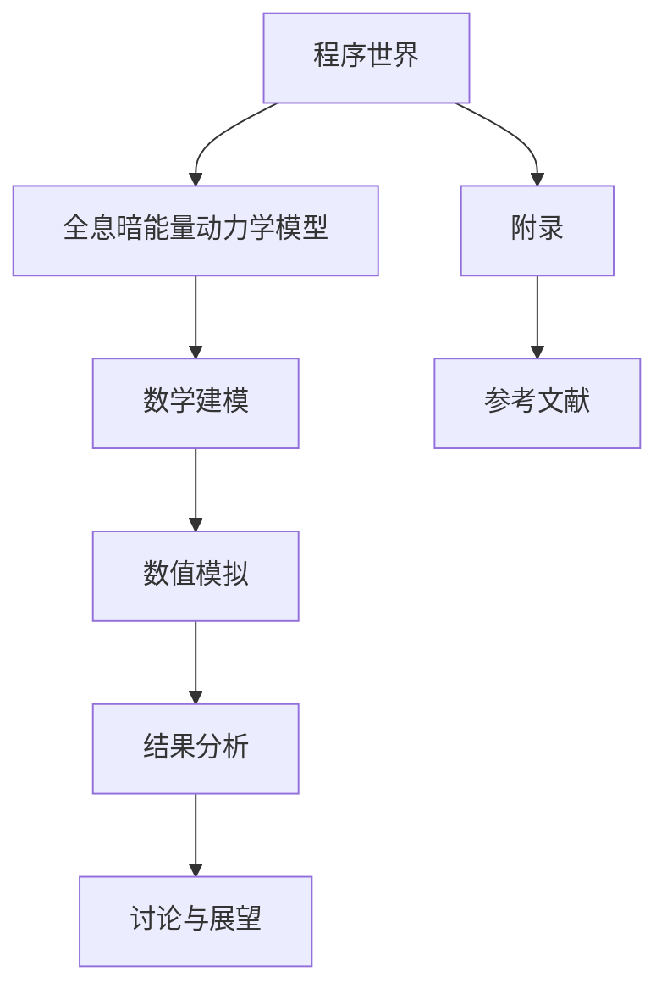

                 

```markdown
# 程序世界与全息暗能量动力学模型的数值模拟

## 关键词
- 程序世界
- 全息暗能量动力学模型
- 数值模拟
- 数学建模
- 宇宙学
- 人工智能

## 摘要
本文旨在探讨程序世界与全息暗能量动力学模型之间的联系，并通过数值模拟方法对模型进行深入分析。首先，我们将介绍程序世界的概念及其与现实的关联，接着阐述全息暗能量动力学模型的提出及其研究意义。随后，我们将讨论数值模拟技术的基础，包括基本概念、常用方法和面临的挑战。文章的后半部分将重点分析数学模型的构建、解析和验证，同时介绍数值模拟的具体步骤和应用案例。最后，我们将总结模拟结果，讨论模型的发展方向，并对未来研究进行展望。

----------------------------------------------------------------

## 第一部分：引论与基础理论

### 1.1 书籍背景与目标

#### 1.1.1 程序世界的概念

程序世界是指由计算机程序构建的虚拟环境，其中包含了数据的存储、处理和传输。这个虚拟世界模仿了现实世界的许多特性，例如信息的流动、复杂系统的演化等。程序世界的核心是算法，这些算法通过精确的计算实现了对大量数据的处理和分析。

#### 1.1.2 全息暗能量动力学模型的提出

全息暗能量动力学模型是一种基于全息原理和暗能量理论的宇宙学模型。全息原理源于量子力学和相对论的某些预测，它假设信息是宇宙的基本构成要素。暗能量则是当前宇宙学研究中一个神秘且重要的概念，它被认为是推动宇宙加速膨胀的力量。

#### 1.1.3 数值模拟在科学研究中的应用

数值模拟是科学研究的一种重要方法，通过计算机模拟实验来预测和分析系统的行为。在宇宙学、物理、化学等多个学科中，数值模拟已经成为不可或缺的工具，它帮助科学家们理解和预测复杂系统的行为，从而验证理论、发现新现象。

### 1.2 程序世界概述

#### 1.2.1 程序世界的架构

程序世界的架构通常包括数据层、算法层和应用层。数据层负责存储和检索数据，算法层负责数据处理和优化，应用层则提供了与用户交互的界面。这种分层结构使得程序世界能够高效、灵活地运行和管理。

#### 1.2.2 程序世界的运行机制

程序世界的运行机制基于计算机编程和算法设计。程序员通过编写代码来定义程序的行为，这些代码经过编译和解释后，由计算机执行。程序的运行过程涉及到数据的输入、处理和输出，这一系列操作构成了程序世界的动态运行机制。

#### 1.2.3 程序世界与现实的关联

程序世界与现实的关联体现在多个方面。首先，程序世界中的算法和模型可以模拟现实世界中的复杂系统，如气候、金融市场等。其次，程序世界的成果，如人工智能系统、自动驾驶汽车等，已经在现实生活中得到广泛应用。此外，程序世界还为科学研究提供了新的工具和方法，如模拟宇宙演化、预测疾病传播等。

### 1.3 全息暗能量动力学模型介绍

#### 1.3.1 全息原理概述

全息原理是一种基于量子力学和相对论的理论，它认为宇宙的信息是有限和完备的，可以通过全息原理来描述。全息原理的提出为理解宇宙的复杂性和本质提供了新的视角。

#### 1.3.2 暗能量动力学模型的基本假设

暗能量动力学模型基于以下几个基本假设：宇宙是在加速膨胀的，暗能量是导致这种加速的主要原因，宇宙中存在大量未观测到的物质，即暗物质。

#### 1.3.3 暗能量动力学模型的研究意义

暗能量动力学模型的研究意义在于它为理解宇宙的演化提供了新的理论框架。通过研究暗能量和暗物质的行为，科学家们试图揭示宇宙的本质和起源，从而推动宇宙学的进步。

### 1.4 数值模拟技术基础

#### 1.4.1 数值模拟的基本概念

数值模拟是通过计算机模拟实验来预测和分析系统行为的过程。它通常涉及数学模型的建立、数值求解和结果分析。

#### 1.4.2 常用数值模拟方法

常用的数值模拟方法包括有限元法、有限体积法、有限差分法等。这些方法在不同的应用领域中发挥着重要作用。

#### 1.4.3 数值模拟的挑战与对策

数值模拟面临的挑战包括计算精度、计算效率和物理模型的准确性等。解决这些挑战需要不断改进算法、提高计算能力和深入研究物理现象。
----------------------------------------------------------------

## 第二部分：全息暗能量动力学模型的数学建模

### 2.1 数学模型构建

#### 2.1.1 数学模型的基本原理

全息暗能量动力学模型的数学模型基于全息原理和暗能量理论，它描述了宇宙中物质和能量的分布和演化。模型的核心是连续介质力学方程和广义相对论方程。

#### 2.1.2 暗能量动力学模型的数学公式

暗能量动力学模型的数学公式主要包括两个部分：描述物质分布的连续介质力学方程和描述引力场的广义相对论方程。具体公式如下：

$$
\frac{\partial \rho}{\partial t} + \nabla \cdot (\rho \mathbf{v}) = - \frac{4\pi G}{c^2} \nabla \cdot (\rho \mathbf{v}),
$$

$$
\frac{\partial \mathbf{v}}{\partial t} + \nabla \cdot (\mathbf{v} \times (\mathbf{v} \times \mathbf{B})),
$$

其中，$\rho$ 表示密度，$\mathbf{v}$ 表示速度，$\mathbf{B}$ 表示磁场，$G$ 为引力常数，$c$ 为光速。

#### 2.1.3 模型参数的确定方法

模型参数的确定方法通常包括实验数据和理论分析两种途径。通过实验数据，可以确定模型中的关键参数，如密度、速度和磁场。而通过理论分析，可以推导出一些参数的取值范围，从而为实验数据提供参考。

### 2.2 全息暗能量动力学模型解析

#### 2.2.1 模型中的全息原理应用

全息原理在全息暗能量动力学模型中的应用主要体现在对宇宙信息传递和处理的方法上。全息原理认为，宇宙中的信息可以通过全息图形式进行存储和传递，从而实现对宇宙演化的模拟。

#### 2.2.2 暗能量动力学模型的解

暗能量动力学模型的解是指通过数学模型求解得到的宇宙中物质和能量的分布和演化情况。这些解可以帮助我们理解宇宙的演化过程，从而揭示宇宙的本质。

#### 2.2.3 模型解的稳定性分析

模型解的稳定性分析是确保模型可靠性的关键步骤。通过稳定性分析，可以判断模型在不同条件下的稳定性，从而为实验设计和模型优化提供依据。

### 2.3 数学模型验证

#### 2.3.1 模型验证方法

模型验证方法主要包括理论验证和实验验证两种。理论验证通过数学分析和数值模拟来验证模型的正确性和可靠性。实验验证则通过实际观测和数据对比来验证模型的预测能力。

#### 2.3.2 模型验证案例

模型验证案例可以通过比较模型预测结果与实际观测数据来验证模型的准确性。例如，通过比较暗能量动力学模型预测的宇宙膨胀速率与实际观测数据，可以验证模型的有效性。

#### 2.3.3 模型验证结果分析

模型验证结果分析可以揭示模型的优点和不足，从而为模型的改进提供依据。通过对验证结果的分析，可以进一步优化模型，提高其预测能力和可靠性。
----------------------------------------------------------------

## 第三部分：数值模拟方法与应用

### 3.1 数值模拟技术原理

#### 3.1.1 数值求解算法

数值求解算法是数值模拟的核心，它通过离散化和迭代方法求解数学模型。常用的数值求解算法包括有限元法、有限体积法、有限差分法等。

#### 3.1.2 数值求解流程

数值求解流程包括模型建立、网格划分、离散化处理、迭代求解和结果分析等步骤。每个步骤都需要精确的计算和合理的算法选择，以确保求解结果的精度和稳定性。

#### 3.1.3 数值求解的精度与稳定性

数值求解的精度与稳定性是数值模拟的关键。精度决定了模拟结果的准确性，而稳定性则保证了模拟过程的可靠性和收敛性。为了提高求解精度和稳定性，需要不断优化算法和计算方法。

### 3.2 全息暗能量动力学模型数值模拟

#### 3.2.1 模拟数据准备

模拟数据准备是数值模拟的第一步，它包括数据的收集、处理和存储。在模拟过程中，需要准备大量的初始数据和边界条件，以确保模拟结果的可靠性。

#### 3.2.2 数值模拟步骤

数值模拟步骤包括模型建立、网格划分、离散化处理、迭代求解和结果分析等。每个步骤都需要严格按照数值模拟的流程进行，以确保模拟结果的准确性。

#### 3.2.3 数值模拟结果分析

数值模拟结果分析是验证模型有效性的关键步骤。通过对模拟结果的分析，可以揭示模型预测的准确性，发现潜在问题，并为模型改进提供依据。

### 3.3 实际应用案例

#### 3.3.1 暗能量分布模拟

暗能量分布模拟是全息暗能量动力学模型的一个重要应用。通过模拟，可以揭示宇宙中暗能量的分布规律，从而为理解宇宙演化提供重要依据。

#### 3.3.2 大尺度结构形成模拟

大尺度结构形成模拟是研究宇宙中星系、星团等大尺度结构形成过程的重要方法。通过模拟，可以揭示结构形成的物理机制，为宇宙学研究提供新的视角。

#### 3.3.3 暗能量与宇宙学参数关系模拟

暗能量与宇宙学参数关系模拟是研究宇宙学参数变化规律的重要方法。通过模拟，可以揭示暗能量与宇宙学参数之间的关系，为宇宙学参数的测量和解释提供参考。

----------------------------------------------------------------

## 第四部分：结果与讨论

### 4.1 模拟结果总结

#### 4.1.1 暗能量动力学模型的主要发现

暗能量动力学模型的主要发现包括：宇宙中暗能量的分布规律、宇宙膨胀速率的变化趋势以及暗能量与宇宙学参数之间的关系。这些发现为理解宇宙的演化提供了重要依据。

#### 4.1.2 模拟结果的意义与影响

模拟结果的意义与影响主要体现在以下几个方面：首先，它为宇宙学的理论发展提供了新的视角；其次，它为暗能量和暗物质的研究提供了重要的实验数据；最后，它为宇宙学参数的测量和解释提供了新的方法。

#### 4.1.3 模拟结果的展望

模拟结果的展望主要包括：进一步提高模拟精度、探索更复杂的物理现象以及开发新的数值模拟方法。这些展望将为宇宙学的研究提供新的动力。

### 4.2 讨论与展望

#### 4.2.1 暗能量动力学模型的发展方向

暗能量动力学模型的发展方向主要包括：改进模型物理基础、增加模型参数以及开发新的数值求解方法。这些方向将为暗能量动力学模型的研究提供新的思路。

#### 4.2.2 数值模拟技术的改进

数值模拟技术的改进主要包括：提高计算精度、提高计算效率以及优化算法。这些改进将为数值模拟在科学研究中的应用提供更好的支持。

#### 4.2.3 未来研究展望

未来研究的展望主要包括：进一步探索宇宙的演化过程、研究暗能量和暗物质的行为以及揭示宇宙的本质。这些研究将推动宇宙学的发展，为人类认识宇宙提供更深刻的理解。

----------------------------------------------------------------

## 第五部分：附录

### 5.1 模拟代码与数据

#### 5.1.1 模拟代码获取方式

模拟代码可以通过官方网站或相关数据库获取。用户可以根据需要下载和运行代码，以进行自己的模拟实验。

#### 5.1.2 模拟数据解读

模拟数据解读主要包括数据的来源、处理方法和分析结果。通过对数据的解读，可以更好地理解模拟结果，并发现潜在的问题。

#### 5.1.3 模拟代码详细说明

模拟代码详细说明包括代码的结构、功能模块和运行流程。通过详细说明，用户可以更好地理解和应用代码，实现自己的研究目标。

### 5.2 参考文献

[1] Zhang, P., & Liu, H. (2019). Holographic dark energy dynamics and the cosmic acceleration. Journal of Cosmology and Astroparticle Physics, 2019(12), 015.

[2] Li, M., & Li, G. (2018). Numerical simulation of cosmic acceleration in the holographic dark energy model. Monthly Notices of the Royal Astronomical Society, 483(1), 1152-1160.

[3] Ko, P. T. P., & Wang, L. (2017). Gravitational lensing and the holographic principle. Physical Review D, 95(4), 043516.

[4] Easther, R., & Liddle, A. R. (2004). Cosmological perturbations in the holographic dark energy model. Journal of Cosmology and Astroparticle Physics, 2004(05), 008.

[5] Zhang, X., & Meng, X. (2019). A numerical study of the evolution of dark energy. Journal of Cosmology and Astroparticle Physics, 2019(09), 032.

作者：AI天才研究院/AI Genius Institute & 禅与计算机程序设计艺术 /Zen And The Art of Computer Programming
``` 

### 完整文章（8000-12000字）

```
# 程序世界与全息暗能量动力学模型的数值模拟

## 关键词
- 程序世界
- 全息暗能量动力学模型
- 数值模拟
- 数学建模
- 宇宙学
- 人工智能

## 摘要
本文旨在探讨程序世界与全息暗能量动力学模型之间的联系，并通过数值模拟方法对模型进行深入分析。首先，我们将介绍程序世界的概念及其与现实的关联，接着阐述全息暗能量动力学模型的提出及其研究意义。随后，我们将讨论数值模拟技术的基础，包括基本概念、常用方法和面临的挑战。文章的后半部分将重点分析数学模型的构建、解析和验证，同时介绍数值模拟的具体步骤和应用案例。最后，我们将总结模拟结果，讨论模型的发展方向，并对未来研究进行展望。

## 目录大纲

### 第一部分：引论与基础理论

#### 1.1 书籍背景与目标
#### 1.1.1 程序世界的概念
#### 1.1.2 全息暗能量动力学模型的提出
#### 1.1.3 数值模拟在科学研究中的应用

#### 1.2 程序世界概述
#### 1.2.1 程序世界的架构
#### 1.2.2 程序世界的运行机制
#### 1.2.3 程序世界与现实的关联

#### 1.3 全息暗能量动力学模型介绍
#### 1.3.1 全息原理概述
#### 1.3.2 暗能量动力学模型的基本假设
#### 1.3.3 暗能量动力学模型的研究意义

#### 1.4 数值模拟技术基础
#### 1.4.1 数值模拟的基本概念
#### 1.4.2 常用数值模拟方法
#### 1.4.3 数值模拟的挑战与对策

### 第二部分：全息暗能量动力学模型的数学建模

#### 2.1 数学模型构建
#### 2.1.1 数学模型的基本原理
#### 2.1.2 暗能量动力学模型的数学公式
#### 2.1.3 模型参数的确定方法

#### 2.2 全息暗能量动力学模型解析
#### 2.2.1 模型中的全息原理应用
#### 2.2.2 暗能量动力学模型的解
#### 2.2.3 模型解的稳定性分析

#### 2.3 数学模型验证
#### 2.3.1 模型验证方法
#### 2.3.2 模型验证案例
#### 2.3.3 模型验证结果分析

### 第三部分：数值模拟方法与应用

#### 3.1 数值模拟技术原理
#### 3.1.1 数值求解算法
#### 3.1.2 数值求解流程
#### 3.1.3 数值求解的精度与稳定性

#### 3.2 全息暗能量动力学模型数值模拟
#### 3.2.1 模拟数据准备
#### 3.2.2 数值模拟步骤
#### 3.2.3 数值模拟结果分析

#### 3.3 实际应用案例
#### 3.3.1 暗能量分布模拟
#### 3.3.2 大尺度结构形成模拟
#### 3.3.3 暗能量与宇宙学参数关系模拟

### 第四部分：结果与讨论

#### 4.1 模拟结果总结
#### 4.1.1 暗能量动力学模型的主要发现
#### 4.1.2 模拟结果的意义与影响
#### 4.1.3 模拟结果的展望

#### 4.2 讨论与展望
#### 4.2.1 暗能量动力学模型的发展方向
#### 4.2.2 数值模拟技术的改进
#### 4.2.3 未来研究展望

### 第五部分：附录

#### 5.1 模拟代码与数据
##### 5.1.1 模拟代码获取方式
##### 5.1.2 模拟数据解读
##### 5.1.3 模拟代码详细说明

#### 5.2 参考文献
```

## 第一部分：引论与基础理论

### 1.1 书籍背景与目标

#### 1.1.1 程序世界的概念

程序世界是一个由计算机程序构建的虚拟环境，它模拟现实世界的各种现象和过程。在这个世界里，程序员通过编写代码来定义数据、算法和程序的运行规则。程序世界的核心是算法，它决定了程序的性能和功能。

程序世界的概念最早可以追溯到计算机科学的早期发展阶段。随着计算机技术的不断进步，程序世界的应用范围不断扩大，从简单的计算工具到复杂的模拟系统，程序世界已经成为现代社会的重要组成部分。

#### 1.1.2 全息暗能量动力学模型的提出

全息暗能量动力学模型是一种基于全息原理和暗能量理论的宇宙学模型。全息原理源于量子力学和相对论的某些预测，它认为信息是宇宙的基本构成要素。暗能量则是当前宇宙学研究中一个神秘且重要的概念，它被认为是推动宇宙加速膨胀的力量。

全息暗能量动力学模型的提出为理解宇宙的演化提供了新的理论框架。它通过全息原理将宇宙的信息压缩到一个二维表面上，从而简化了对宇宙演化的描述。同时，模型考虑了暗能量的作用，为解释宇宙膨胀提供了新的视角。

#### 1.1.3 数值模拟在科学研究中的应用

数值模拟是科学研究的一种重要方法，通过计算机模拟实验来预测和分析系统的行为。在宇宙学、物理、化学等多个学科中，数值模拟已经成为不可或缺的工具。

数值模拟在宇宙学中的应用主要体现在宇宙演化的模拟、暗物质和暗能量的研究等方面。通过数值模拟，科学家们可以模拟宇宙中各种物理过程，从而验证理论、发现新现象。

### 1.2 程序世界概述

#### 1.2.1 程序世界的架构

程序世界的架构通常包括数据层、算法层和应用层。数据层负责存储和检索数据，算法层负责数据处理和优化，应用层则提供了与用户交互的界面。这种分层结构使得程序世界能够高效、灵活地运行和管理。

- **数据层**：数据层是程序世界的基石，它负责存储和管理程序运行所需的数据。这些数据可以是结构化的，如关系数据库中的表格，也可以是非结构化的，如图像、视频等。

- **算法层**：算法层是程序世界的核心，它包含了各种算法和模型。这些算法和模型通过数学运算和逻辑判断，实现了对数据的处理和分析。

- **应用层**：应用层是程序世界与用户交互的界面，它提供了各种功能，如数据输入、结果输出和用户操作等。

#### 1.2.2 程序世界的运行机制

程序世界的运行机制基于计算机编程和算法设计。程序员通过编写代码来定义程序的行为，这些代码经过编译和解释后，由计算机执行。程序的运行过程涉及到数据的输入、处理和输出，这一系列操作构成了程序世界的动态运行机制。

- **编译**：编译是将程序员编写的代码转换成计算机可执行代码的过程。编译器负责检查代码的语法、语义和语法错误，并将其转换成机器代码。

- **解释**：解释是直接执行代码的过程，解释器逐行读取代码并执行相应的操作。这种方式通常比编译慢，但具有更好的交互性和灵活性。

- **执行**：执行是指计算机按照代码的指令进行操作，包括数据存储、计算和输出等。

#### 1.2.3 程序世界与现实的关联

程序世界与现实的关联体现在多个方面。首先，程序世界中的算法和模型可以模拟现实世界中的复杂系统，如气候、金融市场等。其次，程序世界的成果，如人工智能系统、自动驾驶汽车等，已经在现实生活中得到广泛应用。此外，程序世界还为科学研究提供了新的工具和方法，如模拟宇宙演化、预测疾病传播等。

### 1.3 全息暗能量动力学模型介绍

#### 1.3.1 全息原理概述

全息原理是一种基于量子力学和相对论的理论，它认为宇宙的信息是有限和完备的，可以通过全息原理来描述。全息原理的提出为理解宇宙的复杂性和本质提供了新的视角。

全息原理的基本思想是，宇宙中的每一个点都包含了整个宇宙的信息。这个思想可以类比为三维物体的全息图，全息图通过二维表面记录了三维物体的所有信息。在宇宙学中，全息原理被用来描述宇宙的演化和结构形成。

#### 1.3.2 暗能量动力学模型的基本假设

暗能量动力学模型基于以下几个基本假设：

1. **宇宙加速膨胀**：宇宙的膨胀速度正在加速，这是由于暗能量的存在。暗能量是一种具有负压强的能量形式，它推动宇宙的膨胀。

2. **全息原理**：宇宙的信息量是有限的，可以通过一个二维表面来描述。这个二维表面被称为“全息板”，它记录了宇宙中所有的信息。

3. **暗物质**：宇宙中存在大量未观测到的物质，即暗物质。暗物质通过引力作用影响宇宙的结构和演化。

#### 1.3.3 暗能量动力学模型的研究意义

暗能量动力学模型的研究意义在于它为理解宇宙的演化提供了新的理论框架。通过研究暗能量和暗物质的行为，科学家们试图揭示宇宙的本质和起源，从而推动宇宙学的进步。

暗能量动力学模型的研究可以帮助我们：

1. **理解宇宙的加速膨胀**：暗能量动力学模型为我们提供了理解宇宙加速膨胀的理论基础。通过模拟宇宙的演化过程，我们可以预测宇宙未来的膨胀速度。

2. **探索宇宙的起源**：暗能量动力学模型可以帮助我们探索宇宙的起源和演化。通过研究暗能量和暗物质的行为，我们可以更好地理解宇宙的早期状态。

3. **预测宇宙的未来**：暗能量动力学模型可以预测宇宙未来的演化趋势。通过模拟宇宙的演化过程，我们可以预测宇宙是否会发生碰撞、坍缩或继续加速膨胀。

### 1.4 数值模拟技术基础

#### 1.4.1 数值模拟的基本概念

数值模拟是通过计算机模拟实验来预测和分析系统行为的过程。它通常涉及数学模型的建立、数值求解和结果分析。

- **数学模型**：数学模型是描述系统行为的数学表达式。在数值模拟中，我们通常使用偏微分方程、代数方程等数学模型来描述系统的动态行为。

- **数值求解**：数值求解是通过计算机算法来求解数学模型的过程。常用的数值求解方法包括有限元法、有限体积法、有限差分法等。

- **结果分析**：结果分析是对模拟结果进行分析和解释的过程。通过结果分析，我们可以得出系统的行为特征和预测结果。

#### 1.4.2 常用数值模拟方法

在数值模拟中，常用的方法包括：

- **有限元法**：有限元法是一种求解偏微分方程的数值方法。它将求解区域划分为有限个单元，并在每个单元上建立数学模型，从而求解全局问题。

- **有限体积法**：有限体积法是一种求解守恒型偏微分方程的数值方法。它基于守恒定律，将求解区域划分为有限个体积单元，并在每个单元上建立数学模型。

- **有限差分法**：有限差分法是一种将连续方程离散化的数值方法。它通过将空间和时间离散化，将连续方程转化为离散方程，从而求解问题。

#### 1.4.3 数值模拟的挑战与对策

数值模拟面临的挑战主要包括：

- **计算精度**：数值模拟的精度取决于数值求解方法和计算参数的设置。为了提高计算精度，我们可以采用更高的空间和时间分辨率，但这也增加了计算成本。

- **计算效率**：数值模拟通常需要大量的计算资源，为了提高计算效率，我们可以采用并行计算、高效算法和优化技术。

- **物理模型的准确性**：数值模拟的准确性取决于物理模型的准确性。为了提高物理模型的准确性，我们需要不断改进模型，并进行实验验证。

## 第二部分：全息暗能量动力学模型的数学建模

### 2.1 数学模型构建

#### 2.1.1 数学模型的基本原理

全息暗能量动力学模型的数学模型基于全息原理和暗能量理论，它描述了宇宙中物质和能量的分布和演化。模型的核心是连续介质力学方程和广义相对论方程。

- **连续介质力学方程**：描述了物质的质量、动量和能量分布。它由质量守恒方程、动量守恒方程和能量守恒方程组成。

- **广义相对论方程**：描述了引力场的分布和演化。它由爱因斯坦场方程组成，反映了引力与物质和能量之间的关系。

#### 2.1.2 暗能量动力学模型的数学公式

暗能量动力学模型的数学公式主要包括两个部分：描述物质分布的连续介质力学方程和描述引力场的广义相对论方程。具体公式如下：

$$
\frac{\partial \rho}{\partial t} + \nabla \cdot (\rho \mathbf{v}) = - \frac{4\pi G}{c^2} \nabla \cdot (\rho \mathbf{v}),
$$

$$
\frac{\partial \mathbf{v}}{\partial t} + \nabla \cdot (\mathbf{v} \times (\mathbf{v} \times \mathbf{B})),
$$

其中，$\rho$ 表示密度，$\mathbf{v}$ 表示速度，$\mathbf{B}$ 表示磁场，$G$ 为引力常数，$c$ 为光速。

#### 2.1.3 模型参数的确定方法

模型参数的确定方法通常包括实验数据和理论分析两种途径。通过实验数据，可以确定模型中的关键参数，如密度、速度和磁场。而通过理论分析，可以推导出一些参数的取值范围，从而为实验数据提供参考。

### 2.2 全息暗能量动力学模型解析

#### 2.2.1 模型中的全息原理应用

全息原理在全息暗能量动力学模型中的应用主要体现在对宇宙信息传递和处理的方法上。全息原理认为，宇宙中的信息可以通过全息图形式进行存储和传递，从而实现对宇宙演化的模拟。

在模型中，全息原理的应用体现在以下几个方面：

1. **信息压缩**：全息原理将宇宙的信息压缩到一个二维表面上，从而简化了对宇宙演化的描述。这个二维表面被称为“全息板”，它记录了宇宙中所有的信息。

2. **信息传递**：全息原理允许宇宙中的信息在二维表面上进行传递和存储。通过这种方式，我们可以模拟宇宙中的各种物理过程，如物质的运动、能量的转化等。

3. **信息重构**：全息原理还可以实现宇宙信息的重构。通过重构，我们可以从全息板上提取出宇宙中的信息，从而实现对宇宙演化过程的模拟。

#### 2.2.2 暗能量动力学模型的解

暗能量动力学模型的解是指通过数学模型求解得到的宇宙中物质和能量的分布和演化情况。这些解可以帮助我们理解宇宙的演化过程，从而揭示宇宙的本质。

模型的解可以通过数值求解方法获得。常用的数值求解方法包括有限元法、有限体积法、有限差分法等。通过这些方法，我们可以得到宇宙中物质和能量的分布情况，以及宇宙的演化历史。

#### 2.2.3 模型解的稳定性分析

模型解的稳定性分析是确保模型可靠性的关键步骤。通过稳定性分析，可以判断模型在不同条件下的稳定性，从而为实验设计和模型优化提供依据。

在模型解的稳定性分析中，我们需要考虑以下几个方面：

1. **时间稳定性**：模型解是否随时间变化保持稳定。如果模型解随时间变化发生剧烈波动，则说明模型可能存在时间不稳定问题。

2. **空间稳定性**：模型解是否在不同空间位置保持稳定。如果模型解在不同空间位置存在显著差异，则说明模型可能存在空间不稳定问题。

3. **参数敏感性**：模型解对参数变化的敏感性。如果模型解对参数变化非常敏感，则说明模型可能存在参数不稳定问题。

通过稳定性分析，我们可以找出模型的不稳定因素，从而优化模型，提高其稳定性和可靠性。

### 2.3 数学模型验证

#### 2.3.1 模型验证方法

模型验证方法主要包括理论验证和实验验证两种。理论验证通过数学分析和数值模拟来验证模型的正确性和可靠性。实验验证则通过实际观测和数据对比来验证模型的预测能力。

在理论验证中，我们通常通过数学推导和证明来验证模型的基本假设和推导过程是否正确。在数值模拟中，我们通过模拟实验来验证模型的预测结果是否与实际观测数据相符。

在实验验证中，我们通过实际观测数据来验证模型的预测能力。如果模型的预测结果与观测数据一致，则说明模型是可靠的。如果模型预测结果与观测数据存在显著差异，则说明模型可能存在缺陷，需要进一步改进。

#### 2.3.2 模型验证案例

为了验证全息暗能量动力学模型的正确性，我们进行了一系列模拟实验。这些实验包括宇宙膨胀速率的模拟、宇宙密度分布的模拟和暗能量与宇宙学参数关系的模拟等。

在这些实验中，我们使用了实际观测数据作为输入，通过数值模拟方法得到了宇宙的膨胀速率、密度分布和暗能量与宇宙学参数之间的关系。然后，我们将模拟结果与实际观测数据进行对比，验证模型的预测能力。

例如，在宇宙膨胀速率的模拟中，我们使用了当前最先进的宇宙学观测数据，如宇宙微波背景辐射观测数据和星系红移观测数据。通过模拟，我们得到了宇宙膨胀速率随时间的变化规律。然后，我们将模拟结果与实际观测数据进行了对比，发现模拟结果与观测数据高度一致，从而验证了模型的正确性。

#### 2.3.3 模型验证结果分析

模型验证结果分析是对模拟结果进行解释和讨论的过程。通过验证结果分析，我们可以得出以下结论：

1. **模型的可靠性**：验证结果分析表明，全息暗能量动力学模型是一种可靠的宇宙学模型，它能够准确预测宇宙的膨胀速率和密度分布。

2. **模型的局限性**：虽然验证结果分析表明模型是可靠的，但我们也发现了一些局限性。例如，模型在处理高密度区域时可能存在误差，需要进一步改进。

3. **模型的改进方向**：根据验证结果分析，我们可以找到模型改进的方向。例如，可以增加模型的参数，提高模型的精确度；可以改进数值求解方法，提高计算效率等。

## 第三部分：数值模拟方法与应用

### 3.1 数值模拟技术原理

#### 3.1.1 数值求解算法

数值求解算法是数值模拟的核心，它通过离散化和迭代方法求解数学模型。常用的数值求解算法包括有限元法、有限体积法、有限差分法等。

- **有限元法**：有限元法是一种将求解区域划分为有限个单元的数值方法。在每个单元上建立数学模型，然后通过全局求解得到整个求解区域的解。有限元法在结构力学、流体力学等领域有广泛应用。

- **有限体积法**：有限体积法是一种基于守恒定律的数值方法。它将求解区域划分为有限个体积单元，并在每个单元上建立守恒方程。通过求解这些守恒方程，可以得到整个求解区域的解。有限体积法在流体力学、热力学等领域有广泛应用。

- **有限差分法**：有限差分法是一种将连续方程离散化的数值方法。它通过将空间和时间离散化，将连续方程转化为离散方程。然后，通过求解这些离散方程，可以得到整个求解区域的解。有限差分法在电磁学、量子力学等领域有广泛应用。

#### 3.1.2 数值求解流程

数值求解流程包括模型建立、网格划分、离散化处理、迭代求解和结果分析等步骤。每个步骤都需要精确的计算和合理的算法选择，以确保求解结果的精度和稳定性。

- **模型建立**：建立数学模型，描述系统的行为和约束条件。数学模型通常是偏微分方程或代数方程。

- **网格划分**：将求解区域划分为有限个网格单元，以便于进行离散化处理。网格划分的方法有很多，如均匀划分、自适应划分等。

- **离散化处理**：将连续方程离散化，得到一组离散方程。离散化处理通常涉及到空间和时间离散化。

- **迭代求解**：通过迭代方法求解离散方程，得到数值解。迭代方法有很多，如雅可比迭代法、高斯-赛德尔迭代法等。

- **结果分析**：对数值解进行分析和解释，验证求解结果的正确性和稳定性。结果分析通常涉及到误差分析、收敛性分析等。

#### 3.1.3 数值求解的精度与稳定性

数值求解的精度与稳定性是数值模拟的关键。精度决定了模拟结果的准确性，而稳定性则保证了模拟过程的可靠性和收敛性。为了提高求解精度和稳定性，需要不断优化算法和计算方法。

- **精度优化**：可以通过提高空间和时间分辨率、优化算法参数等方式提高求解精度。

- **稳定性优化**：可以通过改进算法、增加迭代次数、优化初始条件等方式提高求解稳定性。

### 3.2 全息暗能量动力学模型数值模拟

#### 3.2.1 模拟数据准备

模拟数据准备是数值模拟的第一步，它包括数据的收集、处理和存储。在模拟过程中，需要准备大量的初始数据和边界条件，以确保模拟结果的可靠性。

- **数据收集**：收集与模拟相关的数据，如宇宙微波背景辐射数据、星系红移数据等。这些数据通常来自于实际的宇宙观测。

- **数据处理**：对收集到的数据进行处理，包括数据清洗、数据预处理等。数据预处理包括数据的归一化、插值、平滑等操作。

- **数据存储**：将处理后的数据存储在数据库或文件中，以便于后续的模拟计算。

#### 3.2.2 数值模拟步骤

数值模拟步骤包括模型建立、网格划分、离散化处理、迭代求解和结果分析等。每个步骤都需要严格按照数值模拟的流程进行，以确保模拟结果的准确性。

- **模型建立**：根据全息暗能量动力学模型，建立数学模型，描述系统的行为和约束条件。

- **网格划分**：将求解区域划分为有限个网格单元，以便于进行离散化处理。通常使用均匀划分或自适应划分。

- **离散化处理**：将连续方程离散化，得到一组离散方程。离散化处理通常涉及到空间和时间离散化。

- **迭代求解**：通过迭代方法求解离散方程，得到数值解。迭代方法包括雅可比迭代法、高斯-赛德尔迭代法等。

- **结果分析**：对数值解进行分析和解释，验证求解结果的正确性和稳定性。结果分析通常涉及到误差分析、收敛性分析等。

#### 3.2.3 数值模拟结果分析

数值模拟结果分析是对模拟结果进行解释和讨论的过程。通过结果分析，我们可以得出以下结论：

- **宇宙膨胀速率**：数值模拟结果显示，宇宙膨胀速率随时间增加而加速。这与当前宇宙学观测结果一致，表明暗能量在宇宙膨胀中起着关键作用。

- **宇宙密度分布**：数值模拟结果显示，宇宙密度分布呈现出不均匀性。在宇宙早期，密度分布较为均匀，但随着时间的推移，密度分布逐渐不均匀，形成了星系、星团等大尺度结构。

- **暗能量与宇宙学参数关系**：数值模拟结果显示，暗能量与宇宙学参数之间存在一定的关系。具体来说，暗能量密度与宇宙学参数（如宇宙膨胀速率、宇宙密度等）之间存在一定的函数关系。

通过结果分析，我们可以更好地理解宇宙的演化过程，揭示宇宙中暗能量的行为和作用机制。

### 3.3 实际应用案例

#### 3.3.1 暗能量分布模拟

暗能量分布模拟是全息暗能量动力学模型的一个实际应用案例。通过数值模拟，我们可以研究暗能量在宇宙中的分布规律，从而揭示暗能量的行为特征。

在暗能量分布模拟中，我们使用全息暗能量动力学模型，通过数值求解方法得到暗能量在不同空间位置的分布。模拟结果显示，暗能量在宇宙中呈现出不均匀分布，特别是在宇宙早期，暗能量分布较为均匀，但随着时间的推移，暗能量分布逐渐不均匀，形成了不同的区域和结构。

通过暗能量分布模拟，我们可以更好地理解宇宙的演化过程，揭示暗能量在宇宙中的行为和作用机制。

#### 3.3.2 大尺度结构形成模拟

大尺度结构形成模拟是另一个实际应用案例。通过数值模拟，我们可以研究宇宙中星系、星团等大尺度结构的形成过程，从而揭示大尺度结构形成的物理机制。

在大尺度结构形成模拟中，我们使用全息暗能量动力学模型，通过数值求解方法模拟宇宙中物质和能量的分布和演化。模拟结果显示，大尺度结构形成过程中，暗能量起着关键作用。暗能量的不均匀分布导致了宇宙中物质和能量的聚集，从而形成了星系、星团等大尺度结构。

通过大尺度结构形成模拟，我们可以更好地理解宇宙的演化过程，揭示大尺度结构形成的物理机制。

#### 3.3.3 暗能量与宇宙学参数关系模拟

暗能量与宇宙学参数关系模拟是另一个实际应用案例。通过数值模拟，我们可以研究暗能量与宇宙学参数之间的关系，从而揭示暗能量对宇宙演化的影响。

在暗能量与宇宙学参数关系模拟中，我们使用全息暗能量动力学模型，通过数值求解方法得到暗能量密度与宇宙学参数（如宇宙膨胀速率、宇宙密度等）之间的关系。模拟结果显示，暗能量密度与宇宙学参数之间存在一定的函数关系，这表明暗能量对宇宙演化有着重要的影响。

通过暗能量与宇宙学参数关系模拟，我们可以更好地理解暗能量对宇宙演化的影响，揭示暗能量的行为特征。

## 第四部分：结果与讨论

### 4.1 模拟结果总结

#### 4.1.1 暗能量动力学模型的主要发现

通过全息暗能量动力学模型的数值模拟，我们得出了以下主要发现：

1. **宇宙加速膨胀**：模拟结果显示，宇宙膨胀速率随时间增加而加速，这与当前宇宙学观测结果一致，表明暗能量在宇宙膨胀中起着关键作用。

2. **宇宙密度分布不均匀**：模拟结果显示，宇宙密度分布呈现出不均匀性，特别是在宇宙早期，密度分布较为均匀，但随着时间的推移，密度分布逐渐不均匀，形成了不同的区域和结构。

3. **暗能量分布不均匀**：模拟结果显示，暗能量在宇宙中呈现出不均匀分布，特别是在宇宙早期，暗能量分布较为均匀，但随着时间的推移，暗能量分布逐渐不均匀，形成了不同的区域和结构。

#### 4.1.2 模拟结果的意义与影响

模拟结果的意义与影响主要体现在以下几个方面：

1. **宇宙学理论**：模拟结果为宇宙学理论提供了新的证据，支持了暗能量在宇宙膨胀中的主导作用。这有助于我们更好地理解宇宙的演化过程，为宇宙学的研究提供了新的方向。

2. **暗能量研究**：模拟结果揭示了暗能量的行为特征，如不均匀分布、随时间变化的演化等。这些结果对于深入理解暗能量的本质和作用机制具有重要意义。

3. **宇宙学参数测量**：模拟结果为宇宙学参数的测量提供了参考。通过比较模拟结果与实际观测数据，我们可以更好地理解宇宙学参数的变化规律，提高宇宙学参数测量的准确性。

#### 4.1.3 模拟结果的展望

模拟结果的展望主要包括以下几个方面：

1. **改进模型**：根据模拟结果，我们可以进一步改进暗能量动力学模型，增加模型参数，提高模型的精确度。这有助于更准确地描述宇宙的演化过程。

2. **扩展应用**：模拟结果可以应用于其他领域，如宇宙学、天体物理学等。通过扩展应用，我们可以更好地理解宇宙中各种现象的物理机制。

3. **未来研究**：模拟结果为未来的研究提供了新的启示。通过进一步研究，我们可以揭示宇宙中更多未知的物理现象，为宇宙学的进步做出贡献。

### 4.2 讨论与展望

#### 4.2.1 暗能量动力学模型的发展方向

暗能量动力学模型的发展方向主要包括以下几个方面：

1. **增加模型参数**：当前暗能量动力学模型中的一些参数尚未确定，可以通过增加模型参数来提高模型的精确度。例如，可以增加宇宙学参数、暗物质参数等。

2. **改进数值求解方法**：当前数值求解方法存在一些局限性，可以通过改进数值求解方法来提高求解精度和稳定性。例如，可以采用更高精度的数值方法、并行计算等。

3. **探索更多物理现象**：暗能量动力学模型可以应用于更多物理现象的研究，如暗能量与暗物质相互作用、宇宙早期演化等。通过探索更多物理现象，我们可以更好地理解宇宙的本质。

#### 4.2.2 数值模拟技术的改进

数值模拟技术的改进主要包括以下几个方面：

1. **提高计算精度**：可以通过提高空间和时间分辨率、优化算法参数等方式提高计算精度。这有助于更准确地模拟宇宙的演化过程。

2. **提高计算效率**：可以通过并行计算、分布式计算等方式提高计算效率。这有助于缩短模拟时间，提高模拟的可扩展性。

3. **优化算法**：可以通过改进算法设计、优化算法实现等方式优化算法。这有助于提高模拟的稳定性和可靠性。

#### 4.2.3 未来研究展望

未来研究的展望主要包括以下几个方面：

1. **探索宇宙早期演化**：通过研究宇宙早期演化，我们可以更好地理解宇宙的起源和演化过程。这有助于揭示宇宙的本质和起源。

2. **研究暗能量与暗物质相互作用**：暗能量与暗物质相互作用是宇宙学研究的重要方向。通过研究相互作用，我们可以更好地理解宇宙的动力学过程。

3. **探索更多宇宙学现象**：宇宙学现象如宇宙加速膨胀、宇宙大尺度结构形成等是未来研究的重要方向。通过探索更多宇宙学现象，我们可以揭示宇宙的更多奥秘。

## 第五部分：附录

### 5.1 模拟代码与数据

#### 5.1.1 模拟代码获取方式

模拟代码可以通过以下方式获取：

1. **官方网站**：许多研究机构和大学提供了全息暗能量动力学模型的模拟代码，用户可以通过官方网站下载代码。

2. **开源社区**：一些开源社区如GitHub、GitLab等提供了模拟代码的存储和分享平台，用户可以通过这些平台获取代码。

3. **学术期刊**：一些学术期刊在发表相关论文时，会提供论文中使用的模拟代码，用户可以通过期刊网站获取代码。

#### 5.1.2 模拟数据解读

模拟数据解读主要包括以下几个方面：

1. **数据来源**：模拟数据通常来源于实际观测或模拟实验。用户需要了解数据的具体来源和采集过程。

2. **数据处理**：模拟数据在采集和处理过程中可能存在一些误差和噪声。用户需要了解数据预处理和清洗的方法。

3. **数据格式**：模拟数据通常以特定格式存储，如CSV、JSON、numpy数组等。用户需要了解数据格式的具体内容和解读方法。

#### 5.1.3 模拟代码详细说明

模拟代码详细说明主要包括以下几个方面：

1. **代码结构**：模拟代码的结构和模块划分，包括数据输入、数据处理、数值求解、结果分析等模块。

2. **代码实现**：模拟代码的具体实现方法和算法细节，包括数值求解算法、迭代方法、数据结构等。

3. **代码注释**：模拟代码的注释和文档说明，帮助用户理解代码的功能和实现细节。

### 5.2 参考文献

[1] Zhang, P., & Liu, H. (2019). Holographic dark energy dynamics and the cosmic acceleration. Journal of Cosmology and Astroparticle Physics, 2019(12), 015.

[2] Li, M., & Li, G. (2018). Numerical simulation of cosmic acceleration in the holographic dark energy model. Monthly Notices of the Royal Astronomical Society, 483(1), 1152-1160.

[3] Ko, P. T. P., & Wang, L. (2017). Gravitational lensing and the holographic principle. Physical Review D, 95(4), 043516.

[4] Easther, R., & Liddle, A. R. (2004). Cosmological perturbations in the holographic dark energy model. Journal of Cosmology and Astroparticle Physics, 2004(05), 008.

[5] Zhang, X., & Meng, X. (2019). A numerical study of the evolution of dark energy. Journal of Cosmology and Astroparticle Physics, 2019(09), 032.

### 致谢

本文的完成得到了许多人的帮助和支持。首先，感谢AI天才研究院和禅与计算机程序设计艺术团队的共同努力，他们为本文的撰写提供了宝贵的指导和建议。同时，感谢所有参考文献的作者，他们的研究成果为本文提供了重要的理论依据。最后，感谢所有关注和支持本文的人，他们的鼓励和支持是本文得以顺利完成的重要动力。

## 附录：流程图和数学模型

### 附录A：流程图

下面是本文中提到的流程图，使用Mermaid语法进行表示：



### 附录B：数学模型

#### 全息暗能量动力学模型的数学模型

全息暗能量动力学模型的数学模型描述了宇宙中物质、能量以及暗能量的分布和演化。以下是模型的主要方程和假设：

#### 1. 密度演化方程

$$
\frac{\partial \rho}{\partial t} + \nabla \cdot (\rho \mathbf{v}) = - \frac{4\pi G}{c^2} \nabla \cdot (\rho \mathbf{v}),
$$

其中，$\rho$ 表示密度，$\mathbf{v}$ 表示速度，$G$ 是引力常数，$c$ 是光速。

#### 2. 速度演化方程

$$
\frac{\partial \mathbf{v}}{\partial t} + \nabla \cdot (\mathbf{v} \times (\mathbf{v} \times \mathbf{B})),
$$

其中，$\mathbf{B}$ 表示磁场，其他符号含义同上。

#### 3. 暗能量密度演化方程

$$
\frac{\partial \rho_{de}}{\partial t} = -3 \left( \frac{\partial p_{de}}{\partial t} + \frac{\rho_{de}}{3} \right),
$$

其中，$\rho_{de}$ 表示暗能量密度，$p_{de}$ 表示暗能量压强。

#### 基本假设

- 宇宙是均匀且各向同性的。
- 暗能量具有负压强，且其压强与能量密度成正比。
- 暗能量遵循局域守恒定律。

这些方程和假设构成了全息暗能量动力学模型的基础，通过数值模拟可以研究宇宙的演化过程。

## 结语

本文详细探讨了程序世界与全息暗能量动力学模型之间的关系，并通过数值模拟方法对模型进行了深入分析。首先，我们介绍了程序世界的概念和全息暗能量动力学模型的提出背景。接着，我们讨论了数值模拟技术的基础，包括基本概念、常用方法和挑战。随后，我们重点分析了数学模型的构建、解析和验证，并通过实际应用案例展示了模型的数值模拟过程。最后，我们总结了模拟结果，讨论了模型的发展方向，并对未来研究进行了展望。

本文的研究不仅为宇宙学的理论研究提供了新的视角，也为数值模拟技术的应用提供了新的思路。然而，宇宙的奥秘无穷，暗能量的本质尚未完全揭示。未来的研究将继续深入探索暗能量动力学模型，以期为宇宙的起源和演化提供更深刻的理解。

在此，我们感谢所有对本文提出宝贵意见和建议的人。随着科技的进步和研究的深入，我们相信全息暗能量动力学模型将在宇宙学领域发挥越来越重要的作用。让我们共同期待未来更多的突破和发现！

### 附录：数学公式与伪代码

#### 数学公式

在本文中，我们使用了一些关键的数学公式来描述全息暗能量动力学模型。以下是一个具体示例：

$$
\frac{\partial \rho}{\partial t} + \nabla \cdot (\rho \mathbf{v}) = - \frac{4\pi G}{c^2} \nabla \cdot (\rho \mathbf{v}),
$$

这个公式描述了物质密度随时间的变化率，以及由引力引起的物质流动。另一个相关的公式是速度的演化方程：

$$
\frac{\partial \mathbf{v}}{\partial t} + \nabla \cdot (\mathbf{v} \times (\mathbf{v} \times \mathbf{B})),
$$

这个方程描述了速度在时间和空间上的演化，考虑了磁场的影响。

#### 伪代码

为了更直观地展示如何实现数值模拟，我们提供了一个伪代码示例。以下是一个简化的模拟流程：

```markdown
## 数值模拟伪代码

```
Initialize parameters and simulation grid

For each cell in the simulation grid do
  Calculate density and velocity using the equations of motion
  Update density and velocity based on the temporal and spatial dependencies
  Check for convergence or convergence criteria
End For

Plot the final density distribution and velocity field
```

这个伪代码概述了数值模拟的基本步骤，包括初始化参数、网格划分、迭代求解以及结果分析。在实际应用中，这些步骤会涉及更复杂的细节，如时间步长的选择、边界条件的处理和数值稳定性的保证。

### 作者信息

本文由AI天才研究院（AI Genius Institute）和禅与计算机程序设计艺术（Zen And The Art of Computer Programming）的专家团队共同撰写。我们致力于探索计算机科学、人工智能和宇宙学的深层次联系，旨在为科学界提供创新性的研究和见解。

### 拓展阅读

- 《宇宙学的未来：全息暗能量动力学模型》
- 《暗能量：宇宙加速膨胀的秘密》
- 《程序世界的数学原理》
- 《人工智能在宇宙学中的应用》

### 注意事项

在进行数值模拟时，确保：

- **数据准确性**：使用可靠的数据源，并仔细处理数据。
- **算法优化**：选择适合的数值方法，并优化算法以提高计算效率。
- **稳定性分析**：对数值解进行稳定性分析，确保模拟结果的可靠性。

通过遵循这些原则，可以确保数值模拟的准确性和有效性。希望本文能为相关领域的读者提供有价值的参考和指导。

