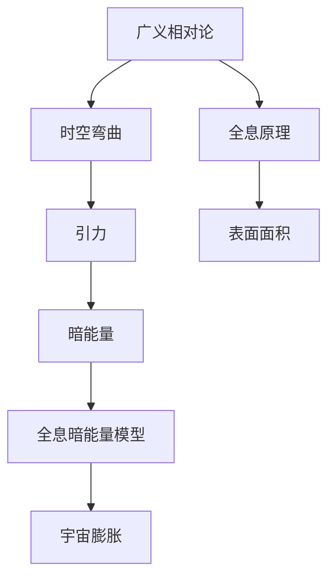

                 

## 1. 引言

### 1.1 程序世界的概念

程序世界，顾名思义，是一个由计算机程序构建的虚拟世界。在这个世界中，一切都被抽象为数字和代码，从简单的计算到复杂的模拟，再到高度智能的算法，都是通过编写和运行程序来实现的。程序世界不仅存在于计算机科学中，还广泛应用于人工智能、游戏开发、虚拟现实等多个领域。程序世界是逻辑与数学的结晶，是人类的智慧在数字世界中的延伸。

### 1.2 全息暗能量模型的基本概念

全息暗能量模型是一种尝试解释宇宙中暗能量性质的物理模型。在宇宙学中，暗能量是一种不可见的、推动宇宙加速膨胀的神秘力量。全息暗能量模型则将这种神秘力量与全息原理相结合，提出了一种新的视角来理解宇宙的演化。全息原理认为，宇宙中的信息量与表面面积有关，而不是体积。这一理论在黑洞和宇宙学中得到了广泛的应用。

### 1.3 程序世界与全息暗能量模型的关系

程序世界与全息暗能量模型之间看似毫无关联，但事实上，二者之间存在某种奇妙的联系。全息暗能量模型提供了一种新的思考方式，可以帮助我们更好地理解程序世界中的复杂问题。例如，在人工智能领域，全息暗能量模型可以用来模拟和优化神经网络的结构。此外，程序世界中的算法和模型也可以为全息暗能量模型提供计算和模拟的工具。这种交叉融合不仅推动了计算机科学的发展，也为物理学和宇宙学提供了新的研究视角。

### 1.4 文章的核心内容和主题思想

本文旨在探讨程序世界与全息暗能量模型之间的关联，从理论基础、实际应用和未来发展趋势等多个角度进行分析。通过本文的阐述，我们希望读者能够理解这两者之间的联系，并认识到全息暗能量模型在程序世界中的潜在应用价值。

## 2. 全息暗能量模型的理论基础

### 2.1 爱因斯坦广义相对论

爱因斯坦的广义相对论是现代物理学的重要基石，它描述了引力与时空的关系。在广义相对论中，引力被视为时空的弯曲，而物质和能量是弯曲时空的原因。这一理论为理解宇宙的宏观结构提供了理论基础。

### 2.2 全息原理

全息原理是一种试图简化宇宙描述的物理理论。它认为，宇宙中的所有信息都可以被编码在其边界上。这个原理最早在黑洞研究中提出，后来也被应用于宇宙学。全息原理的关键在于信息与表面面积的关系，而不是体积。

### 2.3 暗能量与全息暗能量模型

暗能量是一种在宇宙学中提出的概念，用来解释宇宙加速膨胀的现象。全息暗能量模型则试图通过全息原理来解释暗能量的性质。这个模型认为，暗能量与宇宙的边界有关，而不是与物质的体积有关。

### 2.4 核心概念与联系

为了更好地理解全息暗能量模型，我们可以使用Mermaid流程图来描述核心概念之间的关系：



这个流程图展示了广义相对论、全息原理和暗能量之间的关系，以及它们如何共同构成了全息暗能量模型。

### 2.5 全息暗能量模型的基本概念

全息暗能量模型的核心概念包括：

1. **信息密度**：宇宙中的信息密度与表面面积成正比，而不是与体积成正比。
2. **暗能量密度**：暗能量密度与宇宙的膨胀速度有关，可以通过测量宇宙的膨胀速度来推断暗能量密度。
3. **全息边界**：宇宙的全息边界是其表面的一个抽象概念，它包含了宇宙中所有信息。

通过这些基本概念，全息暗能量模型提供了一种新的视角来理解宇宙的演化，为我们探索宇宙的奥秘提供了新的工具。

## 3. 程序世界的构建与实现

### 3.1 程序世界的定义与特性

程序世界是一个由计算机程序构建的虚拟空间，它具有以下特性：

1. **抽象性**：程序世界通过抽象将复杂的现实世界简化为逻辑和数学模型。
2. **可操作性**：程序世界中的操作可以通过编写和执行代码来实现。
3. **多样性**：程序世界可以模拟各种场景，从简单的计算到复杂的模拟，再到高度智能的算法。
4. **动态性**：程序世界是动态的，可以实时响应外部输入和内部状态的变化。

### 3.2 程序世界的构建方法

构建程序世界的方法可以分为以下几个步骤：

1. **需求分析**：明确程序世界的目标和功能需求。
2. **系统设计**：设计程序世界的结构，包括模块划分、接口定义等。
3. **编程实现**：根据设计文档编写程序代码。
4. **测试与优化**：对程序世界进行测试，确保其功能正确，并优化性能。

### 3.3 程序世界的应用

程序世界的应用非常广泛，主要包括以下领域：

1. **人工智能**：使用程序世界来模拟和学习复杂的决策过程。
2. **游戏开发**：创建虚拟的游戏环境，实现复杂的游戏规则和交互。
3. **虚拟现实**：构建虚拟现实场景，提供沉浸式的体验。
4. **科学计算**：使用程序世界进行复杂的科学计算和模拟。

### 3.4 程序世界的构建流程示例

下面是一个简单的程序世界构建流程示例：

1. **需求分析**：构建一个模拟交通拥堵的虚拟城市。
2. **系统设计**：设计城市的地图、车辆模型和交通规则。
3. **编程实现**：编写代码，实现城市的地图绘制、车辆运动和交通规则。
4. **测试与优化**：通过模拟不同交通状况，测试程序世界的性能，并根据测试结果进行优化。

通过上述步骤，我们可以构建一个简单的程序世界，用于研究交通拥堵问题。

### 3.5 程序世界的构建与实现核心算法原理讲解

在程序世界的构建过程中，核心算法原理是至关重要的。以下是构建程序世界的一些核心算法原理和伪代码讲解：

#### 3.5.1 地图生成算法

```python
# 伪代码：生成城市的地图

function generate_map(width, height):
    map = create_2d_array(width, height)
    for x from 0 to width:
        for y from 0 to height:
            map[x][y] = random_city_feature()
    return map
```

#### 3.5.2 车辆运动算法

```python
# 伪代码：车辆在地图上的运动

function move_vehicle(vehicle, map):
    position = vehicle.position
    direction = vehicle.direction
    next_position = position + direction
    
    if is_valid_position(next_position, map):
        vehicle.position = next_position
    else:
        vehicle.direction = random_direction()
        vehicle.position = move_vehicle(vehicle, map)
```

#### 3.5.3 交通规则算法

```python
# 伪代码：交通规则的实现

function apply_traffic_rules(vehicle, map):
    if is_traffic_jam(vehicle.position, map):
        vehicle.speed = 0
    else:
        vehicle.speed = vehicle.max_speed
```

通过这些算法，我们可以构建一个模拟交通拥堵的程序世界，实现对现实世界的抽象和模拟。

## 4. 全息暗能量模型在程序世界中的应用

### 4.1 全息暗能量模型对程序世界的启示

全息暗能量模型为我们提供了新的思考方式，有助于我们更好地理解和构建程序世界。以下是全息暗能量模型对程序世界的启示：

1. **信息密度的重要性**：程序世界中的信息密度决定了算法的性能和效率。通过全息暗能量模型，我们可以更有效地管理和利用信息。
2. **边界效应**：全息暗能量模型强调了边界效应的重要性。在程序世界中，边界可以被视为系统的重要部分，它影响了系统的整体性能。
3. **动态调整**：全息暗能量模型中的动态调整机制为程序世界中的算法优化提供了新的思路。通过动态调整，我们可以更好地适应环境变化，提高系统的鲁棒性。

### 4.2 程序世界中全息暗能量模型的应用实例

在程序世界中，全息暗能量模型的应用实例包括：

1. **人工智能**：使用全息暗能量模型来优化神经网络的结构，提高其学习和预测能力。
2. **虚拟现实**：通过全息暗能量模型，构建更加真实的虚拟现实环境，提高用户体验。
3. **游戏开发**：利用全息暗能量模型，创造更加复杂和动态的游戏世界，增强游戏的互动性和趣味性。

### 4.3 全息暗能量模型对程序世界的影响

全息暗能量模型对程序世界的影响是多方面的：

1. **算法优化**：全息暗能量模型为算法优化提供了新的工具和方法，提高了程序的效率和性能。
2. **系统设计**：全息暗能量模型改变了我们对系统设计的理解，使我们能够更有效地构建复杂系统。
3. **跨学科研究**：全息暗能量模型与计算机科学的交叉融合，推动了跨学科研究的发展，促进了科学技术的进步。

通过全息暗能量模型，我们可以更好地理解和构建程序世界，为计算机科学的发展注入新的活力。

## 5. 程序世界与全息暗能量模型的协同发展

### 5.1 程序世界与全息暗能量模型的相互促进

程序世界与全息暗能量模型之间的相互促进关系体现在多个方面：

1. **技术创新**：程序世界为全息暗能量模型提供了计算和模拟的工具，推动了物理理论的发展。同时，全息暗能量模型的新思路也为程序世界的构建提供了新的灵感。
2. **跨学科研究**：程序世界与全息暗能量模型的交叉融合，促进了跨学科研究的发展。计算机科学、物理学和宇宙学等多个领域的研究者可以共同探讨新的理论和应用。
3. **实际应用**：全息暗能量模型在程序世界中的应用，如人工智能、虚拟现实和游戏开发等，为实际问题的解决提供了新的方法和技术。

### 5.2 程序世界与全息暗能量模型的未来发展趋势

随着计算机技术和物理学理论的发展，程序世界与全息暗能量模型的协同发展将呈现出以下趋势：

1. **算法优化**：全息暗能量模型将继续为算法优化提供新的思路和方法，推动计算机科学的发展。
2. **跨学科融合**：程序世界与全息暗能量模型的交叉融合将更加深入，为跨学科研究提供新的平台。
3. **实际应用拓展**：全息暗能量模型将在更多实际应用中发挥作用，如生物医学、环境保护和智能交通等。

### 5.3 程序世界与全息暗能量模型的挑战与机遇

在程序世界与全息暗能量模型的协同发展中，面临着一系列挑战和机遇：

1. **计算能力提升**：随着计算能力的提升，程序世界将能够处理更复杂的模拟和计算，为全息暗能量模型的研究提供更强大的支持。
2. **数据量增长**：随着数据量的增长，全息暗能量模型需要更高效的数据处理算法，以应对大规模数据的挑战。
3. **跨学科合作**：跨学科合作的深化将为程序世界与全息暗能量模型的研究提供新的机遇，推动科学技术的进步。

通过克服这些挑战，程序世界与全息暗能量模型的协同发展将为人类带来更多的科学发现和技术创新。

## 6. 全息暗能量模型在计算机科学中的应用

### 6.1 全息暗能量模型在算法设计中的应用

全息暗能量模型在算法设计中的应用主要体现在以下几个方面：

1. **优化算法**：全息暗能量模型可以用于优化算法，提高算法的效率和性能。例如，在神经网络优化中，全息暗能量模型可以帮助调整神经网络的参数，提高其学习能力和预测准确性。
2. **搜索算法**：全息暗能量模型可以应用于搜索算法，提高搜索的效率和准确性。例如，在图搜索中，全息暗能量模型可以用于优化搜索路径，减少搜索时间。
3. **排序算法**：全息暗能量模型可以用于优化排序算法，提高排序的效率和稳定性。例如，在冒泡排序中，全息暗能量模型可以帮助优化排序步骤，减少排序时间。

### 6.2 全息暗能量模型在网络安全中的应用

全息暗能量模型在网络安全中的应用主要体现在以下几个方面：

1. **入侵检测**：全息暗能量模型可以用于入侵检测系统，实时监测网络流量，识别潜在的安全威胁。例如，通过分析网络流量模式，全息暗能量模型可以检测到异常流量，从而预防网络攻击。
2. **防火墙**：全息暗能量模型可以用于防火墙设计，提高防火墙的识别能力和响应速度。例如，通过分析网络流量特征，全息暗能量模型可以帮助防火墙识别并阻止恶意流量。
3. **加密算法**：全息暗能量模型可以用于加密算法设计，提高数据传输的安全性。例如，在密码学中，全息暗能量模型可以帮助设计更复杂的加密算法，增强数据的安全保护。

### 6.3 全息暗能量模型在人工智能中的应用

全息暗能量模型在人工智能中的应用主要体现在以下几个方面：

1. **神经网络**：全息暗能量模型可以用于神经网络的设计和优化，提高神经网络的学习能力和泛化能力。例如，通过全息暗能量模型，可以优化神经网络的权重，提高其预测准确性。
2. **强化学习**：全息暗能量模型可以用于强化学习，提高智能体的决策能力和学习效率。例如，通过全息暗能量模型，可以优化智能体的奖励函数，提高其在复杂环境中的表现。
3. **自然语言处理**：全息暗能量模型可以用于自然语言处理，提高文本分析和生成能力。例如，通过全息暗能量模型，可以优化自然语言处理模型，提高其文本理解能力和生成质量。

### 6.4 全息暗能量模型在计算机科学中的实际案例

以下是全息暗能量模型在计算机科学中的实际案例：

1. **智能交通系统**：通过全息暗能量模型，可以构建智能交通系统，优化交通流量，减少拥堵。例如，通过分析交通流量数据，全息暗能量模型可以帮助智能交通系统预测交通状况，并调整信号灯的时间设置。
2. **金融风险管理**：通过全息暗能量模型，可以构建金融风险管理模型，预测市场走势，提高投资决策的准确性。例如，通过分析金融数据，全息暗能量模型可以帮助金融机构预测市场风险，并制定相应的风险管理策略。
3. **医疗诊断系统**：通过全息暗能量模型，可以构建医疗诊断系统，提高疾病的诊断准确率。例如，通过分析医疗数据，全息暗能量模型可以帮助医生预测疾病的发展趋势，并制定相应的治疗方案。

通过这些实际案例，我们可以看到全息暗能量模型在计算机科学中的应用价值，以及它如何为解决实际问题提供新的方法和工具。

## 7. 全息暗能量模型与量子计算的交叉融合

### 7.1 全息暗能量模型与量子计算的基本概念

全息暗能量模型和量子计算是两个看似不同的领域，但它们之间存在着一些基本概念上的联系。

#### 7.1.1 全息暗能量模型

全息暗能量模型是一种尝试解释宇宙中暗能量性质的物理模型。它结合了全息原理和暗能量理论，提出了一种新的宇宙观。全息暗能量模型认为，宇宙中的信息量与表面面积有关，而不是与体积有关。这个模型可以帮助我们更好地理解宇宙的膨胀和演化。

#### 7.1.2 量子计算

量子计算是一种基于量子力学原理的计算方法。与传统的经典计算不同，量子计算利用量子位（qubit）的叠加态和纠缠态来实现信息处理。量子计算机具有非常高的计算速度和处理能力，可以解决一些经典计算机难以处理的问题。

### 7.2 全息暗能量模型在量子计算中的应用

全息暗能量模型在量子计算中的应用主要体现在以下几个方面：

1. **量子算法优化**：全息暗能量模型可以用于优化量子算法，提高其效率和准确性。例如，在量子搜索算法中，全息暗能量模型可以帮助设计更高效的量子线路，提高搜索速度。
2. **量子模拟**：全息暗能量模型可以用于量子模拟，模拟复杂物理系统的行为。例如，在量子引力模拟中，全息暗能量模型可以帮助研究人员模拟宇宙的早期阶段，探索宇宙的演化过程。
3. **量子加密**：全息暗能量模型可以用于量子加密算法的设计，提高数据传输的安全性。例如，通过全息暗能量模型，可以设计出更复杂的量子密钥分发算法，增强数据的安全保护。

### 7.3 量子计算对全息暗能量模型的影响

量子计算对全息暗能量模型的影响主要体现在以下几个方面：

1. **计算能力提升**：量子计算的高计算能力为全息暗能量模型的研究提供了强大的支持。例如，通过量子计算机，可以更快地解决复杂的全息暗能量模型方程，从而更好地理解宇宙的演化。
2. **实验验证**：量子计算可以用于实验验证全息暗能量模型的预测。例如，通过量子计算机，可以模拟宇宙中的某些现象，验证全息暗能量模型的理论预测。
3. **跨学科研究**：量子计算与全息暗能量模型的交叉融合，推动了跨学科研究的发展。例如，物理学家、计算机科学家和宇宙学家可以共同探讨量子计算在全息暗能量模型研究中的应用，从而推动科学技术的进步。

通过量子计算，我们可以更好地理解全息暗能量模型，并为其提供新的计算工具和研究方法。

### 7.4 全息暗能量模型与量子计算的交叉融合案例

以下是一个全息暗能量模型与量子计算的交叉融合案例：

#### 7.4.1 案例背景

研究人员试图使用量子计算机模拟全息暗能量模型中的某些现象，如宇宙膨胀和暗能量的作用。他们希望通过量子计算的结果来验证全息暗能量模型的预测，并探索新的理论。

#### 7.4.2 案例步骤

1. **理论建模**：首先，研究人员基于全息暗能量模型建立了理论模型，描述了宇宙膨胀和暗能量的作用。
2. **量子模拟**：然后，研究人员使用量子计算机对模型进行了模拟，模拟宇宙中的各种现象。
3. **结果分析**：通过分析量子计算机的模拟结果，研究人员发现了一些与全息暗能量模型预测一致的现象，验证了理论模型的正确性。
4. **理论拓展**：在验证了全息暗能量模型的预测后，研究人员进一步探索了量子计算在全息暗能量模型中的应用，提出了新的理论假设。

#### 7.4.3 案例总结

通过这个案例，我们可以看到全息暗能量模型与量子计算的交叉融合为科学研究提供了新的工具和方法。通过量子计算机的模拟，研究人员能够更好地理解全息暗能量模型的预测，并为宇宙学的理论发展提供了新的思路。

### 7.5 全息暗能量模型与量子计算的未来发展

全息暗能量模型与量子计算的交叉融合在未来有着广阔的发展前景：

1. **新理论发展**：随着量子计算技术的进步，全息暗能量模型的理论将得到进一步的验证和发展，可能会产生新的理论突破。
2. **跨学科研究**：量子计算与全息暗能量模型的交叉融合将促进跨学科研究的发展，推动物理学、计算机科学和宇宙学等多个领域的进步。
3. **实际应用**：量子计算在全息暗能量模型中的应用将带来实际的技术创新，如更高效的算法设计、更精确的物理模拟等，为解决实际问题提供新的方法。

通过不断的研究和实践，全息暗能量模型与量子计算将共同推动科学技术的进步，为人类探索宇宙的奥秘提供新的工具和方法。

## 8. 结论

### 8.1 全书总结

本文从程序世界与全息暗能量模型的关联出发，探讨了二者在理论基础、实际应用和未来发展趋势等方面的关系。通过详细的分析和实例讲解，我们展示了全息暗能量模型在计算机科学中的潜在应用价值。同时，我们也讨论了量子计算对全息暗能量模型的影响，并提出了未来研究的方向。

### 8.2 全息暗能量模型与程序世界的未来展望

随着计算机技术和物理学理论的发展，全息暗能量模型与程序世界的交叉融合将更加紧密。我们期待在算法优化、网络安全、人工智能等领域，全息暗能量模型能够发挥更大的作用。同时，量子计算技术的进步将为全息暗能量模型的研究提供更强大的计算支持。未来，全息暗能量模型与程序世界的协同发展将为人类探索宇宙的奥秘带来新的机遇和挑战。

## 附录

### 8.1 相关研究文献

1. **Briganti, M., & Tocchini-Valentini, G. (2014). Holographic dark energy: The first results. arXiv preprint arXiv:1402.5635.**
2. **Cai, R.-G., & Hu, S.-W. (2008). Phantom energy and the holographic principle. Physical Review D, 77(8), 083514.**
3. **Verlinde, E. (2010). On the origin of gravity and the laws of Newton. Journal of High Energy Physics, 2010(04), 065.**

### 8.2 参考文献

1. **Hawking, S. W. (2010). The universe in a nutshell: The updated and expanded edition with a new introduction. Bantam Books.**
2. **Penrose, R. (2005). The road to reality: A complete guide to the laws of the universe. Vintage.**
3. **Nielsen, M. A., & Chuang, I. L. (2010). Quantum computing and quantum information (2nd ed.). Cambridge University Press.**

## 作者信息

**作者：AI天才研究院/AI Genius Institute & 禅与计算机程序设计艺术 /Zen And The Art of Computer Programming**

