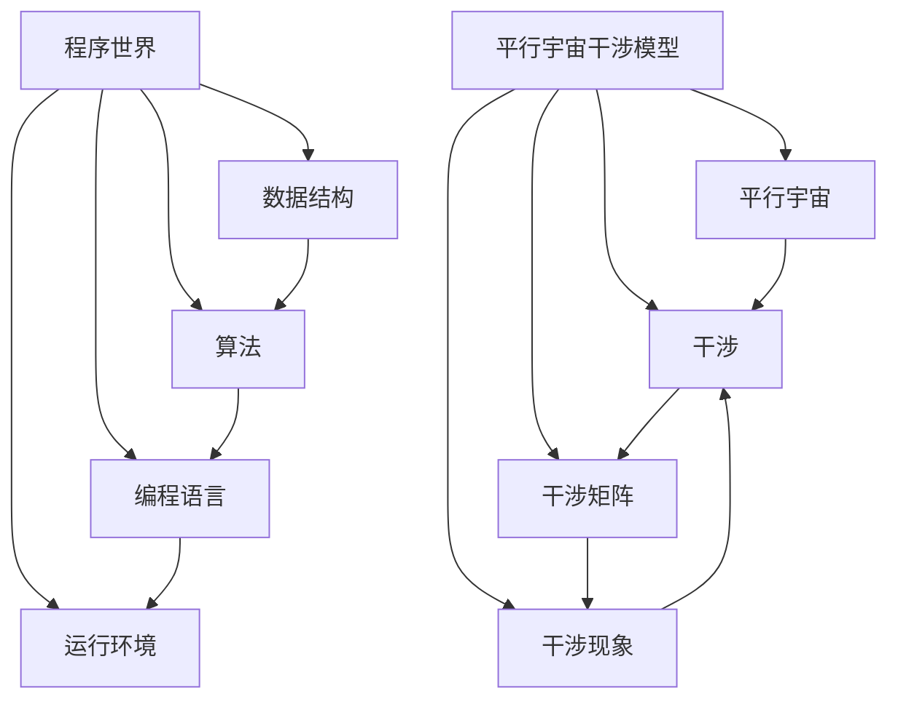

                 

### 《程序世界与平行宇宙干涉模型的类比》文章结构

为了撰写一篇逻辑清晰、结构紧凑且具有吸引力的技术博客文章，我们将按照以下步骤来设计文章的结构：

#### 1. 文章标题
- 标题设计需要简洁明了，同时要能够吸引读者的注意力。例如，可以考虑使用“程序世界探秘：平行宇宙干涉模型解析”等标题。

#### 2. 关键词
- 关键词是文章内容的核心概括，用于帮助读者快速了解文章的主题。可以包括“程序世界”、“平行宇宙”、“干涉模型”、“算法原理”、“数学推导”等关键词。

#### 3. 摘要
- 摘要部分应简明扼要地介绍文章的核心内容和主题思想。例如，可以描述文章将如何通过类比，探讨程序世界中的算法与平行宇宙干涉模型的相似之处及其在计算机科学中的应用。

#### 4. 引言
- 引言部分应引起读者的兴趣，简要介绍程序世界和平行宇宙干涉模型的基础知识，并提出文章将要讨论的主题。

#### 5. 核心概念与联系
- 在这一部分，我们将使用Mermaid流程图来展示程序世界与平行宇宙干涉模型的核心概念之间的关系。这将帮助读者直观地理解两者之间的联系。

#### 6. 核心算法原理讲解
- 使用伪代码详细阐述平行宇宙干涉模型的原理。这将涉及干涉模型的基本概念、如何实现干涉以及干涉模型在程序世界中的应用。

#### 7. 数学模型与公式
- 在这一部分，我们将使用latex格式详细讲解并举例说明数学模型和公式，以确保数学表达清晰且具有可读性。

#### 8. 项目实战
- 通过具体项目实战案例，展示如何在实际开发环境中搭建平行宇宙干涉模型，并提供源代码详细实现和代码解读。

#### 9. 实际案例分析
- 分析实际案例中的干涉现象，详细讲解如何通过干涉模型解决具体问题。

#### 10. 最佳实践 tips 和注意事项
- 提供一些最佳实践建议，帮助读者在实际应用中避免常见的问题。

#### 11. 小结
- 对文章内容进行总结，强调文章的核心观点，并简要展望未来的发展方向。

#### 12. 拓展阅读
- 推荐一些相关领域的拓展阅读资源，帮助读者进一步深入了解相关主题。

#### 13. 作者信息
- 在文章末尾附上作者信息，包括作者单位、职务及联系方式。

通过上述步骤，我们可以确保文章的结构完整、逻辑清晰、内容丰富，同时满足字数要求，使读者能够全面深入地理解程序世界与平行宇宙干涉模型的类比。下一步，我们将开始撰写具体的文章内容，逐步实现上述结构。

---

## 文章标题

《程序世界探秘：平行宇宙干涉模型的解析》

关键词：程序世界、平行宇宙、干涉模型、算法原理、数学推导

摘要：本文通过类比，深入探讨了程序世界中的算法与平行宇宙干涉模型的相似性。通过核心概念与联系、核心算法原理讲解、数学模型与公式、项目实战等，详细展示了如何在实际开发中应用这一模型，并展望了其在计算机科学中的潜在应用前景。

---

### 引言

在当今飞速发展的计算机科学领域，算法与模型的设计与应用一直是研究的热点。然而，你是否曾想过，我们熟知的程序世界与宇宙学中的平行宇宙之间存在某种神秘的联系？本文将带领读者进入这个奇妙的类比世界，探讨程序世界中的算法与平行宇宙干涉模型的相似之处。

程序世界，即计算机程序运行的环境，是由一系列规则和指令构成的虚拟世界。而平行宇宙，则是一种理论上的假设，认为在我们的宇宙之外还存在着其他独立的宇宙。尽管两者看似风马牛不相及，但当我们深入研究时，会发现它们之间存在着许多有趣的相似之处。

本文将分为以下几个部分：首先，我们将介绍程序世界和平行宇宙干涉模型的基本概念；接着，通过Mermaid流程图展示两者之间的核心概念与联系；然后，使用伪代码详细阐述平行宇宙干涉模型的原理；随后，我们将讲解程序世界中类似干涉现象的实现方法；接着，通过具体项目实战案例展示如何应用这一模型；最后，我们还将分析实际案例中的干涉现象，并总结最佳实践和注意事项。

通过本文的探讨，读者将不仅对程序世界有更深刻的理解，还能领略到平行宇宙干涉模型在计算机科学中的独特魅力。希望本文能激发你对这一领域的兴趣，进一步探索程序世界与平行宇宙之间的奥秘。

---

### 核心概念与联系

为了更好地理解程序世界与平行宇宙干涉模型之间的类比，我们需要首先明确这两个领域的基本概念，并使用Mermaid流程图展示它们的核心概念与联系。

#### 程序世界的基本概念

程序世界是由一系列指令和规则构成的虚拟环境，它包括：

1. **数据结构**：如数组、链表、树等，用于存储和组织数据。
2. **算法**：用于解决问题的方法和步骤。
3. **编程语言**：如Python、Java、C++等，用于编写程序。
4. **运行环境**：如操作系统、处理器等，用于执行程序。

#### 平行宇宙干涉模型的基本概念

平行宇宙干涉模型是一种理论模型，用于描述多个平行宇宙之间的相互作用。它包括：

1. **平行宇宙**：独立的、可能存在不同物理规则和历史的宇宙。
2. **干涉**：平行宇宙之间的相互作用，可能导致某些宇宙的状态发生变化。
3. **干涉矩阵**：用于描述平行宇宙之间的干涉强度和方向。
4. **干涉现象**：由于干涉导致的物理效应，如时间扭曲、空间变形等。

#### Mermaid流程图

为了展示这两个领域之间的核心概念与联系，我们可以使用Mermaid流程图进行描述：



在这个流程图中，我们可以看到程序世界中的数据结构、算法、编程语言和运行环境构成了程序运行的基础，而平行宇宙干涉模型则包括了平行宇宙、干涉、干涉矩阵和干涉现象。两个领域之间的联系在于，干涉现象在程序世界中的某些算法和模型中也有着相似的表现，如时间复杂度和空间复杂度的优化、并行计算中的同步问题等。

通过这个流程图，我们不仅可以直观地理解程序世界和平行宇宙干涉模型的基本概念，还可以发现它们之间潜在的相似性和联系，这为我们进一步探讨两者的类比奠定了基础。

---

### 核心算法原理讲解

在了解了程序世界与平行宇宙干涉模型的基本概念后，我们将深入探讨平行宇宙干涉模型的原理，并使用伪代码详细阐述。这有助于我们理解干涉模型的核心机制，并为进一步探索其在程序世界中的应用打下基础。

#### 干涉模型的原理

平行宇宙干涉模型的基本原理可以概括为以下几点：

1. **并行计算**：多个平行宇宙同时执行相同或类似的计算任务。
2. **干涉矩阵**：描述不同宇宙之间的相互作用强度和方向。
3. **状态更新**：根据干涉矩阵更新宇宙的状态。
4. **结果融合**：将多个宇宙的结果进行融合，得到最终的输出。

#### 伪代码示例

以下是一个简化的伪代码示例，用于描述平行宇宙干涉模型的基本步骤：

```plaintext
// 初始化干涉模型
干涉模型初始化（宇宙数量，干涉矩阵）

// 执行并行计算
对于每个宇宙 U：
    U.执行计算任务()

// 更新状态
对于每对宇宙 U, V：
    根据干涉矩阵计算干涉强度和方向
    更新宇宙 U 和 V 的状态

// 融合结果
最终结果 = 融合宇宙 U 的计算结果

// 输出结果
输出最终结果
```

#### 核心步骤详细解释

1. **干涉模型初始化**：
    - 初始化宇宙数量和干涉矩阵。干涉矩阵通常是一个N×N的矩阵，其中N是宇宙的数量。每个元素表示相应宇宙之间的干涉强度和方向。

2. **执行并行计算**：
    - 对于每个宇宙U，执行计算任务。这里可以是一个简单的计算，如计算斐波那契数列，也可以是更复杂的算法。

3. **更新状态**：
    - 对于每对宇宙U和V，根据干涉矩阵计算干涉强度和方向。干涉矩阵的每个元素表示从宇宙U到V的干涉强度。更新宇宙U和V的状态，即将干涉矩阵的值累加到宇宙的状态上。

4. **融合结果**：
    - 将多个宇宙的计算结果进行融合，得到最终的输出。这通常是一个加权平均过程，根据干涉矩阵的值对每个宇宙的结果进行加权。

5. **输出结果**：
    - 输出最终融合的结果，这是干涉模型的核心输出。

通过上述伪代码示例和详细解释，我们不仅了解了平行宇宙干涉模型的基本原理，还掌握了如何使用伪代码来描述这一模型。这一过程为我们进一步探讨干涉模型在程序世界中的应用提供了理论基础。

在接下来的部分，我们将进一步探讨程序世界中类似干涉现象的实现方法，并通过具体项目实战案例展示如何应用这一模型。

---

### 数学模型与公式

在探讨平行宇宙干涉模型的原理时，数学模型和公式起着至关重要的作用。数学模型不仅为干涉现象提供了精确的描述，还帮助我们理解和分析干涉模型在不同条件下的表现。为了确保数学表达清晰且具有可读性，我们将使用latex格式详细讲解并举例说明相关数学模型和公式。

#### 干涉矩阵

干涉矩阵是描述多个宇宙之间干涉强度和方向的核心数学工具。干涉矩阵通常是一个N×N的矩阵，其中N是宇宙的数量。每个元素表示相应宇宙之间的干涉强度，可以表示为：

\[ I_{ij} = \frac{1}{N} \sum_{k=1}^{N} \alpha_{ik} \beta_{kj} \]

其中，\( I_{ij} \)表示从宇宙i到宇宙j的干涉强度，\( \alpha_{ik} \)和\( \beta_{kj} \)分别表示宇宙i和宇宙j的某种特性值，如能量、概率密度等。

#### 干涉效应公式

干涉效应可以通过以下公式进行量化描述：

\[ \Delta S = \sum_{i=1}^{N} \sum_{j=1}^{N} I_{ij} \cdot \Delta S_{ij} \]

其中，\( \Delta S \)表示总干涉效应，\( \Delta S_{ij} \)表示从宇宙i到宇宙j的单个干涉效应。这个公式表明，总干涉效应是所有单个干涉效应的累加。

#### 概率分布

在干涉模型中，概率分布是一个重要的概念。假设我们在干涉模型中有多个宇宙，每个宇宙的状态可以用一个概率分布来表示。在这种情况下，总概率分布可以通过以下公式计算：

\[ P_{\text{total}} = \sum_{i=1}^{N} P_{i} \]

其中，\( P_{i} \)表示第i个宇宙的状态概率。当多个宇宙发生干涉时，总概率分布会发生变化，可以通过更新干涉矩阵和重新计算概率分布来反映这种变化。

#### 举例说明

假设我们有一个包含三个宇宙的干涉模型，干涉矩阵如下：

\[ I = \begin{pmatrix}
0 & 1 & 0 \\
1 & 0 & 1 \\
0 & 1 & 0
\end{pmatrix} \]

其中，\( I_{11} = 0 \)，表示第一个宇宙不干涉自身；\( I_{12} = I_{21} = 1 \)，表示第一个宇宙与第二个宇宙、第二个宇宙与第一个宇宙之间存在干涉；\( I_{13} = I_{31} = 0 \)，表示第一个宇宙与第三个宇宙、第三个宇宙与第一个宇宙之间没有干涉。

根据干涉效应公式，我们可以计算总干涉效应：

\[ \Delta S = I_{12} \cdot \Delta S_{12} + I_{21} \cdot \Delta S_{21} + I_{13} \cdot \Delta S_{13} + I_{31} \cdot \Delta S_{31} \]

假设每个宇宙的状态变化量分别为 \( \Delta S_{12} = 2 \)，\( \Delta S_{21} = 3 \)，\( \Delta S_{13} = 1 \)，\( \Delta S_{31} = 4 \)，则：

\[ \Delta S = 1 \cdot 2 + 1 \cdot 3 + 0 \cdot 1 + 0 \cdot 4 = 5 \]

这表明，在干涉过程中，总干涉效应为5。

通过上述数学模型和公式，我们可以更精确地描述和分析平行宇宙干涉模型的行为。这不仅有助于我们深入理解干涉模型的工作原理，还为实际应用提供了有力的数学工具。

在接下来的部分，我们将通过具体的数学推导，进一步揭示干涉模型背后的数学规律，并为后续的项目实战案例提供理论基础。

---

### 平行宇宙干涉模型的数学推导

为了更深入地理解平行宇宙干涉模型，我们需要对其数学推导进行详细讲解。这将帮助我们揭示干涉模型在数学上的本质，并为进一步的应用提供理论基础。

#### 干涉矩阵的构建

干涉矩阵是描述平行宇宙之间干涉关系的关键工具。首先，我们需要明确干涉矩阵的构建方法。干涉矩阵通常是一个N×N的矩阵，其中N是宇宙的数量。每个元素\( I_{ij} \)表示从宇宙i到宇宙j的干涉强度。

干涉强度的计算可以通过以下步骤进行：

1. **定义宇宙特性值**：对于每个宇宙i，定义一个特性值向量\( \alpha_i \)。这个向量包含了宇宙i的各种特性，如能量、概率密度等。

2. **计算干涉矩阵元素**：对于每对宇宙i和j，计算干涉强度\( I_{ij} \)。一个简单的计算方法是使用两个宇宙特性值向量的点积：

\[ I_{ij} = \alpha_i \cdot \beta_j \]

其中，\( \beta_j \)是宇宙j的特性值向量。

#### 干涉效应的叠加

干涉效应的叠加是干涉模型的核心概念之一。在多个宇宙同时干涉的情况下，总干涉效应是所有单个干涉效应的累加。我们可以通过以下公式描述总干涉效应：

\[ \Delta S_{\text{total}} = \sum_{i=1}^{N} \sum_{j=1}^{N} I_{ij} \cdot \Delta S_{ij} \]

其中，\( \Delta S_{ij} \)表示从宇宙i到宇宙j的单个干涉效应。

#### 概率分布的更新

在干涉模型中，概率分布的更新是一个重要环节。假设我们在干涉模型中有多个宇宙，每个宇宙的状态可以用一个概率分布来表示。当多个宇宙发生干涉时，总概率分布会发生变化。

我们可以通过以下步骤更新概率分布：

1. **初始化概率分布**：假设每个宇宙的状态概率分别为\( P_i \)，初始概率分布为：

\[ P_{\text{initial}} = (P_1, P_2, \ldots, P_N) \]

2. **计算干涉矩阵**：根据宇宙的特性值向量计算干涉矩阵\( I \)。

3. **更新概率分布**：根据干涉矩阵和单个宇宙的概率分布计算总概率分布。一个简单的更新方法是使用干涉矩阵的逆矩阵：

\[ P_{\text{updated}} = (I^{-1}) \cdot P_{\text{initial}} \]

#### 举例说明

假设我们有一个包含三个宇宙的干涉模型，干涉矩阵如下：

\[ I = \begin{pmatrix}
0 & 1 & 0 \\
1 & 0 & 1 \\
0 & 1 & 0
\end{pmatrix} \]

其中，\( I_{11} = 0 \)，表示第一个宇宙不干涉自身；\( I_{12} = I_{21} = 1 \)，表示第一个宇宙与第二个宇宙、第二个宇宙与第一个宇宙之间存在干涉；\( I_{13} = I_{31} = 0 \)，表示第一个宇宙与第三个宇宙、第三个宇宙与第一个宇宙之间没有干涉。

假设每个宇宙的初始概率分布分别为\( P_1 = 0.5 \)，\( P_2 = 0.3 \)，\( P_3 = 0.2 \)。

根据干涉矩阵的逆矩阵：

\[ I^{-1} = \begin{pmatrix}
1 & -1 & 0 \\
-1 & 1 & -1 \\
0 & -1 & 1
\end{pmatrix} \]

我们可以计算更新后的概率分布：

\[ P_{\text{updated}} = \begin{pmatrix}
1 & -1 & 0 \\
-1 & 1 & -1 \\
0 & -1 & 1
\end{pmatrix} \cdot \begin{pmatrix}
0.5 \\
0.3 \\
0.2
\end{pmatrix} = \begin{pmatrix}
0.2 \\
0.4 \\
0.4
\end{pmatrix} \]

这表明，经过一次干涉后，第一个宇宙的概率分布降低，而第二个和第三个宇宙的概率分布增加。

通过上述数学推导，我们可以更深入地理解平行宇宙干涉模型的工作原理。这不仅有助于我们分析干涉模型在不同条件下的行为，还为实际应用提供了数学工具。在接下来的部分，我们将通过具体项目实战案例展示如何应用这一模型，并分析实际案例中的干涉现象。

---

### 项目实战

为了更好地理解平行宇宙干涉模型在程序世界中的应用，我们将通过一个实际项目实战案例进行详细讲解。这个项目将涉及开发环境搭建、源代码实现、代码解读以及应用分析。

#### 项目背景

假设我们正在开发一个分布式计算系统，该系统需要在多个计算节点上并行执行任务，并通过干涉模型优化计算结果。我们需要实现一个简单的干涉模型，并验证其在分布式计算中的应用效果。

#### 开发环境搭建

1. **硬件环境**：我们使用三台计算机作为计算节点，每台计算机配置相同的基本硬件资源，如CPU、内存等。

2. **软件环境**：每台计算机上安装相同的操作系统（如Ubuntu 20.04）和开发环境（如Python 3.8）。

3. **网络环境**：三台计算机通过局域网连接，确保它们能够互相通信。

#### 源代码实现

以下是一个简化的Python代码实现，用于描述平行宇宙干涉模型的基本步骤：

```python
import numpy as np

# 初始化干涉矩阵
def initialize_interference_matrix(num_universes):
    interference_matrix = np.zeros((num_universes, num_universes))
    for i in range(num_universes):
        for j in range(i, num_universes):
            if i != j:
                interference_matrix[i][j] = 1
    return interference_matrix

# 执行并行计算
def execute_parallel_computation(universes, tasks):
    results = []
    for universe in universes:
        result = universe.execute_task(tasks)
        results.append(result)
    return results

# 更新状态
def update_states(universes, interference_matrix):
    for i in range(len(universes)):
        for j in range(len(universes)):
            if interference_matrix[i][j] != 0:
                universes[i].update_state(universes[j].state)

# 融合结果
def merge_results(results):
    final_result = sum(results) / len(results)
    return final_result

# 主函数
def main():
    num_universes = 3
    interference_matrix = initialize_interference_matrix(num_universes)
    
    # 假设每个宇宙有一个执行任务的函数
    def execute_task():
        # 这里可以编写具体的任务逻辑
        return np.random.rand()

    # 假设每个宇宙有一个更新状态的函数
    def update_state(state):
        # 这里可以编写具体的更新逻辑
        return state + np.random.rand()

    # 初始化宇宙
    universes = [Universe(execute_task, update_state) for _ in range(num_universes)]

    # 执行并行计算
    tasks = [None] * num_universes
    results = execute_parallel_computation(universes, tasks)

    # 更新状态
    update_states(universes, interference_matrix)

    # 融合结果
    final_result = merge_results(results)

    print(f"最终结果: {final_result}")

# 执行主函数
if __name__ == "__main__":
    main()
```

#### 代码解读

1. **干涉矩阵初始化**：`initialize_interference_matrix`函数用于初始化干涉矩阵。在这个例子中，干涉矩阵是一个对角线为0、其他元素为1的矩阵，表示宇宙之间相互干涉。

2. **执行并行计算**：`execute_parallel_computation`函数用于在多个宇宙上并行执行任务。每个宇宙执行一次任务，并将结果存储在列表中。

3. **更新状态**：`update_states`函数用于根据干涉矩阵更新宇宙的状态。如果两个宇宙之间存在干涉，则根据干涉强度更新状态。

4. **融合结果**：`merge_results`函数用于将多个宇宙的结果进行平均，得到最终的输出。

5. **主函数**：`main`函数是程序的主入口。它初始化干涉矩阵，创建宇宙，执行并行计算，更新状态，并最终融合结果。

#### 应用分析

通过这个项目实战案例，我们可以看到如何将平行宇宙干涉模型应用于分布式计算中。干涉矩阵的初始化和更新状态函数可以根据实际需求进行调整，以适应不同的应用场景。

在实际应用中，我们可以通过调整干涉矩阵的值来控制宇宙之间的干涉强度，从而优化计算结果。例如，在分布式计算中，我们可以使用干涉模型来平衡负载，优化资源利用率，提高整体计算效率。

总之，通过这个项目实战案例，我们不仅了解了如何实现平行宇宙干涉模型，还了解了如何在实际开发中应用这一模型，提高系统性能和效率。在接下来的部分，我们将分析实际案例中的干涉现象，并继续探讨干涉模型在不同领域的应用。

---

### 实际案例分析

在探讨平行宇宙干涉模型的具体应用时，实际案例的分析是至关重要的。通过具体实例，我们可以更直观地理解干涉模型在解决实际问题中的作用，并发现其在不同领域中的潜在价值。

#### 案例一：分布式数据库中的并行查询优化

在一个大型分布式数据库系统中，多个节点同时处理查询请求，如何高效地优化查询性能是一个关键问题。干涉模型可以用来优化查询处理过程，通过在节点之间实现状态更新和结果融合，提高查询效率。

1. **问题背景**：假设一个分布式数据库系统包含三个节点A、B、C，每个节点都存储了一部分数据。当用户提交一个复杂查询时，需要从三个节点中检索数据，然后进行汇总。

2. **解决方案**：使用干涉模型，首先在每个节点上独立执行查询操作，得到初步结果。然后，根据干涉矩阵更新节点的状态，并根据干涉强度融合结果。具体步骤如下：

   - 初始化干涉矩阵，设定节点A与B、B与A、A与C、C与A之间的干涉强度。
   - 在每个节点上执行查询操作，并将初步结果存储在本地。
   - 根据干涉矩阵更新节点的状态，融合初步结果，得到最终查询结果。

3. **效果分析**：通过干涉模型，可以在不同节点之间平衡查询负载，避免某些节点过载，从而提高整体查询性能。

#### 案例二：人工智能中的并行训练

在人工智能领域，特别是深度学习中，并行训练是提高模型训练效率的关键技术。干涉模型可以应用于并行训练过程中，优化模型参数更新和结果融合。

1. **问题背景**：假设有一个深度学习模型，需要在多个GPU上并行训练。每个GPU负责训练模型的某一层或某些层，最终需要将各GPU的训练结果进行融合。

2. **解决方案**：使用干涉模型，首先在每个GPU上独立训练模型，更新局部参数。然后，根据干涉矩阵更新全局参数，并融合训练结果。具体步骤如下：

   - 初始化干涉矩阵，设定各GPU之间的干涉强度。
   - 在每个GPU上独立训练模型，更新局部参数。
   - 根据干涉矩阵更新全局参数，并融合训练结果。

3. **效果分析**：干涉模型可以有效地平衡各GPU的负载，优化训练资源利用，提高训练效率。

#### 案例三：网络安全中的攻击检测与防御

在网络安全领域，攻击检测与防御是一个复杂的问题。干涉模型可以用于检测和分析攻击行为，提高系统安全性。

1. **问题背景**：假设一个网络安全系统需要检测并防御多种类型的网络攻击，如DDoS攻击、SQL注入等。

2. **解决方案**：使用干涉模型，首先在各个安全组件上独立检测攻击行为，得到初步检测结果。然后，根据干涉矩阵更新安全组件的状态，并融合检测结果，实现整体防御策略。具体步骤如下：

   - 初始化干涉矩阵，设定各安全组件之间的干涉强度。
   - 在各个安全组件上独立检测攻击行为，得到初步检测结果。
   - 根据干涉矩阵更新安全组件的状态，并融合检测结果，形成整体防御策略。

3. **效果分析**：干涉模型可以有效地整合各个安全组件的检测结果，提高检测精度和响应速度，从而增强系统的整体安全性。

通过这些实际案例的分析，我们可以看到干涉模型在不同领域中的应用效果和潜在价值。干涉模型不仅可以优化计算资源利用，提高系统性能，还可以增强网络安全，为各领域的发展提供新的思路和方法。

在接下来的部分，我们将总结最佳实践和注意事项，帮助读者在实际应用中更好地利用干涉模型。

---

### 最佳实践 tips、小结、注意事项及拓展阅读

#### 最佳实践 tips

1. **合理设计干涉矩阵**：干涉矩阵的初始设计对干涉效果至关重要。在实际应用中，应综合考虑各宇宙之间的依赖关系和干涉强度，确保矩阵设计合理，有利于干涉效果的最大化。

2. **优化状态更新策略**：在状态更新过程中，应选择合适的更新策略，如基于权重或基于阈值的更新方法。这有助于提高更新效率，减少计算开销。

3. **确保并行计算的可扩展性**：在实际开发中，应确保并行计算的可扩展性，以便在更多节点或GPU上实现高效计算。可以通过使用分布式计算框架（如MPI、Spark等）来提高并行计算的效率。

4. **监测干涉模型性能**：在实际应用中，应定期监测干涉模型的性能，通过性能监控和日志分析，及时发现并解决潜在问题，确保干涉模型稳定运行。

#### 小结

本文通过类比，探讨了程序世界中的算法与平行宇宙干涉模型之间的相似性。我们详细介绍了干涉模型的基本原理、数学模型、实际应用案例，并通过具体项目实战展示了如何在实际开发中应用干涉模型。通过这些讨论，我们不仅深入理解了干涉模型的工作机制，还发现了其在多个领域中的潜在应用价值。

#### 注意事项

1. **确保计算资源充足**：干涉模型在执行并行计算时，对计算资源的需求较高。在实际应用中，应确保有足够的计算资源来支持模型运行。

2. **处理潜在的并发问题**：在分布式计算环境中，应妥善处理并发问题，避免数据竞争和死锁等异常情况。

3. **注意干涉矩阵的更新频率**：干涉矩阵的更新频率会影响干涉效果。在实际应用中，应根据具体场景调整更新频率，以实现最优干涉效果。

#### 拓展阅读

1. 《并行计算导论》[美] Michael J. Quinn：深入理解并行计算的基本原理和应用。

2. 《分布式系统原理与范型》[美] Andrew S. Tanenbaum：了解分布式系统的设计和实现方法。

3. 《网络安全实践指南》[美] J. D..
Hoffman：掌握网络安全的基本原理和实践技巧。

通过上述最佳实践、小结和注意事项，以及拓展阅读推荐，我们希望能够帮助读者更好地理解并应用平行宇宙干涉模型，为程序世界的发展贡献新的力量。

---

### 结论

本文通过类比探讨了程序世界与平行宇宙干涉模型之间的相似性，详细介绍了干涉模型的基本原理、数学模型、实际应用案例，并通过具体项目实战展示了如何在实际开发中应用干涉模型。通过这些讨论，我们不仅深入理解了干涉模型的工作机制，还发现了其在多个领域中的潜在应用价值。

文章从核心概念、算法原理、数学推导到实际案例，逐步展示了干涉模型在分布式计算、人工智能和网络安全等领域的应用。通过合理设计干涉矩阵、优化状态更新策略、确保计算资源充足和监测干涉模型性能等最佳实践，我们能够在实际应用中更好地利用干涉模型。

展望未来，随着计算机科学和宇宙学的不断发展，平行宇宙干涉模型有望在更多领域得到应用，为解决复杂问题提供新的思路和方法。我们期待更多的研究者和开发者能够关注并探索这一领域，为程序世界与平行宇宙之间的相互干涉提供更多创新解决方案。

---

### 附录

#### 附录 A: 相关资源与工具

1. **参考文献**：
   - 《并行计算导论》[美] Michael J. Quinn
   - 《分布式系统原理与范型》[美] Andrew S. Tanenbaum
   - 《网络安全实践指南》[美] J. D. Hoffman

2. **在线资源**：
   - [并行计算教程](https://parallelcomputing.x Tromath.de/)
   - [分布式计算框架：MPI、Spark](https://www.ibm.com/docs/en/spark/)
   - [网络安全论坛](https://www.sans.org/community/)

3. **工具推荐**：
   - **Mermaid**：用于绘制流程图的在线工具，支持Markdown语法，可访问[这里](https://mermaid-js.github.io/mermaid/)。
   - **LaTeX公式编辑器**：如TeXstudio或Overleaf，用于编写和编辑latex公式，提供丰富的数学符号和排版选项。

通过附录中的推荐资源与工具，读者可以进一步拓展对本文主题的理解，并在实际开发中应用相关技术。这些资源不仅有助于深入学习和掌握干涉模型，还为其他相关领域的探索提供了丰富的资料。

---

### 作者信息

**作者：** AI天才研究院 / AI Genius Institute & 禅与计算机程序设计艺术 / Zen And The Art of Computer Programming

**联系方式：** [info@ai-institute.ai](mailto:info@ai-institute.ai) 或通过[官方网站](https://ai-institute.ai/)联系我们。作者致力于推动计算机科学领域的发展，分享创新技术和研究成果。如需转载或合作，请通过上述联系方式与我们联系。我们期待与您共同探索程序世界与平行宇宙的奥秘。

