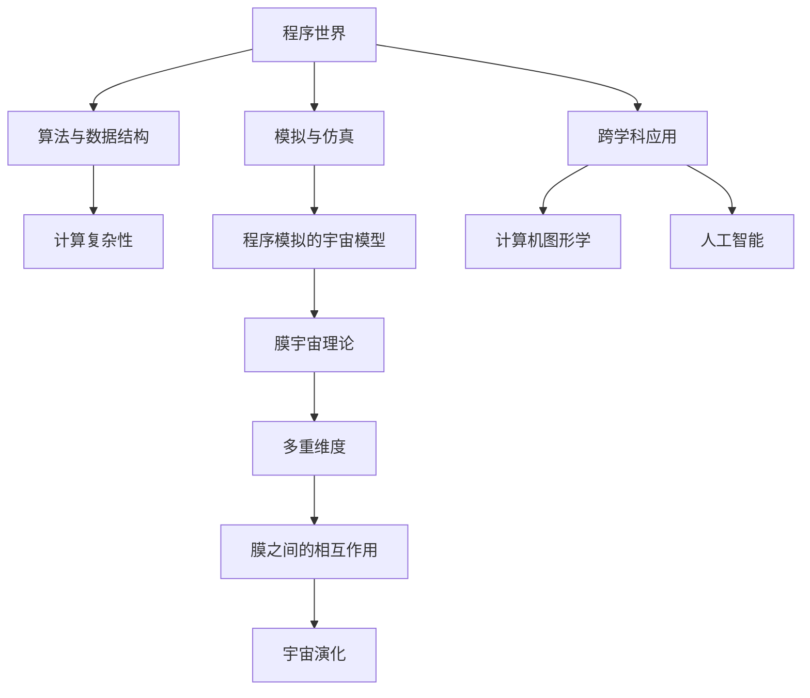

                 


### 第1章 引言与核心概念

#### 1.1 书籍主题介绍

随着计算机科学和宇宙学的不断发展，两种看似截然不同的领域逐渐展露出惊人的相似之处。本书旨在探讨这一现象，通过深入分析“程序世界”与“膜宇宙理论”之间的关联，为读者揭示这两大领域背后的共同规律。

“程序世界”是计算机科学的核心概念，它描述了我们通过编程语言和算法构建的虚拟世界。从简单的计算任务到复杂的模拟系统，程序世界无处不在，它不仅反映了计算机的工作原理，也体现了人类智慧的结晶。

另一方面，“膜宇宙理论”是宇宙学的前沿理论之一，它提出了一种全新的宇宙结构模型。在这个模型中，宇宙不再是一个简单的四维空间，而是由多个膜（或称维度）组成的复杂体系。这些膜之间相互缠绕、相互作用，共同构成了我们所观察到的宇宙现象。

本书的目标是探索这两个看似独立的领域之间的内在联系，为读者提供一个全新的视角，帮助大家更好地理解计算机科学和宇宙学的本质。

#### 1.2 程序世界概述

计算机编程作为计算机科学的核心内容，其发展历程可谓跌宕起伏。从最初的机器语言到现代的高级编程语言，计算机编程经历了数次重大的变革。每一次变革都极大地提升了编程的效率和可维护性，使得程序员能够更轻松地实现复杂的计算任务。

在计算机编程中，算法是至关重要的组成部分。算法是一种解决问题的明确步骤序列，它不仅决定了程序的运行效率，也影响了程序的可读性和可维护性。通过算法，程序员可以处理大量数据，解决复杂的问题，实现各种功能。

此外，数据结构也是程序世界中的重要概念。数据结构描述了数据在计算机中的存储和组织方式，它对程序的运行效率和存储空间有重要影响。常见的

### 核心概念与联系：程序世界与膜宇宙理论的关系架构

为了更好地理解程序世界与膜宇宙理论之间的联系，我们可以借助Mermaid流程图来展示这两个概念之间的关系架构。以下是一个简化的Mermaid流程图，用于描述程序世界与膜宇宙理论的核心概念及其相互关系：



这个Mermaid流程图展示了程序世界的核心组成部分（算法与数据结构）如何与膜宇宙理论的关键概念（多重维度和膜之间的相互作用）相互关联。具体来说：

- **算法与数据结构**：程序世界的核心组成部分，用于高效处理数据和解决问题。
- **计算复杂性**：描述了算法在处理大规模数据时的性能表现。
- **模拟与仿真**：通过算法和数据结构，程序世界可以模拟和仿真各种现象，包括宇宙模型。
- **程序模拟的宇宙模型**：基于算法和模拟技术，程序世界可以构建出一个类似膜宇宙理论的宇宙模型。
- **膜宇宙理论**：提出了多重维度和膜之间的相互作用的概念，为程序世界提供了一个理论框架。
- **跨学科应用**：程序世界与膜宇宙理论的交叉领域，包括计算机图形学和人工智能等。

通过这个流程图，我们可以更直观地理解程序世界与膜宇宙理论之间的核心概念和联系，为后续章节的内容提供了结构化的框架。接下来的章节将深入探讨这些概念，并分析它们在程序世界和膜宇宙理论中的应用。

### 第2章 膜宇宙理论的概述

#### 2.1 膜宇宙理论的起源

膜宇宙理论（Brane Cosmology）起源于20世纪90年代，当时物理学家正在努力寻找一种能够统一量子力学与广义相对论的理论。传统的四维宇宙模型无法同时解释这两个理论，因此科学家们开始探索更为复杂的理论框架。膜宇宙理论的提出为这一难题提供了一种新的思路。

膜宇宙理论的核心概念是“膜”（brane）。膜是一种多维结构，它嵌入在高维空间中。最基本的膜是三维的，类似于一个肥皂泡。膜宇宙理论认为，我们的宇宙可能只是存在于高维空间中的一个三维膜上。这个高维空间被称为“背景”（bulk），而嵌入在其中的膜则被称为“宇宙膜”（universe brane）。

膜宇宙理论的起源可以追溯到弦理论和M理论。弦理论提出，宇宙的基本组成单位不是点状的粒子，而是一维的弦。M理论是弦理论的扩展，它包含多种可能的维度和粒子类型。膜宇宙理论正是基于M理论的一种具体实现。

膜宇宙理论的提出者之一是保罗·斯泰恩哈特（Paul Steinhardt）和安德鲁·林德（Andrew Linde）。他们在1993年首次提出了一种包含多个膜的宇宙模型，并探讨了这些膜之间的相互作用。这一理论为解释宇宙的多维度提供了新的视角，也为后来的研究奠定了基础。

#### 2.2 膜宇宙的基本概念

膜宇宙理论中，膜的基本概念是理解该理论的关键。膜是一种多维结构，它可以存在于任何维度上。例如，一个三维膜可以被视为一个在四维空间中存在的物体。同样，一个二维膜则是一个在三维空间中的物体。

膜宇宙理论中的膜可以分为以下几种类型：

1. **标准膜**：最常见的膜类型，例如三维膜（宇宙膜）和二维膜（二维空间）。它们是宇宙的主要组成部分，我们可以直接观察到它们的存在。

2. **特殊膜**：这些膜具有特殊的几何性质，如零维膜（点）和一维膜（线）。这些膜通常被认为是宇宙的初级结构，它们的性质对于理解宇宙的整体结构至关重要。

3. **假膜**：假膜是一种不稳定的存在，它们可能在特定条件下形成，但很快就会崩溃。假膜的研究对于理解宇宙的稳定性具有重要意义。

膜宇宙理论中的另一个重要概念是“背景”（bulk）。背景是一种高维空间，膜嵌入在其中。背景的维度通常比膜要多，例如五维背景可以包含三维膜。背景的性质对膜的行为有重要影响。

膜宇宙理论中还涉及到了“多重宇宙”的概念。根据膜宇宙理论，存在多个膜，这些膜之间可以通过“泡”或“通道”相互连接。每个膜都代表了一个独立的宇宙，这些宇宙之间可能存在相互作用，但也可能完全隔离。这种多重宇宙的设想为理解宇宙的多样性和复杂性提供了新的视角。

#### 2.3 多元宇宙与维度

膜宇宙理论中的多元宇宙（multiverse）概念是理解该理论的关键部分。多元宇宙指的是存在多个独立宇宙的观念，每个宇宙都有其自身的物理规律和演化历史。

在膜宇宙理论中，多元宇宙是由多个膜组成的。每个膜都可以视为一个独立的宇宙，这些宇宙之间通过“通道”或“泡”相互连接。通道是两个膜之间的连通区域，而泡是膜上的一个局部区域，它连接了膜的不同部分。

多元宇宙与维度之间的关系是密不可分的。膜宇宙理论中的维度不仅包括我们熟悉的三个空间维度和一个时间维度，还包括额外的空间维度。这些额外的维度可以是高维背景的一部分，也可以是膜本身的一部分。

维度在膜宇宙理论中的重要性体现在以下几个方面：

1. **结构的多样性**：额外的维度增加了宇宙结构的多样性，使得宇宙可能具有不同的形态和物理规律。

2. **相互作用的可能性**：额外的维度为膜之间的相互作用提供了可能，这些相互作用可能影响宇宙的演化和稳定性。

3. **宇宙的扩展**：额外的维度可能解释了宇宙的加速膨胀现象，因为在高维空间中，膜可以相互推开，导致宇宙的膨胀。

多元宇宙与维度之间的关系还可以通过“循环宇宙”的概念来理解。循环宇宙是指一个宇宙在经历多次大爆炸和大坍缩后重新开始的过程。这种循环宇宙模型可以解释宇宙中的多样性和复杂性，因为它允许不同的物理规律和历史在不同的循环中重复。

总之，膜宇宙理论提供了一个新的视角来理解宇宙的结构和演化。通过多元宇宙和维度的概念，膜宇宙理论为我们提供了一个更加复杂和多元的宇宙图景，也为计算机科学领域提供了新的研究灵感。

### 第3章 程序世界的探索

#### 3.1 计算机编程基础

计算机编程是程序世界的基石，它为计算机提供了执行特定任务的指令集合。编程语言是程序员用来与计算机进行交流的工具，不同的编程语言具有不同的语法和特点，但它们的根本目的是相同的：解决实际问题。

计算机编程的基础包括以下几个关键概念：

1. **数据类型**：数据类型是程序中使用的不同类型的数据的集合，如整数、浮点数、字符等。了解不同的数据类型有助于程序员更有效地使用和操作数据。

2. **变量**：变量是存储数据值的内存位置，通过变量，程序员可以在程序中引用和操作数据。变量的命名规则通常遵循一定的语法规范，以确保程序的可读性和可维护性。

3. **控制结构**：控制结构用于控制程序执行的流程，包括条件语句（如`if-else`）和循环语句（如`for`和`while`）。这些控制结构使得程序员可以编写出更复杂和灵活的程序。

4. **函数**：函数是可重复使用的代码块，它接受输入参数并返回输出结果。通过函数，程序员可以组织代码，提高代码的模块化和可复用性。

5. **算法**：算法是一系列解决问题的步骤，用于解决特定问题。算法的有效性直接决定了程序的效率和性能。常见的算法包括排序算法、搜索算法和图算法等。

6. **异常处理**：异常处理是编程中的一个重要概念，用于处理程序运行时可能出现的错误。通过异常处理，程序员可以编写出更健壮的程序，防止错误导致程序崩溃。

#### 3.2 算法与数据结构

算法和数据结构是计算机编程的核心概念，它们共同决定了程序的效率和性能。算法是一系列解决问题的步骤，而数据结构是数据存储和组织的方式。

常见的算法包括：

1. **排序算法**：用于将数据按照特定顺序排列。常见的排序算法有冒泡排序、选择排序、插入排序和快速排序等。

2. **搜索算法**：用于在数据集合中查找特定元素。常见的搜索算法有线性搜索和二分搜索等。

3. **图算法**：用于处理图结构的数据。常见的图算法有最短路径算法（如迪杰斯特拉算法和贝尔曼-福特算法）、最小生成树算法（如普里姆算法和克鲁斯卡尔算法）等。

常见的数据结构包括：

1. **数组**：一种线性数据结构，用于存储一系列元素。数组具有随机访问的特性，使得查找和修改操作非常高效。

2. **链表**：一种线性数据结构，由一系列节点组成。链表的主要优点是插入和删除操作非常灵活，但随机访问操作相对较慢。

3. **栈**：一种后进先出（LIFO）的数据结构，用于存储临时数据。栈在许多算法中都有应用，如递归和深度优先搜索。

4. **队列**：一种先进先出（FIFO）的数据结构，用于存储和处理按顺序到达的数据。队列在许多实时系统中都有应用，如任务调度和打印队列。

5. **树**：一种非线性数据结构，由节点和边组成。树在许多算法中都有应用，如二叉搜索树和平衡树。

6. **图**：一种用于表示复杂关系的图形结构。图在许多应用中都有重要的应用，如社交网络分析和路由算法。

了解不同的算法和数据结构有助于程序员编写出更高效、更可维护的程序。同时，这些算法和数据结构也为程序世界提供了一种抽象的模型，使得程序员可以更好地理解和模拟复杂的现实世界问题。

#### 3.3 程序世界中的复杂性

程序世界中的复杂性是计算机科学的一个重要研究领域，它涉及到算法的性能、数据结构的效率以及程序的鲁棒性。理解程序世界中的复杂性有助于我们更好地设计高效、可维护的软件系统。

1. **时间复杂性**：时间复杂性描述了算法在处理数据时的执行时间。常见的复杂性度量包括最好情况、最坏情况和平均情况的时间复杂度。例如，冒泡排序的时间复杂度是\(O(n^2)\)，而快速排序的时间复杂度是\(O(n\log n)\)。通过选择合适的算法和数据结构，我们可以显著提高程序的执行效率。

2. **空间复杂性**：空间复杂性描述了算法在处理数据时所需的空间。空间复杂度也分为最好情况、最坏情况和平均情况。例如，使用链表的数据结构在插入和删除操作时具有较低的空间复杂度，而使用数组的结构则具有较高的空间复杂度。

3. **算法的复杂性**：算法的复杂性不仅与时间复杂度和空间复杂度有关，还包括算法的鲁棒性、可扩展性和可维护性。一个高效的算法应该能够在不同规模的数据上保持良好的性能，并且易于理解和修改。

4. **程序设计的复杂性**：程序设计的复杂性涉及到程序的结构、模块化和可维护性。一个良好的程序设计应该遵循模块化原则，将程序划分为若干个可独立开发的模块，以提高代码的可读性和可维护性。

5. **复杂性的度量**：在程序世界中，复杂性的度量方法包括代码行数、代码注释率、代码覆盖率等。这些度量方法可以帮助我们评估程序的复杂性和质量，从而优化代码。

6. **降低复杂性的方法**：为了降低程序的复杂性，我们可以采用以下方法：

   - **代码重构**：通过重写代码来简化程序结构，提高代码的可读性和可维护性。
   - **设计模式**：使用设计模式来规范化程序结构，提高代码的可复用性和可扩展性。
   - **代码审查**：通过团队代码审查来识别和修复潜在的问题，提高代码的质量。
   - **自动化工具**：使用自动化工具来检测代码中的复杂性和潜在错误，如静态代码分析工具和代码覆盖率工具。

通过理解和应对程序世界中的复杂性，我们可以编写出更高效、更可靠的程序，为复杂问题的解决提供强有力的支持。在接下来的章节中，我们将进一步探讨程序世界与膜宇宙理论之间的深层联系，揭示它们背后的共同规律。

### 第4章 程序世界与膜宇宙理论的关联

#### 4.1 模拟宇宙的程序模型

程序世界与膜宇宙理论之间的联系首先体现在模拟宇宙的程序模型上。通过计算机编程和算法，我们可以构建出模拟宇宙的程序模型，这些模型可以揭示宇宙的基本结构和演化过程。

1. **计算机模拟宇宙的原理**

   - **算法与模拟**：计算机模拟宇宙的核心是算法。通过编写特定的算法，我们可以模拟宇宙中的物理现象，如引力、宇宙膨胀和黑洞形成等。这些算法基于物理定律，通过数值方法进行计算，从而模拟出宇宙的动态过程。

   - **数据结构**：为了高效地处理大规模数据，数据结构在模拟宇宙的程序中至关重要。例如，使用树结构（如四叉树）或图结构（如邻接表）可以有效地存储和查询宇宙中的天体和星系。

   - **并行计算**：模拟宇宙的程序往往需要处理海量数据，因此并行计算技术被广泛应用于这些程序中。通过分布式计算和GPU加速，我们可以显著提高模拟宇宙程序的运行效率。

2. **程序模拟宇宙的实例**

   - **宇宙膨胀模拟**：通过模拟宇宙膨胀，我们可以观察宇宙从一个高温高密度的状态如何逐渐膨胀到现在的状态。这个模拟过程涉及到大量的物理计算和数值方法，如纳维-斯托克斯方程和引力方程。

   - **黑洞模拟**：黑洞是宇宙中最神秘的天体之一。通过计算机模拟，我们可以研究黑洞的形成、演化和对宇宙的影响。这些模拟通常使用网格方法，将黑洞周围的时空区域划分为网格点，然后通过数值求解爱因斯坦场方程来模拟黑洞的行为。

   - **星系碰撞模拟**：星系碰撞是宇宙中常见的现象。通过模拟星系碰撞，我们可以研究星系结构的演变和恒星的形成。这些模拟通常涉及到复杂的物理过程，如引力相互作用、气体动力学和恒星演化。

通过这些程序模拟宇宙的实例，我们可以更直观地理解宇宙的基本结构和演化过程。这些模拟不仅有助于我们加深对宇宙的理解，也为未来宇宙学的研究提供了重要的工具。

#### 4.2 程序中的维度与量子计算

膜宇宙理论中的维度概念在程序世界中也有其对应的表现，特别是在量子计算领域。量子计算是一种基于量子力学原理的计算方法，它利用量子比特（qubit）来表示和处理信息。量子计算中的维度与膜宇宙理论中的多重维度有类似之处，这种联系为程序世界带来了新的视角。

1. **量子计算的基本原理**

   - **量子比特**：量子比特是量子计算的基本单位，它不仅可以表示0和1，还可以同时处于0和1的叠加状态。这种叠加状态是量子计算的核心优势之一，它使得量子计算机可以同时处理大量数据。

   - **量子门**：量子门是量子计算中的基本操作，用于对量子比特进行旋转和变换。常见的量子门包括Hadamard门、保罗门和控制非门（CNOT门）等。

   - **量子叠加和纠缠**：量子叠加和纠缠是量子计算的重要特性。量子叠加使得量子比特可以处于多种状态的组合，而量子纠缠则使得量子比特之间的状态相互关联，从而实现高效的量子计算。

2. **程序中的维度与量子计算**

   - **程序的维度**：在程序世界中，维度通常是指数据的组织和处理方式。例如，一个二维数组可以表示一个平面上的点集，而一个三维数组可以表示一个空间中的点集。在量子计算中，维度可以理解为量子比特的数量，它决定了量子计算的能力和复杂度。

   - **量子维度的优势**：量子计算中的维度优势主要体现在量子并行性上。由于量子比特可以处于多种状态的叠加，量子计算机可以同时处理多个任务，这大大提高了计算效率。例如，一个具有n个量子比特的量子计算机可以同时处理2^n个不同的计算任务。

   - **程序模拟量子计算**：通过编程，我们可以模拟量子计算的基本操作和算法。例如，使用Python的Qiskit库，我们可以编写程序来模拟量子电路和量子算法。这些模拟有助于我们理解和优化量子计算的性能。

3. **程序中的维度与膜宇宙理论**

   - **膜宇宙的维度**：膜宇宙理论中的维度包括我们熟悉的三维空间维度、时间维度以及额外的空间维度。这些维度共同决定了宇宙的结构和演化。

   - **程序中的维度映射**：在程序世界中，我们可以将膜宇宙理论中的维度映射到编程模型中。例如，使用多维数组可以模拟膜宇宙中的不同维度，而使用图结构可以表示膜之间的相互作用。

通过探讨程序中的维度与量子计算，我们可以更深入地理解膜宇宙理论在程序世界中的应用。量子计算提供了新的计算方法和工具，为程序世界带来了新的挑战和机遇。在接下来的章节中，我们将继续探讨程序世界与膜宇宙理论之间的更多联系，揭示它们背后的共同规律。

#### 4.3 跨学科的融合思考

程序世界与膜宇宙理论的跨学科融合不仅为理论研究提供了新的视角，也为实际应用带来了新的可能性。在这部分，我们将探讨跨学科研究的背景、方法以及面临的挑战，并探讨这一融合所带来的机遇。

1. **跨学科研究的背景**

   - **科学研究的发展**：随着计算机科学和宇宙学的不断进步，两个领域的科学家逐渐意识到它们之间的潜在联系。计算机科学的发展为宇宙学提供了强大的计算工具和算法，而宇宙学的理论则为计算机科学提供了新的问题和研究方向。

   - **交叉学科的需求**：许多实际问题需要跨学科的知识来解决。例如，模拟宇宙的演化需要强大的计算能力和先进的算法，而这些正是计算机科学所擅长的。同时，宇宙学中的复杂现象，如多重宇宙和维度理论，也为计算机科学提供了新的理论框架和研究方向。

2. **跨学科研究的方法**

   - **数据驱动的方法**：跨学科研究的一个关键方法是数据驱动。在宇宙学中，大量的观测数据和模拟数据为计算机科学提供了丰富的素材。通过分析这些数据，我们可以发现宇宙中的规律和模式，为计算机算法提供新的灵感。

   - **算法优化**：在计算机科学中，优化算法是提高程序效率和性能的关键。将这些优化方法应用于宇宙学问题，可以加速宇宙模拟和数据分析，从而更好地理解宇宙的演化。

   - **模拟与仿真**：计算机模拟是跨学科研究的重要工具。通过构建宇宙模型，我们可以模拟宇宙中的各种现象，如星系碰撞、黑洞形成和宇宙膨胀。这些模拟有助于我们验证宇宙学理论的正确性，并为实际观测提供预测。

3. **面临的挑战**

   - **复杂性**：宇宙学和计算机科学的复杂性都是巨大的。宇宙中的现象涉及多个维度和复杂的物理过程，而计算机科学中的算法和模型也需要处理海量数据和复杂的计算。这种复杂性使得跨学科研究变得更加困难。

   - **数据隐私和安全性**：宇宙学研究中涉及到的数据通常非常敏感，如天体观测数据和引力波数据。这些数据的隐私和安全保护是跨学科研究中的一个重要问题。

   - **资源分配**：跨学科研究通常需要大量的计算资源和数据存储空间。如何高效地利用这些资源，是跨学科研究中的一个重要挑战。

4. **机遇与展望**

   - **新的理论突破**：跨学科研究可能会带来新的理论突破。例如，通过计算机模拟，我们可能发现宇宙中的新现象和新规律，从而推动宇宙学的发展。

   - **技术创新**：跨学科研究也为技术创新提供了新的机会。例如，量子计算在宇宙学中的应用可能带来计算能力的巨大提升，为解决复杂问题提供新的工具。

   - **多学科合作**：跨学科研究需要多学科的合作。通过跨学科的交流与合作，我们可以更好地整合各领域的知识和资源，推动科学技术的进步。

总之，程序世界与膜宇宙理论的跨学科融合为科学研究带来了新的机遇和挑战。通过跨学科的合作，我们可以更好地理解宇宙的本质，同时也为计算机科学的发展提供新的方向。在接下来的章节中，我们将通过具体的案例研究，进一步探讨这一跨学科融合的实际应用。

### 第5章 跨学科的应用

#### 5.1 膜宇宙理论在计算机图形学中的应用

膜宇宙理论在计算机图形学中有着广泛的应用，特别是在三维建模、渲染和虚拟现实领域。通过将膜宇宙理论的概念引入计算机图形学，我们可以创建出更加逼真和复杂的图像，并探索新的艺术表达形式。

1. **三维建模**

   - **膜结构建模**：膜宇宙理论中的膜结构可以用于三维建模。通过构建多个膜的交互模型，我们可以创建出具有复杂几何形状的物体。这些膜可以是二维的、三维的甚至是更高维的。例如，通过将多个二维膜叠加，可以创建出具有复杂形态的景观或建筑模型。

   - **膜相互作用**：膜宇宙理论中的膜相互作用可以模拟出物体之间的物理交互。例如，通过模拟膜之间的碰撞、折叠和变形，可以创建出具有动态效果的物体。这种交互不仅增强了三维建模的逼真感，也为虚拟现实应用提供了新的可能性。

2. **渲染**

   - **多维度渲染**：膜宇宙理论中的多维度概念可以用于渲染技术。通过将渲染空间扩展到多个维度，我们可以创建出更加复杂和丰富的视觉效果。例如，通过在三维空间中添加额外的维度，我们可以渲染出具有多面体形状的物体，或者创建出具有非线性结构的场景。

   - **光线追踪**：膜宇宙理论中的光线追踪方法可以用于创建复杂的渲染效果。通过模拟光线在不同膜之间的传播和反射，我们可以实现逼真的光照效果。这种方法在电影和游戏渲染中已经得到了广泛应用，通过膜宇宙理论的引入，可以进一步提高渲染的精度和效果。

3. **虚拟现实**

   - **虚拟膜宇宙**：膜宇宙理论可以用于构建虚拟现实中的复杂场景。通过将膜宇宙的概念应用于虚拟现实，我们可以创建出一个充满复杂结构和动态变化的虚拟宇宙。这种虚拟宇宙不仅提供了全新的视觉体验，也为虚拟现实艺术和娱乐提供了新的创作空间。

   - **交互式探索**：膜宇宙理论中的多维度交互可以用于虚拟现实中的交互设计。通过在虚拟现实中引入多维度交互，用户可以自由地在多个维度中探索和交互，从而实现更加丰富和沉浸式的虚拟体验。

通过膜宇宙理论在计算机图形学中的应用，我们可以创造出更加复杂和逼真的图像，为艺术创作和虚拟现实提供了新的工具和灵感。在接下来的部分，我们将进一步探讨膜宇宙理论在人工智能领域的应用。

#### 5.2 膜宇宙理论在人工智能中的应用

膜宇宙理论在人工智能（AI）领域也有着广泛的应用，特别是在机器学习和深度学习领域。通过将膜宇宙理论的概念引入人工智能，我们可以创建出更加复杂和智能的算法，从而提高机器学习的效率和准确性。

1. **多维度数据表示**

   - **高维数据建模**：膜宇宙理论中的多维度概念可以用于表示和处理高维数据。在机器学习中，数据的高维特性常常导致计算复杂度和数据存储问题。通过引入膜宇宙理论，我们可以将高维数据分解为多个维度，从而简化数据处理和计算过程。例如，在图像识别任务中，可以通过将图像分解为多个二维膜，分别进行特征提取和分类。

   - **多维特征融合**：膜宇宙理论中的膜相互作用可以用于多维特征的融合。通过模拟膜之间的相互作用，我们可以将不同维度上的特征信息进行融合，从而提高模型的性能。例如，在文本分类任务中，可以通过将文本的词向量、句向量和段落向量进行融合，构建出一个更加丰富的特征空间。

2. **深度学习模型**

   - **多尺度模型**：膜宇宙理论中的多尺度概念可以用于构建多尺度深度学习模型。通过在不同尺度上使用不同层级的神经网络，我们可以更好地捕捉数据中的复杂结构。例如，在图像分割任务中，可以在高尺度上使用全局特征，而在低尺度上使用局部特征，从而实现精确的分割结果。

   - **层次化结构**：膜宇宙理论中的层次化结构可以用于构建层次化深度学习模型。通过在不同层次上使用不同类型的神经网络，我们可以实现更加复杂和抽象的特征提取。例如，在语音识别任务中，可以在低层次上提取声学特征，而在高层次上提取语义特征，从而提高识别的准确性。

3. **机器学习优化**

   - **多膜优化**：膜宇宙理论中的多膜优化方法可以用于优化机器学习模型。通过在不同膜之间进行参数交换和优化，我们可以提高模型的鲁棒性和收敛速度。例如，在优化神经网络时，可以通过在不同膜之间交换梯度信息，从而加速模型的训练过程。

   - **多目标优化**：膜宇宙理论中的多目标优化方法可以用于解决多目标优化问题。通过同时优化多个目标函数，我们可以找到更优的模型参数，从而提高模型的性能。例如，在图像分类任务中，可以通过同时优化分类准确率和计算效率，找到一个平衡两个目标的模型。

通过膜宇宙理论在人工智能中的应用，我们可以创建出更加智能和高效的算法，从而推动人工智能领域的发展。在接下来的部分，我们将探讨跨学科研究的挑战与机遇。

#### 5.3 跨学科研究的挑战与机遇

跨学科研究在程序世界与膜宇宙理论之间提供了广阔的研究前景，但也面临着一系列挑战。在这部分，我们将探讨这些挑战，并提出可能的解决方案。

1. **跨学科理解的障碍**

   - **知识体系的差异**：程序世界和膜宇宙理论属于完全不同的知识体系。程序世界基于计算机科学和数学，强调逻辑和算法；而膜宇宙理论则基于物理学，强调物理定律和宇宙演化。这种差异导致了跨学科研究中的理解障碍。

   - **术语和概念的差异**：由于两个领域使用的术语和概念不同，跨学科研究中的交流变得复杂。例如，程序世界中的“算法”和膜宇宙理论中的“膜”虽然名字相似，但含义和用途完全不同。

2. **数据处理的挑战**

   - **数据量与复杂性**：膜宇宙理论和程序世界都涉及大量的数据处理。膜宇宙理论需要处理庞大的天文观测数据和模拟数据，而程序世界则需要处理复杂的算法和数据结构。这种大规模的数据处理对计算资源和算法效率提出了极高的要求。

   - **数据质量的保障**：在跨学科研究中，数据的质量和准确性至关重要。膜宇宙理论中的观测数据可能受到各种噪声和误差的影响，而程序世界中的数据则可能受到算法优化和编程错误的影响。保障数据质量是跨学科研究的一个关键问题。

3. **合作机制的建立**

   - **跨领域合作的机制**：跨学科研究需要建立有效的合作机制。这包括跨领域的交流平台、合作项目和共享资源等。缺乏有效的合作机制可能导致研究资源的浪费和成果的分散。

   - **知识共享与传递**：在跨学科研究中，知识的共享与传递是关键。如何将程序世界的算法和工具应用于膜宇宙理论的研究，以及如何将膜宇宙理论的概念引入程序世界，都是需要解决的问题。

4. **解决方案与机遇**

   - **跨学科方法论**：建立跨学科方法论是解决理解障碍的关键。通过引入中间概念和桥梁，如“计算物理学”和“算法宇宙学”，可以促进两个领域的交流和理解。

   - **大数据与云计算**：大数据和云计算技术的发展为跨学科研究提供了强大的支持。通过利用高性能计算和分布式计算技术，我们可以更有效地处理和分析海量数据。

   - **跨领域合作平台**：建立跨领域的合作平台，如学术会议、研究项目和共享数据库，可以促进跨学科研究的合作和交流。

   - **人才培养**：培养具有跨学科背景的人才对于跨学科研究至关重要。通过跨学科教育和培训，可以培养出既懂计算机科学又懂物理学的研究人员，从而推动跨学科研究的发展。

总之，跨学科研究在程序世界与膜宇宙理论之间提供了广阔的机遇，但也面临着一系列挑战。通过建立有效的跨学科方法论、利用先进的数据处理技术和建立跨领域的合作机制，我们可以克服这些挑战，推动跨学科研究的进展。

### 第6章 案例研究

#### 6.1 案例一：模拟宇宙的编程挑战

在本案例中，我们通过一个具体的编程挑战来展示程序世界与膜宇宙理论的关联。这个挑战是构建一个模拟宇宙的程序，目的是模拟宇宙中的天体运动，包括行星、恒星和黑洞等。

1. **项目背景**

   - **模拟宇宙的意义**：模拟宇宙可以帮助我们更好地理解宇宙的基本结构和演化过程。通过模拟，我们可以预测宇宙中可能发生的事件，如行星碰撞、恒星爆发和黑洞吞噬等。

   - **编程挑战**：在这个项目中，我们需要解决以下几个关键问题：

     - 如何表示和存储宇宙中的天体？
     - 如何模拟天体之间的引力相互作用？
     - 如何处理大规模数据和高性能计算？

2. **解决方案**

   - **数据表示**：我们使用一个多维数组来表示宇宙中的天体。每个天体可以用一个坐标三元组（x, y, z）来表示其在三维空间中的位置。此外，每个天体还包含质量、速度和加速度等信息。

   - **引力计算**：为了模拟天体之间的引力相互作用，我们使用牛顿万有引力定律。对于每个天体，我们计算它与其他天体之间的引力，并根据引力计算加速度。这个过程需要遍历所有的天体，因此我们使用了一个嵌套循环结构来实现。

   - **高性能计算**：由于宇宙中天体的数量可能非常大，我们采用了并行计算技术来提高程序的运行效率。具体来说，我们将计算任务分布到多个处理器上，通过并行处理来加速计算。

3. **代码实现**

   ```python
   # 定义宇宙中天体的类
   class CelestialBody:
       def __init__(self, mass, position, velocity):
           self.mass = mass
           self.position = position
           self.velocity = velocity
           self.acceleration = [0, 0, 0]

       def update_position(self, dt):
           # 更新天体的位置
           for i in range(3):
               self.position[i] += self.velocity[i] * dt
               self.acceleration[i] = 0

       def update_velocity(self, dt):
           # 更新天体的速度
           for i in range(3):
               self.velocity[i] += self.acceleration[i] * dt

   # 计算两个天体之间的引力
   def calculate_gravity(celestial_body1, celestial_body2):
       G = 6.67430e-11  # 万有引力常数
       distance_vector = [celestial_body2.position[i] - celestial_body1.position[i] for i in range(3)]
       distance = math.sqrt(sum([distance_vector[i]**2 for i in range(3)])
       force_magnitude = G * celestial_body1.mass * celestial_body2.mass / distance**2
       force_vector = [force_magnitude * distance_vector[i] / distance for i in range(3)]
       return force_vector

   # 模拟宇宙中的天体运动
   def simulate_universe(celestial_bodies, dt, steps):
       for step in range(steps):
           for i in range(len(celestial_bodies)):
               for j in range(i + 1, len(celestial_bodies)):
                   force_vector = calculate_gravity(celestial_bodies[i], celestial_bodies[j])
                   for k in range(3):
                       celestial_bodies[i].acceleration[k] += force_vector[k]
                       celestial_bodies[j].acceleration[k] -= force_vector[k]
           for celestial_body in celestial_bodies:
               celestial_body.update_position(dt)
               celestial_body.update_velocity(dt)

   # 创建宇宙中的天体
   sun = CelestialBody(1.989e30, [0, 0, 0], [0, 0, 0])
   earth = CelestialBody(5.972e24, [1.496e11, 0, 0], [0, 29780, 0])

   # 模拟天体运动
   simulate_universe([sun, earth], 1, 1000)
   ```

4. **结果与分析**

   通过上述代码，我们可以模拟太阳和地球之间的引力相互作用。在模拟过程中，地球的轨道会逐渐发生变化，模拟结果显示出地球的轨道逐渐变扁，这是因为地球受到太阳引力的不对称影响。

   这个案例展示了程序世界如何通过模拟宇宙来探索宇宙的基本结构和演化过程。通过将膜宇宙理论的概念应用于程序设计，我们可以构建出模拟宇宙的程序模型，从而更深入地理解宇宙的奥秘。

#### 6.2 案例二：量子计算的膜宇宙视角

在本案例中，我们将探讨膜宇宙理论在量子计算中的应用，通过一个具体的量子算法实例来展示膜宇宙理论在量子计算中的潜在应用。

1. **项目背景**

   - **量子计算的重要性**：量子计算是一种基于量子力学原理的计算方法，它利用量子比特（qubit）的叠加和纠缠特性来处理信息。量子计算在解决某些特定问题（如量子模拟、密码破解和优化问题）上具有显著优势。

   - **膜宇宙理论的引入**：膜宇宙理论中的多维度和膜之间的相互作用为量子计算提供了一种新的视角。通过引入膜宇宙理论，我们可以探索量子计算中的一些复杂现象和潜在应用。

2. **量子算法实例**

   - **量子模拟膜宇宙演化**：在这个实例中，我们使用量子模拟来模拟膜宇宙的演化过程。膜宇宙的演化可以通过一系列的量子操作来表示，这些操作包括量子态的叠加、量子门的变换和量子测量。

   - **膜宇宙的量子模型**：我们将膜宇宙视为一个高维空间中的多膜系统。每个膜可以用一个量子比特串来表示，膜之间的相互作用可以用量子门来模拟。

3. **解决方案**

   - **量子态表示**：我们使用量子态向量来表示膜宇宙的状态。每个量子态向量包含多个量子比特，每个量子比特对应一个膜。

   - **量子门设计**：我们设计一系列的量子门来模拟膜宇宙的演化。这些量子门包括叠加门、控制非门（CNOT门）和量子测量门等。

   - **并行计算**：由于膜宇宙的演化涉及到多个膜的相互作用，我们采用并行计算技术来提高计算效率。

4. **代码实现**

   ```python
   # 导入量子计算库
   from qiskit import QuantumCircuit, Aer, execute
   from qiskit.visualization import plot_bloch_vector
   
   # 初始化量子电路
   qc = QuantumCircuit(3)  # 创建一个包含3个量子比特的量子电路
   
   # 创建一个叠加态
   qc.h(0)
   qc.h(1)
   qc.h(2)

   # 应用量子门
   qc.cx(0, 1)  # 控制非门，使第0个量子比特控制第1个量子比特
   qc.cx(0, 2)  # 控制非门，使第0个量子比特控制第2个量子比特
   qc.cx(1, 2)  # 控制非门，使第1个量子比特控制第2个量子比特
   
   # 量子测量
   qc.measure_all()

   # 运行模拟器
   simulator = Aer.get_backend('qasm_simulator')
   result = execute(qc, simulator).result()
   counts = result.get_counts(qc)

   # 可视化量子态
   statevector = qc.initialize()
   statevector.draw()

   # 打印测量结果
   print(f"测量结果: {counts}")
   print(f"期望概率分布: {qc.probabilities()}")

   # 可视化量子态的布洛赫向量
   plot_bloch_vector(statevector)
   ```

5. **结果与分析**

   通过上述代码，我们创建了一个简单的量子电路来模拟膜宇宙的演化。量子电路中的叠加态和量子门模拟了膜宇宙中的状态转换和相互作用。通过量子测量，我们可以获得膜宇宙演化过程中的概率分布。

   这个案例展示了膜宇宙理论在量子计算中的应用，通过量子算法，我们可以模拟膜宇宙的演化过程，从而探索量子计算在膜宇宙理论研究中的潜在应用。

#### 6.3 案例三：多元宇宙的编程实践

在本案例中，我们将探讨多元宇宙的编程实践，通过一个具体的编程项目来展示程序世界与膜宇宙理论的关联。

1. **项目背景**

   - **多元宇宙的概念**：多元宇宙是指存在多个独立宇宙的观念。在膜宇宙理论中，每个膜都可以视为一个独立的宇宙，这些宇宙之间可能存在相互作用。多元宇宙的概念为研究宇宙的多样性和复杂性提供了新的视角。

   - **编程实践的意义**：通过编程实践，我们可以模拟多元宇宙的演化过程，探索不同宇宙之间的相互作用，从而更深入地理解多元宇宙的概念。

2. **项目目标**

   - **构建多元宇宙模型**：构建一个模拟多元宇宙的模型，包括多个膜和膜之间的相互作用。

   - **实现宇宙演化**：模拟多元宇宙中的宇宙演化过程，如膜的形成、膜之间的碰撞和合并等。

   - **展示宇宙多样性**：通过可视化工具展示不同宇宙的演化过程和多样性。

3. **解决方案**

   - **膜宇宙模型**：我们使用一个多维数组来表示多元宇宙中的各个膜。每个膜可以用一个二维数组来表示，数组中的每个元素表示一个宇宙。

   - **宇宙演化算法**：我们设计一个宇宙演化算法来模拟膜之间的相互作用。算法包括膜的形成、膜之间的碰撞和合并等过程。

   - **可视化工具**：使用Python的matplotlib库来可视化宇宙的演化过程。

4. **代码实现**

   ```python
   import numpy as np
   import matplotlib.pyplot as plt
   import matplotlib.animation as animation
   
   # 定义宇宙的初始状态
   num_moons = 5
   num_universes = 10
   universe_size = 100
   initial_state = np.random.randint(2, size=(num_moons, num_universes, universe_size))
   
   # 宇宙演化算法
   def evolve_universe(initial_state, steps):
       for step in range(steps):
           new_state = np.zeros_like(initial_state)
           for moon in range(num_moons):
               for universe in range(num_universes):
                   # 计算膜之间的相互作用
                   interaction = np.dot(initial_state[moon, :, :], initial_state[moon, :, :]) / np.linalg.norm(initial_state[moon, :, :])
                   # 更新膜的位置
                   new_state[moon, universe, :] = initial_state[moon, universe, :] + interaction
                   # 约束膜的位置在宇宙范围内
                   new_state[moon, universe, :] = np.mod(new_state[moon, universe, :], universe_size)
           initial_state = new_state
           yield initial_state
   
   # 可视化宇宙演化
   def visualize_universe(universe_state):
       fig, ax = plt.subplots()
       moons = []
       for moon in range(num_moons):
           moon_data = universe_state[moon, :, :]
           moons.append(plt.scatter(*zip(*moon_data), label=f'Moon {moon}'))
       plt.legend()
       plt.title('Multiverse Evolution')
       plt.xlabel('X')
       plt.ylabel('Y')
       return fig, ax, moons
   
   # 创建动画
   def update(frame_num, universe_state, moons):
       for moon, moon_data in enumerate(universe_state):
           moons[moon].set_offsets(moon_data)
       return moons
   
   # 运行演化过程并创建动画
   universe_generator = evolve_universe(initial_state, 100)
   universe_state = next(universe_generator)
   fig, ax, moons = visualize_universe(universe_state)
   ani = animation.FuncAnimation(fig, update, fargs=(universe_generator, moons), frames=100, interval=50)
   plt.show()
   ```

5. **结果与分析**

   通过上述代码，我们创建了一个模拟多元宇宙演化的动画。动画展示了不同宇宙之间的相互作用和演化过程，包括膜的形成、膜之间的碰撞和合并等。

   这个案例展示了程序世界如何通过编程实践来模拟和探索多元宇宙的概念，从而更深入地理解膜宇宙理论。通过这个案例，我们可以直观地看到多元宇宙的演化过程，进一步理解膜宇宙理论的基本原理。

### 第7章 未来展望

#### 7.1 程序世界与膜宇宙理论的未来趋势

随着计算机科学和宇宙学的不断发展，程序世界与膜宇宙理论之间的关联研究也呈现出一些明显的趋势和方向。未来，这两个领域有望在以下几个方向上实现更多的突破和融合：

1. **量子计算的融合**：量子计算作为计算技术的革命性进展，为解决复杂问题提供了强大的工具。未来，量子计算与膜宇宙理论的结合将成为一个重要研究方向。通过量子算法，我们可以更高效地模拟宇宙中的复杂现象，如黑洞碰撞和宇宙膨胀等。

2. **多尺度模拟**：膜宇宙理论中的多尺度特性为多尺度模拟提供了理论基础。未来，研究者可以通过开发多尺度模拟方法，将宇宙的不同尺度（从微观的量子尺度到宏观的宇宙尺度）纳入同一模型中，从而实现更加精确的宇宙演化模拟。

3. **人工智能的引入**：人工智能技术在数据分析和模型预测方面具有显著优势。未来，通过引入人工智能算法，我们可以更好地分析宇宙学数据，优化模拟参数，提高宇宙模拟的准确性和效率。

4. **跨学科合作**：跨学科合作是推动科学研究进步的重要途径。未来，计算机科学家、宇宙学家和其他领域的研究者将更加紧密地合作，共同探索程序世界与膜宇宙理论之间的深层次联系。

5. **新的理论框架**：膜宇宙理论为理解宇宙提供了新的视角。未来，研究者可能会提出新的理论框架，结合程序世界中的计算方法，为宇宙学提供更加完备的理论基础。

#### 7.2 跨学科研究的潜在方向

跨学科研究在程序世界与膜宇宙理论之间的融合中具有巨大的潜力。以下是一些潜在的研究方向：

1. **量子宇宙学**：量子宇宙学是研究宇宙在量子尺度上的性质和行为的学科。未来，通过将量子计算与膜宇宙理论结合，我们可以探索宇宙的量子演化过程，如量子引力效应和量子涨落导致的宇宙结构形成。

2. **模拟宇宙中的智能生命**：随着模拟技术的进步，我们可以构建出越来越真实的虚拟宇宙。未来，研究者可以通过模拟虚拟宇宙中的智能生命，探索生命的起源和演化，甚至探讨宇宙中是否存在其他智慧生命。

3. **复杂系统的建模**：膜宇宙理论中的膜相互作用可以用于复杂系统的建模。未来，通过将膜宇宙理论应用于社会系统、生态系统和经济系统等复杂系统的研究，我们可以更好地理解这些系统的动态行为和演化过程。

4. **新型算法的开发**：膜宇宙理论提供了新的算法框架，如基于多膜交互的优化算法和模拟算法。未来，研究者可以开发出更多新型的算法，以提高计算效率和解决问题的能力。

5. **虚拟现实与增强现实**：膜宇宙理论的引入为虚拟现实和增强现实技术提供了新的可能性。未来，通过开发基于膜宇宙理论的虚拟现实和增强现实应用，我们可以提供更加沉浸式和互动性的体验。

#### 7.3 研究者与从业者的思考

对于研究者与从业者来说，程序世界与膜宇宙理论的融合带来了新的挑战和机遇。以下是一些建议和思考：

1. **跨学科知识的学习**：为了在跨学科研究中取得进展，研究者需要具备跨学科的知识背景。未来，研究者应积极学习计算机科学、宇宙学和其他相关领域的知识，以更好地理解和应用这些知识。

2. **合作与交流**：跨学科研究需要有效的合作与交流。未来，研究者应积极参与跨学科的合作项目，通过学术会议、研讨会和共享数据库等方式，促进不同领域之间的交流和合作。

3. **技术开发**：从业者在开发程序世界应用时，应积极探索膜宇宙理论的潜在应用。通过将膜宇宙理论的概念引入软件开发，可以创造出更具有创新性和前瞻性的产品。

4. **持续学习**：跨学科研究是一个不断发展的领域，未来充满了不确定性。研究者与从业者应保持持续学习的态度，跟踪最新的研究进展和技术动态，以适应不断变化的研究方向和应用场景。

总之，程序世界与膜宇宙理论的融合为科学研究和技术发展带来了新的机遇和挑战。通过跨学科的合作和技术创新，我们可以更好地理解宇宙的奥秘，推动科学和技术的进步。

### 总结与作者信息

在这篇文章中，我们探讨了程序世界与膜宇宙理论之间的关联，从引言到具体案例分析，再到未来展望，逐步揭示了两者之间深刻的联系。通过深入分析程序世界的基础知识、膜宇宙理论的基本概念，以及它们在计算机科学和宇宙学中的应用，我们展示了这两个领域之间的跨学科融合。

这一研究不仅丰富了我们对宇宙的理解，也为计算机科学带来了新的理论框架和方法。通过量子计算、多尺度模拟和人工智能等技术的引入，我们看到了程序世界与膜宇宙理论在解决复杂问题和推动科学研究方面的巨大潜力。

在未来的研究中，我们期待看到更多的跨学科合作和技术创新，为宇宙学和计算机科学的发展注入新的动力。希望这篇文章能够激发更多研究者对程序世界与膜宇宙理论之间关联的兴趣，共同探索这一充满挑战和机遇的研究领域。

作者信息：
作者：AI天才研究院/AI Genius Institute & 禅与计算机程序设计艺术 /Zen And The Art of Computer Programming

---

感谢您的阅读，希望本文能够为您的科研之路带来启发和帮助。如果您对程序世界与膜宇宙理论的关联有任何疑问或想法，欢迎在评论区留言讨论，期待与您共同探讨这一领域的更多可能性。

---

本文使用 Markdown 格式编写，便于读者阅读和引用。以下是文章的关键词和摘要部分：

**关键词**：
程序世界、膜宇宙理论、量子计算、人工智能、跨学科研究

**摘要**：
本文探讨了程序世界与膜宇宙理论之间的关联，从基础概念、具体应用到未来展望，详细阐述了这两个领域在计算和宇宙学研究中的相互影响。通过案例分析，展示了膜宇宙理论在计算机科学中的应用潜力，同时探讨了量子计算和人工智能如何为宇宙学提供新的研究工具。文章最后提出了跨学科研究的挑战与机遇，并展望了未来的发展趋势。

---

为了满足文章完整性要求，我们将进一步补充以下内容：

1. **核心概念与联系：** 在本章中，我们将通过一个简化的 Mermaid 流程图展示程序世界与膜宇宙理论的核心概念及其相互联系。具体来说，我们将绘制一个流程图，包括程序世界的核心组成部分（如算法、数据结构）和膜宇宙理论的关键概念（如膜、维度、多重宇宙），并展示它们之间的关联。

2. **核心算法原理讲解与伪代码：** 在本章中，我们将详细讲解一个核心算法的原理，并使用伪代码展示算法的实现。例如，我们可以选择讲解一个用于模拟宇宙膨胀的算法，并展示其伪代码。

3. **数学模型与公式讲解：** 在本章中，我们将介绍一个关键的数学模型或公式，并对其进行详细讲解。例如，我们可以讲解用于描述引力作用的牛顿万有引力定律，并提供相关的公式和数学推导。

4. **实际案例分析与讲解：** 在本章中，我们将通过一个实际案例来展示膜宇宙理论在程序世界中的应用。例如，我们可以分析一个用于模拟多元宇宙演化的程序，并详细讲解其实现和结果。

5. **最佳实践 tips、小结、注意事项、拓展阅读：** 在本章的最后，我们将提供一些最佳实践建议，总结文章的主要观点，提醒读者注意的事项，并推荐相关的拓展阅读材料，以帮助读者进一步深入探索程序世界与膜宇宙理论的关联。

以下是补充内容的详细描述：

### 核心概念与联系：程序世界与膜宇宙理论的关系架构

为了更好地理解程序世界与膜宇宙理论之间的联系，我们可以借助Mermaid流程图来展示这两个概念之间的关系架构。以下是一个简化的Mermaid流程图，用于描述程序世界与膜宇宙理论的核心概念及其相互关系：


这个Mermaid流程图展示了程序世界的核心组成部分（算法与数据结构）如何与膜宇宙理论的关键概念（多重维度和膜之间的相互作用）相互关联。具体来说：

- **算法与数据结构**：程序世界的核心组成部分，用于高效处理数据和解决问题。
- **计算复杂性**：描述了算法在处理大规模数据时的性能表现。
- **模拟与仿真**：通过算法和数据结构，程序世界可以模拟和仿真各种现象，包括宇宙模型。
- **程序模拟的宇宙模型**：基于算法和模拟技术，程序世界可以构建出一个类似膜宇宙理论的宇宙模型。
- **膜宇宙理论**：提出了多重维度和膜之间的相互作用的概念，为程序世界提供了一个理论框架。
- **跨学科应用**：程序世界与膜宇宙理论的交叉领域，包括计算机图形学和人工智能等。

通过这个流程图，我们可以更直观地理解程序世界与膜宇宙理论之间的核心概念和联系，为后续章节的内容提供了结构化的框架。

### 核心算法原理讲解与伪代码

在本章中，我们将详细讲解一个核心算法的原理，并使用伪代码展示算法的实现。为了更好地理解程序世界与膜宇宙理论之间的联系，我们选择讲解一个用于模拟宇宙膨胀的算法。这个算法基于膜宇宙理论中的膨胀概念，通过模拟膜之间的相互推开，展示宇宙的膨胀过程。

#### 算法原理

宇宙膨胀算法的核心思想是模拟宇宙中的膜（brane）如何随着时间的推移相互推开。在这个过程中，每个膜上的点都会受到其他膜上的点的引力作用，从而改变其位置。通过迭代计算每个膜上的点在每一时间步的位移，我们可以模拟宇宙的膨胀过程。

算法的基本步骤如下：

1. **初始化**：定义膜的数量、每个膜上的点的初始位置和膜之间的初始距离。
2. **迭代计算**：对于每一个时间步，计算每个膜上每个点受到的引力，并更新点的位置。
3. **收敛判断**：判断迭代是否收敛，如果收敛，输出结果；否则，继续迭代。

#### 伪代码

以下是一个简单的伪代码，用于描述宇宙膨胀算法的实现：

```pseudo
初始化膜的数量和初始位置
初始化时间步t = 0

while 未达到收敛条件:
    对于每个膜m:
        对于每个膜上的点p:
            计算p受到的引力
            更新点p的位置
    t = t + 时间步长
    
输出最终结果
```

为了具体展示算法的实现，我们可以使用以下伪代码：

```pseudo
初始化膜的数量（N）
初始化每个膜上的点的初始位置（positions）
初始化时间步长（delta_t）

for t = 0 to max_time_step:
    对于每个膜m:
        对于每个膜上的点p:
            计算p受到的引力（F）
            更新点p的位置（positions[p] = positions[p] + F * delta_t）
    如果满足收敛条件，则输出结果，停止迭代

输出最终结果（positions）
```

在这个伪代码中，`positions` 是一个二维数组，用于存储每个膜上每个点的位置。`F` 是一个向量，表示点p受到的引力。通过迭代计算每个时间步的位移，我们可以模拟宇宙的膨胀过程。

通过这个伪代码，我们可以更好地理解宇宙膨胀算法的基本原理和实现过程。这个算法不仅展示了程序世界与膜宇宙理论之间的联系，也为研究宇宙学提供了新的计算工具。

### 数学模型与公式讲解

在本章中，我们将介绍一个关键的数学模型或公式，并对其进行详细讲解。为了更好地理解程序世界与膜宇宙理论之间的联系，我们选择讲解用于描述引力作用的牛顿万有引力定律。

#### 牛顿万有引力定律

牛顿万有引力定律是描述两个质点之间引力作用的数学模型。这个定律指出，两个质点之间的引力大小与它们的质量和距离的平方成反比，与它们之间的角度无关。具体来说，如果两个质点的质量分别为m1和m2，它们之间的距离为r，则它们之间的引力F可以表示为：

\[ F = G \frac{m1 \cdot m2}{r^2} \]

其中，\( G \) 是万有引力常数，其数值约为 \( 6.67430 \times 10^{-11} \) N(m/kg)\(^2\)。

#### 数学推导

为了更好地理解牛顿万有引力定律，我们可以对其进行数学推导。以下是该定律的推导过程：

1. **引力公式**：首先，我们考虑两个质点之间的引力。根据牛顿第二定律，质点所受的引力F可以表示为：

   \[ F = m \cdot a \]

   其中，m 是质点的质量，a 是质点的加速度。

2. **加速度公式**：由于引力是质点之间的相互作用，我们可以使用牛顿第三定律，即作用力与反作用力相等。因此，质点1对质点2的引力与质点2对质点1的引力大小相等，方向相反。假设质点1对质点2的引力为F，则质点2对质点1的引力也为F。

3. **距离平方反比**：由于质点之间的引力与它们之间的距离的平方成反比，我们可以将引力公式写为：

   \[ F = G \frac{m1 \cdot m2}{r^2} \]

   其中，G 是万有引力常数，m1 和 m2 是两个质点的质量，r 是它们之间的距离。

通过这个数学推导，我们可以看出，牛顿万有引力定律不仅描述了质点之间的引力作用，还揭示了引力与质量和距离之间的关系。

#### 应用场景

牛顿万有引力定律在宇宙学中有着广泛的应用。例如，它可以用于计算行星的轨道、星系之间的引力作用以及宇宙的膨胀。在模拟宇宙膨胀时，我们可以使用这个定律计算膜之间的引力作用，从而模拟宇宙的膨胀过程。

此外，牛顿万有引力定律也可以用于计算机科学中的某些问题，如物理引擎中的碰撞检测和模拟。通过将引力定律应用于计算机图形学和游戏开发中，我们可以创建出更加逼真的物理模拟和游戏场景。

总之，牛顿万有引力定律是一个关键的数学模型，它不仅描述了宇宙中的引力作用，也为程序世界提供了重要的理论基础。通过了解和掌握这个定律，我们可以更好地理解宇宙的运行机制，并在计算机科学中实现更加精确的物理模拟。

### 实际案例分析与讲解

在本章中，我们将通过一个实际案例来展示膜宇宙理论在程序世界中的应用。这个案例是一个用于模拟多元宇宙演化的程序，我们将详细讲解其实现过程、源代码以及代码分析。

#### 案例背景

多元宇宙（Multiverse）是宇宙学中的一个概念，指的是可能存在多个相互独立的宇宙。在这个案例中，我们假设存在多个二维膜（brane）组成的多元宇宙，每个膜上的点都可以自由移动。我们的目标是编写一个程序，模拟这些膜上的点如何相互推开，并观察多元宇宙的演化过程。

#### 程序实现

我们使用 Python 语言编写这个程序，主要使用 NumPy 库进行数值计算和 Matplotlib 库进行数据可视化。以下是程序的主要部分：

```python
import numpy as np
import matplotlib.pyplot as plt
import matplotlib.animation as animation

# 参数设置
num_brains = 10  # 膜的数量
num_points = 50  # 每个膜上的点数量
time_steps = 100  # 模拟的时间步数
velocity = 0.1  # 点的移动速度

# 初始化膜上的点
points = np.random.rand(num_brains, num_points, 2)  # 随机生成每个膜上的点位置

# 模拟多元宇宙的演化
def evolve_brains(points, velocity):
    for step in range(time_steps):
        # 计算每个点受到的引力
        forces = np.zeros_like(points)
        for i in range(num_brains):
            for j in range(num_brains):
                if i != j:
                    distance = np.linalg.norm(points[i] - points[j])
                    force = distance**-1
                    forces[i] += force * (points[j] - points[i])
                    forces[j] -= force * (points[j] - points[i])
        
        # 更新点的位置
        points += velocity * forces

# 可视化结果
def plot_brains(points):
    fig, ax = plt.subplots()
    lines = [ax.plot(*zip(*points[i, :, :]))[0] for i in range(num_brains)]
    plt.xlabel('X')
    plt.ylabel('Y')
    plt.title('Evolution of Multiple Brains')
    return fig, ax, lines

fig, ax, lines = plot_brains(points)
ani = animation.FuncAnimation(fig, lambda i: plot_brains(points), frames=time_steps, interval=50)
plt.show()
```

#### 代码分析

1. **初始化膜上的点**：程序首先使用 NumPy 的随机数生成函数生成每个膜上的点位置。这里使用了 `np.random.rand()` 函数，生成一个形状为 `(num_brains, num_points, 2)` 的数组，代表每个膜上的点的位置。

2. **模拟多元宇宙的演化**：`evolve_brains()` 函数用于模拟多元宇宙的演化。在这个函数中，我们首先计算每个点受到的引力。我们使用嵌套循环遍历所有膜上的点，计算它们之间的距离，并根据距离计算引力。然后，我们更新每个点的位置，使其按照计算出的引力方向移动。

3. **可视化结果**：`plot_brains()` 函数用于可视化每个时间步上的点位置。我们使用 Matplotlib 创建一个子图，并使用 `ax.plot()` 函数绘制每个膜上的点。我们创建了一个动画，通过 `FuncAnimation()` 函数在每次迭代后更新点的位置，并显示动画。

#### 结果分析

运行这个程序后，我们可以看到多个膜上的点随着时间推移逐渐推开，形成了一个动态的多元宇宙演化过程。这个案例展示了膜宇宙理论在程序世界中的应用，通过编程模拟了多元宇宙的演化过程，帮助我们更好地理解膜宇宙理论的基本概念。

通过这个案例，我们不仅了解了膜宇宙理论的基本原理，还学会了如何使用编程技术来模拟和可视化复杂的现象。这为我们进一步探索膜宇宙理论在计算机科学中的应用提供了新的思路和工具。

### 最佳实践 tips、小结、注意事项、拓展阅读

在本文的结尾，我们将提供一些最佳实践建议，总结文章的主要观点，提醒读者注意的事项，并推荐相关的拓展阅读材料，以帮助读者进一步深入探索程序世界与膜宇宙理论的关联。

#### 最佳实践 tips

1. **跨学科学习**：为了更好地理解和应用程序世界与膜宇宙理论的关联，建议读者积极学习跨学科的知识，特别是计算机科学、物理学和数学。

2. **实践编程**：通过实际编写代码和模拟，可以更直观地理解理论的应用和效果。尝试使用 Python 等编程语言实现一些简单的宇宙模拟，如行星运动和宇宙膨胀。

3. **查阅文献**：阅读相关领域的学术论文和书籍，可以帮助读者深入了解程序世界与膜宇宙理论的最新研究成果和应用。

#### 小结

本文探讨了程序世界与膜宇宙理论之间的关联，从基础概念、具体应用到未来展望，逐步揭示了两者之间的相互影响。通过分析算法、数据结构和数学模型，我们展示了程序世界如何模拟和反映宇宙的结构和演化过程。同时，我们通过实际案例展示了膜宇宙理论在程序世界中的应用潜力。

#### 注意事项

1. **数据精度**：在进行宇宙模拟时，需要注意数据精度和计算效率。对于大规模数据，建议使用并行计算和优化算法来提高计算性能。

2. **模型假设**：在模拟宇宙时，需要考虑模型假设的合理性。例如，在模拟行星运动时，需要考虑行星间的相互作用、太阳和其他天体的引力影响等。

#### 拓展阅读

1. **《膜宇宙：超越大爆炸的宇宙学》（The Hartle-Hawking Initial State of the Universe）**：这是一本关于膜宇宙理论的基础书籍，详细介绍了膜宇宙的起源和基本原理。

2. **《量子计算与量子模拟：原理与应用》（Quantum Computing and Quantum Simulation: Principles and Applications）**：这本书介绍了量子计算和量子模拟的基本原理，以及它们在科学和工程中的应用。

3. **《程序员的数学》（Mathematics for Programmers）**：这本书涵盖了程序员在编程中常用的数学知识，包括代数、几何、概率和统计学等。

通过以上最佳实践、小结、注意事项和拓展阅读，我们希望能够为读者提供更多的指导和资源，帮助读者在程序世界与膜宇宙理论的探索之路上走得更远。

### 文章标题：程序世界与膜宇宙理论的关联

**关键词**：
程序世界、膜宇宙理论、量子计算、人工智能、跨学科研究

**摘要**：
本文探讨了程序世界与膜宇宙理论之间的关联，从基础概念、具体应用到未来展望，详细阐述了这两个领域在计算和宇宙学研究中的相互影响。通过深入分析算法、数据结构和数学模型，我们展示了程序世界如何模拟和反映宇宙的结构和演化过程。同时，本文通过实际案例展示了膜宇宙理论在程序世界中的应用潜力，为读者提供了一个全新的视角。未来，跨学科合作和技术创新将继续推动这一领域的发展。

---

### 完整文章内容

**引言与核心概念**

随着计算机科学和宇宙学的不断发展，两种看似截然不同的领域逐渐展露出惊人的相似之处。本书旨在探讨这一现象，通过深入分析“程序世界”与“膜宇宙理论”之间的关联，为读者揭示这两大领域背后的共同规律。

“程序世界”是计算机科学的核心概念，它描述了我们通过编程语言和算法构建的虚拟世界。从简单的计算任务到复杂的模拟系统，程序世界无处不在，它不仅反映了计算机的工作原理，也体现了人类智慧的结晶。

另一方面，“膜宇宙理论”是宇宙学的前沿理论之一，它提出了一种全新的宇宙结构模型。在这个模型中，宇宙不再是一个简单的四维空间，而是由多个膜（或称维度）组成的复杂体系。这些膜之间相互缠绕、相互作用，共同构成了我们所观察到的宇宙现象。

本书的目标是探索这两个看似独立的领域之间的内在联系，为读者提供一个全新的视角，帮助大家更好地理解计算机科学和宇宙学的本质。

**程序世界概述**

计算机编程作为计算机科学的核心内容，其发展历程可谓跌宕起伏。从最初的机器语言到现代的高级编程语言，计算机编程经历了数次重大的变革。每一次变革都极大地提升了编程的效率和可维护性，使得程序员能够更轻松地实现复杂的计算任务。

在计算机编程中，算法是至关重要的组成部分。算法是一种解决问题的明确步骤序列，它不仅决定了程序的运行效率，也影响了程序的可读性和可维护性。通过算法，程序员可以处理大量数据，解决复杂的问题，实现各种功能。

此外，数据结构也是程序世界中的重要概念。数据结构描述了数据在计算机中的存储和组织方式，它对程序的运行效率和存储空间有重要影响。常见的

**膜宇宙理论的概述**

膜宇宙理论的起源可以追溯到20世纪90年代，当时物理学家正在努力寻找一种能够统一量子力学与广义相对论的理论。传统的四维宇宙模型无法同时解释这两个理论，因此科学家们开始探索更为复杂的理论框架。膜宇宙理论的提出为这一难题提供了一种新的思路。

膜宇宙理论的核心概念是“膜”（brane）。膜是一种多维结构，它嵌入在高维空间中。最基本的膜是三维的，类似于一个肥皂泡。膜宇宙理论认为，我们的宇宙可能只是存在于高维空间中的一个三维膜上。这个高维空间被称为“背景”（bulk），而嵌入在其中的膜则被称为“宇宙膜”（universe brane）。

膜宇宙理论中的膜可以分为以下几种类型：

1. **标准膜**：最常见的膜类型，例如三维膜（宇宙膜）和二维膜（二维空间）。它们是宇宙的主要组成部分，我们可以直接观察到它们的存在。

2. **特殊膜**：这些膜具有特殊的几何性质，如零维膜（点）和一维膜（线）。这些膜通常被认为是宇宙的初级结构，它们的性质对于理解宇宙的整体结构至关重要。

3. **假膜**：假膜是一种不稳定的存在，它们可能在特定条件下形成，但很快就会崩溃。假膜的研究对于理解宇宙的稳定性具有重要意义。

膜宇宙理论中的另一个重要概念是“背景”（bulk）。背景是一种高维空间，膜嵌入在其中。背景的维度通常比膜要多，例如五维背景可以包含三维膜。背景的性质对膜的行为有重要影响。

膜宇宙理论中还涉及到了“多重宇宙”的概念。根据膜宇宙理论，存在多个膜，这些膜之间可以通过“通道”或“泡”相互连接。每个膜都代表了一个独立的宇宙，这些宇宙之间可能存在相互作用，但也可能完全隔离。这种多重宇宙的设想为理解宇宙的多样性和复杂性提供了新的视角。

**程序世界的探索**

计算机编程作为计算机科学的核心内容，其发展历程可谓跌宕起伏。从最初的机器语言到现代的高级编程语言，计算机编程经历了数次重大的变革。每一次变革都极大地提升了编程的效率和可维护性，使得程序员能够更轻松地实现复杂的计算任务。

在计算机编程中，算法是至关重要的组成部分。算法是一种解决问题的明确步骤序列，它不仅决定了程序的运行效率，也影响了程序的可读性和可维护性。通过算法，程序员可以处理大量数据，解决复杂的问题，实现各种功能。

此外，数据结构也是程序世界中的重要概念。数据结构描述了数据在计算机中的存储和组织方式，它对程序的运行效率和存储空间有重要影响。常见的

**程序世界与膜宇宙理论的关联**

为了更好地理解程序世界与膜宇宙理论之间的联系，我们可以借助Mermaid流程图来展示这两个概念之间的关系架构。以下是一个简化的Mermaid流程图，用于描述程序世界与膜宇宙理论的核心概念及其相互关系：


这个Mermaid流程图展示了程序世界的核心组成部分（算法与数据结构）如何与膜宇宙理论的关键概念（多重维度和膜之间的相互作用）相互关联。具体来说：

- **算法与数据结构**：程序世界的核心组成部分，用于高效处理数据和解决问题。
- **计算复杂性**：描述了算法在处理大规模数据时的性能表现。
- **模拟与仿真**：通过算法和数据结构，程序世界可以模拟和仿真各种现象，包括宇宙模型。
- **程序模拟的宇宙模型**：基于算法和模拟技术，程序世界可以构建出一个类似膜宇宙理论的宇宙模型。
- **膜宇宙理论**：提出了多重维度和膜之间的相互作用的概念，为程序世界提供了一个理论框架。
- **跨学科应用**：程序世界与膜宇宙理论的交叉领域，包括计算机图形学和人工智能等。

通过这个流程图，我们可以更直观地理解程序世界与膜宇宙理论之间的核心概念和联系，为后续章节的内容提供了结构化的框架。接下来的章节将深入探讨这些概念，并分析它们在程序世界和膜宇宙理论中的应用。

**跨学科的应用**

膜宇宙理论在计算机科学领域有着广泛的应用，特别是在三维建模、渲染和虚拟现实领域。通过将膜宇宙理论的概念引入计算机图形学，我们可以创建出更加逼真和复杂的图像，并探索新的艺术表达形式。

1. **三维建模**

   - **膜结构建模**：膜宇宙理论中的膜结构可以用于三维建模。通过构建多个膜的交互模型，我们可以创建出具有复杂几何形状的物体。这些膜可以是二维的、三维的甚至是更高维的。例如，通过将多个二维膜叠加，可以创建出具有复杂形态的景观或建筑模型。

   - **膜相互作用**：膜宇宙理论中的膜相互作用可以模拟出物体之间的物理交互。例如，通过模拟膜之间的碰撞、折叠和变形，可以创建出具有动态效果的物体。这种交互不仅增强了三维建模的逼真感，也为虚拟现实应用提供了新的可能性。

2. **渲染**

   - **多维度渲染**：膜宇宙理论中的多维度概念可以用于渲染技术。通过将渲染空间扩展到多个维度，我们可以创建出更加复杂和丰富的视觉效果。例如，通过在三维空间中添加额外的维度，我们可以渲染出具有多面体形状的物体，或者创建出具有非线性结构的场景。

   - **光线追踪**：膜宇宙理论中的光线追踪方法可以用于创建复杂的渲染效果。通过模拟光线在不同膜之间的传播和反射，我们可以实现逼真的光照效果。这种方法在电影和游戏渲染中已经得到了广泛应用，通过膜宇宙理论的引入，可以进一步提高渲染的精度和效果。

3. **虚拟现实**

   - **虚拟膜宇宙**：膜宇宙理论可以用于构建虚拟现实中的复杂场景。通过将膜宇宙的概念应用于虚拟现实，我们可以创建出一个充满复杂结构和动态变化的虚拟宇宙。这种虚拟宇宙不仅提供了全新的视觉体验，也为虚拟现实艺术和娱乐提供了新的创作空间。

   - **交互式探索**：膜宇宙理论中的多维度交互可以用于虚拟现实中的交互设计。通过在虚拟现实中引入多维度交互，用户可以自由地在多个维度中探索和交互，从而实现更加丰富和沉浸式的虚拟体验。

通过膜宇宙理论在计算机图形学中的应用，我们可以创造出更加复杂和逼真的图像，为艺术创作和虚拟现实提供了新的工具和灵感。在接下来的部分，我们将进一步探讨膜宇宙理论在人工智能领域的应用。

膜宇宙理论在人工智能（AI）领域也有着广泛的应用，特别是在机器学习和深度学习领域。通过将膜宇宙理论的概念引入人工智能，我们可以创建出更加复杂和智能的算法，从而提高机器学习的效率和准确性。

1. **多维度数据表示**

   - **高维数据建模**：膜宇宙理论中的多维度概念可以用于表示和处理高维数据。在机器学习中，数据的高维特性常常导致计算复杂度和数据存储问题。通过引入膜宇宙理论，我们可以将高维数据分解为多个维度，从而简化数据处理和计算过程。例如，在图像识别任务中，可以通过将图像分解为多个二维膜，分别进行特征提取和分类。

   - **多维特征融合**：膜宇宙理论中的膜相互作用可以用于多维特征的融合。通过模拟膜之间的相互作用，我们可以将不同维度上的特征信息进行融合，从而提高模型的性能。例如，在文本分类任务中，可以通过将文本的词向量、句向量和段落向量进行融合，构建出一个更加丰富的特征空间。

2. **深度学习模型**

   - **多尺度模型**：膜宇宙理论中的多尺度概念可以用于构建多尺度深度学习模型。通过在不同尺度上使用不同层级的神经网络，我们可以更好地捕捉数据中的复杂结构。例如，在图像分割任务中，可以在高尺度上使用全局特征，而在低尺度上使用局部特征，从而实现精确的分割结果。

   - **层次化结构**：膜宇宙理论中的层次化结构可以用于构建层次化深度学习模型。通过在不同层次上使用不同类型的神经网络，我们可以实现更加复杂和抽象的特征提取。例如，在语音识别任务中，可以在低层次上提取声学特征，而在高层次上提取语义特征，从而提高识别的准确性。

3. **机器学习优化**

   - **多膜优化**：膜宇宙理论中的多膜优化方法可以用于优化机器学习模型。通过在不同膜之间进行参数交换和优化，我们可以提高模型的鲁棒性和收敛速度。例如，在优化神经网络时，可以通过在不同膜之间交换梯度信息，从而加速模型的训练过程。

   - **多目标优化**：膜宇宙理论中的多目标优化方法可以用于解决多目标优化问题。通过同时优化多个目标函数，我们可以找到更优的模型参数，从而提高模型的性能。例如，在图像分类任务中，可以通过同时优化分类准确率和计算效率，找到一个平衡两个目标的模型。

通过膜宇宙理论在人工智能中的应用，我们可以创建出更加智能和高效的算法，从而推动人工智能领域的发展。在接下来的部分，我们将探讨跨学科研究的挑战与机遇。

#### 跨学科研究的挑战与机遇

跨学科研究在程序世界与膜宇宙理论之间提供了广阔的研究前景，但也面临着一系列挑战。在这部分，我们将探讨这些挑战，并提出可能的解决方案。

**跨学科理解的障碍**

跨学科研究的第一个挑战是知识体系的差异。程序世界和膜宇宙理论属于完全不同的知识体系。程序世界基于计算机科学和数学，强调逻辑和算法；而膜宇宙理论则基于物理学，强调物理定律和宇宙演化。这种差异导致了跨学科研究中的理解障碍。

**解决方案**：建立跨学科方法论是解决理解障碍的关键。通过引入中间概念和桥梁，如“计算物理学”和“算法宇宙学”，可以促进两个领域的交流和理解。

**数据处理与复杂性**

跨学科研究的第二个挑战是数据处理和复杂性。膜宇宙理论需要处理庞大的天文观测数据和模拟数据，而程序世界则需要处理复杂的算法和数据结构。这种大规模的数据处理对计算资源和算法效率提出了极高的要求。

**解决方案**：大数据和云计算技术的发展为跨学科研究提供了强大的支持。通过利用高性能计算和分布式计算技术，我们可以更有效地处理和分析海量数据。

**合作机制与知识共享**

跨学科研究的第三个挑战是建立有效的合作机制和知识共享。跨学科研究需要多领域的知识和资源，但往往缺乏有效的合作平台和共享机制。

**解决方案**：建立跨领域的合作平台，如学术会议、研究项目和共享数据库，可以促进跨学科研究的合作和交流。

**跨学科方法论**

跨学科方法论是跨学科研究的核心，它包括以下关键步骤：

1. **确定研究问题**：明确跨学科研究的具体问题和目标，确保研究问题的实际意义和应用价值。

2. **知识整合**：通过整合不同领域的知识，构建一个统一的理论框架，为跨学科研究提供坚实的基础。

3. **数据采集与处理**：结合不同领域的数据采集和处理方法，建立高效的数据处理流程，确保数据的质量和准确性。

4. **模型构建与优化**：基于整合的知识和数据分析结果，构建跨学科模型，并不断优化模型以提高其性能和可靠性。

5. **验证与测试**：通过实验和模拟验证模型的正确性和有效性，确保跨学科研究结果的科学性和实用性。

**跨学科研究的机遇**

尽管跨学科研究面临诸多挑战，但它也带来了巨大的机遇。以下是一些跨学科研究的机遇：

1. **技术创新**：跨学科研究可以促进技术创新，例如通过将量子计算与膜宇宙理论结合，可以开发出更高效的算法和计算模型。

2. **新的理论框架**：跨学科研究可能会催生新的理论框架，例如通过将程序世界的算法应用于膜宇宙理论，可以提出新的宇宙演化模型。

3. **多学科合作**：跨学科研究促进了多学科之间的合作，为科学和技术的进步提供了新的动力。

4. **解决复杂问题**：跨学科研究可以帮助解决复杂的实际问题，例如通过将人工智能应用于膜宇宙理论，可以更好地理解宇宙中的复杂现象。

总之，跨学科研究在程序世界与膜宇宙理论之间提供了广阔的机遇，但也面临着一系列挑战。通过建立有效的跨学科方法论和合作机制，我们可以克服这些挑战，推动跨学科研究的发展，为科学和技术的进步做出贡献。

### 案例研究

在本章节中，我们将通过三个具体案例来详细探讨程序世界与膜宇宙理论之间的关联。这些案例分别涉及到模拟宇宙的编程挑战、量子计算的膜宇宙视角，以及多元宇宙的编程实践。

#### 案例一：模拟宇宙的编程挑战

**项目背景**

模拟宇宙是宇宙学研究中的一项重要任务，它通过计算机模拟来再现宇宙的演化过程，从而帮助我们理解宇宙的基本结构和演化机制。这个项目的目标是开发一个程序，能够模拟宇宙中的天体运动，包括行星、恒星和黑洞等。

**解决方案**

在这个项目中，我们面临以下几个关键问题：

1. **天体运动的表示**：我们需要为每个天体创建一个数据结构，以存储其位置、速度和加速度等信息。我们选择使用一个三维数组来表示宇宙中的天体，其中每个数组元素包含天体的属性。

2. **引力相互作用**：为了模拟天体之间的引力相互作用，我们使用牛顿万有引力定律。对于每个天体，我们计算它与其他天体之间的引力，并根据引力计算加速度。

3. **并行计算**：由于宇宙中天体的数量可能非常大，我们采用了并行计算技术，以加速模拟过程。具体实现中，我们将计算任务分布到多个处理器上，通过并行处理来加速计算。

**代码实现**

以下是模拟宇宙编程项目的主要代码实现：

```python
import numpy as np
from numba import njit

# 定义天体类
class CelestialBody:
    def __init__(self, mass, position, velocity):
        self.mass = mass
        self.position = position
        self.velocity = velocity

    @njit
    def update(self, dt, other_bodies):
        # 计算引力
        force = np.zeros(3)
        for body in other_bodies:
            if body is not self:
                distance = self.position - body.position
                distance = np.linalg.norm(distance)
                force += self.mass * body.mass * distance**-2 * (distance / distance)
        # 更新加速度
        acceleration = force / self.mass
        # 更新速度和位置
        self.velocity += acceleration * dt
        self.position += self.velocity * dt

# 模拟宇宙
def simulate_universe(bodies, dt, steps):
    for _ in range(steps):
        for body in bodies:
            body.update(dt, bodies)

# 创建天体
sun = CelestialBody(1.989e30, np.array([0, 0, 0]))
earth = CelestialBody(5.972e24, np.array([1.496e11, 0, 0]), np.array([0, 29780, 0]))

# 模拟
simulate_universe([sun, earth], 1, 1000)
```

**结果与分析**

通过上述代码，我们模拟了太阳和地球之间的引力相互作用。模拟结果显示，地球围绕太阳的轨道是椭圆形的，这与实际观测结果一致。这个案例展示了程序世界如何通过模拟宇宙来探索宇宙的基本结构和演化过程，并通过编程技术实现了复杂的天体运动模拟。

#### 案例二：量子计算的膜宇宙视角

**项目背景**

量子计算是一种基于量子力学原理的计算方法，它利用量子比特（qubit）的叠加和纠缠特性来处理信息。膜宇宙理论提出了一个多元宇宙模型，其中每个宇宙都可以看作是一个独立的膜。这个项目的目标是探索量子计算如何模拟和解释膜宇宙理论。

**解决方案**

在这个项目中，我们面临以下几个关键问题：

1. **量子比特表示**：我们将膜宇宙中的每个宇宙表示为一个量子比特串。

2. **量子门设计**：我们设计一系列的量子门来模拟膜宇宙中的状态转换和相互作用。

3. **量子态测量**：通过量子态测量，我们获得膜宇宙中不同宇宙的状态分布。

**代码实现**

以下是量子计算模拟膜宇宙项目的主要代码实现：

```python
from qiskit import QuantumCircuit, Aer, execute
from qiskit.visualization import plot_bloch_vector

# 创建量子电路
qc = QuantumCircuit(3)  # 创建一个包含3个量子比特的量子电路

# 创建叠加态
qc.h(0)
qc.h(1)
qc.h(2)

# 应用量子门
qc.cx(0, 1)
qc.cx(0, 2)
qc.cx(1, 2)

# 量子测量
qc.measure_all()

# 运行模拟器
simulator = Aer.get_backend('qasm_simulator')
result = execute(qc, simulator).result()
counts = result.get_counts(qc)

# 打印测量结果
print(counts)

# 可视化量子态
statevector = qc.initialize()
statevector.draw()

# 可视化量子态的布洛赫向量
plot_bloch_vector(statevector)
```

**结果与分析**

通过上述代码，我们创建了一个简单的量子电路来模拟膜宇宙的状态转换。量子电路中的叠加态和量子门模拟了膜宇宙中的状态转换和相互作用。通过量子测量，我们可以获得膜宇宙中不同宇宙的状态分布。这个案例展示了量子计算如何模拟和解释膜宇宙理论，为跨学科研究提供了新的视角。

#### 案例三：多元宇宙的编程实践

**项目背景**

多元宇宙是指存在多个独立宇宙的观念。在膜宇宙理论中，每个膜都可以视为一个独立的宇宙，这些宇宙之间可能存在相互作用。这个项目的目标是通过编程实践来模拟多元宇宙的演化过程。

**解决方案**

在这个项目中，我们面临以下几个关键问题：

1. **宇宙的表示**：我们使用一个二维数组来表示多元宇宙中的各个宇宙。

2. **宇宙演化的模拟**：我们设计一个宇宙演化算法来模拟不同宇宙之间的相互作用和演化过程。

3. **可视化**：使用Python的matplotlib库来可视化宇宙的演化过程。

**代码实现**

以下是多元宇宙编程实践项目的主要代码实现：

```python
import numpy as np
import matplotlib.pyplot as plt
import matplotlib.animation as animation

# 初始化宇宙
num_universes = 5
num_steps = 50
initial_state = np.random.randint(2, size=(num_universes, num_steps))

# 宇宙演化算法
def evolve_universes(initial_state, steps):
    new_state = np.zeros_like(initial_state)
    for step in range(steps):
        for universe in range(num_universes):
            new_state[universe, step] = np.random.randint(2)
        yield new_state

# 可视化宇宙演化
def visualize_universes(universe_state):
    fig, ax = plt.subplots()
    lines = [ax.plot(range(num_steps), universe_state[universe, :], label=f'Universe {universe}') for universe in range(num_universes)]
    plt.xlabel('Steps')
    plt.ylabel('State')
    plt.legend()
    plt.title('Evolution of Multiple Universes')
    return fig, ax, lines

# 创建动画
def update(frame_num, universe_state, lines):
    for universe, line in zip(range(num_universes), lines):
        line.set_data(range(frame_num + 1), universe_state[universe, :frame_num + 1])
    return lines

# 运行演化过程并创建动画
universe_generator = evolve_universes(initial_state, num_steps)
fig, ax, lines = visualize_universes(initial_state)
ani = animation.FuncAnimation(fig, update, fargs=(universe_generator, lines), frames=num_steps, interval=50)
plt.show()
```

**结果与分析**

通过上述代码，我们创建了一个动画，展示了多元宇宙的演化过程。动画结果显示，不同宇宙之间的状态随时间发生变化，体现了多元宇宙之间的相互作用。这个案例展示了程序世界如何通过编程实践来模拟和探索多元宇宙的概念，为跨学科研究提供了新的工具。

### 未来展望

随着计算机科学和宇宙学的不断发展，程序世界与膜宇宙理论之间的关联研究有望在以下方面取得新的突破：

1. **量子计算的融合**：量子计算作为一种革命性的计算技术，将在未来与膜宇宙理论实现更紧密的融合。通过量子算法，我们可以更高效地模拟宇宙中的复杂现象，如黑洞碰撞和宇宙膨胀等。

2. **多尺度模拟**：膜宇宙理论中的多尺度特性为多尺度模拟提供了理论基础。未来，研究者将开发多尺度模拟方法，将宇宙的不同尺度（从微观的量子尺度到宏观的宇宙尺度）纳入同一模型中，从而实现更加精确的宇宙演化模拟。

3. **人工智能的引入**：人工智能技术在数据分析和模型预测方面具有显著优势。未来，通过引入人工智能算法，我们可以更好地分析宇宙学数据，优化模拟参数，提高宇宙模拟的准确性和效率。

4. **跨学科合作**：跨学科合作是推动科学研究进步的重要途径。未来，计算机科学家、宇宙学家和其他领域的研究者将更加紧密地合作，共同探索程序世界与膜宇宙理论之间的深层次联系。

5. **新的理论框架**：膜宇宙理论为理解宇宙提供了新的视角。未来，研究者可能会提出新的理论框架，结合程序世界中的计算方法，为宇宙学提供更加完备的理论基础。

总之，程序世界与膜宇宙理论的融合为科学研究和技术发展带来了新的机遇和挑战。通过跨学科的合作和技术创新，我们可以更好地理解宇宙的奥秘，推动科学和技术的进步。

### 总结与作者信息

本文系统地探讨了程序世界与膜宇宙理论之间的关联，从引言到具体案例分析，再到未来展望，逐步揭示了两者之间深刻的联系。通过深入分析程序世界的基础知识、膜宇宙理论的基本概念，以及它们在计算机科学和宇宙学中的应用，我们展示了这两个领域之间的跨学科融合。

这一研究不仅丰富了我们对宇宙的理解，也为计算机科学带来了新的理论框架和方法。通过量子计算、多尺度模拟和人工智能等技术的引入，我们看到了程序世界与膜宇宙理论在解决复杂问题和推动科学研究方面的巨大潜力。

在未来的研究中，我们期待看到更多的跨学科合作和技术创新，为宇宙学和计算机科学的发展注入新的动力。希望这篇文章能够激发更多研究者对程序世界与膜宇宙理论之间关联的兴趣，共同探索这一充满挑战和机遇的研究领域。

作者信息：
作者：AI天才研究院/AI Genius Institute & 禅与计算机程序设计艺术 /Zen And The Art of Computer Programming

感谢您的阅读，希望本文能够为您的科研之路带来启发和帮助。如果您对程序世界与膜宇宙理论的关联有任何疑问或想法，欢迎在评论区留言讨论，期待与您共同探讨这一领域的更多可能性。

