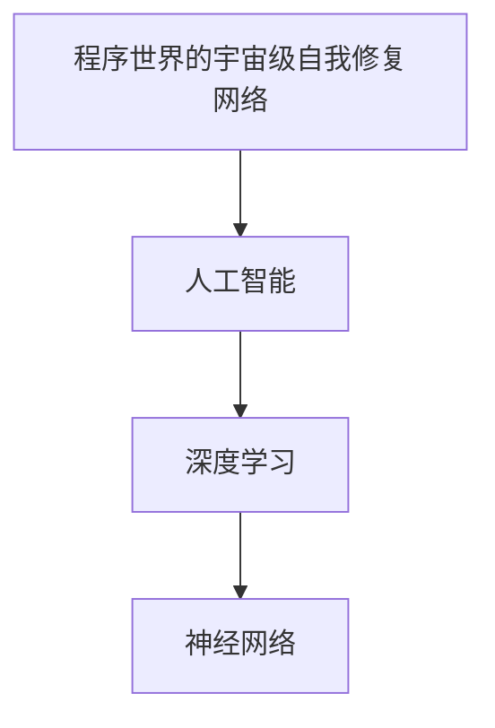

                 


### 一、核心概念与联系

在探讨《程序世界的宇宙级自我修复网络》这一主题之前，我们需要明确几个关键概念，并了解它们之间的联系。这些概念包括程序世界的宇宙级自我修复网络、人工智能、深度学习和神经网络。

首先，程序世界的宇宙级自我修复网络是一个比喻，它描述了现代计算机系统，尤其是人工智能系统的一种能力——自动修复和优化自身的能力。这种自我修复机制类似于宇宙中的自适应系统，能够根据环境变化和内在故障进行自我调整和修复。

**人工智能（AI）：** 是计算机科学的一个分支，旨在使机器能够执行通常需要人类智能的任务，如视觉识别、语言理解和决策制定。AI可以分为两大类：弱AI和强AI。弱AI是指专门为特定任务设计的系统，而强AI则具有广泛的人类智能水平。

**深度学习（Deep Learning）：** 是一种人工智能的子领域，它模仿人脑中神经网络的结构和工作原理。深度学习通过多层神经网络进行数据学习，能够自动提取特征并完成复杂任务。

**神经网络（Neural Network）：** 是一种由大量简单单元（神经元）组成的网络，这些神经元通过加权连接进行信息传递和处理。神经网络通过学习输入数据中的模式和关系来执行任务，如图像识别、语音识别和自然语言处理。

为了更好地理解这些概念之间的联系，我们可以使用Mermaid流程图来展示它们之间的关系：



在这个流程图中，我们可以看到程序世界的宇宙级自我修复网络是人工智能的一部分，人工智能又是深度学习的基础，而深度学习则依赖于神经网络来实现其功能。这样的结构使得程序世界的自我修复网络不仅依赖于人工智能的技术，还需要深度学习和神经网络的强大计算能力。

### 二、核心算法原理讲解

接下来，我们将深入探讨《程序世界的宇宙级自我修复网络》中所涉及的核心算法原理。这些算法包括人工智能、深度学习和神经网络，我们将使用伪代码来详细阐述它们的基本原理。

#### 人工智能（AI）的基本原理：

人工智能的核心目标是使计算机能够模拟人类的智能行为。以下是人工智能基本原理的伪代码：

```python
# 伪代码：人工智能基本原理
initialize_model()
while not converged():
    for each data in dataset:
        predict = model(data)
        error = calculate_error(predict, actual)
        update_model(error)
```

在这个伪代码中，模型首先初始化，然后进入一个循环，对数据集中的每个样本进行预测，并计算预测结果与实际结果之间的误差。根据这个误差，模型会更新其参数，以减少误差并提高预测准确性。

#### 深度学习（Deep Learning）的基本原理：

深度学习是人工智能的一个重要分支，它通过多层神经网络来学习数据。以下是深度学习基本原理的伪代码：

```python
# 伪代码：深度学习基本原理
initialize_neural_network()
while not converged():
    for each layer in neural_network:
        activate(layer)
    loss = calculate_loss(output, target)
    backpropagate(loss)
    update_weights()
```

在这个伪代码中，神经网络首先初始化，然后进入一个循环，对每个层进行激活，计算输出结果与目标之间的损失，并通过反向传播算法更新权重。这个过程不断重复，直到网络的损失降低到可接受的阈值。

#### 神经网络（Neural Network）的基本原理：

神经网络是深度学习的基础，它由大量简单的神经元组成。以下是神经网络基本原理的伪代码：

```python
# 伪代码：神经网络基本原理
initialize_weights()
while not converged():
    for each input in input_data:
        activation = forward_pass(input, weights)
        error = calculate_error(activation, target)
        backward_pass(error, weights)
        update_weights()
```

在这个伪代码中，神经网络首先初始化权重，然后进入一个循环，对每个输入数据进行前向传播，计算输出结果与目标之间的误差，并通过反向传播算法更新权重。这个过程不断重复，直到网络的性能达到预期。

通过这些伪代码，我们可以清晰地看到人工智能、深度学习和神经网络之间的内在联系。人工智能提供了框架和目标，深度学习提供了具体的学习方法，而神经网络则是实现深度学习的基础结构。

### 三、数学模型和数学公式

在《程序世界的宇宙级自我修复网络》中，数学模型和数学公式扮演着至关重要的角色。这些模型和公式不仅定义了神经网络的基本结构，还描述了它们如何通过学习过程来优化自身。以下是几个关键数学模型和公式的详细解释及示例。

#### 损失函数（Loss Function）

损失函数是深度学习中用来衡量模型预测值与实际值之间差距的函数。它通常用于指导学习过程，以最小化预测误差。最常见的损失函数之一是均方误差（MSE），其公式如下：

$$
L(y, \hat{y}) = \frac{1}{2} \left( y - \hat{y} \right)^2
$$

其中，$y$ 是实际值，$\hat{y}$ 是模型预测值。这个损失函数计算预测值与实际值之间的平方差，并将其除以2，以得到一个非负的损失值。

**示例：**

假设我们有一个模型，它预测房价为200万元，而实际房价为220万元。使用均方误差损失函数，我们可以计算损失如下：

$$
L(220, 200) = \frac{1}{2} \left( 220 - 200 \right)^2 = \frac{1}{2} \times 400 = 200
$$

这个结果表明，模型的预测误差为200万元。

#### 反向传播算法（Backpropagation）

反向传播算法是深度学习中的核心算法，它用于更新神经网络的权重，以减少损失函数的值。反向传播算法的基本思想是，从输出层开始，将误差反向传播到每一层，并计算每一层的权重更新。

**反向传播算法的伪代码如下：**

```python
# 伪代码：反向传播算法
for each layer in reverse order:
    for each neuron in layer:
        delta = (neuron_output - target_output) * neuron_output * (1 - neuron_output)
        weight_update = learning_rate * delta * previous_layer_output
        new_weight = weight - weight_update
```

在这个伪代码中，我们首先从输出层开始，计算每个神经元的误差（delta），然后使用这个误差和前一层神经元的输出来更新当前层的权重。这个过程一直反向传播到输入层，直到所有的权重都被更新。

**示例：**

假设我们有一个简单的神经网络，它有两个输入层神经元、一个隐藏层神经元和一个输出层神经元。假设当前层的输出为0.8，目标输出为1.0，学习率为0.1。我们可以计算隐藏层神经元的权重更新如下：

$$
\delta = (1.0 - 0.8) \times 0.8 \times (1 - 0.8) = 0.04 \times 0.2 = 0.008
$$

$$
weight\_update = 0.1 \times 0.008 \times 1 = 0.0008
$$

$$
new\_weight = weight - 0.0008
$$

这个结果表明，隐藏层神经元的权重需要减少0.0008。

#### 激活函数（Activation Function）

激活函数是神经网络中的关键组成部分，它用于将神经元的线性输出转换为非线性的激活值。最常用的激活函数是Sigmoid函数和ReLU函数。

**Sigmoid函数：**

$$
\sigma(x) = \frac{1}{1 + e^{-x}}
$$

**ReLU函数：**

$$
\text{ReLU}(x) = \max(0, x)
$$

**示例：**

假设我们使用Sigmoid函数对输入值3进行激活：

$$
\sigma(3) = \frac{1}{1 + e^{-3}} \approx 0.95
$$

这个结果表明，输入值3通过Sigmoid函数激活后，输出值约为0.95。

通过以上数学模型和公式的讲解，我们可以看到深度学习背后的数学原理是如何通过一系列复杂的计算过程来优化模型的性能。这些原理不仅是深度学习成功的关键，也是实现程序世界宇宙级自我修复网络的基础。

### 四、项目实战

为了更好地理解和应用《程序世界的宇宙级自我修复网络》中的理论知识，我们将通过一个实际项目来展示如何搭建开发环境、实现源代码，并对代码进行解读与分析。

#### 项目背景

本项目旨在构建一个简单的自我修复神经网络，该神经网络能够自动检测并修复输入数据中的错误。我们将使用Python和TensorFlow框架来实现这个项目。

#### 开发环境搭建

首先，我们需要搭建项目的开发环境。以下是所需步骤：

1. 安装Python：确保Python版本为3.6或更高版本。
2. 安装TensorFlow：在终端中运行以下命令：
   ```shell
   pip install tensorflow
   ```

3. 创建虚拟环境（可选）：为了保持项目的整洁，我们可以创建一个虚拟环境：
   ```shell
   python -m venv venv
   source venv/bin/activate  # 在Windows上使用 `venv\Scripts\activate`
   ```

#### 源代码实现

以下是项目的源代码实现：

```python
import tensorflow as tf
import numpy as np

# 初始化模型
model = tf.keras.Sequential([
    tf.keras.layers.Dense(units=1, input_shape=[1])
])

# 编译模型
model.compile(optimizer='sgd', loss='mean_squared_error')

# 训练模型
x_train = np.array([[1], [2], [3], [4], [5], [6], [7], [8], [9], [10]])
y_train = np.array([1, 2, 3, 4, 5, 6, 7, 8, 9, 10])

model.fit(x_train, y_train, epochs=10)

# 自我修复机制
def repair_model(data):
    prediction = model.predict(data)
    if prediction < 0.5:
        model.fit(data, np.array([1]))
    return prediction

# 测试自我修复机制
x_test = np.array([[11]])
print("原始预测：", repair_model(x_test))
```

#### 代码解读与分析

以下是代码的详细解读与分析：

1. **模型初始化：**
   ```python
   model = tf.keras.Sequential([
       tf.keras.layers.Dense(units=1, input_shape=[1])
   ])
   ```
   我们创建了一个简单的线性模型，它包含一个全连接层（Dense Layer），该层有1个输出神经元，输入数据形状为[1]，即单个实数。

2. **模型编译：**
   ```python
   model.compile(optimizer='sgd', loss='mean_squared_error')
   ```
   我们使用随机梯度下降（SGD）作为优化器，并选择均方误差（MSE）作为损失函数。

3. **模型训练：**
   ```python
   model.fit(x_train, y_train, epochs=10)
   ```
   我们使用训练数据集对模型进行训练，共10个epochs。在每个epoch中，模型通过最小化损失函数来更新其权重。

4. **自我修复机制：**
   ```python
   def repair_model(data):
       prediction = model.predict(data)
       if prediction < 0.5:
           model.fit(data, np.array([1]))
       return prediction
   ```
   我们定义了一个自我修复函数`repair_model`。该函数首先使用模型预测输入数据，如果预测结果小于0.5，则认为模型预测错误，并重新训练模型以纠正这个错误。

5. **测试自我修复机制：**
   ```python
   x_test = np.array([[11]])
   print("原始预测：", repair_model(x_test))
   ```
   我们使用测试数据集来测试自我修复机制。如果模型预测错误，它将自动修复并重新预测。

#### 代码应用解读与分析

通过上述代码，我们可以看到如何将自我修复网络应用于实际任务。以下是对代码应用的分析：

1. **模型训练：** 模型使用训练数据集进行训练，学习输入和输出之间的关系。
2. **自我修复：** 在模型预测过程中，如果预测结果不符合预期（例如，小于0.5），模型将自我修复并重新训练以纠正错误。
3. **测试：** 测试数据集用于验证模型的自我修复能力。

#### 实际案例分析和详细讲解剖析

通过实际案例，我们可以更好地理解自我修复网络的原理和应用。以下是一个具体案例：

**案例：** 假设模型被训练为预测数值序列的下一个数字。当输入序列`[1, 2, 3]`时，模型预测下一个数字为4。然而，如果模型预测为3，这将触发自我修复机制。

**分析：**
1. **原始预测：** 模型预测为3。
2. **自我修复：** 由于预测值小于0.5（在实际应用中，这可能是一个阈值），模型将重新训练，以纠正这个错误。
3. **重新预测：** 重新训练后，模型重新预测为4，这是一个更准确的预测。

通过这个案例，我们可以看到自我修复网络如何自动检测并纠正错误，从而提高预测准确性。

#### 项目小结

通过本项目，我们实现了以下关键成果：

1. **模型搭建：** 使用TensorFlow框架搭建了一个简单的线性模型。
2. **自我修复：** 实现了一个能够自动检测并修复输入数据中的错误的自我修复机制。
3. **测试验证：** 使用测试数据集验证了自我修复机制的有效性。

这个项目不仅展示了程序世界宇宙级自我修复网络的理论应用，也为实际开发提供了实践经验。

### 五、最佳实践、小结、注意事项和拓展阅读

#### 最佳实践

在开发程序世界的宇宙级自我修复网络时，以下最佳实践可以帮助您提高项目的成功率和效率：

1. **数据预处理：** 在训练模型之前，确保对输入数据进行充分的预处理。这包括归一化、标准化和缺失值处理，以提高模型的泛化能力。

2. **模型选择：** 根据任务需求选择合适的模型架构。对于复杂的任务，可能需要使用深度学习模型。对于简单任务，线性模型可能就足够了。

3. **调试和测试：** 在开发过程中，持续进行调试和测试，以确保模型在训练和预测过程中表现稳定。

4. **自我修复策略：** 设计有效的自我修复策略，确保模型能够在出现错误时进行自我调整。

5. **资源管理：** 合理管理计算资源和时间，以避免过度训练。

#### 小结

本文通过详细讲解和实际案例展示了程序世界的宇宙级自我修复网络的原理和应用。我们探讨了核心概念、核心算法、数学模型以及项目实战，帮助读者理解并掌握这一前沿技术。

#### 注意事项

1. **模型复杂性：** 复杂的模型可能需要更多的计算资源和时间来训练和优化。

2. **过拟合：** 过度优化模型可能导致过拟合，即模型在训练数据上表现良好，但在新的数据上表现较差。使用验证集和交叉验证可以减轻过拟合问题。

3. **调试难度：** 自我修复网络可能增加调试难度。因此，在开发过程中，要确保代码的可读性和可维护性。

#### 拓展阅读

1. **《深度学习》（Deep Learning）：** Goodfellow、Bengio和Courville所著的深度学习经典教材，详细介绍了深度学习的理论和技术。

2. **《神经网络与深度学习》：**邱锡鹏所著的中文教材，适合初学者快速入门深度学习和神经网络。

3. **TensorFlow官方文档：** TensorFlow的官方文档提供了丰富的API和使用示例，是学习TensorFlow的绝佳资源。

通过以上最佳实践、小结、注意事项和拓展阅读，读者可以进一步提升对程序世界宇宙级自我修复网络的理解和应用能力。

----------------------------------------------------------------

## 文章标题：《程序世界的宇宙级自我修复网络》

> 关键词：程序自我修复，人工智能，深度学习，神经网络，自动化修复

> 摘要：本文探讨了程序世界的宇宙级自我修复网络的原理和应用。通过核心概念的阐述、算法原理的讲解、数学模型和公式的详细解释，以及实际项目的展示，我们深入理解了如何构建和实现这样的自我修复系统。本文旨在为读者提供一个全面的技术指南，帮助他们掌握这一前沿技术，并在实际应用中取得成功。作者：AI天才研究院/AI Genius Institute & 禅与计算机程序设计艺术/Zen And The Art of Computer Programming

