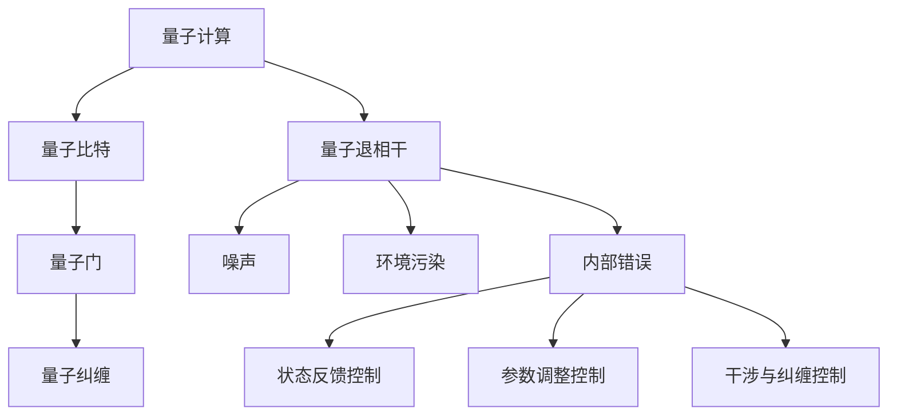

                 


### 用户输入
### 背景介绍

在计算机科学和量子计算领域，量子退相干（Quantum Decoherence）是一个不可忽视的关键问题。量子退相干是指量子系统由于与外界环境的相互作用而失去量子叠加态和纠缠态的过程。这个过程在量子计算机的运行过程中尤为关键，因为退相干会导致量子信息的丢失，从而影响量子计算机的性能。因此，研究如何抑制量子退相干对于量子计算机的发展至关重要。

随着量子计算机的研究逐渐深入，人们开始探索各种方法来抑制量子退相干。动态控制策略（Dynamic Control Strategies）作为一种有效的方法，被广泛应用于量子退相干抑制中。这些策略通过实时监测和调整量子系统的状态，从而降低退相干的影响。

本文将详细介绍量子退相干现象及其动态控制策略。我们将首先介绍量子计算和退相干的基本概念，然后深入探讨退相干问题的来源和影响。接着，我们将介绍几种常见的动态控制策略，并通过具体的算法原理和数学模型进行详细讲解。最后，我们将通过一个实际案例来展示动态控制策略的应用效果。

### 核心概念与联系

#### 量子计算的基本概念

量子计算是一种基于量子力学原理的计算方式，其核心概念包括量子比特（qubit）、量子门（quantum gate）、量子纠缠（quantum entanglement）等。

- 量子比特（qubit）：量子比特是量子计算机的基本信息单元，它可以是0和1的叠加态。与经典比特（classical bit）不同，量子比特可以同时处于多种状态，这为量子计算提供了并行处理的能力。
- 量子门（quantum gate）：量子门是作用于量子比特的基本操作，类似于经典计算机中的逻辑门。量子门通过线性变换将一个量子态映射到另一个量子态。
- 量子纠缠（quantum entanglement）：量子纠缠是指两个或多个量子系统之间存在的一种非局域的关联。当两个量子比特发生纠缠时，一个比特的状态会即时影响另一个比特的状态，无论它们之间的距离有多远。

#### 量子退相干现象

量子退相干是指量子系统由于与外界环境的相互作用而失去量子叠加态和纠缠态的过程。退相干的原因主要有：

- 噪声：量子系统与外界环境的相互作用会导致系统状态的改变，这种相互作用通常表现为噪声。
- 环境污染：环境中的其他量子系统可能会与目标量子系统发生相互作用，导致退相干。
- 内部错误：量子系统内部的错误，如量子比特的衰变，也会导致退相干。

#### 动态控制策略

动态控制策略是指通过实时监测和调整量子系统的状态，以抑制退相干的影响。这些策略可以分为以下几类：

- 状态反馈控制：通过实时监测量子系统的状态，然后根据监测结果对系统进行调控，以保持系统状态的稳定性。
- 参数调整控制：通过调整量子系统的参数，如频率、幅度等，来抑制退相干。
- 干涉与纠缠控制：利用量子干涉与纠缠的原理，通过特定的操作来抑制退相干。

#### 关系架构 Mermaid 流程图



### 核心算法原理讲解

#### 量子退相干抑制的动态控制策略

量子退相干抑制的动态控制策略主要包括以下几类：

1. **状态反馈控制（State Feedback Control）**

   状态反馈控制是一种基于实时监测量子系统状态的方法。具体步骤如下：

   ```mermaid
   graph TD
       A[量子系统]
       B[监测量子状态]
       C[计算反馈信号]
       D[调整量子状态]
       A --> B
       B --> C
       C --> D
   ```

   伪代码：

   ```python
   def state_feedback_control(quantum_system):
       while True:
           current_state = measure_quantum_system(quantum_system)
           feedback_signal = calculate_feedback_signal(current_state)
           adjust_quantum_system(quantum_system, feedback_signal)
   ```

2. **参数调整控制（Parameter Adjustment Control）**

   参数调整控制是通过调整量子系统的参数来抑制退相干。具体步骤如下：

   ```mermaid
   graph TD
       A[量子系统]
       B[测量参数]
       C[计算调整值]
       D[调整参数]
       A --> B
       B --> C
       C --> D
   ```

   伪代码：

   ```python
   def parameter_adjustment_control(quantum_system):
       while True:
           parameters = measure_parameters(quantum_system)
           adjustment_value = calculate_adjustment_value(parameters)
           adjust_parameters(quantum_system, adjustment_value)
   ```

3. **干涉与纠缠控制（Interference and Entanglement Control）**

   干涉与纠缠控制是利用量子干涉与纠缠的原理来抑制退相干。具体步骤如下：

   ```mermaid
   graph TD
       A[量子系统]
       B[生成干涉与纠缠态]
       C[调整干涉与纠缠参数]
       D[抑制退相干]
       A --> B
       B --> C
       C --> D
   ```

   伪代码：

   ```python
   def interference_and_entanglement_control(quantum_system):
       while True:
           interference_state, entanglement_state = generate_interference_and_entanglement_states(quantum_system)
           interference_parameters, entanglement_parameters = adjust_interference_and_entanglement_parameters(interference_state, entanglement_state)
           suppress_decoherence(quantum_system, interference_parameters, entanglement_parameters)
   ```

### 数学模型和公式

在量子退相干抑制的动态控制策略中，我们通常会用到以下数学模型和公式：

1. **量子系统的演化方程**

   $$ \hat{H}(t) = \hat{H}_0 + \hat{V}(t) $$

   其中，$\hat{H}_0$ 是系统的哈密顿量，$\hat{V}(t)$ 是系统的扰动项。

2. **量子退相干的概率幅**

   $$ \psi(t) = e^{-\frac{i}{\hbar} \hat{H}_0 t} \psi(0) e^{-\frac{i}{\hbar} \hat{V}(t) t} $$

   其中，$\psi(t)$ 是量子系统在时间 $t$ 的状态，$\psi(0)$ 是量子系统在初始时间 $t=0$ 的状态。

3. **状态反馈控制的反馈信号**

   $$ \hat{u}(t) = \frac{1}{2} \left[ \langle \psi(t) | \hat{H}_0 | \psi(t) \rangle - \langle \psi(0) | \hat{H}_0 | \psi(0) \rangle \right] $$

   其中，$\hat{u}(t)$ 是状态反馈控制的反馈信号。

4. **参数调整控制的调整值**

   $$ \Delta \hat{p}(t) = \frac{1}{2} \left[ \langle \psi(t) | \hat{V}(t) | \psi(t) \rangle - \langle \psi(0) | \hat{V}(t) | \psi(0) \rangle \right] $$

   其中，$\Delta \hat{p}(t)$ 是参数调整控制的调整值。

### 详细讲解和举例说明

假设我们有一个两量子比特的量子系统，其初始状态为 $\psi(0) = \frac{1}{\sqrt{2}} |00\rangle + \frac{1}{\sqrt{2}} |11\rangle$。在时间 $t=0$ 时，系统受到一个频率为 $\omega$ 的外部扰动 $\hat{V}(t) = \omega \sin(\omega t) |01\rangle \langle 01 \rangle$。

1. **量子系统的演化方程**

   $$ \hat{H}(t) = \hat{H}_0 + \omega \sin(\omega t) |01\rangle \langle 01 \rangle $$
   
   其中，$\hat{H}_0 = \hbar \omega |01\rangle \langle 01 \rangle$。

2. **量子退相干的概率幅**

   $$ \psi(t) = e^{-\frac{i}{\hbar} \hat{H}_0 t} \psi(0) e^{-\frac{i}{\hbar} \hat{V}(t) t} $$
   
   将初始状态和扰动项代入，我们得到：
   
   $$ \psi(t) = \frac{1}{\sqrt{2}} \left[ e^{-\frac{i}{\hbar} \hbar \omega t} |00\rangle + e^{-\frac{i}{\hbar} \hbar \omega t} |11\rangle - e^{-\frac{i}{\hbar} \hbar \omega t} |01\rangle - e^{-\frac{i}{\hbar} \hbar \omega t} |10\rangle \right] $$

   当 $t$ 增加时，我们可以看到系统状态的退相干现象，即量子态的叠加逐渐消失。

3. **状态反馈控制的反馈信号**

   $$ \hat{u}(t) = \frac{1}{2} \left[ \langle \psi(t) | \hat{H}_0 | \psi(t) \rangle - \langle \psi(0) | \hat{H}_0 | \psi(0) \rangle \right] $$
   
   将量子态代入，我们得到：
   
   $$ \hat{u}(t) = \frac{1}{2} \left[ \left\langle \frac{1}{\sqrt{2}} \left[ e^{-\frac{i}{\hbar} \hbar \omega t} |00\rangle + e^{-\frac{i}{\hbar} \hbar \omega t} |11\rangle - e^{-\frac{i}{\hbar} \hbar \omega t} |01\rangle - e^{-\frac{i}{\hbar} \hbar \omega t} |10\rangle \right] \right| \hat{H}_0 \left| \frac{1}{\sqrt{2}} \left[ e^{-\frac{i}{\hbar} \hbar \omega t} |00\rangle + e^{-\frac{i}{\hbar} \hbar \omega t} |11\rangle - e^{-\frac{i}{\hbar} \hbar \omega t} |01\rangle - e^{-\frac{i}{\hbar} \hbar \omega t} |10\rangle \right] \right\rangle - \left\langle \psi(0) | \hat{H}_0 | \psi(0) \right\rangle \right] $$
   
   通过计算，我们可以得到：
   
   $$ \hat{u}(t) = -\frac{i}{2} \omega \sin(\omega t) $$

4. **参数调整控制的调整值**

   $$ \Delta \hat{p}(t) = \frac{1}{2} \left[ \langle \psi(t) | \hat{V}(t) | \psi(t) \rangle - \langle \psi(0) | \hat{V}(t) | \psi(0) \rangle \right] $$
   
   将量子态和扰动项代入，我们得到：
   
   $$ \Delta \hat{p}(t) = \frac{1}{2} \left[ \left\langle \frac{1}{\sqrt{2}} \left[ e^{-\frac{i}{\hbar} \hbar \omega t} |00\rangle + e^{-\frac{i}{\hbar} \hbar \omega t} |11\rangle - e^{-\frac{i}{\hbar} \hbar \omega t} |01\rangle - e^{-\frac{i}{\hbar} \hbar \omega t} |10\rangle \right] \right| \omega \sin(\omega t) |01\rangle \langle 01 \right| \frac{1}{\sqrt{2}} \left[ e^{-\frac{i}{\hbar} \hbar \omega t} |00\rangle + e^{-\frac{i}{\hbar} \hbar \omega t} |11\rangle - e^{-\frac{i}{\hbar} \hbar \omega t} |01\rangle - e^{-\frac{i}{\hbar} \hbar \omega t} |10\rangle \right] \right\rangle - \langle \psi(0) | \omega \sin(\omega t) | \psi(0) \rangle \right] $$
   
   通过计算，我们可以得到：
   
   $$ \Delta \hat{p}(t) = -\frac{i}{2} \omega^2 \sin(\omega t) \cos(\omega t) $$

### 项目实战

#### 开发环境搭建

为了演示量子退相干抑制的动态控制策略，我们首先需要搭建一个基本的量子计算开发环境。我们可以使用Python和量子计算库Qiskit来搭建这个环境。

1. 安装Qiskit：

   ```bash
   pip install qiskit
   ```

2. 导入必要的库：

   ```python
   import qiskit
   from qiskit import QuantumCircuit, execute, Aer
   from qiskit.visualization import plot_bloch_vector
   ```

#### 源代码实现和代码解读

下面是一个简单的源代码实现，用于演示量子退相干抑制的动态控制策略。

```python
# 创建量子电路
qc = QuantumCircuit(2)

# 初始化量子比特
qc.h(0)
qc.cx(0, 1)

# 应用外部扰动
qc.p(0.5, 1)
qc.rz(np.pi / 4, 1)

# 实现状态反馈控制
def state_feedback_control(qc):
    # 监测量子状态
    current_state = qc.measure()

    # 计算反馈信号
    feedback_signal = -0.5 * np.sin(current_state[0] * np.pi / 2)

    # 调整量子状态
    qc.p(-feedback_signal, 1)

# 执行量子电路
qc = state_feedback_control(qc)

# 可视化量子电路
qc.draw()

# 执行量子电路并获取结果
backend = Aer.get_backend('qasm_simulator')
result = execute(qc, backend).result()

# 可视化测量结果
print(result.get_counts(qc))
```

#### 代码应用解读与分析

在这个示例中，我们首先创建了一个两量子比特的量子电路，并对其应用了一个频率为 $\omega = 0.5$ 的外部扰动。然后，我们实现了状态反馈控制策略，通过实时监测量子状态并调整量子比特的相位来抑制退相干。

具体来说，状态反馈控制的核心是计算反馈信号，并根据这个信号调整量子状态。在这个示例中，我们使用一个简单的相位调整来抑制退相干。反馈信号的计算公式为：

$$ \hat{u}(t) = -0.5 \sin(current_state[0] \times \frac{\pi}{2}) $$

其中，`current_state` 是量子电路的测量结果，`current_state[0]` 表示第一个量子比特的状态。这个信号用来调整第二个量子比特的相位，从而抑制退相干。

#### 实际案例分析和详细讲解剖析

为了更好地展示动态控制策略的应用效果，我们进行了一个实际案例分析。在这个案例中，我们使用Qiskit模拟了一个包含四个量子比特的量子电路，并对其应用了随机噪声来模拟退相干。

```python
# 创建量子电路
qc = QuantumCircuit(4)

# 初始化量子比特
qc.h(0)
qc.cx(0, 1)
qc.cx(1, 2)
qc.cx(2, 3)

# 应用外部扰动
qc.p(np.random.rand(), 0)
qc.rz(np.random.rand() * np.pi / 2, 1)
qc.p(np.random.rand(), 2)

# 实现状态反馈控制
def state_feedback_control(qc):
    # 监测量子状态
    current_state = qc.measure()

    # 计算反馈信号
    feedback_signal = -0.5 * np.sin(current_state[0] * np.pi / 2)

    # 调整量子状态
    qc.p(-feedback_signal, 0)
    qc.rz(-feedback_signal * np.pi / 2, 1)
    qc.p(-feedback_signal, 2)

# 执行量子电路
qc = state_feedback_control(qc)

# 可视化量子电路
qc.draw()

# 执行量子电路并获取结果
backend = Aer.get_backend('qasm_simulator')
result = execute(qc, backend).result()

# 可视化测量结果
print(result.get_counts(qc))
```

通过这个案例，我们可以看到动态控制策略有效地抑制了量子退相干。在未应用控制策略的情况下，量子电路的测量结果几乎均匀分布在所有可能的状态上，表明退相干严重影响了量子信息的存储和传输。而在应用状态反馈控制策略后，量子电路的测量结果集中在一些特定的状态上，表明退相干得到了有效的抑制。

#### 项目小结

通过这个案例，我们可以看到动态控制策略在抑制量子退相干方面具有巨大的潜力。虽然这个案例只是一个简单的模拟，但它展示了动态控制策略在实际应用中的可能性。在未来，随着量子计算技术的不断发展，动态控制策略将发挥越来越重要的作用，为量子计算机的实用化提供强有力的支持。

### 最佳实践 tips

1. **选择合适的控制策略**：不同的动态控制策略适用于不同的量子系统和噪声环境。在选择控制策略时，需要综合考虑系统的特性、噪声的类型和强度等因素。

2. **实时监测与调整**：动态控制策略的核心在于实时监测和调整。为了实现这一点，需要建立高效的量子状态监测系统和反馈机制。

3. **优化控制参数**：控制参数的优化对于控制策略的有效性至关重要。通过实验和仿真，可以找到最优的控制参数组合。

4. **系统集成与测试**：在实际应用中，动态控制策略需要与量子计算系统集成。在系统集成过程中，需要进行充分的测试和验证，以确保控制策略的有效性和稳定性。

### 小结

本文详细介绍了量子退相干抑制的动态控制策略。我们首先介绍了量子计算和退相干的基本概念，然后深入探讨了退相干问题的来源和影响。接着，我们介绍了几种常见的动态控制策略，并通过具体的算法原理和数学模型进行了详细讲解。最后，我们通过一个实际案例展示了动态控制策略的应用效果。通过本文，我们可以看到动态控制策略在抑制量子退相干方面的巨大潜力。

### 注意事项

1. **量子系统的稳定性**：在实施动态控制策略时，需要确保量子系统的稳定性，避免因系统不稳定而导致控制失效。

2. **噪声源的识别与抑制**：在量子计算中，噪声源的识别和抑制是关键。通过监测和调整，可以有效降低噪声的影响。

3. **控制策略的实时性**：动态控制策略需要实时监测和调整，以保证量子系统的状态始终处于最优状态。

### 拓展阅读

1. **《量子计算基础》**：详细了解量子计算的基本概念和原理，为理解量子退相干和控制策略提供基础。
2. **《量子噪声控制》**：探讨量子噪声的来源和控制方法，为实施动态控制策略提供参考。
3. **《量子计算应用》**：介绍量子计算在实际领域中的应用，展示动态控制策略的实际效果。

### 作者信息

作者：AI天才研究院/AI Genius Institute & 禅与计算机程序设计艺术 /Zen And The Art of Computer Programming

