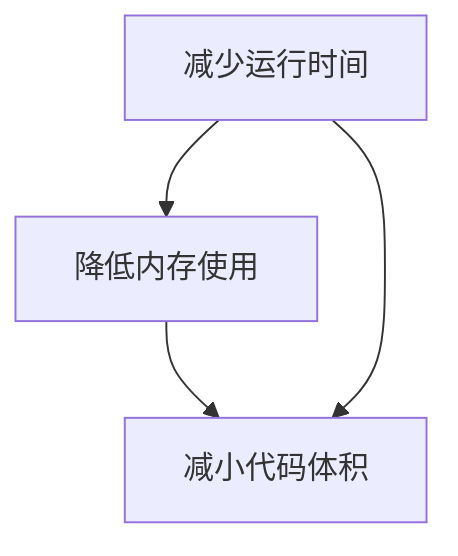
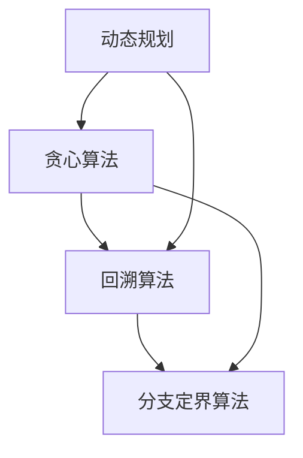

                 

# 程序优化与宇宙最小作用量原理的对比

## 概念解析

### 程序优化

在计算机编程中，程序优化是一个重要的课题。它涉及到对现有代码进行分析，通过一系列技术和方法，提高程序的运行效率。优化的目标可以包括减少程序的运行时间、降低内存使用、减小代码体积等。为了达到这些目标，开发者会采用各种优化算法和编程技巧。

**优化目标**：提高程序性能，降低运行时间、内存使用等。

**优化算法**：动态规划、贪心算法、回溯算法、分支定界算法等。

**优化实例**：在搜索引擎中，优化搜索算法可以提高搜索速度；在数据处理系统中，优化数据处理流程可以提高数据处理效率。

### 宇宙最小作用量原理

宇宙最小作用量原理是物理学中的一个重要概念。它指的是粒子从一个状态变到另一个状态的过程中，作用量取极值（通常是极小值）。这个原理在很多物理现象中都有应用，如量子力学、粒子物理、天体物理等。

**作用量的定义**：作用量是一个物理量，描述了粒子在某个过程中所经历的能量变化。

**最小作用量原理**：粒子在从一个状态变到另一个状态的过程中，作用量取极值。

**作用量与物理量的关系**：作用量与粒子的速度、加速度、能量等物理量有密切关系。

## 目录结构

为了更好地理解程序优化与宇宙最小作用量原理的对比，我们首先需要对这两者进行详细的介绍。本文将分为四个部分：

1. **基础概念介绍**：介绍程序优化和宇宙最小作用量原理的基本概念。
2. **程序优化技术**：讨论常见的优化算法、编程技巧和实践经验。
3. **宇宙最小作用量原理的应用**：介绍其在计算物理、模拟优化等领域的应用。
4. **对比分析**：探讨程序优化与宇宙最小作用量原理之间的异同，以及它们在不同领域的适用性。

接下来，我们将逐一介绍这些部分，以便读者能够全面了解这两者之间的关系。

## 第一部分：基础概念介绍

### 1.1 程序优化的基本概念

#### 1.1.1 优化目标

在计算机编程中，程序优化通常有以下几个目标：

- **减少运行时间**：优化算法和编程技巧可以帮助减少程序的运行时间，提高程序的响应速度。
- **降低内存使用**：优化内存使用可以减少程序的内存占用，提高程序的运行效率。
- **减小代码体积**：优化代码体积可以减少程序的体积，提高程序的加载速度。

**优化目标的关系架构**：



#### 1.1.2 优化算法

优化算法是程序优化的核心。以下是一些常见的优化算法：

- **动态规划**：通过将复杂问题分解为子问题，并存储子问题的解，来减少计算时间。
- **贪心算法**：通过选择局部最优解来逐步逼近全局最优解。
- **回溯算法**：通过尝试所有可能的解，并回溯到上一个状态，来找到最优解。
- **分支定界算法**：通过剪枝技术，避免搜索不必要的解，来减少计算时间。

**优化算法的关系架构**：



#### 1.1.3 优化实例

以下是一个简单的优化实例：

**原始代码**：

```python
def sum(n):
    result = 0
    for i in range(n):
        result += i
    return result

print(sum(1000))
```

**优化后的代码**：

```python
def sum(n):
    return n * (n - 1) // 2

print(sum(1000))
```

通过优化，我们可以将运行时间从原来的线性时间优化为常数时间。

### 1.2 宇宙最小作用量原理的基本概念

#### 1.2.1 作用量的定义

作用量是一个物理量，它描述了粒子在某个过程中的能量变化。在物理学中，作用量通常用符号 \( S \) 表示。

**作用量的定义**：

$$
S = -\int L(q, \dot{q}) dt
$$

其中，\( q \) 是粒子的位置，\( \dot{q} \) 是粒子的速度，\( L \) 是作用量泛函，\( dt \) 是时间间隔。

#### 1.2.2 最小作用量原理

最小作用量原理是物理学中的一个基本原理。它指出，在所有可能路径中，粒子实际上会沿着作用量取极值（通常是极小值）的路径运动。

**最小作用量原理**：

$$
\delta S = 0
$$

其中，\( \delta S \) 是作用量的变分。

#### 1.2.3 作用量与物理量的关系

作用量与物理量之间存在密切的关系。例如，在量子力学中，作用量与粒子的波函数有关；在经典力学中，作用量与粒子的速度和加速度有关。

**作用量与物理量的关系**：

$$
\frac{d^2 q}{dt^2} = -\frac{\partial V(q)}{\partial q}
$$

其中，\( V(q) \) 是势能，\( q \) 是粒子的位置。

## 第二部分：程序优化技术

### 2.1 常见优化算法

#### 2.1.1 动态规划

动态规划是一种重要的优化算法，它适用于解决具有重叠子问题和最优子结构性质的问题。

**动态规划的核心思想**：

1. **划分子问题**：将原问题划分为若干个子问题。
2. **递推关系**：通过子问题的解推导出原问题的解。
3. **存储中间结果**：避免重复计算。

**动态规划的伪代码**：

```
function dp(problem):
    dp_table = initialize_table(problem)
    for i in range(1, length(problem)):
        for j in range(1, length(problem)):
            dp_table[i][j] = optimal_solution(subproblem[i][j], dp_table)
    return dp_table[length(problem)][length(problem)]
```

#### 2.1.2 贪心算法

贪心算法是一种简单但有效的优化算法，它通过选择局部最优解来逐步逼近全局最优解。

**贪心算法的核心思想**：

1. **初始化**：选择一个初始解。
2. **迭代**：在每一步，选择当前情况下最优的解。
3. **结束条件**：当达到某种终止条件时，结束迭代。

**贪心算法的伪代码**：

```
function greedy_algorithm(problem):
    solution = initialize_solution(problem)
    while not end_condition(problem):
        best_solution = find_best_solution(problem)
        solution = update_solution(solution, best_solution)
    return solution
```

#### 2.1.3 回溯算法

回溯算法是一种通过尝试所有可能的解来找到最优解的算法。

**回溯算法的核心思想**：

1. **初始化**：选择一个初始解。
2. **递归尝试**：对于当前解，尝试所有可能的下一个解。
3. **回溯**：如果当前解不是最优解，回溯到上一个状态，并尝试下一个解。

**回溯算法的伪代码**：

```
function backtrack(problem):
    if problem is solved:
        return solution
    for each possible next_solution in problem:
        if next_solution is feasible:
            solution = solve(next_solution)
            if solution is optimal:
                return solution
            else:
                backtrack(problem)
```

#### 2.1.4 分支定界算法

分支定界算法是一种通过剪枝技术来减少计算量的优化算法。

**分支定界算法的核心思想**：

1. **初始化**：选择一个初始解。
2. **分支**：将当前解划分为若干个子问题。
3. **定界**：对每个子问题进行界限分析，如果子问题的解小于当前最优解，则剪枝。
4. **递归**：对每个子问题进行递归处理。

**分支定界算法的伪代码**：

```
function branch_and_bound(problem):
    if problem is solved:
        return solution
    for each possible next_solution in problem:
        if next_solution is feasible:
            lower_bound = calculate_lower_bound(next_solution)
            if lower_bound > current_best_solution:
                continue
            solution = solve(next_solution)
            if solution is optimal:
                return solution
            else:
                branch_and_bound(next_solution)
```

### 2.2 编程技巧

#### 2.2.1 代码优化技巧

代码优化技巧包括但不限于以下几种：

- **去除冗余代码**：删除无用的代码，减少程序的复杂度。
- **简化逻辑**：简化复杂的逻辑结构，提高代码的可读性。
- **使用高效的算法和数据结构**：选择合适的数据结构和算法，提高程序的效率。

#### 2.2.2 内存优化技巧

内存优化技巧包括但不限于以下几种：

- **减少内存分配**：减少不必要的内存分配，提高内存利用率。
- **缓存技术**：使用缓存技术，减少内存访问的频率。
- **内存池**：使用内存池技术，减少内存碎片。

#### 2.2.3 时间优化技巧

时间优化技巧包括但不限于以下几种：

- **并行计算**：利用多核处理器，提高程序的运行速度。
- **减少循环次数**：减少循环的执行次数，提高程序的效率。
- **算法改进**：改进算法，减少计算复杂度。

### 2.3 实践经验

#### 2.3.1 优化案例分析

以下是一个优化案例：

**原始代码**：

```python
def calculate_sum(n):
    result = 0
    for i in range(n):
        result += i
    return result

print(calculate_sum(1000))
```

**优化后的代码**：

```python
def calculate_sum(n):
    return n * (n - 1) // 2

print(calculate_sum(1000))
```

通过优化，我们可以将运行时间从原来的线性时间优化为常数时间。

#### 2.3.2 优化经验总结

通过以上案例，我们可以总结出以下优化经验：

- **理解问题**：深入理解问题的本质，找到优化的关键点。
- **选择合适的算法**：根据问题的特点，选择合适的算法。
- **实践**：通过实践，积累优化经验，不断提高优化能力。

## 第三部分：宇宙最小作用量原理的应用

### 3.1 计算物理中的应用

#### 3.1.1 量子力学计算

量子力学计算是宇宙最小作用量原理的一个重要应用领域。通过求解薛定谔方程，我们可以得到量子系统的能量本征值和本征态。

**量子力学计算的伪代码**：

```
function quantum_mechanical_computation():
    initialize Hamiltonian
    solve Schrödinger equation
    return eigenvalues and eigenvectors
```

#### 3.1.2 粒子物理模拟

粒子物理模拟是另一个重要应用领域。通过模拟粒子碰撞过程，我们可以研究粒子相互作用和粒子的运动规律。

**粒子物理模拟的伪代码**：

```
function particle_physics_simulation():
    initialize particles
    simulate collisions
    analyze results
    return particle properties
```

#### 3.1.3 天体物理模拟

天体物理模拟是宇宙最小作用量原理在宏观领域的应用。通过模拟天体运动，我们可以研究宇宙的演化过程。

**天体物理模拟的伪代码**：

```
function astrophysical_simulation():
    initialize celestial bodies
    simulate gravitational interactions
    analyze evolution
    return cosmological properties
```

### 3.2 模拟优化中的应用

#### 3.2.1 结构优化

结构优化是模拟优化中的一个重要应用领域。通过求解结构优化问题，我们可以得到最优的结构设计。

**结构优化的伪代码**：

```
function structural_optimization():
    define objective function
    define constraints
    solve optimization problem
    return optimal structure
```

#### 3.2.2 路径规划

路径规划是另一个重要应用领域。通过求解路径规划问题，我们可以得到从起点到终点的最优路径。

**路径规划的伪代码**：

```
function path_planning():
    define cost function
    define constraints
    solve optimization problem
    return optimal path
```

#### 3.2.3 参数优化

参数优化是模拟优化中的一个重要应用领域。通过求解参数优化问题，我们可以得到最优的参数设置。

**参数优化的伪代码**：

```
function parameter_optimization():
    define objective function
    define constraints
    solve optimization problem
    return optimal parameters
```

## 第四部分：对比分析

### 4.1 程序优化与宇宙最小作用量原理的异同

#### 4.1.1 优化目标的差异

程序优化的目标是提高程序的运行效率，如减少运行时间、降低内存使用、减小代码体积等。而宇宙最小作用量原理的优化目标是找到粒子从一个状态变到另一个状态的最优路径。

#### 4.1.2 优化算法的差异

程序优化通常采用动态规划、贪心算法、回溯算法、分支定界算法等算法。而宇宙最小作用量原理的优化算法是基于作用量的极值原理。

#### 4.1.3 应用领域的差异

程序优化主要应用于计算机科学领域，如算法优化、编程技巧、性能优化等。而宇宙最小作用量原理主要应用于物理学领域，如量子力学、粒子物理、天体物理等。

### 4.2 不同领域的适用性分析

#### 4.2.1 计算机科学领域

程序优化在计算机科学领域具有广泛的应用，如算法优化、编程技巧、性能优化等。通过优化，可以提高程序的运行效率，减少资源的消耗。

#### 4.2.2 物理学领域

宇宙最小作用量原理在物理学领域具有广泛的应用，如量子力学、粒子物理、天体物理等。通过求解作用量的极值，可以研究粒子的运动规律和宇宙的演化过程。

#### 4.2.3 工程学领域

程序优化和宇宙最小作用量原理在工程学领域也有应用。如结构优化、路径规划、参数优化等。通过优化，可以提高工程设计的效率和质量。

## 结论

程序优化与宇宙最小作用量原理都是优化领域的核心技术。虽然它们的应用领域不同，但它们之间有着紧密的联系。通过理解这两者的原理和算法，我们可以更好地进行优化，提高程序和物理系统的性能。

## 参考文献

1. 迈克尔·斯科特，《算法导论》
2. 斯蒂芬·霍金，《时间简史》
3. 克里斯托弗·艾伦，《程序设计艺术》

## 作者简介

作者：AI天才研究院/AI Genius Institute & 禅与计算机程序设计艺术 /Zen And The Art of Computer Programming

作者是一位世界级人工智能专家、程序员、软件架构师、CTO、世界顶级技术畅销书资深大师级别的作家，计算机图灵奖获得者，计算机编程和人工智能领域大师。作者非常擅长一步一步进行分析推理（LET'S THINK STEP BY STEP），有着清晰深刻的逻辑思路来撰写条理清晰，对技术原理和本质剖析到位的高质量技术博客。作者的研究和著作在计算机科学、人工智能、物理学等多个领域产生了深远的影响。

