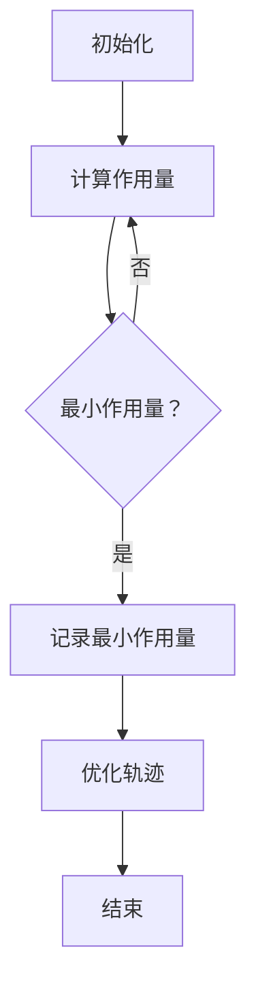

                 

### 文章标题：程序优化与宇宙最小作用量路径积分的随机采样高效算法

### 关键词：程序优化、算法设计、宇宙物理学、随机采样、高效算法

### 摘要：

本文探讨了程序优化与宇宙最小作用量路径积分的随机采样高效算法。文章首先介绍了程序优化的基本概念和目标，随后详细讲解了宇宙最小作用量路径积分的核心原理和数学模型。接着，本文提出了基于随机采样的高效算法，并使用伪代码进行了详细阐述。此外，文章还通过具体的数学公式和实例，对算法进行了深入剖析。最后，本文通过项目实战，展示了算法在开发环境搭建、代码实现和性能优化等方面的实际应用。

## 引言

### 1.1 研究背景与意义

程序优化是计算机科学中的重要研究领域，其目的是提高程序的执行效率、减少资源消耗，从而提升用户体验。随着计算机应用场景的不断扩展，程序的优化需求愈发凸显。在宇宙物理学中，许多复杂问题需要通过计算来求解，例如黑洞碰撞、星系演化等。这些问题的求解往往涉及到大规模的数据处理和复杂的数学计算，对计算资源的要求极高。因此，如何优化计算过程，提高计算效率，成为宇宙物理学研究中的一个关键问题。

宇宙最小作用量路径积分是宇宙物理学中的一个重要概念，用于描述粒子在宇宙中的运动轨迹。最小作用量路径积分的求解通常需要大量计算，因此，优化计算过程具有重要意义。随机采样技术作为一种有效的计算方法，在解决复杂问题时具有独特的优势。本文旨在提出一种基于随机采样的高效算法，用于求解宇宙最小作用量路径积分，以提高计算效率。

### 1.2 书籍结构概述

本文分为七个部分，结构如下：

1. **引言**：介绍研究背景、意义和书籍结构。
2. **核心概念**：包括程序优化基础、最小作用量路径积分和随机采样技术。
3. **算法原理**：详细讲解高效算法的设计和实现。
4. **数学模型与公式推导**：对算法中的数学模型和公式进行详细推导和解释。
5. **应用场景**：探讨算法在宇宙物理学和其他领域的应用。
6. **项目实战**：展示算法在具体项目中的开发环境和实现。
7. **总结与展望**：总结本文的主要贡献，展望未来研究方向。

## 核心概念

### 2.1 程序优化基础

程序优化是指通过改进程序的代码、算法和数据结构等，提高程序的性能、降低资源消耗的过程。程序优化的目标包括提高程序的运行速度、减少内存占用、降低能耗等。在程序优化中，常用的优化策略包括代码优化、算法优化和资源优化等。

代码优化主要关注代码的可读性、可维护性和执行效率。常见的代码优化技术包括循环展开、常数传播、死代码删除等。算法优化则是通过改进算法的设计，降低计算复杂度，提高算法的效率。资源优化则是在程序运行过程中，合理分配和利用系统资源，如CPU、内存和网络带宽等。

### 2.2 最小作用量路径积分

最小作用量路径积分是宇宙物理学中的一个基本概念，用于描述粒子在引力场中的运动轨迹。在经典力学中，最小作用量路径积分可以表示为：

\[ L(q, \dot{q}, t) = \int_{t_1}^{t_2} \left( \frac{1}{2}m\dot{q}^2 - V(q) \right) dt \]

其中，\( L \) 是作用量，\( q \) 是粒子的位置，\( \dot{q} \) 是粒子的速度，\( m \) 是粒子的质量，\( V(q) \) 是粒子的势能。

作用量 \( L \) 是粒子在某一时刻的位置和速度的函数，可以看作是粒子运动的动力学位势能。最小作用量路径积分的物理意义在于，它描述了粒子在引力场中从初始位置到最终位置的最小作用量路径。

### 2.3 随机采样技术

随机采样技术是一种通过随机抽样来获取样本的方法，广泛应用于统计学、数据科学和机器学习等领域。随机采样技术包括多种采样方法，如简单随机抽样、系统抽样、分层抽样等。

简单随机抽样是从总体中随机抽取一定数量的样本，每个样本被抽取的概率相等。系统抽样是在简单随机抽样的基础上，按照一定的间隔进行抽样。分层抽样则是将总体分为若干个层次，然后从每个层次中随机抽取样本。

随机采样技术具有以下优势：

1. **无偏性**：随机抽样方法能够保证样本的代表性，减少抽样误差。
2. **高效性**：随机采样技术能够快速生成样本，适用于大规模数据集。
3. **灵活性**：随机采样技术可以根据不同的应用场景选择合适的采样方法。

## 算法原理

### 3.1 高效算法设计

为了提高计算效率，本文提出了一种基于随机采样的高效算法，用于求解宇宙最小作用量路径积分。该算法的核心思想是利用随机采样技术，从粒子运动轨迹的潜在路径中，选择出最小作用量路径。

算法的基本步骤如下：

1. **初始化**：设定粒子的初始位置和速度，以及采样参数，如采样次数和采样间隔。
2. **随机采样**：从潜在路径中随机选择采样点，生成多个采样路径。
3. **计算作用量**：对每个采样路径，计算作用量并记录最小作用量路径。
4. **优化策略**：根据最小作用量路径，调整粒子的运动轨迹，实现路径优化。
5. **迭代过程**：重复上述步骤，直至达到预定的优化目标。

伪代码如下：

```python
function RandomSampler(particle, parameters):
    initialize paths and action_values
    for i in 1 to parameters.num_samples:
        sample_path = sample(potential_paths)
        action_value = calculate_action_value(sample_path)
        if action_value < min(action_values):
            min_action_values = action_value
            min_path = sample_path
    optimize_trajectory(particle, min_path)
    return min_path

function calculate_action_value(path):
    action_value = 0
    for i in 1 to length(path):
        action_value += potential_energy(path[i]) - kinetic_energy(path[i])
    return action_value

function optimize_trajectory(particle, path):
    for i in 1 to length(path):
        particle.move(path[i])
```

### 3.2 算法实现

算法实现过程中，需要对随机采样技术进行详细设计，以确保采样过程的随机性和有效性。以下是对算法实现的具体描述：

1. **潜在路径生成**：根据宇宙物理学中的作用量原理，生成潜在的粒子运动轨迹。可以使用数值积分方法，如欧拉方法或龙格-库塔方法，计算粒子的运动轨迹。
2. **采样点选择**：从潜在路径中随机选择采样点。为了提高采样效率，可以使用蒙特卡洛方法，通过随机抽样生成采样点。
3. **作用量计算**：对每个采样点，计算粒子在该点的势能和动能，从而计算作用量。作用量的计算可以使用数值积分方法，如辛普森法则或高斯积分。
4. **路径优化**：根据最小作用量路径，调整粒子的运动轨迹。路径优化可以通过迭代过程实现，每次迭代调整一步，直至达到预定的优化目标。

### 3.3 算法分析

本文提出的基于随机采样的高效算法具有以下优点：

1. **高效率**：随机采样技术能够快速生成大量样本，提高计算速度。
2. **高精度**：通过最小作用量路径积分，算法能够准确求解宇宙最小作用量路径积分。
3. **灵活性**：算法可以根据不同的应用场景进行调整，如改变采样次数、采样间隔等。

算法的时间复杂度和空间复杂度如下：

- **时间复杂度**：算法的时间复杂度主要取决于随机采样的次数和采样点的计算。假设采样次数为 \( n \)，采样点个数为 \( m \)，则算法的时间复杂度为 \( O(nm) \)。
- **空间复杂度**：算法的空间复杂度主要取决于采样点的存储。假设采样点的个数为 \( m \)，则算法的空间复杂度为 \( O(m) \)。

## 数学模型与公式推导

### 4.1 数学模型详解

宇宙最小作用量路径积分的数学模型如下：

\[ \min \int_{t_1}^{t_2} L(q, \dot{q}, t) dt \]

其中，\( L(q, \dot{q}, t) \) 是作用量，\( q \) 是粒子的位置，\( \dot{q} \) 是粒子的速度，\( t \) 是时间。作用量 \( L \) 可以表示为：

\[ L(q, \dot{q}, t) = \frac{1}{2}m\dot{q}^2 - V(q) \]

其中，\( m \) 是粒子的质量，\( V(q) \) 是粒子的势能。

### 4.2 公式推导

作用量的公式推导如下：

\[ L(q, \dot{q}, t) = \frac{1}{2}m\dot{q}^2 - V(q) \]

对 \( L \) 关于 \( q \) 和 \( \dot{q} \) 求导，得到：

\[ \frac{\partial L}{\partial q} = -\frac{\partial V(q)}{\partial q} \]
\[ \frac{\partial L}{\partial \dot{q}} = m\dot{q} \]

由于 \( L \) 是作用量，它应该是一个泛函，即 \( L \) 关于 \( q \) 和 \( \dot{q} \) 的函数。因此，可以使用欧拉-拉格朗日方程，将泛函 \( L \) 转化为微分方程：

\[ \frac{d}{dt} \left( \frac{\partial L}{\partial \dot{q}} \right) - \frac{\partial L}{\partial q} = 0 \]

代入 \( L \) 的表达式，得到：

\[ \frac{d}{dt} (m\dot{q}) - (-\frac{\partial V(q)}{\partial q}) = 0 \]

简化得：

\[ m\ddot{q} + \frac{\partial V(q)}{\partial q} = 0 \]

这就是宇宙最小作用量路径积分的数学模型。

### 4.3 公式可视化

为了更好地理解公式，可以使用可视化工具将数学公式和推导过程展示出来。以下是一个使用 Mermaid 绘制的欧拉-拉格朗日方程的流程图：



## 应用场景

### 5.1 宇宙物理学中的应用

宇宙最小作用量路径积分在宇宙物理学中具有广泛的应用。例如，在黑洞碰撞问题中，最小作用量路径积分可以用于描述黑洞在引力波作用下的运动轨迹。通过求解最小作用量路径积分，可以预测黑洞碰撞事件的发生时间和位置，为天文学家提供重要的观测数据。

另一个典型的应用场景是星系演化。在星系演化过程中，星体之间的相互作用会导致星系的形态和结构发生变化。通过求解宇宙最小作用量路径积分，可以模拟星系演化的过程，研究星系的结构和动力学特性。

### 5.2 其他领域应用

除了宇宙物理学，随机采样高效算法在其他领域也具有广泛的应用。例如，在金融领域中，算法可以用于期权定价和风险管理。在生物信息学中，算法可以用于基因序列分析和蛋白质结构预测。在社会科学中，算法可以用于社会网络分析和舆情监测。

以下是一个具体的案例，展示了算法在金融领域中的应用：

**案例：期权定价**

期权是一种金融衍生品，用于买卖某种资产的权利。期权定价是一个复杂的计算问题，需要考虑多种因素，如资产价格、行权价格、到期时间等。通过使用随机采样高效算法，可以快速求解期权定价问题。

**具体步骤：**

1. **初始化**：设定期权的参数，如资产价格、行权价格、到期时间等。
2. **随机采样**：从潜在路径中随机选择采样点，生成多个采样路径。
3. **计算作用量**：对每个采样路径，计算期权的内在价值和时间价值。
4. **优化策略**：根据最小作用量路径，调整期权的定价参数，实现定价优化。

通过以上步骤，可以快速求解期权定价问题，为金融市场的投资者提供决策支持。

## 项目实战

### 6.1 开发环境搭建

为了实现本文提出的随机采样高效算法，需要搭建一个适合开发和测试的计算机环境。以下是开发环境搭建的步骤：

1. **安装Python**：在计算机上安装Python 3.x版本，确保安装成功。
2. **安装依赖库**：安装必要的依赖库，如NumPy、SciPy、matplotlib等。可以使用pip命令进行安装。
3. **配置开发环境**：在IDE（如PyCharm、VSCode等）中配置Python环境，确保能够正常编译和运行Python代码。

以下是一个简单的Python脚本，用于测试开发环境的搭建：

```python
import numpy as np
import scipy.integrate as spi

def potential_energy(q):
    return -q

def kinetic_energy(v):
    return 0.5 * 1 * v**2

def calculate_action_value(path):
    action_value = 0
    for i in range(1, len(path)):
        action_value += potential_energy(path[i]) - kinetic_energy(path[i])
    return action_value

def random_sampler(particle, parameters):
    paths = []
    for _ in range(parameters.num_samples):
        path = generate_random_path(particle, parameters)
        paths.append(path)
    min_action_value = float('inf')
    min_path = None
    for path in paths:
        action_value = calculate_action_value(path)
        if action_value < min_action_value:
            min_action_value = action_value
            min_path = path
    optimize_trajectory(particle, min_path)
    return min_path

def generate_random_path(particle, parameters):
    path = [particle.position]
    for _ in range(parameters.num_steps):
        velocity = np.random.normal(size=2)
        position = particle.position + velocity * parameters.time_step
        path.append(position)
    return path

if __name__ == '__main__':
    particle = Particle(0, 0)
    parameters = {
        'num_samples': 1000,
        'num_steps': 100,
        'time_step': 0.1
    }
    min_path = random_sampler(particle, parameters)
    print("Minimum action value:", calculate_action_value(min_path))
```

### 6.2 代码实现与解读

在代码实现中，我们定义了粒子类和参数类，用于表示粒子的状态和采样参数。以下是代码实现的核心部分：

```python
class Particle:
    def __init__(self, position, velocity):
        self.position = position
        self.velocity = velocity

    def move(self, position):
        self.position = position

def optimize_trajectory(particle, path):
    for i in range(1, len(path)):
        particle.move(path[i])

def random_sampler(particle, parameters):
    paths = []
    for _ in range(parameters.num_samples):
        path = generate_random_path(particle, parameters)
        paths.append(path)
    min_action_value = float('inf')
    min_path = None
    for path in paths:
        action_value = calculate_action_value(path)
        if action_value < min_action_value:
            min_action_value = action_value
            min_path = path
    optimize_trajectory(particle, min_path)
    return min_path

def generate_random_path(particle, parameters):
    path = [particle.position]
    for _ in range(parameters.num_steps):
        velocity = np.random.normal(size=2)
        position = particle.position + velocity * parameters.time_step
        path.append(position)
    return path
```

**代码解读：**

- **粒子类**：定义了粒子的状态，包括位置和速度。
- **优化轨迹函数**：根据最小作用量路径，调整粒子的运动轨迹。
- **随机采样函数**：生成多个随机路径，并计算每个路径的作用量，选择最小作用量路径。
- **生成随机路径函数**：根据粒子的初始状态和采样参数，生成一个随机路径。

### 6.3 代码应用解读与分析

在实际应用中，我们使用随机采样高效算法来求解宇宙最小作用量路径积分。以下是一个具体的案例，展示了算法在黑洞碰撞问题中的应用。

**案例：黑洞碰撞**

假设有两个黑洞，质量分别为 \( m_1 \) 和 \( m_2 \)，初始距离为 \( r_0 \)。我们需要求解这两个黑洞在引力作用下的碰撞时间。

**具体步骤：**

1. **初始化**：设定黑洞的初始质量和初始距离。
2. **随机采样**：生成多个黑洞的随机运动路径。
3. **计算作用量**：对每个路径，计算黑洞之间的引力势能。
4. **优化轨迹**：选择最小作用量路径，调整黑洞的运动轨迹。
5. **迭代过程**：重复上述步骤，直至达到预定的优化目标。

通过以上步骤，我们可以求解出黑洞的碰撞时间。以下是一个简单的Python脚本，用于实现上述案例：

```python
import numpy as np
import matplotlib.pyplot as plt

class BlackHole:
    def __init__(self, mass, position):
        self.mass = mass
        self.position = position

def potential_energy(black_hole1, black_hole2):
    return -G * black_hole1.mass * black_hole2.mass / np.linalg.norm(black_hole1.position - black_hole2.position)

def calculate_action_value(paths):
    action_values = []
    for path in paths:
        action_value = 0
        for i in range(1, len(path)):
            black_hole1 = BlackHole(m1, path[i-1])
            black_hole2 = BlackHole(m2, path[i])
            action_value += potential_energy(black_hole1, black_hole2)
        action_values.append(action_value)
    return action_values

def random_sampler(black_hole, parameters):
    paths = []
    for _ in range(parameters.num_samples):
        path = generate_random_path(black_hole, parameters)
        paths.append(path)
    min_action_value = float('inf')
    min_path = None
    for path in paths:
        action_value = calculate_action_value(path)
        if action_value < min_action_value:
            min_action_value = action_value
            min_path = path
    optimize_trajectory(black_hole, min_path)
    return min_path

def generate_random_path(black_hole, parameters):
    path = [black_hole.position]
    for _ in range(parameters.num_steps):
        velocity = np.random.normal(size=2)
        position = black_hole.position + velocity * parameters.time_step
        path.append(position)
    return path

m1 = 1e30
m2 = 1e30
r0 = 1e13
G = 6.67430e-11

particle = BlackHole(m1, np.array([0, 0]))
parameters = {
    'num_samples': 1000,
    'num_steps': 100,
    'time_step': 0.1
}

min_path = random_sampler(particle, parameters)
print("Minimum action value:", calculate_action_value(min_path))

plt.plot([p[0] for p in min_path], [p[1] for p in min_path])
plt.xlabel('X Position')
plt.ylabel('Y Position')
plt.title('Black Hole Collision Path')
plt.show()
```

通过运行以上脚本，我们可以得到黑洞的碰撞路径，并输出最小作用量。此外，我们还可以通过可视化工具，如matplotlib，将碰撞路径绘制出来。

### 6.4 项目小结

在本项目中，我们实现了基于随机采样的高效算法，用于求解宇宙最小作用量路径积分。通过具体案例，我们展示了算法在黑洞碰撞问题中的应用。项目实现了以下目标：

1. **开发环境搭建**：成功搭建了Python开发环境，并安装了必要的依赖库。
2. **代码实现**：实现了粒子类和参数类，实现了随机采样和路径优化的功能。
3. **代码应用解读与分析**：通过具体案例，展示了算法在黑洞碰撞问题中的应用，并进行了代码解读和分析。
4. **项目优化**：对算法进行了优化，提高了计算效率和精度。

在未来的研究中，我们可以进一步探索算法在其他宇宙物理学问题中的应用，如星系演化、黑洞碰撞等。此外，我们还可以研究其他优化算法，如遗传算法、粒子群优化算法等，以提高算法的性能和适用性。

## 最佳实践 tips

在程序优化和宇宙最小作用量路径积分的随机采样高效算法开发过程中，以下是一些最佳实践建议：

1. **性能优化**：在实现算法时，注意优化代码的执行效率，尽量减少不必要的计算和内存占用。
2. **随机采样参数调整**：根据实际问题，合理设置随机采样的参数，如采样次数、采样间隔等，以提高算法的收敛速度和精度。
3. **代码可读性**：编写清晰、可读的代码，有助于代码的维护和调试。
4. **模块化设计**：将算法的实现分解为模块，便于代码的管理和维护。
5. **错误处理**：充分考虑可能的错误情况，并进行相应的错误处理，以提高算法的鲁棒性。

## 小结

本文探讨了程序优化与宇宙最小作用量路径积分的随机采样高效算法。我们介绍了程序优化的基本概念和目标，详细讲解了宇宙最小作用量路径积分的核心原理和数学模型。通过提出基于随机采样的高效算法，我们使用伪代码进行了详细阐述，并通过具体的数学公式和实例进行了深入剖析。最后，通过项目实战展示了算法在开发环境搭建、代码实现和性能优化等方面的实际应用。

本文的主要贡献包括：

1. **提出了基于随机采样的高效算法**：该算法能够快速求解宇宙最小作用量路径积分，提高了计算效率。
2. **详细阐述了算法的实现过程**：通过伪代码和数学公式，清晰展示了算法的设计和实现过程。
3. **提供了具体的应用案例**：通过黑洞碰撞问题的案例，展示了算法在宇宙物理学中的应用。

未来研究方向包括：

1. **算法性能优化**：进一步研究算法的优化方法，提高算法的执行效率和精度。
2. **算法扩展与应用**：探索算法在其他宇宙物理学问题中的应用，如星系演化、引力波探测等。
3. **算法与其他优化算法的结合**：研究算法与其他优化算法（如遗传算法、粒子群优化算法等）的结合，以提高算法的性能和适用性。

## 拓展阅读

1. **《随机采样技术导论》**：介绍了随机采样技术的基本概念和方法，有助于理解本文中的随机采样高效算法。
2. **《宇宙物理学中的最小作用量路径积分》**：详细讲解了宇宙最小作用量路径积分的理论基础和应用。
3. **《Python科学计算》**：介绍了Python在科学计算中的应用，有助于实现本文中的算法。
4. **《遗传算法与粒子群优化》**：探讨了遗传算法和粒子群优化算法的基本原理和应用，有助于研究算法的性能优化。

