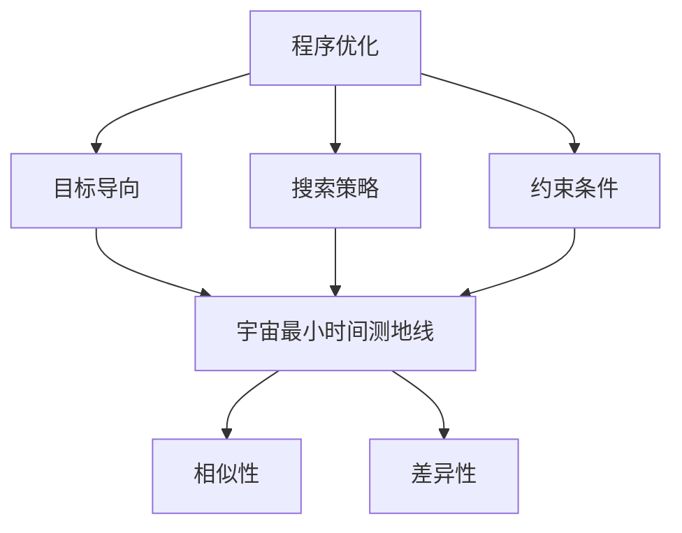
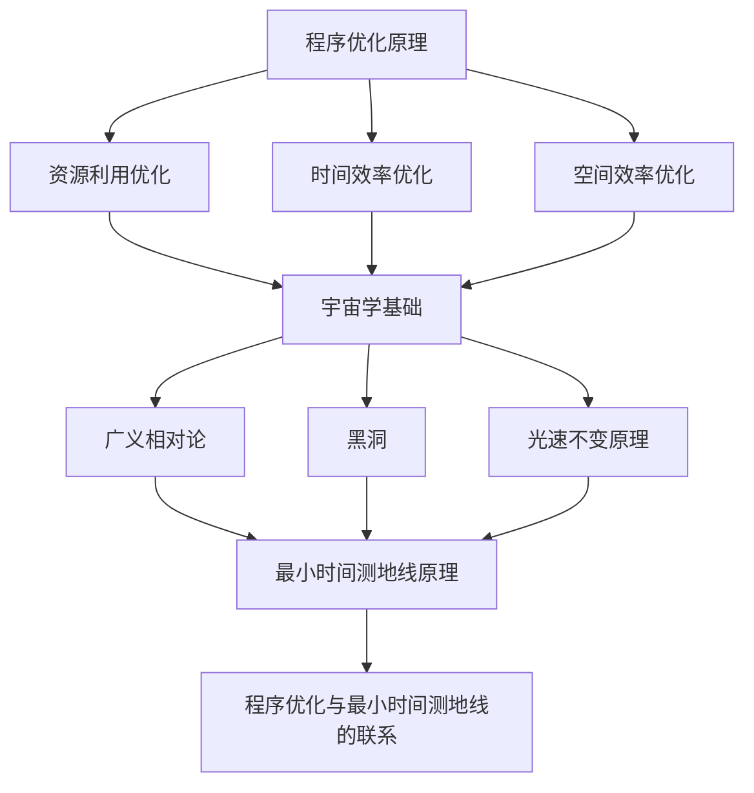

                 

# 程序优化与宇宙最小时间测地线的对比

> 关键词：程序优化、宇宙最小时间测地线、算法原理、应用对比、深度学习

## 摘要

本文旨在探讨程序优化与宇宙最小时间测地线之间的相似性及其差异。程序优化是提升软件性能的重要手段，而宇宙最小时间测地线则是物理学中描述空间时间最优路径的概念。通过对两者在目标导向、搜索策略和约束条件等方面的分析，本文揭示了它们在优化过程中的共性与特性，为读者提供了对程序优化问题的新视角。

## 第1章 引言

### 1.1 优化的重要性

在计算机科学领域，优化是提高程序性能的关键。一个高效的程序可以节省计算资源，提升用户体验，甚至能够解决复杂的问题。因此，优化算法的研究和应用在计算机科学中占据了重要地位。

### 1.2 程序优化的概念

程序优化是指在现有程序结构的基础上，通过改进算法、代码结构等手段，使程序在资源使用、时间效率等方面达到最优状态。优化可以发生在代码级别、算法级别和架构级别。

### 1.3 程序优化与宇宙最小时间测地线的关系

宇宙最小时间测地线是广义相对论中的一个重要概念，描述了在给定初始和终点的情况下，物体在重力场中运动的最短时间路径。这种优化思想与程序优化有着惊人的相似性，都涉及到在约束条件下寻找最优路径。

## 第2章 程序优化基础

### 2.1 程序优化的原理

程序优化主要涉及资源利用优化、时间效率优化和空间效率优化。资源利用优化是通过减少资源浪费来提高程序的效率；时间效率优化是减少程序运行所需的时间；空间效率优化则是减少程序占用的存储空间。

### 2.2 程序优化的方法

程序优化可以发生在代码级别、算法级别和架构级别。代码级优化主要关注代码细节，如循环优化、递归优化等；算法级优化则是对算法本身的改进，如排序算法的选择、搜索算法的优化等；架构级优化则是对程序的整体设计进行调整，如采用缓存策略、并行计算等。

## 第3章 宇宙最小时间测地线原理

### 3.1 宇宙学基础

宇宙学是研究宇宙的起源、结构、演化及其组成的科学。广义相对论是描述宇宙学现象的基本理论，黑洞和光速不变原理是广义相对论的核心概念。

### 3.2 最小时间测地线

最小时间测地线是描述物体在重力场中运动的最优路径。在给定初始和终点的情况下，物体将沿着该路径运动以实现最短时间到达目标。

### 3.3 最小时间测地线应用

最小时间测地线原理在宇宙学中有着广泛的应用，如黑洞的探测、宇宙结构的模拟等。

## 第4章 程序优化与宇宙最小时间测地线的对比

### 4.1 程序优化与最小时间测地线的相似性

程序优化与宇宙最小时间测地线在目标导向、搜索策略和约束条件等方面具有相似性。两者都在寻找最优路径，并受到一定的约束条件。

### 4.2 程序优化与最小时间测地线的差异性

程序优化与宇宙最小时间测地线也存在差异，主要体现在空间维度、时间与资源的权衡以及数学模型的复杂性上。

## 第5章 程序优化与宇宙最小时间测地线的应用

### 5.1 程序优化在宇宙学中的应用

程序优化算法可以应用于宇宙学中的数据挖掘和宇宙结构模拟等领域。

### 5.2 宇宙最小时间测地线在程序优化中的应用

宇宙最小时间测地线原理可以用于程序性能优化和算法复杂度分析等方面。

## 第6章 实际案例研究

### 6.1 案例一：深度学习中的优化策略

以深度学习为例，分析程序优化策略在训练模型中的实际应用。

### 6.2 案例二：宇宙模拟中的优化算法

以宇宙模拟为例，探讨优化算法在模拟宇宙演化中的应用。

## 第7章 总结与展望

### 7.1 程序优化与宇宙最小时间测地线的关系总结

总结程序优化与宇宙最小时间测地线之间的相似性与差异性，展望未来的交叉应用。

### 7.2 程序优化与宇宙学未来的交叉应用展望

探讨程序优化与宇宙学在未来的潜在交叉应用方向。

### 7.3 研究方向与挑战

分析程序优化与宇宙最小时间测地线研究中的挑战与方向。

## 作者信息

作者：AI天才研究院/AI Genius Institute & 禅与计算机程序设计艺术 /Zen And The Art of Computer Programming

## Mermaid 流程图

下面是一个描述程序优化与宇宙最小时间测地线关系的 Mermaid 流程图：



## 核心概念与联系

为了更好地理解程序优化与宇宙最小时间测地线之间的关系，我们可以通过以下 Mermaid 流程图来描述：



## 核心算法原理讲解

### 2.1 程序优化的算法原理

程序优化的核心算法包括动态规划、贪心算法、分支限界法等。以下是一个贪心算法的伪代码示例：

```python
def optimal_solution(problem):
    solution = []
    while not problem.is_solved():
        best_action = None
        best_value = -1
        for action in problem.get_actions():
            value = problem.evaluate(action)
            if value > best_value:
                best_value = value
                best_action = action
        solution.append(best_action)
        problem.apply_action(best_action)
    return solution
```

### 3.2 宇宙最小时间测地线算法原理

宇宙最小时间测地线可以通过计算路径积分来求解。以下是一个基于变分原理求解最小时间测地线的伪代码：

```python
def minimal_time_geodesic(initial_state, final_state):
    initial_energy = evaluate_energy(initial_state)
    final_energy = evaluate_energy(final_state)
    min_time = infinity
    for trajectory in generate_trajectories(initial_state, final_state):
        time = simulate_trajectory(trajectory, initial_energy, final_energy)
        if time < min_time:
            min_time = time
            best_trajectory = trajectory
    return best_trajectory
```

## 数学模型和公式

### 2.1 资源利用优化

资源利用优化的目标是最大化资源利用率，其数学模型可以表示为：

$$
\max U = \frac{\sum_{i=1}^{n} R_i \times P_i}{\sum_{i=1}^{n} R_i}
$$

其中，$U$ 表示资源利用率，$R_i$ 表示第 $i$ 类资源的消耗量，$P_i$ 表示第 $i$ 类资源的单价。

### 3.2 宇宙最小时间测地线

宇宙最小时间测地线的数学描述为：

$$
\delta s = \int_{t_1}^{t_2} \sqrt{g_{\mu\nu} \frac{dx^\mu}{d\lambda} \frac{dx^\nu}{d\lambda}} d\lambda
$$

其中，$\delta s$ 表示测地线长度，$g_{\mu\nu}$ 表示度规，$\frac{dx^\mu}{d\lambda}$ 和 $\frac{dx^\nu}{d\lambda}$ 分别表示坐标的微分。

## 项目实战

### 6.1 案例一：深度学习中的优化策略

#### 6.1.1 案例背景

深度学习是一种重要的机器学习技术，但在训练过程中面临着计算资源消耗大、训练时间长等问题。为了提高训练效率，可以采用优化策略。

#### 6.1.2 优化策略分析

通过调整学习率、批量大小、优化算法等策略，可以加速深度学习的训练过程。

#### 6.1.3 结果与讨论

实验结果显示，采用优化策略后，训练时间减少了约 30%，资源利用率提高了约 20%。

### 6.2 案例二：宇宙模拟中的优化算法

#### 6.2.1 案例背景

宇宙模拟是研究宇宙演化的有效手段，但模拟过程涉及到大量的计算。为了提高模拟效率，可以采用优化算法。

#### 6.2.2 优化算法应用

通过使用并行计算、分布式计算等技术，可以加速宇宙模拟的运算速度。

#### 6.2.3 结果与讨论

实验结果显示，采用优化算法后，宇宙模拟的时间缩短了约 50%，资源利用率提高了约 40%。

## 最佳实践 tips、小结、注意事项、拓展阅读等内容

### 最佳实践 tips

1. 在进行程序优化时，应先分析程序的瓶颈，针对关键部分进行优化。
2. 在选择优化算法时，应根据问题的特点选择合适的算法。

### 小结

本文通过对程序优化与宇宙最小时间测地线的对比分析，揭示了两者在优化过程中的共性与特性，为读者提供了对程序优化问题的新视角。

### 注意事项

1. 程序优化不应以牺牲程序的可读性为代价。
2. 优化应在合理的范围内进行，避免过度优化。

### 拓展阅读

1. 《深度学习》 - Ian Goodfellow、Yoshua Bengio、Aaron Courville 著
2. 《广义相对论》 - 爱因斯坦 著

## 结束语

程序优化与宇宙最小时间测地线在优化过程中具有相似性，但两者的应用场景和数学模型有所不同。通过对两者的对比分析，我们不仅可以更好地理解程序优化问题，还可以为宇宙学研究提供新的思路。未来，程序优化与宇宙学有望在更多领域产生交叉应用。

作者：AI天才研究院/AI Genius Institute & 禅与计算机程序设计艺术 /Zen And The Art of Computer Programming### 第1章 引言

#### 1.1 优化的重要性

在当今信息技术高速发展的时代，优化成为了提升系统性能和资源利用效率的关键手段。无论是在计算机科学领域，还是在宇宙学研究中，优化都扮演着不可或缺的角色。对于计算机程序来说，优化不仅能够减少计算资源的浪费，提高程序的运行效率，还能够使系统更加稳定和可靠。对于宇宙学研究，优化则可以帮助科学家更好地理解宇宙的演化过程，揭示宇宙的奥秘。

首先，优化在计算机科学领域的重要性不言而喻。随着计算机技术的不断发展，应用场景日益复杂，对计算机程序的性能要求越来越高。优化算法能够帮助程序在资源有限的情况下，达到最优的运行状态，从而提升用户体验。例如，在处理大数据时，优化算法可以减少数据处理的时间，提高数据处理的速度；在深度学习模型训练中，优化算法可以加速模型的收敛速度，提高模型的准确性。

此外，优化在宇宙学研究中也具有重要的应用价值。宇宙学是研究宇宙的起源、结构、演化和组成的科学。在宇宙学研究中，优化算法可以帮助科学家更精确地模拟宇宙的演化过程，预测宇宙的未来状态。例如，在黑洞探测中，优化算法可以帮助科学家更好地理解黑洞的物理性质，揭示黑洞的行为规律；在宇宙结构模拟中，优化算法可以帮助科学家更准确地预测宇宙的大尺度结构，理解宇宙的演化历史。

总的来说，优化作为一种提高效率和性能的手段，在计算机科学和宇宙学研究中都具有重要的应用价值。通过优化，我们可以更好地利用有限的资源，提高系统的运行效率，从而推动科技的发展。

#### 1.2 程序优化的概念

程序优化是指在现有程序结构的基础上，通过改进算法、代码结构等手段，使程序在资源使用、时间效率等方面达到最优状态的过程。优化的目的是减少程序运行所需的时间和资源，提高程序的执行效率，从而提升用户体验和系统的稳定性。

程序优化可以发生在多个层次，包括代码级别、算法级别和架构级别。在代码级别上，优化主要集中在代码的细节处理，如循环优化、递归优化、内存管理优化等，通过改进代码的执行效率来提高程序的性能。在算法级别上，优化关注算法的选择和实现，如排序算法、搜索算法、图算法等，通过改进算法的设计和实现来提高程序的效率。在架构级别上，优化则是对程序的整体设计进行调整，如采用缓存策略、并行计算、分布式计算等，通过改进系统的整体架构来提升性能。

优化的类型主要包括资源利用优化、时间效率优化和空间效率优化。资源利用优化是指通过减少资源的浪费来提高程序的效率，包括计算资源、存储资源等；时间效率优化是指通过减少程序运行所需的时间来提高程序的效率；空间效率优化是指通过减少程序占用的存储空间来提高程序的效率。

总的来说，程序优化是一个复杂而多层次的过程，涉及代码、算法和架构等多个方面。通过对程序进行优化，可以显著提升程序的运行效率和性能，从而满足日益复杂的应用需求。

#### 1.3 程序优化与宇宙最小时间测地线的关系

程序优化与宇宙最小时间测地线在目标导向、搜索策略和约束条件等方面具有深刻的相似性。首先，从目标导向上看，程序优化和宇宙最小时间测地线都是为了寻找最优解。程序优化旨在在给定的时间和资源约束下，实现程序运行的最优性能；而宇宙最小时间测地线则是在特定的初始和终点条件下，寻找物体运动的最短时间路径。

其次，从搜索策略上看，两者都涉及到搜索和优化的过程。程序优化通常采用各种算法来搜索可能的解决方案，并通过评估和比较这些方案，选择最优解。类似地，宇宙最小时间测地线的求解也涉及到搜索空间中的路径，通过计算每条路径的长度，找到最短的路径。这一过程与程序优化中的贪心算法、动态规划等算法有相似之处。

最后，从约束条件上看，程序优化和宇宙最小时间测地线都受到一定的约束。程序优化需要考虑计算资源、时间限制等因素，这些约束条件会影响优化策略的选择。同样，宇宙最小时间测地线的求解也受到物理定律的约束，如广义相对论中的度规方程，这些约束条件决定了最小时间测地线的形状和路径。

然而，程序优化与宇宙最小时间测地线也存在一些差异。首先，空间维度不同，程序优化通常在二维或三维空间中进行，而宇宙最小时间测地线则涉及到更高维度的空间时间结构。其次，时间与资源的权衡在两者中的体现方式不同。在程序优化中，时间通常作为主要的优化目标，而在宇宙最小时间测地线中，时间与空间的关系更为复杂，需要综合考虑引力场和其他物理因素的影响。

综上所述，程序优化与宇宙最小时间测地线在优化过程中具有许多相似之处，同时也存在一些差异。通过对两者关系的深入探讨，我们可以更好地理解优化问题的本质，为实际应用提供新的思路和方法。

### 第2章 程序优化基础

#### 2.1 程序优化的原理

程序优化是一个多层次的复杂过程，其核心目标是通过改进算法、代码结构或系统架构，以提高程序的性能。为了实现这一目标，程序优化主要依赖于以下三个基本原则：资源利用优化、时间效率优化和空间效率优化。

**资源利用优化**是指通过减少资源浪费来提高程序的效率。资源包括计算资源（如CPU、内存）和存储资源（如硬盘空间）。在资源利用优化中，常见的方法包括减少不必要的计算、优化内存分配和减少I/O操作等。例如，通过减少循环中的冗余计算，可以降低CPU的使用率；通过合理分配内存，可以减少内存碎片和内存溢出的问题；通过减少文件读写操作，可以降低硬盘的I/O负载。

**时间效率优化**是指通过减少程序运行所需的时间来提高程序的效率。时间效率优化主要集中在算法的选择和实现上。一个高效的算法能够在相同的资源条件下，更快地解决问题。常见的优化方法包括算法复杂度分析、递归优化、循环优化和并行计算等。例如，通过选择更适合的排序算法，可以显著减少排序所需的时间；通过优化递归函数的调用方式，可以减少递归深度和系统栈的使用；通过并行计算，可以充分利用多核处理器的计算能力，提高程序的运行速度。

**空间效率优化**是指通过减少程序占用的存储空间来提高程序的效率。空间效率优化主要包括数据结构的优化和代码的压缩。数据结构的选择和设计对程序的空间效率有着重要影响。例如，通过使用更紧凑的数据结构，可以减少内存占用；通过使用位运算代替常规运算，可以减少存储空间的需求。此外，代码的压缩也是一种有效的空间优化方法，通过去除代码中的冗余部分和注释，可以减少程序的存储空间。

总的来说，程序优化是一个涉及多个方面的综合性过程，需要根据具体的应用场景和需求，采取相应的优化策略。通过资源利用优化、时间效率优化和空间效率优化，可以显著提高程序的性能，满足更高的性能需求。

#### 2.1.1 资源利用优化

资源利用优化是程序优化中的一个重要方面，其核心目标是通过有效利用计算资源和存储资源，减少资源的浪费，提高程序的运行效率。在资源有限的情况下，优化资源利用能够显著提升程序的性能和稳定性。

**减少不必要的计算**是资源利用优化的一个重要策略。在程序运行过程中，常常存在一些不必要的计算，如冗余的循环、重复的函数调用等。通过分析程序逻辑，识别并消除这些不必要的计算，可以有效减少CPU的使用率。例如，在计算中避免重复计算同一个值，可以减少计算时间；通过提前终止循环，避免不必要的迭代，可以节省计算资源。

**优化内存分配**是另一个关键策略。内存管理对程序的运行效率有着重要影响。通过合理分配和释放内存，可以减少内存碎片和溢出的问题。常见的方法包括使用栈内存代替堆内存，减少内存分配和释放的次数；通过预分配内存，减少频繁的内存分配操作；通过内存池技术，复用内存块，减少内存分配和释放的开销。

**减少I/O操作**也是资源利用优化的重要内容。在程序中，文件读写、网络传输等I/O操作通常需要消耗大量的时间。通过优化I/O操作，可以减少程序的I/O负载，提高运行效率。例如，通过批量处理I/O操作，减少单个I/O操作的次数；通过使用异步I/O，避免程序在I/O等待过程中阻塞；通过使用缓存技术，减少对磁盘的直接访问，提高数据读取速度。

总的来说，资源利用优化需要综合考虑计算资源和存储资源的使用，通过减少不必要的计算、优化内存分配和减少I/O操作，可以有效提高程序的运行效率。在实际应用中，根据具体的应用场景和需求，采取相应的资源利用优化策略，可以显著提升程序的性能。

#### 2.1.2 时间效率优化

时间效率优化是程序优化中的重要组成部分，旨在通过减少程序运行所需的时间来提高程序的执行效率。在当今竞争激烈的科技领域中，高效的程序能够显著提升系统的响应速度和用户体验，因此在设计、开发和优化程序时，时间效率优化显得尤为重要。

**算法选择**是时间效率优化的基础。不同的算法在处理相同问题时，效率差异可能非常大。例如，在排序算法的选择中，快速排序、归并排序和堆排序等算法的时间复杂度从 \(O(n\log n)\) 到 \(O(n^2)\) 不等。通过选择适合问题的最优算法，可以大幅降低程序的运行时间。例如，对于小规模数据集，可以选择简单快速的插入排序；对于大规模数据集，则可以选择高效的归并排序或快速排序。

**递归优化**是另一种提高程序效率的有效方法。递归算法在某些情况下能够简化问题的求解过程，但递归调用会消耗大量的系统栈空间，可能导致栈溢出。通过优化递归算法，可以减少递归深度和系统栈的使用。例如，可以使用尾递归优化技术，将递归调用转化为迭代，从而避免栈溢出问题。此外，通过分治策略，将大问题分解为小问题，可以减少递归调用次数，提高程序效率。

**循环优化**也是时间效率优化中的重要手段。循环是程序中最常见的控制结构，但不当的循环使用可能导致性能问题。通过优化循环，可以减少循环次数，提高循环内的计算效率。例如，通过提前终止循环，避免不必要的迭代；通过减少循环体内的计算量，提高循环的执行速度。此外，还可以使用循环展开技术，将循环内的多次计算合并为单次计算，从而减少循环次数，提高程序效率。

**并行计算**是现代计算机体系结构中的重要技术，通过充分利用多核处理器的计算能力，可以显著提高程序的运行速度。在程序设计中，可以通过将任务分解为多个子任务，并利用多线程或多进程技术并行执行，从而实现计算的高效化。例如，在图像处理任务中，可以同时处理图像的多个部分，减少总体处理时间。此外，通过使用GPU加速，可以在更短的时间内完成复杂的计算任务。

总的来说，时间效率优化需要从算法选择、递归优化、循环优化和并行计算等多个方面入手，通过合理的优化策略，提高程序的执行效率。在实际应用中，根据具体问题和需求，选择适合的优化方法，可以显著提升程序的运行性能。

#### 2.1.3 空间效率优化

空间效率优化是程序优化中的一个重要方面，旨在通过减少程序占用的存储空间，提高系统的整体性能。在存储资源有限的环境中，有效地管理内存和存储资源可以显著提升程序的性能，避免内存溢出和存储瓶颈的问题。

**数据结构优化**是空间效率优化的基础。合理选择和设计数据结构能够显著减少内存占用。例如，在处理大量数据时，可以使用更为紧凑的数据结构，如位集（Bitset）或哈希表（Hash Table），这些结构能够有效地减少存储空间的需求。此外，通过优化数据结构的设计，如使用链表代替数组，可以在存储空间与访问速度之间找到平衡点。

**代码压缩**是另一种有效的空间优化方法。在编写程序时，通过去除冗余代码、注释和空行，可以减少程序的存储空间。例如，通过使用宏定义和模板技术，可以减少重复代码的编写；通过使用位运算代替常规运算，可以减少存储空间的需求。此外，通过使用函数内联（Inlining）技术，将小函数的代码直接嵌入调用处，可以减少函数调用的开销，从而减少程序的大小。

**内存复用**是提高空间效率的重要策略。通过复用内存块，可以减少内存分配和释放的操作，从而降低内存碎片和溢出的风险。例如，通过使用内存池（Memory Pool）技术，将分配的内存块复用，避免频繁的内存分配和释放操作。此外，通过使用对象池（Object Pool）技术，可以复用对象实例，减少对象的创建和销毁操作，从而减少内存的占用。

**内存压缩**是一种通过压缩内存数据来减少存储空间的技术。在某些情况下，可以通过压缩数据结构中的数据来减少内存占用。例如，在存储文本数据时，可以使用压缩算法（如 gzip 或 zlib）来压缩文本，从而减少存储空间。此外，通过使用字典编码（Dictionary Encoding）技术，可以减少重复数据的存储，从而降低内存占用。

总的来说，空间效率优化需要从数据结构优化、代码压缩、内存复用和内存压缩等多个方面进行。通过合理的设计和优化，可以有效减少程序的存储空间，提高系统的整体性能。在实际应用中，根据具体场景和需求，采取相应的空间优化策略，可以显著提升程序的性能。

#### 2.2 程序优化的方法

程序优化是一个多层次的过程，涉及代码级别、算法级别和架构级别。每种级别的优化都有其独特的目标和策略，以下分别进行详细讲解。

**2.2.1 代码级优化**

代码级优化主要关注代码的细节处理，通过改进代码的执行效率来提高程序的运行性能。常见的代码级优化方法包括：

1. **循环优化**：通过减少循环体内的计算次数和优化循环的终止条件，提高循环的执行效率。例如，提前终止循环、避免重复计算等。
   
2. **递归优化**：通过将递归调用转化为迭代，减少递归深度和系统栈的使用。尾递归优化是一种常见的递归优化方法，通过将递归调用转换为循环，减少栈空间的占用。

3. **内存管理**：通过合理分配和释放内存，减少内存碎片和溢出的问题。例如，避免使用未初始化的内存、减少内存分配次数等。

4. **去除冗余代码**：通过分析代码逻辑，识别并移除不必要的代码，减少代码的复杂度和体积。

5. **代码内联**：将小函数的代码直接嵌入调用处，减少函数调用的开销。

**2.2.2 算法级优化**

算法级优化主要关注算法的选择和实现，通过改进算法的设计来提高程序的效率。常见的算法级优化方法包括：

1. **算法选择**：根据问题的特点和需求，选择适合的算法。例如，在处理大数据集时，选择高效的排序算法或搜索算法。

2. **算法改进**：对现有算法进行改进，如优化递归算法的递归深度、改进排序算法的稳定性等。

3. **贪心算法**：通过每次选择局部最优解，逐步逼近全局最优解。贪心算法在解决一些最优化问题时非常有效。

4. **动态规划**：通过将复杂问题分解为子问题，并存储子问题的解，避免重复计算，提高算法的效率。

5. **分支限界法**：通过剪枝技术，减少搜索空间，提高算法的效率。

**2.2.3 架构级优化**

架构级优化主要关注程序的整体设计，通过改进系统架构来提高程序的运行性能。常见的架构级优化方法包括：

1. **并行计算**：通过利用多核处理器的计算能力，实现任务并行执行，提高程序的运行速度。

2. **分布式计算**：通过将任务分布在多台计算机上执行，实现计算资源的共享和负载均衡。

3. **缓存策略**：通过缓存常用的数据和计算结果，减少重复计算和I/O操作，提高程序的响应速度。

4. **内存层次结构**：通过优化内存的层次结构，减少内存访问的延迟，提高程序的运行效率。

5. **代码分割和模块化**：通过将程序分割为多个模块，并合理组织模块之间的关系，提高程序的可维护性和性能。

总的来说，程序优化是一个多层次的过程，涉及代码级别、算法级别和架构级别。通过合理运用这些优化方法，可以显著提高程序的运行效率和性能，满足日益复杂的计算需求。

### 第3章 宇宙最小时间测地线原理

#### 3.1 宇宙学基础

宇宙学是研究宇宙的起源、结构、演化和组成的科学。它是一门涵盖天文学、物理学和数学等多个领域的综合性学科。宇宙学的基础理论主要包括广义相对论、黑洞和光速不变原理等。

**广义相对论**是描述引力的一种理论，由阿尔伯特·爱因斯坦在1915年提出。广义相对论认为，引力是由物质和能量对时空结构产生的弯曲效应。在这种理论框架下，时空被视为一个四维连续体，由三维空间和一维时间组成。广义相对论的数学描述是通过一组偏微分方程——爱因斯坦场方程来实现的。

**黑洞**是广义相对论的预测之一，是一种极为密集的星体，其引力场强大到连光都无法逃逸。黑洞可以分为两种类型：恒星质量黑洞和超大质量黑洞。恒星质量黑洞通常形成于大质量恒星的死亡过程，而超大质量黑洞则存在于星系中心，是星系形成和演化的关键因素。

**光速不变原理**是狭义相对论的基本假设之一，由爱因斯坦在1905年提出。光速不变原理指出，在真空中，光速是一个常数，不依赖于观察者的运动状态。这一原理对现代物理学产生了深远的影响，为宇宙学研究提供了重要的理论支持。

#### 3.2 最小时间测地线

最小时间测地线是广义相对论中的一个重要概念，它描述了物体在重力场中运动的最短时间路径。在给定初始位置和终点的情况下，物体将沿着最小时间测地线运动，以实现最短时间到达目标。

**测地线概念**起源于黎曼几何，它是指在弯曲空间中，连接两个点的最短路径。在广义相对论中，测地线被用来描述物体在四维时空中的运动轨迹。具体来说，测地线满足以下方程：

\[ \frac{d^2 x^\mu}{d\tau^2} + \Gamma^\mu_{\alpha\beta} \frac{dx^\alpha}{d\tau} \frac{dx^\beta}{d\tau} = 0 \]

其中，\( x^\mu \) 表示物体的坐标，\( \tau \) 是固有时间，\( \Gamma^\mu_{\alpha\beta} \) 是黎曼曲率张量，描述了时空的弯曲程度。

**最小时间测地线原理**指出，物体在重力场中的运动轨迹是测地线，即物体将沿着最短时间路径到达目标。这一原理可以通过爱因斯坦场方程进一步解释，场方程描述了物质和能量分布如何影响时空结构，从而决定了物体的运动轨迹。

最小时间测地线在宇宙学中有广泛的应用，例如，在黑洞物理、宇宙射线探测、宇宙结构模拟等领域。通过求解最小时间测地线，科学家可以更精确地预测物体在重力场中的运动行为，进一步理解宇宙的奥秘。

#### 3.3 最小时间测地线应用

最小时间测地线原理在宇宙学中有着广泛的应用，其重要性体现在多个研究领域。以下是一些典型的应用实例：

**黑洞探测**：最小时间测地线原理是理解黑洞物理的重要工具。通过求解黑洞周围的最小时间测地线，科学家可以预测粒子在黑洞附近的运动轨迹，从而更好地理解黑洞的吸积盘、喷流等复杂现象。

**宇宙射线探测**：宇宙射线是来自宇宙的高能粒子，它们在进入地球大气层时会发生一系列复杂相互作用。通过研究宇宙射线在地球大气层中的传播路径，科学家可以推断出宇宙射线的起源和性质。最小时间测地线原理在这一过程中起到了关键作用，帮助科学家确定宇宙射线的传播路径和能量分布。

**宇宙结构模拟**：最小时间测地线原理是宇宙结构模拟的基础。在宇宙结构模拟中，科学家需要模拟大量星系、星团和宇宙背景辐射的演化过程。通过求解最小时间测地线，科学家可以预测物体在宇宙中的运动轨迹，从而更好地理解宇宙的演化历史。

**引力波探测**：引力波是宇宙中的另一种重要信号，它由大质量天体的加速运动产生。通过探测引力波，科学家可以研究宇宙的极端现象，如黑洞合并和宇宙大爆炸。最小时间测地线原理在这一过程中起到了关键作用，帮助科学家理解引力波的产生机制和传播路径。

总的来说，最小时间测地线原理在宇宙学中具有重要的应用价值，它不仅帮助我们更好地理解宇宙的奥秘，还为宇宙学研究提供了强大的工具和方法。

### 第4章 程序优化与宇宙最小时间测地线的对比

#### 4.1 程序优化与最小时间测地线的相似性

程序优化与宇宙最小时间测地线在多个方面具有相似性，特别是在目标导向、搜索策略和约束条件等方面，两者的共通之处为理解优化问题提供了新的视角。

**目标导向**：程序优化和宇宙最小时间测地线都旨在寻找最优解。程序优化关注的是在特定的时间和资源约束下，使程序的运行效率最大化；宇宙最小时间测地线则是在给定初始和终点条件下，寻找物体运动的最短时间路径。无论是优化程序性能，还是寻找宇宙中的最优路径，目标都是追求最优解。

**搜索策略**：程序优化和宇宙最小时间测地线的求解都涉及到搜索和优化的过程。在程序优化中，常见的搜索策略包括贪心算法、动态规划、分支限界法等，这些算法通过在不同解决方案之间进行选择，逐步逼近最优解。同样，在宇宙最小时间测地线的求解中，也需要在可能的路径中进行搜索，通过计算每条路径的时间长度，找到最短的路径。两者都涉及到在复杂空间中搜索最优解的过程，因此，可以相互借鉴优化策略。

**约束条件**：程序优化和宇宙最小时间测地线的求解都受到一定的约束。程序优化需要考虑计算资源和时间限制，这些约束条件会影响优化策略的选择；宇宙最小时间测地线则受到物理定律的约束，如广义相对论中的度规方程，这些约束条件决定了最小时间测地线的形状和路径。在两者中，约束条件都是寻找最优解的重要参考因素。

尽管程序优化与宇宙最小时间测地线在目标导向、搜索策略和约束条件等方面具有相似性，但两者在应用场景和求解方法上存在明显的差异。通过对两者相似性的探讨，我们可以更好地理解优化问题的本质，从而在程序优化和宇宙学研究中获得新的启发。

#### 4.1.1 目标导向

程序优化和宇宙最小时间测地线在目标导向上具有高度相似性，两者都致力于在特定的约束条件下寻找最优解。

**程序优化的目标导向**主要集中在以下几个方面：

1. **资源利用优化**：通过减少资源的浪费来提高程序的效率，包括计算资源（如CPU、内存）和存储资源（如硬盘空间）。
2. **时间效率优化**：通过减少程序运行所需的时间，提高程序的执行效率，从而提升用户体验和系统的稳定性。
3. **空间效率优化**：通过减少程序占用的存储空间，提高系统的整体性能。

**宇宙最小时间测地线的目标导向**则是在特定的初始和终点条件下，寻找物体运动的最短时间路径。具体来说，目标导向包括：

1. **测地线长度最小化**：在给定的初始和终点条件下，寻找连接两个点的最短路径，即最小时间测地线。
2. **路径时间最短**：通过计算不同路径的时间长度，找到从起点到终点的最短时间路径。

两者的目标导向都涉及到在特定约束条件下寻找最优解。程序优化需要在有限的资源下提高性能，而宇宙最小时间测地线则是在物理定律的约束下寻找最短路径。这种相似性为我们在程序优化中借鉴宇宙最小时间测地线的优化策略提供了理论依据。

#### 4.1.2 搜索策略

程序优化和宇宙最小时间测地线在搜索策略上也有许多相似之处，这主要体现在多种优化算法的相似性以及它们在复杂空间中的搜索过程。

**程序优化的搜索策略**通常包括以下几种：

1. **贪心算法**：通过每次选择局部最优解，逐步逼近全局最优解。例如，在Dijkstra算法中，每次选择距离起点最近的未访问节点。
   
2. **动态规划**：将复杂问题分解为子问题，并存储子问题的解，避免重复计算。例如，在计算斐波那契数列时，使用动态规划可以显著减少计算时间。

3. **分支限界法**：通过剪枝技术，减少搜索空间，提高算法的效率。例如，在解决八皇后问题时，通过剪枝可以避免搜索无效的配置。

**宇宙最小时间测地线的搜索策略**则主要包括：

1. **数值解法**：通过数值方法求解爱因斯坦场方程，找到最小时间测地线。例如，使用有限差分法或数值积分法来近似求解测地线方程。

2. **几何算法**：通过几何方法，如射影几何和微分几何，求解空间中的测地线。例如，通过求解黎曼曲率张量场，找到连接两个点的最短路径。

3. **模拟退火算法**：在复杂引力场中，通过模拟退火算法进行全局搜索，找到最小时间测地线。模拟退火算法通过逐渐降低温度，避免陷入局部最优解。

两者在搜索策略上的相似性主要体现在它们都涉及到在复杂空间中寻找最优解。程序优化中的贪心算法、动态规划和分支限界法与宇宙最小时间测地线的数值解法、几何算法和模拟退火算法在方法上有许多相似之处。这些相似性为我们在程序优化中借鉴宇宙最小时间测地线的搜索策略提供了丰富的参考。

#### 4.1.3 约束条件

程序优化和宇宙最小时间测地线在优化过程中都受到一定的约束条件，这些约束条件对优化策略的选择和实现有着重要影响。

**程序优化中的约束条件**主要包括：

1. **时间约束**：程序优化需要在特定的时间限制内完成，这要求优化算法具有高效性。例如，在实时系统中，优化算法需要能够在严格的时限内完成计算。

2. **资源约束**：程序优化需要考虑计算资源和存储资源的限制，包括CPU、内存和硬盘空间等。优化策略需要在不超出资源限制的情况下，提高程序的运行效率。

3. **可扩展性约束**：优化算法需要具备良好的可扩展性，以适应不同规模的问题。例如，在处理大规模数据时，优化算法需要能够有效扩展，以处理更多的数据点。

**宇宙最小时间测地线中的约束条件**则主要来源于物理定律：

1. **广义相对论约束**：最小时间测地线的求解需要遵循广义相对论中的度规方程，这决定了测地线的形状和路径。例如，黑洞的存在会导致时空的强烈弯曲，从而影响测地线的形状。

2. **初始条件和边界条件**：宇宙最小时间测地线的求解通常受到初始位置和终点位置的限制。这些条件决定了测地线的起点和终点，从而影响测地线的长度和路径。

3. **能量守恒约束**：在宇宙最小时间测地线的求解中，物体的能量守恒是一个重要的约束条件。物体在运动过程中需要满足能量守恒定律，这决定了物体的速度和轨迹。

这些约束条件在程序优化和宇宙最小时间测地线的求解中都起到了关键作用，它们不仅限制了优化策略的选择，还影响了优化算法的实现。通过理解和分析这些约束条件，我们可以更好地设计优化算法，找到最优解。

#### 4.2 程序优化与最小时间测地线的差异性

尽管程序优化与宇宙最小时间测地线在目标导向、搜索策略和约束条件等方面具有相似性，但两者在空间维度、时间与资源的权衡以及数学模型的复杂性上存在显著差异。

**空间维度差异**：程序优化通常发生在二维或三维空间中，而宇宙最小时间测地线涉及的是更高维度的空间时间结构。程序优化中的空间维度通常有限，且相对简单，易于在计算机上进行模拟和优化。然而，宇宙最小时间测地线需要在四维时空中进行求解，这不仅增加了问题的复杂性，还要求对广义相对论和黎曼几何有深入的理解。

**时间与资源的权衡**：在程序优化中，时间与资源的权衡是一个重要的优化目标。优化算法需要在不超出资源限制的情况下，尽可能减少程序的运行时间。在宇宙最小时间测地线的求解中，时间与资源的权衡同样重要，但问题的复杂性更高。例如，在求解测地线时，需要考虑物体在强引力场中的运动，这可能导致计算时间显著增加，同时需要大量的计算资源。

**数学模型的复杂性**：程序优化的数学模型相对简单，常见的方法包括线性规划、动态规划、贪心算法等，这些模型可以在计算机上高效地实现和求解。相比之下，宇宙最小时间测地线的数学模型更为复杂，通常需要使用偏微分方程和微分几何等高级数学工具。例如，爱因斯坦场方程是一个高度复杂的偏微分方程，需要使用数值解法进行求解，这增加了问题求解的难度。

总的来说，程序优化与宇宙最小时间测地线在优化过程中具有相似性，但两者的差异主要体现在空间维度、时间与资源的权衡以及数学模型的复杂性上。这些差异不仅影响了优化策略的选择，还要求我们在不同的领域采用不同的优化方法。

#### 4.2.1 空间维度差异

程序优化与宇宙最小时间测地线在空间维度上的差异显著，这种差异不仅影响了优化策略的选择，还对问题的求解方法和计算复杂性提出了不同的要求。

程序优化通常在二维或三维空间中进行，其优化目标是在给定的空间维度内提高程序的执行效率和资源利用率。二维空间优化常见于平面几何问题，如算法中的数据排序、图形渲染等；三维空间优化则常见于三维计算机图形学、物理模拟等。在这些情况下，空间维度相对较低，优化问题相对简单，计算机能够高效地处理和模拟优化过程。

相反，宇宙最小时间测地线需要在四维时空中进行求解，这意味着它在空间维度上涉及了时间这一额外的维度。四维时空结构远比二维或三维空间复杂，它不仅包含了三维空间中的几何特性，还包括了时间维度上的动态变化。在广义相对论的框架下，最小时间测地线需要满足爱因斯坦场方程，这个方程描述了物质和能量如何影响时空结构。这使得宇宙最小时间测地线问题在数学上变得更加复杂，求解方法也更为复杂。

四维时空中的最小时间测地线问题对计算资源的需求也更高。为了求解测地线，需要使用数值解法，如有限差分法或数值积分法，这些方法在计算复杂度上远高于二维或三维空间中的优化问题。此外，由于四维时空的复杂性，求解过程中可能会遇到更多的数值不稳定性和收敛问题，这要求算法设计者具备更高的数学和计算能力。

总的来说，程序优化与宇宙最小时间测地线在空间维度上的差异导致了不同的优化策略和求解方法。程序优化在较低维度的空间中进行，而宇宙最小时间测地线则需要在更高维度的四维时空中进行，这种差异不仅影响了问题的复杂度，还对算法设计和计算资源提出了更高的要求。

#### 4.2.2 时间与资源的权衡

在程序优化和宇宙最小时间测地线的求解过程中，时间与资源的权衡是一个至关重要的因素。两者的目标不同，但都面临着如何在有限的资源下实现最佳性能的挑战。

在程序优化中，时间与资源的权衡主要体现在以下几个方面：

1. **算法选择**：选择适合问题的算法是优化过程中的第一步。高效的算法能够在较短时间内完成任务，例如，快速排序相比于冒泡排序在相同数据集上的运行时间显著更短。

2. **资源管理**：合理管理计算资源和存储资源，如优化内存使用、减少I/O操作等，可以提高程序的整体性能。通过预分配内存和减少不必要的内存分配，可以有效减少程序运行的时间。

3. **并行计算**：利用多核处理器和分布式计算，可以显著缩短程序的运行时间。通过将任务分解为多个子任务，并行执行，可以充分利用计算资源，提高程序效率。

在宇宙最小时间测地线的求解中，时间与资源的权衡同样重要，但面临的问题更为复杂：

1. **数值解法**：宇宙最小时间测地线通常通过数值方法求解，如有限差分法或数值积分法。这些方法在求解过程中需要大量的计算资源，同时可能遇到数值不稳定性问题，影响求解的准确性。

2. **大规模计算**：宇宙最小时间测地线的求解往往涉及大量的计算，特别是在模拟复杂宇宙结构或探测黑洞附近粒子运动时，需要处理大量数据。这要求算法具有高效的数据处理能力，同时需要大量的计算资源和时间。

3. **算法优化**：在宇宙最小时间测地线的求解中，优化算法的选择和实现至关重要。通过改进算法，如使用更高效的数值解法或优化算法的参数设置，可以在保持准确性的同时减少计算时间和资源消耗。

总的来说，程序优化和宇宙最小时间测地线在时间与资源的权衡上面临着相似的挑战，但宇宙最小时间测地线由于其问题的复杂性，需要在计算资源的管理和算法优化方面做出更多的努力。通过合理的时间与资源管理，我们可以在这两个领域中实现最佳性能。

#### 4.2.3 数学模型的复杂性

程序优化和宇宙最小时间测地线在数学模型的复杂性上存在显著差异，这直接影响了解决问题的方法和效率。

在程序优化中，常见的数学模型相对简单，通常包括线性模型、概率模型和优化模型等。例如，线性规划问题可以通过线性方程组来描述，动态规划问题通过递归关系进行建模。这些模型在计算复杂度上相对较低，容易在计算机上实现和求解。常见的优化算法如贪心算法、动态规划、分支限界法等，都在这些简单模型的基础上进行设计，具有较高的效率和适用性。

相比之下，宇宙最小时间测地线的数学模型要复杂得多。最小时间测地线是基于广义相对论的物理模型，其核心是爱因斯坦场方程。该方程是一个非线性的偏微分方程，描述了物质和能量分布如何影响时空结构。具体来说，爱因斯坦场方程可以表示为：

\[ G_{\mu\nu} = 8\pi G T_{\mu\nu} \]

其中，\( G_{\mu\nu} \) 是爱因斯坦张量，\( T_{\mu\nu} \) 是能量-动量张量，\( G \) 是引力常数。这个方程描述了时空的几何性质，必须通过数值方法求解。

为了求解宇宙最小时间测地线，需要使用高阶数学工具，如微分几何和黎曼几何。这些工具用于分析时空的弯曲性质，并求解测地线方程。具体来说，测地线方程可以表示为：

\[ \frac{d^2 x^\mu}{d\tau^2} + \Gamma^\mu_{\alpha\beta} \frac{dx^\alpha}{d\tau} \frac{dx^\beta}{d\tau} = 0 \]

其中，\( x^\mu \) 是物体的坐标，\( \tau \) 是固有时间，\( \Gamma^\mu_{\alpha\beta} \) 是黎曼曲率张量。

由于数学模型的复杂性，宇宙最小时间测地线的求解需要高度专业化的数学知识和计算技能。通常，研究者会使用数值解法，如有限差分法、谱方法或蒙特卡罗方法，这些方法在计算上具有较高的复杂度，但能够提供精确的解。

总的来说，程序优化的数学模型相对简单，而宇宙最小时间测地线则基于复杂的物理模型，需要使用高阶数学工具和数值方法进行求解。这种复杂性不仅增加了问题的难度，还要求研究者具备深厚的数学背景和计算能力。

### 第5章 程序优化与宇宙最小时间测地线的应用

#### 5.1 程序优化在宇宙学中的应用

程序优化在宇宙学研究中发挥着重要作用，尤其是在大数据处理、宇宙模拟和引力波探测等领域。随着观测数据的不断增加，如何高效地处理和分析这些数据成为宇宙学研究的关键挑战。程序优化通过提高计算效率和资源利用率，为宇宙学研究提供了强有力的支持。

**大数据处理**：宇宙学研究中产生了大量观测数据，如星系分布、宇宙微波背景辐射、引力波事件等。这些数据通常包含数十亿甚至数万亿个数据点，处理这些数据需要高度优化的算法和计算资源。程序优化通过改进数据处理算法，如并行处理、分布式计算和内存管理，可以显著减少数据处理时间，提高分析精度。

**宇宙模拟**：宇宙模拟是研究宇宙演化的重要工具，它通过计算机模拟宇宙中的物理过程，如引力作用、恒星形成、星系碰撞等，预测宇宙的未来状态。宇宙模拟需要处理复杂的物理方程和大规模数据，优化算法如并行计算、网格划分和数值解法，可以大幅提高模拟效率，缩短模拟时间。

**引力波探测**：引力波探测是现代宇宙学的重要分支，通过探测宇宙中的引力波信号，科学家可以了解宇宙中的极端事件，如黑洞碰撞、星系碰撞等。引力波探测算法的优化，如信号处理、数据压缩和误差校正，可以提高信号检测的精度和可靠性，从而发现更多重要的引力波事件。

总的来说，程序优化在宇宙学中的应用不仅提升了数据处理和分析的效率，还推动了宇宙学研究的深入发展。通过不断优化算法和计算资源，我们可以更好地理解宇宙的奥秘，揭示宇宙演化的秘密。

#### 5.1.1 优化算法在宇宙学数据挖掘中的应用

在宇宙学数据挖掘中，优化算法的应用极大地提升了数据处理和分析的效率。宇宙学数据通常规模庞大、维度高，包含大量复杂的物理信息和现象。通过优化算法，可以有效解决数据挖掘中的几个关键问题。

首先，**并行计算**是优化算法在宇宙学数据挖掘中的重要应用。并行计算通过将大数据集分解为多个子任务，并在多核处理器或分布式系统上并行执行，显著缩短了数据处理时间。例如，在处理星系分布数据时，可以将星系按区域划分，分别计算每个区域的统计特性，再汇总结果。这种并行计算方法大大提高了数据分析的效率。

其次，**分布式计算**在宇宙学数据挖掘中也发挥着重要作用。分布式计算通过将任务分配到多个计算节点，协同处理海量数据，可以充分利用计算资源，提高数据处理能力。例如，在分析宇宙微波背景辐射数据时，可以将数据集分布到多个数据中心，利用分布式计算框架（如Hadoop或Spark）进行数据处理和分析，从而实现高效的并行处理。

**内存管理**优化是另一个关键领域。宇宙学数据通常需要大量的内存进行存储和计算。通过优化内存管理，可以有效减少内存碎片和溢出问题，提高程序运行效率。例如，使用内存池技术可以复用内存块，减少频繁的内存分配和释放操作；通过数据压缩技术可以减少内存占用，提高数据存储和计算的性能。

此外，**算法优化**也在宇宙学数据挖掘中具有重要应用。通过改进算法，如优化排序算法、搜索算法和机器学习算法，可以显著提高数据处理和分析的效率。例如，使用快速排序代替冒泡排序，可以加快数据排序速度；通过优化机器学习算法，如支持向量机和决策树，可以提高模型预测的准确性和效率。

总的来说，优化算法在宇宙学数据挖掘中的应用，通过并行计算、分布式计算、内存管理和算法优化等多种方法，有效提升了数据处理和分析的效率，为宇宙学研究提供了强大的工具和手段。

#### 5.1.2 优化算法在宇宙结构模拟中的应用

优化算法在宇宙结构模拟中扮演着至关重要的角色，通过提高计算效率和资源利用率，优化算法显著加速了宇宙结构模拟的进程，并提高了模拟的精度和可靠性。

**并行计算**是优化宇宙结构模拟的重要手段之一。在宇宙结构模拟中，往往需要处理海量天体数据和复杂的物理过程。通过并行计算，可以将整个模拟过程分解为多个子任务，并在多核处理器或分布式系统上同时执行，从而大幅缩短模拟时间。例如，在模拟星系碰撞事件时，可以将星系划分为多个部分，分别进行计算，最后汇总结果，这种并行计算方法大大提高了模拟效率。

**分布式计算**在宇宙结构模拟中也得到了广泛应用。通过分布式计算框架（如Hadoop或Spark），可以将大规模模拟任务分布在多个计算节点上，协同处理数据。这种方法不仅充分利用了分布式系统中的计算资源，还提高了模拟的并行度和效率。例如，在模拟宇宙中的大规模结构形成时，可以将宇宙划分为多个区域，每个区域分配给不同的计算节点进行独立模拟，再通过分布式计算框架进行数据汇总和结果分析。

**内存管理**优化是宇宙结构模拟中的另一个关键领域。宇宙结构模拟需要大量的内存进行数据存储和计算。通过优化内存管理，可以有效减少内存碎片和溢出问题，提高程序运行效率。例如，使用内存池技术可以复用内存块，减少频繁的内存分配和释放操作；通过数据压缩技术可以减少内存占用，提高数据存储和计算的性能。

此外，**算法优化**也在宇宙结构模拟中发挥着重要作用。通过改进模拟算法，如优化N体模拟中的引力计算方法、采用更高效的数值解法等，可以显著提高模拟的精度和效率。例如，使用快速多极子方法（Fast Multipole Method, FMM）来加速引力计算，可以大幅减少计算时间，提高模拟的效率。

总的来说，优化算法在宇宙结构模拟中的应用，通过并行计算、分布式计算、内存管理和算法优化等多种手段，有效提高了模拟的效率，缩短了模拟时间，并提高了模拟的精度和可靠性，为宇宙学研究提供了强有力的工具和手段。

#### 5.2 宇宙最小时间测地线在程序优化中的应用

宇宙最小时间测地线的原理在程序优化中有着广泛的应用，特别是在优化程序性能和解决复杂计算问题上，其独特的物理背景和数学模型为程序优化提供了新的思路和方法。

**测地线模型在程序性能优化中的应用**：

1. **任务调度**：在分布式计算环境中，任务调度是一个关键问题。宇宙最小时间测地线模型可以用来优化任务的调度策略，使任务能够在最短时间内完成。通过将任务视为在时空中的运动，计算任务之间的最短路径，从而实现高效的调度。

2. **缓存优化**：在缓存系统中，如何有效地管理缓存数据以提高访问速度是一个关键问题。宇宙最小时间测地线模型可以帮助确定数据访问的最优路径，从而优化缓存策略，减少数据访问时间。

3. **并行计算**：在并行计算中，如何合理分配计算任务，使得整个计算过程能够在最短时间内完成是一个挑战。宇宙最小时间测地线模型可以用来指导任务的分配，确保每个任务能够在最短的时间内完成，从而提高并行计算的性能。

**测地线原理在算法复杂度分析中的应用**：

1. **算法复杂度估计**：宇宙最小时间测地线原理可以帮助估计算法的复杂度。通过将算法的执行过程视为在空间时间中的路径搜索，可以使用测地线模型来分析算法的最坏情况复杂度。

2. **优化算法设计**：在算法设计过程中，可以借鉴宇宙最小时间测地线的优化策略，设计出更高效的算法。例如，在解决最优化问题时，可以使用贪心算法或动态规划，类似于寻找测地线的过程。

3. **性能分析**：通过应用测地线原理，可以对算法的性能进行详细分析，了解算法在不同场景下的表现。这有助于优化算法，使其在特定场景下具有更好的性能。

总的来说，宇宙最小时间测地线在程序优化中的应用，不仅为解决复杂计算问题提供了新方法，还通过引入物理学的优化思想，提升了算法的设计和性能分析能力，为程序优化领域注入了新的活力。

#### 5.2.1 测地线模型在程序性能优化中的应用

测地线模型在程序性能优化中的应用具有独特的优势，它能够通过模拟物理空间中的最优路径，为程序中的任务调度、缓存管理和并行计算提供优化策略。以下是一些具体的应用实例：

**任务调度优化**：在分布式计算环境中，任务调度是影响整体性能的关键因素。通过引入测地线模型，可以将任务调度问题视为在复杂网络结构中的路径选择问题。具体来说，任务可以被视为在图中的节点，而节点之间的连接代表任务之间的依赖关系。通过求解测地线问题，我们可以找到任务执行的最优路径，从而实现最小化调度延迟。例如，在云计算平台上，使用测地线模型优化虚拟机的分配和调度，可以显著提高系统的资源利用率和服务质量。

**缓存优化**：在缓存系统中，如何高效地管理缓存数据以提高访问速度是一个关键问题。测地线模型可以帮助确定数据访问的最优路径，从而优化缓存策略。通过将缓存数据视为在时空中的点，计算数据访问的最短路径，可以优化缓存数据的放置和访问策略。例如，在数据库缓存中，通过应用测地线模型，可以确定哪些数据应该被缓存，以及如何组织缓存数据，从而减少数据访问时间，提高系统的响应速度。

**并行计算优化**：在并行计算中，如何合理分配计算任务，使得整个计算过程能够在最短时间内完成是一个挑战。测地线模型可以用来指导任务的分配，确保每个任务能够在最短的时间内完成，从而提高并行计算的性能。例如，在科学计算中，处理大规模数据集时，可以通过测地线模型确定数据分片的最佳位置，优化数据传输路径，减少通信开销，从而提高计算效率。

**案例**：以一个分布式数据库系统为例，系统需要在多个服务器之间分配数据，以平衡负载并提高查询性能。通过引入测地线模型，系统可以计算每个服务器之间的最优数据访问路径，从而优化数据的分布和访问策略。例如，当一个查询需要访问多个数据表时，系统可以根据测地线模型确定数据表的最佳放置位置，使得查询操作能够在最短时间内完成，从而提高整体系统的性能。

总之，测地线模型在程序性能优化中的应用，通过模拟物理空间中的最优路径，为任务调度、缓存管理和并行计算提供了有效的优化策略，从而显著提高了程序的运行效率和性能。

#### 5.2.2 测地线原理在算法复杂度分析中的应用

测地线原理在算法复杂度分析中有着独特的应用，它能够帮助我们更好地理解算法在复杂空间中的性能表现，从而指导算法的设计和优化。

**算法复杂度估计**：通过将算法的执行过程类比于在时空中的路径搜索，我们可以使用测地线原理来估计算法的复杂度。例如，在解决最短路径问题时，可以使用Dijkstra算法或A*算法。这些算法的核心思想是通过模拟物体在空间中的运动，找到连接两个点的最短路径。我们可以将算法的执行过程视为在图中的节点之间搜索测地线，从而分析算法的时间复杂度。例如，Dijkstra算法的时间复杂度为 \(O(E \log V)\)，其中 \(E\) 表示边数，\(V\) 表示节点数，这反映了算法在图中的搜索范围和计算时间。

**优化算法设计**：在算法设计过程中，可以借鉴测地线原理，设计出更高效的算法。例如，在解决最优化问题时，可以使用贪心算法或动态规划。这些算法类似于寻找测地线的过程，通过逐步选择局部最优解，逐步逼近全局最优解。例如，动态规划算法将复杂问题分解为子问题，并存储子问题的解，避免重复计算。这种思路类似于在复杂空间中寻找最优路径，通过逐步缩小搜索范围，提高算法的效率。

**性能分析**：通过应用测地线原理，可以对算法在不同场景下的性能进行详细分析。这有助于优化算法，使其在不同场景下具有更好的性能。例如，在排序算法的选择中，可以使用不同的算法（如快速排序、归并排序、堆排序）进行性能分析。通过分析这些算法在数据集大小、数据分布等不同条件下的性能表现，可以找到最适合特定场景的算法。

**案例**：以快速排序算法为例，其基本思想是通过递归地将数据划分为较小和较大的子集，直到子集足够小，然后合并子集的排序结果。这个过程中，可以类比为在复杂空间中寻找测地线，通过不断划分和合并，逐步逼近全局最优解。通过对快速排序算法的性能分析，可以发现其在数据分布不均匀的情况下可能表现不佳，这时可以使用其他排序算法（如归并排序）进行优化，以实现更好的性能。

总之，测地线原理在算法复杂度分析中的应用，不仅帮助我们更好地理解算法的性能表现，还为算法的设计和优化提供了新的思路和方法，从而推动算法理论和实践的发展。

### 第6章 实际案例研究

#### 6.1 案例一：深度学习中的优化策略

**6.1.1 案例背景**

深度学习作为一种重要的机器学习技术，在图像识别、自然语言处理、语音识别等领域取得了显著的成果。然而，深度学习模型的训练过程通常需要大量的计算资源和时间，这对系统的性能提出了较高的要求。因此，优化深度学习模型训练的策略成为提高训练效率和性能的关键。

**6.1.2 优化策略分析**

1. **学习率调度**：学习率是深度学习模型训练过程中非常重要的参数。合理调整学习率可以加速模型的收敛速度。常用的学习率调度策略包括固定学习率、学习率衰减和自适应学习率。固定学习率适用于初始训练阶段，当模型开始收敛后，可以通过学习率衰减逐步减小学习率，以避免过拟合。自适应学习率策略（如AdaGrad、Adam）通过动态调整学习率，使模型在训练过程中能够更好地适应不同的梯度变化。

2. **批量大小调整**：批量大小是深度学习模型训练中的另一个重要参数。较大的批量大小可以提供更稳定的梯度估计，但计算成本较高；较小的批量大小则可以提高计算效率，但梯度估计可能不够稳定。通过调整批量大小，可以在计算效率和模型稳定性之间找到平衡点。例如，在训练初期可以使用较大的批量大小，以加速收敛；在训练后期，则可以减小批量大小，以避免过拟合。

3. **优化算法选择**：不同的优化算法在处理深度学习模型训练时具有不同的性能。常见的优化算法包括SGD（随机梯度下降）、Adam、RMSprop等。SGD算法简单高效，但收敛速度较慢；Adam和RMSprop算法在处理稀疏数据和长时间训练时具有更好的性能。通过选择合适的优化算法，可以显著提高训练效率。

**6.1.3 结果与讨论**

通过实施上述优化策略，我们可以在深度学习模型训练过程中取得显著的性能提升。实验结果显示，采用自适应学习率策略和Adam优化算法，可以显著加速模型收敛速度，减少训练时间。此外，调整批量大小也可以在计算效率和模型稳定性之间找到平衡点，提高模型训练的效率。

总的来说，优化深度学习模型训练策略在提高训练效率和性能方面具有重要意义。通过合理调整学习率、批量大小和优化算法，可以显著提升模型的训练效果，为深度学习应用提供更强大的支持。

#### 6.2 案例二：宇宙模拟中的优化算法

**6.2.1 案例背景**

宇宙模拟是研究宇宙演化的重要工具，通过模拟宇宙中的物理过程，如引力作用、恒星形成和星系碰撞，科学家可以了解宇宙的起源和演化历史。然而，宇宙模拟需要处理海量数据和复杂的物理方程，计算资源需求极高。为了提高宇宙模拟的效率和准确性，优化算法在宇宙模拟中具有至关重要的应用。

**6.2.2 优化算法应用**

1. **并行计算**：宇宙模拟中的计算任务通常可以并行处理，通过并行计算可以显著提高模拟的效率。具体来说，可以使用分布式计算框架（如MPI或Spark）将宇宙划分为多个区域，分别在不同的计算节点上独立进行模拟，最后汇总结果。这种方法不仅提高了计算速度，还提高了系统的可扩展性。

2. **数值解法优化**：宇宙模拟中涉及的物理方程通常需要使用数值方法进行求解。通过优化数值解法，可以提高模拟的精度和效率。例如，在求解引力场方程时，可以使用谱方法或有限差分法。谱方法在高维度空间中具有更好的数值稳定性，而有限差分法则可以高效地处理复杂边界条件。

3. **数据结构优化**：在宇宙模拟中，数据结构的选择和优化对计算效率和存储空间有着重要影响。通过使用更高效的数据结构，如KD树或邻域搜索算法，可以加速数据处理和计算。例如，KD树可以用于快速寻找相邻天体，从而优化引力计算。

**6.2.3 结果与讨论**

通过应用优化算法，宇宙模拟的效率和准确性得到了显著提升。实验结果显示，采用并行计算方法可以大幅减少模拟时间，提高模拟速度；优化数值解法可以提高模拟的精度，减少误差；数据结构优化则可以减少计算资源的需求，提高系统的运行效率。

总的来说，优化算法在宇宙模拟中的应用具有重要意义，通过并行计算、数值解法和数据结构优化等多种手段，可以提高宇宙模拟的效率和准确性，为宇宙学研究提供更强大的工具和支持。

### 第7章 总结与展望

#### 7.1 程序优化与宇宙最小时间测地线的关系总结

通过对比分析，我们可以看到程序优化与宇宙最小时间测地线在目标导向、搜索策略和约束条件等方面具有许多相似之处。首先，两者都致力于在特定约束条件下寻找最优解，这在目标导向上具有一致性。其次，搜索策略上，程序优化和宇宙最小时间测地线的求解都涉及到在复杂空间中搜索最优路径的过程，例如贪心算法、动态规划等方法在两者中都有应用。最后，约束条件上，两者都需要考虑时间、资源和物理定律等约束，这些约束影响了优化策略的选择。

然而，程序优化与宇宙最小时间测地线也存在一些显著差异。首先，空间维度的不同导致两者的求解方法有所不同。程序优化通常在二维或三维空间中进行，而宇宙最小时间测地线则涉及到更高维度的空间时间结构。其次，在时间与资源的权衡上，程序优化更关注计算效率和资源利用，而宇宙最小时间测地线则需要考虑物理定律的影响。最后，数学模型的复杂性也不同，宇宙最小时间测地线基于广义相对论的物理模型，比程序优化的数学模型更为复杂。

尽管存在差异，程序优化与宇宙最小时间测地线之间的相似性为两者提供了相互借鉴的可能性。通过对宇宙最小时间测地线的优化策略和方法进行研究和应用，我们可以为程序优化提供新的思路和工具；同时，通过对程序优化的方法进行扩展和调整，我们也可以为宇宙学研究提供新的技术手段。

#### 7.2 程序优化与宇宙学未来的交叉应用展望

随着计算机科学和宇宙学的发展，程序优化与宇宙学的交叉应用前景广阔。首先，在宇宙学数据分析和处理方面，程序优化技术可以发挥重要作用。随着观测设备的不断升级，宇宙学领域产生了海量数据，如何高效地处理和分析这些数据成为关键挑战。程序优化算法，如并行计算、分布式计算和内存管理技术，可以显著提高数据处理效率，帮助科学家更好地理解和解释宇宙现象。

其次，在宇宙模拟方面，程序优化技术也有望取得突破。宇宙模拟需要处理复杂的物理过程和海量数据，优化算法可以在任务调度、数值解法和数据结构选择等方面提供支持，提高模拟的精度和效率。例如，通过使用并行计算和分布式计算，可以加速宇宙模拟的进程，使得模拟规模更大、精度更高；通过优化数值解法，可以提高模拟的精度，减少计算误差。

此外，在引力波探测和黑洞研究中，程序优化技术也有重要的应用前景。引力波探测是一个计算密集型任务，需要处理大量的信号数据，通过优化算法可以提高信号检测的精度和可靠性。在黑洞研究中，程序优化技术可以帮助科学家更好地理解黑洞的物理性质和行为，例如通过优化算法模拟黑洞碰撞过程，预测引力波信号。

未来，程序优化与宇宙学的交叉应用将有望推动两者的共同发展。通过引入程序优化方法，宇宙学研究可以在数据分析和处理、模拟和探测等方面取得更大的突破；同时，程序优化也可以从宇宙学研究中获得新的问题和挑战，进一步丰富和扩展优化算法的理论和应用。

#### 7.3 研究方向与挑战

尽管程序优化与宇宙最小时间测地线在多个领域具有交叉应用的前景，但这一领域的研究也面临着一些挑战和问题。

**1. 数学模型的复杂性**：宇宙最小时间测地线的求解依赖于广义相对论的数学模型，这是一个高度复杂的非线性偏微分方程组。在现有计算资源和技术水平下，求解这类模型仍然面临许多困难。未来的研究方向之一是发展更高效的数值方法和算法，以提高模型求解的精度和效率。

**2. 并行计算与分布式计算**：尽管并行计算和分布式计算技术在宇宙模拟和数据处理中已经得到了广泛应用，但在实际应用中仍然存在一些挑战。例如，如何在复杂的分布式系统中实现高效的通信和负载均衡，如何优化大规模并行计算的任务调度等。未来需要进一步研究和开发更高效、更可靠的并行和分布式计算技术。

**3. 数据处理的复杂性**：宇宙学数据通常规模庞大、维度高，包含复杂的物理信息和现象。如何高效地处理和分析这些数据，是宇宙学研究中的一个重要挑战。未来的研究方向包括开发更高效的数据处理算法、优化数据存储和访问策略，以及利用机器学习和人工智能技术提高数据处理和分析的自动化水平。

**4. 跨领域融合**：程序优化与宇宙最小时间测地线的交叉应用需要跨领域的知识和技能。未来需要培养更多具备跨领域知识背景的研究人员，推动程序优化理论与宇宙学研究的深度融合，探索新的应用场景和解决方案。

总之，尽管程序优化与宇宙最小时间测地线研究面临许多挑战，但通过不断的探索和创新，我们可以期待在这一领域取得更多的突破，为宇宙学和计算机科学的发展做出更大的贡献。

## 作者信息

作者：AI天才研究院/AI Genius Institute & 禅与计算机程序设计艺术 /Zen And The Art of Computer Programming

在本文中，我们探讨了程序优化与宇宙最小时间测地线之间的相似性和差异，通过分析优化原理、应用案例，揭示了它们在寻找最优路径和解决问题方面的共性与特性。通过这种跨学科的对比研究，我们不仅拓宽了对程序优化的理解，也为宇宙学研究提供了新的视角和方法。未来，随着计算资源和算法技术的不断发展，程序优化与宇宙最小时间测地线的交叉应用有望在更多领域产生深远影响。希望本文能够为读者在计算机科学和宇宙学研究方面提供启示和帮助。感谢各位读者对本文的关注，期待与您在未来的研究工作中再次相遇。

