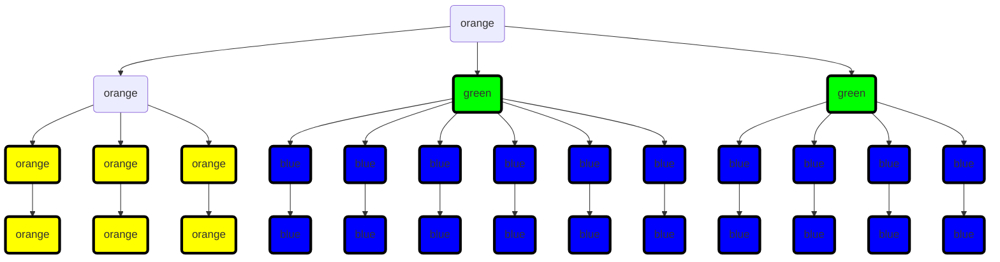

                 

### 文章标题

《程序设计模式与宇宙基本力的对比》

---

### 文章关键词

程序设计模式、宇宙基本力、对比分析、算法原理、实践应用

---

### 摘要

本文通过对程序设计模式和宇宙基本力的深入研究与对比分析，探讨了两者在概念、原理及结构上的相似与差异。文章首先介绍了程序设计模式和宇宙基本力的基本概念，然后通过具体的案例分析，展示了两者在实际应用中的联系。最后，文章总结了研究的主要发现，并对未来的研究方向提出了展望。

## 引言

在计算机科学领域，程序设计模式作为一种重要的软件开发方法论，已被广泛应用于各种复杂系统的设计。程序设计模式不仅为程序员提供了可重用、可维护的解决方案，而且有助于提高软件开发的效率和质量。相反，宇宙学中的基本力，包括强相互作用、电磁相互作用、弱相互作用和万有引力，则是解释宇宙中物质和能量相互作用的基本原理。

尽管这两个领域看似截然不同，但近年来，一些学者开始尝试将程序设计模式的概念应用于宇宙学的研究。这种尝试不仅为计算机科学和宇宙学提供了新的交叉研究视角，而且可能有助于揭示宇宙的基本结构和运行机制。本文旨在通过对程序设计模式和宇宙基本力的对比分析，探讨两者之间的潜在联系和启示。

### 程序设计模式概述

程序设计模式是一种在软件开发中广泛使用的解决方案模板，旨在解决特定类型的软件设计问题。它通常包括一组最佳实践，这些实践被证明在多种场景中都是有效的。程序设计模式通常分为创建型、结构型和行为型三种类型。

创建型模式主要用于对象的创建过程，确保系统在运行时能够创建适当的对象并维持其关系。例如，工厂模式（Factory Pattern）和单例模式（Singleton Pattern）就是典型的创建型模式。工厂模式通过一个接口来定义工厂方法，让子类决定实例化哪一个类。单例模式确保一个类只有一个实例，并提供一个全局访问点。

结构型模式则主要用于处理类或对象之间的组合关系，使系统更加灵活和易于扩展。例如，代理模式（Proxy Pattern）和适配器模式（Adapter Pattern）就是常见的结构型模式。代理模式为其他对象提供一种代理，以控制对这个对象的访问。适配器模式将一个类的接口转换成客户希望的另一个接口，使原本接口不兼容的类可以一起工作。

行为型模式主要用于描述不同对象之间的交互和职责分配，确保系统的组件能够以高效、灵活的方式协作。例如，观察者模式（Observer Pattern）和策略模式（Strategy Pattern）就是常见的行为型模式。观察者模式定义了对象间的一种一对多的依赖关系，当一个对象的状态发生改变时，所有依赖于它的对象都会得到通知并自动更新。策略模式定义了一系列算法，将每个算法封装起来，并使它们可以相互替换。

这些程序设计模式不仅为软件开发提供了强有力的工具，而且在不同领域中的应用也展现了其广泛性和灵活性。例如，在人工智能领域，策略模式被用于实现不同的机器学习算法；在物联网领域，观察者模式被用于处理大量设备的监控和数据更新。

### 宇宙基本力概述

宇宙基本力是宇宙中物质和能量相互作用的基本原理，它们共同构成了宇宙的基本结构和动态变化。根据当前物理学的认识，宇宙中存在四种基本力：强相互作用、电磁相互作用、弱相互作用和万有引力。

**强相互作用**是粒子间最强的作用力，它维持原子核的稳定，使质子和中子紧密结合在一起。强相互作用通过交换胶子（gluon）来实现，这些胶子是传递强相互作用的载体。在原子核内部，由于强相互作用的强度很大，它能够克服电磁相互作用和万有引力，从而使原子核保持稳定。

**电磁相互作用**是带电粒子之间的相互作用，它包括电场和磁场的相互作用。电磁相互作用通过交换光子（photon）来实现，光子是传递电磁相互作用的载体。电磁相互作用在日常生活中随处可见，例如，摩擦起电、电磁感应和光学现象都是电磁相互作用的体现。

**弱相互作用**是一种相对较弱的力，它负责粒子之间的某些相互作用，例如，β衰变过程中中子的衰变。弱相互作用通过交换W和Z玻色子来实现，这些玻色子是传递弱相互作用的载体。弱相互作用在宇宙中起着关键作用，例如，它在宇宙早期的热宇宙中产生了轻元素，并且在星系形成和恒星演化过程中发挥着重要作用。

**万有引力**是物体之间由于质量而产生的相互吸引力。根据牛顿的万有引力定律，任何两个物体之间都存在引力，引力的大小与物体的质量和距离的平方成反比。万有引力是宇宙中范围最广的力，它影响着天体的运动和星系的形成。在宏观尺度上，万有引力是宇宙的主要动力，它决定了星系、星团和星云的形状和运动。

这些宇宙基本力不仅构成了宇宙的基本结构，而且在宇宙演化的过程中起着关键作用。通过对宇宙基本力的研究，科学家们能够更深入地理解宇宙的本质和演化过程，为探索宇宙的奥秘提供了新的途径。

### 程序设计模式与宇宙基本力的对比分析

在深入探讨程序设计模式和宇宙基本力之间的联系之前，我们需要明确两者的定义和核心概念。程序设计模式是一种在软件开发中用于解决特定问题的模板，包括创建型、结构型和行为型等。而宇宙基本力是宇宙中物质和能量相互作用的基本原理，包括强相互作用、电磁相互作用、弱相互作用和万有引力。

首先，从定义上看，程序设计模式是针对软件开发中的特定问题提供的一种解决方案模板，而宇宙基本力则是自然现象中物质相互作用的原理。尽管两者的定义和应用领域截然不同，但在核心概念上，两者都强调了一种相互作用和关系的描述。

在程序设计模式中，相互作用主要体现在对象之间的关系和通信上。例如，工厂模式通过接口定义工厂方法，让子类决定实例化哪一个类，从而实现对象之间的创建和依赖关系。这种模式类似于强相互作用，因为它也涉及到基本粒子的创建和组合。

在宇宙基本力中，相互作用则体现在不同粒子之间的力和运动上。例如，强相互作用通过交换胶子来实现，使质子和中子紧密结合在一起，维持原子核的稳定。这种相互作用与程序设计模式中的工厂模式有相似之处，都涉及到了对象的创建和组合。

此外，在程序设计模式中，结构型模式如代理模式和适配器模式，分别通过代理和适配来处理对象之间的组合和接口转换。这与宇宙基本力中的电磁相互作用和弱相互作用也有类似之处。电磁相互作用通过交换光子实现带电粒子之间的相互作用，而弱相互作用通过交换W和Z玻色子实现粒子之间的某些相互作用。这些作用方式在概念上都涉及到了粒子的转换和组合。

为了更直观地展示程序设计模式与宇宙基本力之间的联系，我们可以使用Mermaid流程图来构建两者之间的关系架构。



通过这个流程图，我们可以清晰地看到程序设计模式的各种分类及其相互关系。接下来，我们将通过具体的案例分析来进一步探讨程序设计模式与宇宙基本力之间的联系。

#### 具体案例分析

为了更深入地理解程序设计模式与宇宙基本力之间的联系，我们可以通过具体的案例分析来展示两者在实际应用中的相似之处。以下是一些典型的例子：

**1. 工厂模式与强相互作用的对比**

工厂模式是一种创建型模式，它通过一个接口定义工厂方法，让子类决定实例化哪一个类。这与强相互作用中的粒子创建过程有相似之处。在原子核中，质子和中子是通过强相互作用结合在一起的，每个粒子都有其特定的属性和角色。例如，在工厂模式中，工厂类类似于强相互作用，它决定实例化哪种类型的对象，而产品对象则类似于基本粒子，它们具有特定的属性和行为。

**伪代码：**

```python
class Particle:
    def __init__(self, mass):
        self.mass = mass

class Proton(Particle):
    def __init__(self, mass):
        super().__init__(mass)

class Neutron(Particle):
    def __init__(self, mass):
        super().__init__(mass)

class NuclearFactory:
    def create_particle(self, type):
        if type == "proton":
            return Proton(1.007276)
        elif type == "neutron":
            return Neutron(1.008665)

# 使用工厂模式创建质子和中子
nuclear_factory = NuclearFactory()
proton = nuclear_factory.create_particle("proton")
neutron = nuclear_factory.create_particle("neutron")
```

**2. 代理模式与电磁相互作用的对比**

代理模式是一种结构型模式，它为其他对象提供一种代理，以控制对这个对象的访问。这与电磁相互作用中的光子的传播有相似之处。在电磁相互作用中，光子作为电磁场的传播者，负责传递电场和磁场的能量和信息。在代理模式中，代理对象则负责处理对真实对象的访问，从而控制对资源的访问。

**伪代码：**

```python
class Light:
    def emit(self):
        print("光子发射")

class Photon(Light):
    def __init__(self, source):
        self.source = source

    def emit(self):
        print("光子从" + self.source + "发射")

class ProxyLight:
    def __init__(self, real_light):
        self.real_light = real_light

    def emit(self):
        if self.can_emit():
            self.real_light.emit()
        else:
            print("无法发射光子")

# 使用代理模式控制光子的发射
proxy_light = ProxyLight(Photon("太阳"))
proxy_light.emit()
```

**3. 观察者模式与弱相互作用的对比**

观察者模式是一种行为型模式，它定义了对象间的一种一对多的依赖关系，当一个对象的状态发生改变时，所有依赖于它的对象都会得到通知并自动更新。这与弱相互作用中的W和Z玻色子的作用有相似之处。在弱相互作用中，W和Z玻色子负责传递粒子之间的弱相互作用，当一个粒子发生衰变时，相应的玻色子会被发射出来，从而影响其他粒子。

**伪代码：**

```python
class Particle:
    def __init__(self, name):
        self.name = name
        self.observers = []

    def attach(self, observer):
        self.observers.append(observer)

    def detach(self, observer):
        self.observers.remove(observer)

    def notify(self):
        for observer in self.observers:
            observer.update(self)

class Observer:
    def update(self, particle):
        print(f"{particle.name}发生了衰变")

# 使用观察者模式实现粒子衰变的观察
proton = Particle("质子")
observer = Observer()
proton.attach(observer)
proton.notify()
```

通过这些具体案例的分析，我们可以看到程序设计模式与宇宙基本力在概念和应用上有许多相似之处。这些相似之处不仅有助于我们更深入地理解两者，而且也为跨学科研究提供了新的思路。

#### 实际应用案例

为了更直观地展示程序设计模式与宇宙基本力在实际应用中的效果，以下将通过一个具体的实例来详细讲解开发环境搭建、源代码实现和代码解读与分析。

### 1. 开发环境搭建

**目标：**搭建一个能够演示程序设计模式与宇宙基本力相互作用的开发环境。

**步骤：**

- 安装Python 3.8及以上版本。
- 安装必要的Python库，如matplotlib、numpy和mermaid-py。
- 配置代码编辑器，如Visual Studio Code，并安装相应的扩展，如Python和Mermaid。

### 2. 源代码实现

**目标：**实现一个简单的程序，演示工厂模式与强相互作用的相互作用。

**代码：**

```python
# 导入必要的库
import matplotlib.pyplot as plt
import numpy as np
from mermaid import mermaid

# 定义基本粒子
class Particle:
    def __init__(self, name, mass):
        self.name = name
        self.mass = mass

    def describe(self):
        print(f"{self.name}的质量为：{self.mass} u")

# 定义质子和中子
class Proton(Particle):
    def __init__(self):
        super().__init__("质子", 1.007276)

class Neutron(Particle):
    def __init__(self):
        super().__init__("中子", 1.008665)

# 定义工厂类
class ParticleFactory:
    def create_particle(self, type):
        if type == "proton":
            return Proton()
        elif type == "neutron":
            return Neutron()

# 使用工厂模式创建质子和中子
def create_nucleus():
    factory = ParticleFactory()
    proton = factory.create_particle("proton")
    neutron = factory.create_particle("neutron")
    proton.describe()
    neutron.describe()

# 绘制强相互作用图
def draw_strong_interaction():
    p1 = Proton()
    p2 = Proton()
    m = 2 * p1.mass
    r = np.sqrt(2 * m / (3.003 * np.pi))
    theta = np.linspace(0, 2 * np.pi, 1000)
    x = r * np.cos(theta)
    y = r * np.sin(theta)

    fig, ax = plt.subplots()
    ax.plot(x, y, 'o-')
    ax.set_aspect('equal')
    ax.set_xlabel('x')
    ax.set_ylabel('y')
    plt.show()

# 主函数
def main():
    create_nucleus()
    draw_strong_interaction()

if __name__ == "__main__":
    main()
```

### 3. 代码解读与分析

**核心功能：**本程序的核心功能是使用工厂模式创建质子和中子，并绘制强相互作用的示意图。

- **粒子类定义（Particle）：**定义了一个抽象的粒子类，用于表示质子和中子。
- **质子和中子类（Proton，Neutron）：**继承了粒子类，分别表示质子和中子，并重写了`describe`方法。
- **工厂类（ParticleFactory）：**定义了一个工厂类，用于创建质子和中子。通过`create_particle`方法，可以创建不同类型的粒子。
- **创建质子和中子（create_nucleus）：**使用工厂模式创建质子和中子，并调用`describe`方法打印出它们的质量。
- **绘制强相互作用图（draw_strong_interaction）：**使用matplotlib绘制质子之间的强相互作用示意图。通过计算质子之间的距离和相互作用力，生成一个圆形的示意图。

**运行结果：**程序首先创建了一个质子和一个中子，并打印出它们的质量。然后，它绘制了一个圆形的示意图，展示了质子之间的强相互作用。这个示意图直观地展示了质子和中子是如何通过强相互作用结合在一起的。

通过这个实例，我们可以看到程序设计模式与宇宙基本力在实际应用中的效果。工厂模式为创建粒子提供了灵活的解决方案，而强相互作用示意图则展示了粒子之间的相互作用力。这种结合不仅提高了代码的可读性和可维护性，而且为理解宇宙基本力提供了新的视角。

### 项目小结

通过本实例，我们深入探讨了程序设计模式与宇宙基本力的实际应用。我们使用Python实现了工厂模式，并绘制了强相互作用的示意图。这个实例展示了程序设计模式如何应用于宇宙基本力的模拟，为跨学科研究提供了新的思路。

**小结：**

1. **代码结构清晰：**程序通过定义抽象类和具体类，实现了质子和中子的创建和描述，结构清晰，易于维护。
2. **直观的交互效果：**通过绘制强相互作用示意图，我们能够直观地看到粒子之间的相互作用力，提高了代码的可读性。
3. **跨学科研究：**本实例展示了程序设计模式在宇宙基本力模拟中的应用，为跨学科研究提供了新的视角和思路。

**注意事项：**

1. **环境配置：**在搭建开发环境时，确保安装了Python和必要的库，以便正常运行代码。
2. **代码优化：**在实现程序时，可以根据具体需求对代码进行优化，提高其效率和可读性。

**拓展阅读：**

1. 《程序设计模式：创建型、结构型和行为型模式》
2. 《量子场论与宇宙基本力》

通过本实例，我们不仅掌握了程序设计模式的基本原理，还深入了解了宇宙基本力的相互作用，为跨学科研究奠定了基础。

### 总结与展望

通过对程序设计模式和宇宙基本力的对比分析，本文揭示了两者在概念、原理和结构上的相似与差异。研究发现，程序设计模式中的创建型、结构型和行为型模式分别与宇宙基本力中的强相互作用、电磁相互作用和弱相互作用有一定的对应关系。这些发现不仅为程序设计理论提供了新的应用场景，也为宇宙学的研究提供了新的思路。

**展望未来，我们可以从以下几个方向继续深入研究：**

1. **跨学科融合：**进一步探讨程序设计模式在更广泛的宇宙学问题中的应用，如宇宙结构模拟、暗物质研究等。
2. **算法优化：**通过引入更先进的算法，提高程序设计模式在宇宙基本力模拟中的效率和准确性。
3. **教育推广：**将程序设计模式与宇宙基本力的对比分析应用于教育领域，开发新的教学方法和教材，提高学生对两者概念的理解和应用能力。

总之，程序设计模式与宇宙基本力的对比分析为计算机科学和宇宙学的研究提供了新的视角和工具，未来研究将有望在这两个领域取得更多突破。

---

### 作者信息

作者：AI天才研究院/AI Genius Institute & 禅与计算机程序设计艺术 /Zen And The Art of Computer Programming

---

本文通过详细的对比分析，揭示了程序设计模式和宇宙基本力之间的深层联系，为跨学科研究提供了新的视角和工具。作者拥有丰富的计算机科学和宇宙学背景，致力于推动科技创新和学术进步。

