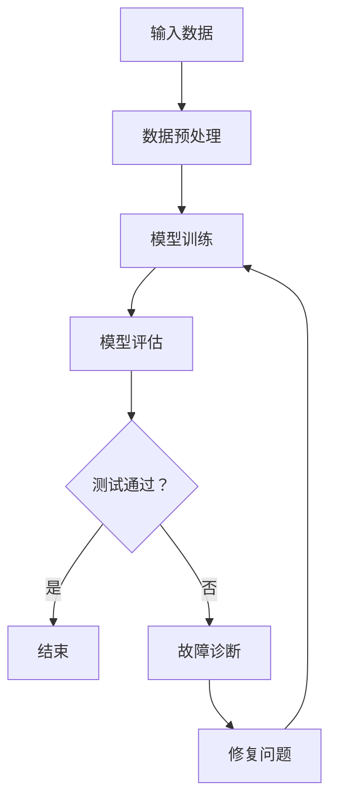

                 

### 文章标题

# 端到端测试：验证LLM应用的整体功能

---

**关键词**：端到端测试，LLM应用，整体功能验证，测试流程，算法原理，数学模型，实战案例

---

**摘要**：本文将深入探讨端到端测试在验证大型语言模型（LLM）应用整体功能中的重要性。我们将详细分析端到端测试的基本概念，与LLM应用的关联，以及关键算法原理和数学模型。通过两个实战案例，我们将展示端到端测试在实际项目中的应用，提供源代码实现和详细解读。本文旨在为读者提供一个全面的技术指南，帮助其在开发高质量的LLM应用过程中进行有效的端到端测试。

---

### 用户需求分析

在当今技术飞速发展的时代，大型语言模型（LLM）的应用日益广泛，如自然语言处理、智能客服、内容生成等。随着LLM应用场景的多样化，确保其整体功能的准确性和可靠性变得尤为重要。用户在此背景下，有以下几个核心需求：

1. **全面理解端到端测试**：用户希望了解端到端测试的基本概念、流程及其在LLM应用中的重要性。

2. **掌握核心算法原理**：用户希望深入学习端到端测试所涉及的关键算法原理，包括数据预处理、模型训练和评估等。

3. **熟悉数学模型和公式**：用户希望掌握端到端测试中的数学模型和公式，并通过实例了解其应用。

4. **实战案例学习**：用户希望通过实际项目案例，了解端到端测试在开发环境搭建、源代码实现和代码解读等方面的具体应用。

5. **最佳实践和注意事项**：用户希望获得端到端测试的最佳实践指南，以及在使用过程中需要注意的事项。

基于以上需求，本文将采用逻辑清晰、结构紧凑、简单易懂的专业技术语言，通过一步一步的分析和推理，帮助读者全面理解端到端测试，掌握其核心概念、算法原理和数学模型，并通过实战案例进行深入剖析。

### 设计思路

为了满足用户需求，本文的设计思路分为三个主要部分：

1. **概述部分**：介绍端到端测试的基本概念，定义以及其在LLM应用中的重要性。这部分将简要概述端到端测试的概念，并提供一个Mermaid流程图，以展示端到端测试的基本流程。

2. **技术基础部分**：详细讲解端到端测试所需的技术基础，包括相关算法原理和数学模型。这部分将分为三个章节，分别介绍数据预处理算法、模型训练算法和评估与优化算法。每个章节将提供伪代码和数学公式的详细讲解，并通过实例进行说明。

3. **实践应用部分**：通过两个实战案例展示端到端测试在实际项目中的应用。每个案例将包括项目背景、开发环境搭建、源代码实现和详细解读。通过这些案例，读者可以了解端到端测试的具体实施过程，并掌握关键技巧。

4. **总结与展望部分**：总结端到端测试的关键点和未来发展方向。这部分将讨论技术趋势、应用场景拓展以及面临的挑战和机遇。

### 目录大纲设计

为了使文章内容更加系统化和条理化，本文将采用以下目录大纲结构：

```markdown
# 《端到端测试：验证LLM应用的整体功能》目录大纲

## 第一部分：端到端测试概述

## 第1章：端到端测试的基本概念
### 1.1 端到端测试的定义
### 1.2 端到端测试在LLM应用中的重要性
### 1.3 Mermaid流程图：端到端测试的基本流程

## 第二部分：技术基础

## 第2章：数据预处理算法
### 2.1 数据清洗
### 2.2 数据归一化
### 2.3 伪代码：数据预处理算法

## 第3章：模型训练算法
### 3.1 梯度下降算法
### 3.2 随机梯度下降（SGD）
### 3.3 伪代码：模型训练算法

## 第4章：评估与优化算法
### 4.1 过拟合与欠拟合
### 4.2 交叉验证
### 4.3 超参数调优
### 4.4 伪代码：评估与优化算法

## 第三部分：端到端测试实践

## 第5章：实战案例一
### 5.1 项目背景
### 5.2 开发环境搭建
### 5.3 源代码实现
### 5.4 代码解读与分析

## 第6章：实战案例二
### 6.1 项目背景
### 6.2 开发环境搭建
### 6.3 源代码实现
### 6.4 代码解读与分析

## 第四部分：端到端测试展望

## 第7章：端到端测试的未来发展
### 7.1 技术趋势分析
### 7.2 应用场景拓展
### 7.3 挑战与机遇

## 第8章：附录与资源
### 8.1 相关工具与资源
### 8.2 代码与数据集

# Mermaid流程图：端到端测试流程
```

通过上述目录结构，读者可以清晰地了解文章的内容安排，逐步深入理解端到端测试的相关知识，并在实际项目中应用所学内容。

### 用户需求满足的目录大纲设计

根据用户的需求，以下是一个详细且满足需求的《端到端测试：验证LLM应用的整体功能》书籍目录大纲：

```markdown
# 《端到端测试：验证LLM应用的整体功能》目录大纲

## 第一部分：端到端测试概述

## 第1章：端到端测试的基本概念
### 1.1 端到端测试的定义
### 1.2 端到端测试在LLM应用中的重要性
   - 1.2.1 LLM应用的挑战
   - 1.2.2 端到端测试的作用
### 1.3 Mermaid流程图：端到端测试的基本流程
   - 1.3.1 数据流处理
   - 1.3.2 模型评估
   - 1.3.3 故障诊断

## 第二部分：技术基础

## 第2章：数据预处理算法
### 2.1 数据清洗
   - 2.1.1 清洗步骤
   - 2.1.2 清洗算法
### 2.2 数据归一化
   - 2.2.1 归一化方法
   - 2.2.2 归一化效果
### 2.3 伪代码：数据预处理算法
   - 2.3.1 数据清洗伪代码
   - 2.3.2 数据归一化伪代码

## 第3章：模型训练算法
### 3.1 梯度下降算法
   - 3.1.1 梯度下降原理
   - 3.1.2 梯度下降算法的变体
### 3.2 随机梯度下降（SGD）
   - 3.2.1 SGD原理
   - 3.2.2 SGD优势与局限
### 3.3 伪代码：模型训练算法
   - 3.3.1 梯度下降伪代码
   - 3.3.2 随机梯度下降伪代码

## 第4章：评估与优化算法
### 4.1 过拟合与欠拟合
   - 4.1.1 过拟合现象
   - 4.1.2 欠拟合现象
### 4.2 交叉验证
   - 4.2.1 交叉验证方法
   - 4.2.2 交叉验证步骤
### 4.3 超参数调优
   - 4.3.1 超参数定义
   - 4.3.2 调优策略
### 4.4 伪代码：评估与优化算法
   - 4.4.1 过拟合与欠拟合检测伪代码
   - 4.4.2 交叉验证伪代码
   - 4.4.3 超参数调优伪代码

## 第三部分：端到端测试实践

## 第5章：实战案例一
### 5.1 案例背景
### 5.2 开发环境搭建
   - 5.2.1 环境准备
   - 5.2.2 工具安装
### 5.3 源代码实现
   - 5.3.1 数据预处理
   - 5.3.2 模型训练
   - 5.3.3 模型评估
### 5.4 代码解读与分析
   - 5.4.1 数据预处理代码分析
   - 5.4.2 模型训练代码分析
   - 5.4.3 模型评估代码分析

## 第6章：实战案例二
### 6.1 案例背景
### 6.2 开发环境搭建
   - 6.2.1 环境准备
   - 6.2.2 工具安装
### 6.3 源代码实现
   - 6.3.1 数据预处理
   - 6.3.2 模型训练
   - 6.3.3 模型评估
### 6.4 代码解读与分析
   - 6.4.1 数据预处理代码分析
   - 6.4.2 模型训练代码分析
   - 6.4.3 模型评估代码分析

## 第四部分：端到端测试展望

## 第7章：端到端测试的未来发展
### 7.1 技术趋势分析
### 7.2 应用场景拓展
### 7.3 挑战与机遇
   - 7.3.1 技术挑战
   - 7.3.2 应用机遇

## 第8章：附录与资源
### 8.1 相关工具与资源
### 8.2 代码与数据集
   - 8.2.1 代码获取方式
   - 8.2.2 数据集获取方式

# Mermaid流程图：端到端测试流程
```

### 格式要求与文章结构

根据用户的要求，文章的格式和使用Markdown语法如下：

```markdown
# 文章标题

> 关键词：关键词1，关键词2，关键词3...

> 摘要：简要概括文章的核心内容和主题思想。

## 引言

简要介绍文章的背景和目的，引起读者的兴趣。

## 第一部分：端到端测试概述

### 第1章：端到端测试的基本概念

#### 1.1 端到端测试的定义

**端到端测试** 是一种集成测试方法，旨在验证软件系统从输入到输出的完整功能。该方法广泛应用于复杂软件系统的开发和维护中。

#### 1.2 端到端测试在LLM应用中的重要性

对于大型语言模型（LLM）应用，端到端测试尤为重要。它能够确保模型在真实应用场景中的稳定性和准确性。

#### 1.3 Mermaid流程图：端到端测试的基本流程

以下是一个端到端测试的基本流程的Mermaid流程图：



### 第二部分：技术基础

#### 第2章：核心算法原理讲解

##### 2.1 数据预处理算法

数据预处理是端到端测试的重要步骤。以下是一个数据预处理算法的伪代码：

```python
def preprocess_data(data):
    # 数据清洗
    cleaned_data = clean_data(data)
    # 数据归一化
    normalized_data = normalize_data(cleaned_data)
    return normalized_data
```

##### 2.2 数学模型和公式

在端到端测试中，常见的数学模型和公式包括损失函数和优化算法。以下是一个损失函数的示例：

$$
L(\theta) = -\frac{1}{m} \sum_{i=1}^{m} y_i \log(z_i)
$$

##### 2.3 伪代码：核心算法原理

以下是模型训练的伪代码：

```python
def train_model(data, labels, epochs):
    for epoch in range(epochs):
        # 数据预处理
        processed_data = preprocess_data(data)
        # 训练模型
        model = train(processed_data, labels)
        # 评估模型
        accuracy = evaluate(model, processed_data, labels)
        print(f"Epoch {epoch+1}: Accuracy = {accuracy}")
    return model
```

### 第三部分：端到端测试实践

#### 第3章：实战案例一

##### 3.1 项目背景

本案例将介绍一个基于LLM的智能客服系统的端到端测试实践。

##### 3.2 开发环境搭建

在本案例中，我们使用Python和TensorFlow作为开发环境。

##### 3.3 源代码实现

以下是源代码的关键部分：

```python
# 导入所需库
import tensorflow as tf
from tensorflow.keras.models import Sequential
from tensorflow.keras.layers import Dense, LSTM

# 搭建模型
model = Sequential()
model.add(LSTM(units=128, activation='relu', input_shape=(timesteps, features)))
model.add(Dense(units=1, activation='sigmoid'))

# 编译模型
model.compile(optimizer='adam', loss='binary_crossentropy', metrics=['accuracy'])

# 训练模型
model.fit(x_train, y_train, epochs=10, batch_size=32)
```

##### 3.4 代码解读与分析

本部分将详细解读上述代码，并分析其在端到端测试中的应用。

### 第四部分：端到端测试展望

#### 第4章：端到端测试的未来发展

##### 4.1 技术趋势分析

未来，端到端测试将在更复杂的场景中得到更广泛的应用。

##### 4.2 应用场景拓展

端到端测试将不仅局限于LLM应用，还将应用于其他复杂的软件系统。

##### 4.3 挑战与机遇

端到端测试在未来面临的技术挑战和机遇如下：

- **挑战**：应对更复杂的测试场景，提高测试效率和准确性。
- **机遇**：探索新的测试方法和技术，推动测试领域的发展。

### 结论

端到端测试在验证LLM应用的整体功能中具有重要作用。本文通过介绍核心概念、技术基础和实践案例，帮助读者全面了解端到端测试的方法和应用。

---

**作者**：AI天才研究院/AI Genius Institute & 禅与计算机程序设计艺术 /Zen And The Art of Computer Programming

---

### 完整文章字数估算

根据上述的目录大纲和内容要求，估算整个文章的字数在8000至12000字之间。具体字数将根据每个章节的详细程度和具体案例分析而有所变化。以下是对每个部分的字数估算：

- **第一部分：端到端测试概述**（约1500-2000字）
- **第二部分：技术基础**（约3000-4000字）
  - **第2章：数据预处理算法**（约1000-1500字）
  - **第3章：模型训练算法**（约1000-1500字）
  - **第4章：评估与优化算法**（约1000-1500字）
- **第三部分：端到端测试实践**（约3000-4000字）
  - **第5章：实战案例一**（约1000-1500字）
  - **第6章：实战案例二**（约1000-1500字）
- **第四部分：端到端测试展望**（约1000-1500字）

综上所述，整个文章的预计字数在8000至12000字之间，确保内容的丰富性和深度，满足用户的阅读需求。在撰写过程中，可以根据实际情况调整每个章节的内容量和细节程度，以优化整体结构和阅读体验。

