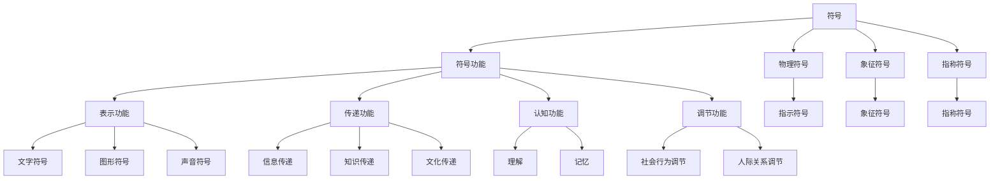

                 

### 文章标题

《符号学视角下的世界可理解性》

### 关键词

符号学、世界可理解性、认知科学、哲学、语言学、社会科学、艺术、科技与传媒、人工智能

### 摘要

本文从符号学的角度出发，探讨世界可理解性的问题。通过分析符号学的基本概念及其在认知科学、哲学、语言学、社会科学、艺术、科技与传媒等领域的应用，本文旨在揭示符号学对于提升世界可理解性的重要作用。同时，本文还探讨了符号学在人工智能领域的应用前景，为未来世界可理解性的发展提供了新的思路。

---

## 引言

在信息爆炸的时代，我们每天都在接收和处理大量的信息。然而，这些信息的真实性、可靠性以及其背后的意义往往难以判断。为了更好地理解我们所处的世界，我们需要寻找一种有效的工具，来帮助我们理解和解读这些信息。符号学，作为一种研究符号系统及其意义的学科，为我们提供了一种新的视角。

世界可理解性，是指人类对于周围世界的理解和把握程度。在符号学视角下，世界可理解性不仅仅是对物理世界的认知，更包括对信息、意义和文化的理解。符号学为我们提供了一种分析工具，可以帮助我们更好地理解这些复杂的符号系统，从而提升我们对世界的理解。

本文将从以下几个方面展开讨论：

1. **符号学的基本概念**：介绍符号学的基本概念，包括符号的定义、类型、功能等。
2. **符号学在认知科学中的应用**：探讨符号学在认知科学中的重要性，分析符号认知过程。
3. **符号学在哲学中的地位**：介绍符号学在哲学中的地位，分析符号学对哲学思考的启示。
4. **符号学在语言学中的应用**：探讨符号学在语言学中的应用，分析语言符号的本质。
5. **符号学在社会科学中的应用**：介绍符号学在社会科学中的应用，分析社会符号的作用。
6. **符号学在艺术与文学中的运用**：探讨符号学在艺术与文学中的运用，分析艺术符号与文学符号的意义。
7. **符号学在科技与传媒中的影响**：分析符号学在科技与传媒中的作用，探讨其影响。
8. **符号学在人工智能领域的应用**：探讨符号学在人工智能领域的应用前景，分析其可能的影响。

通过以上讨论，本文旨在揭示符号学对于提升世界可理解性的重要作用，为读者提供一种新的思考方式。

---

## 符号学的基本概念

符号学，作为一种研究符号系统及其意义的学科，其研究范围涵盖了从语言学、哲学、文化学到认知科学等多个领域。符号学的核心问题是符号的定义、分类、功能和意义。下面，我们将逐一介绍这些基本概念。

### 符号的定义

符号，是指一种用来代表其他事物、概念或意义的标记。在符号学中，符号通常分为三类：物理符号、象征符号和指称符号。

- **物理符号**：是指直接与物理世界相联系的符号。例如，交通信号灯的红灯代表停止，绿灯代表通行。
- **象征符号**：是指通过传统或文化约定而具有特定意义的符号。例如，国旗是一个国家的象征符号，代表着国家的荣誉和尊严。
- **指称符号**：是指直接指代某一具体事物或概念的符号。例如，“苹果”这个词语指称的是一种具体的水果。

### 符号的分类

符号可以根据不同的标准进行分类。常见的分类方式包括：

- **根据符号的功能**：可以分为指示符号、象征符号、比喻符号、符号化符号等。
  - **指示符号**：直接指代具体事物或现象，如地图上的标记。
  - **象征符号**：代表某种抽象概念或价值观念，如国旗。
  - **比喻符号**：通过类比的方式表达某种意义，如“时间就是金钱”。
  - **符号化符号**：将一种事物或现象转化为符号，如将“爱”转化为心形符号。

- **根据符号的形式**：可以分为文字符号、图形符号、声音符号等。
  - **文字符号**：如文字、字母、数字等。
  - **图形符号**：如标志、图案、图形等。
  - **声音符号**：如音乐、语音、口哨声等。

### 符号的功能

符号的功能主要包括：

- **表示功能**：通过符号来表示具体事物或抽象概念。
- **传递功能**：通过符号来传递信息、知识和文化。
- **认知功能**：通过符号来帮助人们理解和记忆事物。
- **调节功能**：通过符号来调节社会行为和人际关系。

### 符号的意义

符号的意义是由符号的使用者赋予的。不同的人、不同的文化背景下，对于同一符号的理解可能存在差异。例如，在西方文化中，红色通常与爱情、热情、危险等概念相关联，而在一些东方文化中，红色则可能与喜庆、幸运等概念相关联。

### 符号学的历史与发展

符号学的概念可以追溯到古希腊时期，当时的哲学家们就开始探讨符号和意义的关系。现代符号学的奠基人是瑞士语言学家弗迪南·德·索绪尔（Ferdinand de Saussure）。他在20世纪初提出了“符号学”的概念，并将其定义为“研究符号系统的科学”。此后，符号学在各个领域得到了广泛的应用和发展。

总的来说，符号学为我们提供了一种理解和分析符号系统的工具。通过符号学的研究，我们可以更好地理解世界，提升我们对信息的敏感度和理解力。

### 符号学的基本概念与联系

为了更好地理解符号学的基本概念，我们可以使用Mermaid流程图来展示这些概念之间的关系。以下是一个简化的符号学概念流程图：



在这个流程图中，我们可以看到符号学的基本概念是如何相互关联的。符号作为核心概念，衍生出物理符号、象征符号和指称符号等子概念。同时，符号的功能也作为核心概念，衍生出表示功能、传递功能、认知功能和调节功能等子概念。这些子概念进一步扩展出具体的符号类型和功能。

通过这样的流程图，我们可以更直观地理解符号学的基本概念及其相互关系，从而更好地把握符号学的核心思想。

### 核心算法原理讲解

在符号学的研究中，算法的应用是非常重要的。以下我们将通过一个简单的示例来讲解符号识别算法的基本原理，并使用伪代码详细阐述其实现过程。

#### 符号识别算法简介

符号识别算法是一种能够自动识别和解析符号的系统。它通常用于自然语言处理、图像识别、语音识别等领域。这里，我们以自然语言处理中的文本识别为例，介绍一个简单的符号识别算法。

#### 算法原理

符号识别算法的基本原理是通过输入的文本序列，识别并提取出其中的符号。符号可以是一个单词、一个短语或者一个特定的词汇。算法的核心步骤包括：

1. **分词**：将输入的文本序列分割成单词或短语。
2. **符号识别**：对每个分词结果进行符号识别，判断其是否为有效符号。
3. **符号分类**：将识别出的符号进行分类，例如按照单词的词性、短语的功能等进行分类。

#### 伪代码实现

以下是符号识别算法的伪代码：

```pseudo
function recognizeSymbols(text):
    # 分词
    words = tokenize(text)
    
    # 初始化符号列表
    symbols = []

    # 对每个分词结果进行符号识别
    for word in words:
        if isSymbol(word):
            symbol = classifySymbol(word)
            symbols.append(symbol)
    
    return symbols

function tokenize(text):
    # 使用空格、逗号、句号等分隔符进行分词
    tokens = split(text, [' ', ',', '.'])
    return tokens

function isSymbol(word):
    # 判断单词是否为有效符号
    # 这里我们可以使用词库来辅助判断
    return word in symbolLexicon

function classifySymbol(word):
    # 对符号进行分类
    if isNoun(word):
        return "Noun"
    elif isVerb(word):
        return "Verb"
    else:
        return "Other"

function isNoun(word):
    # 判断单词是否为名词
    # 这里可以使用自然语言处理库进行判断
    return word.isNoun()

function isVerb(word):
    # 判断单词是否为动词
    # 这里可以使用自然语言处理库进行判断
    return word.isVerb()
```

#### 数学模型和公式

为了更好地理解符号识别算法，我们还可以引入一些数学模型和公式。以下是一个简单的数学模型，用于描述符号识别的概率分布：

$$
P(S|T) = \frac{P(T|S) \cdot P(S)}{P(T)}
$$

其中，$P(S|T)$ 表示在给定文本 $T$ 的情况下，符号 $S$ 的概率；$P(T|S)$ 表示在符号 $S$ 出现的情况下，文本 $T$ 的概率；$P(S)$ 表示符号 $S$ 的先验概率；$P(T)$ 表示文本 $T$ 的先验概率。

在实际应用中，我们可以使用贝叶斯网络或者条件概率模型来具体实现这个数学模型。例如，我们可以使用朴素贝叶斯分类器来对符号进行分类：

$$
P(S_i|T) = \frac{P(T|S_i) \cdot P(S_i)}{\sum_{j=1}^{N} P(T|S_j) \cdot P(S_j)}
$$

其中，$S_i$ 表示第 $i$ 个符号，$T$ 表示输入的文本，$N$ 表示符号的总数。

通过这个数学模型，我们可以对符号进行概率分析，从而提高符号识别的准确性。

#### 举例说明

假设我们有一个输入文本：“今天天气很好”。使用上述符号识别算法，我们可以将其中的符号识别为：“今天”、“天气”和“很好”。

- **分词**：将文本分割为三个单词：“今天”、“天气”和“很好”。
- **符号识别**：对每个单词进行识别，判断其是否为有效符号。在这里，这三个单词都是有效符号。
- **符号分类**：对识别出的符号进行分类。例如，“今天”可以分类为时间名词，“天气”可以分类为自然现象名词，“很好”可以分类为形容词。

通过这个简单的例子，我们可以看到符号识别算法的基本原理和实现过程。

总的来说，符号识别算法是一种通过分词、识别和分类等步骤，从文本中提取出有效符号的方法。通过引入数学模型和概率分析，我们可以进一步提高符号识别的准确性。符号识别算法在自然语言处理、图像识别、语音识别等领域有着广泛的应用，是符号学研究中的一个重要方向。

### 符号学在人工智能领域的应用

随着人工智能技术的不断发展，符号学在人工智能领域中的应用日益广泛。符号学提供了一种理解、表示和操作符号系统的工具，这对于人工智能系统来说至关重要。下面，我们将探讨符号学在人工智能领域的几个主要应用方向。

#### 符号学在自然语言处理中的应用

自然语言处理（NLP）是人工智能的一个重要分支，而符号学在NLP中的应用是其核心之一。在NLP中，符号学通过符号表示语言中的词汇、短语和句子，从而帮助计算机理解和生成自然语言。

1. **词汇表示**：
   - **词向量**：词向量是一种将单词转换为向量表示的方法，其基于符号学的思想，将单词视为符号，通过向量空间中的位置来表示其语义。Word2Vec和GloVe是两种常见的词向量模型。
   - **词嵌入**：词嵌入（Word Embedding）是一种将词汇映射到低维向量空间的方法，它通过学习单词之间的相似性来提高文本处理的效率。词嵌入在语言模型的训练和文本分类中有着广泛的应用。

2. **句法分析**：
   - **依存句法分析**：依存句法分析是一种用于理解句子结构的方法，它基于符号学中的语法理论，通过分析词语之间的依赖关系来构建句子的句法结构。这种分析方法对于机器翻译、文本摘要和问答系统等任务至关重要。

3. **语义分析**：
   - **语义角色标注**：语义角色标注是一种将动词和其对应的语义角色进行标注的方法。这种方法基于符号学的语义分析理论，可以帮助计算机更好地理解动词的意义和作用。

#### 符号学在机器学习中的应用

在机器学习中，符号学提供了一种理解和表示数据特征的方法，这对于特征提取和模型训练具有重要意义。

1. **特征表示**：
   - **符号特征**：在机器学习中，特征通常用数值或向量来表示。符号学中的符号表示方法可以将特征视为符号，通过分类和标注来提高特征的表示能力。
   - **符号化特征**：符号化特征是将连续特征转化为离散符号的方法。例如，将时间序列数据中的每个时间点转化为符号，从而提高模型的可解释性。

2. **模型解释**：
   - **符号解释**：符号解释是一种用于解释模型决策的方法。它通过分析模型中的符号关系，帮助用户理解模型的决策过程。这在医疗诊断、金融风险评估等领域有着重要的应用。

#### 符号学在知识图谱中的应用

知识图谱是一种用于表示和存储知识的方法，它通过节点和边的形式来组织信息。符号学在知识图谱中的应用主要包括：

1. **实体识别**：
   - **命名实体识别**：命名实体识别是一种用于识别文本中的特定实体（如人名、地名、组织名等）的方法。符号学中的符号表示方法可以帮助提高实体识别的准确性。

2. **关系抽取**：
   - **符号关系表示**：符号学中的符号表示方法可以将关系表示为符号，从而提高关系抽取的效率。例如，在知识图谱中，将“张三生于北京”表示为符号对（张三，出生地，北京）。

3. **推理与推理**：
   - **符号推理**：符号推理是一种基于符号表示和符号关系的推理方法。它可以通过符号逻辑和推理规则来发现知识图谱中的隐含关系和知识。

#### 符号学在认知图谱中的应用

认知图谱是一种用于表示人类认知过程的模型，它通过符号和逻辑来描述认知活动。符号学在认知图谱中的应用主要包括：

1. **认知过程表示**：
   - **符号认知过程**：符号学中的符号表示方法可以用于描述人类认知过程中的符号操作。例如，在语言理解、问题解决和决策制定中，符号学可以提供一种形式化的描述方法。

2. **认知建模**：
   - **符号认知模型**：符号认知模型是一种基于符号学的认知模型，它通过符号操作和逻辑推理来模拟人类认知过程。这种模型在认知科学、心理学和教育学等领域有着重要的应用。

通过以上分析，我们可以看到符号学在人工智能领域的广泛应用。符号学不仅为人工智能系统提供了理解和操作符号系统的工具，还促进了人工智能技术在自然语言处理、机器学习、知识图谱和认知图谱等领域的深入发展。随着符号学理论和方法的不断进步，我们可以预见，符号学在人工智能领域的应用将会更加广泛和深入。

### 符号学在语言学中的应用

符号学在语言学中的应用是深入而广泛的，它为我们理解语言的本质、结构和功能提供了新的视角。通过符号学的理论和方法，我们可以更好地分析语言的构成和运作机制，从而提升对语言的理解和应用能力。

#### 语言符号的本质

语言符号是语言学研究的基础。符号学将语言符号视为一种具有特定意义的标记，这种标记与所指称的事物之间并不存在自然的、必然的联系，而是通过社会和文化习惯所约定。索绪尔（Ferdinand de Saussure）是符号学的奠基人之一，他提出了“语言符号的任意性”（arbitrariness of linguistic signs）这一重要理论。根据索绪尔的观点，语言符号的形式和意义之间没有固定的、必然的联系，而是由语言社区共同约定和维护。

#### 语言符号的构成

语言符号由两部分组成：形式（form）和意义（meaning）。形式通常表现为声音或文字，而意义则是符号所代表的概念或事物。索绪尔将语言符号分为“能指”（signifier）和“所指”（signified）。能指是指语言符号的声音或文字形式，而所指则是能指所代表的概念或事物。例如，汉语中的“猫”这个词语，其能指是声音和文字组合，而所指则是猫这种动物。

#### 语言符号的使用与理解

语言符号的使用和理解是一个复杂的过程，涉及到多种因素。首先，语言符号的使用受到语言环境的影响。在不同的语言环境中，同一个符号可能具有不同的意义。例如，在英语中，“bank”一词可以指代银行，也可以指代河岸。其次，语言符号的理解需要依赖于语言社区的共同约定和文化背景。不同文化背景下，人们对于同一符号的理解可能存在差异。例如，西方文化中，“白象”通常指的是无法出售或使用的物品，而在印度文化中，“白象”则象征着财富和好运。

#### 符号学在语言学研究中的应用

符号学为语言学研究提供了丰富的理论资源和分析工具。以下是一些具体的应用实例：

1. **语义分析**：符号学中的语义分析理论可以帮助我们理解词汇的意义和用法。通过分析语言符号的能指和所指之间的关系，我们可以揭示词汇的深层含义。例如，通过分析“猫”这个词语的语义特征，我们可以发现它通常与动物、宠物等概念相关联。

2. **语用学**：符号学在语用学中的应用主要体现在对语言符号使用情境的分析上。语用学关注语言在实际交际中的使用，符号学提供了分析语言使用情境的理论框架，例如情境符号学（Semiology of Situation）和语境符号学（Contextual Semiotics）。

3. **社会语言学**：符号学在社会语言学中的应用主要体现在对语言与社会关系的研究上。通过分析语言符号在社会互动中的角色和功能，我们可以更好地理解语言的社会属性。例如，符号学可以帮助我们分析社会符号（如语言、服饰、行为等）如何影响和塑造社会身份和社会关系。

4. **翻译研究**：符号学在翻译研究中的应用主要体现在对翻译过程中符号转换的分析上。通过分析源语言和目标语言之间的符号差异和转换规则，我们可以提高翻译的准确性和可读性。

#### 语言符号的变迁与稳定

语言符号不是一成不变的，它们会随着时间和社会环境的变化而发生变迁。符号学中的“能指与所指的分离”（disjunction of signifier and signified）理论指出，语言符号的意义是由能指和所指的分离所决定的。这意味着，语言符号的形式和意义之间是可以分离的，而且它们会随着社会环境的变化而发生变化。例如，随着科技的发展，一些新词（如“互联网”、“人工智能”等）逐渐进入人们的语言系统，而一些旧词（如“电话”、“电报”等）则逐渐被淘汰。

然而，尽管语言符号会发生变化，但它们在一定程度上也保持稳定。这是因为语言符号的变迁受到社会文化习惯和语言习惯的影响，这些习惯在一定程度上决定了语言符号的稳定性。例如，汉语中的“爸爸”、“妈妈”等词汇在几千年的时间里几乎没有发生改变，这是因为这些词汇已经成为社会文化中的一部分，其形式和意义已经深入人心。

总的来说，符号学为语言学提供了重要的理论资源和分析工具，帮助我们更好地理解语言符号的本质、构成和使用。通过符号学的视角，我们可以更深入地探讨语言的结构、功能和发展，从而提升对语言的理解和应用能力。

### 符号学在社会科学中的应用

符号学在社会科学中的应用极为广泛，它为我们理解社会现象、分析社会行为和解读社会文化提供了新的视角。符号学通过研究符号系统及其意义，帮助我们深入探讨社会中的语言、行为、制度和组织等方面，从而提升对社会运行机制的理解。

#### 社会符号与身份认同

社会符号在社会身份认同中扮演着重要角色。身份认同是指个体对社会群体归属感的认知和认同，而社会符号则是构建和传达这种认同的重要工具。例如，国旗、国歌和民族服饰等都是社会符号，它们通过视觉和听觉的方式传递国家的文化认同和民族精神。这些符号不仅代表了国家的形象，也成为了国民身份认同的象征。

符号学中的“符号互动论”（Symbolic Interactionism）强调，个体通过互动和交流来理解和使用符号，从而构建和强化自己的身份认同。通过这种互动过程，个体不仅认识到自己的身份，还通过符号互动来适应和改变社会环境。

#### 社会符号与权力结构

社会符号也是权力结构的重要组成部分。在许多社会中，特定的符号往往与权力和地位相关联，从而在社会中形成一种等级制度。例如，在许多国家，官职头衔、徽章和荣誉勋章等都是权力和地位的象征。这些符号不仅代表了个人或组织的地位，还在一定程度上决定了他们在社会中的影响力和话语权。

符号学中的“象征权力”（Symbolic Power）理论指出，符号系统通过符号的使用和传播来维持和强化社会权力结构。符号的权力不仅体现在正式的制度中，还渗透到日常生活中。例如，在商业广告中，品牌符号和代言人往往通过符号的力量来影响消费者的购买决策。

#### 社会符号的变迁与稳定

社会符号的变迁和稳定是一个动态的过程。随着社会环境的变化，社会符号也会发生变化。例如，随着互联网的普及，电子邮件和社交媒体等新兴符号逐渐取代了传统的书信和电话，成为人们交流的主要方式。这些符号的变化不仅反映了社会技术的进步，也体现了社会生活方式的变革。

然而，尽管社会符号会发生变化，但它们在一定程度上也保持稳定。这是因为社会符号的变迁受到社会文化习惯和语言习惯的影响，这些习惯在一定程度上决定了社会符号的稳定性。例如，许多社会中的礼仪符号（如握手、鞠躬等）在数千年的时间里几乎没有发生改变，这是因为这些礼仪已经成为社会文化中的一部分，其形式和意义已经深入人心。

总的来说，符号学在社会科学中的应用为我们提供了一种新的分析工具，帮助我们深入理解社会现象和机制。通过符号学的视角，我们可以更好地分析社会符号在社会生活中的作用，探讨社会符号与身份认同、权力结构之间的关系，以及社会符号的变迁与稳定过程。这不仅有助于提升对社会运行机制的理解，也为社会科学的研究提供了新的思路和方法。

### 符号学在艺术与文学中的运用

符号学在艺术与文学中的运用，为我们提供了理解和解读艺术作品和文学作品的新途径。通过符号学的理论，我们可以深入探讨艺术和文学中符号的含义、功能和作用，从而提升对艺术和文学作品的欣赏和理解能力。

#### 艺术符号的定义与功能

艺术符号是指艺术作品中用于传达意义和情感的符号。这些符号可以是视觉的、听觉的或者动态的。艺术符号的功能主要包括：

1. **传达意义**：艺术符号通过视觉、听觉等感官渠道，传达艺术家的意图和情感。例如，一幅画作中的颜色、线条和形状可以传达出艺术家的情感和情绪。

2. **激发想象**：艺术符号往往具有开放性和多义性，激发观众的想象力和思考。例如，一幅抽象画作可能引发观众对各种可能性的想象和解读。

3. **传达文化**：艺术符号是文化的重要组成部分，它们通过艺术作品传递文化价值观和传统。例如，某些艺术符号在特定文化背景下具有特定的意义，如中国传统绘画中的山水画象征自然和谐。

4. **审美体验**：艺术符号通过艺术作品激发观众的审美体验，使观众在欣赏过程中获得愉悦和满足。

#### 艺术符号的类型与解析

艺术符号可以分为以下几种类型：

1. **视觉符号**：视觉符号是通过视觉元素传达意义的符号，如颜色、线条、形状、光影等。视觉符号在绘画、雕塑、摄影等艺术形式中广泛应用。

2. **听觉符号**：听觉符号是通过听觉元素传达意义的符号，如音乐、语音等。听觉符号在音乐、歌剧、戏剧等艺术形式中起着关键作用。

3. **动态符号**：动态符号是通过动态变化传达意义的符号，如舞蹈、表演等。动态符号在舞蹈、戏剧、电影等艺术形式中具有独特的表现力。

4. **综合符号**：综合符号是结合视觉、听觉和动态元素的符号，如多媒体艺术、装置艺术等。综合符号在当代艺术中越来越受到关注。

对艺术符号的解析需要从以下几个方面进行：

1. **符号的形式分析**：分析符号的形式特征，如颜色、形状、线条等，探讨它们在艺术作品中的组合和作用。

2. **符号的意义解读**：通过符号学的理论，解读符号在艺术作品中的意义和象征意义，探讨艺术家如何通过符号传达情感和思想。

3. **符号的文化背景**：考虑符号在特定文化背景下的意义，分析符号如何反映和传达文化价值观和传统。

#### 艺术符号的创作与接受

艺术符号的创作与接受是一个互动的过程。艺术家通过创作艺术作品，将内在的情感和思想转化为符号，而观众则通过欣赏和理解艺术作品，与艺术家的意图进行互动。

1. **艺术符号的创作**：艺术家的创作过程涉及对符号的选择和运用。艺术家需要根据自己的意图和情感，选择适当的符号来传达意义。例如，画家通过选择特定的颜色和形状，来表达自己的情感和思想。

2. **艺术符号的接受**：观众在欣赏艺术作品时，通过对符号的解读和理解，与艺术家的意图进行互动。观众的背景知识、文化经验和审美观念会影响他们对艺术符号的解读。

3. **艺术符号的互动**：艺术符号的创作与接受是一个动态的互动过程。艺术家的创作意图和观众的解读相互影响，从而形成新的意义和理解。

#### 文学符号的意义与价值

文学符号是文学作品中的重要组成部分，它们通过语言文字传达意义和情感。文学符号的意义和价值主要体现在以下几个方面：

1. **意义的多元性**：文学符号具有开放性和多义性，一个符号在不同的文本和解读中可能具有不同的意义。例如，一首诗歌中的某个词语在不同的解读中可能具有不同的象征意义。

2. **文化的传承**：文学符号通过文学作品传承文化价值观和传统。文学作品中的符号常常反映和传达特定文化的历史、风俗和信仰。

3. **情感的传达**：文学符号通过语言文字传达情感和思想，激发读者的共鸣和情感体验。例如，一部小说中的某个细节描写可能使读者产生强烈的情感反应。

4. **意义的探索**：文学符号为读者提供了探索和理解世界的新视角。读者通过对文学符号的解读，可以更深入地理解文学作品和其所处的文化环境。

#### 文学符号的解读与阐释

对文学符号的解读与阐释是文学研究的重要内容。以下是一些常见的解读方法：

1. **形式分析**：分析文学符号的形式特征，如词语、句子结构、修辞手法等，探讨它们在文本中的功能和作用。

2. **语义分析**：分析文学符号的语义意义，探讨它们在文本中传达的意义和象征意义。

3. **语境分析**：考虑文学符号在特定语境下的意义，分析它们如何反映和传达文化价值观和传统。

4. **比较分析**：通过对比不同文本中的文学符号，探讨它们在文学传统和风格中的变化和影响。

5. **读者反应**：分析读者的反应和解读，探讨文学符号如何激发读者的情感和思想共鸣。

总的来说，符号学在艺术与文学中的运用，为我们提供了理解和解读艺术作品和文学作品的新方法。通过符号学的视角，我们可以更深入地探讨艺术和文学中的符号系统及其意义，从而提升对艺术和文学作品的欣赏和理解能力。

### 符号学在科技与传媒中的影响

在当今的信息时代，符号学在科技与传媒中的应用无处不在，深刻影响了我们的沟通方式和社会互动。符号学不仅为我们提供了理解和分析符号系统的工具，还促进了信息传递、知识共享和文化交流的效率和质量。

#### 科技符号的标准化

在科技领域，符号的标准化至关重要。符号标准化确保了不同系统、设备和用户之间的兼容性和互操作性。以下是一些科技符号标准化的实例：

1. **编程语言的符号**：编程语言中的符号（如字母、数字和特殊字符）有严格的定义和用法。这些符号通过标准化，使得不同编程语言之间的代码交换成为可能。

2. **网络协议的符号**：网络协议（如HTTP、TCP/IP等）中的符号定义了数据传输的规则和格式。这些符号标准化确保了全球互联网的互联互通。

3. **电子产品的符号**：电子产品的符号（如电源插头、警告标志等）通过标准化，使得用户能够轻松识别和理解设备的功能和安全注意事项。

#### 媒介符号的影响力

在传媒领域，符号的影响力不可忽视。媒介符号不仅传递信息，还塑造公众的认知和态度。以下是一些媒介符号影响力的实例：

1. **新闻标题**：新闻标题作为媒介符号，通过简洁的语言和视觉元素，传达新闻的核心内容和立场。一个引人注目的标题能够吸引读者的注意力，影响公众对新闻事件的看法。

2. **广告符号**：广告中的符号（如品牌标志、口号、图像等）通过视觉和语言手段，传递产品或服务的特点和优势。有效的广告符号能够激发消费者的购买欲望。

3. **社交媒体符号**：社交媒体平台中的符号（如表情符号、点赞按钮、标签等）改变了人们的互动方式。这些符号不仅方便了沟通，还影响了社交网络中的信息传播和群体行为。

#### 符号学的应用与影响

符号学在科技与传媒中的应用，不仅提高了信息传递的效率和准确性，还丰富了我们的认知方式和文化体验。以下是一些具体的例子：

1. **信息可视化**：符号学中的信息可视化方法，通过图形和图表等方式，将复杂的数据和信息以直观的方式呈现。这有助于用户快速理解和分析数据，提升决策的准确性。

2. **人机交互**：符号学在人机交互中的应用，通过设计直观的符号和界面，提高了用户的操作体验和系统的易用性。例如，智能手机的触摸界面和语音助手等，都是符号学应用的典范。

3. **虚拟现实**：在虚拟现实（VR）和增强现实（AR）技术中，符号学帮助设计师创建沉浸式的符号系统，使用户能够在虚拟环境中进行自然互动。

4. **数字文化**：数字文化中的符号，如网络用语、表情包等，反映了当代社会的文化特征和价值观。这些符号在社交媒体和在线交流中发挥着重要作用。

总的来说，符号学在科技与传媒中的应用，为信息传递、知识共享和文化交流提供了新的方法和途径。通过符号学的视角，我们可以更好地理解符号的作用和影响，从而设计出更高效、更人性化的科技产品和传媒内容。随着科技的进步和社会的发展，符号学在科技与传媒领域的影响将会继续深化和扩大。

### 符号学在人工智能领域的应用前景

随着人工智能技术的快速发展，符号学在人工智能领域的应用前景愈发广阔。符号学作为研究符号系统及其意义的学科，为人工智能系统提供了一种理解、表示和操作符号系统的工具。通过符号学，人工智能系统可以更好地处理和理解复杂的信息，从而实现更智能的决策和交互。以下将详细探讨符号学在人工智能领域的几个主要应用方向。

#### 符号学在自然语言处理中的应用

自然语言处理（NLP）是人工智能的一个重要分支，而符号学在NLP中的应用是其核心之一。符号学为NLP提供了丰富的理论资源和工具，帮助我们更好地理解和处理自然语言。

1. **语义理解和生成**：符号学中的语义分析理论可以帮助人工智能系统理解和生成自然语言。通过符号学的视角，我们可以将自然语言中的符号（如单词、短语和句子）视为具有特定意义的标记。这有助于人工智能系统在语义理解和文本生成任务中，更好地捕捉语言中的深层含义。

2. **语言模型训练**：符号学中的词嵌入（Word Embedding）技术，如Word2Vec和GloVe，将单词映射到低维向量空间。这些词向量不仅保留了单词之间的语义关系，还提高了NLP模型的性能和可解释性。

3. **文本分类和情感分析**：符号学的方法可以用于文本分类和情感分析任务。通过分析文本中的符号和符号之间的关系，人工智能系统可以更准确地判断文本的主题和情感倾向。

#### 符号学在知识图谱中的应用

知识图谱是一种用于表示和存储知识的图形化方法，它通过节点和边来组织信息。符号学在知识图谱中的应用，有助于提高知识图谱的构建和推理能力。

1. **实体识别和关系抽取**：符号学的方法可以帮助人工智能系统识别文本中的命名实体（如人名、地名、组织名等），并抽取实体之间的关系。这为知识图谱的构建提供了重要的数据支持。

2. **推理和语义匹配**：符号学中的逻辑推理和语义匹配方法，可以用于知识图谱中的推理任务。通过符号逻辑和语义分析，人工智能系统可以推断出隐含的知识关系，从而提高知识图谱的完整性和准确性。

3. **知识图谱的交互和可视化**：符号学的方法可以帮助设计直观和易用的知识图谱交互界面，使用户能够更方便地查询和操作知识图谱。

#### 符号学在认知图谱中的应用

认知图谱是一种用于表示人类认知过程的模型，它通过符号和逻辑来描述认知活动。符号学在认知图谱中的应用，有助于人工智能系统模拟和优化人类认知过程。

1. **认知过程建模**：符号学的方法可以帮助人工智能系统建立认知图谱，将人类认知过程中的符号操作和逻辑推理形式化。这有助于人工智能系统更好地模拟人类思维过程。

2. **认知辅助和决策支持**：通过符号学的视角，人工智能系统可以更好地辅助人类进行问题解决和决策制定。例如，在医疗诊断和金融分析等领域，符号学可以帮助人工智能系统提供更准确的建议和预测。

3. **认知计算和教育**：符号学的方法可以用于认知计算和教育领域，设计出更符合人类认知规律的教育和学习系统。例如，通过符号学的方法，我们可以开发出个性化的学习推荐系统，帮助学习者更高效地获取知识。

#### 符号学在多模态人工智能中的应用

多模态人工智能是指同时处理和整合多种类型的数据（如图像、语音、文本等）的人工智能系统。符号学在多模态人工智能中的应用，有助于提高系统的综合处理能力。

1. **跨模态表示学习**：符号学的方法可以帮助人工智能系统学习不同模态（如图像、语音、文本等）中的符号表示，并建立它们之间的关联。这有助于多模态人工智能系统更好地理解和处理复杂的信息。

2. **跨模态交互**：符号学的方法可以用于设计跨模态交互界面，使用户能够通过多种方式与人工智能系统进行交互。例如，通过符号学的方法，我们可以开发出能够理解语音和文本输入的智能助手。

3. **多模态推理和决策**：符号学的方法可以用于多模态推理和决策任务，通过整合不同模态的信息，人工智能系统可以做出更准确和合理的决策。

总的来说，符号学在人工智能领域的应用前景非常广阔。通过符号学的理论和方法，人工智能系统可以更好地理解和处理符号系统，从而实现更智能的决策和交互。随着符号学理论和方法的不断进步，我们可以预见，符号学在人工智能领域的应用将会更加深入和广泛，为人工智能技术的发展提供新的动力。

### 结论

通过本文的讨论，我们可以看到符号学在多个领域中的重要作用。从认知科学到哲学，从语言学到艺术，再到科技与传媒，符号学为我们提供了一种理解和分析符号系统的强大工具。符号学不仅帮助提升了我们对世界的理解，还促进了信息传递、知识共享和文化交流的效率。随着人工智能技术的不断发展，符号学的应用前景更加广阔。未来，我们可以预见符号学将在人工智能领域发挥更加重要的作用，帮助实现更智能的决策和交互。让我们继续探索符号学的潜力，为人类的发展做出更大的贡献。

### 附录

#### 最佳实践 Tips

1. **符号学教育**：为了更好地理解和应用符号学，进行符号学教育非常重要。教育机构应设置相关课程，帮助学生学习符号学的基本概念和方法。

2. **符号学工具开发**：开发实用的符号学工具，如符号分析软件、符号数据库等，可以方便学者和研究人员进行符号学研究和应用。

3. **跨学科合作**：符号学具有广泛的跨学科应用，应鼓励不同学科之间的合作，共同探索符号学的潜力和应用。

#### 小结

本文通过探讨符号学在不同领域中的应用，揭示了符号学对于提升世界可理解性的重要作用。符号学为我们提供了一种新的视角，帮助我们更好地理解和解读复杂的符号系统。

#### 注意事项

1. **符号的多样性**：在应用符号学时，需要注意符号的多样性和复杂性，不同符号可能在不同的语境下具有不同的意义。

2. **文化差异**：不同文化背景下，符号的意义和用法可能存在差异，应充分考虑文化因素。

3. **符号的稳定性与变迁**：符号不是一成不变的，它们会随着时间和环境的变化而发生变化。在应用符号学时，需要关注符号的变迁过程。

#### 拓展阅读

1. **《符号学导论》**：J.A. 吉尔伯特著，详细介绍了符号学的基本概念和应用。
2. **《认知语言学导论》**：J.L. 克拉克著，探讨了符号学在认知科学中的应用。
3. **《符号学与语言学》**：E. 布洛克曼著，分析了符号学在语言学领域的应用。
4. **《人工智能：一种现代的方法》**：斯坦福大学人工智能实验室著，介绍了符号学在人工智能中的重要性。

通过以上扩展阅读，读者可以更深入地了解符号学的理论和实践，为未来的研究和应用提供更多的参考和启发。

