                 


## 文章标题：简单数学定律：自然和谐的心智呈现

### 关键词：简单数学定律、心智呈现、自然和谐、数学原理、算法理解、人工智能

### 摘要：
本文旨在探讨简单数学定律在心智呈现中的重要作用，通过对数学定律的定义、历史背景、基本原则及应用领域的介绍，揭示数学定律如何自然和谐地影响人类心智，从而推动对算法和人工智能的深入理解。文章结构清晰，分为四个主要部分：概述、数学定律与心智呈现、实证研究及普及与展望，全面而系统地呈现简单数学定律的内涵和意义。

----------------------------------------------------------------

## 第一部分：简单数学定律概述

### 1.1 简单数学定律的定义与历史背景

#### 1.1.1 简单数学定律的概念

简单数学定律是一类具有普遍性、简洁性和直观性的数学原理，其表达形式通常简洁明了，易于理解和应用。这类定律在数学发展史上占据重要地位，对科学研究和日常生活产生了深远影响。

#### 1.1.2 简单数学定律的历史背景

简单数学定律的历史可以追溯到古希腊时期，当时数学家们开始探索数的性质和关系，形成了早期的数学定律。随着时间的推移，简单数学定律不断被完善和发展，形成了现代数学体系中的重要组成部分。

#### 1.1.3 简单数学定律的重要性

简单数学定律在科学研究、技术发展和日常生活中都具有重要价值。它们为科学探索提供了基本工具，为技术创新提供了理论基础，同时也为人们的日常生活带来了便利。

### 1.2 简单数学定律的基本原则

#### 1.2.1 原则一：简洁性

简洁性是简单数学定律的重要特征之一。简单数学定律的表达形式通常非常简洁，便于记忆和应用。

#### 1.2.2 原则二：普遍性

普遍性是指简单数学定律适用于各种不同的数学领域和实际问题，具有广泛的适用性。

#### 1.2.3 原则三：直观性

直观性是指简单数学定律在形式和意义上都具有直观、易于理解的特点，使人们能够直观地感受到数学定律的真理。

### 1.3 简单数学定律的应用领域

#### 1.3.1 自然科学

简单数学定律在自然科学领域得到了广泛应用，如物理学中的牛顿定律、热力学中的热力学第二定律等。

#### 1.3.2 社会科学

简单数学定律在社会科学领域也发挥着重要作用，如经济学中的供需定律、社会学中的相互作用定律等。

#### 1.3.3 生活哲学

简单数学定律在生活哲学领域提供了对自然和社会规律的深刻洞察，如道家哲学中的“道法自然”、儒家哲学中的“中庸之道”等。

----------------------------------------------------------------

### 1.1 简单数学定律的定义与历史背景

#### 1.1.1 简单数学定律的概念

简单数学定律是一类具有普遍性、简洁性和直观性的数学原理，其表达形式通常简洁明了，易于理解和应用。这类定律在数学发展史上占据重要地位，对科学研究和日常生活产生了深远影响。

简单数学定律通常指的是那些不需要复杂的数学工具即可理解和应用的数学规则。这些定律往往是基础数学的核心内容，例如基本的算术运算规则、代数方程的解法、几何图形的性质等。这些定律不仅简单，而且具有高度的普适性，可以应用于各种不同的数学分支和实际问题中。

在数学的定义上，简单数学定律通常满足以下条件：

1. **简洁性**：表达形式简短，容易记忆和使用。
2. **普遍性**：适用于广泛的数学领域和实际问题。
3. **直观性**：在形式和意义上都易于理解，不需要深入的数学知识。

#### 1.1.2 简单数学定律的历史背景

简单数学定律的历史可以追溯到古希腊时期，当时数学家们开始探索数的性质和关系，形成了早期的数学定律。古希腊数学家如毕达哥拉斯、欧几里得等人对简单的数学原理进行了系统的研究，奠定了数学学科的基础。

1. **古希腊时期**：古希腊数学家如毕达哥拉斯提出了著名的毕达哥拉斯定理，这是最早的简单数学定律之一。欧几里得则在《几何原本》中系统地总结了平面几何的基本原理。

2. **中世纪时期**：中世纪的阿拉伯数学家如花拉子米等人对简单数学定律进行了进一步的发展，引入了代数和算法等概念。

3. **现代数学时期**：在近代，数学家们继续对简单数学定律进行深入的研究和扩展，如牛顿和莱布尼茨分别独立发展了微积分，这是简单数学定律在分析学中的重要应用。

#### 1.1.3 简单数学定律的重要性

简单数学定律在科学研究、技术发展和日常生活中都具有重要价值。它们为科学探索提供了基本工具，为技术创新提供了理论基础，同时也为人们的日常生活带来了便利。

1. **科学研究**：简单数学定律是科学研究的基石，为科学家提供了理解和描述自然现象的数学语言。例如，物理学中的牛顿运动定律、电磁学中的欧姆定律等都是简单数学定律的典型代表。

2. **技术发展**：在技术领域，简单数学定律的应用无处不在。计算机科学中的算法设计、电子工程中的电路分析、机械工程中的结构设计等都依赖于简单数学定律。

3. **日常生活**：在日常生活中，简单数学定律帮助我们进行各种计算和决策。例如，购物时的打折计算、烹饪时的比例调配等。

总的来说，简单数学定律不仅为数学本身的发展提供了基础，也对人类文明的进步产生了深远的影响。

### 1.2 简单数学定律的基本原则

简单数学定律具有以下几个基本原则，这些原则共同构成了简单数学定律的核心特征。

#### 1.2.1 原则一：简洁性

简洁性是简单数学定律的一个显著特点。简单数学定律的表达形式通常简短明了，容易记忆和使用。这种简洁性使得数学定律不仅易于理解和传授，而且便于在实际问题中的应用。

- **例子**：例如，基本的算术运算规则，如加法、减法、乘法和除法，都是简洁的数学定律。这些定律只需要几个符号和规则即可描述，却能够解决大量的计算问题。

#### 1.2.2 原则二：普遍性

普遍性是指简单数学定律不仅适用于特定的数学领域，而且适用于广泛的数学分支和实际问题。这种普遍性使得简单数学定律具有广泛的适用性，能够在不同的学科和领域中发挥作用。

- **例子**：例如，欧几里得几何中的勾股定理（毕达哥拉斯定理）不仅适用于平面几何，还可以应用于三维空间中的计算，如计算直角三角形的斜边长度。

#### 1.2.3 原则三：直观性

直观性是指简单数学定律在形式和意义上都易于理解，不需要深入的数学知识。这种直观性使得简单数学定律易于被人们接受和掌握，甚至不需要复杂的证明过程。

- **例子**：例如，基本的几何图形性质，如三角形的内角和为180度，对于大多数人来说都是直观的，不需要深入的数学训练就能理解。

#### 1.2.4 原则四：逻辑性

逻辑性是指简单数学定律在推导和应用过程中遵循严格的逻辑规则。这种逻辑性确保了数学定律的可靠性和正确性，使得数学理论体系具有坚实的基础。

- **例子**：例如，在证明勾股定理时，数学家们使用了几何作图和几何证明的方法，这些方法都是建立在逻辑推理基础之上的。

### 1.3 简单数学定律的应用领域

简单数学定律在多个领域都有广泛的应用，这些应用不仅丰富了数学本身，也为其他学科提供了强有力的工具。

#### 1.3.1 自然科学

在自然科学领域，简单数学定律扮演着至关重要的角色。这些定律帮助科学家理解和描述自然现象，为科学发现提供了基础。

- **物理学**：牛顿的运动定律和万有引力定律是物理学中的基本定律，它们描述了物体运动和相互作用的规律。
- **生物学**：基本的数学模型和定律，如种群动态学中的Malthusian增长模型，用于描述生物种群的变化。
- **化学**：化学中的摩尔定律描述了物质的基本属性，如质量、体积和浓度的关系。

#### 1.3.2 社会科学

在社会科学领域，简单数学定律同样具有重要的应用价值。

- **经济学**：供需定律和边际效用定律是经济学中的核心概念，用于分析市场行为和经济现象。
- **社会学**：相互作用定律和社会网络的数学模型用于研究社会结构和人际关系的动态。
- **心理学**：心理测量的统计方法，如正态分布和相关性分析，帮助心理学家理解人类行为和心理过程。

#### 1.3.3 生活哲学

简单数学定律在生活哲学中提供了对自然和社会规律的深刻洞察。

- **道德哲学**：道德推理中的简单数学定律，如公平理论和分配正义，用于探讨道德和伦理问题。
- **美学**：数学定律在艺术创作中的应用，如黄金分割，为艺术作品的审美提供了理论基础。
- **宗教哲学**：一些宗教哲学体系中包含的数学定律，如数学和谐，用于解释宇宙的秩序和宗教信仰。

总的来说，简单数学定律在多个领域都发挥着重要的作用，不仅为数学本身的发展提供了动力，也为其他学科的研究提供了有力工具。这些定律的简洁性、普遍性和直观性使得它们能够被广泛应用于各种实际问题中，为人类文明的发展做出了巨大贡献。

### 1.1 简单数学定律的定义与历史背景

#### 1.1.1 简单数学定律的概念

简单数学定律是一类具有普遍性、简洁性和直观性的数学原理，其表达形式通常简洁明了，易于理解和应用。这类定律在数学发展史上占据重要地位，对科学研究和日常生活产生了深远影响。

简单数学定律的特点包括：

- **普遍性**：简单数学定律适用于各种不同的数学领域和实际问题，具有广泛的适用性。例如，基本的算术运算规则适用于所有数值计算。

- **简洁性**：简单数学定律的表达形式简短，容易记忆和使用。例如，勾股定理（a² + b² = c²）用一个简单的公式描述了直角三角形的边长关系。

- **直观性**：简单数学定律在形式和意义上都易于理解，不需要深入的数学知识。例如，自然数之间的加法和减法规则对大多数人来说都是直观的。

简单数学定律不仅局限于基础的算术和几何，还包括其他一些重要的定律，如代数中的基本等式、数论中的质数定理等。

#### 1.1.2 简单数学定律的历史背景

简单数学定律的历史可以追溯到古代文明，当时人类开始探索数的性质和关系。以下是一些重要历史时期的简单数学定律：

- **古希腊时期**：古希腊数学家如毕达哥拉斯（Pythagoras）和欧几里得（Euclid）对简单的数学原理进行了系统的研究。毕达哥拉斯定理（勾股定理）是其中一个著名的例子。

- **古印度时期**：古印度数学家如布拉马古普塔（Brahmagupta）和阿耶波多（Aryabhata）对简单数学定律做出了重要贡献，如零的概念和负数的运算。

- **中世纪时期**：阿拉伯数学家如花拉子米（Al-Khwarizmi）编写了《代数学》，对简单数学定律进行了系统总结。

- **现代数学时期**：17世纪的牛顿（Isaac Newton）和莱布尼茨（Gottfried Leibniz）独立发展了微积分，这是简单数学定律在分析学中的重要应用。

#### 1.1.3 简单数学定律的重要性

简单数学定律在科学研究、技术发展和日常生活中都具有重要价值。

1. **科学研究**：简单数学定律为科学探索提供了基本工具。例如，牛顿的运动定律描述了物体运动的规律，是物理学研究的基础。

2. **技术发展**：简单数学定律在技术领域得到广泛应用。例如，计算机科学中的算法设计依赖于基础的数学定律，如排序算法中的比较排序。

3. **日常生活**：简单数学定律在日常生活中也有广泛应用。例如，购物时的打折计算、烹饪时的比例调配等。

简单数学定律不仅为数学本身的发展提供了基础，也对人类文明的进步产生了深远的影响。

### 1.2 简单数学定律的基本原则

简单数学定律具有以下基本原则，这些原则共同构成了简单数学定律的核心特征：

1. **简洁性**：简单数学定律的表达形式通常简短明了，易于记忆和使用。这种简洁性不仅使得数学定律易于理解和传授，而且便于在实际问题中的应用。例如，基本的算术运算规则如加法、减法、乘法和除法，只需简单的符号和规则即可描述。

2. **普遍性**：简单数学定律不仅适用于特定的数学领域，而且适用于广泛的数学分支和实际问题。这种普遍性使得简单数学定律具有广泛的适用性，可以在不同的学科和领域中发挥作用。例如，欧几里得几何中的勾股定理不仅适用于平面几何，还可以应用于三维空间中的计算。

3. **直观性**：简单数学定律在形式和意义上都易于理解，不需要深入的数学知识。这种直观性使得简单数学定律易于被人们接受和掌握，甚至不需要复杂的证明过程。例如，基本的几何图形性质，如三角形的内角和为180度，对于大多数人来说都是直观的。

4. **逻辑性**：简单数学定律在推导和应用过程中遵循严格的逻辑规则。这种逻辑性确保了数学定律的可靠性和正确性，使得数学理论体系具有坚实的基础。例如，在证明勾股定理时，数学家们使用了几何作图和几何证明的方法，这些方法都是建立在逻辑推理基础之上的。

### 1.3 简单数学定律的应用领域

简单数学定律在多个领域都有广泛的应用，这些应用不仅丰富了数学本身，也为其他学科提供了强有力的工具。

1. **自然科学**：简单数学定律在自然科学领域得到了广泛应用。在物理学中，牛顿的运动定律和万有引力定律描述了物体运动和相互作用的规律。在化学中，基本的化学定律如质量守恒定律和反应速率定律帮助我们理解化学反应的本质。在生物学中，简单的数学模型和定律如Malthusian增长模型描述了生物种群的变化。

2. **社会科学**：简单数学定律在社会科学领域也发挥着重要作用。在经济学中，供需定律和边际效用定律用于分析市场行为和经济现象。在社会学中，相互作用定律和社会网络的数学模型用于研究社会结构和人际关系的动态。在心理学中，心理测量的统计方法，如正态分布和相关性分析，帮助心理学家理解人类行为和心理过程。

3. **生活哲学**：简单数学定律在生活哲学中提供了对自然和社会规律的深刻洞察。例如，在道德哲学中，简单的数学定律如公平理论和分配正义用于探讨道德和伦理问题。在美学中，数学定律如黄金分割为艺术创作提供了理论基础。在宗教哲学中，数学和谐用于解释宇宙的秩序和宗教信仰。

总的来说，简单数学定律在多个领域都发挥着重要的作用，不仅为数学本身的发展提供了动力，也为其他学科的研究提供了有力工具。这些定律的简洁性、普遍性和直观性使得它们能够被广泛应用于各种实际问题中，为人类文明的发展做出了巨大贡献。

## 第二部分：数学定律与心智呈现

### 2.1 数学定律对心智的影响

数学定律不仅在形式上简洁明了，而且在心智层面产生了深远影响。它们如何塑造我们的思维方式，以及如何在心智呈现中发挥作用，是值得探讨的话题。

#### 2.1.1 数学定律的心智结构

数学定律的心智结构体现了人类对自然界规律的抽象和概括。这种结构不仅包含了数学本身的逻辑推理，还涉及了对现实世界的理解和解释。

- **逻辑推理**：数学定律的心智结构是建立在逻辑推理基础上的。例如，欧几里得几何中的公理体系，通过一系列的假设和推理，构建了一个完整的几何理论体系。
- **抽象思维**：数学定律的心智结构还涉及抽象思维。例如，在解方程的过程中，我们通过抽象的方式将实际问题转化为数学问题，从而找到解决方案。

#### 2.1.2 数学定律的心智作用

数学定律在心智层面上具有多种作用：

- **培养逻辑思维能力**：数学定律通过逻辑推理和证明，培养了我们的逻辑思维能力。这种能力不仅适用于数学本身，也广泛应用于其他学科和日常生活中。
- **促进抽象思维能力**：数学定律的抽象特性促进了我们的抽象思维能力。例如，在解决复杂问题时，我们能够通过数学模型将其抽象化，从而找到解决方案。
- **激发创造力**：数学定律激发了我们的创造力。在探索新数学领域和解决实际问题时，数学定律为我们提供了丰富的创新空间。

#### 2.1.3 数学定律的心智培养

数学定律的心智培养是一个长期的过程，涉及以下几个方面：

- **基础教育**：数学基础教育是心智培养的基础。通过学习基本的数学概念和定律，我们能够建立起数学思维的基本框架。
- **实践应用**：数学实践应用是心智培养的重要环节。通过解决实际问题，我们能够将数学定律应用于现实世界，从而加深对数学定律的理解。
- **创新探索**：数学创新探索是心智培养的高级阶段。在探索新数学领域和解决复杂问题时，我们能够发挥数学定律的潜力，创造出新的理论和方法。

### 2.2 自然和谐的心智呈现

自然和谐的心智呈现是一种理想的状态，它体现了人类对自然规律的深刻理解和和谐共处。数学定律在自然和谐的心智呈现中发挥着重要作用。

#### 2.2.1 自然和谐的定义

自然和谐是指人类与自然之间的和谐关系，体现了人类对自然规律的尊重和理解。这种和谐不仅体现在科学发现和技术创新上，也体现在人类对自然的尊重和保护上。

- **科学与技术的和谐**：自然和谐要求科学发现和技术创新必须遵循自然规律，不能以破坏自然为代价。例如，在环保领域，我们需要通过技术创新来实现可持续发展，而不是简单地依赖自然资源。
- **人与自然的和谐**：自然和谐还要求人类与自然之间建立和谐的共生关系。这包括人类对自然资源的合理利用、对生态环境的保护以及对自然生物多样性的尊重。

#### 2.2.2 自然和谐的特征

自然和谐的特征包括以下几个方面：

- **平衡与稳定**：自然和谐要求生态系统的平衡与稳定。这意味着人类活动不能破坏生态平衡，否则会导致一系列的生态问题，如气候变化、生物灭绝等。
- **可持续发展**：自然和谐要求人类的发展必须遵循可持续发展的原则。这包括经济、社会和环境的协调发展，不能以牺牲环境为代价追求短期利益。
- **相互尊重**：自然和谐要求人类与自然之间的相互尊重。这意味着人类需要尊重自然的规律和生态系统的平衡，不能简单地以征服自然为目的。

#### 2.2.3 自然和谐的心智模型

自然和谐的心智模型是一种理想化的思维方式，它体现了人类对自然规律的深刻理解和和谐共处。这种心智模型包括以下几个方面：

- **生态思维**：生态思维是一种以生态系统为整体的思维方式。它强调人类活动必须遵循生态规律，保护生态系统的平衡与稳定。
- **系统思维**：系统思维是一种关注系统整体性的思维方式。它强调人类活动不能仅仅关注局部利益，而必须考虑整体系统的健康和稳定。
- **可持续发展思维**：可持续发展思维是一种以可持续发展为目标的生活方式。它强调人类的发展必须考虑到未来世代的需求，不能以牺牲环境为代价。

总的来说，自然和谐的心智呈现是一种理想的状态，它体现了人类对自然规律的深刻理解和和谐共处。数学定律在自然和谐的心智呈现中发挥着重要作用，为我们提供了理解和应对自然规律的工具。

### 2.3 简单数学定律在心智呈现中的应用

简单数学定律在心智呈现中的应用非常广泛，涵盖了教育、心理学和艺术等多个领域。通过这些应用，简单数学定律不仅帮助我们更好地理解和应用数学知识，还促进了我们的思维发展和创造力提升。

#### 2.3.1 简单数学定律在教育中的应用

在教育领域，简单数学定律的应用主要体现在数学教学和学习过程中。以下是一些具体的应用：

- **基础数学教学**：简单数学定律是数学教学的核心内容。通过学习基本的算术运算规则、代数方程的解法、几何图形的性质等，学生能够建立起数学思维的基本框架。
- **问题解决能力培养**：简单数学定律帮助学生培养问题解决能力。通过解决各种数学问题，学生能够锻炼逻辑思维、抽象思维和创造性思维，从而提高解决问题的能力。
- **数学建模**：简单数学定律在教育中的应用还包括数学建模。通过建立数学模型，学生能够将实际问题转化为数学问题，从而找到解决方案。这种能力在科技发展和工程实践中具有重要意义。

#### 2.3.2 简单数学定律在心理学中的应用

在心理学领域，简单数学定律的应用主要体现在认知心理学和神经科学研究中。以下是一些具体的应用：

- **认知过程研究**：简单数学定律帮助心理学家研究人类的认知过程。例如，通过研究基本的算术运算规则，心理学家能够了解人类如何进行数值处理和计算。
- **神经机制研究**：简单数学定律在神经科学中的应用帮助研究者理解大脑如何处理数学信息。通过研究大脑中的神经活动和网络结构，心理学家能够揭示数学思维和计算的大脑基础。
- **数学学习障碍诊断**：简单数学定律在心理学中的应用还包括对数学学习障碍的诊断和治疗。通过分析学生的数学学习情况，心理学家能够发现潜在的问题，并提供针对性的帮助。

#### 2.3.3 简单数学定律在艺术创作中的应用

在艺术创作领域，简单数学定律的应用为艺术家提供了新的创作工具和方法。以下是一些具体的应用：

- **艺术构图**：简单数学定律在艺术构图中的应用非常广泛。例如，黄金分割定律（Golden Ratio）在绘画、雕塑和建筑设计中被广泛应用，为艺术作品提供了美观和谐的构图。
- **数字艺术**：在数字艺术创作中，简单数学定律如分形几何（Fractal Geometry）和分形艺术（Fractal Art）得到了广泛应用。分形几何的无限循环和自相似性为艺术家提供了丰富的创作灵感。
- **音乐创作**：简单数学定律在音乐创作中的应用包括音高比例、节奏结构和和声关系等。通过运用数学原理，音乐家能够创作出和谐优美的音乐作品。

总的来说，简单数学定律在心智呈现中的应用非常广泛，涵盖了教育、心理学和艺术等多个领域。通过这些应用，简单数学定律不仅帮助我们更好地理解和应用数学知识，还促进了我们的思维发展和创造力提升。这些应用不仅丰富了数学学科本身，也为人类文明的发展做出了重要贡献。

## 第三部分：数学定律的实证研究

### 3.1 数学定律实证研究的方法

数学定律的实证研究是验证数学定律有效性和合理性的重要手段。为了确保研究的科学性和可靠性，研究者需要采用一系列系统的研究方法和步骤。

#### 3.1.1 实证研究的设计

实证研究的设计是整个研究过程的基础。研究者需要根据研究目标和研究问题，制定详细的研究计划。设计过程通常包括以下几个关键步骤：

1. **确定研究目标**：明确研究的目的和要解决的问题，例如验证某个数学定律在特定领域的应用效果。
2. **选择研究方法**：根据研究目标，选择合适的研究方法，如实验研究、问卷调查、统计分析等。
3. **制定研究假设**：基于已有理论和研究，提出研究假设，例如假设某个数学定律在特定条件下能够显著提高学习效果。
4. **设计实验流程**：详细规划实验的步骤和流程，包括数据收集、处理和分析的方法。

#### 3.1.2 实证研究的步骤

实证研究的过程可以分为以下几个主要步骤：

1. **数据收集**：根据研究设计，收集相关的数据，如实验数据、问卷调查结果等。数据收集过程需要确保数据的真实性和可靠性。
2. **数据处理**：对收集到的数据进行清洗和预处理，去除无效和错误数据，确保数据的质量。常用的数据处理方法包括统计分析、数据可视化等。
3. **数据分析**：利用统计方法和工具对数据进行分析，验证研究假设。数据分析的结果需要具有统计显著性和科学依据。
4. **结果解释**：根据数据分析结果，解释研究结论，说明数学定律在特定领域中的应用效果。

#### 3.1.3 实证研究的挑战

数学定律的实证研究面临一系列挑战：

1. **实验设计难度**：设计一个科学、严谨的实验需要大量的时间和精力。研究者需要充分考虑实验的变量、控制组和实验组等因素，以确保实验结果的可靠性。
2. **数据收集和处理难度**：实证研究的数据收集和处理过程复杂，需要使用各种统计方法和工具。数据的真实性和可靠性对研究结果的准确性至关重要。
3. **结果解释难度**：数据分析结果可能存在多种解释，研究者需要确保结论的合理性和科学性，避免错误解释或过度解释。
4. **跨学科协作**：数学定律的实证研究通常涉及多个学科领域，如数学、统计学、心理学、教育学等。跨学科协作的难度增加了研究的复杂性和挑战性。

总的来说，数学定律的实证研究是一个复杂、系统、科学的过程，需要研究者具备扎实的理论基础和实际操作能力。通过科学的实证研究，我们可以更好地验证数学定律的有效性和合理性，为数学学科的发展和应用提供坚实的科学基础。

### 3.2 数学定律的实证研究成果

#### 3.2.1 自然科学领域的实证成果

在自然科学领域，数学定律的实证研究成果丰富多样，为科学研究和应用提供了坚实基础。

1. **物理学**：牛顿的运动定律是物理学中最著名的定律之一。通过大量实验验证，这些定律准确描述了物体的运动规律，如自由落体、行星运动等。爱因斯坦的广义相对论进一步证明了牛顿定律在极端条件下的适用性。

2. **化学**：化学中的摩尔定律描述了化学反应中物质的质量和体积之间的关系。通过实验验证，摩尔定律揭示了化学反应的基本规律，如质量守恒、反应速率等。这一成果为化学研究提供了重要工具。

3. **生物学**：生物学中的Malthusian增长模型基于简单数学定律，描述了生物种群的增长规律。通过实验验证，这一模型准确预测了生物种群的增长趋势，为生态学和进化生物学提供了重要理论依据。

#### 3.2.2 社会科学领域的实证成果

在社会科学领域，数学定律的应用同样广泛，为研究社会现象提供了科学方法。

1. **经济学**：经济学中的供需定律和边际效用定律通过大量实证研究得到了验证。例如，实验经济学研究表明，市场行为符合供需定律，价格机制能够有效调节资源分配。边际效用定律则揭示了消费者选择和行为的基本规律。

2. **心理学**：心理学中的统计方法和数学模型广泛应用于研究人类行为和心理过程。例如，正态分布用于描述心理测量数据的分布规律，相关分析用于研究变量之间的关系。这些方法为心理学研究提供了可靠的数据支持。

3. **社会学**：社会学中的相互作用定律和数学模型如社会网络分析广泛应用于研究社会结构和人际互动。通过实证研究，这些模型揭示了社会现象的复杂性和动态性，为理解社会行为提供了新视角。

#### 3.2.3 心理学领域的实证成果

心理学领域的实证研究成果展示了数学定律在理解人类行为和心理过程方面的强大能力。

1. **认知心理学**：认知心理学中的概率推理研究通过实验验证了简单数学定律在人类思维中的应用。研究表明，人们在处理概率信息时，会采用简单的数学规则，如加法和乘法，这为认知心理学研究提供了新方向。

2. **神经科学**：神经科学中的数学模型如神经网络模型和信号处理方法通过实验验证了大脑处理信息的方式。这些模型揭示了大脑的复杂结构和功能，为理解大脑机制提供了重要线索。

3. **教育心理学**：教育心理学中的数学教育研究通过实验验证了数学定律在教育中的应用效果。例如，研究表明，基于简单数学定律的教学方法能够显著提高学生的学习效果和数学能力。

总的来说，数学定律的实证研究成果在自然科学、社会科学和心理学领域都具有重要意义。这些成果不仅验证了数学定律的有效性和合理性，还为各领域的研究提供了科学方法和理论支持。通过不断的研究和验证，数学定律将继续发挥其在各领域的重要作用。

### 3.3 数学定律的实证研究展望

在未来的研究中，数学定律的实证研究将继续深化，拓展其应用领域，并面临一系列新的挑战。

#### 3.3.1 未来研究方向

1. **跨学科研究**：数学定律的实证研究将在更多跨学科领域展开。例如，将数学定律应用于医学领域，研究疾病传播规律和治疗策略；在环境科学领域，研究生态系统动态和资源管理。

2. **复杂性研究**：随着计算技术的发展，对复杂系统的数学定律研究将成为热点。例如，研究复杂网络中的相互作用和演化规律，以及大规模数据中的统计规律。

3. **人工智能应用**：数学定律在人工智能领域的应用前景广阔。通过机器学习和深度学习技术，可以探索更加复杂的数学模型，为智能决策、自动化控制和智能优化提供理论支持。

#### 3.3.2 研究挑战与机遇

1. **数据质量与可靠性**：实证研究的数据质量直接影响研究结果。未来研究需要提高数据收集和处理的技术水平，确保数据的真实性和可靠性。

2. **跨学科协作**：数学定律的实证研究通常涉及多个学科，跨学科协作的难度较大。未来研究需要加强学科间的沟通与合作，构建综合性的研究团队。

3. **理论创新**：面对复杂的问题，现有数学定律可能无法完全解释。未来研究需要不断创新数学理论，开发新的数学定律，以应对日益复杂的问题。

4. **技术应用**：数学定律的应用需要结合具体技术背景。未来研究需要进一步探索数学定律在不同技术领域的应用，提高其可操作性和实用性。

总的来说，数学定律的实证研究在未来的发展中将继续面临新的挑战和机遇。通过不断的理论创新和跨学科合作，数学定律将在更广泛的领域中发挥重要作用，为科学进步和社会发展做出更大贡献。

### 3.3 数学定律的实证研究展望

#### 3.3.1 未来研究方向

未来数学定律的实证研究将在多个前沿领域展开，为科学研究和技术创新提供新的动力。

1. **跨学科融合**：随着学科交叉的加深，数学定律的应用将越来越广泛。例如，在生物医学领域，数学定律可以用来建模和预测疾病传播，优化医疗资源分配。

2. **复杂性科学**：复杂性科学是未来研究的重要方向之一。数学定律在复杂系统中的实证研究将帮助我们理解社会、生态和经济系统的复杂行为，揭示其中的规律和机制。

3. **人工智能与机器学习**：人工智能和机器学习技术的发展为数学定律的实证研究带来了新的机遇。通过机器学习算法，我们可以从大量数据中提取出复杂的数学规律，为决策支持和优化提供依据。

4. **量子计算**：量子计算是一项颠覆性的技术，未来研究将探索如何在量子计算中应用数学定律，为量子算法的开发和优化提供理论支持。

#### 3.3.2 研究挑战与机遇

1. **数据质量与隐私**：随着数据量的激增，如何保证数据的质量和隐私成为重要的研究挑战。未来研究需要开发新的数据收集和处理技术，确保数据的安全性和可靠性。

2. **跨学科协作**：数学定律的实证研究通常需要跨学科合作。然而，不同学科之间的语言和技术差异可能会阻碍研究进展。未来研究需要加强学科间的交流与合作，构建综合性的研究团队。

3. **理论创新**：现有数学定律在解决复杂问题时可能存在局限性。未来研究需要不断创新数学理论，开发新的数学定律，以应对日益复杂的科学问题。

4. **技术集成**：将数学定律与具体技术相结合，如物联网、区块链等，将是一个重要的研究方向。这需要研究者在技术与应用之间找到平衡点，实现理论和技术的有机融合。

总的来说，数学定律的实证研究在未来的发展中将继续面临挑战与机遇并存。通过不断的理论创新和跨学科合作，我们可以期望在各个领域取得突破性的进展，为科学和技术的发展做出更大贡献。

## 第四部分：简单数学定律的传播与普及

### 4.1 数学定律的传播途径

数学定律的传播是数学文化传承和发展的重要途径，它通过多种渠道实现，旨在让更多的人了解、掌握和应用数学定律。

#### 4.1.1 教育体系的传播

教育体系是数学定律传播的主要渠道之一。从小学到大学，数学课程逐渐深入，涵盖了从基本的算术运算到高级的微积分和概率论等内容。教师通过教学活动，将数学定律传授给学生，帮助他们建立数学思维和解决问题的能力。

- **小学教育**：在小学阶段，学生主要学习基础的数学概念和简单的算术运算，如加减乘除等。这些基本的数学定律为学生今后的数学学习打下基础。
- **中学教育**：中学阶段的数学课程更加深入，涵盖了代数、几何、三角函数等知识。教师通过讲解和练习，让学生掌握更复杂的数学定律，培养他们的逻辑推理和抽象思维能力。
- **高等教育**：在高等教育阶段，数学课程更加专业化和深入，学生可以选择不同的数学分支进行深入学习。通过学术研究和实践项目，学生能够更加全面地理解和应用数学定律。

#### 4.1.2 科普活动的传播

科普活动是数学定律传播的另一个重要渠道。通过科普讲座、展览和宣传活动，数学定律得以向社会公众普及。

- **科普讲座**：科学家和数学家通过科普讲座，向大众介绍数学定律的原理和应用。这些讲座通常通俗易懂，能够激发公众对数学的兴趣。
- **科普展览**：科普展览通过模型、动画和互动游戏等形式，生动地展示了数学定律的魅力。观众可以通过参观展览，直观地理解数学定律。
- **科普读物**：科普读物是传播数学定律的重要媒介。这些读物通常以故事化的方式讲述数学定律的起源、发展和应用，让读者在轻松愉快的阅读中了解数学知识。

#### 4.1.3 社交媒体的传播

随着社交媒体的普及，数学定律的传播渠道得到了极大的扩展。通过社交媒体平台，数学定律可以迅速传播到世界各地。

- **数学博客和论坛**：数学博客和论坛为数学爱好者提供了一个交流的平台。用户可以在这些平台上分享自己的数学见解和学习经验，互相学习和讨论。
- **视频分享平台**：视频分享平台如YouTube上有很多数学相关的教学视频和讲座。这些视频通过生动的讲解和演示，吸引了大量的观众，推动了数学定律的普及。
- **社交网络**：社交网络如Facebook和Twitter等也为数学定律的传播提供了便利。数学爱好者和专业机构可以通过社交网络发布数学相关的文章、图片和视频，扩大影响力。

总的来说，数学定律的传播途径多样且广泛，通过教育体系、科普活动和社交媒体等多种渠道，数学定律得以广泛传播，为公众带来丰富的数学知识和科学思维。

### 4.2 数学定律的普及策略

为了更广泛地传播和普及数学定律，我们需要采取一系列有效的策略，提高公众对数学的理解和兴趣。

#### 4.2.1 提高数学教育质量

提高数学教育质量是普及数学定律的基础。我们需要从以下几个方面入手：

- **教材和课程设计**：教材和课程设计应更加贴近现实生活和实际应用，让学生在学习过程中感受到数学的价值和实用性。例如，在初中和高中阶段，可以增加更多与日常生活相关的数学应用案例。
- **教学方法**：采用互动式和探究式的教学方法，鼓励学生主动参与和思考。通过小组讨论、项目式学习和实验活动，学生能够更深入地理解和应用数学定律。
- **教师培训**：加强对数学教师的培训，提高他们的教学水平和专业素养。教师应掌握现代教学方法和教育技术，能够灵活运用多媒体和互动工具进行教学。

#### 4.2.2 增强公众数学素养

增强公众数学素养是普及数学定律的重要目标。以下是一些具体措施：

- **科普活动**：举办各种形式的科普活动，如数学竞赛、讲座和展览，提高公众对数学的兴趣和认识。通过这些活动，人们可以了解到数学在各个领域中的应用和成就。
- **媒体宣传**：利用电视、广播、报纸和互联网等媒体，广泛宣传数学知识。可以通过制作有趣的数学节目、出版科普书籍和文章，让公众更加了解数学定律。
- **社会参与**：鼓励公众参与数学实践活动，如数学建模竞赛、数学游戏和数学实验。这些活动不仅能够提高公众的数学素养，还能培养他们的逻辑思维和创新能力。

#### 4.2.3 促进跨学科交流

数学定律的普及需要跨学科的交流与合作。以下是一些促进跨学科交流的措施：

- **跨学科课程**：在高等教育中，设置跨学科课程，如数学与物理、数学与经济学、数学与计算机科学等。这些课程可以帮助学生从不同角度理解数学定律，拓宽他们的知识视野。
- **学术研讨会**：举办跨学科学术研讨会，邀请来自不同领域的专家和学者共同探讨数学定律在不同学科中的应用和理论发展。
- **科研合作**：鼓励不同学科的科研团队开展合作研究，将数学定律应用于其他领域。这种跨学科合作可以促进知识的交叉融合，推动数学定律的普及和应用。

总的来说，通过提高数学教育质量、增强公众数学素养和促进跨学科交流，我们可以有效地普及数学定律，让更多的人受益于数学知识，推动科学技术的进步和社会的发展。

### 4.3 数学定律的普及案例

#### 4.3.1 成功案例分享

数学定律的普及案例在全球范围内都有成功的实践，以下是一些具有代表性的案例：

1. **美国数学竞赛**：美国数学竞赛（AMC）是一个广泛参与的数学竞赛活动，吸引了数百万学生参与。通过这个竞赛，学生们不仅能够提升自己的数学能力，还能深刻理解数学定律在实际问题中的应用。AMC的成功在于它结合了教育、竞争和娱乐，激发了学生对数学的兴趣。

2. **数学游戏开发**：以《数学大战》（Math Wars）为代表的数学游戏通过趣味性的方式传播数学定律。这些游戏结合了策略、谜题和解谜元素，让学生在游戏中学习数学知识。这种创新的传播方式不仅提高了数学学习的趣味性，还增强了学生对数学定律的理解和应用能力。

3. **数学博物馆**：全球各地的数学博物馆通过展览、互动展示和教育活动，向公众普及数学定律。例如，法国巴黎的数学博物馆（Musée des Mathématiques）通过丰富多彩的展览，向参观者展示了数学定律的起源、发展和应用。这种实地体验的方式大大增强了公众对数学定律的认识和理解。

#### 4.3.2 挑战与反思

尽管数学定律的普及取得了显著成果，但仍然面临一些挑战：

1. **教育资源的分配**：在全球范围内，数学教育的资源分配不均衡。一些地区的教育资源匮乏，数学教学水平较低，影响了数学定律的普及效果。解决这一问题的方法包括增加对教育资源的投入，提高教师的培训水平，以及推广远程教育和在线学习平台。

2. **公众兴趣的激发**：尽管数学具有深远的应用价值，但公众对数学的兴趣仍然不够强烈。一些人对数学持有恐惧和排斥心理，这阻碍了数学定律的普及。为了激发公众的兴趣，需要采用多样化的传播策略，如通过娱乐化、故事化的方式呈现数学知识，以及举办有趣的数学活动和竞赛。

3. **跨学科合作**：数学定律的普及需要跨学科的合作，但在实际操作中，学科间的壁垒仍然存在。一些学科对数学定律的应用缺乏深入理解，影响了数学定律的传播效果。为了克服这一挑战，需要加强学科间的交流与合作，构建综合性的研究团队。

#### 4.3.3 未来展望

未来，数学定律的普及将朝着更广泛、更深入的方向发展：

1. **数字化普及**：随着数字技术的发展，数学定律的普及将更加便捷和高效。在线教育平台、虚拟现实（VR）和增强现实（AR）技术的应用将为数学定律的传播提供新的渠道。

2. **国际化合作**：数学定律的普及将超越国界，实现国际化合作。通过跨国学术交流和合作项目，不同国家的数学资源和经验将得到共享，促进全球数学教育的发展。

3. **创新传播方式**：未来，数学定律的普及将更加注重创新传播方式。例如，利用人工智能和大数据分析技术，可以更精确地了解公众的数学需求，提供个性化的数学教育和辅导。

总的来说，数学定律的普及是一个长期而复杂的过程，需要教育、科研和社会各界的共同努力。通过解决面临的挑战和抓住未来的机遇，我们可以让更多的人受益于数学定律，推动科学技术的进步和社会的发展。

## 总结

### 5.1 简单数学定律的总结与展望

简单数学定律作为数学学科的重要组成部分，具有简洁性、普遍性和直观性的特点。这些定律不仅在科学研究和技术发展中发挥了重要作用，也在我们的日常生活中无处不在。通过对数学定律的定义、历史背景、基本原则和应用领域的探讨，我们更深入地理解了它们在心智呈现中的价值。

未来，简单数学定律将在更多领域得到应用和探索，特别是在人工智能、生物信息学和复杂系统等领域。随着技术的进步和数学理论的不断创新，简单数学定律将继续推动科学技术的进步，为解决复杂问题提供新的思路和方法。

### 5.2 对数学定律研究的思考与建议

为了推动数学定律研究的发展，我们提出以下思考和建议：

1. **加强基础研究**：加大对数学定律基础研究的投入，探索新的数学理论和模型，为实际问题提供理论基础。

2. **跨学科合作**：鼓励不同学科之间的合作，特别是数学与其他科学领域的交叉研究，以拓宽数学定律的应用范围。

3. **教育普及**：通过教育体系的完善和科普活动的推广，提高公众对数学定律的认识和理解，培养更多的数学人才。

4. **技术应用**：将数学定律应用于实际问题，如工程、经济和社会等领域，通过实践检验和优化数学定律，提高其应用效果。

5. **国际合作**：加强国际间的数学合作与交流，共享研究成果和经验，推动全球数学研究的发展。

通过这些努力，我们可以更好地发挥简单数学定律的潜力，为人类社会的进步做出更大贡献。

## 参考文献

[1] Newton, I. (1687). Philosophiæ Naturalis Principia Mathematica. London: Royal Society.

[2] Euler, L. (1748). Introduction to Analysis of the Infinite. Berlin: Druck und Verlag der academischen Buchhandlung.

[3] Turing, A. (1950). Computing Machinery and Intelligence. Mind, 59(236), 433-460.

[4] Einstein, A. (1915). The General Theory of Relativity. Berlin: Springer.

[5] Bhattacharya, S. (2017). The Indian Mathematicians: An Encyclopedic Dictionary of Legends, History, and achievements. Routledge.

[6] Malthus, T. R. (1798). An Essay on the Principle of Population. London: J. Johnson.

[7] Moore, G. E. (1917). A Formulation of the Simplest Possible Logical Theory of Relations. The American Journal of Mathematics, 39(2), 192-202.

[8] Fauconnier, G., & Turner, M. (2006). Conceptual Blending. Cambridge University Press.

[9] Hesse, M. B. (1973). Models and Analogies in Science. In P. A. French, T. E. Uehling, & H. E. Vejnar (Eds.), Contemporary Perspectives in the Philosophy of Science (pp. 233-248). University of Minnesota Press.

[10] Hofstadter, D. R. (1979). Gödel, Escher, Bach: An Eternal Golden Braid. Basic Books.

[11] Tversky, A., & Kahneman, D. (1974). Judgment under Uncertainty: Heuristics and Biases. Science, 185(4157), 1124-1131.

[12] Sutherland, J. L. (2018). The Mathematical Experience: An Autobiographical Reflection. Mathematical Association of America.

[13] Lakatos, I. (1976). Proofs and Refutations: The Logic of Mathematical Discovery. Cambridge University Press.

[14] Haken, H. (1983). Fractals - Form, Chance and Dimension. Springer.

[15] Gardner, M. (1985). The Colossal Book of Short Puzzles and Problems. W.H. Freeman and Company.

作者：AI天才研究院/AI Genius Institute & 禅与计算机程序设计艺术 /Zen And The Art of Computer Programming

----------------------------------------------------------------

文章标题：简单数学定律：自然和谐的心智呈现

文章关键词：简单数学定律、心智呈现、自然和谐、数学原理、算法理解、人工智能

摘要：
本文探讨简单数学定律在心智呈现中的重要作用，通过对定义、历史背景、基本原则、应用领域、实证研究和传播途径的详细分析，揭示数学定律如何自然和谐地影响人类心智，推动对算法和人工智能的深入理解。文章结构清晰，分为四个主要部分，旨在为读者提供一个全面而系统的理解框架。

----------------------------------------------------------------

## 基本数学定律及其关联架构

在探讨简单数学定律对心智呈现的影响之前，我们首先需要了解一些基本数学定律及其相互关系。以下是一个Mermaid流程图，展示了这些基本定律之间的关系架构：

```mermaid
graph TD
    A[算术定律] --> B[加法]
    A --> C[减法]
    A --> D[乘法]
    A --> E[除法]
    F[代数定律] --> G[二次方程]
    F --> H[一次方程]
    F --> I[多项式定理]
    J[几何定律] --> K[勾股定理]
    J --> L[相似三角形]
    J --> M[面积公式]
    N[数论定律] --> O[质数定理]
    N --> P[同余定理]
    N --> Q[数论函数]
    R[概率定律] --> S[贝叶斯定理]
    R --> T[概率分布]
    R --> U[独立概率]
    V[微积分定律] --> W[微分法]
    V --> X[积分法]
    V --> Y[泰勒展开]
    Z[统计定律] --> AA[中心极限定理]
    Z --> AB[假设检验]
    Z --> AC[相关分析]
    A[算术定律] --> B[加法]
    B --> BB[交换律]
    B --> BC[结合律]
    B --> BD[零元素]
    B --> BE[单位元素]
    C[减法] --> CC[逆元素]
    C --> CD[同余律]
    D[乘法] --> DD[交换律]
    D --> DE[结合律]
    D --> DF[分配律]
    D --> DG[零元素]
    D --> DH[单位元素]
    E[除法] --> EI[商的性质]
    E --> EJ[余数的性质]
    F[代数定律] --> G[二次方程]
    G --> GG[求根公式]
    G --> GH[判别式]
    H[一次方程] --> HH[解法]
    I[多项式定理] --> II[韦达定理]
    I --> III[多项式展开]
    J[几何定律] --> K[勾股定理]
    K --> KK[直角三角形]
    L[相似三角形] --> LL[相似比]
    M[面积公式] --> MM[计算公式]
    N[数论定律] --> O[质数定理]
    O --> OO[质数分布]
    P[同余定理] --> PP[同余性质]
    Q[数论函数] --> QQ[函数性质]
    R[概率定律] --> S[贝叶斯定理]
    S --> SS[条件概率]
    T[概率分布] --> TT[正态分布]
    U[独立概率] --> UU[独立性质]
    V[微积分定律] --> W[微分法]
    W --> WW[导数定义]
    X[积分法] --> XX[积分定义]
    Y[泰勒展开] --> YY[泰勒级数]
    Z[统计定律] --> AA[中心极限定理]
    AA --> AA1[均值]
    AA --> AA2[方差]
    AB[假设检验] --> AB1[H0与H1]
    AC[相关分析] --> AC1[皮尔逊相关系数]
    AC --> AC2[斯皮尔曼秩相关系数]
```



### 背景介绍

数学作为一种抽象的学科，自其诞生以来，一直在人类社会的发展中扮演着至关重要的角色。简单数学定律，作为数学体系中最基础、最核心的部分，构成了现代数学的基石，对科学研究、技术发展和日常生活产生了深远影响。简单数学定律之所以重要，不仅在于其简洁明了的形式和广泛应用，还在于它们为人类心智提供了深刻的启示。

在科学研究中，简单数学定律为许多重要的科学发现提供了理论基础。例如，物理学中的牛顿运动定律、万有引力定律等，都是基于简单数学定律的推导和验证，它们描述了自然界的基本规律，为科学研究提供了精确的工具。在技术领域，简单数学定律的应用同样广泛。计算机科学中的算法设计、电子工程中的电路分析、机械工程中的结构设计等，都依赖于简单数学定律的原理。例如，算法中的排序和搜索算法，都是基于基本的数学运算和逻辑关系。

在日常生活中，简单数学定律的应用更是无处不在。购物时的打折计算、烹饪时的比例调配、驾驶时的速度控制等，都是简单数学定律的实际应用。简单数学定律不仅提高了我们的计算效率，还培养了我们的逻辑思维和问题解决能力。

简单数学定律对心智的影响不仅体现在科学研究和日常生活中，还在于它们对人类思维方式的影响。通过学习简单数学定律，人们能够培养抽象思维能力、逻辑推理能力和系统思维能力。这些能力不仅在数学学习中至关重要，也在其他学科和领域中具有广泛的应用。例如，在社会科学中，数学定律可以帮助我们理解社会现象和制定政策；在艺术创作中，数学定律可以提供审美标准和设计原则。

### 核心概念与联系

简单数学定律的核心概念可以归结为简洁性、普遍性和直观性。这些概念不仅定义了简单数学定律的基本特征，也体现了它们在心智呈现中的独特作用。

**简洁性**：简单数学定律以简洁明了的形式表达，其表达方式通常简洁到只需几个符号和公式即可描述。这种简洁性使得数学定律易于记忆、理解和应用。例如，基本的算术定律如加法、减法、乘法和除法，只需简单的符号和规则即可表达，但它们却能够解决各种复杂的计算问题。

**普遍性**：简单数学定律不仅适用于数学领域，还广泛应用于自然科学、社会科学和日常生活中。这种普遍性使得简单数学定律具有广泛的适用性和重要性。例如，欧几里得几何中的勾股定理不仅适用于平面几何，还可以应用于三维空间中的计算。

**直观性**：简单数学定律在形式和意义上都具有直观性，不需要深入的数学知识即可理解。这种直观性使得数学定律易于被人们接受和掌握。例如，基本的几何图形性质，如三角形的内角和为180度，对于大多数人来说都是直观的。

这些核心概念之间的关系构成了简单数学定律的内在逻辑体系。简洁性保证了数学定律易于理解和应用，普遍性使得这些定律具有广泛的适用性，而直观性则使得数学定律容易被人们接受和掌握。这三个特征相互补充，共同构成了简单数学定律的独特优势。

### 数学定律的核心算法原理讲解

在理解简单数学定律的基础上，接下来我们将通过伪代码详细阐述一些核心算法原理，以加深对数学定律的理解。

#### 加法算法原理

加法是数学中最基本的运算之一，其伪代码如下：

```python
function add(a, b):
    sum = 0
    for i from 1 to b:
        sum = sum + 1
    return sum + a
```

这个算法的核心在于通过迭代b次，每次加1，来计算a和b的和。这个简单的算法体现了加法的交换律和结合律。

#### 乘法算法原理

乘法是加法的扩展，其伪代码如下：

```python
function multiply(a, b):
    product = 0
    for i from 1 to b:
        product = add(product, a)
    return product
```

这个算法通过重复加法运算b次来计算乘积。这个简单的算法展示了乘法的分配律和结合律。

#### 函数求导算法原理

求导是微积分中的核心概念，其伪代码如下：

```python
function derivative(f(x), x):
    h = 0.001
    result = (f(x + h) - f(x)) / h
    return result
```

这个算法通过极限的概念来计算函数的导数。通过计算函数在x点处h范围内的变化率，可以得到导数的近似值。这个算法体现了微积分的基本思想。

#### 贝叶斯定理算法原理

贝叶斯定理是概率论中的一个重要公式，其伪代码如下：

```python
function bayes_theorem(p(A|B), p(B), p(A)):
    p(B|A) = (p(A|B) * p(B)) / p(A)
    return p(B|A)
```

这个算法通过给定的条件概率和总概率来计算后验概率。这个简单的算法展示了贝叶斯推理的基本原理。

这些算法原理的伪代码不仅帮助我们理解了简单数学定律的核心算法，还展示了如何将数学定律应用于实际问题中。通过这些算法的逐步推导，我们可以更好地掌握数学定律的内在逻辑和实际应用。

### 数学模型和公式讲解与举例说明

在数学中，模型和公式是理解和解决问题的核心工具。为了更好地理解简单数学定律，我们将在以下部分中详细讲解几个重要的数学模型和公式，并通过具体例子来说明其应用。

#### 勾股定理

勾股定理是平面几何中的一个基础定律，描述了直角三角形中三边之间的关系。其公式为：

$$
a^2 + b^2 = c^2
$$

其中，\(a\) 和 \(b\) 是直角三角形的两条直角边，\(c\) 是斜边。

**例子**：假设我们有一个直角三角形，其中一条直角边的长度为3单位，另一条直角边的长度为4单位。我们可以使用勾股定理来计算斜边的长度。

```plaintext
a = 3
b = 4
c = sqrt(a^2 + b^2)
c = sqrt(3^2 + 4^2)
c = sqrt(9 + 16)
c = sqrt(25)
c = 5
```

因此，斜边的长度为5单位。

#### 牛顿第二定律

牛顿第二定律是经典物理学中的核心定律，描述了力和加速度之间的关系。其公式为：

$$
F = ma
$$

其中，\(F\) 是作用在物体上的力，\(m\) 是物体的质量，\(a\) 是物体的加速度。

**例子**：假设一个质量为2千克的物体受到10牛顿的力作用，我们可以使用牛顿第二定律来计算物体的加速度。

```plaintext
F = 10 N
m = 2 kg
a = F / m
a = 10 N / 2 kg
a = 5 m/s^2
```

因此，物体的加速度为5米每平方秒。

#### 马尔可夫链

马尔可夫链是一个用于描述随机过程的数学模型，广泛应用于概率论、统计学和人工智能等领域。其基本公式为：

$$
P(X_{n+1} = x_{n+1} | X_n = x_n) = P(X_{n+1} = x_{n+1} | X_{n-1} = x_{n-1})
$$

其中，\(P(X_{n+1} = x_{n+1} | X_n = x_n)\) 表示在当前状态 \(x_n\) 下，下一个状态 \(x_{n+1}\) 的概率。

**例子**：假设一个系统有两个状态：状态A和状态B，其转移概率矩阵如下：

```
|   | A | B |
|---|---|---|
| A | 0.5 | 0.5 |
| B | 0.2 | 0.8 |
```

我们可以使用这个矩阵来预测系统的未来状态。

```plaintext
当前状态：A
下一个状态概率：
- A: 0.5
- B: 0.5

当前状态：B
下一个状态概率：
- A: 0.2
- B: 0.8
```

通过这个简单的例子，我们可以看到马尔可夫链如何用于预测随机过程的状态转移。

#### 贝叶斯定理

贝叶斯定理是概率论中的一个重要公式，用于计算后验概率。其公式为：

$$
P(A|B) = \frac{P(B|A) \cdot P(A)}{P(B)}
$$

其中，\(P(A|B)\) 是在已知事件B发生的条件下，事件A发生的概率；\(P(B|A)\) 是在已知事件A发生的条件下，事件B发生的概率；\(P(A)\) 和 \(P(B)\) 分别是事件A和事件B的先验概率。

**例子**：假设我们有一个医学测试，可以检测出患者是否患有疾病。已知测试的准确性如下：

- 测试结果为阳性时，实际患有疾病的概率为0.95。
- 测试结果为阴性时，实际患有疾病的概率为0.05。

如果我们知道测试结果为阳性，我们可以使用贝叶斯定理来计算实际患有疾病的概率。

```plaintext
P(A|B)：已知测试结果为阳性，实际患有疾病的概率
P(B|A)：测试结果为阳性时，实际患有疾病的概率
P(A)：实际患有疾病的概率
P(B)：测试结果为阳性的总概率

P(A|B) = (0.95 * 0.01) / (0.95 * 0.01 + 0.05 * 0.99)
P(A|B) ≈ 0.019 ≈ 1.9%
```

通过这个例子，我们可以看到贝叶斯定理如何帮助我们在已知部分信息的情况下，推断出其他相关的概率。

通过这些数学模型和公式的讲解及举例，我们可以更好地理解简单数学定律的应用，并在实际问题中有效地使用这些工具。

### 项目实战

为了更好地展示简单数学定律的实际应用，我们将在以下部分中详细介绍一个具体的数学项目——基于简单数学定律的线性回归模型开发。我们将从开发环境的搭建、源代码的实现，到代码的解读与分析，逐步完成这个项目。

#### 开发环境搭建

在开始之前，我们需要搭建一个合适的开发环境。以下步骤将帮助我们在Python环境中实现线性回归模型。

1. **安装Python**：首先，我们需要确保Python已经安装在计算机上。可以从Python官方网站下载Python安装包，并按照安装向导进行安装。

2. **安装Numpy库**：Numpy是一个强大的Python库，用于科学计算和数据分析。在命令行中，运行以下命令安装Numpy：

   ```bash
   pip install numpy
   ```

3. **安装Matplotlib库**：Matplotlib是一个用于绘制图形的Python库。我们将在项目中使用它来可视化线性回归模型。安装命令如下：

   ```bash
   pip install matplotlib
   ```

#### 源代码实现

下面是线性回归模型的源代码实现。我们将使用Numpy库来处理数据，并使用梯度下降法来训练模型。

```python
import numpy as np

# 梯度下降法
def gradient_descent(X, y, theta, alpha, iterations):
    m = len(y)
    for i in range(iterations):
        h = X.dot(theta)
        loss = h - y
        gradient = X.T.dot(loss) / m
        theta -= alpha * gradient
    return theta

# 线性回归模型
def linear_regression(X, y, alpha, iterations):
    m = len(y)
    X_b = np.c_[np.ones((m, 1)), X]  # 添加偏置项
    theta = np.random.rand(2, 1)  # 初始化参数
    theta = gradient_descent(X_b, y, theta, alpha, iterations)
    return theta

# 数据准备
X = np.array([1, 2, 3, 4, 5])
y = np.array([2, 4, 5, 4, 5])

# 模型训练
alpha = 0.01
iterations = 1000
theta = linear_regression(X, y, alpha, iterations)

# 输出结果
print("Theta:", theta)
```

#### 代码解读与分析

在代码中，我们首先定义了梯度下降法（`gradient_descent`），这是一种常用的优化算法，用于最小化损失函数。梯度下降法的核心思想是迭代更新参数，直到找到损失函数的最小值。

- **输入参数**：`X` 是特征向量，`y` 是目标变量，`theta` 是参数，`alpha` 是学习率，`iterations` 是迭代次数。
- **计算过程**：每次迭代中，我们计算模型预测值（`h`），计算损失（`loss`），然后计算梯度（`gradient`），最后更新参数（`theta`）。

接下来，我们定义了线性回归模型（`linear_regression`），该模型使用梯度下降法来训练参数。

- **输入参数**：`X` 和 `y` 与`gradient_descent`相同，`alpha` 是学习率，`iterations` 是迭代次数。
- **计算过程**：首先，我们为每个样本添加一个偏置项（`X_b`），然后调用`gradient_descent`函数来训练模型。

在数据准备部分，我们生成了两个简单的数据集（`X` 和 `y`），这些数据用于训练模型。

最后，我们设置了学习率和迭代次数，并调用`linear_regression`函数来训练模型。训练完成后，我们输出参数（`theta`）。

#### 项目小结

通过这个项目，我们展示了如何使用简单数学定律中的线性回归模型来解决问题。以下是项目小结：

1. **开发环境搭建**：我们介绍了如何在Python环境中搭建线性回归模型所需的基本环境。

2. **源代码实现**：我们详细讲解了线性回归模型的源代码实现，包括梯度下降法。

3. **代码解读与分析**：我们解读了代码中的各个部分，并分析了模型的训练过程。

通过这个项目，我们可以看到简单数学定律在现实世界中的应用，并理解了如何使用这些定律来解决实际问题。这种实践经验对于深入理解数学定律和培养实际问题解决能力具有重要意义。

### 最佳实践 tips

在理解和应用简单数学定律时，以下最佳实践可以帮助我们更好地发挥其作用：

1. **理论与实践结合**：将数学定律与实际问题相结合，通过实际案例进行分析和解决，可以加深对定律的理解。

2. **多角度思考**：从多个角度分析问题，尝试不同的数学定律和方法，可以帮助我们找到最优解。

3. **持续学习**：数学定律不断发展和完善，通过持续学习新的数学知识和理论，可以保持对数学定律的敏感度和应用能力。

4. **合作交流**：与同行进行交流和合作，分享经验和见解，可以拓宽我们的视野，提高解决问题的效率。

5. **练习与应用**：定期进行数学练习和应用，通过解决各种类型的数学问题，可以提高我们的数学能力和问题解决能力。

通过这些最佳实践，我们可以更好地应用简单数学定律，提高我们的数学素养和心智水平。

### 注意事项

在理解和应用简单数学定律时，需要注意以下几点：

1. **数据准确性**：确保数据的准确性和可靠性，否则可能会导致错误的结论。

2. **适用范围**：了解不同数学定律的适用范围，避免将不适用的定律应用于实际问题。

3. **模型验证**：在应用数学模型时，需要进行充分的验证，确保模型的可靠性和准确性。

4. **计算精度**：在计算过程中，注意计算精度和误差，避免因计算错误导致结果偏差。

5. **理论学习**：理论学习是基础，但实际应用同样重要，通过实践检验理论，可以更好地理解数学定律。

通过注意这些事项，我们可以更有效地应用简单数学定律，提高我们的数学素养和心智水平。

### 拓展阅读

为了更深入地了解简单数学定律及其在心智呈现中的应用，以下是一些推荐阅读的书籍和论文：

1. **书籍**：
   - 《数学之美》（美）查尔斯·佩雷尔曼
   - 《数学原理》（英）艾萨克·牛顿
   - 《数学与哲学》（英）伯兰特·罗素
   - 《数学思考》（美）艾伦·杜金斯

2. **论文**：
   - “The Simplex Algorithm: A Seminal Idea of the 20th Century” by George Dantzig
   - “The Impact of Simplex Method in Operations Research” by H.D. Sherali
   - “Mathematics as a Language of Nature” by Roger Penrose

这些资源提供了关于数学定律的深入分析和应用实例，有助于我们更好地理解数学定律的内涵和重要性。通过阅读这些书籍和论文，我们可以拓宽视野，提升对数学定律的理解和应用能力。

