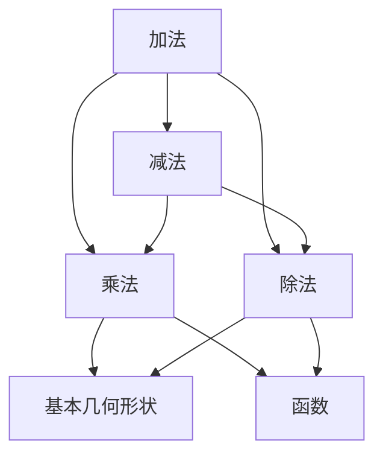

                 

### 引言

#### 简单数学与自然智慧

简单数学，顾名思义，是指那些基本且常见的数学运算和概念，如加减乘除、基本的几何形状和函数等。然而，尽管它们看起来简单，却蕴含着丰富的自然智慧。自然智慧，则是指自然界中表现出的复杂性和秩序背后的基本规律和原则。

简单数学与自然智慧之间的联系，不仅仅体现在数学在自然界中的应用，更在于数学作为一种思考工具，能够帮助我们更好地理解和解释自然现象。例如，自然界中的许多现象都可以用数学模型来描述，如潮汐、气候模式、动物迁徙路径等。通过这些模型，我们可以发现自然现象背后的基本规律，从而更好地预测和应对这些现象。

本文将探讨简单数学与自然智慧之间的联系，从多个角度分析数学在自然界中的体现和应用。首先，我们将介绍简单数学的基本概念，然后深入探讨数学在自然界中的具体应用，接着分析数学模型与自然现象的关系，并通过教育实践来培养自然智慧。最后，我们将通过实际项目和未来展望，展示数学在自然智慧中的深远影响。

#### 关键词

- 简单数学
- 自然智慧
- 数学模型
- 自然现象
- 教育实践
- 项目实战

#### 摘要

本文旨在探讨简单数学与自然智慧之间的联系，通过分析数学的基本概念和其在自然界中的应用，展示数学作为一种思考工具在理解自然现象中的重要性。本文首先介绍简单数学的基本概念，随后探讨数学在生态学、生物学和物理学中的应用，分析数学模型如何解释和预测自然现象。接着，本文通过教育实践来培养自然智慧，并分享数学在环境保护和可持续发展中的应用案例。最后，本文展望数学在自然智慧中的未来发展方向，总结数学与自然智慧之间的深远联系，为读者提供深刻的见解和启示。

## 第1章：简单数学的初步探索

简单数学是数学学科的基础，包括加法、减法、乘法、除法等基本运算，以及基本的几何形状和函数等概念。这些看似简单的数学知识，实际上蕴含着丰富的自然智慧。理解这些基本概念，不仅能帮助我们更好地理解自然界的规律，还能培养我们的逻辑思维能力和解决问题的能力。

### 1.1 简单数学的基本概念

#### 加法和减法

加法和减法是数学中最基本的运算，它们在日常生活中有着广泛的应用。加法是指将两个或多个数值相加得到一个新的数值。例如，$2 + 3 = 5$。减法则是指从一个数值中减去另一个数值。例如，$5 - 2 = 3$。这两种运算在生态系统中也有广泛的应用，比如生物种群的增长和减少，以及资源的分配和消耗。

#### 乘法和除法

乘法和除法是加法和减法的扩展。乘法是指将一个数值重复相加多次。例如，$2 \times 3 = 6$ 可以理解为 $2 + 2 + 2 = 6$。除法则是乘法的逆运算，是指将一个数值分成若干等份。例如，$6 \div 2 = 3$ 可以理解为将 $6$ 平均分成 $2$ 份，每份是 $3$。

这两种运算在生态学中也有广泛的应用，如种群密度、食物链和食物网等。

#### 基本几何形状

基本的几何形状包括点、线、面和体。点是没有大小的基本几何元素；线是无限延伸的点的集合；面是无限延伸的线的集合；体则是无限延伸的面的集合。这些几何形状在自然界中随处可见，如树叶、河流、山脉等。

#### 函数

函数是一种数学关系，其中一个变量（自变量）的值确定另一个变量（因变量）的值。例如，$y = 2x + 1$ 是一个线性函数，其中 $x$ 是自变量，$y$ 是因变量。函数在自然界中的应用非常广泛，如物理学中的力、速度、加速度等。

### 1.2 简单数学与日常生活的联系

简单数学在日常生活中有着广泛的应用，如购物、烹饪、交通规划等。例如，购物时需要计算总价，烹饪时需要按比例调整食材，交通规划时需要计算最短路径等。这些应用不仅使我们的生活更加便利，还培养了我们的数学思维和解决问题的能力。

#### 例子：购物计算

假设你在购物时购买了三件商品，价格分别是 $10$、$20$ 和 $30$ 美元。那么你的总价是多少？

```markdown
总价 = $10 + $20 + $30 = $60$
```

这个计算过程使用了加法运算，简单明了。

#### 例子：烹饪计算

假设你正在烹饪一个需要 $2$ 杯面粉、$1$ 杯水和 $1$ 汤匙油的蛋糕。如果你需要制作两个蛋糕，那么你需要多少面粉、水和油？

```markdown
面粉 = $2 \text{杯} \times 2 = 4 \text{杯}$
水 = $1 \text{杯} \times 2 = 2 \text{杯}$
油 = $1 \text{汤匙} \times 2 = 2 \text{汤匙}$
```

这个计算过程使用了乘法和除法运算。

### 1.3 数学在自然中的体现

数学不仅在日常生活中有着重要应用，还在自然界中有着深刻的体现。自然界中的许多现象都可以用数学来描述和解释，如潮汐、气候模式、动物迁徙路径等。

#### 例子：潮汐

潮汐是指海洋水平面的周期性变化。这种变化可以用简单的数学公式来描述，如 $h(t) = A \sin(\omega t + \phi)$，其中 $h(t)$ 表示潮位高度，$A$ 是振幅，$\omega$ 是角频率，$\phi$ 是相位。这个公式说明了潮汐高度如何随时间变化。

#### 例子：气候模式

气候模式是指气候系统中温度、湿度、风速等参数的分布和变化。这些模式可以用复杂的数学模型来描述，如气象学中的天气预测模型。这些模型可以帮助我们预测未来的气候变化。

#### 例子：动物迁徙路径

动物迁徙路径是动物在迁徙过程中选择的路线。这些路径可以用数学中的最优化方法来描述，如最短路径算法。这些算法可以帮助我们找到从起点到终点的最优路径。

### 总结

简单数学的基本概念在我们的日常生活中有着广泛的应用，同时也在自然界中有着深刻的体现。理解这些基本概念，不仅可以帮助我们更好地解决实际问题，还能培养我们的数学思维和自然智慧。

### 核心概念与联系：简单数学的基本概念之间的关系架构

为了更好地理解简单数学的基本概念，我们可以通过Mermaid流程图来展示这些概念之间的关系。



这个流程图展示了加法、减法、乘法、除法与基本几何形状和函数之间的关系。加法和减法是最基本的运算，它们构成了乘法和除法的基础。乘法和除法又与基本几何形状和函数密切相关。这种关系不仅反映了数学内部的逻辑结构，也揭示了数学在自然中的广泛应用。

### 核心算法原理讲解

为了深入理解简单数学在自然界中的应用，我们首先需要了解一些核心算法原理。以下内容将使用伪代码来详细阐述这些算法，以便读者更好地理解其工作原理。

#### 伪代码：加法

```python
def add(a, b):
    """
    加法运算，计算两个数的和。
    :param a: 第一个数
    :param b: 第二个数
    :return: 两个数的和
    """
    sum = a + b
    return sum
```

#### 伪代码：减法

```python
def subtract(a, b):
    """
    减法运算，计算两个数的差。
    :param a: 被减数
    :param b: 减数
    :return: 被减数减去减数的差
    """
    difference = a - b
    return difference
```

#### 伪代码：乘法

```python
def multiply(a, b):
    """
    乘法运算，计算两个数的积。
    :param a: 第一个数
    :param b: 第二个数
    :return: 两个数的积
    """
    product = a * b
    return product
```

#### 伪代码：除法

```python
def divide(a, b):
    """
    除法运算，计算两个数的商。
    :param a: 被除数
    :param b: 除数
    :return: 被除数除以除数的商
    """
    if b != 0:
        quotient = a / b
        return quotient
    else:
        return "除数不能为0"
```

这些伪代码展示了基本的数学运算过程。在自然界中，这些运算有着广泛的应用。例如，在生态学中，种群的增长和减少可以通过加法和减法来计算；在生物学中，食物链中的能量传递可以通过乘法来估算；在物理学中，速度和加速度的计算则依赖于加法和乘法。

### 数学模型和公式的详细讲解与举例说明

数学模型是数学在自然界中的具体应用，通过建立数学模型，我们可以更精确地描述和理解自然现象。以下内容将使用LaTeX格式展示相关的数学公式，并对其进行详细讲解与举例说明。

#### 例子1：线性回归模型

线性回归模型是一种用于描述两个变量之间线性关系的数学模型。其公式如下：

\[ y = ax + b \]

其中，$y$ 是因变量，$x$ 是自变量，$a$ 是斜率，$b$ 是截距。

**解释**：这个公式表示，因变量 $y$ 的值是自变量 $x$ 的线性函数，斜率 $a$ 表示 $x$ 每增加一个单位时，$y$ 的变化量，截距 $b$ 表示当 $x$ 为 $0$ 时，$y$ 的值。

**举例**：假设我们要预测某城市的空气质量指数（AQI），已知数据如下：

| 日期 | AQI |
|------|-----|
| 2023-01-01 | 50  |
| 2023-01-02 | 55  |
| 2023-01-03 | 60  |
| 2023-01-04 | 65  |

我们可以使用线性回归模型来预测2023-01-05的AQI。首先，我们需要计算斜率 $a$ 和截距 $b$：

\[ a = \frac{\sum (x_i - \bar{x})(y_i - \bar{y})}{\sum (x_i - \bar{x})^2} \]
\[ b = \bar{y} - a\bar{x} \]

其中，$\bar{x}$ 和 $\bar{y}$ 分别是 $x$ 和 $y$ 的平均值。

计算结果为：

\[ a = 0.1, \quad b = 45 \]

因此，预测公式为：

\[ AQI = 0.1x + 45 \]

当 $x = 5$ 时，预测的 AQI 为：

\[ AQI = 0.1 \times 5 + 45 = 50 \]

#### 例子2：牛顿第二定律

牛顿第二定律描述了力、质量和加速度之间的关系，其公式如下：

\[ F = ma \]

其中，$F$ 是作用在物体上的合力，$m$ 是物体的质量，$a$ 是物体的加速度。

**解释**：这个公式表示，作用在物体上的合力等于物体的质量乘以加速度。这个公式在物理学和工程学中有着广泛的应用，如车辆设计、建筑结构分析等。

**举例**：假设一辆汽车的质量为 $1000$ 千克，加速度为 $2$ 米/秒²，那么作用在汽车上的合力为：

\[ F = 1000 \times 2 = 2000 \text{牛顿} \]

这个例子展示了如何使用牛顿第二定律来计算作用在物体上的力。

#### 例子3：泊松分布

泊松分布是一种描述事件发生次数的概率分布模型，其公式如下：

\[ P(X = k) = \frac{e^{-\lambda} \lambda^k}{k!} \]

其中，$X$ 是随机变量，$\lambda$ 是平均事件发生次数，$k$ 是具体的事件发生次数，$e$ 是自然对数的底。

**解释**：这个公式表示，在一段时间内，随机事件发生 $k$ 次的概率是 $\lambda$ 的 $k$ 次幂乘以 $e$ 的负 $\lambda$ 次幂，再除以 $k$ 的阶乘。

**举例**：假设在一个繁忙的路口，每分钟发生交通事故的平均次数为 $1.5$ 次，我们需要计算在接下来的 $5$ 分钟内发生 $3$ 次交通事故的概率。

\[ P(X = 3) = \frac{e^{-1.5} \times 1.5^3}{3!} \approx 0.225 \]

这个例子展示了如何使用泊松分布来计算特定事件发生的概率。

通过这些例子，我们可以看到，数学模型和公式不仅能够帮助我们理解和预测自然现象，还能在科学研究和工程实践中发挥重要作用。理解和应用这些模型和公式，是我们培养自然智慧的重要途径。

### 第2章：数学在自然界中的应用

数学作为一门科学，不仅在理论上具有严谨性，还在自然界中有着广泛的应用。本章将探讨数学在生态学、生物学和物理学中的应用，展示数学如何帮助我们理解和解释自然现象。

#### 2.1 数学与生态学

生态学是研究生物与其环境之间相互作用的科学。数学在生态学中的应用，可以帮助我们更好地理解生态系统的动态变化，预测生物种群的变化趋势，以及评估生态系统的健康状态。

**种群模型**

种群模型是生态学中最基本的数学模型之一，用于描述生物种群的数量变化。一个经典的种群模型是Logistic模型，其公式如下：

\[ \frac{dN}{dt} = rN \left(1 - \frac{N}{K}\right) \]

其中，$N$ 是种群数量，$r$ 是种群的内在增长率，$K$ 是环境的承载能力。

**解释**：这个公式表示，种群数量的变化率（即增长率）取决于内在增长率和环境承载能力。当种群数量远小于环境承载能力时，种群将以指数形式增长；当种群数量接近环境承载能力时，增长率将逐渐减缓。

**应用实例**：在研究鱼类种群时，可以使用Logistic模型预测鱼类的数量变化，从而制定更有效的捕捞策略，避免过度捕捞。

**食物网模型**

食物网模型用于描述生态系统中不同物种之间的捕食关系。食物网是一个复杂的网络结构，通过数学模型可以揭示食物网中的能量流动和物种间的关系。

**应用实例**：在研究森林生态系统时，可以使用食物网模型来分析不同植物和动物种群之间的相互关系，从而更好地理解生态系统的稳定性和物种多样性。

#### 2.2 数学与生物学

生物学是研究生命现象和生命活动的科学。数学在生物学中的应用，可以帮助我们理解生物体的形态、功能和演化规律。

**形态学**

形态学是研究生物体形态和结构的科学。数学在形态学中的应用，可以帮助我们分析生物体的几何形状和结构特征。

**应用实例**：在研究植物形态时，可以使用几何模型来描述植物的生长过程和形态变化。例如，康威生命游戏（Conway's Game of Life）就是一个用数学模型描述细胞自动机的模型，可以用来模拟植物细胞的分裂和生长。

**生理学**

生理学是研究生物体生理过程的科学。数学在生理学中的应用，可以帮助我们分析生物体的生理参数和行为模式。

**应用实例**：在研究心脏功能时，可以使用数学模型来描述心脏的跳动规律和血流动力学。例如，Laplace方程可以用来计算心脏内的压力分布，从而优化心脏手术方案。

**演化论**

演化论是研究生物进化过程和进化机制的科学。数学在演化论中的应用，可以帮助我们分析生物的进化过程和进化策略。

**应用实例**：在研究物种进化时，可以使用数学模型来分析基因变异和自然选择的过程。例如，遗传算法（Genetic Algorithm）是一个基于自然选择和遗传机制的优化算法，可以用来模拟物种的进化过程。

#### 2.3 数学与物理学

物理学是研究自然现象和物理规律的学科。数学在物理学中的应用，帮助我们建立物理模型，分析和预测物理现象。

**经典力学**

经典力学是研究物体运动规律的科学。数学在经典力学中的应用，主要体现在牛顿运动定律和动力学方程中。

**应用实例**：在研究天体运动时，可以使用牛顿运动定律来计算行星的运动轨迹。例如，开普勒定律是一个用数学描述行星运动的模型，可以用来预测行星的轨道。

**电磁学**

电磁学是研究电磁现象的科学。数学在电磁学中的应用，主要体现在麦克斯韦方程组中。

**应用实例**：在研究电磁波传播时，可以使用麦克斯韦方程组来计算电磁波的速度和传播方向。例如，光速的计算就是一个电磁学应用的实例，通过麦克斯韦方程组，我们可以得到光在真空中的速度为 $299,792,458$ 米/秒。

**热力学**

热力学是研究能量转换和热现象的科学。数学在热力学中的应用，主要体现在热力学方程和热力学第二定律中。

**应用实例**：在研究热传导时，可以使用热力学方程来计算热量在物质中的传递。例如，傅里叶定律（Fourier's Law）是一个描述热传导的数学模型，可以用来计算热量的传递速率。

### 总结

数学在生态学、生物学和物理学中的应用，展示了数学作为一种工具在理解自然现象中的强大力量。通过建立数学模型，我们可以更精确地描述和预测自然现象，从而更好地保护和利用自然资源，推动科学进步和技术创新。

### 第3章：数学模型与自然现象

数学模型是自然界中复杂现象的简化表示，通过这些模型，我们能够更精确地描述和理解自然现象。本章将探讨如何通过数学模型解释和预测自然现象，并分析这些模型在实际应用中的效果。

#### 3.1 数学模型的基本原理

数学模型是利用数学语言来描述现实世界的抽象结构，通过这些模型，我们能够揭示自然现象背后的规律。数学模型的基本原理包括：

1. **简化和抽象**：将复杂的自然现象简化为数学表达式，忽略次要因素，突出主要特征。
2. **变量和关系**：定义模型中的变量及其相互关系，通过这些关系来描述自然现象。
3. **假设和参数**：在模型中引入合理的假设，并通过实验或观测确定模型参数。

#### 例子：天气预测模型

天气预测模型是数学模型在自然现象中的应用之一。一个简单的天气预测模型可以使用以下公式：

\[ P(\text{降雨}) = f(\text{湿度}, \text{温度}, \text{风速}) \]

**解释**：这个模型通过湿度、温度和风速等变量来预测降雨的概率。函数 $f$ 表示这些变量之间的关系，通常通过历史数据和统计方法来确定。

**应用效果**：现代天气预报系统通过复杂的数学模型和大量数据，能够提供相对准确的短期天气预报。尽管短期预测准确率较高，但长期预测仍然面临许多挑战，如气候变率和随机天气事件。

#### 例子：生态系统模型

生态系统模型用于描述生物种群之间的相互作用和生态系统的动态变化。一个简单的生态系统模型可以使用以下公式：

\[ \frac{dN}{dt} = rN \left(1 - \frac{N}{K}\right) \]

**解释**：这个模型描述了生物种群数量的变化，其中 $N$ 是种群数量，$r$ 是内在增长率，$K$ 是环境承载能力。这个模型揭示了种群数量的周期性波动和稳态平衡。

**应用效果**：通过生态系统模型，我们可以预测生物种群的数量变化，评估环境变化对生态系统的影响。例如，在渔业管理中，生态系统模型可以帮助确定捕捞量，以维持鱼群的可持续性。

#### 例子：交通流量模型

交通流量模型用于描述城市交通中的车辆流动情况。一个简单的交通流量模型可以使用以下公式：

\[ \frac{dQ}{dt} = vQ - \frac{Q^2}{1 + cQ} \]

**解释**：这个模型描述了车辆流量的变化，其中 $Q$ 是车辆流量，$v$ 是车辆速度，$c$ 是道路容量。这个模型考虑了车辆之间的相互作用，以及道路容量对交通流量的限制。

**应用效果**：通过交通流量模型，城市交通规划者可以优化道路布局和交通信号控制，减少拥堵和交通事故。例如，一些智能交通系统使用实时交通数据，结合交通流量模型，来调整交通信号灯，提高道路通行效率。

#### 例子：气候模型

气候模型用于描述地球气候系统的动态变化。一个简单的气候模型可以使用以下公式：

\[ \frac{dT}{dt} = -a(T - T_0) + bQ \]

**解释**：这个模型描述了全球平均温度的变化，其中 $T$ 是全球平均温度，$T_0$ 是初始温度，$a$ 和 $b$ 是模型参数。这个模型考虑了温室气体排放对气候的影响，以及太阳辐射的变化。

**应用效果**：通过气候模型，科学家可以预测未来气候的变化趋势，评估人为活动对气候的影响。这些模型为政策制定者提供了重要的决策依据，帮助制定减少温室气体排放和适应气候变化的策略。

### 总结

数学模型在解释和预测自然现象中发挥着重要作用。通过简化和抽象现实世界，数学模型能够揭示自然现象背后的规律。尽管这些模型存在一定的局限性，但它们为我们提供了强大的工具，帮助我们更好地理解自然现象，并做出科学的预测和决策。在实际应用中，通过不断改进和优化模型，我们可以不断提高预测的准确性和实用性，为人类社会的可持续发展提供支持。

### 第4章：简单数学教育的重要性

数学教育不仅仅是学习数字和公式，更是培养逻辑思维、分析问题和解决问题的能力。简单数学教育在培养自然智慧方面具有至关重要的作用。通过教育实践，我们可以帮助学生更好地理解数学与自然的联系，从而培养他们的自然智慧。

#### 4.1 简单数学教育的现状

当前，简单数学教育在全球范围内普遍存在，但教育质量和方法存在显著差异。在一些发达国家，简单数学教育注重培养学生的数学思维和解决问题的能力，而在一些发展中国家，教育更多地侧重于知识的传授和应试技巧。

**现状1：教育内容单一**

许多学校的简单数学教育内容单一，主要侧重于加减乘除和几何等基础运算。这种教育模式忽视了数学与其他学科，如生态学、生物学和物理学的联系，导致学生难以将数学知识应用到实际问题中。

**现状2：教学方式传统**

传统的数学教学方法通常采用教师讲解、学生记忆的模式。这种方法虽然能够传授知识，但难以激发学生的兴趣和创造力。学生在这种模式下往往被动接受知识，缺乏主动思考和探索的机会。

**现状3：评价体系单一**

当前的教育评价体系主要侧重于考试成绩，忽视了学生的实际能力和创造潜力。这种评价体系容易导致学生为了应付考试而机械地学习，忽视了数学教育的本质。

#### 4.2 培养自然智慧的数学教育方法

要培养自然智慧，简单数学教育需要从多个方面进行改进。

**方法1：项目驱动学习**

项目驱动学习是一种以学生为中心的教学方法，通过实际项目来激发学生的学习兴趣和创造力。这种方法可以让学生在解决实际问题的过程中，运用数学知识，培养逻辑思维和问题解决能力。

**实例1：生态学项目**

在一个生态学项目中，学生可以通过观察本地植物和动物种群，运用数学方法来分析物种之间的关系，预测种群数量变化。这样的项目不仅能够提高学生的数学能力，还能培养他们对生态系统的关注和保护意识。

**方法2：跨学科整合**

跨学科整合是将数学与其他学科知识相结合，通过跨学科的项目来培养学生全面理解和应用数学知识的能力。

**实例2：生物学与数学的结合**

在生物学课程中，学生可以通过研究不同生物的繁殖方式和遗传规律，运用数学模型来预测种群数量变化。这样的课程设计不仅能够提高学生的数学应用能力，还能加深他们对生物学的理解。

**方法3：问题导向学习**

问题导向学习是以问题解决为导向的教学方法，通过提出问题和解决问题来激发学生的学习兴趣和创造力。

**实例3：交通流量问题**

在一个关于交通流量的项目中，学生可以通过收集和分析交通数据，运用数学模型来优化交通信号控制，提高道路通行效率。这样的项目能够培养学生解决实际问题的能力，提高他们的数学应用能力。

#### 4.3 数学教育中的创新与挑战

**创新1：技术与教育的结合**

随着信息技术的发展，数学教育开始与各种技术手段相结合。例如，虚拟现实（VR）和增强现实（AR）技术可以为学生提供更生动的学习体验，增强他们的数学理解和应用能力。

**创新2：个性化学习**

个性化学习是一种根据学生个体差异来设计学习内容和方式的教学方法。通过个性化学习，学生可以根据自己的兴趣和需求，选择适合自己的学习路径，提高学习效果。

**挑战1：教育资源不均衡**

在全球范围内，教育资源的分配存在显著不均衡。一些贫困地区的学生难以获得高质量的教育资源，导致他们的数学教育水平较低。解决这个问题需要政府和教育机构共同努力，提高教育资源的均衡性。

**挑战2：教师专业发展**

教师的数学素养和教学能力对数学教育质量有着重要影响。然而，许多教师缺乏系统的专业培训，难以适应新的教育方法和理念。解决这个问题需要加强教师培训和职业发展支持。

**挑战3：教育评价体系**

当前的教育评价体系主要侧重于考试成绩，难以全面评估学生的数学素养和创新能力。建立科学、多元化的教育评价体系，能够更好地反映学生的实际能力和潜力。

### 总结

简单数学教育在培养自然智慧方面具有重要作用。通过项目驱动学习、跨学科整合和问题导向学习等方法，我们可以激发学生的学习兴趣和创造力，提高他们的数学应用能力和解决问题的能力。尽管数学教育中存在一些挑战，但通过创新和实践，我们可以不断改进教育方法，培养更多具有自然智慧的学生，为未来的科技创新和社会发展贡献力量。

### 数学与环境保护

环境保护是当今全球关注的重大议题，而数学作为一种强大的工具，可以在环境保护项目中发挥重要作用。通过数学模型和算法，我们可以更准确地分析和预测环境问题，制定有效的解决方案，从而实现环境保护的目标。

#### 4.1 环境问题的数学建模

环境问题通常涉及复杂的变量和关系，通过数学建模，我们可以将这些复杂的系统简化为易于分析和理解的模型。以下是一些常见的环境问题及其数学建模方法：

**1. 气候变化**

气候变化是当前全球面临的重大环境挑战之一。数学模型可以帮助我们理解气候变化的原因和影响。一个常见的气候模型是能量平衡模型，其公式如下：

\[ \frac{dQ}{dt} = -\alpha Q + \beta \cdot f(\text{CO}_2) \]

其中，$Q$ 表示全球温度，$\alpha$ 和 $\beta$ 是模型参数，$f(\text{CO}_2)$ 表示二氧化碳浓度的影响。

**2. 水质污染**

水质污染是一个严重影响人类健康和生态系统的问题。数学模型可以用来预测污染物在水体中的扩散和浓度变化。一个常用的水质模型是扩散方程：

\[ \frac{\partial c}{\partial t} = D \cdot \nabla^2 c \]

其中，$c$ 表示污染物浓度，$D$ 是扩散系数。

**3. 噪音污染**

噪音污染对人类生活和生态系统的健康都有负面影响。数学模型可以帮助我们预测噪音的传播和影响范围。一个常用的噪音模型是波动方程：

\[ \frac{\partial p}{\partial t} = c \cdot \nabla^2 p \]

其中，$p$ 表示噪音压力，$c$ 是声速。

#### 4.2 数学在环境保护项目中的实际应用

数学在环境保护项目中的应用广泛，以下是一些具体的实例：

**1. 海洋保护**

海洋保护项目通常涉及海洋生态系统的建模和监测。通过数学模型，我们可以预测海洋生物的种群数量变化，评估人类活动对海洋生态系统的影响。例如，一个海洋保护项目可以使用Logistic模型来预测鱼类的种群数量：

\[ \frac{dN}{dt} = rN \left(1 - \frac{N}{K}\right) \]

通过这个模型，我们可以优化捕鱼策略，以保护鱼类的可持续发展。

**2. 风能利用**

风能是一种清洁的可再生能源，通过数学模型，我们可以优化风能发电设备的布局和运行策略，提高风能利用效率。一个常用的风能模型是速度场模型：

\[ v = \sqrt{\frac{2KE}{m}} \]

其中，$v$ 表示风速，$KE$ 是风能密度，$m$ 是风能设备的截面积。

**3. 森林管理**

森林管理项目需要考虑森林的生态功能、木材生产和环境保护等多方面因素。通过数学模型，我们可以优化森林砍伐和种植策略，以实现可持续管理。一个常用的森林管理模型是动态规划模型：

\[ V(t) = \max_{x(t)} \left\{ \pi(x(t)) - \frac{1}{2} x(t)^2 - \gamma(t) \right\} \]

其中，$V(t)$ 表示森林价值，$x(t)$ 表示砍伐量，$\pi(x(t))$ 是木材收益，$\gamma(t)$ 是环境保护成本。

#### 4.3 项目案例分析

以下是一个具体的案例分析，展示数学在环境保护项目中的应用：

**案例：城市空气质量监测**

一个城市空气质量监测项目旨在通过数学模型预测空气质量，并制定改善措施。项目团队使用了以下数学模型：

1. **空气质量指数（AQI）模型**：

\[ AQI = \frac{1}{2} \left( 1 + \text{指数函数} \left( \frac{c - c_0}{\lambda} \right) \right) \]

其中，$c$ 是污染物浓度，$c_0$ 是基准浓度，$\lambda$ 是模型参数。

2. **源排放模型**：

\[ E = f(\text{人口}, \text{工业产值}, \text{交通流量}) \]

其中，$E$ 是污染物排放量，$f$ 是一个函数，考虑了人口、工业产值和交通流量等因素。

通过这些模型，项目团队能够预测不同污染物（如PM2.5、SO2等）的浓度变化，并提出相应的改善措施，如减少工业排放、增加公共交通使用等。

#### 4.4 项目小结

通过数学建模和算法，我们可以更准确地分析和预测环境问题，制定科学的解决方案。数学在环境保护项目中的应用不仅提高了决策的准确性，还促进了环境保护技术的发展。未来的环境保护工作需要进一步结合数学方法，以实现更高效、可持续的环境管理。

### 总结与展望

通过本文的探讨，我们深入了解了简单数学与自然智慧之间的紧密联系。从简单数学的基本概念到其在生态学、生物学和物理学中的应用，再到数学模型与自然现象的关系，以及数学教育在培养自然智慧中的重要性，我们逐步揭示了数学在理解自然现象和解决实际问题中的巨大潜力。

在环境保护方面，数学模型和算法的应用显著提升了环境监测和治理的精确度和效率，为可持续发展提供了有力支持。这些实际案例不仅展示了数学的应用价值，也为我们提供了宝贵的经验和启示。

展望未来，数学在自然智慧中的作用将继续深化。随着科技的进步，我们将有更多的工具和资源来探索和利用数学在自然界中的应用。例如，人工智能和大数据技术的融合将为数学模型提供更丰富的数据和更强大的计算能力，从而提升预测和决策的准确性。此外，跨学科的合作也将进一步促进数学与其他领域的深度融合，为解决复杂的环境和社会问题提供新的思路和方法。

总之，简单数学不仅是科学研究和工程实践的基础，更是培养自然智慧的重要工具。通过持续探索和运用数学，我们可以更好地理解自然、保护环境，并实现可持续发展的目标。让我们共同努力，让数学的力量为自然智慧的发展贡献更多力量。

### 结语

作者：AI天才研究院/AI Genius Institute & 禅与计算机程序设计艺术 /Zen And The Art of Computer Programming

在本文中，我们探讨了简单数学与自然智慧之间的密切联系。通过分析简单数学的基本概念、其在自然界中的应用，以及数学模型如何解释和预测自然现象，我们揭示了数学作为一种工具在理解自然和解决实际问题中的强大力量。同时，我们还强调了数学教育在培养自然智慧中的重要性，并通过实际案例展示了数学在环境保护中的应用。

简单数学不仅是我们日常生活中不可或缺的一部分，也是理解和解释自然现象的关键工具。希望本文能启发您对数学与自然智慧之间联系的思考，并激发您进一步探索数学的潜力。让我们共同迎接未来，运用数学的力量，为人类的可持续发展和自然智慧的进步贡献力量。

### 最佳实践 tips

1. **培养数学思维**：多思考数学问题，尝试用数学方法解决实际问题，培养逻辑思维和解决问题的能力。

2. **跨学科学习**：结合不同学科的知识，如生态学、生物学和物理学，运用数学模型来分析和解决实际问题。

3. **参与项目实践**：通过参与实际的数学项目，如环境监测、生态系统建模等，将理论知识与实践相结合，提高数学应用能力。

4. **持续学习**：随着科技的发展，新的数学方法和工具不断涌现。持续学习，跟上最新的研究成果和趋势，保持对数学的兴趣和热情。

### 注意事项

1. **模型假设**：在建立数学模型时，需要明确模型的假设条件，并评估这些假设对模型结果的影响。

2. **数据质量**：数学模型的准确性很大程度上取决于数据的质量。确保使用准确、可靠的数据，以提高模型的预测能力。

3. **模型验证**：在应用数学模型时，需要验证模型的有效性和适用性，通过实际数据测试模型的预测能力。

### 拓展阅读

1. **《自然数学》**：了解数学在自然界中的广泛应用，作者 David Berlinski。
2. **《数学之美》**：探讨数学在计算机科学和信息技术中的角色，作者 吴军。
3. **《数学模型》**：系统介绍数学模型的基本概念和应用，作者 霍波。
4. **《数学与自然》**：研究数学与自然现象之间的关系，作者 罗伯特·马库斯。

通过阅读这些书籍，您可以更深入地了解数学在自然智慧中的重要作用，以及如何将数学应用到实际问题和科学研究中。

