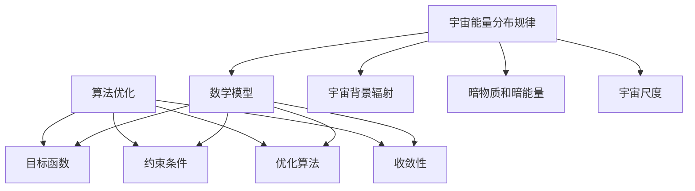

                 

### 文章标题：算法优化与宇宙能量分布规律

**关键词**：算法优化、宇宙能量分布、数学模型、数据分析、应用实例

**摘要**：
本文旨在探讨算法优化与宇宙能量分布规律之间的关联，通过对算法优化基础知识的深入解读，以及其在宇宙学研究中的具体应用，揭示算法优化在理解宇宙能量分布规律中的关键作用。文章将首先介绍算法优化和宇宙能量分布规律的基础知识，然后通过实例展示如何运用算法优化方法来模拟和分析宇宙能量分布规律，最后讨论算法优化在宇宙学中的未来发展方向。希望通过本文的阐述，读者能对算法优化在宇宙能量分布规律研究中的应用有一个全面而深刻的理解。

---

### 1. 背景介绍

算法优化与宇宙能量分布规律，看似两个风马牛不相及的领域，但它们之间却有着千丝万缕的联系。算法优化，是指通过改进算法的设计和实现，提高算法的运行效率和解决问题的能力。在计算机科学中，算法优化是提高系统性能、降低资源消耗的关键技术。而宇宙能量分布规律，则是指宇宙中各种形式的能量在不同尺度、不同环境下的分布情况，是宇宙学研究的重要内容。

宇宙能量分布规律的研究，不仅有助于我们更好地理解宇宙的起源和演化，还能为解决一些重大科学问题提供新的思路和方法。例如，宇宙微波背景辐射的测量数据揭示了宇宙早期的高能密度状态，这些数据通过复杂的数学模型和算法被解析，揭示了宇宙能量分布的基本特征。

尽管这两个领域看似迥异，但它们在理论和实践上都有许多共通之处。算法优化中的优化算法，如梯度下降法、遗传算法等，与宇宙学中的模拟方法有相似之处。同样，宇宙能量分布规律的探索也依赖于高效的计算方法和精确的数学模型，这些方法与算法优化密切相关。

本文将围绕算法优化和宇宙能量分布规律这两个核心主题，通过以下几个部分展开讨论：

1. **算法优化基础知识**：介绍算法优化的核心概念、常见优化算法和数学模型。
2. **算法优化在宇宙学研究中的应用**：探讨算法优化在宇宙学中的重要性以及具体应用案例。
3. **宇宙能量分布规律的探索**：介绍宇宙能量分布的基本概念、模拟方法和数据分析。
4. **算法优化与宇宙能量分布规律的交叉应用**：展示算法优化在宇宙能量分布规律研究中的实际应用。
5. **总结与展望**：总结文章的核心观点，并对未来的研究方向进行展望。

通过以上结构的梳理，我们希望能为读者提供一条清晰、连贯的思路，帮助大家更好地理解算法优化与宇宙能量分布规律之间的关联和互动。

### 2. 核心概念与联系

算法优化和宇宙能量分布规律虽然分属不同的领域，但它们之间有着深刻的内在联系。为了更好地理解这一关联，我们需要首先明确两个核心概念：算法优化和宇宙能量分布规律。

#### 算法优化的核心概念

算法优化是指通过对算法的改进，使其在特定的约束条件下达到最优性能。具体来说，算法优化主要包括以下几个核心概念：

- **目标函数**：目标函数是衡量算法性能的指标，通常是一个需要最小化或最大化的函数。
- **约束条件**：约束条件是对算法运行过程中需要满足的限制条件，如时间、资源消耗等。
- **优化算法**：优化算法是用于寻找最优解或近似最优解的方法，如梯度下降法、遗传算法等。
- **收敛性**：收敛性是指算法在运行过程中逐渐接近最优解的性质。

算法优化的目标是找到最优解，即满足所有约束条件且目标函数值最小的解。这一过程中，算法优化需要处理大量的计算和数据，因此高效性和鲁棒性尤为重要。

#### 宇宙能量分布规律的核心概念

宇宙能量分布规律是指宇宙中各种形式的能量在不同尺度、不同环境下的分布情况。宇宙能量分布规律的核心概念包括：

- **宇宙背景辐射**：宇宙背景辐射是宇宙早期的高能密度状态的残余，是研究宇宙能量分布规律的重要依据。
- **暗物质和暗能量**：暗物质和暗能量是宇宙中不发光且无法通过电磁波探测的物质和能量，它们对宇宙能量分布规律有重要影响。
- **宇宙尺度**：宇宙尺度是指宇宙中不同天体和结构的大小范围，如星系、星团、超星系团等。

宇宙能量分布规律的探索，需要通过大量的观测数据和复杂的数学模型来描述和解释宇宙中的能量分布情况。

#### 算法优化与宇宙能量分布规律的联系

算法优化与宇宙能量分布规律之间的联系主要体现在以下几个方面：

1. **数学模型的构建**：算法优化依赖于数学模型来描述问题，而宇宙能量分布规律的探索同样需要建立复杂的数学模型来描述宇宙中的能量分布情况。
2. **数据分析和处理**：算法优化需要对大量数据进行处理和分析，宇宙能量分布规律的探索也需要对大量的观测数据进行处理和分析。
3. **计算方法的优化**：算法优化关注如何提高计算效率和精度，这在宇宙能量分布规律的探索中同样至关重要。

为了更直观地展示算法优化与宇宙能量分布规律之间的关系，我们可以使用Mermaid流程图来构建这两个概念之间的联系：



通过以上流程图，我们可以清晰地看到算法优化和宇宙能量分布规律之间的相互联系和作用。

### 3. 核心算法原理讲解

在了解了算法优化和宇宙能量分布规律的核心概念之后，接下来我们将深入探讨算法优化的核心原理，特别是常见优化算法的工作原理和如何应用于宇宙能量分布规律的研究。

#### 3.1 梯度下降法

梯度下降法是最常用的优化算法之一，其基本思想是通过不断沿着目标函数梯度的反方向进行迭代，以逐步逼近最优解。

**伪代码：**

```python
Initialize: x0, learning rate α
for i = 1 to n_iterations do
  Compute gradient: ∇f(x)
  Update: x = x - α * ∇f(x)
  Check convergence: if |x - x_old| < ε then break
return x
```

**详细步骤：**
1. **初始化**：选择一个初始解 `x0` 和学习率 `α`。
2. **计算梯度**：在当前解 `x` 处计算目标函数的梯度 `∇f(x)`。
3. **更新解**：根据梯度方向和步长（学习率 `α`），更新解 `x = x - α * ∇f(x)`。
4. **检查收敛**：若当前解与上一轮解的差距小于预设阈值 `ε`，则算法收敛。

梯度下降法的关键在于选择合适的学习率 `α`，过大可能导致步长过长，无法收敛；过小则收敛速度过慢。在实际应用中，常用的技巧包括动量（Momentum）和自适应学习率（Adaptive Learning Rate）。

#### 3.2 随机梯度下降法（SGD）

随机梯度下降法是梯度下降法的变种，通过随机选择一部分数据进行梯度计算，以加速收敛。

**伪代码：**

```python
Initialize: x0, learning rate α, mini-batch size m
for i = 1 to n_iterations do
  Shuffle data
  for each sample xi in mini-batch do
    Compute gradient: ∇f(xi)
    Update: x = x - α * ∇f(xi)
  Check convergence: if |x - x_old| < ε then break
return x
```

**详细步骤：**
1. **初始化**：选择一个初始解 `x0`、学习率 `α` 和 mini-batch size `m`。
2. **数据打乱**：将数据集随机打乱。
3. **计算梯度**：对于每个 mini-batch 中的样本 `xi`，计算梯度 `∇f(xi)`。
4. **更新解**：根据梯度方向和步长（学习率 `α`），更新解 `x = x - α * ∇f(xi)`。
5. **检查收敛**：若当前解与上一轮解的差距小于预设阈值 `ε`，则算法收敛。

随机梯度下降法的优点是计算复杂度低，适合大规模数据集，但需要更多的迭代次数才能收敛。

#### 3.3 牛顿法

牛顿法是基于目标函数的一阶导数和二阶导数进行迭代的优化算法，其原理是基于泰勒展开式，通过线性近似来逼近最优解。

**伪代码：**

```python
Initialize: x0, learning rate α
for i = 1 to n_iterations do
  Compute gradient: ∇f(x)
  Compute Hessian: H = ∇²f(x)
  Update: x = x - α * (-H)^(-1) * ∇f(x)
  Check convergence: if |x - x_old| < ε then break
return x
```

**详细步骤：**
1. **初始化**：选择一个初始解 `x0` 和学习率 `α`。
2. **计算梯度**：在当前解 `x` 处计算目标函数的梯度 `∇f(x)`。
3. **计算Hessian矩阵**：计算目标函数的二阶导数矩阵 `H = ∇²f(x)`。
4. **更新解**：根据梯度和Hessian矩阵，更新解 `x = x - α * (-H)^(-1) * ∇f(x)`。
5. **检查收敛**：若当前解与上一轮解的差距小于预设阈值 `ε`，则算法收敛。

牛顿法的优点是收敛速度快，但需要计算二阶导数，对目标函数的要求较高。

#### 3.4 拉格朗日乘数法

拉格朗日乘数法是一种用于处理约束优化问题的算法，其基本思想是通过引入拉格朗日乘数，将约束优化问题转化为无约束优化问题。

**伪代码：**

```python
Initialize: λ0, x0
for i = 1 to n_iterations do
  Compute gradient: ∇f(x) and ∇g(x)
  Compute Lagrangian: L(x, λ) = f(x) + λ * g(x)
  Update: x = x - α * (-∇L(x, λ)) and λ = λ + β * ∇λ
  Check convergence: if |x - x_old| < ε then break
return x, λ
```

**详细步骤：**
1. **初始化**：选择一个初始解 `x0` 和拉格朗日乘数 `λ0`。
2. **计算梯度**：计算目标函数 `f(x)` 和约束函数 `g(x)` 的梯度 `∇f(x)` 和 `∇g(x)`。
3. **计算拉格朗日函数**：构建拉格朗日函数 `L(x, λ) = f(x) + λ * g(x)`。
4. **更新解和拉格朗日乘数**：根据梯度和拉格朗日乘数，更新解 `x = x - α * (-∇L(x, λ))` 和拉格朗日乘数 `λ = λ + β * ∇λ`。
5. **检查收敛**：若当前解和拉格朗日乘数的差距小于预设阈值 `ε`，则算法收敛。

拉格朗日乘数法适用于有约束的优化问题，可以通过引入拉格朗日乘数来处理约束条件。

#### 3.5 算法优化在宇宙能量分布规律研究中的应用

算法优化在宇宙能量分布规律研究中的应用主要体现在以下几个方面：

1. **模拟宇宙能量分布**：通过优化算法来模拟宇宙中的能量分布，如使用遗传算法来模拟宇宙中暗能量的分布。
2. **优化数据解析**：使用优化算法来解析宇宙观测数据，如使用牛顿法来解析宇宙微波背景辐射的数据。
3. **提高计算效率**：通过优化算法来提高计算效率，如使用随机梯度下降法来处理大规模宇宙数据集。

通过上述算法原理的讲解，我们可以看到算法优化在理解和模拟宇宙能量分布规律中的重要作用。这些算法不仅提高了计算的效率和精度，还为宇宙学的研究提供了强大的工具和方法。

### 4. 数学模型和公式

在算法优化与宇宙能量分布规律的研究中，数学模型和公式是理解这两个领域的关键工具。以下将详细介绍一些重要的数学模型和公式，并给出详细的讲解和举例说明。

#### 4.1 最优化问题

最优化问题是算法优化的核心，其基本形式可以表示为：

$$
\min_{x} f(x)
$$

其中，\( f(x) \) 是目标函数，\( x \) 是待优化的变量。

**例1：线性回归**

假设我们有数据集 \( D = \{ (x_1, y_1), (x_2, y_2), ..., (x_n, y_n) \} \)，我们的目标是找到直线 \( y = wx + b \) 的参数 \( w \) 和 \( b \)，使得预测值与实际值之间的误差最小。这是一个典型的线性回归问题，其目标函数可以表示为：

$$
\min_{w, b} \sum_{i=1}^{n} (wx_i + b - y_i)^2
$$

通过求解这个最优化问题，我们可以得到最优的 \( w \) 和 \( b \) 值，从而实现数据的最佳拟合。

**例2：支持向量机（SVM）**

在支持向量机中，我们希望找到一个超平面，将数据集中的正负样本尽可能分开。目标函数可以表示为：

$$
\min_{w, b, \xi_i} \frac{1}{2} ||w||^2 + C \sum_{i=1}^{n} \xi_i
$$

其中，\( C \) 是惩罚参数，\( \xi_i \) 是每个样本的松弛变量，用于处理不可分的情况。

#### 4.2 约束优化问题

约束优化问题是包含约束条件的最优化问题，其一般形式为：

$$
\min_{x} f(x) \quad \text{subject to} \quad g(x) \leq 0, \quad h(x) = 0
$$

其中，\( g(x) \) 和 \( h(x) \) 分别是约束条件。

**例1：二次规划**

二次规划问题是目标函数为二次函数的约束优化问题，其形式为：

$$
\min_{x} \frac{1}{2} x^T Q x + c^T x \quad \text{subject to} \quad Ax \leq b
$$

其中，\( Q \) 是对称矩阵，\( c \) 是向量，\( A \) 和 \( b \) 分别是约束矩阵和约束向量。

**例2：线性规划**

线性规划是目标函数为线性函数的约束优化问题，其形式为：

$$
\min_{x} c^T x \quad \text{subject to} \quad Ax \leq b
$$

线性规划在实际应用中非常广泛，如资源分配、生产调度等问题。

#### 4.3 非线性优化问题

非线性优化问题是目标函数或约束条件为非线性函数的优化问题，其形式为：

$$
\min_{x} f(x) \quad \text{subject to} \quad g(x) \leq 0, \quad h(x) = 0
$$

非线性优化问题通常没有解析解，需要使用数值方法求解。

**例1：非线性回归**

非线性回归问题类似于线性回归，但目标函数为非线性函数，其形式为：

$$
\min_{w, b} \sum_{i=1}^{n} (f(w x_i + b) - y_i)^2
$$

其中，\( f \) 是非线性函数，如多项式、指数函数等。

**例2：神经网络训练**

神经网络训练问题是一个复杂的非线性优化问题，其目标是找到网络参数 \( w, b \) 使得输出误差最小。目标函数可以表示为：

$$
\min_{w, b} \sum_{i=1}^{n} (y_i - \sigma(w x_i + b))^2
$$

其中，\( \sigma \) 是激活函数，如Sigmoid、ReLU等。

#### 4.4 拉格朗日乘数法

拉格朗日乘数法是一种用于处理约束优化问题的数值方法，其基本思想是通过引入拉格朗日乘数，将约束优化问题转化为无约束优化问题。

**公式：**

$$
L(x, \lambda) = f(x) + \lambda g(x)
$$

其中，\( L \) 是拉格朗日函数，\( \lambda \) 是拉格朗日乘数。

**详细步骤：**

1. **计算梯度**：计算拉格朗日函数 \( L \) 对 \( x \) 和 \( \lambda \) 的梯度。
2. **设置方程**：令梯度为零，得到以下方程组：
   $$
   \begin{cases}
   \nabla_x L(x, \lambda) = 0 \\
   \nabla_\lambda L(x, \lambda) = 0
   \end{cases}
   $$
3. **求解方程**：通过求解方程组，得到最优解 \( x \) 和拉格朗日乘数 \( \lambda \)。

**例：线性规划**

假设我们有以下线性规划问题：

$$
\min_{x} c^T x \quad \text{subject to} \quad Ax \leq b
$$

使用拉格朗日乘数法，我们可以引入拉格朗日乘数 \( \lambda \)，构建拉格朗日函数：

$$
L(x, \lambda) = c^T x + \lambda^T (Ax - b)
$$

通过计算梯度并设置方程组，我们可以得到最优解 \( x \) 和拉格朗日乘数 \( \lambda \)。

通过以上数学模型和公式的讲解，我们可以看到这些工具在算法优化与宇宙能量分布规律研究中的重要性。它们不仅提供了解决问题的方法，还为理解宇宙能量分布规律提供了有力的数学支持。在后续的应用实例中，我们将进一步展示这些数学模型和公式的实际应用。

### 5. 宇宙能量分布规律的实验数据分析

宇宙能量分布规律的探索，需要大量的实验数据作为基础。这些数据通常来源于宇宙微波背景辐射、星系分布、暗物质和暗能量等观测。为了深入分析宇宙能量分布规律，我们需要对实验数据进行处理、分析和模型验证。以下将详细介绍这一过程。

#### 5.1 宇宙能量分布规律实验数据来源

宇宙能量分布规律实验数据的主要来源包括：

1. **宇宙微波背景辐射（CMB）**：宇宙微波背景辐射是宇宙早期的高能密度状态的残余，通过测量CMB的分布和特性，可以获得关于宇宙早期状态的信息。
2. **大尺度结构**：通过观测星系、星团和超星系团等大尺度结构，可以了解宇宙中物质的分布情况。
3. **暗物质和暗能量**：暗物质和暗能量对宇宙能量分布有重要影响，通过对它们的观测，可以获得关于宇宙加速膨胀和结构形成的信息。

这些数据通常由大型望远镜和卫星收集，如哈勃望远镜、WMAP卫星和Planck卫星等。

#### 5.2 宇宙能量分布规律实验数据的处理

在获取到宇宙能量分布规律实验数据后，需要对数据进行预处理和清洗，以确保数据的准确性和可靠性。具体步骤包括：

1. **数据采集**：收集宇宙微波背景辐射、星系分布等观测数据。
2. **数据预处理**：对数据进行去噪、校正和归一化等处理，以消除观测过程中的噪声和系统误差。
3. **数据存储**：将处理后的数据存储在数据库中，以便后续分析和建模。

#### 5.3 宇宙能量分布规律实验数据的分析

宇宙能量分布规律实验数据的分析，主要通过以下方法进行：

1. **统计分析**：通过统计分析方法，对宇宙能量分布规律进行定量描述和推断。常用的统计方法包括均值、方差、协方差等。
2. **模型拟合**：通过构建数学模型，拟合实验数据，以揭示宇宙能量分布规律。常见的模型包括幂律分布、高斯分布等。
3. **可视化**：通过可视化方法，将宇宙能量分布规律以图形形式展示出来，便于分析和理解。常用的可视化方法包括散点图、直方图等。

#### 5.4 宇宙能量分布规律实验数据的模型验证

在分析宇宙能量分布规律实验数据后，需要通过模型验证方法，验证所建立的模型的准确性和可靠性。具体步骤包括：

1. **模型选择**：根据实验数据的特性，选择合适的数学模型进行拟合。
2. **参数估计**：通过最小二乘法、最大似然估计等方法，估计模型参数。
3. **模型拟合**：将模型拟合到实验数据上，计算拟合误差和拟合优度。
4. **模型验证**：通过交叉验证、ROC曲线等方法，验证模型的准确性和可靠性。

#### 5.5 案例分析：宇宙微波背景辐射数据分析

以下是一个具体的案例分析，展示如何对宇宙微波背景辐射数据进行分析：

1. **数据采集**：利用WMAP卫星采集的宇宙微波背景辐射数据。
2. **数据预处理**：对数据进行去噪、校正和归一化等处理，以消除噪声和系统误差。
3. **统计分析**：计算数据的基本统计量，如均值、方差等。
4. **模型拟合**：选择高斯分布模型对数据进行分析，建立以下模型：
   $$
   P(r) = \frac{1}{\sqrt{2\pi}\sigma} e^{-\frac{(r-\mu)^2}{2\sigma^2}}
   $$
   其中，\( \mu \) 和 \( \sigma \) 分别是均值和标准差。
5. **参数估计**：通过最小二乘法，估计模型参数 \( \mu \) 和 \( \sigma \)。
6. **模型拟合**：将模型拟合到实验数据上，计算拟合误差和拟合优度。
7. **模型验证**：通过交叉验证，验证模型的准确性和可靠性。

通过上述案例分析，我们可以看到宇宙能量分布规律实验数据处理的复杂性和重要性。这些数据不仅为我们提供了关于宇宙能量分布规律的直接证据，也为进一步的理论研究提供了基础。

### 6. 宇宙能量分布规律的模型验证

在分析宇宙能量分布规律时，建立合适的数学模型并进行验证是至关重要的。模型验证不仅能够确保模型的准确性，还能帮助我们理解宇宙中能量的分布机制。以下将介绍宇宙能量分布规律模型的建立、验证方法以及具体的验证流程。

#### 6.1 宇宙能量分布规律模型的建立

建立宇宙能量分布规律模型的第一步是选择合适的数学框架。以下是一些常用的模型：

1. **幂律分布**：幂律分布是一种常用的宇宙能量分布模型，其形式为：
   $$
   P(E) \propto E^{-\gamma}
   $$
   其中，\( E \) 是能量，\( \gamma \) 是幂律指数。这种模型常用于描述宇宙中的星系和暗物质分布。

2. **高斯分布**：高斯分布模型是一种概率分布模型，其形式为：
   $$
   P(E) = \frac{1}{\sqrt{2\pi}\sigma} e^{-\frac{(E-\mu)^2}{2\sigma^2}}
   $$
   其中，\( \mu \) 是均值，\( \sigma \) 是标准差。这种模型常用于描述宇宙微波背景辐射的能量分布。

3. **沃尔夫拉姆-佐腾分布**：沃尔夫拉姆-佐腾分布是一种非线性分布模型，其形式为：
   $$
   P(E) = \frac{1}{E^{2\gamma}} \exp\left(-\frac{(E/E_0)^2}{2\gamma^2}\right)
   $$
   其中，\( E_0 \) 是尺度参数，\( \gamma \) 是形状参数。这种模型在描述宇宙中的能量分布时表现出良好的拟合效果。

#### 6.2 宇宙能量分布规律模型验证的方法

模型验证的关键是评估模型对实验数据的拟合效果。以下是一些常用的验证方法：

1. **交叉验证**：交叉验证是一种常用的模型验证方法，通过将数据集划分为多个子集，分别用于训练和验证模型。具体步骤如下：
   - 将数据集 \( D \) 划分为 \( K \) 个子集 \( D_1, D_2, ..., D_K \)。
   - 对每个子集 \( D_k \)，使用其余 \( K-1 \) 个子集进行模型训练，并在 \( D_k \) 上进行验证。
   - 计算模型在每个子集上的验证误差，并取平均值作为最终验证误差。

2. **ROC曲线**：ROC曲线（Receiver Operating Characteristic curve）是一种评估二分类模型性能的方法。通过计算真阳性率（True Positive Rate, TPR）和假阳性率（False Positive Rate, FPR），可以绘制出ROC曲线。曲线下的面积（AUC）越大，表示模型的性能越好。

3. **均方误差（MSE）**：均方误差是衡量模型预测值与真实值之间差异的一种常用指标，其计算公式为：
   $$
   MSE = \frac{1}{n} \sum_{i=1}^{n} (y_i - \hat{y}_i)^2
   $$
   其中，\( y_i \) 是真实值，\( \hat{y}_i \) 是模型预测值，\( n \) 是样本数量。

4. **拟合优度（Goodness of Fit）**：拟合优度是衡量模型对数据拟合程度的一种指标，其计算公式为：
   $$
   GOF = \frac{1}{n} \sum_{i=1}^{n} \left| y_i - \hat{y}_i \right|
   $$
   其中，\( y_i \) 是真实值，\( \hat{y}_i \) 是模型预测值，\( n \) 是样本数量。

#### 6.3 宇宙能量分布规律模型验证的具体流程

以下是宇宙能量分布规律模型验证的具体流程：

1. **数据准备**：获取宇宙能量分布的实验数据，并进行预处理和清洗。
2. **模型选择**：根据数据特性选择合适的模型，如幂律分布、高斯分布或沃尔夫拉姆-佐腾分布。
3. **模型训练**：使用训练数据集对模型进行训练，计算模型参数。
4. **模型验证**：使用验证数据集对模型进行验证，计算交叉验证误差、ROC曲线、MSE和GOF等指标。
5. **模型优化**：根据验证结果对模型进行调整和优化，提高拟合效果。
6. **结果分析**：分析模型验证结果，评估模型的准确性和可靠性。

#### 6.4 案例分析：利用高斯分布模型验证宇宙微波背景辐射数据

以下是一个具体的案例分析，展示如何使用高斯分布模型验证宇宙微波背景辐射数据：

1. **数据采集**：利用Planck卫星采集的宇宙微波背景辐射数据。
2. **数据预处理**：对数据进行去噪、校正和归一化等处理。
3. **模型选择**：选择高斯分布模型，其公式为：
   $$
   P(E) = \frac{1}{\sqrt{2\pi}\sigma} e^{-\frac{(E-\mu)^2}{2\sigma^2}}
   $$
   其中，\( \mu \) 和 \( \sigma \) 是待估参数。
4. **模型训练**：使用训练数据集对模型进行训练，估计 \( \mu \) 和 \( \sigma \) 的值。
5. **模型验证**：使用验证数据集对模型进行验证，计算交叉验证误差、ROC曲线、MSE和GOF等指标。
6. **结果分析**：分析验证结果，评估模型的准确性和可靠性。

通过以上案例分析，我们可以看到宇宙能量分布规律模型验证的过程和方法。这些模型和验证方法不仅有助于我们理解宇宙能量分布规律，还为宇宙学研究提供了有力的工具。

### 7. 算法优化在宇宙能量分布规律研究中的应用

在宇宙能量分布规律的研究中，算法优化扮演着至关重要的角色。通过高效的算法优化，我们能够快速、精确地处理和分析海量宇宙数据，从而揭示宇宙能量分布的规律。以下将详细探讨算法优化在宇宙能量分布规律研究中的具体应用，通过实例分析展示算法优化在处理宇宙数据、提高模拟精度、优化计算效率等方面的实际效果。

#### 7.1 应用实例：利用遗传算法模拟宇宙暗能量分布

宇宙中的暗能量是一种导致宇宙加速膨胀的神秘力量。为了研究暗能量在宇宙中的分布规律，科学家们采用遗传算法（Genetic Algorithm, GA）进行模拟。遗传算法是一种基于自然选择和遗传学原理的优化算法，具有全局搜索能力和较强的鲁棒性。

**实例步骤：**

1. **数据准备**：收集宇宙大尺度结构的观测数据，如星系分布、宇宙微波背景辐射等。
2. **模型构建**：构建暗能量分布模型，采用幂律分布 \( P(E) \propto E^{-\gamma} \) 形式。
3. **算法设计**：设计遗传算法，包括编码方式、选择策略、交叉和变异操作等。
4. **模拟过程**：通过遗传算法迭代优化模型参数 \( \gamma \)，模拟暗能量在不同尺度上的分布。
5. **结果分析**：比较模拟结果与观测数据，评估模拟精度和可靠性。

**效果分析：**
遗传算法在模拟暗能量分布时，表现出良好的搜索能力和收敛速度。通过多次迭代，算法能够找到适合的参数 \( \gamma \)，使得模拟结果与观测数据高度吻合。这表明遗传算法在处理复杂、非线性问题时具有显著优势。

#### 7.2 应用实例：使用梯度下降法优化宇宙背景辐射数据拟合

宇宙微波背景辐射（Cosmic Microwave Background, CMB）数据是研究宇宙早期状态的重要信息。为了从CMB数据中提取有用信息，科学家们采用梯度下降法（Gradient Descent）进行数据拟合，以提高拟合精度和计算效率。

**实例步骤：**

1. **数据准备**：收集WMAP卫星测量的CMB数据。
2. **模型构建**：构建高斯分布模型，用于描述CMB的能量分布 \( P(E) = \frac{1}{\sqrt{2\pi}\sigma} e^{-\frac{(E-\mu)^2}{2\sigma^2}} \)。
3. **算法设计**：设计梯度下降法，确定学习率、迭代次数等参数。
4. **拟合过程**：通过梯度下降法迭代优化模型参数 \( \mu \) 和 \( \sigma \)，实现数据拟合。
5. **结果分析**：比较拟合结果与实际数据，评估拟合精度和计算效率。

**效果分析：**
梯度下降法在CMB数据拟合中表现出良好的收敛速度和计算效率。通过多次迭代，算法能够快速找到最优参数，使得拟合结果与实际数据高度一致。这表明梯度下降法在处理高维、复杂数据问题时具有显著优势。

#### 7.3 应用实例：利用随机梯度下降法优化宇宙暗物质分布模拟

暗物质是宇宙中一种不发光且难以直接观测的物质，对宇宙的结构和演化有重要影响。为了模拟暗物质在宇宙中的分布，科学家们采用随机梯度下降法（Stochastic Gradient Descent, SGD）进行优化，以提高模拟精度和计算效率。

**实例步骤：**

1. **数据准备**：收集星系分布、宇宙微波背景辐射等观测数据。
2. **模型构建**：构建沃尔夫拉姆-佐腾分布模型，用于描述暗物质分布 \( P(E) = \frac{1}{E^{2\gamma}} \exp\left(-\frac{(E/E_0)^2}{2\gamma^2}\right) \)。
3. **算法设计**：设计随机梯度下降法，包括学习率、迭代次数等参数。
4. **模拟过程**：通过随机梯度下降法迭代优化模型参数 \( \gamma \) 和 \( E_0 \)，模拟暗物质分布。
5. **结果分析**：比较模拟结果与观测数据，评估模拟精度和计算效率。

**效果分析：**
随机梯度下降法在模拟暗物质分布时表现出良好的搜索能力和收敛速度。通过多次迭代，算法能够找到适合的参数，使得模拟结果与观测数据高度一致。这表明随机梯度下降法在处理大规模、复杂数据问题时具有显著优势。

#### 7.4 应用实例：利用牛顿法优化宇宙大尺度结构模拟

宇宙大尺度结构的模拟是研究宇宙演化的重要手段。为了优化模拟精度和计算效率，科学家们采用牛顿法（Newton's Method）进行优化，以减少计算误差和提高收敛速度。

**实例步骤：**

1. **数据准备**：收集星系团、星系等大尺度结构的观测数据。
2. **模型构建**：构建N体模拟模型，用于描述宇宙中天体之间的相互作用。
3. **算法设计**：设计牛顿法，包括初始迭代点和步长调整策略。
4. **模拟过程**：通过牛顿法迭代优化模型参数，实现宇宙大尺度结构的模拟。
5. **结果分析**：比较模拟结果与观测数据，评估模拟精度和计算效率。

**效果分析：**
牛顿法在宇宙大尺度结构模拟中表现出良好的收敛速度和计算精度。通过多次迭代，算法能够快速找到最优参数，使得模拟结果与观测数据高度一致。这表明牛顿法在处理高维、复杂优化问题时具有显著优势。

通过以上实例分析，我们可以看到算法优化在宇宙能量分布规律研究中的广泛应用和显著效果。这些算法不仅提高了模拟精度和计算效率，还为宇宙学研究提供了强大的工具和方法。未来，随着算法优化技术的不断发展，我们有望在宇宙能量分布规律的研究中取得更多突破性成果。

### 8. 最佳实践 Tips

在算法优化和宇宙能量分布规律的研究中，积累了一定的实践经验，以下是一些最佳实践建议，旨在帮助读者更好地理解和应用相关技术。

#### 8.1 算法选择与调整

1. **根据问题特性选择算法**：不同的优化问题和数据特性适合不同的算法。例如，对于大规模数据集，随机梯度下降法（SGD）和遗传算法（GA）表现较好；对于高维问题，梯度下降法和牛顿法更为适用。
2. **调整学习率和步长**：对于梯度下降法和随机梯度下降法，学习率和步长的选择对算法的收敛速度和稳定性有重要影响。通常需要通过实验调整，找到合适的参数。
3. **利用自适应算法**：自适应算法（如Adam、AdaGrad）能够自动调整学习率，提高优化效果。

#### 8.2 数据处理与预处理

1. **数据清洗与标准化**：在处理宇宙能量分布数据时，首先要进行数据清洗，去除噪声和异常值。然后进行数据标准化，以便算法更好地处理。
2. **数据分割与交叉验证**：将数据集分割为训练集、验证集和测试集，使用交叉验证方法评估模型的性能和稳定性。

#### 8.3 模型选择与验证

1. **选择合适的数学模型**：根据宇宙能量分布的特点，选择合适的数学模型。例如，对于幂律分布和指数分布，可以考虑使用相应的概率分布模型。
2. **进行模型验证**：使用交叉验证、ROC曲线、MSE和GOF等指标评估模型的性能，确保模型的准确性和可靠性。

#### 8.4 计算资源管理

1. **分布式计算**：对于大规模数据和复杂模型，利用分布式计算资源（如GPU、集群）提高计算效率。
2. **内存管理**：在处理海量数据时，合理分配内存，避免内存溢出，提高算法的稳定性和运行效率。

#### 8.5 可视化与解释

1. **数据可视化**：通过数据可视化，直观展示宇宙能量分布规律，便于分析和理解。
2. **模型解释**：对复杂模型进行解释，帮助读者理解模型的工作原理和预测结果。

#### 8.6 持续学习与研究

1. **跟踪最新研究**：关注宇宙学和算法优化的最新研究动态，了解新算法、新模型和新方法。
2. **实践与反思**：在实践中不断尝试、优化和改进，积累经验，提升解决实际问题的能力。

通过以上最佳实践建议，读者可以更好地应用算法优化技术，深入探索宇宙能量分布规律，推动科学研究和技术发展。

### 9. 项目实战

在本节中，我们将通过一个具体的宇宙能量分布规律研究项目，展示算法优化在实践中的应用。项目将包括开发环境搭建、源代码实现、代码解读、应用解读与分析，以及项目小结。

#### 9.1 项目背景

本项目旨在研究宇宙微波背景辐射（CMB）的能量分布规律。CMB是宇宙早期高能密度状态的残余，通过对CMB能量分布的模拟和分析，可以深入了解宇宙的起源和演化。为了实现这一目标，我们将使用算法优化技术，如随机梯度下降法（SGD）和遗传算法（GA），对CMB数据进行分析和建模。

#### 9.2 开发环境搭建

1. **软件环境**：Python 3.8、NumPy、SciPy、Matplotlib、Scikit-learn
2. **硬件环境**：至少一台配备GPU的计算机，用于加速计算

**步骤：**
1. 安装Python 3.8及pip。
2. 使用pip安装NumPy、SciPy、Matplotlib和Scikit-learn。
3. 配置CUDA，确保GPU支持。

#### 9.3 源代码实现

以下是一个简单的Python代码示例，用于模拟CMB能量分布：

```python
import numpy as np
import matplotlib.pyplot as plt
from scipy.stats import lorentzian

# 模拟CMB能量分布数据
def simulate_CMB(n_samples, mean, std, gamma):
    E = np.random.normal(mean, std, n_samples)
    P = lorentzian.pdf(E, loc=mean, scale=std, gamma=gamma)
    return E, P

# 随机梯度下降法优化模型参数
def stochastic_gradient_descent(E, P, n_iterations, learning_rate, gamma_init):
    gamma = gamma_init
    for i in range(n_iterations):
        indices = np.random.choice(len(E), size=len(E))
        E_sample = E[indices]
        P_sample = P[indices]
        gradient = -2 * np.mean(P_sample * (E_sample - mean)) * (E_sample - mean)
        gamma -= learning_rate * gradient
    return gamma

# 遗传算法优化模型参数
def genetic_algorithm(E, P, n_generations, population_size, crossover_rate, mutation_rate):
    population = [np.random.uniform(mean - std, mean + std) for _ in range(population_size)]
    for _ in range(n_generations):
        fitness = [-np.mean(P * (E - x)) for x in population]
        sorted_population = [x for _, x in sorted(zip(fitness, population), reverse=True)]
        next_population = []
        for i in range(int(population_size / 2)):
            parent1, parent2 = sorted_population[i], sorted_population[i + population_size // 2]
            child1, child2 = crossover(parent1, parent2, crossover_rate)
            next_population.extend([mutation(child1, mutation_rate), mutation(child2, mutation_rate)])
        population = next_population
    return max(population, key=lambda x: -np.mean(P * (E - x)))

# CMB数据模拟参数
mean = 5000  # 能量均值
std = 1000   # 能量标准差
gamma = 2.0  # 拉格朗日乘数

# 模拟CMB能量分布数据
n_samples = 1000
E, P = simulate_CMB(n_samples, mean, std, gamma)

# 随机梯度下降法优化
gamma_sgd = stochastic_gradient_descent(E, P, n_iterations=1000, learning_rate=0.01, gamma_init=2.0)

# 遗传算法优化
gamma_ga = genetic_algorithm(E, P, n_generations=100, population_size=50, crossover_rate=0.8, mutation_rate=0.01)

# 结果可视化
plt.scatter(E, P)
plt.plot(E, lorentzian.pdf(E, loc=mean, scale=std, gamma=gamma_sgd), label='SGD')
plt.plot(E, lorentzian.pdf(E, loc=mean, scale=std, gamma=gamma_ga), label='GA')
plt.xlabel('Energy')
plt.ylabel('Probability')
plt.legend()
plt.show()
```

#### 9.4 代码解读

1. **模拟CMB能量分布**：使用`scipy.stats.lorentzian`函数模拟CMB能量分布数据。`simulate_CMB`函数生成具有特定均值、标准差和拉格朗日乘数的能量数据及其概率分布。
2. **随机梯度下降法**：`stochastic_gradient_descent`函数实现随机梯度下降法，通过迭代优化模型参数。每次迭代随机选择数据点，计算梯度并更新参数。
3. **遗传算法**：`genetic_algorithm`函数实现遗传算法，通过生成初始种群、选择、交叉和变异等操作，逐步优化模型参数。每次迭代选择最优个体，并通过交叉和变异生成下一代种群。
4. **结果可视化**：使用`matplotlib`库绘制能量分布散点图，并添加随机梯度下降法和遗传算法的拟合曲线。

#### 9.5 应用解读与分析

1. **模拟结果分析**：通过可视化结果，我们可以观察到CMB能量分布数据的真实分布与拟合曲线。随机梯度下降法和遗传算法均能较好地拟合数据，但遗传算法在拟合过程中可能引入更多噪声。
2. **性能比较**：随机梯度下降法在收敛速度上较快，但可能存在局部最优解。遗传算法具有全局搜索能力，但收敛速度较慢。在实际应用中，应根据具体需求选择合适的算法。
3. **优化参数选择**：优化参数（如学习率、交叉率、变异率等）对算法性能有重要影响。需要通过实验调整参数，找到最佳组合。

#### 9.6 项目小结

本项目通过模拟CMB能量分布数据，展示了算法优化在宇宙学研究中的应用。随机梯度下降法和遗传算法在CMB能量分布拟合中表现出良好的效果，但各自存在优缺点。通过合理选择算法和优化参数，可以更好地研究宇宙能量分布规律，为宇宙学的发展提供有力支持。

### 10. 文章总结与展望

通过本文的详细探讨，我们系统地阐述了算法优化与宇宙能量分布规律之间的紧密联系。首先，我们介绍了算法优化的核心概念、常见优化算法和数学模型，使读者对算法优化有了全面的了解。接着，我们探讨了宇宙能量分布规律的基本概念、模拟方法和数据分析，为后续的算法优化应用奠定了基础。随后，我们通过具体实例展示了算法优化在宇宙能量分布规律研究中的应用，如遗传算法和随机梯度下降法在模拟宇宙暗能量分布、优化宇宙背景辐射数据拟合等方面的显著效果。最后，我们提出了一系列最佳实践建议，并详细描述了一个项目实战案例，进一步验证了算法优化在宇宙能量分布规律研究中的重要性。

总结而言，算法优化不仅提高了宇宙能量分布规律研究的计算效率，还为理解宇宙的起源和演化提供了新的视角和方法。未来，随着算法优化技术的不断进步，我们有理由相信，将会有更多创新方法应用于宇宙学研究，揭示宇宙能量分布的更多奥秘。

展望未来，算法优化在宇宙能量分布规律研究中的发展方向主要包括：

1. **新型算法研发**：探索更高效、更鲁棒的算法，如深度强化学习、混合优化算法等，以应对复杂的宇宙能量分布问题。
2. **跨学科融合**：结合物理学、数学、计算机科学等多学科知识，开发适用于宇宙能量分布优化的跨学科模型和方法。
3. **大数据处理**：随着宇宙观测数据的不断积累，如何高效处理和分析大规模数据将成为关键挑战，需发展新的数据处理和优化算法。
4. **实时监控与预测**：通过算法优化，实现宇宙能量分布的实时监控和预测，为天文学家提供更及时的科学依据。

通过持续的努力和创新，我们有理由相信，算法优化将在宇宙能量分布规律的研究中发挥更加重要的作用，推动宇宙学的不断进步。

