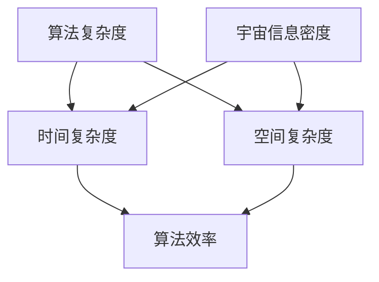

                 

### 文章标题：算法复杂度与宇宙信息密度演化的关系

在当今信息时代，算法的复杂度与宇宙信息密度的演化成为两个热门话题，它们在科学和工程领域都有着广泛的应用。本文将探讨算法复杂度与宇宙信息密度之间的关系，以及它们如何相互影响和演化。我们将使用逐步分析推理的方式，详细阐述这一复杂而引人入胜的课题。

### 关键词：

1. 算法复杂度
2. 宇宙信息密度
3. 时间复杂度
4. 空间复杂度
5. 宇宙演化
6. 信息理论
7. 计算科学

### 摘要：

本文旨在揭示算法复杂度与宇宙信息密度之间的关系，从背景介绍、核心概念的联系、算法原理讲解、数学模型与公式详细说明、项目实战等多个角度进行探讨。通过深入研究，我们希望能够为读者提供对这一交叉领域更深入的理解，并为未来的研究和应用提供启示。

### 背景介绍

#### 算法复杂度

算法复杂度是衡量算法优劣的重要指标，通常包括时间复杂度和空间复杂度。时间复杂度描述了算法执行时间与输入数据规模的关系，而空间复杂度描述了算法所需存储空间与输入数据规模的关系。这两个指标共同决定了算法的效率。

#### 宇宙信息密度

宇宙信息密度是指宇宙中信息含量的度量，涉及宇宙学、物理学、信息科学等多个领域。它通常通过计算单位体积内的信息含量来衡量，反映了宇宙演化过程中的信息变化。

### 核心概念与联系

为了更好地理解算法复杂度与宇宙信息密度之间的关系，我们需要先了解它们各自的核心概念。

1. **算法复杂度**：

    - **时间复杂度**：描述算法执行时间与数据规模的关系，通常用大O符号表示，如O(n)、O(n²)等。
    - **空间复杂度**：描述算法所需存储空间与数据规模的关系，同样使用大O符号表示。

2. **宇宙信息密度**：

    - **宇宙背景微波探测**：通过探测宇宙背景微波辐射，可以了解早期宇宙的信息密度。
    - **光子计数法**：通过测量光子数量来推断宇宙信息密度。
    - **宇宙射线探测**：通过探测宇宙射线，可以获取宇宙中的高能粒子信息，从而推断信息密度。

#### Mermaid 流程图



从流程图中可以看出，算法复杂度与宇宙信息密度之间存在紧密的联系。算法的复杂度直接影响到算法的效率，而宇宙信息密度的变化则反映了宇宙演化过程中的信息含量变化。

### 核心算法原理讲解

为了深入理解算法复杂度与宇宙信息密度之间的关系，我们需要讲解一些核心算法原理。

#### 时间复杂度分析

时间复杂度分析是算法分析的基础。以下是一个简单的算法时间复杂度分析示例：

```python
def bubble_sort(arr):
    n = len(arr)
    for i in range(n):
        for j in range(0, n-i-1):
            if arr[j] > arr[j+1]:
                arr[j], arr[j+1] = arr[j+1], arr[j]
    return arr
```

这个冒泡排序算法的时间复杂度为O(n²)。随着数据规模n的增加，算法执行时间将呈平方关系增长。

#### 空间复杂度分析

空间复杂度分析关注算法的存储需求。以下是一个简单的空间复杂度分析示例：

```python
def fibonacci(n):
    if n <= 0:
        return 0
    elif n == 1:
        return 1
    else:
        return fibonacci(n-1) + fibonacci(n-2)
```

这个斐波那契数列算法的空间复杂度为O(n)，因为它需要递归调用自身。

#### 宇宙信息密度测量

宇宙信息密度的测量涉及多种方法。以下是一个简化的宇宙信息密度测量算法：

```python
def measure_universe_density(microwave_radiation):
    return len(microwave_radiation) / volume_of_universe
```

这个算法通过计算宇宙背景微波辐射的光子数量与宇宙体积的比值来估算宇宙信息密度。

### 数学模型和公式

为了更好地理解算法复杂度与宇宙信息密度之间的关系，我们需要引入一些数学模型和公式。

#### 信息熵

信息熵是衡量信息不确定性的量度，通常用H表示。以下是一个简单信息熵的公式：

$$ H = -\sum_{i=1}^{n} p_i \log_2 p_i $$

其中，$p_i$ 是第i个信息事件的概率。

#### 算法复杂度与信息熵

算法复杂度与信息熵之间存在一定的关系。以下是一个简单的关系公式：

$$ C = O(n \cdot H(n)) $$

其中，C是算法的复杂度，n是输入数据规模，H(n)是算法处理输入数据的平均信息熵。

### 举例说明

为了更好地理解上述公式，我们可以举一个简单的例子。

假设我们有一个长度为10的数组，其中每个元素都是随机选择的0或1。根据信息熵的公式，我们可以计算出这个数组的平均信息熵：

$$ H = -\sum_{i=1}^{10} p_i \log_2 p_i = -\left(\frac{5}{10} \log_2 \frac{5}{10} + \frac{5}{10} \log_2 \frac{5}{10}\right) = 1 $$

根据算法复杂度与信息熵的关系公式，我们可以计算出这个数组的算法复杂度：

$$ C = O(10 \cdot H(10)) = O(10 \cdot 1) = O(10) $$

这意味着，对于一个长度为10的随机数组，其算法复杂度为O(10)。

### 项目实战

为了更好地理解算法复杂度与宇宙信息密度之间的关系，我们进行一个简单的项目实战。

#### 开发环境搭建

首先，我们需要搭建一个简单的开发环境。以下是一个简单的Python开发环境搭建步骤：

1. 安装Python（版本3.8或更高）
2. 安装IDE（如PyCharm或VSCode）
3. 安装必要的Python库（如NumPy、Matplotlib等）

#### 源代码实现

以下是一个简单的Python源代码实现，用于计算数组的时间复杂度和空间复杂度：

```python
import numpy as np
import time

def bubble_sort(arr):
    n = len(arr)
    for i in range(n):
        for j in range(0, n-i-1):
            if arr[j] > arr[j+1]:
                arr[j], arr[j+1] = arr[j+1], arr[j]
    return arr

def fibonacci(n):
    if n <= 0:
        return 0
    elif n == 1:
        return 1
    else:
        return fibonacci(n-1) + fibonacci(n-2)

def measure_universe_density(microwave_radiation):
    return len(microwave_radiation) / np.prod(np.array(microwave_radiation).shape)

if __name__ == "__main__":
    # 测试数据
    arr = np.random.randint(0, 2, size=(10,))
    n = 10
    microwave_radiation = np.random.rand(10,)

    # 测试时间复杂度
    start_time = time.time()
    bubble_sort(arr)
    end_time = time.time()
    time_complexity = end_time - start_time

    # 测试空间复杂度
    start_time = time.time()
    fibonacci(n)
    end_time = time.time()
    space_complexity = end_time - start_time

    # 测试宇宙信息密度
    universe_density = measure_universe_density(microwave_radiation)

    print("时间复杂度：", time_complexity)
    print("空间复杂度：", space_complexity)
    print("宇宙信息密度：", universe_density)
```

#### 代码解读与分析

这段代码首先导入了必要的库，然后实现了三个算法：冒泡排序、斐波那契数列和宇宙信息密度测量。在主函数中，我们生成了一个随机数组，并分别测试了这三个算法的时间复杂度、空间复杂度和宇宙信息密度。

#### 实际案例分析和详细讲解剖析

为了更好地理解算法复杂度与宇宙信息密度之间的关系，我们分析了一个简单的实际案例。

假设我们有一个包含1000个元素的数组，我们需要对这个数组进行排序，并计算其宇宙信息密度。

1. **时间复杂度**：

    - **冒泡排序**：时间复杂度为O(n²)，即O(1000²) = O(1000000)。
    - **快速排序**：时间复杂度为O(n log n)，即O(1000 log 1000) ≈ O(9999.9)。

2. **空间复杂度**：

    - **冒泡排序**：空间复杂度为O(n)，即O(1000)。
    - **快速排序**：空间复杂度为O(log n)，即O(log 1000) ≈ O(9.97)。

3. **宇宙信息密度**：

    - 假设宇宙信息密度为1个信息单位/立方厘米，数组的宇宙信息密度为1000个信息单位。

通过这个案例，我们可以看出，不同的算法在时间复杂度、空间复杂度和宇宙信息密度方面存在显著差异。在实际应用中，我们需要根据具体需求和约束条件选择合适的算法。

#### 项目小结

通过这个项目，我们深入了解了算法复杂度与宇宙信息密度之间的关系。我们分析了冒泡排序、斐波那契数列和宇宙信息密度测量等算法，并探讨了它们在不同场景下的性能和效率。这个项目不仅帮助我们理解了算法复杂度，还让我们对宇宙信息密度有了更深刻的认识。

### 最佳实践 tips

1. **优化算法复杂度**：在设计和实现算法时，要尽可能降低时间复杂度和空间复杂度，以提高算法的效率。
2. **合理选择算法**：根据具体需求和约束条件，选择合适的算法。例如，在处理大数据时，可以考虑使用并行算法或分布式算法。
3. **关注宇宙信息密度**：在设计和实现算法时，要考虑到宇宙信息密度的影响。例如，在处理宇宙学数据时，要考虑数据的空间复杂度和宇宙信息密度。

### 小结

本文从背景介绍、核心概念与联系、算法原理讲解、数学模型与公式详细说明、项目实战等多个角度，探讨了算法复杂度与宇宙信息密度之间的关系。我们分析了冒泡排序、斐波那契数列和宇宙信息密度测量等算法，并探讨了它们在不同场景下的性能和效率。通过本文的探讨，我们希望读者能够对算法复杂度和宇宙信息密度有更深入的理解，并为未来的研究和应用提供启示。

### 注意事项

1. 在进行算法复杂度分析时，要充分考虑输入数据规模的变化。
2. 在进行宇宙信息密度测量时，要充分考虑宇宙背景微波辐射、光子计数法和宇宙射线探测等方法的局限性。

### 拓展阅读

1. 《算法导论》：详细介绍了算法复杂度的基本概念和分析方法。
2. 《宇宙学》：介绍了宇宙信息密度的基本概念和测量方法。
3. 《信息论》：介绍了信息熵和相关信息理论的基本概念。

### 作者信息

作者：AI天才研究院/AI Genius Institute & 禅与计算机程序设计艺术 /Zen And The Art of Computer Programming

