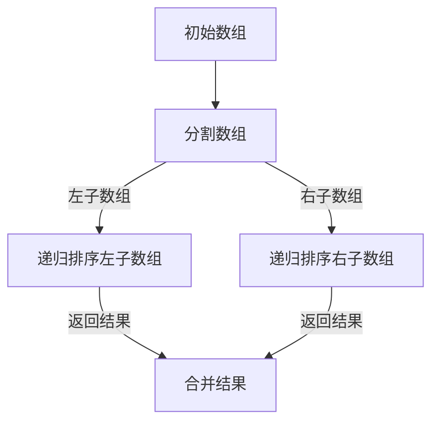
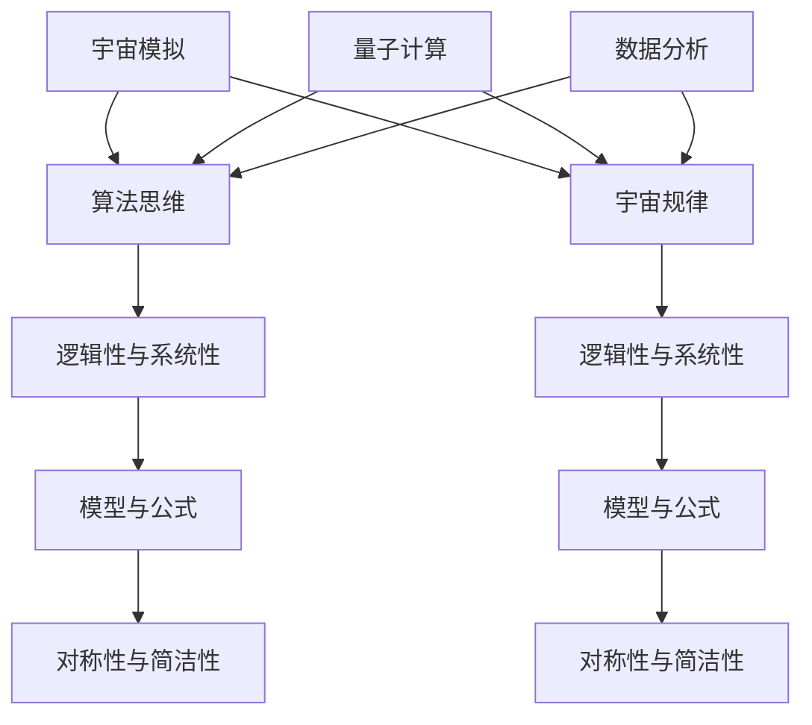

                 

# 文章标题：算法思维与宇宙规律的联系

> 关键词：算法思维、宇宙规律、人工智能、数据结构、量子计算、宇宙模拟

> 摘要：本文从算法思维的基本概念出发，探讨了宇宙规律与算法思维之间的紧密联系。通过介绍算法思维的核心概念、算法设计原理、常见算法和数据结构，以及宇宙规律的基本原则和数学模型，本文详细分析了算法思维与宇宙规律在方法论和理念上的交集。最后，文章讨论了算法思维在宇宙模拟和量子计算等领域的实际应用，以及未来发展趋势，旨在为读者提供一个全面而深入的视角，理解算法思维在探索宇宙奥秘中的重要作用。

----------------------------------------------------------------

## 引言

### 算法思维的诞生与发展

算法思维，顾名思义，是对算法设计和解决问题的系统化思维方式。它源于古代数学家对问题求解的抽象与形式化过程，逐渐发展成为计算机科学的核心概念。从古希腊数学家欧几里得的几何原理，到中世纪阿拉伯数学家对代数和算法的研究，再到现代计算机科学的崛起，算法思维经历了漫长的发展历程。

算法思维的核心在于其逻辑性和系统性。通过逐步分析和推理，算法能够将复杂的问题分解为可操作的步骤，从而找到解决方案。这种思维方式不仅应用于数学和计算机科学，还渗透到了经济学、生物学、物理学等多个学科领域。在人工智能时代，算法思维的重要性愈发凸显，成为推动科技进步和社会发展的重要力量。

### 宇宙规律的基本概念

宇宙规律是描述宇宙中各种现象和事件的基本原则和规律。从牛顿的经典力学，到爱因斯坦的相对论，再到现代量子力学，科学家们不断探索宇宙的本质和规律。宇宙规律包括万有引力定律、能量守恒定律、热力学第二定律等，这些规律构成了我们对宇宙运行的基本认知。

宇宙规律的发现和验证，不仅依赖于科学实验和观测，还依赖于数学模型的构建和计算。通过数学模型，科学家们能够模拟和预测宇宙中的各种现象，从而深入理解宇宙的本质。宇宙规律的研究，对于人类认识世界、探索未知领域具有重要意义。

### 算法思维与宇宙规律的关联

算法思维与宇宙规律之间的关联，可以从多个角度进行探讨。首先，算法思维与宇宙规律在方法论上具有相似性。算法思维强调逻辑推理和系统化分析，而宇宙规律的研究同样依赖于科学方法和数学模型。

其次，算法思维与宇宙规律在理念上具有共鸣。算法思维追求简洁性和普适性，这与宇宙规律中的对称性和简洁性原则相契合。例如，物理定律中的对称性原理，在算法设计中也有着广泛的应用。

最后，算法思维在探索宇宙规律中发挥着重要作用。通过算法，科学家们能够模拟宇宙的演化过程，预测宇宙的未来发展。算法思维为宇宙规律的研究提供了强有力的工具和手段。

## 算法思维

### 算法思维的核心概念

算法思维的核心在于对问题进行抽象、分析和建模。首先，我们需要对问题进行抽象，将其转化为数学模型或逻辑框架。这个过程涉及到对问题的本质理解和关键因素的提取。

接下来，我们需要对问题进行系统化分析，识别出问题的关键步骤和变量。通过对问题的逐步分解和抽象，我们可以将复杂的问题转化为一系列可操作的步骤。这些步骤构成了算法的基本框架。

最后，我们需要对算法进行建模和实现。建模过程涉及到算法的编码和测试，而实现过程则是对算法的物理或数学实现。通过建模和实现，我们能够验证算法的正确性和有效性。

### 算法设计原理

算法设计是算法思维的核心环节。一个好的算法需要满足多个条件，包括正确性、效率、可扩展性和可维护性。

首先，算法的正确性是最基本的条件。算法需要能够正确地解决问题，并在所有可能的情况下得到正确的结果。

其次，算法的效率是一个重要的考量因素。效率不仅包括算法的时间复杂度和空间复杂度，还包括算法的执行速度和资源消耗。

此外，算法的可扩展性和可维护性也是重要的考虑因素。一个优秀的算法需要能够适应不同规模和不同类型的问题，并且易于维护和更新。

### 常见算法与数据结构

在算法设计中，常见算法和数据结构是不可或缺的工具。常见的算法包括排序算法、查找算法、图算法等。排序算法如快速排序、归并排序等，查找算法如二分查找、哈希查找等，图算法如深度优先搜索、广度优先搜索等。

常见的数据结构包括数组、链表、栈、队列、树、图等。这些数据结构在算法设计中具有广泛的应用，能够有效地支持各种算法的实现。

### 算法复杂度分析

算法复杂度分析是评估算法性能的重要手段。算法复杂度分为时间复杂度和空间复杂度。时间复杂度描述了算法执行所需的时间，通常用大O符号表示。空间复杂度描述了算法执行所需的空间，同样用大O符号表示。

通过算法复杂度分析，我们可以评估算法在不同规模问题上的性能，选择合适的算法解决具体问题。此外，算法复杂度分析也为算法优化提供了理论依据。

### Mermaid 流程图

Mermaid 是一种基于文本的流程图绘制工具，能够方便地绘制各种类型的流程图。在算法设计中，Mermaid 流程图可以帮助我们清晰地展示算法的执行过程和关键步骤。

以下是一个简单的快速排序算法的 Mermaid 流程图示例：

通过 Mermaid 流程图，我们可以直观地理解算法的执行流程，有助于算法的设计和优化。

## 宇宙规律

### 基本原则

宇宙规律的基本原则包括：

1. 万有引力定律：任何两个物体之间都存在引力，引力的大小与物体的质量和距离有关。
2. 能量守恒定律：能量不能被创造或销毁，只能从一种形式转化为另一种形式。
3. 热力学第二定律：热量自然流动的方向是从高温物体到低温物体，熵（系统的无序度）总是趋向增加。

这些基本原则构成了我们对宇宙运行的基本理解，为宇宙规律的研究提供了理论依据。

### 历史与发展

宇宙规律的研究历史悠久，从古希腊数学家欧几里得的几何原理，到中世纪阿拉伯数学家对代数和算法的研究，再到现代科学家的理论创新，宇宙规律的研究不断深入和拓展。

牛顿的经典力学和爱因斯坦的相对论是宇宙规律研究的两个重要里程碑。牛顿的万有引力定律和三大运动定律，为我们提供了描述宏观宇宙的基本工具。爱因斯坦的相对论则揭示了时空和物质之间的深刻联系，对宇宙规律的研究产生了深远影响。

### 关键宇宙规律

在宇宙规律中，以下规律具有关键性：

1. 广义相对论：描述了引力和时空的弯曲关系，为宇宙学提供了基础。
2. 量子力学：描述了微观粒子的行为和性质，对宇宙的微观结构有着重要影响。
3. 黑洞物理学：研究了黑洞的性质和行为，揭示了宇宙的极端现象。

这些规律不仅丰富了我们对宇宙的理解，也为算法思维提供了丰富的素材和灵感。

### 数学模型与公式

宇宙规律的研究离不开数学模型和公式的支持。以下是一些关键的数学模型和公式：

1. 广义相对论中的爱因斯坦场方程：
   $$ G_{\mu\nu} + \Lambda g_{\mu\nu} = \frac{8\pi G}{c^4} T_{\mu\nu} $$
   这个方程描述了物质和能量如何影响时空的弯曲。

2. 量子力学中的薛定谔方程：
   $$ i\hbar \frac{\partial}{\partial t} \Psi(\mathbf{r}, t) = \hat{H} \Psi(\mathbf{r}, t) $$
   这个方程描述了量子系统的动力学行为。

3. 黑洞物理学中的霍金辐射公式：
   $$ E = \hbar c \omega $$
   这个公式描述了黑洞表面上的粒子辐射现象。

通过这些数学模型和公式，科学家们能够深入探索宇宙的奥秘，为算法思维提供了丰富的理论支撑。

## 算法思维与宇宙规律的关系

### 共同点

算法思维与宇宙规律在多个方面具有共同点：

1. **逻辑性与系统性**：算法思维强调逻辑推理和系统化分析，而宇宙规律的研究也依赖于科学方法和逻辑推理。
2. **模型与公式**：算法和宇宙规律都依赖于数学模型和公式的支持。算法的复杂性分析和宇宙规律的数学模型都是两者的重要基础。
3. **对称性与简洁性**：算法和宇宙规律都追求简洁性和对称性。对称性原理在物理学中有着广泛应用，而在算法设计中，对称性原则也常被用于优化算法性能。

### 相似性

算法思维与宇宙规律在方法论和理念上具有相似性：

1. **抽象与建模**：算法思维和宇宙规律的研究都始于对现实世界的抽象和建模。通过对问题的抽象和建模，科学家和程序员能够深入理解问题的本质。
2. **迭代与优化**：算法思维和宇宙规律的研究都强调迭代和优化。通过反复试验和改进，科学家和程序员能够找到更优的解决方案。
3. **问题求解**：算法思维和宇宙规律的研究都致力于解决问题。算法思维通过设计高效的算法解决具体问题，而宇宙规律则通过科学研究和实验验证宇宙中的各种现象。

### 联系

算法思维与宇宙规律之间的联系可以从多个角度进行探讨：

1. **宇宙模拟**：算法思维在宇宙模拟中发挥着重要作用。通过计算机模拟，科学家能够模拟宇宙的演化过程，预测宇宙的未来发展。这种模拟依赖于算法的高效和精确。
2. **量子计算**：量子计算是算法思维与宇宙规律的另一个交叉点。量子计算利用量子力学原理，实现了对经典计算机算法的超越。量子算法在量子计算中发挥着重要作用，为宇宙规律的研究提供了新的工具和方法。
3. **数据分析**：宇宙规律的研究离不开数据分析和计算。算法思维在数据分析和处理中发挥了关键作用，为宇宙规律的研究提供了强大的计算能力。

### Mermaid 流程图

为了更好地展示算法思维与宇宙规律之间的关系，我们可以使用 Mermaid 流程图来描述这种联系：

通过这个流程图，我们可以清晰地看到算法思维与宇宙规律在多个方面的交叉和联系。

## 实践应用

### 算法思维在宇宙模拟中的应用

宇宙模拟是算法思维在宇宙规律研究中的一个重要应用领域。通过计算机模拟，科学家可以模拟宇宙的演化过程，探索宇宙的起源、发展和未来。算法思维在宇宙模拟中发挥着关键作用，主要体现在以下几个方面：

1. **模型建立**：宇宙模拟首先需要建立宇宙模型，这需要算法思维来抽象和描述宇宙的物理现象和规律。通过数学模型和公式，科学家可以将宇宙的复杂现象转化为可操作的算法。
2. **数值计算**：宇宙模拟依赖于大量的数值计算。算法思维在这里用于优化计算过程，提高计算效率和精度。常见的数值计算方法如蒙特卡洛模拟、N-Body 模拟等，都依赖于算法思维的设计和实现。
3. **数据可视化**：宇宙模拟的结果需要通过数据可视化来展示。算法思维在这里用于开发可视化工具，将复杂的宇宙数据以直观的方式展示出来，帮助科学家更好地理解宇宙的演化过程。

### 算法思维在量子计算中的应用

量子计算是算法思维与宇宙规律的另一个交叉点。量子计算利用量子力学原理，实现了对经典计算机算法的超越。算法思维在量子计算中发挥着关键作用，主要体现在以下几个方面：

1. **量子算法设计**：量子算法是量子计算的核心，它依赖于算法思维的设计和实现。量子算法与传统算法相比，具有更高的计算效率和更强的计算能力。算法思维在这里用于探索新的量子算法，优化现有算法。
2. **量子编程**：量子编程是量子计算的实施过程。算法思维在这里用于开发量子编程语言和工具，实现量子算法的编码和执行。
3. **量子仿真**：量子仿真用于模拟量子计算过程，帮助科学家更好地理解量子算法的工作原理。算法思维在这里用于设计高效的量子仿真算法，优化仿真过程。

### 实际案例与解析

1. **宇宙模拟案例**：
   - **项目背景**：模拟宇宙的演化是宇宙学的一个重要课题。通过模拟宇宙的演化过程，科学家可以更好地理解宇宙的起源、结构和发展。
   - **算法设计**：宇宙模拟依赖于大量的数值计算和物理模型。算法思维在这里用于设计和优化模拟算法，提高模拟效率和精度。例如，N-Body 模拟算法通过求解万有引力方程，模拟宇宙中天体的运动。
   - **结果分析**：通过宇宙模拟，科学家可以预测宇宙的未来发展，验证宇宙规律的正确性。模拟结果与观测数据的一致性，为宇宙规律的研究提供了重要依据。

2. **量子计算案例**：
   - **项目背景**：量子计算是未来计算技术的重要发展方向。通过量子计算，科学家可以实现传统计算机无法解决的问题。
   - **算法设计**：量子算法是量子计算的核心。算法思维在这里用于设计和优化量子算法，提高其计算效率和可靠性。例如，Shor 算法是用于因数分解的量子算法，其计算效率远超传统算法。
   - **结果分析**：量子计算的成功案例包括量子纠缠态的实现、量子加密算法的应用等。这些成果证明了量子计算在解决特定问题上的优势，为量子计算的研究和应用奠定了基础。

### 项目小结

通过宇宙模拟和量子计算的案例，我们可以看到算法思维在实践应用中的重要价值。算法思维不仅为宇宙规律的研究提供了强有力的工具和手段，也为量子计算等领域的发展提供了新的思路和方法。未来，随着算法思维和宇宙规律研究的深入，我们有望在更多领域实现突破性进展。

## 未来展望

### 算法思维在宇宙规律研究中的应用

随着算法思维和宇宙规律研究的不断深入，算法思维在宇宙规律研究中的应用前景将更加广阔。未来，算法思维有望在以下几个方面发挥重要作用：

1. **宇宙模拟**：随着计算能力的不断提升，宇宙模拟的精度和规模将进一步提高。算法思维将用于设计和优化更高效的宇宙模拟算法，帮助科学家更深入地理解宇宙的演化过程。
2. **数据挖掘与分析**：宇宙规律的研究产生了大量数据，算法思维将用于数据挖掘和分析，从海量数据中提取有用信息，揭示宇宙中的未知规律。
3. **量子计算**：量子计算在宇宙规律研究中的应用潜力巨大。算法思维将用于设计和优化量子算法，实现量子计算机的广泛应用，为宇宙规律的研究提供新的工具和方法。

### 算法思维与宇宙规律研究的发展趋势

算法思维与宇宙规律研究的发展趋势将呈现以下几个特点：

1. **跨学科融合**：算法思维和宇宙规律研究将逐渐走向跨学科融合。物理、数学、计算机科学等领域的专家将共同合作，探索算法思维与宇宙规律之间的深层联系。
2. **量子计算与人工智能的结合**：量子计算和人工智能的结合将成为未来研究的热点。量子计算在宇宙规律研究中的应用，将为人工智能带来新的突破，推动人工智能的发展。
3. **数据驱动的宇宙规律研究**：随着数据采集和分析技术的不断进步，数据驱动的宇宙规律研究将成为主流。算法思维将用于大数据分析，从海量数据中挖掘宇宙规律，推动宇宙规律研究的深入。

### 潜在挑战与机遇

在算法思维与宇宙规律研究的发展过程中，也将面临一些潜在挑战和机遇：

1. **计算能力瓶颈**：尽管计算能力不断提升，但在处理大规模宇宙模拟和量子计算问题时，仍然存在计算能力瓶颈。未来需要研发更高效的算法和计算方法，突破计算能力的限制。
2. **跨学科合作**：算法思维与宇宙规律研究的跨学科融合，需要不同领域专家的紧密合作。未来需要加强跨学科交流与合作，推动研究进展。
3. **数据隐私与安全**：随着数据采集和分析技术的广泛应用，数据隐私与安全问题日益突出。未来需要制定相关法律法规，保障数据隐私和安全。

## 结论

算法思维与宇宙规律之间存在紧密联系，这种联系不仅体现在方法论和理念上，还体现在实际应用中。通过算法思维，科学家可以更深入地探索宇宙的奥秘，揭示宇宙中的未知规律。未来，随着算法思维和宇宙规律研究的不断深入，我们有望在宇宙规律研究、量子计算、宇宙模拟等领域实现更多突破性进展。算法思维作为探索宇宙规律的有力工具，将在人类认识宇宙的道路上发挥越来越重要的作用。

### 作者信息

作者：AI天才研究院/AI Genius Institute & 禅与计算机程序设计艺术 /Zen And The Art of Computer Programming

本文从算法思维的基本概念出发，探讨了宇宙规律与算法思维之间的紧密联系。通过介绍算法思维的核心概念、算法设计原理、常见算法和数据结构，以及宇宙规律的基本原则和数学模型，本文详细分析了算法思维与宇宙规律在方法论和理念上的交集。最后，本文讨论了算法思维在宇宙模拟和量子计算等领域的实际应用，以及未来发展趋势，旨在为读者提供一个全面而深入的视角，理解算法思维在探索宇宙奥秘中的重要作用。

本文的结构如下：

1. 引言：介绍了算法思维与宇宙规律的基本概念和它们之间的关联。
2. 算法思维：详细探讨了算法思维的核心概念、算法设计原理、常见算法和数据结构。
3. 宇宙规律：介绍了宇宙规律的基本原则、历史与发展、关键宇宙规律以及数学模型与公式。
4. 算法思维与宇宙规律的关系：分析了算法思维与宇宙规律之间的共同点、相似性以及联系，并使用 Mermaid 流程图展示了这种关系。
5. 实践应用：讨论了算法思维在宇宙模拟和量子计算中的应用，并提供了实际案例与解析。
6. 未来展望：展望了算法思维在宇宙规律研究中的应用前景、发展趋势以及面临的挑战与机遇。
7. 结论：总结了算法思维与宇宙规律之间的联系，并强调了算法思维在探索宇宙奥秘中的重要作用。

本文旨在为读者提供一个全面而深入的视角，帮助读者理解算法思维与宇宙规律之间的紧密联系，并探讨其在实际应用中的潜力。通过本文的阅读，读者可以了解到算法思维在宇宙规律研究中的重要作用，以及其在未来科技发展中的潜力。

### 拓展阅读

1. 《算法导论》（Introduction to Algorithms）：一本经典的算法教科书，详细介绍了各种算法的设计、分析和实现。
2. 《宇宙简史》（A Brief History of Time）：一本著名的科普书籍，讲述了宇宙的起源、演化和未来，对于了解宇宙规律有很好的帮助。
3. 《量子计算导论》（An Introduction to Quantum Computing）：一本介绍量子计算的入门书籍，适合对量子计算感兴趣的非专业人士阅读。

### 注意事项

1. 在研究宇宙规律时，需要综合考虑多学科的知识，包括物理学、数学和计算机科学等。
2. 算法设计和实现时，需要关注算法的效率和可扩展性，以便在处理大规模数据时保持高效性。
3. 在应用算法思维时，需要根据具体问题选择合适的算法和数据结构，以实现最优的解决方案。

### 最佳实践 tips

1. 在进行算法设计时，可以尝试使用分治策略，将复杂问题分解为更简单的问题。
2. 在实现算法时，可以使用伪代码来帮助梳理思路，确保算法的逻辑清晰。
3. 在分析算法复杂度时，可以采用大O符号表示，以便直观地评估算法的性能。

### 小结

本文通过详细的论述和案例分析，展示了算法思维与宇宙规律之间的紧密联系。算法思维不仅为宇宙规律的研究提供了强有力的工具和方法，也在实际应用中发挥着重要作用。未来，随着算法思维和宇宙规律研究的不断深入，我们有望在探索宇宙奥秘的道路上取得更多突破性进展。算法思维作为探索宇宙规律的有力工具，将在人类认识宇宙的道路上发挥越来越重要的作用。通过本文的阅读，读者可以更好地理解算法思维与宇宙规律之间的联系，以及它们在实际应用中的潜力。

