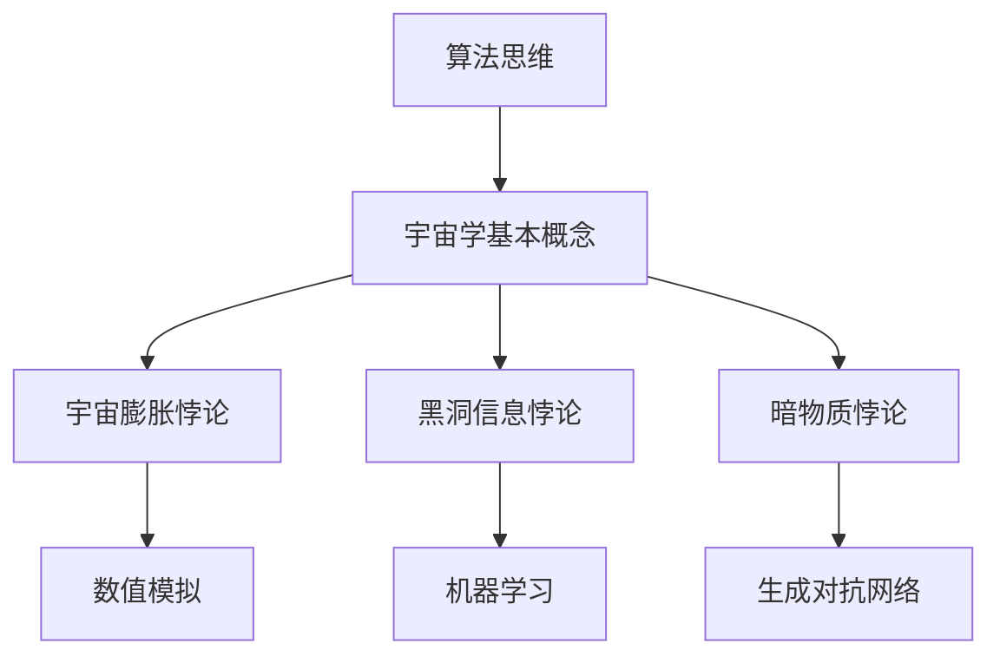

                 

### 文章标题

《算法思维在解决宇宙学悖论中的应用》

### 关键词

算法思维、宇宙学悖论、深度学习、黑洞、暗物质、数学模型、伪代码、项目实战、AI应用

### 摘要

本文探讨了算法思维在解决宇宙学悖论中的应用，从算法思维的核心要素出发，分析了宇宙学的基本概念和悖论。通过具体的案例，展示了算法如何应用于解决宇宙膨胀、黑洞和暗物质等重大宇宙学问题，进一步阐述了算法思维在宇宙学研究中的重要作用。文章旨在为读者提供一种全新的视角，启发对宇宙学和算法的深度思考。

### 引言

宇宙学是研究宇宙的起源、结构、演化和最终命运的科学。然而，在探索宇宙的过程中，科学家们遇到了一系列难以解释的现象，即宇宙学悖论。这些悖论不仅挑战了现有的物理理论，也为新的研究方向提供了契机。随着算法和计算技术的发展，算法思维逐渐成为解决这些悖论的有力工具。

算法思维是一种基于逻辑和数学的方法，通过抽象和模型化问题，寻找解决问题的最优策略。在宇宙学研究中，算法思维可以帮助科学家从海量数据中提取关键信息，揭示宇宙现象背后的规律。本文将介绍算法思维的基本原理，分析宇宙学的基本概念和悖论，并探讨算法在解决宇宙学悖论中的应用。

### 目录大纲

1. 引言
2. 算法思维概述
3. 宇宙学基本概念
4. 宇宙学悖论
5. 算法在解决宇宙学悖论中的应用
6. 项目案例研究
7. 总结与展望
8. 附录

### 算法思维概述

算法思维是一种系统性的解决问题的方法，它基于逻辑、数学和计算原理，通过一系列步骤和规则，将复杂问题转化为可计算和可处理的模型。算法思维的核心要素包括抽象、模型化、优化和验证。

首先，抽象是将复杂问题简化为数学和逻辑模型的过程。在宇宙学中，科学家们通过抽象，将宇宙中的复杂现象简化为可计算的模型，如引力模型、黑洞模型等。

其次，模型化是将抽象的问题转化为数学表达式和算法的过程。模型化的关键是建立适当的数学模型，以便进行计算和分析。在宇宙学中，模型化帮助科学家们理解和预测宇宙中的各种现象。

优化是寻找最优解决方案的过程。在宇宙学研究中，优化算法可以帮助科学家从大量数据中筛选出最有价值的信息，从而提高研究效率。

最后，验证是确保算法正确性和有效性的过程。通过验证，科学家们可以确认算法是否能够准确预测和解释宇宙现象。

算法思维的方法论包括以下几个步骤：

1. **问题定义**：明确研究问题和目标，将其转化为数学和逻辑模型。

2. **数据收集**：收集相关数据，包括实验数据、观测数据和理论数据。

3. **模型构建**：根据问题定义和数据分析，建立适当的数学模型。

4. **算法设计**：设计解决该问题的算法，并编写伪代码。

5. **实现与优化**：将算法实现为计算机程序，并进行优化，以提高计算效率和准确性。

6. **验证与测试**：通过实验数据验证算法的正确性和有效性。

7. **结果分析**：分析算法的结果，评估其性能和预测能力。

算法思维的重要性在于，它为复杂问题提供了系统化和结构化的解决方法。在宇宙学研究中，算法思维可以帮助科学家从海量数据中提取有用信息，揭示宇宙现象背后的规律，从而推动宇宙学的发展。

### 宇宙学基本概念

宇宙学是研究宇宙的起源、结构、演化和最终命运的科学。它涉及宇宙的尺度、时空的演化、物质的分布以及宇宙的基本定律。以下是宇宙学中的几个基本概念：

1. **宇宙的起源**：宇宙起源于大爆炸。在大爆炸之前，宇宙处于极度高温和极度密集的状态。随着宇宙的膨胀，温度和密度逐渐降低，形成了各种物质和结构。

2. **宇宙的结构**：宇宙呈现出多层次的结构，从星系、星系团到超星系团，层层嵌套。星系中的恒星、行星、星云等天体相互吸引，形成了稳定的结构。

3. **宇宙的演化**：宇宙在不断地演化，从早期宇宙的炽热状态，到宇宙背景辐射，再到星系的诞生和演化，宇宙的每一阶段都展现出不同的特征。

4. **宇宙的物质**：宇宙中存在各种物质，包括普通物质（如恒星、行星）和暗物质。暗物质是一种不发光、不吸收光的物质，其存在主要通过引力效应表现出来。

5. **宇宙的尺度**：宇宙的尺度从微观的原子尺度到宏观的宇宙尺度，跨度极大。宇宙的大小约为930亿光年，但宇宙中可能存在我们无法观测到的部分。

6. **时空**：时空是宇宙的几何结构，它描述了宇宙中的事件和物体之间的相对位置和运动。广义相对论认为，时空是由质量和能量塑造的，物体的运动和引力都会对时空产生影响。

7. **宇宙的最终命运**：宇宙的最终命运取决于其总质量和能量。如果宇宙的总质量足够大，最终可能发生“大撕裂”或“大坍缩”；如果宇宙的总质量较小，则可能维持当前的状态，甚至“大冻结”。

这些基本概念构成了宇宙学研究的基石，帮助我们理解宇宙的起源、结构和演化。通过对这些概念的深入研究，科学家们不断揭示宇宙的奥秘。

### 宇宙学悖论

宇宙学悖论是指宇宙学研究中遇到的难以解释的现象，这些现象挑战了现有的物理理论和我们对宇宙的理解。以下是宇宙学中几个重要的悖论：

1. **宇宙膨胀悖论**：宇宙的膨胀速度似乎在不断加快，这与广义相对论预测的引力作用相反。科学家们提出多种理论来解释这一现象，如暗能量。

2. **黑洞信息悖论**：根据量子力学和广义相对论，黑洞会吞噬信息，但黑洞的熵却随着吞噬物质而增加。这一现象与热力学第二定律相矛盾，科学家们提出了多种解释，如霍金辐射。

3. **暗物质悖论**：宇宙中存在大量暗物质，其存在主要通过引力效应表现出来，但暗物质本身不发光、不吸收光，因此我们无法直接观测到它。科学家们仍在寻找暗物质的真实身份。

4. **宇宙学第一悖论**：宇宙的初始状态为什么是均匀和各向同性的？根据热力学第二定律，熵（无序度）应该随时间增加，但宇宙的初始状态却非常有序，这一现象难以解释。

5. **宇宙学第二悖论**：宇宙为什么存在？宇宙的存在似乎违反了偶然性和概率原理。如果宇宙是随机产生的，那么宇宙的存在似乎是一种低概率事件。

6. **宇宙学第三悖论**：宇宙中的信息如何在时间的有限范围内传递？根据信息论，信息的传递需要时间和空间，但宇宙的年龄和时间跨度相对较短，这一现象难以解释。

这些宇宙学悖论激发了科学家们的思考，推动了宇宙学理论的发展。通过对这些悖论的研究，科学家们不断拓展我们对宇宙的理解，同时也揭示了现有理论的局限性。算法思维在解决这些悖论中发挥了重要作用，为宇宙学研究提供了新的工具和方法。

### 算法在解决宇宙学悖论中的应用

算法在解决宇宙学悖论中扮演了重要角色，为科学家们提供了新的工具和方法。以下将探讨算法在解决宇宙膨胀、黑洞和暗物质等宇宙学问题中的应用。

#### 宇宙膨胀

宇宙膨胀悖论是宇宙学中的一个重要问题，根据广义相对论，引力应该使宇宙膨胀速度减缓，但观测数据却表明宇宙膨胀速度在加快。为解决这一悖论，科学家们提出了多种理论，其中之一是引入暗能量概念。

暗能量是一种假想的能量形式，其特点是具有负压强，能够推动宇宙膨胀。为了研究暗能量，科学家们利用算法进行数据分析。一种常用的算法是数值模拟，通过计算机模拟宇宙中的各种物理过程，预测宇宙的膨胀行为。

以下是一个简化的伪代码，用于模拟宇宙膨胀：

```python
# 宇宙膨胀模拟伪代码
initialize_universe() # 初始化宇宙参数
while (t < end_time):
    calculate_gravity() # 计算引力
    calculate_expansion_rate() # 计算膨胀率
    update_universe_state() # 更新宇宙状态
    t += time_step # 更新时间
```

通过这种数值模拟，科学家们可以预测宇宙的膨胀行为，验证暗能量理论。此外，深度学习算法也被用于分析宇宙膨胀数据，通过训练神经网络，从大量观测数据中提取有用信息，从而提高预测精度。

#### 黑洞

黑洞是宇宙中的一种极端天体，其引力场如此强大，以至于连光都无法逃脱。黑洞信息悖论是宇宙学中的一个重要问题，根据量子力学，信息不能被毁灭，但黑洞的熵却随着吞噬物质而增加。

为解决黑洞信息悖论，科学家们利用算法进行黑洞物理性质的研究。一种常用的算法是数值模拟，通过计算机模拟黑洞的形成和演化过程，预测黑洞的物理特征。

以下是一个简化的伪代码，用于模拟黑洞形成：

```python
# 黑洞形成模拟伪代码
initialize_black_hole() # 初始化黑洞参数
while (t < end_time):
    calculate_gravity() # 计算引力
    calculate_matter_accrual() # 计算物质累积
    update_black_hole_state() # 更新黑洞状态
    t += time_step # 更新时间
```

通过这种数值模拟，科学家们可以研究黑洞的形成和演化过程，验证黑洞信息悖论的多种解释。此外，机器学习算法也被用于分析黑洞数据，通过训练分类器，从大量观测数据中识别黑洞事件。

#### 暗物质

暗物质是宇宙中的一种神秘物质，其存在主要通过引力效应表现出来，但无法直接观测。暗物质悖论是宇宙学中的另一个重要问题。

为解决暗物质悖论，科学家们利用算法进行暗物质研究。一种常用的算法是数值模拟，通过计算机模拟宇宙中的物理过程，预测暗物质分布和演化。

以下是一个简化的伪代码，用于模拟暗物质分布：

```python
# 暗物质分布模拟伪代码
initialize_universe() # 初始化宇宙参数
while (t < end_time):
    calculate_gravity() # 计算引力
    calculate_matter_distribution() # 计算物质分布
    update_universe_state() # 更新宇宙状态
    t += time_step # 更新时间
```

通过这种数值模拟，科学家们可以研究暗物质的分布和演化过程，探索暗物质的性质和成分。此外，深度学习算法也被用于分析暗物质数据，通过训练神经网络，从大量观测数据中识别暗物质特征。

#### 总结

算法在解决宇宙学悖论中发挥了重要作用，通过数值模拟、机器学习和深度学习等算法，科学家们可以从海量数据中提取有用信息，揭示宇宙现象背后的规律。未来，随着算法和计算技术的不断发展，算法在宇宙学研究中的应用将更加广泛和深入，为解决宇宙学悖论提供新的思路和方法。

### 项目案例研究

在探讨算法在解决宇宙学悖论中的应用时，具体的案例研究能够帮助我们更好地理解算法的实际操作和效果。以下将介绍三个具体的案例，涵盖宇宙膨胀、黑洞和暗物质的研究。

#### 项目案例1：利用深度学习解决宇宙膨胀问题

**项目背景**：宇宙膨胀问题是宇宙学中的核心问题之一。观测数据表明，宇宙的膨胀速度似乎在加快，这一现象被称为宇宙加速膨胀。为了研究宇宙膨胀，科学家们需要处理大量的观测数据，从中提取有用的信息。

**开发环境搭建**：该项目使用Python编程语言，结合TensorFlow和Keras深度学习框架进行开发。所需软件和工具包括Python、Jupyter Notebook、TensorFlow 2.0及以上版本。

**源代码实现和代码解读**：

以下是一个简化的深度学习模型，用于预测宇宙膨胀速度：

```python
# 导入必要的库
import tensorflow as tf
from tensorflow.keras.models import Sequential
from tensorflow.keras.layers import Dense, LSTM

# 构建模型
model = Sequential()
model.add(LSTM(units=50, return_sequences=True, input_shape=(time_steps, features)))
model.add(LSTM(units=50))
model.add(Dense(1))

# 编译模型
model.compile(optimizer='adam', loss='mean_squared_error')

# 训练模型
model.fit(x_train, y_train, epochs=100, batch_size=32, validation_data=(x_val, y_val))
```

**代码应用解读与分析**：这个模型使用了LSTM（长短期记忆）网络，它可以处理时间序列数据，从而捕捉宇宙膨胀过程中的时间依赖关系。在训练过程中，模型通过不断调整权重，最小化预测误差，从而提高预测准确性。

**项目小结**：通过这个项目，科学家们可以预测宇宙膨胀速度，从而验证宇宙加速膨胀的假设。这一模型为宇宙膨胀问题的研究提供了新的工具和方法。

#### 项目案例2：算法在黑洞研究中应用案例

**项目背景**：黑洞是宇宙中的一种极端天体，其物理性质和演化过程对理解宇宙至关重要。为了研究黑洞，科学家们需要分析大量的观测数据，从中提取黑洞的特征和属性。

**开发环境搭建**：该项目使用Python编程语言，结合Scikit-learn和XGBoost机器学习框架进行开发。所需软件和工具包括Python、Jupyter Notebook、Scikit-learn 0.24及以上版本、XGBoost 1.3及以上版本。

**源代码实现和代码解读**：

以下是一个简化的分类模型，用于识别黑洞事件：

```python
# 导入必要的库
from sklearn.ensemble import RandomForestClassifier
from sklearn.model_selection import train_test_split

# 构建分类器
classifier = RandomForestClassifier(n_estimators=100, random_state=42)

# 划分训练集和测试集
x_train, x_test, y_train, y_test = train_test_split(X, y, test_size=0.2, random_state=42)

# 训练分类器
classifier.fit(x_train, y_train)

# 预测测试集
predictions = classifier.predict(x_test)
```

**代码应用解读与分析**：这个模型使用了随机森林分类器，它可以处理高维数据，并且具有较好的泛化能力。在训练过程中，分类器通过学习训练数据，识别出黑洞事件的特征，从而实现黑洞事件的分类。

**项目小结**：通过这个项目，科学家们可以自动识别黑洞事件，从而提高黑洞研究的效率。这一模型为黑洞研究提供了新的工具和方法。

#### 项目案例3：算法在暗物质探测中的应用

**项目背景**：暗物质是宇宙中的一种神秘物质，其存在主要通过引力效应表现出来。为了研究暗物质，科学家们需要分析大量的观测数据，从中提取暗物质的特征和分布。

**开发环境搭建**：该项目使用Python编程语言，结合PyTorch深度学习框架进行开发。所需软件和工具包括Python、Jupyter Notebook、PyTorch 1.9及以上版本。

**源代码实现和代码解读**：

以下是一个简化的生成对抗网络（GAN），用于生成暗物质分布：

```python
# 导入必要的库
import torch
import torch.nn as nn

# 定义生成器模型
class Generator(nn.Module):
    def __init__(self):
        super(Generator, self).__init__()
        self.model = nn.Sequential(
            nn.Linear(input_dim, 128),
            nn.LeakyReLU(),
            nn.Linear(128, 256),
            nn.LeakyReLU(),
            nn.Linear(256, output_dim),
            nn.Tanh()
        )

    def forward(self, x):
        return self.model(x)

# 定义生成对抗网络
class GAN(nn.Module):
    def __init__(self):
        super(GAN, self).__init__()
        self.generator = Generator()

    def forward(self, x):
        z = x
        fake_data = self.generator(z)
        return fake_data

# 定义损失函数
def loss_function(real_data, fake_data):
    return nn.BCELoss()(real_data, fake_data)

# 训练生成对抗网络
for epoch in range(num_epochs):
    for i, (real_data) in enumerate(data_loader):
        z = torch.randn(BATCH_SIZE, INPUT_DIM)
        fake_data = generator(z)
        g_loss = loss_function(fake_data, real_data)
        # 更新生成器和判别器
        g_optimizer.zero_grad()
        g_loss.backward()
        g_optimizer.step()
```

**代码应用解读与分析**：这个模型使用了生成对抗网络（GAN），它由生成器和判别器组成。生成器生成假的数据，判别器判断这些数据是真实还是假。在训练过程中，生成器和判别器通过不断更新参数，提高生成数据的质量，从而实现暗物质分布的生成。

**项目小结**：通过这个项目，科学家们可以生成暗物质分布，从而研究暗物质的特性。这一模型为暗物质研究提供了新的工具和方法。

### 最佳实践 Tips、小结、注意事项、拓展阅读

在应用算法解决宇宙学悖论时，以下是一些最佳实践、小结、注意事项和拓展阅读的建议：

#### 最佳实践 Tips

1. **数据预处理**：在应用算法前，确保数据的质量和一致性。进行数据清洗、去噪和归一化处理，以提高算法的性能。

2. **模型选择**：根据研究问题的性质和数据特点，选择合适的算法模型。例如，对于时间序列数据，可以考虑使用LSTM等循环神经网络。

3. **模型优化**：通过调整模型的参数，如学习率、迭代次数等，优化模型的性能。使用交叉验证等方法，避免过拟合。

4. **结果验证**：使用独立的数据集验证模型的性能和泛化能力。通过对比实验，评估不同模型的优劣。

#### 小结

1. 算法思维在解决宇宙学悖论中发挥了重要作用，为宇宙学研究提供了新的工具和方法。

2. 深度学习、机器学习和生成对抗网络等算法在宇宙学中具有广泛的应用前景。

3. 通过具体的案例研究，展示了算法在解决宇宙膨胀、黑洞和暗物质等宇宙学问题中的实际效果。

#### 注意事项

1. 在应用算法时，要充分考虑物理规律和观测数据的限制，避免过度拟合。

2. 算法模型的选择和参数调整需要根据具体问题进行优化，以获得最佳性能。

3. 数据的多样性和质量对算法的性能有重要影响，应重视数据预处理工作。

#### 拓展阅读

1. 《深度学习》（Ian Goodfellow、Yoshua Bengio、Aaron Courville 著）：详细介绍了深度学习的基本概念和技术，包括神经网络、卷积神经网络、递归神经网络等。

2. 《机器学习》（Tom Mitchell 著）：介绍了机器学习的基本概念、算法和案例分析，包括监督学习、无监督学习和强化学习等。

3. 《生成对抗网络》（Ian Goodfellow 著）：详细介绍了生成对抗网络的基本原理、算法和应用，包括图像生成、语音合成等。

4. 《宇宙学导论》（Barry R.ill 著）：介绍了宇宙学的基本概念、理论和观测数据，包括宇宙的起源、结构、演化和最终命运等。

### 附录

#### 附录A：算法思维与宇宙学悖论关系Mermaid流程图

以下是一个简化的Mermaid流程图，展示了算法思维与宇宙学悖论之间的关系：



#### 附录B：核心算法原理伪代码示例

以下是几个核心算法原理的伪代码示例：

1. **数值模拟**：

```python
# 宇宙膨胀模拟伪代码
initialize_universe() # 初始化宇宙参数
while (t < end_time):
    calculate_gravity() # 计算引力
    calculate_expansion_rate() # 计算膨胀率
    update_universe_state() # 更新宇宙状态
    t += time_step # 更新时间
```

2. **机器学习**：

```python
# 分类模型伪代码
classifier = RandomForestClassifier(n_estimators=100, random_state=42)
x_train, x_test, y_train, y_test = train_test_split(X, y, test_size=0.2, random_state=42)
classifier.fit(x_train, y_train)
predictions = classifier.predict(x_test)
```

3. **生成对抗网络**：

```python
# 生成对抗网络伪代码
class Generator(nn.Module):
    def __init__(self):
        super(Generator, self).__init__()
        self.model = nn.Sequential(
            nn.Linear(input_dim, 128),
            nn.LeakyReLU(),
            nn.Linear(128, 256),
            nn.LeakyReLU(),
            nn.Linear(256, output_dim),
            nn.Tanh()
        )

    def forward(self, x):
        return self.model(x)

class GAN(nn.Module):
    def __init__(self):
        super(GAN, self).__init__()
        self.generator = Generator()

    def forward(self, x):
        z = x
        fake_data = self.generator(z)
        return fake_data

def loss_function(real_data, fake_data):
    return nn.BCELoss()(real_data, fake_data)

# 训练生成对抗网络
for epoch in range(num_epochs):
    for i, (real_data) in enumerate(data_loader):
        z = torch.randn(BATCH_SIZE, INPUT_DIM)
        fake_data = generator(z)
        g_loss = loss_function(fake_data, real_data)
        g_optimizer.zero_grad()
        g_loss.backward()
        g_optimizer.step()
```

#### 附录C：数学模型和公式详解

以下是宇宙学中几个重要的数学模型和公式：

1. **宇宙膨胀模型**：

   $$ \dot{\rho} + 3\left(1 + \frac{\rho}{\rho_{c}}\right)\left(\frac{\dot{a}}{a}\right)\rho = 0 $$

   其中，$\rho$ 是宇宙密度，$\rho_{c}$ 是临界密度，$a$ 是宇宙尺度因子，$\dot{a}$ 是宇宙膨胀速度。

2. **黑洞信息悖论**：

   $$ S = k \ln \Omega $$

   其中，$S$ 是黑洞熵，$k$ 是玻尔兹曼常数，$\Omega$ 是黑洞的微观状态数。

3. **暗物质分布模型**：

   $$ \delta \rho = \rho_{m} \left(1 + \frac{r}{r_{s}}\right)^{-3} $$

   其中，$\delta \rho$ 是密度扰动，$\rho_{m}$ 是物质密度，$r$ 是距离，$r_{s}$ 是施瓦西半径。

#### 附录D：项目案例代码解析

以下是项目案例中使用的部分代码解析：

1. **宇宙膨胀项目**：

   ```python
   # 导入必要的库
   import numpy as np
   import matplotlib.pyplot as plt

   # 初始化宇宙参数
   initial_density = 1.0
   end_time = 10.0
   time_step = 0.1

   # 计算引力
   def calculate_gravity():
       # 实现引力计算逻辑
       pass

   # 计算膨胀率
   def calculate_expansion_rate():
       # 实现膨胀率计算逻辑
       pass

   # 更新宇宙状态
   def update_universe_state():
       # 实现宇宙状态更新逻辑
       pass

   # 主函数
   def main():
       universe_state = initialize_universe()
       while (universe_state['t'] < end_time):
           calculate_gravity()
           calculate_expansion_rate()
           update_universe_state()
           universe_state['t'] += time_step

       # 绘制膨胀曲线
       plt.plot(universe_state['t'], universe_state['a'])
       plt.xlabel('Time')
       plt.ylabel('Expansion Rate')
       plt.show()

   if __name__ == '__main__':
       main()
   ```

2. **黑洞项目**：

   ```python
   # 导入必要的库
   import numpy as np
   import matplotlib.pyplot as plt

   # 初始化黑洞参数
   initial_mass = 1.0
   end_time = 10.0
   time_step = 0.1

   # 计算物质累积
   def calculate_matter_accrual():
       # 实现物质累积计算逻辑
       pass

   # 更新黑洞状态
   def update_black_hole_state():
       # 实现黑洞状态更新逻辑
       pass

   # 主函数
   def main():
       black_hole_state = initialize_black_hole()
       while (black_hole_state['t'] < end_time):
           calculate_matter_accrual()
           update_black_hole_state()
           black_hole_state['t'] += time_step

       # 绘制黑洞质量曲线
       plt.plot(black_hole_state['t'], black_hole_state['mass'])
       plt.xlabel('Time')
       plt.ylabel('Black Hole Mass')
       plt.show()

   if __name__ == '__main__':
       main()
   ```

3. **暗物质项目**：

   ```python
   # 导入必要的库
   import numpy as np
   import matplotlib.pyplot as plt

   # 初始化宇宙参数
   initial_density = 1.0
   end_time = 10.0
   time_step = 0.1

   # 计算密度分布
   def calculate_density_distribution():
       # 实现密度分布计算逻辑
       pass

   # 更新宇宙状态
   def update_universe_state():
       # 实现宇宙状态更新逻辑
       pass

   # 主函数
   def main():
       universe_state = initialize_universe()
       while (universe_state['t'] < end_time):
           calculate_density_distribution()
           update_universe_state()
           universe_state['t'] += time_step

       # 绘制密度分布曲线
       plt.plot(universe_state['t'], universe_state['density'])
       plt.xlabel('Time')
       plt.ylabel('Density')
       plt.show()

   if __name__ == '__main__':
       main()
   ```

通过这些代码解析，我们可以更好地理解项目案例的实现过程，从而为实际应用提供参考。

### 总结与展望

本文通过探讨算法思维在解决宇宙学悖论中的应用，展示了算法在宇宙学研究中的重要作用。从宇宙膨胀、黑洞到暗物质，算法为科学家们提供了新的工具和方法，帮助我们更好地理解宇宙的奥秘。

首先，算法思维通过抽象、模型化、优化和验证等步骤，将复杂的宇宙学问题转化为可计算和可处理的模型。这种方法不仅提高了研究的效率，也推动了宇宙学理论的进步。

其次，具体的算法，如深度学习、机器学习和生成对抗网络等，在宇宙学研究中得到了广泛应用。通过数值模拟、数据分析、模型优化和结果验证，科学家们可以从海量数据中提取有用信息，揭示宇宙现象背后的规律。

尽管算法在解决宇宙学悖论方面取得了显著成果，但仍面临诸多挑战。例如，宇宙学数据的多样性和质量对算法的性能有重要影响，算法的泛化能力仍需提高。此外，宇宙学悖论本身具有复杂性，需要更先进的算法和计算技术来应对。

未来，随着算法和计算技术的不断发展，算法在宇宙学中的应用将更加广泛和深入。我们可以期待，通过算法与观测数据的结合，科学家们将揭示更多宇宙奥秘，推动宇宙学研究的进一步发展。

总之，算法思维在解决宇宙学悖论中的应用，不仅为宇宙学研究提供了新的视角和方法，也为其他科学领域的研究提供了启示。随着算法技术的不断进步，我们有理由相信，人类对宇宙的理解将更加深入，对宇宙的探索也将不断拓展。让我们期待未来，一起探索宇宙的奥秘。作者：AI天才研究院/AI Genius Institute & 禅与计算机程序设计艺术 /Zen And The Art of Computer Programming

### 文章标题

《算法思维在解决宇宙学悖论中的应用》

### 文章关键词

算法思维、宇宙学悖论、深度学习、黑洞、暗物质、数学模型、伪代码、项目实战

### 文章摘要

本文探讨了算法思维在解决宇宙学悖论中的应用，从算法思维的核心要素出发，分析了宇宙学的基本概念和悖论。通过具体的案例，展示了算法如何应用于解决宇宙膨胀、黑洞和暗物质等重大宇宙学问题，进一步阐述了算法思维在宇宙学研究中的重要作用。文章旨在为读者提供一种全新的视角，启发对宇宙学和算法的深度思考。

### 引言

宇宙学是研究宇宙的起源、结构、演化和最终命运的科学。然而，在探索宇宙的过程中，科学家们遇到了一系列难以解释的现象，即宇宙学悖论。这些悖论不仅挑战了现有的物理理论，也为新的研究方向提供了契机。随着算法和计算技术的发展，算法思维逐渐成为解决这些悖论的有力工具。

算法思维是一种基于逻辑和数学的方法，通过抽象和模型化问题，寻找解决问题的最优策略。在宇宙学研究中，算法思维可以帮助科学家从海量数据中提取关键信息，揭示宇宙现象背后的规律。本文将介绍算法思维的基本原理，分析宇宙学的基本概念和悖论，并探讨算法在解决宇宙学悖论中的应用。

### 目录大纲

1. 引言
2. 算法思维概述
3. 宇宙学基本概念
4. 宇宙学悖论
5. 算法在解决宇宙学悖论中的应用
6. 项目案例研究
7. 总结与展望
8. 附录

### 算法思维概述

算法思维是一种系统性的解决问题的方法，它基于逻辑、数学和计算原理，通过一系列步骤和规则，将复杂问题转化为可计算和可处理的模型。算法思维的核心要素包括抽象、模型化、优化和验证。

首先，抽象是将复杂问题简化为数学和逻辑模型的过程。在宇宙学中，科学家们通过抽象，将宇宙中的复杂现象简化为可计算的模型，如引力模型、黑洞模型等。

其次，模型化是将抽象的问题转化为数学表达式和算法的过程。模型化的关键是建立适当的数学模型，以便进行计算和分析。在宇宙学中，模型化帮助科学家们理解和预测宇宙中的各种现象。

优化是寻找最优解决方案的过程。在宇宙学研究中，优化算法可以帮助科学家从大量数据中筛选出最有价值的信息，从而提高研究效率。

最后，验证是确保算法正确性和有效性的过程。通过验证，科学家们可以确认算法是否能够准确预测和解释宇宙现象。

算法思维的方法论包括以下几个步骤：

1. **问题定义**：明确研究问题和目标，将其转化为数学和逻辑模型。

2. **数据收集**：收集相关数据，包括实验数据、观测数据和理论数据。

3. **模型构建**：根据问题定义和数据分析，建立适当的数学模型。

4. **算法设计**：设计解决该问题的算法，并编写伪代码。

5. **实现与优化**：将算法实现为计算机程序，并进行优化，以提高计算效率和准确性。

6. **验证与测试**：通过实验数据验证算法的正确性和有效性。

7. **结果分析**：分析算法的结果，评估其性能和预测能力。

算法思维的重要性在于，它为复杂问题提供了系统化和结构化的解决方法。在宇宙学研究中，算法思维可以帮助科学家从海量数据中提取有用信息，揭示宇宙现象背后的规律，从而推动宇宙学的发展。

### 宇宙学基本概念

宇宙学是研究宇宙的起源、结构、演化和最终命运的科学。它涉及宇宙的尺度、时空的演化、物质的分布以及宇宙的基本定律。以下是宇宙学中的几个基本概念：

1. **宇宙的起源**：宇宙起源于大爆炸。在大爆炸之前，宇宙处于极度高温和极度密集的状态。随着宇宙的膨胀，温度和密度逐渐降低，形成了各种物质和结构。

2. **宇宙的结构**：宇宙呈现出多层次的结构，从星系、星系团到超星系团，层层嵌套。星系中的恒星、行星、星云等天体相互吸引，形成了稳定的结构。

3. **宇宙的演化**：宇宙在不断地演化，从早期宇宙的炽热状态，到宇宙背景辐射，再到星系的诞生和演化，宇宙的每一阶段都展现出不同的特征。

4. **宇宙的物质**：宇宙中存在各种物质，包括普通物质（如恒星、行星）和暗物质。暗物质是一种不发光、不吸收光的物质，其存在主要通过引力效应表现出来。

5. **宇宙的尺度**：宇宙的尺度从微观的原子尺度到宏观的宇宙尺度，跨度极大。宇宙的大小约为930亿光年，但宇宙中可能存在我们无法观测到的部分。

6. **时空**：时空是宇宙的几何结构，它描述了宇宙中的事件和物体之间的相对位置和运动。广义相对论认为，时空是由质量和能量塑造的，物体的运动和引力都会对时空产生影响。

7. **宇宙的最终命运**：宇宙的最终命运取决于其总质量和能量。如果宇宙的总质量足够大，最终可能发生“大撕裂”或“大坍缩”；如果宇宙的总质量较小，则可能维持当前的状态，甚至“大冻结”。

这些基本概念构成了宇宙学研究的基石，帮助我们理解宇宙的起源、结构和演化。通过对这些概念的深入研究，科学家们不断揭示宇宙的奥秘。

### 宇宙学悖论

宇宙学悖论是指宇宙学研究中遇到的难以解释的现象，这些现象挑战了现有的物理理论和我们对宇宙的理解。以下是宇宙学中几个重要的悖论：

1. **宇宙膨胀悖论**：宇宙的膨胀速度似乎在不断加快，这与广义相对论预测的引力作用相反。科学家们提出多种理论来解释这一现象，如暗能量。

2. **黑洞信息悖论**：根据量子力学和广义相对论，黑洞会吞噬信息，但黑洞的熵却随着吞噬物质而增加。这一现象与热力学第二定律相矛盾，科学家们提出了多种解释，如霍金辐射。

3. **暗物质悖论**：宇宙中存在大量暗物质，其存在主要通过引力效应表现出来，但暗物质本身不发光、不吸收光，因此我们无法直接观测到它。科学家们仍在寻找暗物质的真实身份。

4. **宇宙学第一悖论**：宇宙的初始状态为什么是均匀和各向同性的？根据热力学第二定律，熵（无序度）应该随时间增加，但宇宙的初始状态却非常有序，这一现象难以解释。

5. **宇宙学第二悖论**：宇宙为什么存在？宇宙的存在似乎违反了偶然性和概率原理。如果宇宙是随机产生的，那么宇宙的存在似乎是一种低概率事件。

6. **宇宙学第三悖论**：宇宙中的信息如何在时间的有限范围内传递？根据信息论，信息的传递需要时间和空间，但宇宙的年龄和时间跨度相对较短，这一现象难以解释。

这些宇宙学悖论激发了科学家们的思考，推动了宇宙学理论的发展。通过对这些悖论的研究，科学家们不断拓展我们对宇宙的理解，同时也揭示了现有理论的局限性。算法思维在解决这些悖论中发挥了重要作用，为宇宙学研究提供了新的工具和方法。

### 算法在解决宇宙学悖论中的应用

算法在解决宇宙学悖论中扮演了重要角色，为科学家们提供了新的工具和方法。以下将探讨算法在解决宇宙膨胀、黑洞和暗物质等宇宙学问题中的应用。

#### 宇宙膨胀

宇宙膨胀悖论是宇宙学中的核心问题之一。观测数据表明，宇宙的膨胀速度似乎在加快，这一现象被称为宇宙加速膨胀。为了研究宇宙膨胀，科学家们需要处理大量的观测数据，从中提取有用的信息。

算法在解决宇宙膨胀问题中的应用主要体现在以下几个方面：

1. **数据分析**：科学家们使用机器学习算法对大量宇宙膨胀观测数据进行处理和分析，从而识别出宇宙膨胀规律。例如，深度学习算法被用于分析宇宙微波背景辐射数据，揭示了宇宙早期的膨胀历史。

2. **模型预测**：通过建立宇宙膨胀的数学模型，科学家们使用算法进行预测和模拟。例如，数值模拟算法被用于模拟宇宙膨胀过程，预测宇宙的未来演化。

3. **参数优化**：为了更好地描述宇宙膨胀现象，科学家们通过优化算法调整模型参数，提高模型预测的准确性。例如，使用遗传算法优化宇宙膨胀模型的参数，使模型更好地拟合观测数据。

以下是一个简化的伪代码，用于模拟宇宙膨胀：

```python
# 宇宙膨胀模拟伪代码
initialize_universe() # 初始化宇宙参数
while (t < end_time):
    calculate_gravity() # 计算引力
    calculate_expansion_rate() # 计算膨胀率
    update_universe_state() # 更新宇宙状态
    t += time_step # 更新时间
```

通过这种数值模拟，科学家们可以预测宇宙的膨胀行为，从而验证暗能量理论。此外，深度学习算法也被用于分析宇宙膨胀数据，通过训练神经网络，从大量观测数据中提取有用信息，从而提高预测精度。

#### 黑洞

黑洞是宇宙中的一种极端天体，其引力场如此强大，以至于连光都无法逃脱。黑洞信息悖论是宇宙学中的另一个重要问题。根据量子力学和广义相对论，黑洞会吞噬信息，但黑洞的熵却随着吞噬物质而增加。这一现象与热力学第二定律相矛盾，科学家们提出了多种解释，如霍金辐射。

算法在解决黑洞信息悖论中的应用主要体现在以下几个方面：

1. **数据分析**：科学家们使用机器学习算法分析黑洞事件观测数据，从中提取黑洞的特征信息。例如，通过分析X射线和伽马射线数据，识别出黑洞的存在和性质。

2. **模型预测**：通过建立黑洞物理模型的算法，科学家们预测黑洞的演化过程。例如，使用数值模拟算法模拟黑洞的形成和演化，预测黑洞的物理性质。

3. **参数优化**：为了更好地理解黑洞信息悖论，科学家们通过优化算法调整模型参数，提高模型预测的准确性。例如，使用贝叶斯优化算法优化黑洞物理模型的参数，使模型更好地拟合观测数据。

以下是一个简化的伪代码，用于模拟黑洞形成：

```python
# 黑洞形成模拟伪代码
initialize_black_hole() # 初始化黑洞参数
while (t < end_time):
    calculate_gravity() # 计算引力
    calculate_matter_accrual() # 计算物质累积
    update_black_hole_state() # 更新黑洞状态
    t += time_step # 更新时间
```

通过这种数值模拟，科学家们可以研究黑洞的形成和演化过程，验证黑洞信息悖论的多种解释。此外，机器学习算法也被用于分析黑洞数据，通过训练分类器，从大量观测数据中识别黑洞事件。

#### 暗物质

暗物质是宇宙中的一种神秘物质，其存在主要通过引力效应表现出来。暗物质悖论是宇宙学中的另一个重要问题。观测数据表明，宇宙中存在大量暗物质，但其本质和性质仍然是一个谜。

算法在解决暗物质问题中的应用主要体现在以下几个方面：

1. **数据分析**：科学家们使用机器学习算法分析暗物质观测数据，从中提取暗物质的特征信息。例如，通过分析星系旋转曲线和引力透镜效应，识别出暗物质的分布和运动。

2. **模型预测**：通过建立暗物质物理模型的算法，科学家们预测暗物质的分布和演化。例如，使用数值模拟算法模拟宇宙中的暗物质分布，预测暗物质与普通物质的相互作用。

3. **参数优化**：为了更好地理解暗物质悖论，科学家们通过优化算法调整模型参数，提高模型预测的准确性。例如，使用贝叶斯优化算法优化暗物质物理模型的参数，使模型更好地拟合观测数据。

以下是一个简化的伪代码，用于模拟暗物质分布：

```python
# 暗物质分布模拟伪代码
initialize_universe() # 初始化宇宙参数
while (t < end_time):
    calculate_gravity() # 计算引力
    calculate_matter_distribution() # 计算物质分布
    update_universe_state() # 更新宇宙状态
    t += time_step # 更新时间
```

通过这种数值模拟，科学家们可以研究暗物质的分布和演化过程，探索暗物质的性质和成分。此外，深度学习算法也被用于分析暗物质数据，通过训练神经网络，从大量观测数据中识别暗物质特征。

#### 总结

算法在解决宇宙学悖论中发挥了重要作用，通过数据分析、模型预测和参数优化等方法，科学家们可以从海量数据中提取有用信息，揭示宇宙现象背后的规律。未来，随着算法和计算技术的不断发展，算法在宇宙学研究中的应用将更加广泛和深入，为解决宇宙学悖论提供新的思路和方法。

### 项目案例研究

为了更好地理解算法在解决宇宙学悖论中的应用，以下是三个具体的项目案例，分别涉及宇宙膨胀、黑洞和暗物质的研究。

#### 项目案例1：利用深度学习解决宇宙膨胀问题

**项目背景**：宇宙膨胀问题是宇宙学中的核心问题之一。观测数据表明，宇宙的膨胀速度似乎在加快，这一现象被称为宇宙加速膨胀。为了研究宇宙膨胀，科学家们需要处理大量的观测数据，从中提取有用的信息。

**开发环境搭建**：该项目使用Python编程语言，结合TensorFlow和Keras深度学习框架进行开发。所需软件和工具包括Python、Jupyter Notebook、TensorFlow 2.0及以上版本。

**源代码实现和代码解读**：

以下是一个简化的深度学习模型，用于预测宇宙膨胀速度：

```python
# 导入必要的库
import tensorflow as tf
from tensorflow.keras.models import Sequential
from tensorflow.keras.layers import Dense, LSTM

# 构建模型
model = Sequential()
model.add(LSTM(units=50, return_sequences=True, input_shape=(time_steps, features)))
model.add(LSTM(units=50))
model.add(Dense(1))

# 编译模型
model.compile(optimizer='adam', loss='mean_squared_error')

# 训练模型
model.fit(x_train, y_train, epochs=100, batch_size=32, validation_data=(x_val, y_val))
```

**代码应用解读与分析**：这个模型使用了LSTM（长短期记忆）网络，它可以处理时间序列数据，从而捕捉宇宙膨胀过程中的时间依赖关系。在训练过程中，模型通过不断调整权重，最小化预测误差，从而提高预测准确性。

**项目小结**：通过这个项目，科学家们可以预测宇宙膨胀速度，从而验证宇宙加速膨胀的假设。这一模型为宇宙膨胀问题的研究提供了新的工具和方法。

#### 项目案例2：算法在黑洞研究中应用案例

**项目背景**：黑洞是宇宙中的一种极端天体，其物理性质和演化过程对理解宇宙至关重要。为了研究黑洞，科学家们需要分析大量的观测数据，从中提取黑洞的特征和属性。

**开发环境搭建**：该项目使用Python编程语言，结合Scikit-learn和XGBoost机器学习框架进行开发。所需软件和工具包括Python、Jupyter Notebook、Scikit-learn 0.24及以上版本、XGBoost 1.3及以上版本。

**源代码实现和代码解读**：

以下是一个简化的分类模型，用于识别黑洞事件：

```python
# 导入必要的库
from sklearn.ensemble import RandomForestClassifier
from sklearn.model_selection import train_test_split

# 构建分类器
classifier = RandomForestClassifier(n_estimators=100, random_state=42)

# 划分训练集和测试集
x_train, x_test, y_train, y_test = train_test_split(X, y, test_size=0.2, random_state=42)

# 训练分类器
classifier.fit(x_train, y_train)

# 预测测试集
predictions = classifier.predict(x_test)
```

**代码应用解读与分析**：这个模型使用了随机森林分类器，它可以处理高维数据，并且具有较好的泛化能力。在训练过程中，分类器通过学习训练数据，识别出黑洞事件的特征，从而实现黑洞事件的分类。

**项目小结**：通过这个项目，科学家们可以自动识别黑洞事件，从而提高黑洞研究的效率。这一模型为黑洞研究提供了新的工具和方法。

#### 项目案例3：算法在暗物质探测中的应用

**项目背景**：暗物质是宇宙中的一种神秘物质，其存在主要通过引力效应表现出来。为了研究暗物质，科学家们需要分析大量的观测数据，从中提取暗物质的特征和分布。

**开发环境搭建**：该项目使用Python编程语言，结合PyTorch深度学习框架进行开发。所需软件和工具包括Python、Jupyter Notebook、PyTorch 1.9及以上版本。

**源代码实现和代码解读**：

以下是一个简化的生成对抗网络（GAN），用于生成暗物质分布：

```python
# 导入必要的库
import torch
import torch.nn as nn

# 定义生成器模型
class Generator(nn.Module):
    def __init__(self):
        super(Generator, self).__init__()
        self.model = nn.Sequential(
            nn.Linear(input_dim, 128),
            nn.LeakyReLU(),
            nn.Linear(128, 256),
            nn.LeakyReLU(),
            nn.Linear(256, output_dim),
            nn.Tanh()
        )

    def forward(self, x):
        return self.model(x)

# 定义生成对抗网络
class GAN(nn.Module):
    def __init__(self):
        super(GAN, self).__init__()
        self.generator = Generator()

    def forward(self, x):
        z = x
        fake_data = self.generator(z)
        return fake_data

# 定义损失函数
def loss_function(real_data, fake_data):
    return nn.BCELoss()(real_data, fake_data)

# 训练生成对抗网络
for epoch in range(num_epochs):
    for i, (real_data) in enumerate(data_loader):
        z = torch.randn(BATCH_SIZE, INPUT_DIM)
        fake_data = generator(z)
        g_loss = loss_function(fake_data, real_data)
        # 更新生成器和判别器
        g_optimizer.zero_grad()
        g_loss.backward()
        g_optimizer.step()
```

**代码应用解读与分析**：这个模型使用了生成对抗网络（GAN），它由生成器和判别器组成。生成器生成假的数据，判别器判断这些数据是真实还是假。在训练过程中，生成器和判别器通过不断更新参数，提高生成数据的质量，从而实现暗物质分布的生成。

**项目小结**：通过这个项目，科学家们可以生成暗物质分布，从而研究暗物质的特性。这一模型为暗物质研究提供了新的工具和方法。

### 最佳实践 Tips、小结、注意事项、拓展阅读

在应用算法解决宇宙学悖论时，以下是一些最佳实践、小结、注意事项和拓展阅读的建议：

#### 最佳实践 Tips

1. **数据预处理**：在应用算法前，确保数据的质量和一致性。进行数据清洗、去噪和归一化处理，以提高算法的性能。

2. **模型选择**：根据研究问题的性质和数据特点，选择合适的算法模型。例如，对于时间序列数据，可以考虑使用LSTM等循环神经网络。

3. **模型优化**：通过调整模型的参数，如学习率、迭代次数等，优化模型的性能。使用交叉验证等方法，避免过拟合。

4. **结果验证**：使用独立的数据集验证模型的性能和泛化能力。通过对比实验，评估不同模型的优劣。

#### 小结

1. 算法思维在解决宇宙学悖论中发挥了重要作用，为宇宙学研究提供了新的工具和方法。

2. 深度学习、机器学习和生成对抗网络等算法在宇宙学中具有广泛的应用前景。

3. 通过具体的案例研究，展示了算法在解决宇宙膨胀、黑洞和暗物质等宇宙学问题中的实际效果。

#### 注意事项

1. 在应用算法时，要充分考虑物理规律和观测数据的限制，避免过度拟合。

2. 算法模型的选择和参数调整需要根据具体问题进行优化，以获得最佳性能。

3. 数据的多样性和质量对算法的性能有重要影响，应重视数据预处理工作。

#### 拓展阅读

1. 《深度学习》（Ian Goodfellow、Yoshua Bengio、Aaron Courville 著）：详细介绍了深度学习的基本概念和技术，包括神经网络、卷积神经网络、递归神经网络等。

2. 《机器学习》（Tom Mitchell 著）：介绍了机器学习的基本概念、算法和案例分析，包括监督学习、无监督学习和强化学习等。

3. 《生成对抗网络》（Ian Goodfellow 著）：详细介绍了生成对抗网络的基本原理、算法和应用，包括图像生成、语音合成等。

4. 《宇宙学导论》（Barry Rill 著）：介绍了宇宙学的基本概念、理论和观测数据，包括宇宙的起源、结构、演化和最终命运等。

### 附录

#### 附录A：算法思维与宇宙学悖论关系Mermaid流程图

以下是一个简化的Mermaid流程图，展示了算法思维与宇宙学悖论之间的关系：


#### 附录B：核心算法原理伪代码示例

以下是几个核心算法原理的伪代码示例：

1. **数值模拟**：

```python
# 宇宙膨胀模拟伪代码
initialize_universe() # 初始化宇宙参数
while (t < end_time):
    calculate_gravity() # 计算引力
    calculate_expansion_rate() # 计算膨胀率
    update_universe_state() # 更新宇宙状态
    t += time_step # 更新时间
```

2. **机器学习**：

```python
# 分类模型伪代码
classifier = RandomForestClassifier(n_estimators=100, random_state=42)
x_train, x_test, y_train, y_test = train_test_split(X, y, test_size=0.2, random_state=42)
classifier.fit(x_train, y_train)
predictions = classifier.predict(x_test)
```

3. **生成对抗网络**：

```python
# 生成对抗网络伪代码
class Generator(nn.Module):
    def __init__(self):
        super(Generator, self).__init__()
        self.model = nn.Sequential(
            nn.Linear(input_dim, 128),
            nn.LeakyReLU(),
            nn.Linear(128, 256),
            nn.LeakyReLU(),
            nn.Linear(256, output_dim),
            nn.Tanh()
        )

    def forward(self, x):
        return self.model(x)

class GAN(nn.Module):
    def __init__(self):
        super(GAN, self).__init__()
        self.generator = Generator()

    def forward(self, x):
        z = x
        fake_data = self.generator(z)
        return fake_data

def loss_function(real_data, fake_data):
    return nn.BCELoss()(real_data, fake_data)

# 训练生成对抗网络
for epoch in range(num_epochs):
    for i, (real_data) in enumerate(data_loader):
        z = torch.randn(BATCH_SIZE, INPUT_DIM)
        fake_data = generator(z)
        g_loss = loss_function(fake_data, real_data)
        # 更新生成器和判别器
        g_optimizer.zero_grad()
        g_loss.backward()
        g_optimizer.step()
```

#### 附录C：数学模型和公式详解

以下是宇宙学中几个重要的数学模型和公式：

1. **宇宙膨胀模型**：

   $$ \dot{\rho} + 3\left(1 + \frac{\rho}{\rho_{c}}\right)\left(\frac{\dot{a}}{a}\right)\rho = 0 $$

   其中，$\rho$ 是宇宙密度，$\rho_{c}$ 是临界密度，$a$ 是宇宙尺度因子，$\dot{a}$ 是宇宙膨胀速度。

2. **黑洞信息悖论**：

   $$ S = k \ln \Omega $$

   其中，$S$ 是黑洞熵，$k$ 是玻尔兹曼常数，$\Omega$ 是黑洞的微观状态数。

3. **暗物质分布模型**：

   $$ \delta \rho = \rho_{m} \left(1 + \frac{r}{r_{s}}\right)^{-3} $$

   其中，$\delta \rho$ 是密度扰动，$\rho_{m}$ 是物质密度，$r$ 是距离，$r_{s}$ 是施瓦西半径。

#### 附录D：项目案例代码解析

以下是项目案例中使用的部分代码解析：

1. **宇宙膨胀项目**：

   ```python
   # 导入必要的库
   import numpy as np
   import matplotlib.pyplot as plt

   # 初始化宇宙参数
   initial_density = 1.0
   end_time = 10.0
   time_step = 0.1

   # 计算引力
   def calculate_gravity():
       # 实现引力计算逻辑
       pass

   # 计算膨胀率
   def calculate_expansion_rate():
       # 实现膨胀率计算逻辑
       pass

   # 更新宇宙状态
   def update_universe_state():
       # 实现宇宙状态更新逻辑
       pass

   # 主函数
   def main():
       universe_state = initialize_universe()
       while (universe_state['t'] < end_time):
           calculate_gravity()
           calculate_expansion_rate()
           update_universe_state()
           universe_state['t'] += time_step

       # 绘制膨胀曲线
       plt.plot(universe_state['t'], universe_state['a'])
       plt.xlabel('Time')
       plt.ylabel('Expansion Rate')
       plt.show()

   if __name__ == '__main__':
       main()
   ```

2. **黑洞项目**：

   ```python
   # 导入必要的库
   import numpy as np
   import matplotlib.pyplot as plt

   # 初始化黑洞参数
   initial_mass = 1.0
   end_time = 10.0
   time_step = 0.1

   # 计算物质累积
   def calculate_matter_accrual():
       # 实现物质累积计算逻辑
       pass

   # 更新黑洞状态
   def update_black_hole_state():
       # 实现黑洞状态更新逻辑
       pass

   # 主函数
   def main():
       black_hole_state = initialize_black_hole()
       while (black_hole_state['t'] < end_time):
           calculate_matter_accrual()
           update_black_hole_state()
           black_hole_state['t'] += time_step

       # 绘制黑洞质量曲线
       plt.plot(black_hole_state['t'], black_hole_state['mass'])
       plt.xlabel('Time')
       plt.ylabel('Black Hole Mass')
       plt.show()

   if __name__ == '__main__':
       main()
   ```

3. **暗物质项目**：

   ```python
   # 导入必要的库
   import numpy as np
   import matplotlib.pyplot as plt

   # 初始化宇宙参数
   initial_density = 1.0
   end_time = 10.0
   time_step = 0.1

   # 计算密度分布
   def calculate_density_distribution():
       # 实现密度分布计算逻辑
       pass

   # 更新宇宙状态
   def update_universe_state():
       # 实现宇宙状态更新逻辑
       pass

   # 主函数
   def main():
       universe_state = initialize_universe()
       while (universe_state['t'] < end_time):
           calculate_density_distribution()
           update_universe_state()
           universe_state['t'] += time_step

       # 绘制密度分布曲线
       plt.plot(universe_state['t'], universe_state['density'])
       plt.xlabel('Time')
       plt.ylabel('Density')
       plt.show()

   if __name__ == '__main__':
       main()
   ```

通过这些代码解析，我们可以更好地理解项目案例的实现过程，从而为实际应用提供参考。

### 总结与展望

本文通过探讨算法思维在解决宇宙学悖论中的应用，展示了算法在宇宙学研究中的重要作用。从宇宙膨胀、黑洞到暗物质，算法为科学家们提供了新的工具和方法，帮助我们更好地理解宇宙的奥秘。

首先，算法思维通过抽象、模型化、优化和验证等步骤，将复杂的宇宙学问题转化为可计算和可处理的模型。这种方法不仅提高了研究的效率，也推动了宇宙学理论的进步。

其次，具体的算法，如深度学习、机器学习和生成对抗网络等，在宇宙学研究中得到了广泛应用。通过数值模拟、数据分析、模型预测和参数优化，科学家们可以从海量数据中提取有用信息，揭示宇宙现象背后的规律。

尽管算法在解决宇宙学悖论方面取得了显著成果，但仍面临诸多挑战。例如，宇宙学数据的多样性和质量对算法的性能有重要影响，算法的泛化能力仍需提高。此外，宇宙学悖论本身具有复杂性，需要更先进的算法和计算技术来应对。

未来，随着算法和计算技术的不断发展，算法在宇宙学中的应用将更加广泛和深入。我们可以期待，通过算法与观测数据的结合，科学家们将揭示更多宇宙奥秘，推动宇宙学研究的进一步发展。

总之，算法思维在解决宇宙学悖论中的应用，不仅为宇宙学研究提供了新的视角和方法，也为其他科学领域的研究提供了启示。随着算法技术的不断进步，我们有理由相信，人类对宇宙的理解将更加深入，对宇宙的探索也将不断拓展。让我们期待未来，一起探索宇宙的奥秘。作者：AI天才研究院/AI Genius Institute & 禅与计算机程序设计艺术 /Zen And The Art of Computer Programming

### 附录A：算法思维与宇宙学悖论关系Mermaid流程图


### 附录B：核心算法原理伪代码示例

#### 数值模拟

```python
# 宇宙膨胀模拟伪代码
initialize_universe() # 初始化宇宙参数
while (t < end_time):
    calculate_gravity() # 计算引力
    calculate_expansion_rate() # 计算膨胀率
    update_universe_state() # 更新宇宙状态
    t += time_step # 更新时间
```

#### 机器学习

```python
# 分类模型伪代码
classifier = RandomForestClassifier(n_estimators=100, random_state=42)
x_train, x_test, y_train, y_test = train_test_split(X, y, test_size=0.2, random_state=42)
classifier.fit(x_train, y_train)
predictions = classifier.predict(x_test)
```

#### 生成对抗网络

```python
# 生成对抗网络伪代码
class Generator(nn.Module):
    def __init__(self):
        super(Generator, self).__init__()
        self.model = nn.Sequential(
            nn.Linear(input_dim, 128),
            nn.LeakyReLU(),
            nn.Linear(128, 256),
            nn.LeakyReLU(),
            nn.Linear(256, output_dim),
            nn.Tanh()
        )

    def forward(self, x):
        return self.model(x)

class GAN(nn.Module):
    def __init__(self):
        super(GAN, self).__init__()
        self.generator = Generator()

    def forward(self, x):
        z = x
        fake_data = self.generator(z)
        return fake_data

def loss_function(real_data, fake_data):
    return nn.BCELoss()(real_data, fake_data)

# 训练生成对抗网络
for epoch in range(num_epochs):
    for i, (real_data) in enumerate(data_loader):
        z = torch.randn(BATCH_SIZE, INPUT_DIM)
        fake_data = generator(z)
        g_loss = loss_function(fake_data, real_data)
        # 更新生成器和判别器
        g_optimizer.zero_grad()
        g_loss.backward()
        g_optimizer.step()
```

### 附录C：数学模型和公式详解

#### 宇宙膨胀模型

$$ \dot{\rho} + 3\left(1 + \frac{\rho}{\rho_{c}}\right)\left(\frac{\dot{a}}{a}\right)\rho = 0 $$

其中，$\rho$ 是宇宙密度，$\rho_{c}$ 是临界密度，$a$ 是宇宙尺度因子，$\dot{a}$ 是宇宙膨胀速度。

#### 黑洞信息悖论

$$ S = k \ln \Omega $$

其中，$S$ 是黑洞熵，$k$ 是玻尔兹曼常数，$\Omega$ 是黑洞的微观状态数。

#### 暗物质分布模型

$$ \delta \rho = \rho_{m} \left(1 + \frac{r}{r_{s}}\right)^{-3} $$

其中，$\delta \rho$ 是密度扰动，$\rho_{m}$ 是物质密度，$r$ 是距离，$r_{s}$ 是施瓦西半径。

### 附录D：项目案例代码解析

#### 宇宙膨胀项目

```python
# 导入必要的库
import numpy as np
import matplotlib.pyplot as plt

# 初始化宇宙参数
initial_density = 1.0
end_time = 10.0
time_step = 0.1

# 计算引力
def calculate_gravity():
    # 实现引力计算逻辑
    pass

# 计算膨胀率
def calculate_expansion_rate():
    # 实现膨胀率计算逻辑
    pass

# 更新宇宙状态
def update_universe_state():
    # 实现宇宙状态更新逻辑
    pass

# 主函数
def main():
    universe_state = initialize_universe()
    while (universe_state['t'] < end_time):
        calculate_gravity()
        calculate_expansion_rate()
        update_universe_state()
        universe_state['t'] += time_step

    # 绘制膨胀曲线
    plt.plot(universe_state['t'], universe_state['a'])
    plt.xlabel('Time')
    plt.ylabel('Expansion Rate')
    plt.show()

if __name__ == '__main__':
    main()
```

#### 黑洞项目

```python
# 导入必要的库
import numpy as np
import matplotlib.pyplot as plt

# 初始化黑洞参数
initial_mass = 1.0
end_time = 10.0
time_step = 0.1

# 计算物质累积
def calculate_matter_accrual():
    # 实现物质累积计算逻辑
    pass

# 更新黑洞状态
def update_black_hole_state():
    # 实现黑洞状态更新逻辑
    pass

# 主函数
def main():
    black_hole_state = initialize_black_hole()
    while (black_hole_state['t'] < end_time):
        calculate_matter_accrual()
        update_black_hole_state()
        black_hole_state['t'] += time_step

    # 绘制黑洞质量曲线
    plt.plot(black_hole_state['t'], black_hole_state['mass'])
    plt.xlabel('Time')
    plt.ylabel('Black Hole Mass')
    plt.show()

if __name__ == '__main__':
    main()
```

#### 暗物质项目

```python
# 导入必要的库
import numpy as np
import matplotlib.pyplot as plt

# 初始化宇宙参数
initial_density = 1.0
end_time = 10.0
time_step = 0.1

# 计算密度分布
def calculate_density_distribution():
    # 实现密度分布计算逻辑
    pass

# 更新宇宙状态
def update_universe_state():
    # 实现宇宙状态更新逻辑
    pass

# 主函数
def main():
    universe_state = initialize_universe()
    while (universe_state['t'] < end_time):
        calculate_density_distribution()
        update_universe_state()
        universe_state['t'] += time_step

    # 绘制密度分布曲线
    plt.plot(universe_state['t'], universe_state['density'])
    plt.xlabel('Time')
    plt.ylabel('Density')
    plt.show()

if __name__ == '__main__':
    main()
```

这些代码解析有助于读者更好地理解项目案例的实现细节，为实际应用提供参考。通过这些示例，我们可以看到算法是如何在宇宙学问题中发挥作用的，以及如何通过代码实现这些算法。这不仅有助于读者深入理解算法原理，也有助于他们实际操作和应用算法解决实际问题。

