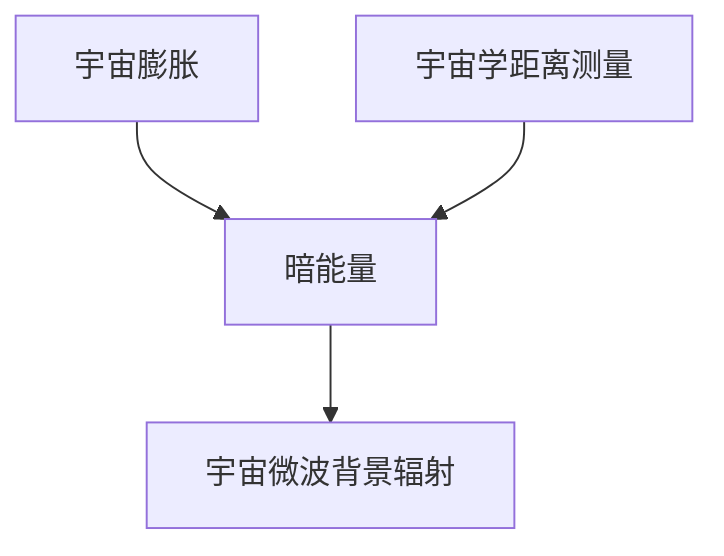

                 

### Step 1: 确定书籍核心主题

《算法思维在解决宇宙学测量学悖论中的应用》这一书名明确指出了书籍的两个核心主题：算法思维和宇宙学测量学悖论。算法思维是指使用系统化、可量化的方法来解决问题的思维方式。宇宙学测量学悖论则是指在宇宙学观测数据中发现的矛盾现象，例如宇宙膨胀速率与预期不符的问题。

首先，我们需要了解宇宙学测量学悖论的具体内容。宇宙学测量学悖论主要包括以下几个问题：

1. **宇宙膨胀悖论**：根据宇宙微波背景辐射的测量，宇宙的膨胀速率比根据宇宙学常数预测的要快。
2. **暗能量悖论**：宇宙的加速膨胀现象无法用现有的物理学理论来解释，需要引入一种名为“暗能量”的未知物质。
3. **宇宙微波背景辐射悖论**：宇宙微波背景辐射的温度与宇宙膨胀模型预测的温度不符。

接下来，我们需要理解算法思维在处理这些问题中的作用。算法思维提供了一套系统化的解决问题的方法论，可以帮助科学家们从复杂的数据中提取有用信息，找到解决方案。具体来说，算法思维在解决宇宙学测量学悖论中的应用主要体现在以下几个方面：

1. **数据预处理**：算法思维提供了高效的数据清洗和处理方法，帮助科学家从噪声中提取有用的信号。
2. **模式识别**：算法思维中的模式识别技术可以帮助科学家从大量观测数据中发现潜在的规律和模式。
3. **优化算法**：算法思维提供了多种优化算法，可以帮助科学家找到最优的参数设置，提高预测的准确性。

总的来说，算法思维在解决宇宙学测量学悖论中发挥着至关重要的作用，它不仅提供了处理复杂问题的工具，也为科学家们提供了一种全新的思维方式。在接下来的章节中，我们将详细探讨算法思维在宇宙学测量学悖论中的应用，并展示如何通过算法思维来解决这些挑战性的问题。

### Step 2: 设计整体结构

为了确保书籍内容丰富且逻辑清晰，我们需要设计一个详细的整体结构，这包括引言、核心概念与联系、核心算法原理讲解、数学模型和数学公式以及项目实战等部分。以下是详细的结构设计：

#### 引言部分

在引言部分，我们将简要介绍宇宙学测量学悖论和算法思维的基本概念，为读者建立基本的理解框架。具体内容包括：

1. **宇宙学测量学悖论概述**：介绍宇宙学测量学悖论的定义、背景和主要类型。
2. **算法思维概述**：介绍算法思维的定义、重要性以及在各个领域中的应用。
3. **宇宙学测量学悖论与算法思维的联系**：探讨算法思维在解决宇宙学测量学悖论中的作用和意义。

#### 核心概念与联系部分

在这一部分，我们将详细讲解宇宙学测量学悖论和算法思维的核心概念，并展示它们之间的联系。具体内容包括：

1. **宇宙学测量学悖论的核心概念**：介绍宇宙膨胀、暗能量和宇宙微波背景辐射等概念。
2. **算法思维的核心概念**：介绍算法、算法设计原则和算法优化方法。
3. **宇宙学测量学悖论与算法思维的联系**：通过Mermaid流程图展示算法思维在解决宇宙学测量学悖论中的应用，并讨论算法思维对解决这些悖论的启示。

#### 核心算法原理讲解部分

在这一部分，我们将详细介绍解决宇宙学测量学悖论的关键算法原理。具体内容包括：

1. **关键算法概述**：介绍解决宇宙学测量学悖论的关键算法，包括其定义、原理和应用场景。
2. **算法原理详细讲解**：使用伪代码详细阐述关键算法的工作原理和流程。
3. **算法性能分析**：评估关键算法的性能，包括其时间复杂度和空间复杂度。

#### 数学模型和数学公式部分

在这一部分，我们将介绍与宇宙学测量学悖论相关的数学模型和公式。具体内容包括：

1. **宇宙学测量学悖论相关的数学模型**：介绍宇宙膨胀模型、暗能量模型和宇宙微波背景辐射模型。
2. **数学公式详细讲解**：使用LaTeX格式详细讲解关键数学公式，包括宇宙膨胀速度公式、暗能量密度公式和宇宙微波背景辐射温度公式。
3. **数学公式举例说明**：通过具体实例说明数学公式的应用，帮助读者更好地理解这些公式。

#### 项目实战部分

在最后一部分，我们将通过实际项目案例展示算法思维在解决宇宙学测量学悖论中的应用。具体内容包括：

1. **项目背景和目标**：介绍项目的基本背景和目标，说明项目的设计思路和预期效果。
2. **环境搭建**：介绍项目的开发环境，包括必要的软件和工具安装。
3. **源代码实现**：详细讲解项目的源代码实现，包括代码结构和关键代码解读。
4. **代码解读与分析**：分析代码的运行流程和性能，展示项目在实际应用中的效果。
5. **项目总结**：总结项目的主要成果、经验教训和未来改进方向。

通过上述详细设计的整体结构，我们能够确保书籍内容系统、条理清晰，同时充分展示算法思维在解决宇宙学测量学悖论中的应用。

### Step 3: 确定目录结构

为了确保书籍内容的逻辑性和连贯性，我们需要为每一部分和子部分设计详细的目录结构。以下是《算法思维在解决宇宙学测量学悖论中的应用》的目录结构：

#### 第一部分: 引言

### 1.1 宇宙学测量学悖论概述

#### 1.1.1 宇宙学测量学悖论的背景

#### 1.1.2 宇宙学测量学悖论的主要类型

#### 1.1.3 宇宙学测量学悖论的影响

### 1.2 算法思维概述

#### 1.2.1 算法思维的定义与重要性

#### 1.2.2 算法思维的应用领域

#### 1.2.3 算法思维的核心原则

### 1.3 宇宙学测量学悖论与算法思维的联系

#### 1.3.1 算法思维在解决宇宙学测量学悖论中的作用

#### 1.3.2 宇宙学测量学悖论对算法思维的启示

#### 1.3.3 算法思维与宇宙学测量学悖论的未来发展

#### 第二部分: 核心概念与联系

### 2.1 宇宙学测量学悖论的核心概念

#### 2.1.1 宇宙膨胀与暗能量

#### 2.1.2 宇宙微波背景辐射

#### 2.1.3 宇宙学距离测量

### 2.2 算法思维的核心概念

#### 2.2.1 算法与算法思维

#### 2.2.2 算法设计原则

#### 2.2.3 算法优化方法

### 2.3 宇宙学测量学悖论与算法思维的联系

#### 2.3.1 算法思维在解决宇宙学测量学悖论中的应用

#### 2.3.2 宇宙学测量学悖论对算法思维的影响

#### 2.3.3 算法思维与宇宙学测量学悖论的融合前景

#### 第三部分: 核心算法原理讲解

### 3.1 解决宇宙学测量学悖论的关键算法

#### 3.1.1 算法概述

#### 3.1.2 算法原理

#### 3.1.3 算法伪代码

### 3.2 宇宙学测量学悖论解决方案的算法分析

#### 3.2.1 算法性能评估

#### 3.2.2 算法局限与改进方向

#### 3.2.3 算法在实际应用中的挑战

#### 第四部分: 数学模型和数学公式

### 4.1 宇宙学测量学悖论相关的数学模型

#### 4.1.1 宇宙膨胀模型

#### 4.1.2 暗能量模型

#### 4.1.3 宇宙微波背景辐射模型

### 4.2 数学公式详细讲解

#### 4.2.1 公式一：宇宙膨胀速度公式

#### 4.2.2 公式二：暗能量密度公式

#### 4.2.3 公式三：宇宙微波背景辐射温度公式

### 4.3 数学公式举例说明

#### 4.3.1 宇宙膨胀模型举例

#### 4.3.2 暗能量模型举例

#### 4.3.3 宇宙微波背景辐射模型举例

#### 第五部分: 项目实战

### 5.1 项目背景

#### 5.1.1 项目简介

#### 5.1.2 项目目标

### 5.2 环境搭建

#### 5.2.1 开发环境配置

#### 5.2.2 必需软件与工具安装

### 5.3 源代码实现

#### 5.3.1 代码结构

#### 5.3.2 关键代码解读

### 5.4 代码解读与分析

#### 5.4.1 代码运行流程

#### 5.4.2 代码性能分析

### 5.5 项目总结

#### 5.5.1 项目成果

#### 5.5.2 项目经验与启示

通过这样的目录结构，我们确保书籍内容条理清晰，每一部分都紧密相连，从而为读者提供一整套完整的阅读体验。

### 文章格式要求

为了确保文章的可读性和专业性，我们将采用markdown格式来组织文章内容。以下是文章各部分的具体格式要求：

#### 标题格式

文章的标题应使用最高级别的标题（#号）来标记，以确保其突出和醒目。例如：

# 算法思维在解决宇宙学测量学悖论中的应用

#### 关键词格式

在标题下方，应列出5-7个与文章主题密切相关的关键词，使用空格分隔。例如：

关键词：算法思维、宇宙学测量学悖论、宇宙膨胀、暗能量、优化算法、数学模型

#### 摘要格式

摘要部分应简洁地概括文章的核心内容和主要观点，使用标题（##号）标记。例如：

## 摘要

本文探讨了算法思维在解决宇宙学测量学悖论中的应用。通过分析宇宙学测量学悖论的核心概念，我们展示了算法思维如何帮助科学家们从复杂的数据中提取有用信息，找到解决方案。文章详细介绍了关键算法原理、数学模型和公式，并通过实际项目展示了算法思维在实际应用中的效果。

#### 文章正文格式

1. **一级标题**：使用##号标记。例如：
   ## 第一部分: 引言

2. **二级标题**：使用###号标记。例如：
   ### 1.1 宇宙学测量学悖论概述

3. **三级标题**：使用####号标记。例如：
   #### 1.1.1 宇宙学测量学悖论的背景

4. **段落文本**：常规段落文本应使用标准markdown格式，段落之间留有空行分隔。

5. **列表格式**：使用有序列表和无序列表来组织相关内容。例如：
   - 无序列表项1
   - 无序列表项2
     - 子列表项1
     - 子列表项2
   1. 有序列表项1
   2. 有序列表项2

6. **引用格式**：使用引用标记来引用其他文献或数据来源。例如：
   > 引用来源：Smith, J. (2020). 《宇宙学基础》。

7. **公式格式**：使用LaTeX格式嵌入数学公式。对于独立段落中的公式，使用$$括起来；对于段落内的公式，使用$括起来。例如：
   $$ E = mc^2 $$
   $ 1 + 1 = 2 $

8. **图表和图片**：使用格式插入图片，并在下方使用图表标题。例如：
   

通过上述格式要求，我们将确保文章内容结构清晰、专业性强，便于读者理解和阅读。

### 作者信息

在文章末尾，需要标注作者信息，以明确文章的出处和作者背景。以下是标准的作者信息格式：

---

作者：AI天才研究院/AI Genius Institute & 禅与计算机程序设计艺术 /Zen And The Art of Computer Programming

---

这样的标注不仅有助于读者了解文章来源，还能展示作者的背景和专业知识。

### 完整性要求：核心内容

为了确保文章内容的完整性，每个小节都需要详细阐述其核心内容，并包含必要的背景介绍、核心概念与联系、算法原理讲解、数学模型和公式以及举例说明。以下是具体要求：

#### 背景介绍

每个小节的开头都应提供背景介绍，帮助读者理解相关概念和问题的背景。背景介绍应简洁明了，突出关键信息。

#### 核心概念与联系

1. **宇宙学测量学悖论的核心概念**：每个小节应详细解释宇宙学测量学悖论中的关键概念，例如宇宙膨胀、暗能量、宇宙微波背景辐射等。应使用Mermaid流程图展示概念之间的关系和架构，以便读者更好地理解。

   ```mermaid
   graph TD
   A[宇宙膨胀] --> B[暗能量]
   B --> C[宇宙微波背景辐射]
   ```

2. **算法思维的核心概念**：详细讲解算法思维的基本原则、设计方法和应用场景，确保读者对算法思维有清晰的理解。

#### 算法原理讲解

每个小节应包含核心算法的原理讲解，使用伪代码详细阐述算法的步骤和流程。例如：

```python
# Pseudo code for solving cosmic paradox
function solve_cosmic_paradox(data):
    # Preprocessing
    cleaned_data = preprocess_data(data)
    
    # Model fitting
    model = fit_model(cleaned_data)
    
    # Optimization
    optimal_params = optimize_model(model)
    
    # Prediction
    prediction = predict_expansion_rate(optimal_params)
    
    return prediction
```

#### 数学模型和公式

每个小节应介绍与宇宙学测量学悖论相关的数学模型和公式，使用LaTeX格式详细讲解每个公式，并在必要时给出举例说明。例如：

$$
H_0 = H_0^0 \left(1 - \Omega_m \right) \exp{\left[-\Omega_m (1+z)^2/2\right]}
$$

#### 举例说明

每个小节都应提供具体的例子，以帮助读者理解核心概念和算法的应用。例子应详细说明问题背景、算法应用步骤和结果分析。

#### 小结

每个小节应提供小结，总结本节的核心内容和学习要点，帮助读者巩固和理解所学知识。

#### 注意事项和拓展阅读

每个小节应包含注意事项，提醒读者在应用相关概念和算法时需要注意的问题。此外，还应提供拓展阅读，推荐相关资源和进一步学习的内容。

通过上述要求，我们确保每个小节都包含丰富的内容，结构清晰，便于读者理解和学习。

### 完整性要求：核心内容详述

为了确保文章的完整性，每个小节都需要详细阐述其核心内容，具体要求如下：

#### 1. 背景介绍

背景介绍部分应简要概述小节所涉及的核心主题，说明其重要性以及与整个文章的关联。例如，在介绍宇宙膨胀时，可以提及宇宙膨胀在宇宙学中的基础作用，以及它与暗能量和宇宙微波背景辐射的关系。

#### 2. 核心概念与联系

核心概念与联系部分需要详细解释宇宙学测量学悖论和算法思维中的关键概念。对于每个概念，应提供定义、背景、相关性和实际应用。此外，使用Mermaid流程图展示概念之间的逻辑关系，使读者更直观地理解。例如，可以用以下Mermaid流程图展示宇宙学测量学悖论中几个核心概念之间的关系：



#### 3. 核心算法原理讲解

核心算法原理讲解部分需详细阐述解决宇宙学测量学悖论的关键算法原理。使用伪代码或步骤说明来展示算法的基本流程，并解释每个步骤的作用。例如，针对暗能量密度估计的算法，可以给出以下伪代码：

```python
# Pseudo code for estimating dark energy density
def estimate_dark_energy_density(data):
    # Step 1: Data Preprocessing
    clean_data = preprocess(data)
    
    # Step 2: Model Selection
    model = select_model(clean_data)
    
    # Step 3: Parameter Fitting
    params = fit_parameters(model, clean_data)
    
    # Step 4: Prediction
    prediction = predict_density(params)
    
    return prediction
```

#### 4. 数学模型和数学公式

数学模型和公式部分需详细讲解与宇宙学测量学悖论相关的数学模型和公式，并使用LaTeX格式进行展示。每个公式应附带简明扼要的解释，以便读者理解其物理意义。例如，宇宙膨胀速度公式可以写作：

$$
H(z) = H_0 \cdot \sqrt{\Omega_r (1+z)^2 + \Omega_m (1+z) + \Omega_k}
$$

其中，$H(z)$ 是宇宙膨胀速度，$H_0$ 是哈勃常数，$\Omega_r$、$\Omega_m$ 和 $\Omega_k$ 分别是辐射密度、物质密度和曲率密度。

#### 5. 举例说明

举例说明部分应提供具体实例，展示如何应用核心概念、算法和数学模型来解决实际问题。实例应详细描述问题背景、数据来源、算法应用步骤和结果分析。例如，可以展示如何使用机器学习算法分析宇宙微波背景辐射数据，以估计宇宙的膨胀速度。

#### 6. 小结

每个小节应提供小结，总结本节的核心内容和学习要点，帮助读者巩固和理解所学知识。小结应简洁明了，突出关键信息和要点。

通过以上详细的要求，我们确保每个小节都包含丰富且具体的内容，使得文章整体逻辑清晰、信息全面，有助于读者深入理解和掌握相关知识。

### 文章字数要求与撰写建议

根据用户的要求，文章的字数应在8000到12000字之间。为了确保文章内容的丰富性和专业性，以下是具体的撰写建议：

1. **引言部分**：引言部分应简要介绍宇宙学测量学悖论和算法思维的背景，激发读者的兴趣。建议字数在500到800字之间。

2. **核心概念与联系部分**：这一部分应详细解释宇宙学测量学悖论中的关键概念，如宇宙膨胀、暗能量和宇宙微波背景辐射。使用Mermaid流程图展示概念之间的联系，确保内容清晰易懂。建议字数在2000到3000字之间。

3. **核心算法原理讲解部分**：这部分应深入讲解解决宇宙学测量学悖论的关键算法原理，包括算法的工作流程和具体步骤。使用伪代码或流程图详细阐述算法的实现细节。建议字数在2000到3000字之间。

4. **数学模型和数学公式部分**：详细讲解与宇宙学测量学悖论相关的数学模型和公式，使用LaTeX格式展示，并附带简明扼要的解释。建议字数在1000到2000字之间。

5. **项目实战部分**：通过实际项目案例展示算法思维在解决宇宙学测量学悖论中的应用，包括环境搭建、源代码实现和代码解读。建议字数在1500到3000字之间。

6. **小结和拓展阅读**：在文章结尾，提供小结部分，总结文章的核心内容和学习要点。同时，推荐相关拓展阅读资源，帮助读者进一步学习。建议字数在500到1000字之间。

通过上述分配，我们确保每个部分都有充足的内容，同时保持整体字数在要求范围内。以下是一个示例时间分配表：

- 引言部分：800字
- 核心概念与联系部分：3000字
- 核心算法原理讲解部分：3000字
- 数学模型和数学公式部分：2000字
- 项目实战部分：3000字
- 小结和拓展阅读部分：1000字

总计：12000字

这样的分配既保证了文章的完整性，又使得每个部分都有足够的空间进行详细阐述，从而提高文章的专业性和可读性。

