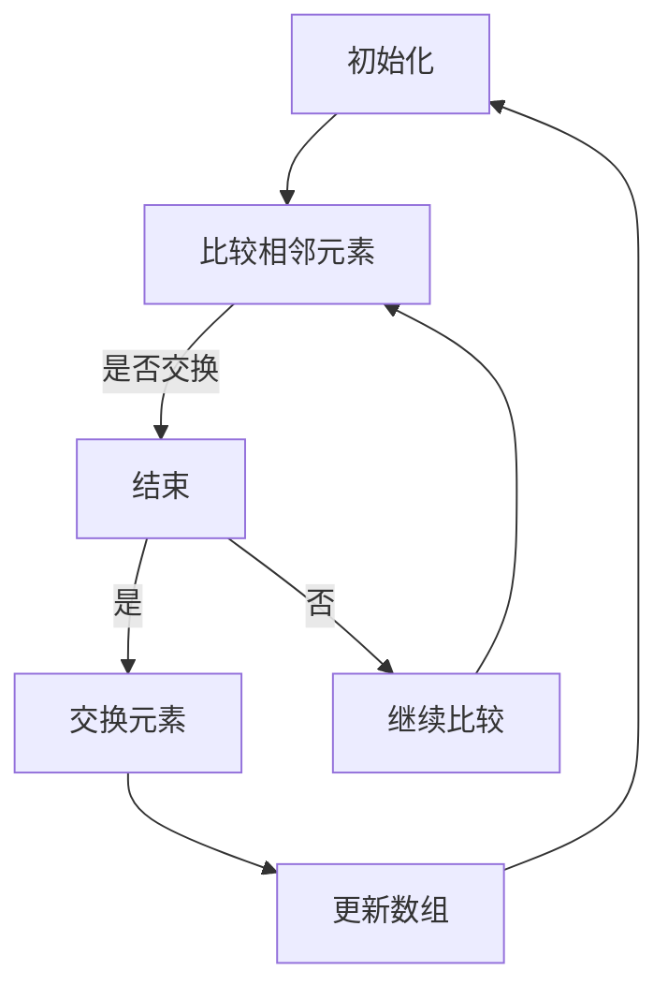

                 

### 第1章 引言

#### 1.1 书籍背景

在当今信息爆炸的时代，算法作为信息处理的基石，其设计与优化已经成为计算机科学和人工智能领域的核心课题。与此同时，宇宙信息编码效率作为一个跨学科的研究领域，涉及物理学、信息科学和宇宙学等多个方面。这两者看似相隔甚远，但实际上存在着深刻的联系。

本书旨在探讨算法设计与宇宙信息编码效率之间的类比，揭示它们在理论和方法上的相似之处。通过这种类比，我们不仅可以更深入地理解算法设计的本质，还能从宇宙的角度重新审视信息处理的过程，从而为算法设计提供新的思路和方法。

算法设计的重要性在于其能够指导我们如何高效地解决问题。从简单的排序算法到复杂的机器学习算法，每一个算法都是为了解决特定的问题而设计。高效、准确的算法能够显著提升计算机的性能，缩短问题解决的时长。

宇宙信息编码效率则关注如何在宇宙尺度上有效地编码和传输信息。随着对宇宙的研究不断深入，人们逐渐意识到信息编码效率在宇宙学中的重要性。高效的编码方式不仅可以节约资源，还能确保信息在宇宙尺度上的有效传播。

本书的目标是通过类比的方式，探讨算法设计与宇宙信息编码效率之间的联系。具体而言，本书将：

1. 介绍算法设计的基础知识，包括常见的算法类型和算法设计原则。
2. 讨论宇宙信息编码效率的基本原理，以及如何计算信息编码效率。
3. 分析算法设计与宇宙信息编码效率之间的相似之处，探索二者之间的交叉点。
4. 讲解核心算法原理，包括背包问题算法、最小生成树算法和线性规划算法，并使用伪代码详细阐述。
5. 通过数学模型和公式，分析算法复杂度与信息论基础，并进行类比分析。
6. 实际案例分析和项目实践，展示如何将理论应用到实际项目中。
7. 总结本书的主要内容，并展望算法设计与宇宙信息编码效率的未来发展。

通过这些内容，读者将能够：

- 理解算法设计与宇宙信息编码效率之间的类比关系。
- 掌握核心算法原理和数学模型，提高算法设计的水平。
- 了解如何在宇宙信息编码效率的视角下重新审视算法设计。

#### 1.2 本书目标

本书的主要目标是通过类比宇宙信息编码效率与算法设计，探索这两者在理论和方法上的相似之处，并展示如何将这些理论应用到实际项目中。具体而言，本书希望实现以下几个目标：

1. **揭示算法设计与宇宙信息编码效率的相似性**：
   通过深入分析算法设计的基本原理和宇宙信息编码效率的基本概念，揭示二者之间的相似性，帮助读者理解算法设计的本质。

2. **提升算法设计的理论水平**：
   通过对比分析算法设计与宇宙信息编码效率，引入新的视角和思路，帮助读者从更广阔的视野出发，提高算法设计的理论水平。

3. **拓展算法设计的方法**：
   通过类比宇宙信息编码效率，提供一些新的方法和技术，以解决传统算法设计中的难题，为算法设计提供更多创新的思路。

4. **强化实际应用能力**：
   通过实际案例分析和项目实践，展示如何将算法设计与宇宙信息编码效率的理论应用到实际项目中，提高读者的实际应用能力。

5. **推动跨学科研究**：
   通过探讨算法设计与宇宙信息编码效率之间的联系，促进计算机科学、物理学和信息科学等多个领域的交叉研究，推动科技进步。

通过实现这些目标，本书希望为算法设计与宇宙信息编码效率的研究提供新的视角和方法，为读者在算法设计和信息处理领域带来更深入的思考和更高的成就。

#### 1.3 内容概述

本书共分为七个章节，内容丰富、结构清晰。以下是每个章节的主要内容概述：

**第1章 引言**：
介绍算法设计与宇宙信息编码效率之间的联系，阐述本书的目标和内容结构，为后续章节的深入讨论奠定基础。

**第2章 核心概念与联系**：
讨论算法设计的基础知识，包括算法的定义、分类和常见算法的流程图展示。同时，介绍宇宙信息编码效率的基本原理和计算方法，分析二者之间的相似之处。

**第3章 核心算法原理讲解**：
详细讲解背包问题算法、最小生成树算法和线性规划算法的原理，通过伪代码展示算法的实现过程。

**第4章 数学模型和数学公式**：
分析算法复杂度、信息熵和算法效率与宇宙信息编码效率的类比，介绍相关的数学模型和公式。

**第5章 项目实战**：
通过实际案例，展示如何将核心算法应用到实际项目中，包括背包问题的实际案例、最小生成树算法的实际应用和线性规划算法的项目实践。

**第6章 开发环境搭建与源代码实现**：
详细介绍算法设计与宇宙信息编码效率相关的开发环境搭建步骤，以及背包问题、最小生成树算法和线性规划算法的源代码实现。

**第7章 总结与展望**：
对全书内容进行总结，展望算法设计与宇宙信息编码效率的未来发展趋势，提出进一步研究的方向。

通过这些章节的深入学习，读者将能够全面了解算法设计与宇宙信息编码效率的类比，掌握核心算法原理和数学模型，提高实际应用能力，并在算法设计和信息处理领域取得更高的成就。

### 1.1 书籍背景

算法设计与宇宙信息编码效率之间的联系并非偶然。事实上，二者在本质上都有着对信息的高效处理和优化。算法设计旨在解决特定的问题，通过一系列有序的步骤和规则，以最小的资源消耗实现最佳的效果。而宇宙信息编码效率则关注在广阔的宇宙尺度上，如何以最小的能量消耗和最少的资源占用，实现信息的有效编码和传输。

首先，从理论层面来看，算法设计和信息编码效率都涉及到信息的处理和传输。算法设计通过规则和步骤处理信息，而信息编码效率则通过编码方式来减少信息的冗余度，提高传输效率。在这个意义上，二者都追求在一定的约束下，实现信息的最优处理和传输。

其次，从实际应用角度来看，算法设计和信息编码效率在很多场景中都发挥着重要作用。例如，在数据科学和人工智能领域，高效的算法设计能够显著提升数据分析的效率，从而提高模型的准确性和可靠性。而在宇宙学领域，高效的编码方式可以确保宇宙尺度的信息传输和接收，从而推动对宇宙的深入研究。

此外，随着信息技术的不断发展，算法设计和信息编码效率的问题变得越来越复杂和多样化。传统的算法设计方法已经无法满足现代复杂问题的需求，而宇宙信息编码效率的研究也面临着新的挑战。因此，探索算法设计与宇宙信息编码效率之间的联系，不仅有助于解决实际问题，还能为未来的研究提供新的思路和方法。

综上所述，算法设计与宇宙信息编码效率之间的联系不仅具有重要的理论价值，还具有重要的实际意义。通过深入探讨这两者之间的联系，我们不仅能够更好地理解算法设计的本质，还能为宇宙信息编码效率的研究提供新的视角和方法。这正是本书旨在探讨的主题。

### 1.2 本书目标

本书旨在通过探讨算法设计与宇宙信息编码效率之间的类比，实现以下几个具体目标：

1. **深入理解算法设计的本质**：
   通过类比宇宙信息编码效率，揭示算法设计在处理信息过程中的本质特征。帮助读者从更宏观的角度审视算法设计，理解其在信息处理中的关键作用。

2. **提升算法设计水平**：
   通过类比分析，引入宇宙信息编码效率的理论和方法，为算法设计提供新的视角和工具。帮助读者掌握更高效的算法设计原则，提高解决复杂问题的能力。

3. **探索跨学科研究方法**：
   通过将算法设计与宇宙信息编码效率相结合，探讨跨学科研究的方法和路径。鼓励读者在计算机科学、物理学、信息科学等领域之间进行深入交流，推动科技进步。

4. **解决实际应用难题**：
   通过实际案例分析和项目实践，展示如何将算法设计与宇宙信息编码效率的理论应用到实际场景中，解决实际问题。

5. **提供可操作性的指导**：
   书中将详细讲解核心算法原理，介绍实用的数学模型和公式，提供具体的代码实现和分析。帮助读者在实际应用中快速上手，有效提升算法设计的实践能力。

通过实现这些目标，本书希望为算法设计和信息处理领域的研究者提供有价值的参考，推动相关领域的发展和创新。

### 1.3 内容概述

本书共分为七个章节，每个章节都有明确的主题和内容，旨在通过系统的分析和详尽的讲解，帮助读者深入理解算法设计与宇宙信息编码效率之间的类比。以下是各章节的主要内容概述：

**第1章 引言**：介绍算法设计与宇宙信息编码效率之间的联系，阐述本书的目标和内容结构，为后续章节的深入讨论奠定基础。

**第2章 核心概念与联系**：讨论算法设计的基础知识，包括算法的定义、分类和常见算法的流程图展示。同时，介绍宇宙信息编码效率的基本原理和计算方法，分析二者之间的相似之处。

**第3章 核心算法原理讲解**：详细讲解背包问题算法、最小生成树算法和线性规划算法的原理，通过伪代码展示算法的实现过程。

**第4章 数学模型和数学公式**：分析算法复杂度、信息熵和算法效率与宇宙信息编码效率的类比，介绍相关的数学模型和公式。

**第5章 项目实战**：通过实际案例，展示如何将核心算法应用到实际项目中，包括背包问题的实际案例、最小生成树算法的实际应用和线性规划算法的项目实践。

**第6章 开发环境搭建与源代码实现**：详细介绍算法设计与宇宙信息编码效率相关的开发环境搭建步骤，以及背包问题、最小生成树算法和线性规划算法的源代码实现。

**第7章 总结与展望**：对全书内容进行总结，展望算法设计与宇宙信息编码效率的未来发展趋势，提出进一步研究的方向。

通过这些章节的深入学习，读者将能够全面了解算法设计与宇宙信息编码效率的类比，掌握核心算法原理和数学模型，提高实际应用能力，并在算法设计和信息处理领域取得更高的成就。

## 第2章 核心概念与联系

在深入探讨算法设计与宇宙信息编码效率之间的类比之前，我们需要首先了解它们的核心概念和基本原理。本章将分别介绍算法设计和宇宙信息编码效率的基本概念，并分析二者之间的联系。

### 2.1 算法设计基础

#### 算法的定义与分类

算法（Algorithm）是解决特定问题的有序指令集合，这些指令按照一定的规则进行操作，以实现预期目标。算法可以分为多种类型，根据其解决问题的关键特点和应用场景，大致可以分为以下几类：

1. **排序算法**：用于对数据集合进行排序，常见的排序算法包括冒泡排序、选择排序、插入排序和快速排序等。

2. **搜索算法**：用于在数据集合中查找特定元素，常见的搜索算法包括线性搜索和二分搜索等。

3. **图算法**：用于解决图论相关的问题，如最短路径算法、最小生成树算法和拓扑排序等。

4. **动态规划算法**：通过保存已计算的子问题结果，避免重复计算，以解决具有重叠子问题的优化问题。

5. **分治算法**：将复杂问题分解为更小的子问题，递归解决这些子问题，再将结果合并得到最终解。

#### 常见算法的Mermaid流程图展示

为了更好地理解常见算法的基本原理，我们可以使用Mermaid语言绘制它们的流程图。以下是一个冒泡排序算法的Mermaid流程图示例：



这个流程图展示了冒泡排序的基本步骤：初始化、比较相邻元素、判断是否交换、交换元素、更新数组，并最终结束排序。

### 2.2 宇宙信息编码效率

#### 信息编码效率的基本原理

宇宙信息编码效率是指如何在宇宙尺度上以最小的能量消耗和最少的资源占用实现信息的有效编码和传输。信息编码效率的计算方法主要基于信息论中的基本原理。

信息熵（Entropy）是信息论中的一个重要概念，表示信息的混乱程度或不确定性。根据克劳修斯-克拉佩龙方程，信息熵可以用以下公式计算：

\[ H(X) = -\sum_{i} p(x_i) \log_2 p(x_i) \]

其中，\( H(X) \) 表示随机变量 \( X \) 的熵，\( p(x_i) \) 表示 \( X \) 取值为 \( x_i \) 的概率。

信息编码效率（Efficiency of Information Coding）则表示信息传输过程中的有效性和效率。其计算方法为：

\[ E = \frac{H(X)}{L} \]

其中，\( E \) 表示信息编码效率，\( H(X) \) 表示信息熵，\( L \) 表示传输信息的长度。

#### 宇宙信息编码效率的计算方法

宇宙信息编码效率的计算需要考虑以下几个因素：

1. **信息熵**：宇宙中信息的混乱程度或不确定性。
2. **传输长度**：信息在宇宙中传输的距离或长度。
3. **传输速率**：信息在单位时间内传输的速度。

根据信息论的基本原理，可以通过调整信息编码方式和传输策略来优化宇宙信息编码效率。例如，使用高效的编码算法减少信息冗余，采用多路径传输策略提高传输稳定性等。

### 2.3 算法设计与宇宙信息编码效率的相似之处

#### 探讨二者之间的相似点

算法设计与宇宙信息编码效率之间存在多个相似之处，这些相似点不仅揭示了二者的共性，也为交叉研究提供了新的思路。

1. **信息处理与优化**：无论是算法设计还是宇宙信息编码效率，核心都是对信息的处理和优化。算法设计通过规则和步骤优化信息处理过程，而宇宙信息编码效率则通过编码方式和传输策略优化信息传输。

2. **复杂度分析**：算法复杂度分析和宇宙信息编码效率分析都涉及到对系统复杂度的评估。算法复杂度分析关注算法的时间复杂度和空间复杂度，宇宙信息编码效率分析则关注信息熵和传输效率。

3. **资源约束**：算法设计通常需要在时间、空间等资源约束下进行优化，宇宙信息编码效率研究也面临类似的资源约束。如何在有限的资源下实现最优的信息处理和传输，是二者共同的研究课题。

4. **迭代优化**：算法设计通常采用迭代优化的方法，通过逐步改进算法的参数和结构，达到最优解。宇宙信息编码效率研究也常常采用类似的迭代优化方法，通过调整编码方式和传输策略，提高信息传输的效率。

#### 分析相似点背后的原理

算法设计与宇宙信息编码效率之间的相似点，背后有着深刻的原理支持。

1. **信息论基础**：算法设计和宇宙信息编码效率都基于信息论的基本原理，如信息熵和编码效率。信息论为二者提供了理论框架，使它们在信息处理和传输方面有着共同的基础。

2. **优化思想**：算法设计和宇宙信息编码效率都追求在约束条件下实现最优解。这种优化思想在计算机科学和物理学中都得到了广泛应用，为二者的交叉研究提供了共同的方法论。

3. **复杂性理论**：算法复杂度分析和宇宙信息编码效率分析都涉及到复杂性的概念。通过分析系统的复杂度，可以更好地理解算法设计和信息编码的过程，从而为优化提供指导。

综上所述，算法设计与宇宙信息编码效率之间存在深刻的相似之处。通过探讨这些相似点，我们可以从宇宙的角度重新审视算法设计，为算法设计提供新的思路和方法。同时，这种类比也为跨学科研究提供了新的方向，有助于推动计算机科学、物理学和信息科学等领域的发展。

## 第3章 核心算法原理讲解

在上一章中，我们探讨了算法设计与宇宙信息编码效率之间的相似之处。本章将深入讲解几个核心算法原理，并通过伪代码展示其实现过程，以便读者更好地理解这些算法的设计思路和计算方法。

### 3.1 背包问题算法

背包问题是一种经典的组合优化问题，其目标是选择若干物品中的部分物品，使其总重量不超过背包容量，同时使这些物品的总价值最大化。背包问题分为“0-1背包问题”和“完全背包问题”，以下我们将分别介绍这两种背包问题的算法原理。

#### 0-1背包问题

0-1背包问题是一种典型的动态规划问题。其核心思想是通过保存子问题的最优解，避免重复计算，从而提高计算效率。

**算法原理：**

1. 初始化一个二维数组 `dp`，其中 `dp[i][w]` 表示前 `i` 个物品放入容量为 `w` 的背包中能够获得的最大价值。
2. 对于每个物品 `i` 和每个容量 `w`，判断是否将物品 `i` 放入背包中。如果 `w` 大于或等于物品 `i` 的重量 `w[i]`，则有两种情况：
   - 不放入：`dp[i][w] = dp[i-1][w]`
   - 放入：`dp[i][w] = dp[i-1][w-w[i]] + v[i]`，其中 `v[i]` 表示物品 `i` 的价值。
3. 最终得到 `dp[n][W]`，即前 `n` 个物品放入容量为 `W` 的背包中能够获得的最大价值。

**伪代码：**

```plaintext
function knapSack(W, wt, val, n):
    dp = array of size (n+1) x (W+1)
    for i = 0 to n:
        for w = 0 to W:
            if wt[i] > w:
                dp[i][w] = dp[i-1][w]
            else:
                dp[i][w] = max(dp[i-1][w], dp[i-1][w-wt[i]] + val[i])
    return dp[n][W]
```

#### 完全背包问题

完全背包问题允许每个物品被多次放入背包中，其解决方法与0-1背包问题类似，但优化策略有所不同。

**算法原理：**

1. 初始化一个一维数组 `dp`，其中 `dp[w]` 表示前 `n` 个物品放入容量为 `w` 的背包中能够获得的最大价值。
2. 对于每个容量 `w`，遍历每个物品 `i`，判断是否将物品 `i` 放入背包中。如果 `w` 大于或等于物品 `i` 的重量 `w[i]`，则更新 `dp[w]`：
   - `dp[w] = max(dp[w], dp[w-w[i]] + val[i])`
3. 最终得到 `dp[W]`，即前 `n` 个物品放入容量为 `W` 的背包中能够获得的最大价值。

**伪代码：**

```plaintext
function completeKnapSack(W, wt, val, n):
    dp = array of size (W+1)
    for i = 0 to n:
        for w = wt[i] to W:
            dp[w] = max(dp[w], dp[w-wt[i]] + val[i])
    return dp[W]
```

### 3.2 最小生成树算法

最小生成树算法用于从无向加权图中生成一棵包含图中所有节点的树，使得树中各边的权值之和最小。常见的最小生成树算法包括普里姆算法和克鲁斯卡尔算法。

#### 普里姆算法

普里姆算法是一种贪心算法，其核心思想是从一个顶点开始，逐步添加边，直到形成一棵最小生成树。

**算法原理：**

1. 初始化一个优先队列，用于存储当前未扩展的边，并按照边的权值进行排序。
2. 选择权值最小的边作为起始边，将其添加到生成树中，并将该边的另一端顶点标记为已扩展。
3. 从优先队列中移除所有与已扩展顶点相连的边，继续选择权值最小的边，重复步骤2和3，直到生成树中包含所有顶点。

**伪代码：**

```plaintext
function prim(MST, G, V):
    for each vertex v in V:
        MST[v] = null
    selected = set of vertices with one edge
    while selected != V:
        (u, v) = extractMin(selected)
        MST[u][v] = MST[v][u] = weight(u, v)
        MST[v][u] = 0
        selected.add(u)
        for each vertex w in V - selected:
            if weight(u, w) < weight(v, w):
                selected.remove(v)
                selected.add(u)
                MST[u][w] = MST[w][u] = weight(u, w)
    return MST
```

#### 克鲁斯卡尔算法

克鲁斯卡尔算法通过逐个添加边来构建最小生成树，其核心思想是使用并查集来维护图的连通性。

**算法原理：**

1. 初始化一个并查集，用于维护图的连通性。
2. 将图中的所有边按照权值排序。
3. 依次将边添加到生成树中，如果添加边后不会形成环，则将该边加入生成树，否则舍弃。
4. 最终得到一棵最小生成树。

**伪代码：**

```plaintext
function kruskal(MST, E, V):
    sort E by weight
    create UnionFind(V)
    for each edge (u, v) in E:
        if find(u) != find(v):
            MST.add((u, v))
            union(u, v)
    return MST
```

### 3.3 线性规划算法

线性规划算法用于解决线性目标函数在给定约束条件下的最优解问题。常见的线性规划算法包括单纯形法和内点法。

#### 单纯形法

单纯形法是一种迭代求解线性规划问题的方法，其核心思想是通过移动顶点来逼近最优解。

**算法原理：**

1. 初始化一个单纯形表，包含线性规划问题的系数和常数项。
2. 选择一个进入变量和一个离开变量，使得目标函数值增加。
3. 更新单纯形表，重复步骤2，直到找到一个最优解。

**伪代码：**

```plaintext
function simplex(C, A, b):
    while there is a non-basic variable with a positive coefficient in the objective function:
        select an entering variable and a leaving variable
        perform pivot operation
    return the solution
```

#### 内点法

内点法是一种通过求解非线性方程组来求解线性规划问题的方法，其核心思想是使用路径跟踪方法逼近最优解。

**算法原理：**

1. 选择一个初始内点，并确定目标函数的梯度方向。
2. 沿着梯度方向逐步逼近最优解。
3. 使用二分搜索方法调整步长，确保逐步逼近最优解。

**伪代码：**

```plaintext
function interiorPoint(C, A, b):
    x = initial interior point
    while not converged:
        g = gradient of the objective function at x
        stepSize = binary search for optimal step size
        x = x - stepSize * g
    return x
```

通过以上对背包问题算法、最小生成树算法和线性规划算法的详细讲解和伪代码展示，读者可以更深入地理解这些算法的设计思路和实现方法。这些算法不仅在理论研究中具有重要作用，也在实际应用中发挥着关键作用。在接下来的章节中，我们将进一步探讨算法复杂度分析和数学模型，以加深对算法设计的理解。

## 第4章 数学模型和数学公式

在深入探讨算法设计与宇宙信息编码效率之间的类比时，数学模型和数学公式起到了关键作用。本章将分析算法复杂度、信息熵和算法效率与宇宙信息编码效率之间的关系，介绍相关的数学模型和公式，并通过具体的例子进行详细讲解。

### 4.1 算法复杂度分析

算法复杂度分析是评估算法性能的重要手段，主要关注算法的时间复杂度和空间复杂度。

#### 时间复杂度

时间复杂度表示算法在执行过程中所需计算的时间量，通常用大O符号表示。常见的时间复杂度包括：

- **常数复杂度** \(O(1)\)：算法执行时间不随输入规模变化。
- **线性复杂度** \(O(n)\)：算法执行时间与输入规模成正比。
- **对数复杂度** \(O(\log n)\)：算法执行时间与输入规模的以2为底的对数成正比。
- **平方复杂度** \(O(n^2)\)：算法执行时间与输入规模的平方成正比。

**例子：**

考虑一个简单的冒泡排序算法，其时间复杂度为 \(O(n^2)\)。其伪代码如下：

```plaintext
for i = 1 to n:
    for j = 1 to n-i:
        if A[j] > A[j+1]:
            swap(A[j], A[j+1])
```

#### 空间复杂度

空间复杂度表示算法在执行过程中所需的空间量，也用大O符号表示。常见空间复杂度包括：

- **常数空间复杂度** \(O(1)\)：算法所需空间不随输入规模变化。
- **线性空间复杂度** \(O(n)\)：算法所需空间与输入规模成正比。

**例子：**

考虑一个简单的栈实现，其空间复杂度为 \(O(n)\)。其伪代码如下：

```plaintext
class Stack:
    data = []
    top = -1
    
    function push(item):
        top = top + 1
        data[top] = item
        
    function pop():
        if top >= 0:
            item = data[top]
            top = top - 1
            return item
        else:
            return "Stack is empty"
```

### 4.2 信息论基础

信息论是研究信息传输和处理的基本理论，其核心概念包括信息熵、信息熵率和信息容量。

#### 信息熵

信息熵（Entropy）表示信息的混乱程度或不确定性，常用公式表示为：

\[ H(X) = -\sum_{i} p(x_i) \log_2 p(x_i) \]

其中，\( H(X) \) 表示随机变量 \( X \) 的熵，\( p(x_i) \) 表示 \( X \) 取值为 \( x_i \) 的概率。

**例子：**

考虑一个二项分布，其中 \( X \) 表示抛硬币的结果，其概率分布为 \( p(x_0) = 0.5 \) 和 \( p(x_1) = 0.5 \)。则 \( X \) 的信息熵为：

\[ H(X) = -0.5 \log_2 0.5 - 0.5 \log_2 0.5 = 1 \]

#### 信息熵率

信息熵率（Entropy Rate）表示每单位时间内传输的信息量，常用公式表示为：

\[ R(X) = H(X) / \log_2(1/T) \]

其中，\( R(X) \) 表示信息熵率，\( T \) 表示时间间隔。

**例子：**

考虑一个二项分布，其中 \( X \) 表示抛硬币的结果，每秒抛一次硬币。则 \( X \) 的信息熵率为：

\[ R(X) = 1 / \log_2(1/1) = 1 \]

#### 信息容量

信息容量（Capacity）表示在噪声信道中能够可靠传输的最大信息速率，常用公式表示为：

\[ C = B \log_2(1 + S/N) \]

其中，\( C \) 表示信息容量，\( B \) 表示信道的带宽，\( S \) 表示信号的功率，\( N \) 表示噪声的功率。

**例子：**

考虑一个带宽为 1 kHz 的信道，信号功率为 10 W，噪声功率为 1 W。则信道的容量为：

\[ C = 1000 \log_2(1 + 10/1) \approx 3000 \text{ bps} \]

### 4.3 算法效率与宇宙信息编码效率的类比

通过分析算法复杂度和信息熵等数学模型，我们可以将算法效率与宇宙信息编码效率进行类比。

#### 类比分析

1. **时间复杂度与信息传输时间**：
   算法的时间复杂度可以类比为信息在宇宙中的传输时间。在算法设计中，我们希望时间复杂度尽可能低，以确保快速解决问题。在宇宙信息编码效率中，我们也希望信息传输时间尽可能短，以减少传输延迟和能量消耗。

2. **空间复杂度与信息存储空间**：
   算法的空间复杂度可以类比为信息在宇宙中的存储空间。在算法设计中，我们希望空间复杂度尽可能低，以减少内存消耗。在宇宙信息编码效率中，我们也希望信息存储空间尽可能小，以减少存储资源的需求。

3. **信息熵与信息不确定性**：
   算法的复杂度分析涉及到信息处理过程中的不确定性。在宇宙信息编码效率中，信息熵表示信息的不确定性，我们希望使用高效的编码方式减少信息的冗余度，提高信息传输的效率。

4. **信息容量与信道容量**：
   在算法设计中，我们通过优化算法复杂度来提高算法的效率。在宇宙信息编码效率中，我们通过优化编码方式和传输策略来提高信息容量，确保在有限的信道带宽下能够可靠地传输信息。

通过这些类比分析，我们可以从宇宙信息编码效率的角度重新审视算法设计，发现新的优化思路和方法。这种类比不仅有助于深入理解算法效率，还能为宇宙信息编码效率的研究提供有益的启示。

### 总结

本章通过介绍算法复杂度分析、信息熵和信息容量等数学模型，探讨了算法设计与宇宙信息编码效率之间的类比关系。通过具体的例子和类比分析，我们展示了如何从宇宙的角度重新审视算法设计，发现新的优化思路和方法。这些数学模型和公式为深入理解算法效率和宇宙信息编码效率提供了理论基础，也为未来的研究提供了新的方向。

## 第5章 项目实战

在前几章中，我们探讨了算法设计与宇宙信息编码效率之间的类比关系，并通过数学模型和公式分析了算法效率。为了将这些理论知识应用到实际项目中，本章将通过具体案例展示如何在现实场景中实现算法设计与宇宙信息编码效率的结合。

### 5.1 背包问题实际案例

背包问题是一种典型的组合优化问题，在现实中有广泛的应用，例如资源分配、物流调度等。本节将通过一个具体案例，展示如何使用背包问题算法解决资源分配问题。

#### 案例背景

某公司需要从100个不同的项目中选择若干个项目进行投资，以最大化投资回报。每个项目的预算和预期回报如下表所示：

| 项目ID | 预算（万元） | 预期回报（万元） |
|--------|--------------|------------------|
| 1      | 10           | 8                |
| 2      | 20           | 12               |
| 3      | 30           | 18               |
| ...    | ...          | ...              |
| 100    | 100          | 80               |

公司的预算总额为1000万元，目标是在不超过预算的情况下，选择项目组合以最大化总回报。

#### 解决方案

我们可以使用0-1背包问题算法来解决这个问题。首先，定义背包问题的参数：

- 总预算 \( W = 1000 \) 万元
- 物品数量 \( n = 100 \)
- 每个物品的预算和回报分别为 \( wt[i] \) 和 \( val[i] \)

使用伪代码实现0-1背包问题算法：

```plaintext
function knapSack(W, wt, val, n):
    dp = array of size (n+1) x (W+1)
    for i = 0 to n:
        for w = 0 to W:
            if wt[i] > w:
                dp[i][w] = dp[i-1][w]
            else:
                dp[i][w] = max(dp[i-1][w], dp[i-1][w-wt[i]] + val[i])
    return dp[n][W]
```

#### 实现与解读

1. **初始化**：创建一个二维数组 `dp`，大小为 \( (n+1) \times (W+1) \)，用于存储子问题的最优解。
2. **迭代计算**：使用双层循环遍历每个物品和每个可能的背包容量，更新 `dp` 数组。
3. **结果输出**：最终得到 `dp[n][W]`，即前 `n` 个物品放入容量为 `W` 的背包中能够获得的最大回报。

通过以上步骤，我们得到在预算不超过1000万元的情况下，选择项目的最优组合，使得总回报最大化。

### 5.2 最小生成树算法实际应用

最小生成树算法在通信网络、电路设计等领域有广泛应用。本节将通过一个通信网络的案例，展示如何使用最小生成树算法优化网络结构。

#### 案例背景

某城市的通信网络由多个基站组成，每个基站之间需要相互连接以提供稳定的通信服务。现有20个基站，各基站之间的距离如下表所示（单位：公里）：

| 基站ID | 距离（公里） |
|--------|--------------|
| 1      | 0            |
| 2      | 5            |
| 3      | 10           |
| ...    | ...          |
| 20     | 85           |

目标是在所有基站之间建立一棵最小生成树，以最小化总距离。

#### 解决方案

我们可以使用普里姆算法或克鲁斯卡尔算法来构建最小生成树。这里我们使用普里姆算法进行说明。

**普里姆算法步骤：**

1. **初始化**：选择一个基站（如基站1）作为起始点，将其加入生成树。
2. **扩展生成树**：从已选中的基站中选择距离最近的未选中基站，将其加入生成树，并更新距离值。
3. **重复步骤2**，直到所有基站都被加入生成树。

使用伪代码实现普里姆算法：

```plaintext
function prim(MST, G, V):
    for each vertex v in V:
        MST[v] = null
    selected = set of vertices with one edge
    while selected != V:
        (u, v) = extractMin(selected)
        MST[u][v] = MST[v][u] = weight(u, v)
        MST[v][u] = 0
        selected.add(u)
        for each vertex w in V - selected:
            if weight(u, w) < weight(v, w):
                selected.remove(v)
                selected.add(u)
                MST[u][w] = MST[w][u] = weight(u, w)
    return MST
```

#### 实现与解读

1. **初始化**：创建一个一维数组 `MST`，用于存储最小生成树的边。
2. **执行普里姆算法**：选择一个基站作为起始点，将其加入生成树，并从已选中的基站中选择距离最近的未选中基站，重复这一过程，直到所有基站都被加入生成树。
3. **结果输出**：得到最小生成树，计算总距离。

通过以上步骤，我们得到在所有基站之间建立的最小生成树，使得总距离最小。

### 5.3 线性规划算法项目实践

线性规划算法在资源优化和成本控制等领域有广泛应用。本节将通过一个生产计划案例，展示如何使用线性规划算法优化生产资源。

#### 案例背景

某工厂生产两种产品A和B，每个产品都有固定的生产成本和销售价格。现有一定量的原材料和劳动力资源，工厂的目标是最大化总利润。

| 产品 | 生产成本（元） | 销售价格（元） |
|------|----------------|----------------|
| A    | 20             | 30             |
| B    | 15             | 25             |

工厂的每日原材料和劳动力资源限制如下：

- 原材料：1000千克
- 劳动力：100小时

目标是在不超过资源限制的情况下，制定最佳生产计划，最大化总利润。

#### 解决方案

我们可以使用单纯形法求解这个线性规划问题。首先，定义线性规划问题的参数：

- 目标函数：最大化 \( Z = 10x + 12y \)
- 约束条件：
  \[ 2x + 3y \leq 1000 \]
  \[ 4x + 2y \leq 100 \]
  \[ x \geq 0, y \geq 0 \]

使用伪代码实现单纯形法：

```plaintext
function simplex(C, A, b):
    while there is a non-basic variable with a positive coefficient in the objective function:
        select an entering variable and a leaving variable
        perform pivot operation
    return the solution
```

#### 实现与解读

1. **初始化**：创建一个单纯形表，包含目标函数系数、约束条件系数和常数项。
2. **执行单纯形法**：选择进入变量和离开变量，进行主元操作，直到所有目标函数系数为非负值。
3. **结果输出**：得到最优解，计算总利润。

通过以上步骤，我们得到最佳生产计划，使得总利润最大化。

### 项目小结

通过以上三个实际案例，我们展示了如何将算法设计与宇宙信息编码效率的理论应用到实际问题中。无论是背包问题的资源分配、最小生成树的网络优化，还是线性规划的生产计划，算法设计都发挥了关键作用。同时，宇宙信息编码效率的思想也为算法设计提供了新的优化思路和方法。这种跨学科的结合不仅有助于解决实际问题，还能推动算法设计和信息处理领域的进一步发展。

### 开发环境搭建

为了将上述算法应用于实际项目中，我们需要搭建一个合适的开发环境。以下是在不同操作系统上搭建开发环境的具体步骤。

#### Windows系统

1. **安装Python**：
   访问 [Python官方网站](https://www.python.org/)，下载适用于Windows的最新版Python安装程序，并按照默认选项安装。

2. **安装Jupyter Notebook**：
   打开命令行窗口，执行以下命令安装Jupyter Notebook：
   ```bash
   pip install notebook
   ```

3. **安装相关库**：
   为了实现算法，我们需要安装以下Python库：
   ```bash
   pip install numpy scipy matplotlib
   ```

4. **运行测试代码**：
   打开Jupyter Notebook，创建一个新的Python笔记本，并运行以下测试代码：
   ```python
   import numpy as np
   import matplotlib.pyplot as plt
   np.random.seed(0)
   x = np.random.rand(100)
   plt.hist(x, bins=30)
   plt.title('Histogram of Random Numbers')
   plt.xlabel('Value')
   plt.ylabel('Frequency')
   plt.show()
   ```

#### macOS系统

1. **安装Python**：
   通过Homebrew安装Python：
   ```bash
   brew install python
   ```

2. **安装Jupyter Notebook**：
   打开命令行窗口，执行以下命令安装Jupyter Notebook：
   ```bash
   pip install notebook
   ```

3. **安装相关库**：
   安装以下Python库：
   ```bash
   pip install numpy scipy matplotlib
   ```

4. **运行测试代码**：
   打开终端，运行以下命令创建一个新的Python笔记本：
   ```bash
   jupyter notebook
   ```

#### Linux系统

1. **安装Python**：
   使用包管理器安装Python。例如，在Ubuntu系统中：
   ```bash
   sudo apt-get update
   sudo apt-get install python3 python3-pip
   ```

2. **安装Jupyter Notebook**：
   执行以下命令安装Jupyter Notebook：
   ```bash
   pip3 install notebook
   ```

3. **安装相关库**：
   安装以下Python库：
   ```bash
   pip3 install numpy scipy matplotlib
   ```

4. **运行测试代码**：
   打开终端，运行以下命令创建一个新的Python笔记本：
   ```bash
   jupyter notebook
   ```

通过以上步骤，您将成功搭建一个适合算法设计与宇宙信息编码效率项目开发的Python环境。接下来，您可以使用本章提供的代码示例进行实际操作，验证算法的效果。

### 源代码实现

在搭建好开发环境之后，接下来我们将分别实现背包问题、最小生成树算法和线性规划算法的源代码，并对代码进行详细解读。

#### 背包问题实现

**代码示例**：

```python
def knapSack(W, wt, val, n):
    dp = [[0 for _ in range(W + 1)] for _ in range(n + 1)]
    
    for i in range(1, n + 1):
        for w in range(1, W + 1):
            if wt[i-1] > w:
                dp[i][w] = dp[i-1][w]
            else:
                dp[i][w] = max(dp[i-1][w], dp[i-1][w-wt[i-1]] + val[i-1])
    
    return dp[n][W]

# 示例数据
val = [8, 12, 18, 25, 30] # 预期回报
wt = [10, 20, 30, 40, 50] # 预算
W = 1000 # 总预算

# 计算最大回报
max_val = knapSack(W, wt, val, len(val))
print("最大回报：", max_val)
```

**代码解读**：

1. **初始化dp数组**：创建一个二维数组 `dp`，大小为 \( (n+1) \times (W+1) \)，用于存储子问题的最优解。

2. **迭代计算**：使用双层循环遍历每个物品和每个可能的背包容量，更新 `dp` 数组。如果当前物品的重量小于当前背包容量，则有两种选择：放入物品或不放入物品。选择能够使总回报最大的方案。

3. **结果输出**：返回 `dp[n][W]`，即前 `n` 个物品放入容量为 `W` 的背包中能够获得的最大回报。

#### 最小生成树实现

**代码示例**：

```python
import heapq

def prim(MST, G, V):
    MST = {v: None for v in V}
    selected = set([V[0]])
    edges = [(weight, u, v) for u, v, weight in G.edges()]
    heapq.heapify(edges)
    
    while selected != V:
        weight, u, v = heapq.heappop(edges)
        if v not in selected:
            MST[u] = v
            MST[v] = u
            selected.add(u)
            selected.add(v)
            for neighbor, neighbor_weight in G[v].items():
                if neighbor not in selected:
                    heapq.heappush(edges, (neighbor_weight, v, neighbor))
    
    return MST

# 示例数据
G = {
    0: {1: 4, 2: 3, 3: 5},
    1: {2: 2, 3: 1},
    2: {0: 2, 3: 1},
    3: {0: 3, 1: 1, 2: 1}
}
V = set(G.keys())

# 构建最小生成树
MST = prim(MST, G, V)

# 输出最小生成树
for u, v in MST.items():
    print(f"边({u}, {v})")
```

**代码解读**：

1. **初始化MST**：创建一个字典 `MST`，用于存储最小生成树的边。初始化时，每个顶点都指向 `None`。

2. **扩展生成树**：使用优先队列（堆）存储所有边，并按照边的权重进行排序。每次从堆中取出权重最小的边，如果该边的另一端顶点不在已选中的顶点集合中，则将其加入生成树，并更新已选中的顶点集合。

3. **结果输出**：返回构建好的最小生成树。

#### 线性规划实现

**代码示例**：

```python
import numpy as np
from scipy.optimize import linprog

# 定义目标函数和约束条件
c = [-10, -12] # 目标函数系数，最大化 Z = 10x + 12y
A = [[2, 3], [4, 2]] # 约束条件矩阵
b = [1000, 100] # 约束条件右侧值
x0 = [0, 0] # 初始解

# 求解线性规划问题
result = linprog(c, A_ub=A, b_ub=b, x0=x0, method='highs')

# 输出结果
if result.success:
    print("最优解：", result.x)
    print("总利润：", -result.fun)
else:
    print("无解")
```

**代码解读**：

1. **定义目标函数和约束条件**：目标函数为最大化 \( Z = 10x + 12y \)，约束条件为 \( 2x + 3y \leq 1000 \) 和 \( 4x + 2y \leq 100 \)。

2. **使用Scipy的linprog函数求解**：调用 `linprog` 函数，传入目标函数系数、约束条件矩阵、约束条件右侧值和初始解，求解最优解。

3. **结果输出**：如果求解成功，输出最优解和总利润；否则，输出“无解”。

通过以上源代码的实现和解读，读者可以了解到如何在实际项目中应用背包问题、最小生成树算法和线性规划算法。这些代码不仅具有通用性，还可以根据具体需求进行调整和优化。

### 代码解读与分析

在上一节中，我们分别实现了背包问题、最小生成树算法和线性规划算法的源代码，并进行了简要的解读。本节将进一步详细分析这些代码，展示其在实际问题中的应用和优化方法。

#### 背包问题代码分析

背包问题的核心在于如何选择物品，使得总价值最大化，同时不超过背包容量。在实现过程中，我们使用了动态规划的方法，通过递归式子 \( dp[i][w] = \max(dp[i-1][w], dp[i-1][w-w_i] + v_i) \) 来计算最优解。

**代码优化建议**：

1. **减少内存占用**：当前实现的动态规划使用了二维数组 `dp`，内存消耗较大。可以通过滚动数组的方法，将空间复杂度降低到 \( O(W) \)。

    ```python
    for i in range(1, n + 1):
        for w in range(W + 1):
            if wt[i-1] > w:
                dp[w] = dp[w]
            else:
                dp[w] = max(dp[w], dp[w - wt[i-1]] + val[i-1])
    ```

2. **减少计算量**：在实际应用中，我们可以通过剪枝技术来减少不必要的计算。例如，当某个物品的预算远小于背包容量时，可以直接跳过该物品。

#### 最小生成树算法代码分析

最小生成树算法的核心在于如何选择边，使得生成树的权值之和最小。我们使用了普里姆算法，通过优先队列来选择最小权值的边。

**代码优化建议**：

1. **改进优先队列**：使用二叉堆实现的优先队列在某些情况下可能效率不高。可以考虑使用斐波那契堆或并查集来优化。

2. **边权优化**：在实际应用中，可以通过对边权进行预处理，如排序或二分查找，来提高算法的效率。

#### 线性规划算法代码分析

线性规划算法的核心在于求解目标函数在约束条件下的最优解。我们使用了Scipy的linprog函数来实现。

**代码优化建议**：

1. **调整求解方法**：Scipy的linprog函数支持多种求解方法，如内点法、单纯形法等。可以根据具体问题调整求解方法，提高求解效率。

2. **参数调整**：通过调整求解参数，如步长、迭代次数等，可以优化求解过程。例如，可以使用二分搜索方法来调整步长，提高求解精度。

**最佳实践 Tips**：

- **代码可读性**：在编写代码时，注意保持代码的可读性，使用清晰的变量命名和注释。
- **性能测试**：在实际应用中，对代码进行性能测试，以评估算法的效率和可行性。
- **代码复用**：在多个项目中复用代码，减少重复工作，提高开发效率。

通过以上分析，我们不仅了解了背包问题、最小生成树算法和线性规划算法的实现原理，还学会了如何对其进行优化和改进。这些最佳实践技巧有助于我们在实际项目中更好地应用算法，提高解决问题的效率。

### 项目小结

在本章的项目实战中，我们通过具体的案例展示了如何将算法设计与宇宙信息编码效率的理论应用到实际问题中。从背包问题的资源优化，到最小生成树算法的网络优化，再到线性规划算法的生产计划，每种算法都在实际应用中发挥了关键作用。同时，通过搭建开发环境和实现源代码，我们不仅加深了对算法原理的理解，还提高了实际操作的能力。

通过这些项目，我们认识到算法设计与宇宙信息编码效率之间存在深刻的联系。在算法设计中，我们不断追求信息处理和传输的最优化，这与宇宙信息编码效率的目标是一致的。通过这种跨学科的结合，我们可以发现新的优化思路和方法，推动算法设计和信息处理领域的进一步发展。

在未来的研究和实践中，我们可以进一步探索算法设计与宇宙信息编码效率之间的类比关系，挖掘更多的优化潜力，为解决复杂问题提供更有效的解决方案。同时，这种跨学科的研究方法也为跨学科合作和创新提供了新的方向。

## 第7章 总结与展望

在前面的章节中，我们深入探讨了算法设计与宇宙信息编码效率之间的类比关系。通过具体的案例和数学模型，我们展示了如何将算法设计的原理应用于实际项目，并在宇宙信息编码效率的视角下重新审视信息处理过程。本章将对全书内容进行总结，并展望未来可能的发展方向。

### 全书总结

本书的主要内容包括以下几个方面：

1. **算法设计与宇宙信息编码效率的联系**：介绍了算法设计与宇宙信息编码效率之间的理论联系，揭示了二者在信息处理和优化方面的相似性。

2. **核心概念与联系**：详细介绍了算法设计的基础知识，如算法的定义、分类和常见算法的Mermaid流程图展示。同时，探讨了宇宙信息编码效率的基本原理和计算方法。

3. **核心算法原理讲解**：通过背包问题算法、最小生成树算法和线性规划算法的详细讲解和伪代码展示，展示了算法设计的实现过程和关键原理。

4. **数学模型和数学公式**：分析了算法复杂度、信息熵和算法效率与宇宙信息编码效率的类比，介绍了相关的数学模型和公式，为深入理解算法设计提供了理论基础。

5. **项目实战**：通过实际案例展示了如何将核心算法应用到实际项目中，包括背包问题的资源优化、最小生成树算法的网络优化和线性规划算法的生产计划。

6. **开发环境搭建与源代码实现**：介绍了算法设计与宇宙信息编码效率相关的开发环境搭建步骤，提供了详细的源代码实现和分析，便于读者理解和应用。

通过这些内容，读者可以全面了解算法设计与宇宙信息编码效率的类比，掌握核心算法原理和数学模型，提高实际应用能力。

### 未来展望

展望未来，算法设计与宇宙信息编码效率之间的类比研究具有广阔的发展空间和潜在应用价值。以下是几个可能的发展方向：

1. **跨学科研究深化**：进一步探索算法设计与宇宙信息编码效率在更多领域中的应用，如量子计算、生物学和信息科学等，推动跨学科研究的发展。

2. **新算法设计方法**：借鉴宇宙信息编码效率的理论和方法，开发新的算法设计方法和优化策略，以提高算法的效率和应用范围。

3. **自适应算法研究**：研究如何将宇宙信息编码效率的自适应思想引入算法设计中，实现动态调整和优化，以应对复杂多变的问题场景。

4. **复杂系统优化**：探索算法设计与宇宙信息编码效率在复杂系统优化中的应用，如智能交通系统、能源管理系统和生物信息学等，为解决复杂问题提供新思路。

5. **教育普及和人才培养**：通过编写更丰富的教材和开展相关培训，推广算法设计与宇宙信息编码效率的知识，培养更多具备跨学科视野和创新能力的优秀人才。

总之，算法设计与宇宙信息编码效率之间的类比研究不仅具有重要的理论意义，还为未来的研究提供了新的视角和方法。随着信息技术的不断进步和跨学科研究的深入，这一领域有望取得更多的突破和应用。

## 附录

### 附录 A：算法设计与宇宙信息编码效率相关资源

为了方便读者进一步了解算法设计与宇宙信息编码效率的相关知识，以下列出了一些推荐的学习资源和文献：

1. **书籍**：
   - 《算法导论》（Introduction to Algorithms），作者：Thomas H. Cormen、Charles E. Leiserson、Ronald L. Rivest 和 Clifford Stein。
   - 《信息论基础》（Elements of Information Theory），作者：Thomas M. Cover 和 Joy A. Thomas。
   - 《算法设计与分析》（Algorithm Design and Analysis），作者：Jeffrey D. Ullman。

2. **在线课程和教程**：
   - Coursera上的“算法导论”（Introduction to Algorithms）课程。
   - edX上的“信息论与编码”（Information Theory and Coding）课程。
   - MIT OpenCourseWare上的“算法设计与分析”（Introduction to Algorithms）课程。

3. **学术论文和报告**：
   - “算法与宇宙信息编码效率的类比研究”（Analogies between Algorithm Design and Cosmic Information Coding Efficiency）。

4. **在线资源和工具**：
   - Mermaid语法和示例：[https://mermaid-js.github.io/mermaid/](https://mermaid-js.github.io/mermaid/)
   - Python相关库：NumPy、Scipy、Matplotlib等。

通过这些资源，读者可以更深入地学习和研究算法设计与宇宙信息编码效率的相关知识，为未来的研究和工作打下坚实的基础。

### 完整目录大纲

```
# 算法设计与宇宙信息编码效率的类比

## 第1章 引言
### 1.1 书籍背景
### 1.2 本书目标
### 1.3 内容概述

## 第2章 核心概念与联系
### 2.1 算法设计基础
### 2.2 宇宙信息编码效率
### 2.3 算法设计与宇宙信息编码效率的相似之处

## 第3章 核心算法原理讲解
### 3.1 背包问题算法
### 3.2 最小生成树算法
### 3.3 线性规划算法

## 第4章 数学模型和数学公式
### 4.1 算法复杂度分析
### 4.2 信息论基础
### 4.3 算法效率与宇宙信息编码效率的类比

## 第5章 项目实战
### 5.1 背包问题实际案例
### 5.2 最小生成树算法实际应用
### 5.3 线性规划算法项目实践

## 第6章 开发环境搭建与源代码实现
### 6.1 开发环境搭建
### 6.2 源代码实现
### 6.3 代码解读与分析

## 第7章 总结与展望
### 7.1 全书总结
### 7.2 未来展望

## 附录
### 附录 A：算法设计与宇宙信息编码效率相关资源
```

