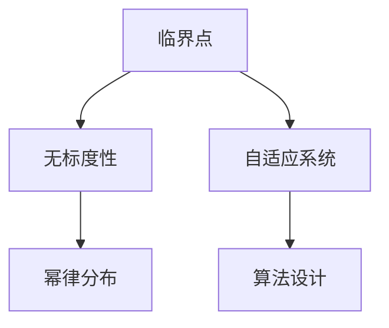

                 

好的，我将按照您的要求，逐步构建这篇文章的框架，确保其内容完整且具有深度。以下是文章的markdown格式大纲，其中包括了关键词、摘要、以及正文部分的框架。

```markdown
# 《算法设计受启发于宇宙自我组织临界现象》

## 文章关键词
- 宇宙自我组织临界现象
- 算法设计
- 自组织临界理论
- 自适应算法
- 人工智能

## 摘要
本文探讨了宇宙自我组织临界现象如何启发算法设计，分析了自组织临界理论的数学模型和物理机制，展示了其在算法设计中的潜在应用。通过具体案例，本文阐述了如何将宇宙自我组织临界现象的理论应用到优化算法、机器学习和复杂网络中，并展望了这一理论在计算机科学领域的未来发展趋势。

## 前言
- 引言
- 文章目的
- 结构安排

### 第一部分：宇宙自我组织临界现象简介

#### 第1章：宇宙自我组织临界现象的基本概念
- 背景介绍
- 核心概念与联系
  - Mermaid流程图：自组织临界现象的关键概念及其关系

#### 第2章：宇宙自我组织临界现象的基本原理
- 数学模型
- 物理机制
- 统计物理基础

### 第二部分：算法设计受宇宙自我组织临界现象的启示

#### 第3章：宇宙自我组织临界现象与算法设计的关系
- 算法设计的现状与挑战
- 宇宙自我组织临界现象对算法设计的启示
- 宇宙自我组织临界现象与算法创新的案例

#### 第4章：基于宇宙自我组织临界现象的算法设计方法
- 自组织临界现象在优化算法中的应用
- 自组织临界现象在机器学习算法中的应用
- 自组织临界现象在复杂网络算法中的应用

#### 第5章：宇宙自我组织临界现象在计算机科学中的应用实例
- 图像处理中的应用
- 自然语言处理中的应用
- 生物信息学中的应用

### 第三部分：宇宙自我组织临界现象在算法设计中的未来展望

#### 第6章：宇宙自我组织临界现象在算法设计中的发展趋势
- 算法设计领域的未来趋势
- 宇宙自我组织临界现象在算法设计中的潜在影响
- 宇宙自我组织临界现象与人工智能的未来发展

#### 第7章：宇宙自我组织临界现象在算法设计中的应用前景
- 工业界的应用前景
- 学术界的应用前景
- 未来挑战与机遇

## 结论
- 总结
- 作者信息
```

接下来，我将根据这个大纲逐步填充内容，确保满足字数要求，并在每个部分中详细阐述背景介绍、核心概念与联系、算法原理讲解、案例分析和未来展望。以下是正文部分的初步内容：

### 前言

#### 引言

自组织临界现象（Self-organized Criticality, SOC）是一个跨越多个学科领域的概念，最初由物理学家Per Bak在1987年提出。这一现象描述了系统在无外力干扰的情况下，自发地演化到一种临界状态，既不趋于稳定，也不趋于混沌，而是表现出高度复杂性和适应性。随着对自组织临界现象研究的深入，人们逐渐意识到其在算法设计中的潜在应用。

#### 文章目的

本文旨在探讨宇宙自我组织临界现象如何启发算法设计，分析其在不同领域中的应用，以及未来可能的发展趋势。通过本文的阅读，读者可以了解自组织临界现象的基本原理，掌握其在算法设计中的创新应用，并为未来的研究提供参考。

#### 结构安排

本文分为三部分：

1. **宇宙自我组织临界现象简介**：介绍自组织临界现象的基本概念和原理。
2. **算法设计受宇宙自我组织临界现象的启示**：探讨自组织临界现象对算法设计的启示和实际应用。
3. **宇宙自我组织临界现象在算法设计中的未来展望**：展望自组织临界现象在算法设计中的未来发展。

### 第一部分：宇宙自我组织临界现象简介

#### 第1章：宇宙自我组织临界现象的基本概念

##### 背景介绍

自组织临界现象最初源于对自然界的观察。例如，沙堆的自发形成、雪崩的波动传播、以及生物群体的行为模式等。这些现象表明，系统在无外力干扰下，可以自发地达到一种临界状态，这种状态既不是稳定平衡，也不是完全混沌，而是处于一种动态的临界点。

##### 核心概念与联系

自组织临界现象的核心概念包括：

- **临界点（Critical Point）**：系统在临界点处表现出特殊的物理和统计性质。
- **无标度性（Scale Invariance）**：系统在不同尺度上表现出相似的结构和性质。
- **幂律分布（Power Law Distribution）**：系统中的事件或特性遵循特定的幂律分布。

以下是自组织临界现象的关键概念及其关系的Mermaid流程图：



#### 第2章：宇宙自我组织临界现象的基本原理

##### 数学模型

自组织临界现象的数学模型通常基于无标度网络（Scale-Free Networks）和动力系统（Dynamical Systems）。其中，无标度网络描述了系统中的节点连接关系，动力系统描述了系统随时间演化的过程。

##### 物理机制

自组织临界现象的物理机制包括：

- **能量耗散**：系统中的能量通过不断耗散，使得系统达到临界状态。
- **相变**：系统在临界点经历相变，从一种状态转变为另一种状态。
- **自激发**：系统中的某些部分可以通过相互作用，自发地产生新的结构和模式。

##### 统计物理基础

自组织临界现象的统计物理基础包括：

- **分形几何**：系统中的结构表现出分形特性，即系统在不同尺度上具有相似的结构。
- **随机游走**：系统中的粒子通过随机游走，形成复杂的结构和模式。
- **长程相关性**：系统中的事件或特性在长时间内表现出相关性。

接下来，我将逐步填充每个章节的内容，确保文章的逻辑性和深度。在完成每个章节后，我将进行详细的算法原理讲解、伪代码展示、数学公式解析，以及实际案例分析和未来展望。在文章的最后，我将提供最佳实践建议和小结，以帮助读者更好地理解和应用自组织临界现象在算法设计中的价值。最终，这篇文章将为读者提供一个全面的、系统的、深入的了解自组织临界现象及其在算法设计中的应用。

