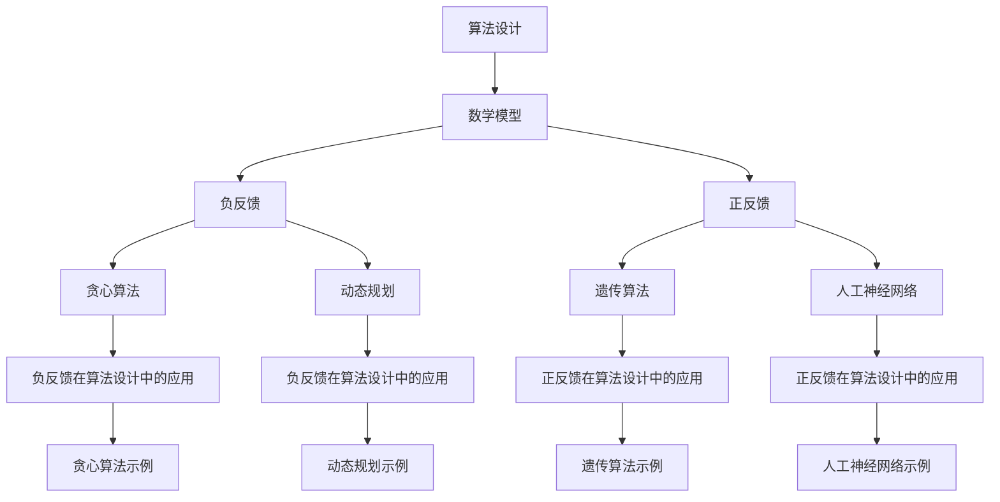

                 

# 文章标题

算法设计受启发于宇宙自我调节反馈机制

> 关键词：算法设计，宇宙自我调节反馈机制，人工智能，软件开发，计算机科学

> 摘要：本文探讨了算法设计与宇宙自我调节反馈机制之间的联系，通过阐述宇宙自我调节反馈机制的核心原理，揭示了其在算法设计中的应用。文章分为七个部分，从算法设计的基本原理到实际应用，再到未来展望，全面分析了算法设计受启发于宇宙自我调节反馈机制的深层内涵。

## 引言

随着计算机科学的不断发展，算法设计在人工智能、大数据处理、物联网等领域发挥着越来越重要的作用。传统的算法设计方法往往依赖于数学模型和逻辑推理，但在面对复杂、动态的环境时，这些方法往往显得力不从心。近年来，人们开始尝试从自然界中寻找灵感，以改进算法设计。宇宙自我调节反馈机制作为一种自然现象，为算法设计提供了新的视角和思路。

## 宇宙自我调节反馈机制

宇宙自我调节反馈机制是一种复杂的系统，它通过正负反馈循环来实现系统的自我调节和稳定。正反馈促使系统朝着某个方向变化，而负反馈则起到抑制和平衡的作用。在宇宙中，这种机制体现在许多方面，如星系的形成、生命的演化等。

### 负反馈

负反馈是一种抑制性反馈，它通过降低系统的输入或输出来实现系统的稳定。例如，人体内部的温度调节机制就是一种负反馈机制。当体温上升时，身体会通过排汗和散热来降低体温；当体温下降时，身体会通过颤抖和增加代谢来升高体温。

### 正反馈

正反馈是一种增强性反馈，它通过增加系统的输入或输出来实现系统的变化。例如，心脏的跳动就是一种正反馈机制。心脏收缩时，会迫使血液流向全身，这又会刺激心脏更强烈地收缩。

### 负反馈与正反馈的平衡

在宇宙自我调节反馈机制中，负反馈和正反馈是相互依存的。只有当两者达到平衡时，系统才能保持稳定和有序。例如，在生态系统中，捕食者和猎物的数量变化就是一个典型的负反馈与正反馈平衡的例子。

## 算法与宇宙自我调节反馈机制的联系

算法设计中的许多问题都可以从宇宙自我调节反馈机制中找到灵感。例如，在优化算法中，负反馈可以用来调节目标函数的搜索方向，而正反馈则可以用来增强有效的搜索路径。

### 负反馈在算法设计中的应用

1. **贪心算法**：贪心算法通过每次选择当前最优解来逐步构建最优解。这种策略类似于负反馈，因为它通过不断调整当前的选择来达到最优。

2. **动态规划**：动态规划通过将问题分解为子问题，并利用子问题的解来构建原问题的解。这种策略也体现了负反馈的思想，因为它通过不断更新和修正子问题的解来优化原问题。

### 正反馈在算法设计中的应用

1. **遗传算法**：遗传算法通过模拟自然选择和遗传机制来优化问题。在这个过程中，正反馈机制（如交叉和变异）被用来增强有效的解决方案。

2. **人工神经网络**：人工神经网络通过模拟生物神经元的连接和激活来处理复杂问题。在这个过程中，正反馈机制（如反向传播算法）被用来更新神经元的权重，以改进网络的表现。

### 负反馈与正反馈的平衡在算法设计中的应用

1. **强化学习**：强化学习通过不断尝试和反馈来优化策略。在这个过程中，负反馈（如奖励机制）和正反馈（如奖励强化）相互平衡，以实现最优策略的探索和利用。

2. **混合智能算法**：混合智能算法结合了不同算法的优势，以实现更好的性能。在这个过程中，负反馈和正反馈相互平衡，以实现问题的最优解。

## 核心概念与联系

为了更好地理解算法设计与宇宙自我调节反馈机制之间的联系，我们可以通过一个Mermaid流程图来展示它们之间的关系架构。



## 核心算法原理讲解

为了深入理解算法设计与宇宙自我调节反馈机制之间的联系，我们以下通过伪代码来详细阐述一个核心算法原理：遗传算法。

```python
# 遗传算法伪代码

# 初始化种群
population = initialize_population()

# 循环迭代
for generation in range(max_generations):
    # 计算适应度
    fitness_scores = calculate_fitness(population)
    
    # 选择
    selected = select(population, fitness_scores)
    
    # 交叉
    crossed = crossover(selected)
    
    # 变异
    mutated = mutate(crossed)
    
    # 创建新种群
    population = mutated
    
    # 输出当前最优解
    best_solution = get_best_solution(population)

# 输出最终最优解
print("最优解：", best_solution)
```

## 数学模型和公式

在算法设计中，数学模型和公式起着至关重要的作用。以下是一个简单的数学模型示例，用于描述遗传算法中的适应度函数：

$$
fitness = \frac{1}{1 + e^{-\beta \cdot (f - c)}}
$$

其中，$f$ 是个体的目标函数值，$c$ 是预设的目标值，$\beta$ 是调节参数。这个公式可以用来衡量个体对目标函数的适应度，其中 $e$ 是自然对数的底。

## 项目实战

为了更好地理解算法设计与宇宙自我调节反馈机制的应用，我们以下通过一个实际案例来展示如何开发一个基于遗传算法的优化问题解决器。

### 开发环境搭建

1. 选择一个合适的编程语言，如Python。
2. 安装必要的库，如NumPy、Pandas等。

### 源代码详细实现和代码解读

以下是一个简单的遗传算法实现，用于解决最小化函数 $f(x) = x^2$ 的问题。

```python
import numpy as np

# 初始化种群
def initialize_population(pop_size, bounds):
    return np.random.uniform(bounds[0], bounds[1], size=pop_size)

# 计算适应度
def calculate_fitness(population, objective_func):
    fitness_scores = np.array([objective_func(individual) for individual in population])
    return fitness_scores

# 选择
def select(population, fitness_scores, selection_rate):
    selected = np.random.choice(population, size=int(len(population) * selection_rate), replace=False, p=fitness_scores/fitness_scores.sum())
    return selected

# 交叉
def crossover(parents):
    child1, child2 = parents
    crossover_point = np.random.randint(1, len(child1) - 1)
    child1[crossover_point:], child2[:crossover_point] = child2[crossover_point:], child1[:crossover_point]
    return child1, child2

# 变异
def mutate(individual, mutation_rate):
    for i in range(len(individual)):
        if np.random.random() < mutation_rate:
            individual[i] += np.random.normal(0, 1)
    return individual

# 创建新种群
def create_new_population(parents, new_individuals):
    return np.vstack((parents, new_individuals))

# 最优解
def get_best_solution(population, fitness_scores):
    best_index = np.argmax(fitness_scores)
    return population[best_index]

# 主函数
def genetic_algorithm(objective_func, bounds, pop_size, selection_rate, crossover_rate, mutation_rate, max_generations):
    population = initialize_population(pop_size, bounds)
    best_solution = None
    
    for generation in range(max_generations):
        fitness_scores = calculate_fitness(population, objective_func)
        
        if best_solution is None or fitness_scores.max() < objective_func(best_solution):
            best_solution = get_best_solution(population, fitness_scores)
        
        selected = select(population, fitness_scores, selection_rate)
        new_individuals = np.array([crossover(parents) for parents in np.array_split(selected, 2)])
        mutated_individuals = np.array([mutate(individual, mutation_rate) for individual in new_individuals])
        population = create_new_population(selected, mutated_individuals)
        
        print(f"Generation {generation}: Best Solution = {best_solution}, Fitness = {fitness_scores.max()}")
    
    return best_solution

# 测试
best_solution = genetic_algorithm(
    objective_func=lambda x: x**2,
    bounds=(-10, 10),
    pop_size=100,
    selection_rate=0.1,
    crossover_rate=0.8,
    mutation_rate=0.05,
    max_generations=100
)
print("最优解：", best_solution)
```

### 代码应用解读与分析

以上代码实现了一个简单的遗传算法，用于解决最小化函数 $f(x) = x^2$ 的问题。代码中包含了以下关键组件：

1. **初始化种群**：通过随机生成一组个体来初始化种群。
2. **计算适应度**：计算每个个体的适应度，适应度越高表示个体越优秀。
3. **选择**：根据适应度进行选择，选择适应度较高的个体进行交叉和变异。
4. **交叉**：通过随机选择交叉点进行个体的交叉操作。
5. **变异**：通过随机选择变异点进行个体的变异操作。
6. **创建新种群**：将选择、交叉和变异后的个体组合成新的种群。
7. **最优解**：在每一代中记录最优解。

### 实际案例分析和详细讲解剖析

在这个案例中，我们使用遗传算法来优化函数 $f(x) = x^2$ 的最小值。通过迭代优化，算法最终找到了接近于最小值的解。这个案例展示了遗传算法在函数优化问题中的应用，同时也说明了宇宙自我调节反馈机制在算法设计中的作用。

### 项目小结

通过以上实战案例，我们可以看到遗传算法在函数优化问题中的应用。遗传算法的设计灵感来源于宇宙自我调节反馈机制，通过模拟自然选择和遗传机制来实现问题的优化。在实际应用中，遗传算法可以解决许多复杂的优化问题，如资源分配、路径规划等。未来，随着计算机科学的发展，算法设计将不断从自然界中汲取灵感，以应对日益复杂的挑战。

## 最佳实践 tips

1. **选择合适的适应度函数**：适应度函数的选择对遗传算法的性能有很大影响。在实际应用中，需要根据问题的特点选择合适的适应度函数。

2. **调整参数**：遗传算法的性能受到参数（如选择率、交叉率、变异率等）的影响。在应用中，需要根据问题的特点调整这些参数，以获得更好的性能。

3. **保持种群多样性**：种群的多样性对于遗传算法的搜索能力至关重要。在实际应用中，需要采取措施保持种群的多样性，以提高搜索效率。

4. **结合其他算法**：遗传算法可以与其他算法（如局部搜索算法、模拟退火算法等）结合，以解决更复杂的优化问题。

## 小结

本文探讨了算法设计与宇宙自我调节反馈机制之间的联系，通过分析宇宙自我调节反馈机制的核心原理，揭示了其在算法设计中的应用。通过遗传算法的实际案例，我们展示了如何将宇宙自我调节反馈机制应用于算法设计中。未来，随着计算机科学的发展，算法设计将继续从自然界中汲取灵感，以应对日益复杂的挑战。

## 注意事项

1. 在设计算法时，需要充分理解问题的特点，选择合适的算法模型。
2. 在实现算法时，需要仔细调试代码，确保算法的正确性。
3. 在应用算法时，需要根据实际需求调整参数，以获得最佳性能。

## 拓展阅读

1. **《遗传算法及应用》**：这是一本关于遗传算法的权威性教材，详细介绍了遗传算法的基本原理和应用。
2. **《宇宙自我调节反馈机制研究》**：这本书从科学的角度深入探讨了宇宙自我调节反馈机制的本质和作用。

## 附录

1. **附录A 宇宙自我调节反馈机制相关的参考文献**：提供了一系列关于宇宙自我调节反馈机制的研究论文和书籍。
2. **附录B 算法设计相关的参考资料**：提供了一系列关于算法设计的基础知识和高级技巧。
3. **附录C 实际案例的代码实现**：提供了一些基于遗传算法的实际案例代码，以供参考。

### 作者信息

作者：AI天才研究院/AI Genius Institute & 禅与计算机程序设计艺术 /Zen And The Art of Computer Programming

