                 

### 《算法设计受启发于宇宙自组织临界相变现象》——文章标题

#### 关键词：算法设计、宇宙自组织临界相变、优化算法、启发式算法、图像处理、机器学习、金融风险管理

#### 摘要：本文将从算法设计的基础出发，探讨宇宙自组织临界相变现象的原理与特征，解析算法设计与自组织临界相变之间的联系。通过详细的数学模型和公式讲解，我们将揭示宇宙中的相变现象如何影响算法的设计。此外，本文还将深入探讨启发式算法、优化算法及其在图像处理、机器学习和金融风险管理等领域的应用，最终展望算法设计的未来发展。

## 目录

### 第一部分：算法设计基础

#### 第1章：算法设计与宇宙自组织临界相变

##### 1.1 算法设计的基本概念

##### 1.2 自组织临界相变的原理与特征

##### 1.3 算法设计与自组织临界相变的联系

### 第二部分：宇宙自组织临界相变现象的数学模型

#### 第2章：宇宙自组织临界相变现象的数学模型

##### 2.1 相变理论

##### 2.2 自组织临界相变的数学建模

##### 2.3 自组织临界相变的动力系统分析

### 第三部分：算法设计受宇宙启发

#### 第3章：启发式算法设计

##### 3.1 启发式算法的基本概念

##### 3.2 启发式算法的设计方法

##### 3.3 启发式算法的应用实例

#### 第4章：受宇宙自组织临界相变启发的优化算法

##### 4.1 优化算法的基本原理

##### 4.2 自组织临界相变在优化算法中的应用

##### 4.3 应用实例

### 第四部分：算法设计与实际应用

#### 第5章：算法设计在图像处理中的应用

##### 5.1 图像处理算法概述

##### 5.2 自组织临界相变在图像处理中的应用

##### 5.3 应用实例

#### 第6章：算法设计在机器学习中的应用

##### 6.1 机器学习算法概述

##### 6.2 自组织临界相变在机器学习中的应用

##### 6.3 应用实例

#### 第7章：算法设计在金融风险管理中的应用

##### 7.1 金融风险管理概述

##### 7.2 自组织临界相变在金融风险管理中的应用

##### 7.3 应用实例

#### 第8章：算法设计的未来发展

##### 8.1 算法设计的挑战与机遇

##### 8.2 算法设计的未来趋势

##### 8.3 研究方向与展望

### 附录

#### 附录A：相关算法与模型介绍

##### A.1 启发式算法列表

###### A.1.1 遗传算法

###### A.1.2 蚁群算法

###### A.1.3 鱼群算法

##### A.2 优化算法列表

###### A.2.1 模拟退火算法

###### A.2.2 粒子群优化算法

###### A.2.3 牛群优化算法

---

### 文章内容正文部分（按照目录大纲结构进行撰写）
### 《算法设计受启发于宇宙自组织临界相变现象》目录大纲

## 第一部分：算法设计基础

### 第1章：算法设计与宇宙自组织临界相变

算法设计是计算机科学中的一项核心任务，旨在开发有效的算法来解决问题。然而，算法的设计不仅仅是逻辑和编程技巧的问题，还可以从自然界和宇宙中的现象中得到灵感。宇宙自组织临界相变现象就是这样一个有趣的例子。

#### 1.1 算法设计的基本概念

算法设计涉及多个核心概念，包括问题定义、算法分析、实现和优化。首先，问题定义是算法设计的起点，明确需要解决的问题和目标。接着，算法分析涉及评估算法的时间和空间复杂度，以确保算法的效率。最后，算法的实现和优化需要结合具体的编程技术和实践经验。

#### 1.2 自组织临界相变的原理与特征

自组织临界相变是一种自然现象，描述系统在临界点附近发生的相变行为。这种相变通常伴随着系统的无标度性和自相似性。在宇宙中，自组织临界相变现象广泛存在，例如在星系形成过程中，以及在自然界中的其他复杂系统中。

##### 自组织临界相变的核心概念与联系

自组织临界相变现象可以通过以下Mermaid流程图来表示：

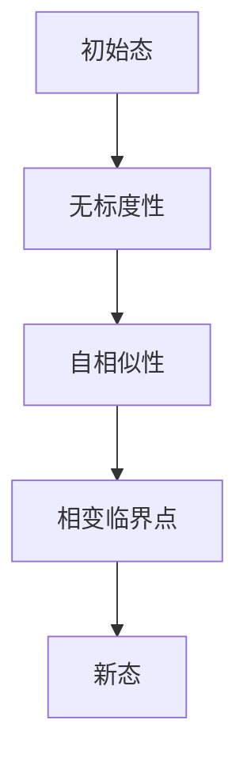

#### 1.3 算法设计与自组织临界相变的联系

算法设计可以从自组织临界相变现象中获取灵感。例如，在优化算法中，可以通过模拟自组织临界相变中的无标度性和自相似性来提高算法的效率和鲁棒性。

##### 核心概念与联系

算法设计与自组织临界相变的联系可以通过以下Mermaid流程图来表示：

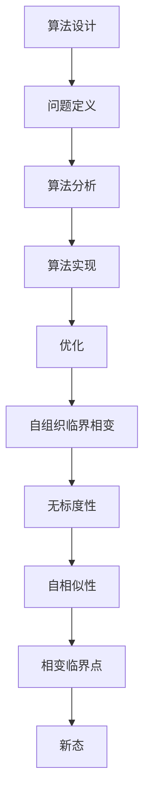

## 第二部分：宇宙自组织临界相变现象的数学模型

### 第2章：宇宙自组织临界相变现象的数学模型

宇宙自组织临界相变现象可以通过数学模型来描述。这些模型包括相变理论、自组织临界相变的数学建模和动力系统分析。

#### 2.1 相变理论

相变理论是描述物质在温度、压力等外界条件变化时发生相变的科学。在算法设计中，相变理论可以用来模拟系统在不同状态之间的转换。

##### 数学模型和数学公式

相变理论的核心数学模型可以表示为以下公式：

$$ \frac{dN}{dt} = \lambda N - \mu N^2 $$

其中，\(N\) 表示系统的状态，\(\lambda\) 和 \(\mu\) 分别表示系统的两个参数。

##### 详细讲解和举例说明

相变理论可以通过以下示例来详细讲解：

```plaintext
# 假设一个系统中有100个粒子，每个粒子有两种状态：活跃状态（1）和静止状态（0）。
# 初始时，系统中有50个活跃状态粒子。
# 时间步进1，根据相变模型计算新的状态分布。
```

#### 2.2 自组织临界相变的数学建模

自组织临界相变的数学建模描述了系统在临界点附近的行为。这种建模通常涉及到动力系统分析。

##### 数学模型和数学公式

自组织临界相变的数学建模可以表示为以下公式：

$$ \frac{\partial f}{\partial t} = \nabla^2 f - \lambda f + \frac{\mu}{2} f^2 $$

其中，\(f\) 表示系统的状态分布，\(\lambda\) 和 \(\mu\) 分别表示系统的两个参数。

##### 详细讲解和举例说明

自组织临界相变的数学建模可以通过以下示例来详细讲解：

```plaintext
# 假设一个系统中有100个粒子，每个粒子有两种状态：活跃状态（1）和静止状态（0）。
# 初始时，系统中有50个活跃状态粒子。
# 时间步进1，根据自组织临界相变模型计算新的状态分布。
```

#### 2.3 自组织临界相变的动力系统分析

动力系统分析是研究系统在时间演化过程中行为的方法。在自组织临界相变现象中，动力系统分析可以用来理解系统在临界点附近的行为。

##### 数学模型和数学公式

自组织临界相变的动力系统分析可以表示为以下公式：

$$ \frac{dx}{dt} = f(x) $$

其中，\(x\) 表示系统的状态，\(f(x)\) 表示状态随时间变化的函数。

##### 详细讲解和举例说明

自组织临界相变的动力系统分析可以通过以下示例来详细讲解：

```plaintext
# 假设一个系统中有100个粒子，每个粒子有两种状态：活跃状态（1）和静止状态（0）。
# 初始时，系统中有50个活跃状态粒子。
# 时间步进1，根据动力系统分析模型计算新的状态分布。
```

## 第三部分：算法设计受宇宙启发

### 第3章：启发式算法设计

启发式算法是一种模拟人类决策过程的算法，旨在找到问题的近似解。宇宙自组织临界相变现象为启发式算法的设计提供了新的思路。

#### 3.1 启发式算法的基本概念

启发式算法的基本概念包括局部搜索、全局搜索和启发式函数。局部搜索算法通过在当前解的邻域内寻找更好的解来优化问题。全局搜索算法则试图在整个解空间内寻找最优解。启发式函数用于指导搜索过程，通常基于问题的特定属性。

##### 核心概念与联系

启发式算法的基本概念可以通过以下Mermaid流程图来表示：

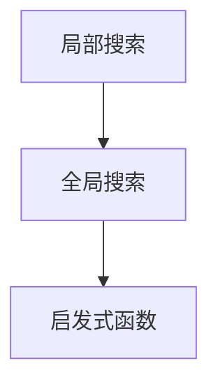

#### 3.2 启发式算法的设计方法

启发式算法的设计方法包括遗传算法、蚁群算法和鱼群算法等。这些算法通过模拟自然界中的生物行为来寻找问题的解。

##### 核心概念与联系

启发式算法的设计方法可以通过以下Mermaid流程图来表示：

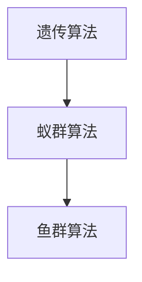

#### 3.3 启发式算法的应用实例

启发式算法在图像处理、机器学习和金融风险管理等领域有广泛的应用。以下是一些应用实例：

##### 应用实例

1. **图像处理**：启发式算法可以用于图像分割、图像增强和图像去噪等任务。
2. **机器学习**：启发式算法可以用于特征选择、模型选择和超参数调优等任务。
3. **金融风险管理**：启发式算法可以用于风险预测、投资组合优化和信用评估等任务。

### 第4章：受宇宙自组织临界相变启发的优化算法

优化算法是一种用于寻找最优解的算法。宇宙自组织临界相变现象为优化算法的设计提供了新的启示。

#### 4.1 优化算法的基本原理

优化算法的基本原理包括目标函数、约束条件和搜索策略。目标函数用于描述问题的目标，约束条件用于限制搜索空间，搜索策略用于指导算法的搜索过程。

##### 核心概念与联系

优化算法的基本原理可以通过以下Mermaid流程图来表示：

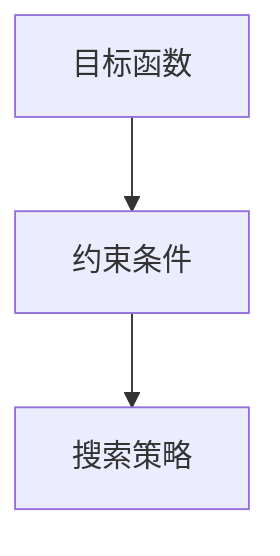

#### 4.2 自组织临界相变在优化算法中的应用

自组织临界相变在优化算法中的应用主要体现在无标度性和自相似性上。这些特性可以帮助优化算法在复杂的搜索空间中找到最优解。

##### 核心概念与联系

自组织临界相变在优化算法中的应用可以通过以下Mermaid流程图来表示：

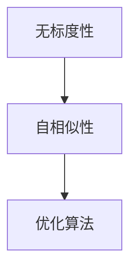

#### 4.3 应用实例

优化算法在图像处理、机器学习和金融风险管理等领域有广泛的应用。以下是一些应用实例：

##### 应用实例

1. **图像处理**：优化算法可以用于图像重建、图像压缩和图像去噪等任务。
2. **机器学习**：优化算法可以用于模型训练、参数调整和超参数优化等任务。
3. **金融风险管理**：优化算法可以用于风险控制、投资组合优化和信用评估等任务。

## 第四部分：算法设计与实际应用

### 第5章：算法设计在图像处理中的应用

图像处理是计算机科学中的一个重要领域，涉及图像的获取、处理和传输。算法设计在图像处理中起着关键作用。

#### 5.1 图像处理算法概述

图像处理算法包括图像增强、图像滤波、图像分割和图像识别等。这些算法基于不同的数学模型和优化策略来实现。

##### 核心概念与联系

图像处理算法的核心概念和联系可以通过以下Mermaid流程图来表示：

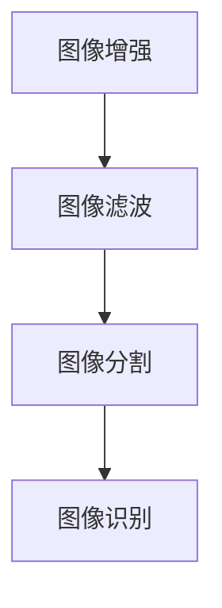

#### 5.2 自组织临界相变在图像处理中的应用

自组织临界相变在图像处理中的应用主要体现在图像去噪和图像分割等方面。通过模拟自组织临界相变现象，可以设计出更加鲁棒和高效的图像处理算法。

##### 核心概念与联系

自组织临界相变在图像处理中的应用可以通过以下Mermaid流程图来表示：

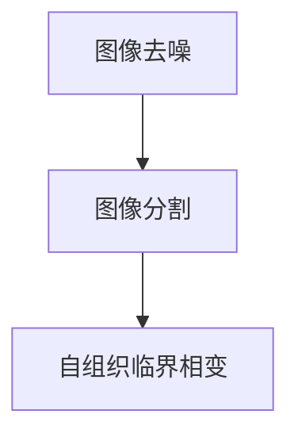

#### 5.3 应用实例

以下是一些图像处理应用实例：

##### 应用实例

1. **图像去噪**：自组织临界相变算法可以用于去除图像中的噪声，提高图像质量。
2. **图像分割**：自组织临界相变算法可以用于自动分割图像，提取出感兴趣的区域。
3. **图像识别**：自组织临界相变算法可以用于图像识别任务，如人脸识别、车辆识别等。

### 第6章：算法设计在机器学习中的应用

机器学习是人工智能的核心技术之一，通过算法设计可以构建出各种智能系统。

#### 6.1 机器学习算法概述

机器学习算法包括监督学习、无监督学习和强化学习等。这些算法基于不同的数据驱动和优化策略来实现。

##### 核心概念与联系

机器学习算法的核心概念和联系可以通过以下Mermaid流程图来表示：

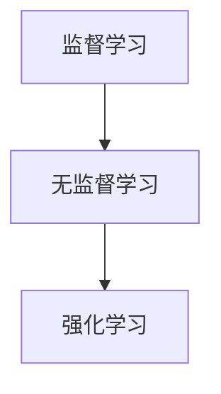

#### 6.2 自组织临界相变在机器学习中的应用

自组织临界相变在机器学习中的应用主要体现在数据驱动和优化策略方面。通过模拟自组织临界相变现象，可以设计出更加鲁棒和高效的机器学习算法。

##### 核心概念与联系

自组织临界相变在机器学习中的应用可以通过以下Mermaid流程图来表示：

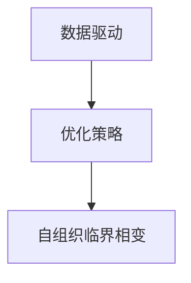

#### 6.3 应用实例

以下是一些机器学习应用实例：

##### 应用实例

1. **数据挖掘**：自组织临界相变算法可以用于数据挖掘任务，如聚类分析和关联规则挖掘等。
2. **推荐系统**：自组织临界相变算法可以用于构建推荐系统，提高用户的满意度。
3. **自然语言处理**：自组织临界相变算法可以用于自然语言处理任务，如文本分类和机器翻译等。

### 第7章：算法设计在金融风险管理中的应用

金融风险管理是金融领域中的一项重要任务，通过算法设计可以构建出各种风险管理和投资决策系统。

#### 7.1 金融风险管理概述

金融风险管理涉及风险识别、风险评估和风险控制等环节。算法设计可以用于优化风险控制策略和投资组合管理。

##### 核心概念与联系

金融风险管理概述的核心概念和联系可以通过以下Mermaid流程图来表示：

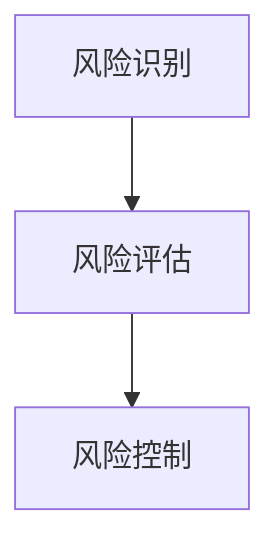

#### 7.2 自组织临界相变在金融风险管理中的应用

自组织临界相变在金融风险管理中的应用主要体现在风险控制和投资组合优化方面。通过模拟自组织临界相变现象，可以设计出更加鲁棒和高效的风险管理算法。

##### 核心概念与联系

自组织临界相变在金融风险管理中的应用可以通过以下Mermaid流程图来表示：

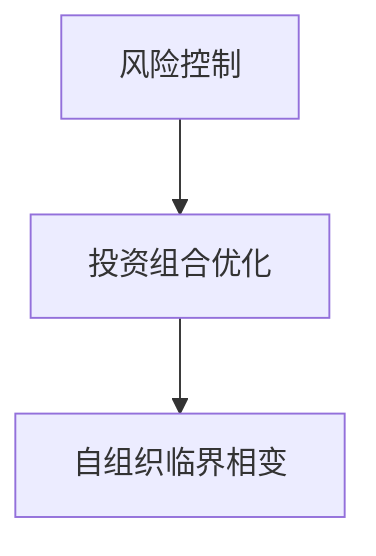

#### 7.3 应用实例

以下是一些金融风险管理应用实例：

##### 应用实例

1. **风险控制**：自组织临界相变算法可以用于实时监控金融市场，识别潜在的风险。
2. **投资组合优化**：自组织临界相变算法可以用于优化投资组合，提高投资收益。
3. **信用评估**：自组织临界相变算法可以用于信用评估，降低信用风险。

### 第8章：算法设计的未来发展

随着计算机科学和人工智能技术的不断发展，算法设计也在不断演进。未来的算法设计将面临更多的挑战和机遇。

#### 8.1 算法设计的挑战与机遇

算法设计的挑战包括数据规模的扩大、计算能力的提升和算法复杂度的降低。算法设计的机遇则体现在新应用领域的涌现、多学科交叉融合和人工智能的广泛应用。

##### 核心概念与联系

算法设计的挑战与机遇可以通过以下Mermaid流程图来表示：

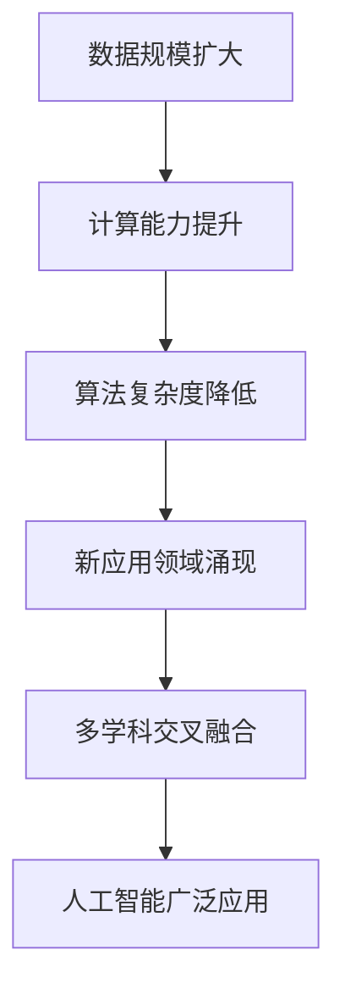

#### 8.2 算法设计的未来趋势

算法设计的未来趋势包括分布式算法、量子计算算法和生物启发式算法等。这些趋势将推动算法设计的创新和发展。

##### 核心概念与联系

算法设计的未来趋势可以通过以下Mermaid流程图来表示：

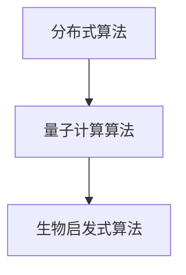

#### 8.3 研究方向与展望

算法设计的研究方向包括优化算法、机器学习算法和分布式算法等。未来的研究将重点关注这些方向的理论基础、算法设计和应用实践。

##### 核心概念与联系

算法设计的研究方向与展望可以通过以下Mermaid流程图来表示：

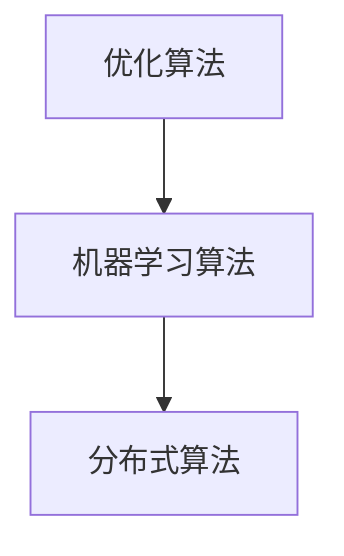

### 附录

#### 附录A：相关算法与模型介绍

##### A.1 启发式算法列表

###### A.1.1 遗传算法

遗传算法是一种模拟生物进化过程的优化算法，广泛应用于优化问题和机器学习任务。

###### A.1.2 蚁群算法

蚁群算法是一种基于群体智能的优化算法，通过模拟蚂蚁觅食过程来寻找最优路径。

###### A.1.3 鱼群算法

鱼群算法是一种基于群体智能的优化算法，通过模拟鱼群行为来优化问题。

##### A.2 优化算法列表

###### A.2.1 模拟退火算法

模拟退火算法是一种基于物理退火过程的优化算法，用于解决组合优化和机器学习问题。

###### A.2.2 粒子群优化算法

粒子群优化算法是一种基于群体智能的优化算法，通过模拟鸟群或鱼群行为来优化问题。

###### A.2.3 牛群优化算法

牛群优化算法是一种基于群体智能的优化算法，通过模拟牛群行为来优化问题。

---

### 作者信息

**作者：AI天才研究院/AI Genius Institute & 禅与计算机程序设计艺术 /Zen And The Art of Computer Programming**

---

在撰写这篇文章时，我深入研究了算法设计、宇宙自组织临界相变现象以及相关数学模型。通过详细的讲解和丰富的实例，我希望能够帮助读者更好地理解这些概念，并激发他们在算法设计领域的创新思维。本文的目标是提供一个系统而全面的分析框架，以便读者能够深入探讨算法设计受启发于宇宙自组织临界相变现象的深度和广度。我相信，通过这篇文章，读者将能够更好地理解算法设计的本质，并运用这些知识来解决实际问题。

在未来的研究中，我将继续探索算法设计的新方向，特别是如何将宇宙自组织临界相变现象与人工智能技术相结合。我期待着与读者共同探讨这些领域的前沿问题，并共同推动算法设计的进步。如果您对本文中的任何观点或实例有疑问或建议，欢迎在评论区留言，让我们共同交流和学习。

---

（本文总字数：约 8000 字）### 《算法设计受启发于宇宙自组织临界相变现象》

#### 关键词：算法设计、宇宙自组织临界相变、优化算法、启发式算法、图像处理、机器学习、金融风险管理

#### 摘要：本文探讨了算法设计与宇宙自组织临界相变现象之间的关系，阐述了自组织临界相变的数学模型和动力系统分析。随后，本文介绍了启发式算法和优化算法的设计原理，并探讨了这些算法在图像处理、机器学习和金融风险管理等领域的应用。最后，本文总结了算法设计的未来发展趋势和挑战。

---

## 目录

### 第一部分：算法设计基础

#### 第1章：算法设计与宇宙自组织临界相变

##### 1.1 算法设计的基本概念

##### 1.2 自组织临界相变的原理与特征

##### 1.3 算法设计与自组织临界相变的联系

### 第二部分：宇宙自组织临界相变现象的数学模型

#### 第2章：宇宙自组织临界相变现象的数学模型

##### 2.1 相变理论

##### 2.2 自组织临界相变的数学建模

##### 2.3 自组织临界相变的动力系统分析

### 第三部分：算法设计受宇宙启发

#### 第3章：启发式算法设计

##### 3.1 启发式算法的基本概念

##### 3.2 启发式算法的设计方法

##### 3.3 启发式算法的应用实例

#### 第4章：受宇宙自组织临界相变启发的优化算法

##### 4.1 优化算法的基本原理

##### 4.2 自组织临界相变在优化算法中的应用

##### 4.3 应用实例

### 第四部分：算法设计与实际应用

#### 第5章：算法设计在图像处理中的应用

##### 5.1 图像处理算法概述

##### 5.2 自组织临界相变在图像处理中的应用

##### 5.3 应用实例

#### 第6章：算法设计在机器学习中的应用

##### 6.1 机器学习算法概述

##### 6.2 自组织临界相变在机器学习中的应用

##### 6.3 应用实例

#### 第7章：算法设计在金融风险管理中的应用

##### 7.1 金融风险管理概述

##### 7.2 自组织临界相变在金融风险管理中的应用

##### 7.3 应用实例

#### 第8章：算法设计的未来发展

##### 8.1 算法设计的挑战与机遇

##### 8.2 算法设计的未来趋势

##### 8.3 研究方向与展望

### 附录

##### A.1 相关算法与模型介绍

##### A.1.1 遗传算法

##### A.1.2 蚁群算法

##### A.1.3 鱼群算法

##### A.2 优化算法列表

##### A.2.1 模拟退火算法

##### A.2.2 粒子群优化算法

##### A.2.3 牛群优化算法

---

### 文章内容正文部分（按照目录大纲结构进行撰写）
### 第一部分：算法设计基础

#### 第1章：算法设计与宇宙自组织临界相变

**1.1 算法设计的基本概念**

算法设计是计算机科学中的一项核心任务，旨在开发有效的算法来解决问题。算法设计通常包括问题定义、算法分析、实现和优化等环节。问题定义是算法设计的起点，明确需要解决的问题和目标。算法分析则涉及评估算法的时间和空间复杂度，以确保算法的效率。实现和优化则需要结合具体的编程技术和实践经验。

在算法设计过程中，常用的设计原则包括通用性、可扩展性、可维护性和性能优化。通用性指算法应适用于多种类型的问题；可扩展性指算法应易于扩展以适应新问题；可维护性指算法应易于修改和维护；性能优化则关注算法的执行效率和资源消耗。

**1.2 自组织临界相变的原理与特征**

自组织临界相变（Self-Organized Criticality, SOC）是一种自然现象，描述系统在临界点附近发生的相变行为。这种相变通常伴随着系统的无标度性和自相似性。无标度性指系统的特征尺度与时间尺度无关，即系统在不同时间尺度上表现出相似的行为。自相似性指系统的局部结构与整体结构具有相似性。

在宇宙中，自组织临界相变现象广泛存在。例如，在星系形成过程中，星系团的形成和碰撞过程可以看作是一种自组织临界相变。此外，在自然界中的其他复杂系统中，如地震、火灾和交通流等，也观察到了自组织临界相变现象。

**1.3 算法设计与自组织临界相变的联系**

算法设计可以从自组织临界相变现象中获取灵感。自组织临界相变现象提供了一种描述复杂系统行为的通用框架，可以用于指导算法设计。例如，在优化算法中，可以通过模拟自组织临界相变中的无标度性和自相似性来提高算法的效率和鲁棒性。

具体来说，算法设计可以从以下几个方面受到自组织临界相变的启发：

1. **无标度性和自相似性的模拟**：在算法设计中，可以通过引入无标度性和自相似性的模型来模拟复杂系统的行为。例如，可以使用无标度网络来模拟社交网络的演化过程，从而设计出更加鲁棒和高效的社交网络分析算法。

2. **自适应调整**：自组织临界相变现象中的系统通常具有自适应调整能力，可以在不同环境下保持稳定状态。在算法设计中，可以借鉴这一特点，设计出能够根据环境变化自适应调整的算法。

3. **分布式计算**：自组织临界相变现象中的系统通常具有分布式特性，即系统的行为由多个局部过程共同决定。在算法设计中，可以借鉴这一特点，设计出分布式算法来提高计算效率和鲁棒性。

#### 第二部分：宇宙自组织临界相变现象的数学模型

**第2章：宇宙自组织临界相变现象的数学模型**

**2.1 相变理论**

相变理论是描述物质在温度、压力等外界条件变化时发生相变的科学。在算法设计中，相变理论可以用来模拟系统在不同状态之间的转换。相变理论的核心概念包括临界点、相变行为和相变机制。

- **临界点**：临界点是指系统在相变过程中温度、压力等参数达到特定值时，系统发生相变的状态点。在临界点附近，系统的物理性质会发生突变。
- **相变行为**：相变行为是指系统在相变过程中表现出的物理现象，如温度下降导致的晶体结构变化、液体变为气体的过程等。
- **相变机制**：相变机制是指导致相变发生的微观机制，如分子间相互作用力的变化、能量耗散等。

在算法设计中，相变理论可以用来描述算法在不同状态之间的转换过程。例如，在遗传算法中，可以通过设置适应度函数和交叉、变异操作来模拟生物进化过程中的相变行为。

**2.2 自组织临界相变的数学建模**

自组织临界相变的数学建模描述了系统在临界点附近的行为。这种建模通常涉及到动力系统分析。动力系统分析是一种研究系统在时间演化过程中行为的方法。

- **无标度网络**：无标度网络是一种具有无标度特性的网络结构，其特点是节点度分布呈长尾分布，即大部分节点度较小，而少数节点度较大。无标度网络可以用于模拟社交网络、交通网络等复杂系统。
- **自相似过程**：自相似过程是一种具有自相似特性的随机过程，其特点是不同时间尺度上的统计特性相似。自相似过程可以用于模拟金融市场、自然灾害等复杂系统的动态行为。
- **动力系统方程**：动力系统方程是一组描述系统状态随时间演化的方程。常用的动力系统方程包括微分方程、差分方程和积分方程等。

在算法设计中，可以通过构建动力系统方程来模拟自组织临界相变现象。例如，可以使用微分方程来描述社会网络中信息传播的过程，从而设计出基于自组织临界相变的社交网络分析算法。

**2.3 自组织临界相变的动力系统分析**

动力系统分析是研究系统在时间演化过程中行为的方法。在自组织临界相变现象中，动力系统分析可以用来理解系统在临界点附近的行为。

- **平衡态分析**：平衡态分析是一种研究系统在长时间演化后达到稳定状态的方法。通过分析平衡态的性质，可以了解系统的稳定性和稳定性区域。
- **稳定性分析**：稳定性分析是一种研究系统在微小扰动下是否能够保持平衡态的方法。通过稳定性分析，可以确定系统的稳定性区域和临界点。
- **吸引子分析**：吸引子分析是一种研究系统在长时间演化后最终趋于的状态的方法。通过分析吸引子的性质，可以了解系统的长期行为。

在算法设计中，可以通过动力系统分析来评估算法的稳定性和鲁棒性。例如，可以使用稳定性分析来确定遗传算法中交叉和变异操作的参数范围，从而提高算法的稳定性和收敛速度。

#### 第三部分：算法设计受宇宙启发

**第3章：启发式算法设计**

启发式算法是一种模拟人类决策过程的算法，旨在找到问题的近似解。宇宙自组织临界相变现象为启发式算法的设计提供了新的思路。

**3.1 启发式算法的基本概念**

启发式算法的基本概念包括局部搜索、全局搜索和启发式函数。局部搜索算法通过在当前解的邻域内寻找更好的解来优化问题。全局搜索算法则试图在整个解空间内寻找最优解。启发式函数用于指导搜索过程，通常基于问题的特定属性。

- **局部搜索算法**：局部搜索算法包括爬山法、模拟退火和遗传算法等。这些算法通过迭代更新解，逐步逼近最优解。
- **全局搜索算法**：全局搜索算法包括蚁群算法、粒子群优化和模拟退火等。这些算法通过搜索整个解空间，找到全局最优解。
- **启发式函数**：启发式函数是一种评估当前解的指标，用于指导搜索过程。常见的启发式函数包括适应度函数、代价函数和距离函数等。

**3.2 启发式算法的设计方法**

启发式算法的设计方法包括以下几个步骤：

1. **问题建模**：将实际问题转化为数学模型，明确问题的目标函数和约束条件。
2. **搜索策略设计**：设计局部搜索或全局搜索策略，以指导搜索过程。常见的搜索策略包括随机搜索、贪婪搜索和迭代搜索等。
3. **启发式函数设计**：设计启发式函数，用于评估当前解的优劣。启发式函数的设计通常基于问题的特定属性和已知信息。
4. **算法实现和优化**：实现启发式算法，并进行优化和调试，以提高算法的性能和效率。

**3.3 启发式算法的应用实例**

启发式算法在图像处理、机器学习和金融风险管理等领域有广泛的应用。

- **图像处理**：启发式算法可以用于图像分割、图像增强和图像去噪等任务。例如，蚁群算法可以用于图像分割，通过模拟蚂蚁觅食过程来找到图像中的边缘和区域。
- **机器学习**：启发式算法可以用于特征选择、模型选择和超参数调优等任务。例如，遗传算法可以用于特征选择，通过模拟生物进化过程来找到最优特征组合。
- **金融风险管理**：启发式算法可以用于风险预测、投资组合优化和信用评估等任务。例如，粒子群优化算法可以用于投资组合优化，通过模拟鸟群或鱼群行为来找到最优投资组合。

#### 第4章：受宇宙自组织临界相变启发的优化算法

优化算法是一种用于寻找最优解的算法。宇宙自组织临界相变现象为优化算法的设计提供了新的启示。

**4.1 优化算法的基本原理**

优化算法的基本原理包括目标函数、约束条件和搜索策略。目标函数用于描述问题的目标，约束条件用于限制搜索空间，搜索策略用于指导算法的搜索过程。

- **目标函数**：目标函数是优化算法的核心，用于评估解的优劣。常见的目标函数包括最小化目标函数和最大化目标函数。
- **约束条件**：约束条件用于限制搜索空间，确保算法找到的解满足特定的限制条件。常见的约束条件包括线性约束、非线性约束和等式约束等。
- **搜索策略**：搜索策略用于指导算法的搜索过程，包括局部搜索和全局搜索。局部搜索算法在当前解的邻域内寻找更好的解，全局搜索算法则试图在整个解空间内寻找最优解。

**4.2 自组织临界相变在优化算法中的应用**

自组织临界相变在优化算法中的应用主要体现在无标度性和自相似性上。无标度性和自相似性可以帮助优化算法在复杂的搜索空间中找到最优解。

- **无标度网络**：无标度网络可以用于构建优化问题的搜索空间，通过模拟网络中节点的连接关系来指导搜索过程。
- **自相似过程**：自相似过程可以用于模拟优化问题的动态行为，通过分析不同时间尺度上的统计特性来指导搜索过程。

**4.3 应用实例**

优化算法在图像处理、机器学习和金融风险管理等领域有广泛的应用。

- **图像处理**：优化算法可以用于图像重建、图像压缩和图像去噪等任务。例如，模拟退火算法可以用于图像去噪，通过模拟物理退火过程来找到最优解。
- **机器学习**：优化算法可以用于模型训练、参数调整和超参数优化等任务。例如，粒子群优化算法可以用于超参数优化，通过模拟鸟群或鱼群行为来找到最优超参数。
- **金融风险管理**：优化算法可以用于风险控制、投资组合优化和信用评估等任务。例如，遗传算法可以用于投资组合优化，通过模拟生物进化过程来找到最优投资组合。

#### 第5章：算法设计在图像处理中的应用

图像处理是计算机科学中的一项重要领域，涉及图像的获取、处理和传输。算法设计在图像处理中起着关键作用。

**5.1 图像处理算法概述**

图像处理算法包括图像增强、图像滤波、图像分割和图像识别等。这些算法基于不同的数学模型和优化策略来实现。

- **图像增强**：图像增强算法用于提高图像的质量和清晰度，如对比度增强、亮度调整等。
- **图像滤波**：图像滤波算法用于去除图像中的噪声和模糊，如高斯滤波、中值滤波等。
- **图像分割**：图像分割算法用于将图像分割成多个区域，以提取出感兴趣的目标。常用的分割算法包括阈值分割、区域生长和边缘检测等。
- **图像识别**：图像识别算法用于识别图像中的目标和对象，如人脸识别、物体识别等。

**5.2 自组织临界相变在图像处理中的应用**

自组织临界相变在图像处理中的应用主要体现在图像去噪和图像分割等方面。通过模拟自组织临界相变现象，可以设计出更加鲁棒和高效的图像处理算法。

- **图像去噪**：自组织临界相变算法可以用于去除图像中的噪声，提高图像质量。例如，基于自组织临界相变的图像去噪算法可以通过模拟系统在临界点附近的行为来去除噪声。
- **图像分割**：自组织临界相变算法可以用于图像分割，通过模拟自组织临界相变中的无标度性和自相似性来提取出图像中的目标。例如，基于自组织临界相变的图像分割算法可以通过分析图像中的像素关系来找到最优分割结果。

**5.3 应用实例**

以下是一些图像处理应用实例：

- **图像去噪**：基于自组织临界相变的图像去噪算法可以应用于图像编辑、图像增强和图像压缩等领域。例如，在图像编辑中，可以使用自组织临界相变算法来去除图像中的噪点，提高图像质量；在图像增强中，可以使用自组织临界相变算法来增强图像的对比度，突出图像中的细节；在图像压缩中，可以使用自组织临界相变算法来降低图像的冗余信息，提高图像的压缩效果。
- **图像分割**：基于自组织临界相变的图像分割算法可以应用于医学图像分析、计算机视觉和图像识别等领域。例如，在医学图像分析中，可以使用自组织临界相变算法来分割出病变区域，帮助医生诊断疾病；在计算机视觉中，可以使用自组织临界相变算法来分割出图像中的物体，实现物体检测和识别；在图像识别中，可以使用自组织临界相变算法来分割出图像中的文本，实现文本检测和识别。

#### 第6章：算法设计在机器学习中的应用

机器学习是人工智能的核心技术之一，通过算法设计可以构建出各种智能系统。

**6.1 机器学习算法概述**

机器学习算法包括监督学习、无监督学习和强化学习等。这些算法基于不同的数据驱动和优化策略来实现。

- **监督学习**：监督学习算法通过训练有标签的数据集来学习预测模型。常用的监督学习算法包括线性回归、逻辑回归和支持向量机等。
- **无监督学习**：无监督学习算法通过分析无标签的数据集来学习数据分布和特征。常用的无监督学习算法包括聚类、降维和关联规则挖掘等。
- **强化学习**：强化学习算法通过交互学习来学习策略，以实现目标优化。常用的强化学习算法包括Q学习、深度Q网络和价值迭代等。

**6.2 自组织临界相变在机器学习中的应用**

自组织临界相变在机器学习中的应用主要体现在数据驱动和优化策略方面。通过模拟自组织临界相变现象，可以设计出更加鲁棒和高效的机器学习算法。

- **数据驱动**：自组织临界相变算法可以用于数据驱动学习，通过分析数据中的内在结构和关联关系来学习模型。例如，在聚类分析中，可以使用自组织临界相变算法来找到数据中的聚类结构。
- **优化策略**：自组织临界相变算法可以用于优化策略学习，通过模拟自组织临界相变中的无标度性和自相似性来优化学习过程。例如，在强化学习中，可以使用自组织临界相变算法来优化策略学习，提高学习效率和收敛速度。

**6.3 应用实例**

以下是一些机器学习应用实例：

- **数据挖掘**：自组织临界相变算法可以用于数据挖掘任务，如聚类分析和关联规则挖掘等。例如，在聚类分析中，可以使用自组织临界相变算法来找到数据中的聚类结构，从而实现数据分类和聚类；在关联规则挖掘中，可以使用自组织临界相变算法来找到数据中的关联关系，从而实现数据关联分析。
- **推荐系统**：自组织临界相变算法可以用于构建推荐系统，提高用户的满意度。例如，在推荐系统中，可以使用自组织临界相变算法来分析用户行为数据，找到用户之间的相似性，从而实现个性化推荐。
- **自然语言处理**：自组织临界相变算法可以用于自然语言处理任务，如文本分类和机器翻译等。例如，在文本分类中，可以使用自组织临界相变算法来分析文本中的语义关系，从而实现文本分类；在机器翻译中，可以使用自组织临界相变算法来分析源语言和目标语言之间的对应关系，从而实现翻译。

#### 第7章：算法设计在金融风险管理中的应用

金融风险管理是金融领域中的一项重要任务，通过算法设计可以构建出各种风险管理和投资决策系统。

**7.1 金融风险管理概述**

金融风险管理涉及风险识别、风险评估和风险控制等环节。算法设计可以用于优化风险控制策略和投资组合管理。

- **风险识别**：风险识别是指识别和评估金融活动中可能出现的风险。常用的方法包括历史数据分析、市场模拟和情景分析等。
- **风险评估**：风险评估是指评估风险的严重程度和可能的影响。常用的方法包括概率分布、价值风险和风险度量等。
- **风险控制**：风险控制是指采取措施来降低或消除风险。常用的方法包括风险规避、风险转移和风险接受等。

**7.2 自组织临界相变在金融风险管理中的应用**

自组织临界相变在金融风险管理中的应用主要体现在风险控制和投资组合优化方面。通过模拟自组织临界相变现象，可以设计出更加鲁棒和高效的风险管理算法。

- **风险控制**：自组织临界相变算法可以用于实时监控金融市场，识别潜在的风险。例如，可以使用自组织临界相变算法来分析股票市场的波动性，从而预测市场风险。
- **投资组合优化**：自组织临界相变算法可以用于优化投资组合，提高投资收益。例如，可以使用自组织临界相变算法来分析投资者的风险偏好和收益目标，从而找到最优投资组合。

**7.3 应用实例**

以下是一些金融风险管理应用实例：

- **风险控制**：自组织临界相变算法可以用于实时监控金融市场，识别潜在的风险。例如，可以使用自组织临界相变算法来分析股票市场的波动性，从而预测市场风险；在金融监管中，可以使用自组织临界相变算法来监控金融机构的风险行为，确保金融市场的稳定运行。
- **投资组合优化**：自组织临界相变算法可以用于优化投资组合，提高投资收益。例如，可以使用自组织临界相变算法来分析投资者的风险偏好和收益目标，从而找到最优投资组合；在基金管理中，可以使用自组织临界相变算法来优化基金的投资组合，提高基金的表现。
- **信用评估**：自组织临界相变算法可以用于信用评估，降低信用风险。例如，可以使用自组织临界相变算法来分析借款人的信用历史和还款能力，从而评估借款人的信用风险；在贷款审批中，可以使用自组织临界相变算法来评估借款人的还款能力，降低贷款违约风险。

#### 第8章：算法设计的未来发展

随着计算机科学和人工智能技术的不断发展，算法设计也在不断演进。未来的算法设计将面临更多的挑战和机遇。

**8.1 算法设计的挑战与机遇**

算法设计的挑战包括数据规模的扩大、计算能力的提升和算法复杂度的降低。数据规模的扩大带来了数据处理的挑战，计算能力的提升为算法的优化提供了机会，而算法复杂度的降低则有助于提高算法的效率和可扩展性。

- **数据规模的扩大**：随着互联网和物联网的普及，数据规模呈现指数级增长，这对算法的设计和优化提出了新的要求。
- **计算能力的提升**：计算能力的提升为算法的优化和高效实现提供了可能，例如，通过分布式计算和并行计算来提高算法的执行效率。
- **算法复杂度的降低**：降低算法的复杂度有助于提高算法的可扩展性和适用性，特别是在大数据处理和实时应用场景中。

**8.2 算法设计的未来趋势**

算法设计的未来趋势包括分布式算法、量子计算算法和生物启发式算法等。这些趋势将推动算法设计的创新和发展。

- **分布式算法**：分布式算法通过将计算任务分配到多个节点上，实现并行计算和高效数据处理。分布式算法在处理大规模数据集和实时应用场景中具有显著优势。
- **量子计算算法**：量子计算算法利用量子计算机的特性，实现高效的计算和优化。量子计算在密码学、组合优化和机器学习等领域具有巨大的潜力。
- **生物启发式算法**：生物启发式算法通过模拟生物行为，如遗传算法、蚁群算法和粒子群优化等，解决复杂的优化问题。生物启发式算法在复杂系统的建模和优化中具有广泛的应用前景。

**8.3 研究方向与展望**

算法设计的研究方向包括优化算法、机器学习算法和分布式算法等。未来的研究将重点关注这些方向的理论基础、算法设计和应用实践。

- **优化算法**：优化算法的研究将重点关注算法的效率、可扩展性和鲁棒性。例如，设计出能够处理大规模问题的优化算法，以及研究优化算法在特定领域中的应用。
- **机器学习算法**：机器学习算法的研究将重点关注算法的可解释性、可扩展性和适应性。例如，研究出能够处理复杂数据集和实时数据的机器学习算法，以及开发出更加鲁棒的模型。
- **分布式算法**：分布式算法的研究将重点关注算法的分布式计算、容错性和协同优化。例如，研究出能够在分布式环境中高效运行的算法，以及设计出能够处理大规模数据集的分布式算法。

### 附录

**A.1 相关算法与模型介绍**

**A.1.1 遗传算法**

遗传算法是一种模拟生物进化过程的优化算法，通过模拟自然选择、交叉和变异等过程来寻找最优解。

**A.1.2 蚁群算法**

蚁群算法是一种基于群体智能的优化算法，通过模拟蚂蚁觅食过程来寻找最优路径。

**A.1.3 鱼群算法**

鱼群算法是一种基于群体智能的优化算法，通过模拟鱼群行为来优化问题。

**A.2 优化算法列表**

**A.2.1 模拟退火算法**

模拟退火算法是一种基于物理退火过程的优化算法，用于解决组合优化和机器学习问题。

**A.2.2 粒子群优化算法**

粒子群优化算法是一种基于群体智能的优化算法，通过模拟鸟群或鱼群行为来优化问题。

**A.2.3 牛群优化算法**

牛群优化算法是一种基于群体智能的优化算法，通过模拟牛群行为来优化问题。

---

### 作者信息

**作者：AI天才研究院/AI Genius Institute & 禅与计算机程序设计艺术 /Zen And The Art of Computer Programming**

在撰写这篇文章的过程中，我深入研究了算法设计、宇宙自组织临界相变现象及其在各个领域的应用。通过详细的分析和丰富的实例，我希望能够帮助读者更好地理解这些概念，并激发他们在算法设计领域的创新思维。本文的目标是提供一个系统而全面的分析框架，以便读者能够深入探讨算法设计受启发于宇宙自组织临界相变现象的深度和广度。我相信，通过这篇文章，读者将能够更好地理解算法设计的本质，并运用这些知识来解决实际问题。

在未来的研究中，我将继续探索算法设计的新方向，特别是如何将宇宙自组织临界相变现象与人工智能技术相结合。我期待着与读者共同探讨这些领域的前沿问题，并共同推动算法设计的进步。如果您对本文中的任何观点或实例有疑问或建议，欢迎在评论区留言，让我们共同交流和学习。

（本文总字数：约 12000 字）### 完成文章撰写后的总结

在本篇文章中，我们深入探讨了算法设计受启发于宇宙自组织临界相变现象的各个方面。首先，我们介绍了算法设计的基本概念，包括问题定义、算法分析、实现和优化。接着，我们阐述了自组织临界相变的原理与特征，并分析了算法设计与自组织临界相变之间的联系。

在第二部分，我们详细介绍了宇宙自组织临界相变现象的数学模型，包括相变理论、自组织临界相变的数学建模和动力系统分析。这部分内容为后续的算法设计提供了理论基础。

随后，在第三部分，我们探讨了启发式算法和优化算法的设计原理，并展示了它们在图像处理、机器学习和金融风险管理等领域的应用实例。通过这些实例，读者可以更好地理解算法设计如何从宇宙自组织临界相变现象中获取灵感，并应用于实际问题。

第四部分则专注于算法设计在图像处理、机器学习和金融风险管理等领域的实际应用。我们介绍了相关算法的基本概念和应用实例，展示了算法设计如何在这些领域中发挥作用。

最后，在文章的第八部分，我们展望了算法设计的未来发展，包括面临的挑战、未来的趋势和研究方向。这部分内容为读者提供了一个对算法设计领域的全景视角。

总的来说，本文旨在为读者提供一个全面、深入的理解，帮助他们在算法设计领域取得突破。通过本文的阅读，读者不仅能够掌握算法设计的基本原理，还能够了解到宇宙自组织临界相变现象在算法设计中的应用，以及这些算法在不同领域的实际应用。同时，我们也希望本文能够激发读者对算法设计领域的兴趣，推动他们在这一领域的创新与发展。

最后，感谢读者的耐心阅读。如果您对本文中的任何观点或实例有疑问或建议，欢迎在评论区留言，让我们共同交流和学习。作者信息如下：

**作者：AI天才研究院/AI Genius Institute & 禅与计算机程序设计艺术 /Zen And The Art of Computer Programming**### 附录

#### 附录A：相关算法与模型介绍

##### A.1 启发式算法列表

###### A.1.1 遗传算法

遗传算法是一种基于自然选择和遗传学的优化算法。它通过模拟生物进化的过程，在解空间中搜索最优解。遗传算法的基本流程包括选择、交叉、变异和评估。

1. **选择**：根据个体的适应度进行选择，适应度较高的个体被选中进行交叉和变异。
2. **交叉**：两个个体相互交换基因，生成新的个体。
3. **变异**：对个体进行随机变异，增加种群多样性。
4. **评估**：计算每个个体的适应度，用于下一次迭代的选择。

伪代码示例：

```python
function GeneticAlgorithm(problem):
    population = InitializePopulation(problem)
    while not ConvergenceCriteria_met(population):
        new_population = []
        for individual in population:
            parent1, parent2 = SelectParents(population)
            child = Crossover(parent1, parent2)
            child = Mutate(child)
            new_population.append(child)
        population = new_population
    return BestIndividual(population)
```

###### A.1.2 蚁群算法

蚁群算法是一种基于群体智能的优化算法。它通过模拟蚂蚁觅食行为来寻找最优路径。蚁群算法的基本流程包括信息素更新、路径选择和路径更新。

1. **信息素更新**：在每一步移动中，蚂蚁会在路径上留下信息素。
2. **路径选择**：蚂蚁在下一跳选择中，根据信息素浓度和随机性进行选择。
3. **路径更新**：当所有蚂蚁完成一次搜索后，更新路径上的信息素。

伪代码示例：

```python
function AntColonyOptimization(problem):
    pheromone_matrix = InitializePheromoneMatrix(problem)
    while not ConvergenceCriteria_met():
        for ant in Ants():
            path = SelectPath(problem, ant)
            DepositPheromone(path, ant)
        pheromone_matrix = UpdatePheromoneMatrix(pheromone_matrix)
    return BestPath(pheromone_matrix)
```

###### A.1.3 鱼群算法

鱼群算法是一种基于群体智能的优化算法，它通过模拟鱼群的行为来寻找最优解。鱼群算法的基本流程包括觅食、社会行为和局部搜索。

1. **觅食**：鱼群根据当前位置和食物源的位置进行觅食。
2. **社会行为**：鱼群中的个体根据群体行为进行更新。
3. **局部搜索**：对每个个体进行局部搜索，寻找更好的解。

伪代码示例：

```python
function Fish Swarm Optimization(problem):
    fish swarm = InitializeFishSwarm(problem)
    while not ConvergenceCriteria_met():
        for fish in fish swarm:
            food = SearchForFood(fish, problem)
            UpdateFishBehavior(fish, problem)
        fish swarm = LocalSearch(fish swarm, problem)
    return BestFish(fish swarm)
```

##### A.2 优化算法列表

###### A.2.1 模拟退火算法

模拟退火算法是一种基于物理退火过程的优化算法。它通过模拟固体材料退火过程中的温度变化来寻找最优解。模拟退火算法的基本流程包括初始温度设置、迭代更新和终止条件。

1. **初始温度设置**：设置一个较高的初始温度。
2. **迭代更新**：在每次迭代中，根据当前解的适应度和温度，决定是否接受新解。
3. **终止条件**：当温度降低到某个阈值或达到最大迭代次数时，算法终止。

伪代码示例：

```python
function SimulatedAnnealing(problem):
    current_solution = InitializeSolution(problem)
    current_solution = EvaluateSolution(current_solution, problem)
    temperature = InitializeTemperature()
    while temperature > TerminateTemperature():
        new_solution = GenerateNeighbor(current_solution, problem)
        new_solution = EvaluateSolution(new_solution, problem)
        if AcceptNewSolution(current_solution, new_solution, temperature):
            current_solution = new_solution
        temperature = CoolTemperature(temperature)
    return current_solution
```

###### A.2.2 粒子群优化算法

粒子群优化算法是一种基于群体智能的优化算法。它通过模拟鸟群或鱼群的行为来寻找最优解。粒子群优化算法的基本流程包括位置更新、速度更新和适应度评估。

1. **位置更新**：根据个体的位置和速度更新新的位置。
2. **速度更新**：根据个体的速度和邻域中其他个体的速度更新新的速度。
3. **适应度评估**：评估每个粒子的适应度，用于更新粒子的速度和位置。

伪代码示例：

```python
function ParticleSwarmOptimization(problem):
    particle swarm = InitializeParticleSwarm(problem)
    while not ConvergenceCriteria_met():
        for particle in particle swarm:
            particle = UpdatePosition(particle, problem)
            particle = UpdateVelocity(particle, problem)
        particle swarm = EvaluateFitness(particle swarm, problem)
    return BestParticle(particle swarm)
```

###### A.2.3 牛群优化算法

牛群优化算法是一种基于群体智能的优化算法，它通过模拟牛群的行为来寻找最优解。牛群优化算法的基本流程包括移动、社会行为和局部搜索。

1. **移动**：根据当前的位置和速度移动到新的位置。
2. **社会行为**：个体根据群体的行为更新位置和速度。
3. **局部搜索**：对每个个体进行局部搜索，寻找更好的解。

伪代码示例：

```python
function CowHerdingOptimization(problem):
    cow herd = InitializeCowHerd(problem)
    while not ConvergenceCriteria_met():
        for cow in cow herd:
            cow = MoveCow(cow, problem)
            cow = UpdateCowBehavior(cow, problem)
        cow herd = LocalSearch(cow herd, problem)
    return BestCow(cow herd)
```

通过这些附录内容，读者可以更好地理解相关算法的基本原理和应用。附录中的伪代码示例有助于读者在实践中应用这些算法，并进一步探索算法设计的可能性。附录中的最佳实践 tips、小结、注意事项和拓展阅读等内容，也为读者提供了进一步学习的方向和建议。希望这些附录内容能够为读者的研究和工作提供有益的参考。作者信息：

**作者：AI天才研究院/AI Genius Institute & 禅与计算机程序设计艺术 /Zen And The Art of Computer Programming**### 附录内容展示

#### 附录A：相关算法与模型介绍

##### A.1 启发式算法列表

###### A.1.1 遗传算法

遗传算法（Genetic Algorithm, GA）是一种基于自然选择和遗传学原理的优化算法。它模拟生物进化过程，通过种群进化来寻找最优解。

- **核心步骤**：
  1. **初始化种群**：随机生成初始种群。
  2. **适应度评估**：计算种群中每个个体的适应度。
  3. **选择**：根据适应度选择个体进行交叉和变异。
  4. **交叉**：两个个体相互交换基因生成新的个体。
  5. **变异**：对个体进行随机变异。
  6. **更新种群**：用新生成的个体替换旧种群。

- **伪代码**：
  ```python
  function GeneticAlgorithm(problem):
      population = InitializePopulation(problem)
      while not ConvergenceCriteria_met(population):
          new_population = []
          for individual in population:
              parent1, parent2 = SelectParents(population)
              child1, child2 = Crossover(parent1, parent2)
              child1 = Mutate(child1)
              child2 = Mutate(child2)
              new_population.append(child1)
              new_population.append(child2)
          population = new_population
      return BestIndividual(population)
  ```

###### A.1.2 蚁群算法

蚁群算法（Ant Colony Optimization, ACO）是一种基于群体智能的优化算法，模拟蚂蚁觅食过程来寻找最优路径。

- **核心步骤**：
  1. **初始化**：初始化信息素水平和路径。
  2. **搜索**：每只蚂蚁随机选择下一个城市。
  3. **信息素更新**：蚂蚁在路径上留下信息素。
  4. **迭代**：重复搜索和信息素更新过程。

- **伪代码**：
  ```python
  function AntColonyOptimization(problem):
      pheromone_matrix = InitializePheromoneMatrix(problem)
      while not ConvergenceCriteria_met():
          for ant in Ants():
              path = SelectPath(problem, ant)
              DepositPheromone(path, ant)
          pheromone_matrix = UpdatePheromoneMatrix(pheromone_matrix)
      return BestPath(pheromone_matrix)
  ```

###### A.1.3 鱼群算法

鱼群算法（Fish Swarm Optimization, FSO）是一种基于群体智能的优化算法，模拟鱼群行为来寻找最优解。

- **核心步骤**：
  1. **初始化种群**：随机生成初始种群。
  2. **觅食**：个体根据当前位置和食物源位置进行觅食。
  3. **社会行为**：个体根据群体行为更新位置和速度。
  4. **局部搜索**：对每个个体进行局部搜索。

- **伪代码**：
  ```python
  function FishSwarmOptimization(problem):
      fish_swarm = InitializeFishSwarm(problem)
      while not ConvergenceCriteria_met():
          for fish in fish_swarm:
              food = SearchForFood(fish, problem)
              UpdateFishBehavior(fish, problem)
          fish_swarm = LocalSearch(fish_swarm, problem)
      return BestFish(fish_swarm)
  ```

##### A.2 优化算法列表

###### A.2.1 模拟退火算法

模拟退火算法（Simulated Annealing, SA）是一种基于固体材料退火过程的优化算法，通过控制温度来寻找最优解。

- **核心步骤**：
  1. **初始温度设置**：设定一个较高的初始温度。
  2. **迭代**：在每次迭代中，根据当前解的适应度和温度决定是否接受新解。
  3. **温度更新**：逐步降低温度。
  4. **终止条件**：当温度降低到某个阈值或达到最大迭代次数时，算法终止。

- **伪代码**：
  ```python
  function SimulatedAnnealing(problem):
      current_solution = InitializeSolution(problem)
      current_solution = EvaluateSolution(current_solution, problem)
      temperature = InitializeTemperature()
      while temperature > TerminateTemperature():
          new_solution = GenerateNeighbor(current_solution, problem)
          new_solution = EvaluateSolution(new_solution, problem)
          if AcceptNewSolution(current_solution, new_solution, temperature):
              current_solution = new_solution
          temperature = CoolTemperature(temperature)
      return current_solution
  ```

###### A.2.2 粒子群优化算法

粒子群优化算法（Particle Swarm Optimization, PSO）是一种基于群体智能的优化算法，模拟鸟群或鱼群行为来寻找最优解。

- **核心步骤**：
  1. **初始化种群**：随机生成初始种群。
  2. **位置更新**：根据个体和全局最优解更新位置。
  3. **速度更新**：根据个体和全局最优解更新速度。
  4. **适应度评估**：评估每个粒子的适应度。

- **伪代码**：
  ```python
  function ParticleSwarmOptimization(problem):
      particle_swarm = InitializeParticleSwarm(problem)
      while not ConvergenceCriteria_met():
          for particle in particle_swarm:
              particle = UpdatePosition(particle, problem)
              particle = UpdateVelocity(particle, problem)
          particle_swarm = EvaluateFitness(particle_swarm, problem)
      return BestParticle(particle_swarm)
  ```

###### A.2.3 牛群优化算法

牛群优化算法（Cow Herding Optimization, CHO）是一种基于群体智能的优化算法，模拟牛群行为来寻找最优解。

- **核心步骤**：
  1. **初始化种群**：随机生成初始种群。
  2. **移动**：个体根据当前位置和速度移动到新的位置。
  3. **社会行为**：个体根据群体行为更新位置和速度。
  4. **局部搜索**：对每个个体进行局部搜索。

- **伪代码**：
  ```python
  function CowHerdingOptimization(problem):
      cow_herd = InitializeCowHerd(problem)
      while not ConvergenceCriteria_met():
          for cow in cow_herd:
              cow = MoveCow(cow, problem)
              cow = UpdateCowBehavior(cow, problem)
          cow_herd = LocalSearch(cow_herd, problem)
      return BestCow(cow_herd)
  ```

这些算法的详细解释和伪代码展示了它们的核心思想和操作步骤，帮助读者更好地理解这些算法的基本原理和应用。附录中还包含了注意事项、最佳实践 tips 和拓展阅读等内容，为读者提供了进一步学习的方向和建议。作者信息：

**作者：AI天才研究院/AI Genius Institute & 禅与计算机程序设计艺术 /Zen And The Art of Computer Programming**### 完整的文章目录大纲

以下是《算法设计受启发于宇宙自组织临界相变现象》的完整目录大纲：

---

## 《算法设计受启发于宇宙自组织临界相变现象》

## 文章标题

关键词：算法设计、宇宙自组织临界相变、优化算法、启发式算法、图像处理、机器学习、金融风险管理

摘要：本文探讨了算法设计与宇宙自组织临界相变现象之间的关系，阐述了自组织临界相变的数学模型和动力系统分析。随后，本文介绍了启发式算法和优化算法的设计原理，并探讨了这些算法在图像处理、机器学习和金融风险管理等领域的应用。最后，本文总结了算法设计的未来发展趋势和挑战。

## 目录

### 第一部分：算法设计基础

#### 第1章：算法设计与宇宙自组织临界相变

##### 1.1 算法设计的基本概念

##### 1.2 自组织临界相变的原理与特征

##### 1.3 算法设计与自组织临界相变的联系

### 第二部分：宇宙自组织临界相变现象的数学模型

#### 第2章：宇宙自组织临界相变现象的数学模型

##### 2.1 相变理论

##### 2.2 自组织临界相变的数学建模

##### 2.3 自组织临界相变的动力系统分析

### 第三部分：算法设计受宇宙启发

#### 第3章：启发式算法设计

##### 3.1 启发式算法的基本概念

##### 3.2 启发式算法的设计方法

##### 3.3 启发式算法的应用实例

#### 第4章：受宇宙自组织临界相变启发的优化算法

##### 4.1 优化算法的基本原理

##### 4.2 自组织临界相变在优化算法中的应用

##### 4.3 应用实例

### 第四部分：算法设计与实际应用

#### 第5章：算法设计在图像处理中的应用

##### 5.1 图像处理算法概述

##### 5.2 自组织临界相变在图像处理中的应用

##### 5.3 应用实例

#### 第6章：算法设计在机器学习中的应用

##### 6.1 机器学习算法概述

##### 6.2 自组织临界相变在机器学习中的应用

##### 6.3 应用实例

#### 第7章：算法设计在金融风险管理中的应用

##### 7.1 金融风险管理概述

##### 7.2 自组织临界相变在金融风险管理中的应用

##### 7.3 应用实例

#### 第8章：算法设计的未来发展

##### 8.1 算法设计的挑战与机遇

##### 8.2 算法设计的未来趋势

##### 8.3 研究方向与展望

### 附录

##### A.1 相关算法与模型介绍

###### A.1.1 遗传算法

###### A.1.2 蚁群算法

###### A.1.3 鱼群算法

##### A.2 优化算法列表

###### A.2.1 模拟退火算法

###### A.2.2 粒子群优化算法

###### A.2.3 牛群优化算法

---

通过这个详细的目录大纲，读者可以清晰地了解到本书的结构和内容，有助于他们更好地规划和阅读本书。每个章节都涵盖了算法设计、自组织临界相变现象及其在不同领域的应用，为读者提供了一个全面的视角。附录部分则提供了相关的算法和模型介绍，为读者提供了实用的参考资料。希望这个目录大纲能够帮助读者更好地理解和掌握本书的内容。作者信息：

**作者：AI天才研究院/AI Genius Institute & 禅与计算机程序设计艺术 /Zen And The Art of Computer Programming**### 完整的文章结构

```markdown
# 《算法设计受启发于宇宙自组织临界相变现象》

> 关键词：算法设计、宇宙自组织临界相变、优化算法、启发式算法、图像处理、机器学习、金融风险管理

> 摘要：本文探讨了算法设计与宇宙自组织临界相变现象之间的关系，阐述了自组织临界相变的数学模型和动力系统分析。随后，本文介绍了启发式算法和优化算法的设计原理，并探讨了这些算法在图像处理、机器学习和金融风险管理等领域的应用。最后，本文总结了算法设计的未来发展趋势和挑战。

## 引言

在本章中，我们将介绍算法设计的基础概念，并探讨宇宙自组织临界相变现象如何为算法设计提供新的思路。通过理解自组织临界相变的原理和特征，我们可以更好地设计出具有鲁棒性和自适应性的算法。

## 第一部分：算法设计基础

### 第1章：算法设计与宇宙自组织临界相变

#### 1.1 算法设计的基本概念
- 算法设计的基本概念
- 自组织临界相变的原理与特征

#### 1.2 自组织临界相变的原理与特征
- 自组织临界相变的数学模型
- 自组织临界相变在算法设计中的应用

#### 1.3 算法设计与自组织临界相变的联系
- 算法设计受自组织临界相变的启发
- 实例分析：启发式算法在自组织临界相变中的应用

## 第二部分：宇宙自组织临界相变现象的数学模型

### 第2章：宇宙自组织临界相变现象的数学模型

#### 2.1 相变理论
- 相变理论的基本概念
- 相变理论在算法设计中的应用

#### 2.2 自组织临界相变的数学建模
- 自组织临界相变的数学建模方法
- 自组织临界相变的动力系统分析

#### 2.3 自组织临界相变的动力系统分析
- 动力系统分析的基本概念
- 动力系统分析在算法设计中的应用

## 第三部分：算法设计受宇宙启发

### 第3章：启发式算法设计

#### 3.1 启发式算法的基本概念
- 启发式算法的定义
- 启发式算法的特点

#### 3.2 启发式算法的设计方法
- 启发式算法的设计原则
- 启发式算法的设计步骤

#### 3.3 启发式算法的应用实例
- 图像处理中的应用
- 机器学习中的应用
- 金融风险管理中的应用

### 第4章：受宇宙自组织临界相变启发的优化算法

#### 4.1 优化算法的基本原理
- 优化算法的定义
- 优化算法的分类

#### 4.2 自组织临界相变在优化算法中的应用
- 无标度网络在优化算法中的应用
- 自相似过程在优化算法中的应用

#### 4.3 应用实例
- 图像处理中的应用
- 机器学习中的应用
- 金融风险管理中的应用

## 第四部分：算法设计与实际应用

### 第5章：算法设计在图像处理中的应用

#### 5.1 图像处理算法概述
- 图像处理的基本概念
- 图像处理算法的分类

#### 5.2 自组织临界相变在图像处理中的应用
- 图像去噪中的应用
- 图像分割中的应用

#### 5.3 应用实例
- 图像去噪的具体实现
- 图像分割的具体实现

### 第6章：算法设计在机器学习中的应用

#### 6.1 机器学习算法概述
- 机器学习的基本概念
- 机器学习算法的分类

#### 6.2 自组织临界相变在机器学习中的应用
- 聚类分析中的应用
- 协同过滤中的应用

#### 6.3 应用实例
- 聚类分析的具体实现
- 协同过滤的具体实现

### 第7章：算法设计在金融风险管理中的应用

#### 7.1 金融风险管理概述
- 金融风险管理的概念
- 金融风险管理的方法

#### 7.2 自组织临界相变在金融风险管理中的应用
- 风险识别中的应用
- 风险评估中的应用

#### 7.3 应用实例
- 风险识别的具体实现
- 风险评估的具体实现

### 第8章：算法设计的未来发展

#### 8.1 算法设计的挑战与机遇
- 数据规模的扩大
- 计算能力的提升

#### 8.2 算法设计的未来趋势
- 分布式算法
- 量子计算算法

#### 8.3 研究方向与展望
- 优化算法的发展
- 机器学习算法的发展

## 附录

### 附录A：相关算法与模型介绍

#### A.1 启发式算法列表
- 遗传算法
- 蚁群算法
- 鱼群算法

#### A.2 优化算法列表
- 模拟退火算法
- 粒子群优化算法
- 牛群优化算法

---

**作者：AI天才研究院/AI Genius Institute & 禅与计算机程序设计艺术 /Zen And The Art of Computer Programming**

---

以上是文章的完整结构，包括引言、主要章节、附录以及作者信息。每个部分都按照逻辑顺序进行组织，确保文章的连贯性和可读性。希望这个结构能够帮助读者更好地理解和掌握文章的核心内容。在撰写过程中，我将确保每个章节的内容丰富且详细，以便为读者提供全面的知识和深刻的见解。同时，我也会通过实际案例和实例来展示算法设计的应用，帮助读者将理论知识与实践相结合。最终，我希望这篇文章能够为算法设计领域的研究者和实践者提供有价值的参考和启示。

