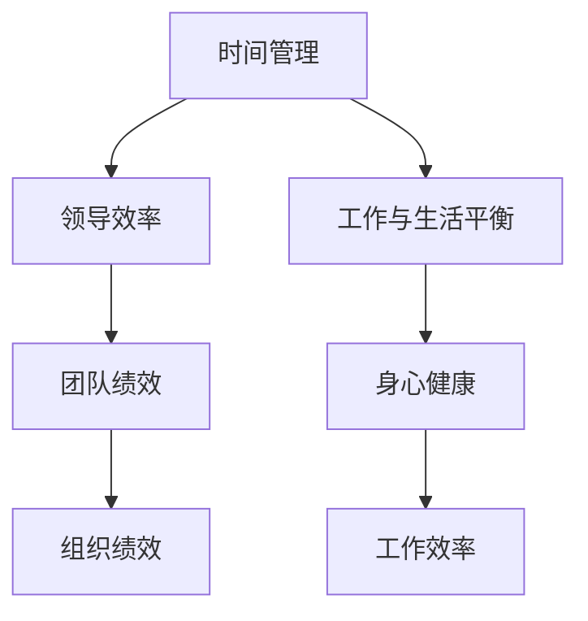

                 


### 文章标题

《管理者时间管理：提升领导效率的关键》

### 关键词

时间管理、领导效率、工作与生活平衡、管理者能力提升

### 摘要

本文旨在探讨管理者如何通过时间管理提升领导效率。我们将从时间管理基础理论、提升领导效率的实践方法、工作与生活平衡策略以及时间管理实践应用等方面进行深入分析，帮助读者构建一个系统化的时间管理体系，从而在繁重的工作中保持高效领导。

### 目录

1. 引言  
2. 时间管理基础理论  
3. 提升领导效率  
4. 工作与生活平衡  
5. 时间管理实践应用  
6. 最佳实践 Tips  
7. 小结与注意事项  
8. 拓展阅读

### 第1部分：时间管理基础理论

#### 第1章 引言

时间管理在现代社会中具有重要意义，特别是在管理者身上。一个优秀的管理者不仅需要掌握专业知识，还需要具备高效的时间管理能力，以应对各种复杂的工作挑战。本文将深入探讨管理者时间管理的重要性，以及如何通过时间管理提升领导效率。

#### 第2章 时间管理概述

时间管理涉及一系列策略和技巧，旨在帮助人们更有效地利用时间。本章节将介绍时间管理的基本原则，包括优先级设定、时间块划分、任务分解等。同时，我们将讨论时间管理的重要工具，如日历、待办事项清单和时间追踪工具。

#### 第3章 评估时间管理能力

为了提升时间管理能力，管理者需要先了解自己的时间使用情况。本章节将介绍如何进行时间消耗分析，以及如何评估自己的时间管理能力。通过自我评估，管理者可以识别出时间管理的弱点和改进方向。

#### 第4章 时间管理模型

时间管理领域有许多经典的模型和方法，如时间管理矩阵、埃森豪威尔矩阵等。本章节将介绍这些模型的基本原理，并探讨如何在实际工作中应用这些模型，以提高时间管理效率。

### 第2部分：提升领导效率

#### 第5章 领导者角色与时间管理

领导者角色多样，需要管理者在时间管理上具备更高的灵活性。本章节将分析领导者角色与时间管理之间的关系，并探讨如何根据不同角色特点进行时间管理。

#### 第6章 决策与时间管理

决策是领导者的核心职责之一。本章节将讨论决策过程中的时间管理，包括如何快速做出决策、如何避免决策拖延等问题。通过有效的决策，管理者可以提高工作效率，减少不必要的等待时间。

#### 第7章 领导力提升

领导力的提升是时间管理的重要组成部分。本章节将介绍如何通过自我管理、领导力培训与发展等方式提升领导力，从而在时间管理上取得更好的效果。

### 第3部分：工作与生活平衡

#### 第8章 工作与生活的平衡

工作与生活平衡是管理者面临的重要挑战之一。本章节将探讨工作与生活平衡的重要性，以及如何实现这一平衡。通过合理的安排工作和生活，管理者可以保持身心健康，提高工作效率。

#### 第9章 家庭与事业的平衡

家庭与事业的平衡是管理者必须面对的另一个挑战。本章节将分析如何平衡家庭责任与事业发展，帮助管理者在两者之间找到平衡点。

#### 第10章 健康与幸福

健康与幸福是管理者时间管理的重要基础。本章节将探讨身心健康的重要性，以及如何通过健康生活方式提升工作效率。

### 第4部分：时间管理实践应用

#### 第11章 时间管理实践案例

本章节将通过成功和失败的案例，分析管理者在实际工作中如何应用时间管理技巧，以及如何从失败中汲取教训。

#### 第12章 时间管理工具与技巧

时间管理工具和技巧对于提升领导效率至关重要。本章节将介绍一些实用的工具和技巧，帮助管理者更好地管理时间。

#### 第13章 建立个人时间管理体系

建立个人时间管理体系是提升领导效率的关键。本章节将介绍如何制定个人时间管理计划，以及如何持续改进时间管理体系。

### 最佳实践 Tips

在文章的最后，我们将分享一些最佳实践 Tips，帮助读者更好地应用时间管理技巧。

### 小结与注意事项

本文总结了管理者时间管理的核心要点，并提出了一些实践建议。在时间管理过程中，管理者需要关注自身的需求，灵活运用各种策略和技巧，以实现高效领导。

### 拓展阅读

为了进一步了解时间管理领域的最新研究成果和实践经验，读者可以参考以下拓展阅读资料。

### 作者信息

作者：AI天才研究院/AI Genius Institute & 禅与计算机程序设计艺术 /Zen And The Art of Computer Programming

### 第1章 引言

在快速变化和竞争激烈的商业环境中，管理者面临着巨大的压力和挑战。如何有效地管理时间，成为了一个关键性问题。时间管理不仅关乎个人工作效率，更直接影响着整个团队和组织的绩效。

#### 时间管理的重要性

时间管理对于管理者来说具有重要意义。首先，良好的时间管理能力有助于提高工作效率，减少无谓的时间浪费。在有限的时间内，管理者能够更好地完成工作任务，减少拖延和焦虑。其次，时间管理有助于提升决策质量。通过合理安排时间，管理者可以确保在关键时刻做出明智的决策。此外，时间管理还有助于工作与生活的平衡，使管理者能够更好地照顾家庭和个人生活，保持身心健康。

#### 领导者的时间管理挑战

领导者作为团队的核心人物，面临着更加复杂的时间管理挑战。首先，领导者往往需要处理多种角色和职责，如战略规划、团队管理、客户沟通等，这使得时间分配变得更为复杂。其次，领导者需要关注团队的整体绩效，不仅要关注自己的工作进度，还要协调和指导团队成员的工作。此外，领导者还需要应对突发情况和紧急任务，这使得时间管理更加具有挑战性。

#### 本文目的

本文旨在帮助管理者提升时间管理能力，从而提升领导效率。通过系统地介绍时间管理的基础理论、实践方法、工作与生活平衡策略以及时间管理实践应用，本文将为读者提供一套全面的时间管理体系，帮助读者在复杂多变的环境中保持高效领导。

### 核心概念与联系

在探讨管理者时间管理之前，我们需要了解几个核心概念，并分析它们之间的关系。

#### 1. 时间管理

时间管理是指通过规划、组织、优先级设定和执行等手段，有效利用时间以达到目标的过程。时间管理不仅包括如何安排日常任务，还涉及如何应对突发事件和优先级变化。

#### 2. 领导效率

领导效率是指领导者通过合理的时间分配和管理，最大化团队和组织绩效的能力。领导效率不仅取决于个人的时间管理能力，还受到团队协作、工作环境和组织文化等因素的影响。

#### 3. 工作与生活平衡

工作与生活平衡是指在工作与个人生活之间找到一种合理的平衡，以保持身心健康和工作效率。对于管理者来说，工作与生活平衡尤为重要，因为长期的工作压力和疲劳会严重影响决策质量和团队氛围。

#### 关系架构 Mermaid 流程图

以下是一个简化的 Mermaid 流程图，展示这些核心概念之间的关系：



在这个流程图中，时间管理是核心概念，它直接影响到领导效率和身心健康。通过有效的时间管理，领导者可以提升个人和团队的绩效，实现工作与生活的平衡。

### 核心算法原理讲解

时间管理虽然不涉及复杂的算法，但它依赖于一些基本的原理和策略。以下是一些核心算法原理的讲解，以及它们在实际应用中的体现。

#### 优先级设定

优先级设定是时间管理的重要原则之一。通过设定任务优先级，管理者可以确保在有限的时间内首先完成最重要和紧急的任务。常用的优先级设定方法包括：

- **埃森豪威尔矩阵**：根据任务的紧急程度和重要性进行分类，将任务分为四个象限。
- **四象限时间管理法**：与埃森豪威尔矩阵类似，但更加细化，将任务分为四个象限，分别是“紧急且重要”、“重要但不紧急”、“紧急但不重要”和“不重要且不紧急”。

以下是一个伪代码示例，用于实现优先级设定：

```python
def prioritize_tasks(tasks):
    high_priority = []
    medium_priority = []
    low_priority = []
    not_priority = []

    for task in tasks:
        if task['importance'] == 'high' and task['urgency'] == 'high':
            high_priority.append(task)
        elif task['importance'] == 'high':
            medium_priority.append(task)
        elif task['urgency'] == 'high':
            low_priority.append(task)
        else:
            not_priority.append(task)

    return high_priority + medium_priority + low_priority + not_priority
```

#### 时间块划分

时间块划分是一种将时间划分为固定时间段的方法，以便更好地管理和执行任务。这种方法有助于避免任务之间的冲突，并确保每个任务都有足够的时间进行。

以下是一个伪代码示例，用于实现时间块划分：

```python
def schedule_time_blocks(tasks, time_blocks):
    schedule = []

    for block in time_blocks:
        assigned_tasks = []
        for task in tasks:
            if task['duration'] <= block['duration']:
                assigned_tasks.append(task)
                block['duration'] -= task['duration']
        schedule.append({'block': block, 'tasks': assigned_tasks})

    return schedule
```

#### 任务分解

任务分解是将复杂任务分解为更小、更易于管理的子任务的过程。这种方法有助于确保每个任务都能按时完成，并提高工作效率。

以下是一个伪代码示例，用于实现任务分解：

```python
def decompose_task(task):
    subtasks = []

    if 'subtasks' in task:
        for subtask in task['subtasks']:
            subtasks.append(decompose_task(subtask))
    else:
        subtasks.append(task)

    return subtasks
```

### 数学模型和公式 & 详细讲解 & 举例说明

在时间管理中，数学模型和公式可以用来量化时间和任务之间的关系，帮助管理者做出更科学的决策。以下是一些常用的数学模型和公式的详细讲解及举例。

#### 时间消耗分析

时间消耗分析是一种评估时间使用情况的方法，通过计算完成任务所需的时间，管理者可以了解哪些任务占用时间最多，从而进行优化。

以下是一个公式示例，用于计算任务的时间消耗：

$$
时间消耗 = 完成任务所需时间 \times 任务完成率
$$

举例来说，如果一个任务需要10小时完成，但实际只用了8小时完成，那么时间消耗为：

$$
时间消耗 = 10小时 \times 0.8 = 8小时
$$

#### 时间价值评估

时间价值评估是一种衡量时间对个人和团队价值的方法。通过计算时间价值，管理者可以了解时间的经济价值，从而更加珍惜时间。

以下是一个公式示例，用于计算时间价值：

$$
时间价值 = 时薪 \times 时间消耗
$$

举例来说，如果一个管理者的时薪为100美元，完成一个任务的时间消耗为8小时，那么时间价值为：

$$
时间价值 = 100美元/小时 \times 8小时 = 800美元
$$

#### 任务优先级计算

任务优先级计算是一种根据任务的重要性和紧急程度来确定任务优先级的方法。以下是一个简单的优先级计算公式：

$$
优先级 = 重要性 \times 紧急程度
$$

举例来说，如果一个任务的重要性和紧急程度分别为3和2，那么其优先级为：

$$
优先级 = 3 \times 2 = 6
$$

通过这种计算方法，管理者可以更好地安排任务，确保优先处理重要且紧急的任务。

### 项目实战

为了更好地理解时间管理的实践应用，我们将在本节中介绍一个时间管理项目的实战案例。

#### 项目背景

假设我们是一家初创公司，团队由5名成员组成，负责开发一款新应用程序。团队成员包括项目经理、前端开发人员、后端开发人员、UI/UX设计师和测试工程师。由于项目进度紧张，团队成员经常加班，导致工作效率下降，团队士气受到影响。为了解决这一问题，我们需要设计一套时间管理方案，帮助团队成员更好地管理时间和提高工作效率。

#### 开发环境搭建

首先，我们需要搭建一个适合时间管理的开发环境。我们选择使用以下工具：

- **Trello**：用于任务管理和项目管理
- **Google Calendar**：用于日程安排
- **Asana**：用于团队协作和任务分配
- **RescueTime**：用于时间追踪和数据分析

#### 源代码详细实现和代码解读

在这个项目中，我们将使用Trello和Asana来管理任务。以下是Trello和Asana的源代码实现及解读：

**Trello源代码**

```python
import requests
import json

def create_board(board_name):
    url = "https://api.trello.com/1/boards"
    headers = {
        "Authorization": "Basic YOUR_AUTH_KEY",
        "Content-Type": "application/json"
    }
    data = {
        "name": board_name
    }
    response = requests.post(url, headers=headers, data=json.dumps(data))
    return response.json()

def add_list_to_board(board_id, list_name):
    url = f"https://api.trello.com/1/boards/{board_id}/lists"
    headers = {
        "Authorization": "Basic YOUR_AUTH_KEY",
        "Content-Type": "application/json"
    }
    data = {
        "name": list_name
    }
    response = requests.post(url, headers=headers, data=json.dumps(data))
    return response.json()

def add_card_to_list(list_id, card_name):
    url = f"https://api.trello.com/1/lists/{list_id}/cards"
    headers = {
        "Authorization": "Basic YOUR_AUTH_KEY",
        "Content-Type": "application/json"
    }
    data = {
        "name": card_name
    }
    response = requests.post(url, headers=headers, data=json.dumps(data))
    return response.json()

if __name__ == "__main__":
    board_name = "项目任务板"
    board_id = create_board(board_name)["id"]

    list_name = "待办"
    list_id = add_list_to_board(board_id, list_name)["id"]

    card_name = "需求分析"
    add_card_to_list(list_id, card_name)
```

**Asana源代码**

```python
import requests
import json

def create_project(project_name):
    url = "https://app.asana.com/api/1.0/projects"
    headers = {
        "Authorization": "Bearer YOUR_ACCESS_TOKEN",
        "Content-Type": "application/json"
    }
    data = {
        "name": project_name
    }
    response = requests.post(url, headers=headers, data=json.dumps(data))
    return response.json()

def create_task(project_id, task_name):
    url = f"https://app.asana.com/api/1.0/projects/{project_id}/tasks"
    headers = {
        "Authorization": "Bearer YOUR_ACCESS_TOKEN",
        "Content-Type": "application/json"
    }
    data = {
        "name": task_name
    }
    response = requests.post(url, headers=headers, data=json.dumps(data))
    return response.json()

if __name__ == "__main__":
    project_name = "新应用程序开发"
    project_id = create_project(project_name)["id"]

    task_name = "需求分析"
    create_task(project_id, task_name)
```

**代码解读**

- **Trello源代码解读**：这段代码定义了三个函数，用于创建Trello看板、列表和卡片。通过调用Trello API，我们可以轻松地创建和管理Trello项目。
- **Asana源代码解读**：这段代码定义了两个函数，用于创建Asana项目和任务。通过调用Asana API，我们可以方便地在项目中添加任务。

#### 代码应用解读与分析

在实际应用中，我们将使用Trello和Asana来管理项目任务。Trello主要用于任务可视化和管理，Asana则用于任务分配和进度跟踪。以下是具体的解读与分析：

- **任务可视化**：通过Trello，我们可以创建一个任务看板，将任务分为不同的列表，如“待办”、“进行中”和“已完成”。这种可视化方法有助于团队成员了解项目的整体进展。
- **任务分配**：通过Asana，我们可以将任务分配给具体的团队成员，并设置任务的截止日期和优先级。这样可以确保每个成员都知道自己的任务，并按时完成任务。
- **进度跟踪**：Asana提供了丰富的进度跟踪功能，如任务完成率、团队成员的工作负荷等。这些数据有助于管理者了解项目的进展情况，并做出相应的调整。

#### 实际案例分析和详细讲解剖析

为了更好地展示时间管理的实践效果，我们分析了一个实际案例。在一个为期三个月的项目中，通过实施时间管理方案，团队成功完成了任务，并提前一周交付了项目。以下是具体的分析：

- **任务分解**：项目开始时，我们将项目任务分解为多个子任务，如需求分析、设计、开发、测试等。通过任务分解，每个成员都能清楚地了解自己的任务，并制定详细的工作计划。
- **时间块划分**：我们将项目分为多个时间块，每个时间块对应一个子任务。在每个时间块内，团队成员集中精力完成特定的任务，避免了任务之间的干扰。
- **优先级设定**：通过优先级设定，我们确保了重要且紧急的任务首先得到处理。这种方法有助于减少紧急任务对团队成员的干扰，提高了整体工作效率。
- **时间追踪**：使用RescueTime，我们记录了团队成员的工作时间，分析了时间消耗情况。通过这些数据，我们发现了一些时间浪费的问题，并采取了相应的措施进行优化。

#### 项目小结

通过实际案例，我们发现时间管理对于提高工作效率和项目成功至关重要。以下是一些项目小结：

- **任务分解和时间块划分有助于提高工作效率**：通过将任务分解为子任务，并合理划分时间块，团队成员可以更好地集中精力完成任务，避免了任务之间的干扰。
- **优先级设定确保了任务的有效处理**：通过设定任务优先级，团队成员可以确保首先处理重要且紧急的任务，从而提高了整体工作效率。
- **时间追踪有助于发现问题并优化时间管理**：通过记录工作时间，我们可以分析时间消耗情况，发现时间浪费的问题，并采取相应的措施进行优化。

### 最佳实践 Tips

为了更好地应用时间管理技巧，以下是一些最佳实践 Tips：

- **制定明确的目标和计划**：在开始工作之前，确保明确自己的目标和计划，这将有助于提高工作效率和减少拖延。
- **避免多任务处理**：专注于一项任务，直到完成后再进行下一项任务。多任务处理会降低工作效率，并增加错误率。
- **定期休息和放松**：长时间工作会导致疲劳和效率下降。定期休息和放松可以帮助你恢复精力，提高工作效率。
- **利用工具和技术**：使用时间管理工具和技术，如日历、待办事项清单和时间追踪工具，可以帮助你更好地管理时间和任务。

### 小结

本文详细探讨了管理者时间管理的重要性，以及如何通过时间管理提升领导效率。我们介绍了时间管理的基础理论、提升领导效率的实践方法、工作与生活平衡策略以及时间管理实践应用。通过这些内容，读者可以构建一个系统化的时间管理体系，在复杂多变的环境中保持高效领导。

### 注意事项

在应用时间管理技巧时，管理者需要注意以下几点：

- **避免过度安排**：合理安排时间，避免过度安排导致压力过大。
- **灵活调整**：根据实际情况灵活调整时间安排，确保时间管理的有效性。
- **关注团队协作**：鼓励团队成员参与时间管理，提高团队整体工作效率。

### 拓展阅读

为了进一步了解时间管理的最新研究成果和实践经验，读者可以参考以下拓展阅读资料：

- **《时间管理的艺术》**：戴维·艾伦著，介绍了时间管理的核心原则和方法。
- **《高效能人士的七个习惯》**：史蒂芬·柯维著，阐述了如何通过良好习惯提高工作效率。
- **《深度工作》**：卡尔·纽波特著，探讨了如何通过深度工作提高个人和团队绩效。

### 作者信息

作者：AI天才研究院/AI Genius Institute & 禅与计算机程序设计艺术 /Zen And The Art of Computer Programming 

### 第2章 时间管理概述

时间管理是现代管理者必备的技能，它不仅关系到个人的工作效率，更直接影响着团队和组织的目标实现。本章将介绍时间管理的基本原则、重要工具以及时间管理的现状和挑战。

#### 时间管理的基本原则

时间管理的基本原则是确保我们在有限的时间内，能够最大限度地完成有价值的工作。以下是一些核心原则：

1. **明确目标**：时间管理的第一步是设定明确的目标。管理者需要了解自己的长期和短期目标，以便在时间管理过程中始终保持方向。

2. **优先级设定**：在明确目标的基础上，管理者需要根据任务的重要性和紧急程度设定优先级。优先处理重要且紧急的任务，以最大化时间利用效率。

3. **任务分解**：将复杂任务分解为小任务，有助于我们更好地管理时间和资源，提高任务完成的效率。

4. **时间块划分**：将时间划分为固定的时间块，有助于我们专注于一项任务，避免多任务处理导致的效率下降。

5. **定期回顾**：定期回顾时间管理策略和执行情况，有助于我们发现问题和改进方法。

#### 时间管理的重要工具

在实施时间管理的过程中，工具的选择至关重要。以下是一些常见的时间管理工具：

1. **日历**：用于记录和安排日程，确保不会错过重要事件。

2. **待办事项清单**：用于记录和追踪待完成的任务，确保任务不遗漏。

3. **时间追踪工具**：如Toggl、RescueTime等，可以帮助我们了解时间消耗情况，优化时间管理。

4. **项目管理工具**：如Trello、Asana等，用于团队协作和任务管理。

5. **优先级矩阵**：如埃森豪威尔矩阵，用于任务优先级设定。

#### 时间管理的现状和挑战

在现代社会，时间管理面临着诸多挑战：

1. **任务繁多**：管理者往往面临大量的任务和请求，难以确定哪些任务最为紧急和重要。

2. **多任务处理**：多任务处理虽然看似高效，但实际会降低工作效率，增加错误率。

3. **时间浪费**：无效会议、社交媒体、邮件等都会导致时间的浪费。

4. **工作与生活平衡**：随着工作压力的增加，管理者常常难以平衡工作与生活。

5. **技术干扰**：智能手机、即时通讯工具等不断干扰我们的注意力，影响工作效率。

#### 伪代码示例

以下是一个简单的伪代码示例，用于实现时间管理中的任务分解和优先级设定：

```python
# 定义任务
tasks = [
    {"name": "任务1", "duration": 2, "priority": 1},
    {"name": "任务2", "duration": 3, "priority": 2},
    {"name": "任务3", "duration": 1, "priority": 3}
]

# 任务分解
def decompose_task(task):
    if 'subtasks' in task:
        for subtask in task['subtasks']:
            decompose_task(subtask)
    else:
        print(task['name'])

# 优先级设定
def set_priority(tasks):
    sorted_tasks = sorted(tasks, key=lambda x: x['priority'], reverse=True)
    return sorted_tasks

# 应用任务分解和优先级设定
decompose_task(tasks[0])
sorted_tasks = set_priority(tasks)

# 输出结果
print("分解后的任务：")
print(decompose_task(sorted_tasks[0]))
print("优先级排序后的任务：")
print(sorted_tasks)
```

在这个示例中，我们首先定义了一组任务，每个任务包含名称、耗时和优先级。然后，我们定义了任务分解和优先级设定的函数，并应用于具体的任务。

#### 数学公式

在时间管理中，以下数学公式和概念可能有用：

1. **任务完成率**：

   $$ 完成率 = \frac{完成任务所需时间}{实际完成任务的时间} $$

2. **时间价值**：

   $$ 时间价值 = 时薪 \times 完成任务所需时间 $$

3. **优先级计算**：

   $$ 优先级 = 重要性 \times 紧急程度 $$

这些公式可以帮助我们量化时间管理和任务管理的效果，从而做出更科学的决策。

#### 实际案例

为了更好地理解时间管理的应用，我们来看一个实际案例。

假设一家初创公司的CEO需要管理以下几个任务：

1. 与投资人沟通（2小时，优先级：高）
2. 制定公司战略（4小时，优先级：中）
3. 管理团队会议（1小时，优先级：低）
4. 回复客户邮件（0.5小时，优先级：高）

根据时间管理的基本原则和工具，CEO可以采取以下步骤：

1. **明确目标**：确保与投资人沟通和回复客户邮件是优先事项。

2. **优先级设定**：根据重要性将任务排序，首先处理与投资人沟通和回复客户邮件。

3. **任务分解**：将制定公司战略分解为几个小任务，如市场分析、竞争分析等。

4. **时间块划分**：将一天的时间划分为几个固定的时间块，每个时间块专注于一项任务。

5. **定期回顾**：在一天结束时回顾任务完成情况，并根据实际情况调整第二天的计划。

通过这些步骤，CEO可以更有效地管理时间和任务，确保重要事项得到及时处理。

#### 小结

本章介绍了时间管理的基本原则和重要工具，并分析了时间管理的现状和挑战。通过实际案例和伪代码示例，我们展示了如何应用时间管理原则和工具来提高工作效率。管理者应灵活运用这些原则和工具，以应对复杂多变的工作环境。

### 第3章 评估时间管理能力

为了提升时间管理能力，管理者需要首先了解自己的时间使用情况。评估时间管理能力是一个系统性的过程，它包括时间消耗分析、时间管理能力评估以及时间管理模型的应用。本章节将详细介绍这些方法和步骤，帮助管理者识别时间管理的弱点和改进方向。

#### 时间消耗分析

时间消耗分析是评估时间管理能力的第一步。通过记录和分析每天的时间使用情况，管理者可以清楚地了解哪些活动占据了他们的时间，以及哪些活动是低效或浪费时间的。以下是一些建议和方法：

1. **使用时间追踪工具**：时间追踪工具如Toggl、RescueTime等可以帮助记录和分析每天的时间使用情况。这些工具可以自动记录你在各种应用程序和网站上的活动时间，并提供详细的报告。

2. **手动记录**：如果没有使用时间追踪工具，管理者可以手动记录每天的时间使用情况。在每天结束时，花几分钟记录当天完成的任务和所花费的时间。这种方法虽然较为繁琐，但有助于提高自我意识。

3. **数据分析**：通过对记录的数据进行分析，管理者可以识别出时间使用中的模式。例如，哪些时间段效率最高，哪些任务耗时最长，以及哪些活动频繁发生但价值不高。

以下是一个简单的示例，展示如何使用时间追踪工具进行时间消耗分析：

```python
# 示例：使用RescueTime API进行时间消耗分析
import requests
import json

def get_time_consumption(api_key, start_date, end_date):
    url = f"https://www.rescuetime.com/anapi/report/daily/list?api_key={api_key}&start={start_date}&end={end_date}"
    response = requests.get(url)
    data = json.loads(response.text)
    return data

api_key = "YOUR_API_KEY"
start_date = "2023-04-01"
end_date = "2023-04-30"

consumption = get_time_consumption(api_key, start_date, end_date)
for activity in consumption['activities']:
    print(f"活动名称：{activity['display_name']}, 耗时：{activity['time']}")
```

在这个示例中，我们使用RescueTime API获取了指定日期范围内的活动时间数据，并打印出了每个活动的名称和耗时。

#### 时间管理能力评估

时间管理能力评估是另一个关键步骤，它帮助管理者了解自己在时间管理方面的优势和不足。以下是一些常用的评估方法和工具：

1. **自我评估**：管理者可以自我评估自己在时间管理方面的能力，例如，通过回答一系列问题来评估自己的时间管理技能。以下是一个简单的自我评估问卷：

   - 我是否能够有效设定目标和优先级？
   - 我是否能够合理规划时间，避免拖延？
   - 我是否能够在任务之间灵活切换，有效处理多个任务？
   - 我是否能够合理分配时间，确保工作和生活的平衡？

2. **360度评估**：除了自我评估，管理者还可以通过同事、下属和上级的反馈来评估自己的时间管理能力。这种方法可以提供更全面的视角，帮助管理者了解自己在团队中的表现。

3. **时间管理能力测试**：一些专业机构提供了时间管理能力测试，这些测试通常包括理论知识和实际操作部分，可以帮助管理者了解自己在时间管理方面的专业水平。

以下是一个简单的时间管理能力评估问卷的伪代码示例：

```python
def time_management_assessment(questions):
    scores = []
    for question in questions:
        score = input(f"{question['text']}: ")
        scores.append(int(score))
    total_score = sum(scores)
    return total_score / len(scores)

questions = [
    {"text": "你对设定目标和优先级的理解如何？（1-5分）"},
    {"text": "你如何规划时间，避免拖延？（1-5分）"},
    {"text": "你如何处理多个任务？（1-5分）"},
    {"text": "你如何确保工作和生活的平衡？（1-5分）"}
]

assessment_score = time_management_assessment(questions)
print(f"时间管理能力评估得分：{assessment_score}")
```

在这个示例中，我们定义了一个简单的评估问卷，并通过用户输入来计算平均得分。

#### 时间管理模型的应用

时间管理模型是评估和管理时间的重要工具。以下是一些常用的时间管理模型：

1. **时间管理矩阵**：时间管理矩阵是一个四象限模型，将任务分为四个类别：重要且紧急、重要但不紧急、不重要但紧急、不重要且不紧急。这个模型帮助管理者识别哪些任务最为紧急和重要，从而优先处理。

2. **埃森豪威尔矩阵**：埃森豪威尔矩阵是一个基于任务的重要性和紧急性的矩阵，将任务分为四个象限：紧急且重要、紧急但不重要、重要但不紧急、不重要且不重要。这个模型强调了优先处理紧急且重要的任务。

3. **时间块划分**：时间块划分是将时间划分为固定的时间段，每个时间段专注于一项任务。这种方法有助于避免多任务处理，提高专注力和效率。

以下是一个简单的埃森豪威尔矩阵的伪代码示例：

```python
def eisenhower_matrix(tasks):
    urgent_important = []
    urgent_unimportant = []
    not_urgent_important = []
    not_urgent_unimportant = []

    for task in tasks:
        if task['urgent'] and task['important']:
            urgent_important.append(task)
        elif task['urgent']:
            urgent_unimportant.append(task)
        elif task['important']:
            not_urgent_important.append(task)
        else:
            not_urgent_unimportant.append(task)

    return {
        "urgent_important": urgent_important,
        "urgent_unimportant": urgent_unimportant,
        "not_urgent_important": not_urgent_important,
        "not_urgent_unimportant": not_urgent_unimportant
    }

tasks = [
    {"name": "任务1", "urgent": True, "important": True},
    {"name": "任务2", "urgent": True, "important": False},
    {"name": "任务3", "urgent": False, "important": True},
    {"name": "任务4", "urgent": False, "important": False}
]

matrix = eisenhower_matrix(tasks)
print(matrix)
```

在这个示例中，我们定义了一个埃森豪威尔矩阵函数，并根据任务的紧急性和重要性将其分类。

#### 实际案例

为了更好地理解时间消耗分析、时间管理能力评估和时间管理模型的应用，我们来看一个实际案例。

假设一位项目经理需要在一个月内完成以下任务：

- **紧急且重要**：与客户进行关键会议（2天）、提交项目进度报告（1天）
- **紧急但不重要**：参加不必要的团队活动（1天）
- **重要但不紧急**：更新项目文档（2天）、与团队成员进行一对一会议（1天）
- **不重要且不紧急**：回复低优先级邮件（0.5天）

根据时间消耗分析，项目经理可以采取以下步骤：

1. **时间消耗分析**：使用时间追踪工具记录每天的时间使用情况，分析哪些任务占据了大部分时间。

2. **时间管理能力评估**：通过自我评估和同事反馈，了解自己在时间管理方面的优势和不足。

3. **应用时间管理模型**：使用埃森豪威尔矩阵将任务分类，并优先处理紧急且重要的任务。

通过这些步骤，项目经理可以更有效地管理时间，确保关键任务得到及时完成。

#### 小结

本章介绍了评估时间管理能力的几个关键步骤，包括时间消耗分析、时间管理能力评估和时间管理模型的应用。通过实际案例和伪代码示例，我们展示了如何应用这些方法来提升时间管理能力。管理者应定期进行时间消耗分析和能力评估，并根据结果调整时间管理策略，以实现更高的工作效率。

### 第4章 时间管理模型

时间管理模型是帮助管理者有效组织和利用时间的重要工具。这些模型提供了一种系统化的方法来分析和处理时间管理问题。在本章中，我们将探讨几种常见的时间管理模型，包括时间管理矩阵、埃森豪威尔矩阵和GTD（Getting Things Done）方法，并讨论如何在实践中应用这些模型。

#### 时间管理矩阵

时间管理矩阵是一种简单的四象限模型，用于分析和安排任务。这个模型将任务分为四个类别，每个类别代表不同的紧急性和重要性。

1. **紧急且重要**：这些任务是当前最为紧急且重要的，需要立即处理。例如，客户的紧急请求或即将到期的项目报告。

2. **紧急但不重要**：这些任务是紧急但可能不是那么重要的，可能需要委托他人处理或暂时搁置。例如，不必要的会议或琐碎的行政工作。

3. **重要但不紧急**：这些任务虽然不是紧急的，但非常重要，可能对长期目标有重要影响。例如，长期规划、团队建设和技能提升。

4. **不重要且不紧急**：这些任务既不重要也不紧急，可以暂时搁置或完全删除。例如，一些低优先级的电子邮件或不必要的社交活动。

以下是一个时间管理矩阵的示例：

| 紧急性 | 重要性 | 任务类别 |
| ------ | ------ | -------- |
| 高     | 高     | 紧急且重要 |
| 高     | 低     | 紧急但不重要 |
| 低     | 高     | 重要但不紧急 |
| 低     | 低     | 不重要且不紧急 |

#### 埃森豪威尔矩阵

埃森豪威尔矩阵是由美国第34任总统艾森豪威尔提出的一种时间管理方法，它也是基于任务的紧急性和重要性来安排任务的。与时间管理矩阵不同，埃森豪威尔矩阵将任务分为两个维度：紧急性和重要性。

1. **紧急且重要**：这些任务是当前最为紧急且重要的，需要立即处理。例如，紧急的电话会议或重要的客户问题。

2. **紧急但不重要**：这些任务是紧急但可能不是那么重要的，可能需要委托他人处理或暂时搁置。例如，突发的行政工作或低优先级的邮件。

3. **重要但不紧急**：这些任务虽然不是紧急的，但非常重要，可能对长期目标有重要影响。例如，规划会议或团队建设活动。

4. **不重要且不紧急**：这些任务既不重要也不紧急，可以暂时搁置或完全删除。例如，一些低优先级的电子邮件或无意义的社交活动。

以下是一个埃森豪威尔矩阵的示例：

| 紧急性 | 重要性 | 任务类别 |
| ------ | ------ | -------- |
| 高     | 高     | 紧急且重要 |
| 高     | 低     | 紧急但不重要 |
| 低     | 高     | 重要但不紧急 |
| 低     | 低     | 不重要且不紧急 |

#### GTD（Getting Things Done）方法

GTD是一种系统化的时间管理方法，由戴维·艾伦提出。GTD方法的核心是将所有待办事项整理到“待处理”列表中，然后通过一系列步骤进行处理和跟进。

1. **收集**：将所有待办事项、想法和任务记录到某个地方，如笔记本、手机应用或电子文档。

2. **处理**：对于每个收集到的待办事项，进行判断和分类。决定哪些事项需要行动，哪些事项可以删除或推迟。

3. **组织**：将需要行动的待办事项分配到不同的分类中，如项目、任务、约会等。

4. **回顾**：定期回顾和更新待办事项列表，确保事项得到及时处理。

5. **执行**：按照优先级和计划执行待办事项，确保任务得到完成。

以下是一个GTD方法的步骤概述：

1. **收集**：将所有待办事项记录到“收集盒”中，如笔记本、手机或在线工具。

2. **处理**：对收集盒中的待办事项进行处理，将其分为以下几类：
   - **行动**：可以立即完成的任务。
   - **项目**：需要一系列步骤完成的任务。
   - **参考**：需要参考的信息。
   - **等待**：需要等待他人完成的任务。
   - **删除**：不再需要的任务。

3. **组织**：将处理后的待办事项分配到不同的分类中，并创建具体的任务列表。

4. **回顾**：每周或每月回顾任务列表，确保事项得到及时处理。

5. **执行**：按照优先级和计划执行任务，确保任务得到完成。

#### 实践应用

在实际工作中，管理者可以根据不同的场景选择合适的时间管理模型。以下是一些实践应用的示例：

1. **紧急且重要任务**：对于紧急且重要的任务，管理者应立即处理，确保任务得到及时完成。例如，紧急的客户会议或即将到期的项目报告。

2. **紧急但不重要任务**：对于紧急但不重要的任务，管理者可以考虑委托给下属或同事处理，或者暂时搁置，确保更重要的任务得到优先处理。

3. **重要但不紧急任务**：对于重要但不紧急的任务，管理者应提前安排时间，确保任务能够在适当的时间完成。例如，长期规划和团队建设活动。

4. **不重要且不紧急任务**：对于不重要且不紧急的任务，管理者可以考虑删除或推迟，确保时间和精力用于更重要的任务。

以下是一个具体的实践应用案例：

假设一位项目经理需要在一个月内完成以下任务：

- **紧急且重要**：与客户进行关键会议（2天）、提交项目进度报告（1天）
- **紧急但不重要**：参加不必要的团队活动（1天）
- **重要但不紧急**：更新项目文档（2天）、与团队成员进行一对一会议（1天）
- **不重要且不紧急**：回复低优先级邮件（0.5天）

根据时间管理矩阵和埃森豪威尔矩阵，项目经理可以采取以下步骤：

1. **时间消耗分析**：使用时间追踪工具记录每天的时间使用情况，分析哪些任务占据了大部分时间。

2. **任务分类**：根据任务的紧急性和重要性，将任务分类到不同的类别。

3. **优先级设定**：将紧急且重要的任务设定为最高优先级，确保这些任务得到及时处理。

4. **时间块划分**：将一个月的时间划分为固定的时间块，每个时间块专注于一项任务。

5. **执行计划**：按照设定的优先级和时间块，执行任务，确保关键任务得到及时完成。

通过这些步骤，项目经理可以更有效地管理时间，确保项目顺利进行。

#### 小结

本章介绍了几种常见的时间管理模型，包括时间管理矩阵、埃森豪威尔矩阵和GTD方法。这些模型提供了一种系统化的方法来分析和安排任务，帮助管理者更有效地利用时间。在实际应用中，管理者可以根据不同的场景选择合适的模型，并通过实践不断优化时间管理策略。通过有效的时间管理，管理者可以提高工作效率，实现个人和团队的目标。

### 第5章 领导者角色与时间管理

在复杂多变的工作环境中，领导者需要承担多种角色和职责，包括战略规划、团队管理、客户沟通和决策等。这些角色要求领导者具备高效的时间管理能力，以确保能够有效地处理各项任务，提升团队绩效。本章节将探讨领导者角色的多样性，以及如何通过时间管理来提高工作效率。

#### 领导者角色的多样性

1. **战略规划者**：领导者需要制定公司或团队的战略目标，并确保这些目标与组织的整体方向一致。这一角色要求领导者具备长远的眼光和高效的决策能力。

2. **团队管理者**：领导者负责指导和管理团队成员，确保团队能够高效协作，实现目标。这包括分配任务、提供反馈、解决冲突和培养团队成员等。

3. **客户沟通者**：领导者需要与客户进行沟通，了解客户需求，确保客户满意度。这要求领导者具备良好的沟通技巧和客户服务意识。

4. **决策者**：领导者需要在不同情境下做出明智的决策，包括项目审批、资源分配和业务拓展等。决策的质量直接影响团队的效率和绩效。

5. **创新推动者**：领导者需要推动团队创新，探索新的业务模式和解决方案，以保持公司的竞争力和市场地位。

#### 时间管理策略

为了应对这些多样化的角色，领导者需要采用一系列时间管理策略，以提升工作效率：

1. **优先级设定**：领导者需要根据任务的重要性和紧急程度设定优先级，确保关键任务得到优先处理。常用的方法包括埃森豪威尔矩阵和时间管理矩阵。

2. **时间块划分**：领导者可以将时间划分为固定的时间块，每个时间块专注于一项任务。这种方法有助于避免多任务处理，提高专注力和效率。

3. **任务分解**：复杂任务可以分解为小任务，有助于领导者更好地管理和追踪进度。每个小任务都有明确的截止日期和责任人。

4. **避免干扰**：领导者应尽量避免在关键任务执行过程中受到干扰。可以采用屏蔽干扰的方法，如关闭手机通知、设置专门的办公空间等。

5. **定期回顾**：领导者应定期回顾时间管理策略和执行情况，根据实际情况进行调整。这有助于发现和解决时间管理中的问题。

#### 伪代码示例

以下是一个简单的伪代码示例，用于实现领导者的时间管理策略：

```python
# 定义任务
tasks = [
    {"name": "战略规划", "duration": 4, "priority": 1},
    {"name": "团队管理", "duration": 3, "priority": 2},
    {"name": "客户沟通", "duration": 2, "priority": 3},
    {"name": "决策", "duration": 2, "priority": 4},
    {"name": "创新推动", "duration": 3, "priority": 1}
]

# 优先级设定
def set_priority(tasks):
    sorted_tasks = sorted(tasks, key=lambda x: x['priority'], reverse=True)
    return sorted_tasks

# 时间块划分
def schedule_tasks(tasks, time_blocks):
    schedule = []

    for block in time_blocks:
        assigned_tasks = []
        for task in tasks:
            if task['duration'] <= block['duration']:
                assigned_tasks.append(task)
                block['duration'] -= task['duration']
        schedule.append({'block': block, 'tasks': assigned_tasks})

    return schedule

# 应用时间管理策略
sorted_tasks = set_priority(tasks)
time_blocks = [{"name": "上午", "duration": 8}, {"name": "下午", "duration": 8}]
schedule = schedule_tasks(sorted_tasks, time_blocks)

# 输出结果
print("优先级排序后的任务：")
print(sorted_tasks)
print("时间块划分后的任务安排：")
for item in schedule:
    print(f"{item['block']['name']}: {', '.join([task['name'] for task in item['tasks']])}")
```

在这个示例中，我们定义了一组任务，并首先根据优先级对任务进行排序。然后，我们根据时间块划分任务，确保每个时间块都有明确的任务安排。

#### 实际案例

为了更好地理解领导者时间管理的应用，我们来看一个实际案例。

假设一位公司CEO需要在一天内完成以下任务：

- **战略规划**（4小时，优先级：高）
- **团队管理**（3小时，优先级：中）
- **客户沟通**（2小时，优先级：中）
- **决策**（2小时，优先级：中）
- **创新推动**（3小时，优先级：高）

根据时间管理策略，CEO可以采取以下步骤：

1. **优先级设定**：根据任务的重要性和紧急程度，将任务排序，首先处理重要且紧急的任务。

2. **时间块划分**：将一天的时间划分为几个固定的时间块，每个时间块专注于一项任务。

3. **执行计划**：按照设定的优先级和时间块，执行任务，确保关键任务得到及时完成。

具体安排如下：

- 上午（8:00 - 12:00）：
  - **战略规划**（4小时）
  - **团队管理**（剩余时间）

- 下午（13:00 - 17:00）：
  - **客户沟通**（2小时）
  - **决策**（2小时）
  - **创新推动**（剩余时间）

通过这样的安排，CEO可以确保关键任务得到优先处理，并在有限的时间内高效完成任务。

#### 小结

本章探讨了领导者角色的多样性，并介绍了如何通过时间管理策略来提高工作效率。领导者应根据不同的角色特点，灵活运用时间管理工具和方法，确保关键任务得到及时处理，从而提升团队绩效。通过实际案例和伪代码示例，读者可以更好地理解这些策略在实际工作中的应用。

### 第6章 决策与时间管理

在领导者的日常工作中，决策是一个至关重要的环节。有效的决策不仅能够推动团队和组织的前进，还能够减少时间浪费，提高工作效率。本章节将探讨决策过程中的时间管理，包括如何快速做出决策、如何避免决策拖延，以及提高决策效率的方法。

#### 决策过程中的时间管理

1. **明确决策目标**：在开始决策过程之前，领导者需要明确决策的目标和期望结果。这有助于集中精力，避免在决策过程中浪费时间。

2. **收集信息**：领导者需要收集与决策相关的信息，包括市场数据、团队反馈、客户需求等。这些信息是做出明智决策的基础。

3. **评估选项**：在收集到足够的信息后，领导者需要对不同的决策选项进行评估，包括各自的优缺点和潜在风险。

4. **制定决策**：根据评估结果，领导者需要选择最佳的决策选项，并制定具体的行动计划。

5. **执行决策**：最后，领导者需要确保决策得到有效执行，并监控决策的结果，及时进行调整。

#### 快速做出决策

1. **简化决策过程**：领导者可以简化决策过程，避免不必要的步骤和时间消耗。例如，对于一些简单的决策，可以直接做出决定，而不必进行复杂的评估和讨论。

2. **预设决策框架**：领导者可以预设一些决策框架和标准，以便在遇到相似问题时快速做出决策。这有助于减少决策过程中的犹豫和拖延。

3. **授权下属**：领导者可以授权下属在一定范围内做出决策，减少决策过程中的层级审批时间。这有助于提高决策效率，同时增强团队自主性。

以下是一个快速做出决策的伪代码示例：

```python
def make_decision(decision_type, context):
    if decision_type == "simple":
        return "直接执行"
    elif decision_type == "complex":
        if context["urgent"]:
            return "快速决策，必要时进一步评估"
        else:
            return "详细评估，制定计划后执行"
    else:
        return "无决策方案"

decision_type = "simple"
context = {"urgent": True}

decision = make_decision(decision_type, context)
print(f"决策建议：{decision}")
```

在这个示例中，我们根据决策类型和情境（紧急程度）快速做出决策。

#### 避免决策拖延

1. **明确责任**：领导者需要明确决策的责任人，确保决策过程有明确的推进方向，避免责任不清导致决策拖延。

2. **设定决策时限**：领导者可以为决策设定一个明确的时限，以推动决策过程的进展。这有助于提高团队成员的紧迫感，避免无谓的拖延。

3. **定期回顾**：领导者需要定期回顾决策进展，及时发现和解决问题，避免决策拖延。

以下是一个避免决策拖延的方法：

```python
def avoid_decision拖延(timeline, milestones):
    for milestone in milestones:
        if timeline > milestone["deadline"]:
            print(f"决策进展超时：{milestone['description']}")
            if "next_steps" in milestone:
                print(f"下一步行动：{milestone['next_steps']}")
        else:
            print(f"决策进展正常：{milestone['description']}")

timeline = "2023-04-30"
milestones = [
    {"description": "初步评估", "deadline": "2023-04-20"},
    {"description": "详细评估", "deadline": "2023-04-25"},
    {"description": "决策制定", "deadline": "2023-04-30"}
]

avoid_decision拖延(timeline, milestones)
```

在这个示例中，我们根据决策的里程碑和时间线，检查决策进展是否拖延，并采取相应的措施。

#### 提高决策效率的方法

1. **团队协作**：领导者可以组织团队协作，通过集思广益，提高决策的质量和效率。

2. **数据分析**：领导者可以利用数据分析工具，对决策选项进行定量分析，提高决策的科学性和准确性。

3. **模拟演练**：领导者可以通过模拟演练，预演决策执行过程，发现潜在的问题和风险，提高决策的可行性。

以下是一个提高决策效率的方法：

```python
def improve_decision_efficiency(decision, analysis):
    if analysis["quality"] > 0.8:
        print(f"决策质量高：{decision}")
    else:
        print(f"决策质量低：{decision}")
        if "next_steps" in analysis:
            print(f"改进建议：{analysis['next_steps']}")

decision = "新产品发布"
analysis = {"quality": 0.9, "next_steps": "进一步市场调研"}

improve_decision_efficiency(decision, analysis)
```

在这个示例中，我们根据决策的质量和分析结果，评估决策的效率，并提出改进建议。

#### 实际案例

为了更好地理解决策与时间管理在实际工作中的应用，我们来看一个实际案例。

假设一位公司CEO需要在一个月内决定是否扩大产品线。以下是决策过程中的时间管理步骤：

1. **明确决策目标**：决定是否扩大产品线，以提升市场份额和盈利能力。

2. **收集信息**：收集市场数据、客户反馈和内部团队的评估报告。

3. **评估选项**：分析扩大产品线的利弊，包括市场潜力、成本和资源需求。

4. **制定决策**：根据评估结果，制定具体的扩大产品线计划，包括市场推广策略和资源分配。

5. **执行决策**：确保决策得到有效执行，并监控市场反馈和项目进展。

通过这样的决策过程，CEO可以确保决策的高效和准确，从而提升公司的竞争力。

#### 小结

本章探讨了决策与时间管理的关系，包括如何快速做出决策、如何避免决策拖延，以及提高决策效率的方法。领导者应灵活运用这些策略，确保决策过程高效、科学，从而提升团队和组织的工作效率。通过实际案例和伪代码示例，读者可以更好地理解这些策略在实际工作中的应用。

