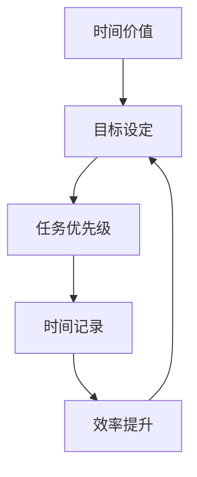
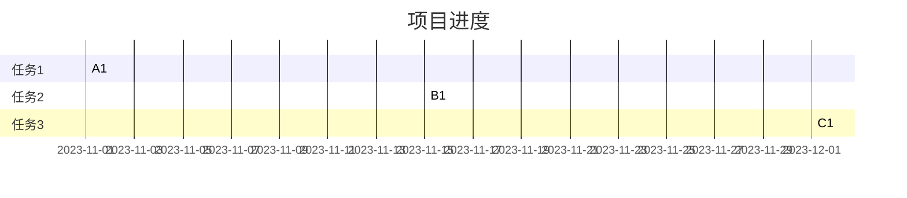
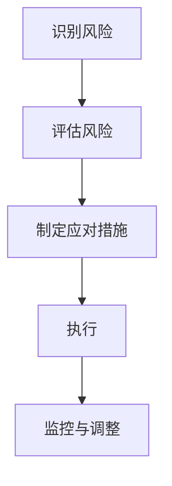

                 

### 文章标题：管理者时间管理：提高领导效率的关键

在现代商业环境中，管理者的时间和效率直接影响企业的成败。本文章旨在深入探讨时间管理在提升领导者效率中的关键作用，通过一系列的步骤分析，帮助管理者们更好地掌控时间，实现卓越的领导力。

### 关键词

- 管理者时间管理
- 领导效率
- 任务优先级
- 时间管理工具
- 团队时间管理

### 摘要

本文将围绕管理者时间管理的主题，从理论到实践，深入探讨提高领导效率的五个关键要素。首先，我们将分析时间管理的核心概念，然后探讨时间管理心理学，接着介绍任务优先级管理的方法和技巧。此外，我们将详细阐述时间管理工具的使用，以及领导者如何进行有效的个人和团队时间管理。最后，我们将通过实际案例和最佳实践，总结文章并提出未来改进的方向。

### 设计书籍目录大纲的步骤

#### 步骤1：分析书籍主题

- 理解书籍的核心主题是“管理者时间管理：提高领导效率的关键”。
- 确定书籍的目标读者群体，例如“企业管理者”。

#### 步骤2：划分书籍结构

- 将书籍划分为四个主要部分：时间管理理论、时间管理实践、领导者时间管理、团队时间管理。
- 确定每个部分的逻辑顺序和核心内容。

#### 步骤3：细化章节内容

- 为每个章节制定子标题，确保每个子标题都能准确反映章节内容。
- 确定每个章节中的内容细节，包括核心概念、方法、工具、案例等。

#### 步骤4：设计流程图

- 设计Mermaid流程图，帮助读者理解时间管理框架。
- 确保流程图简洁、清晰，并能准确地传达信息。

#### 步骤5：撰写伪代码

- 使用伪代码详细阐述核心算法原理。
- 确保伪代码足够详细，便于读者理解和复现。

#### 步骤6：编写数学公式与讲解

- 使用LaTeX格式编写数学公式。
- 将数学公式嵌入到文中独立段落，并提供详细讲解和举例说明。

#### 步骤7：编写项目实战

- 提供实际案例和详细解释说明。
- 包括开发环境搭建、源代码实现和代码解读与分析。

#### 步骤8：整理与校对

- 整理书籍目录，确保逻辑清晰、结构完整。
- 对目录内容进行校对，确保每个章节的内容都符合书籍主题。

### 设计书籍目录大纲的具体要求

- **简洁性**：目录大纲要简洁，避免多余废话。
- **完整性**：目录大纲要包含核心章节内容，确保逻辑清晰、结构完整。
- **输出格式**：使用markdown格式输出目录大纲，使用Mermaid绘制流程图，使用伪代码详细阐述算法原理，使用LaTeX编写数学公式。

### 设计示例

```
# 管理者时间管理：提高领导效率的关键

## 第一部分：时间管理理论

### 第1章：时间管理的核心概念
#### 1.1 时间管理的重要性
#### 1.2 时间管理的原则
#### 1.3 时间管理的方法

### 第2章：时间管理心理学
#### 2.1 时间认知与行为习惯
#### 2.2 决策心理学在时间管理中的应用
#### 2.3 时间焦虑与应对策略

## 第二部分：时间管理实践

### 第3章：任务优先级管理
#### 3.1 任务优先级模型
#### 3.2 任务分解与目标设定
#### 3.3 风险管理在任务优先级中的应用

### 第4章：时间管理工具与技巧
#### 4.1 时间管理工具的选择
#### 4.2 提高工作效率的技巧
#### 4.3 时间管理技巧的实践

### 第三部分：领导者时间管理

### 第5章：领导者的时间管理策略
#### 5.1 领导者的时间管理挑战
#### 5.2 领导力与时间管理
#### 5.3 领导者时间管理的成功案例

### 第6章：个人时间管理技巧
#### 6.1 个人时间管理的重要性
#### 6.2 个人时间管理方法
#### 6.3 个人时间管理实践

## 第四部分：团队时间管理

### 第7章：团队时间管理
#### 7.1 团队时间管理的重要性
#### 7.2 团队时间管理的策略
#### 7.3 团队时间管理案例研究

### 第8章：时间管理持续改进
#### 7.1 反思与调整
#### 7.2 时间管理成长之路
#### 7.3 持续改进的实践与策略
```

### 核心内容细化

#### 第一部分：时间管理理论

**第1章：时间管理的核心概念**

时间管理是指通过规划和组织时间，最大化利用时间以达到个人或组织目标的过程。本章节将深入探讨时间管理的核心概念，包括时间管理的重要性、基本原则和方法。

**第2章：时间管理心理学**

时间管理不仅仅是技术和工具的应用，更涉及到人的心理层面。本章节将探讨时间认知与行为习惯、决策心理学在时间管理中的应用以及时间焦虑的应对策略。

#### 第二部分：时间管理实践

**第3章：任务优先级管理**

任务优先级管理是时间管理的核心。本章节将介绍任务优先级模型、任务分解与目标设定，以及风险管理在任务优先级中的应用。

**第4章：时间管理工具与技巧**

现代时间管理工具可以帮助管理者更有效地管理时间。本章节将探讨时间管理工具的选择、提高工作效率的技巧以及时间管理技巧的实践。

#### 第三部分：领导者时间管理

**第5章：领导者的时间管理策略**

领导者是团队的核心，他们的时间管理直接影响到整个团队的工作效率和绩效。本章节将讨论领导者的时间管理挑战、领导力与时间管理的关系以及领导者时间管理的成功案例。

**第6章：个人时间管理技巧**

个人时间管理是领导者个人素质的重要组成部分。本章节将探讨个人时间管理的重要性、管理方法以及实践技巧。

#### 第四部分：团队时间管理

**第7章：团队时间管理**

团队时间管理是提升整个团队效率的关键。本章节将探讨团队时间管理的重要性、策略以及实际案例研究。

**第8章：时间管理持续改进**

时间管理是一个持续的过程，需要不断反思和调整。本章节将讨论如何通过反思与调整来持续改进时间管理，并提供实践与策略。

### 文章格式要求

**作者信息**：

作者：AI天才研究院/AI Genius Institute & 禅与计算机程序设计艺术 /Zen And The Art of Computer Programming

**文章结构**：

- 文章标题
- 关键词
- 摘要
- 目录
- 各章节内容
- 最佳实践 tips
- 小结
- 注意事项
- 拓展阅读

**格式说明**：

- 使用markdown格式输出文章内容。
- 流程图使用Mermaid语法。
- 伪代码使用统一的编程语言描述。
- 数学公式使用LaTeX格式。
- 代码示例使用高亮显示。

### 完整性要求

**背景介绍**：

本部分将简要介绍时间管理在企业管理中的重要性，以及管理者在时间管理中面临的挑战。

**核心概念与联系**：

本部分将详细阐述时间管理的核心概念，包括时间管理的重要性、基本原则和方法。并通过Mermaid流程图展示这些概念之间的关系。

**核心算法原理讲解**：

本部分将使用伪代码详细阐述时间管理中的核心算法原理，如任务优先级模型、任务分解与目标设定等。

**数学模型和公式**：

本部分将使用LaTeX格式编写时间管理中涉及的数学模型和公式，并提供详细讲解和举例说明。

**项目实战**：

本部分将提供实际案例，包括开发环境搭建、源代码实现和代码解读与分析。

**最佳实践 tips**：

本部分将总结时间管理中的最佳实践，并提供实用的技巧和建议。

**小结**：

本部分将对文章内容进行总结，强调时间管理在提高领导效率中的关键作用。

**注意事项**：

本部分将提醒读者在时间管理实践中需要注意的问题。

**拓展阅读**：

本部分将推荐一些相关的书籍、文章和资源，供读者进一步学习。

### 文章字数要求

文章字数在8000～12000字左右，确保内容丰富、详细，同时保持逻辑清晰、结构紧凑。

### 结尾

本文通过逐步分析，为管理者提供了系统的时间管理策略和实践方法。通过掌握时间管理，管理者可以提高工作效率，实现卓越的领导力。希望本文能够为您的职业生涯带来积极的改变。作者：AI天才研究院/AI Genius Institute & 禅与计算机程序设计艺术 /Zen And The Art of Computer Programming
### 第一部分：时间管理理论

时间管理是现代企业管理中不可或缺的一部分，对于管理者而言，有效的时间管理不仅能够提升个人的工作效率，还能带动整个团队的工作效率，进而推动企业的发展。本部分将深入探讨时间管理的核心概念、心理学基础以及时间管理的原则和方法。

#### 第1章：时间管理的核心概念

时间管理是指通过规划、组织和优化时间，使个体或团队能够更高效地完成目标的过程。时间管理的重要性在于它能够帮助人们：

- 提高工作效率，减少无效工作时间。
- 更好地平衡工作与生活，提升生活质量。
- 增强决策能力，减少时间浪费。

时间管理的核心概念包括以下几个方面：

- **时间价值**：时间是一种珍贵的资源，每个管理者都应该认识到时间的重要性，珍惜每一刻。
- **目标设定**：明确的目标是时间管理的起点，只有明确目标，才能合理规划时间。
- **任务优先级**：根据任务的紧急程度和重要性来安排任务的优先级，确保关键任务优先完成。
- **时间记录**：通过记录时间使用情况，管理者可以更好地了解自己的时间分布，找到优化空间。

**核心概念与联系：**

时间管理的核心概念之间相互关联，形成了一个完整的时间管理体系。以下是这些概念之间的Mermaid流程图：



#### 第2章：时间管理心理学

时间管理不仅仅是技术和工具的应用，还涉及到心理学层面。管理者在时间管理中常常面临以下心理挑战：

- **时间认知偏差**：人们往往高估短期内的效率，而低估长期的时间消耗。
- **拖延症**：拖延是一种常见的心理现象，许多管理者会因拖延而导致时间浪费。
- **决策疲劳**：长期的工作压力会导致决策疲劳，影响决策质量。

为了应对这些心理挑战，管理者可以：

- **建立时间认知**：通过培训和教育，提高对时间价值的认知，养成良好的时间观念。
- **设定明确目标**：明确的目标可以减少拖延，提高工作动力。
- **应用决策心理学**：利用决策心理学的方法，如决策平衡矩阵和机会成本分析，提高决策效率。

**核心算法原理讲解：**

以下是任务优先级管理中的核心算法原理，使用伪代码详细阐述：

```plaintext
// 定义任务优先级算法
function TaskPriority(tasks):
    sorted_tasks = []

    // 按照紧急程度和重要性排序任务
    for task in tasks:
        priority = CalculatePriority(task)
        InsertionSort(sorted_tasks, task, priority)

    return sorted_tasks

// 计算任务优先级
function CalculatePriority(task):
    return (task.importance * task紧急性) / 10

// 插入排序
function InsertionSort(array, value, priority):
    for i = 1 to length of array:
        if priority < array[i].priority:
            insert array at index i with value
            break
        if i == length of array:
            append value to array
```

**数学模型和公式：**

时间管理中，可以使用以下数学模型和公式来评估任务的优先级：

$$
P = \frac{I \times E}{10}
$$

其中，$P$ 是任务的优先级，$I$ 是任务的重要性，$E$ 是任务的紧急性。

**详细讲解与举例说明：**

假设有两个任务，任务A和任务B。任务A的重要性为8，紧急性为5；任务B的重要性为6，紧急性为7。使用上述公式计算优先级：

$$
P_A = \frac{8 \times 5}{10} = 4
$$

$$
P_B = \frac{6 \times 7}{10} = 4.2
$$

因此，任务B的优先级高于任务A。

**项目实战：**

在一家中型企业中，管理者需要管理多个项目。以下是一个实际案例：

1. **开发新产品的项目**：这是一个长期项目，重要性高，但紧急性相对较低。
2. **市场推广活动**：这是一个短期项目，重要性高，紧急性也高。

使用任务优先级模型，管理者将市场推广活动排在开发新产品项目之前。

**最佳实践 tips**：

- **制定每日计划**：每天早上制定一个详细的计划，明确当天的任务和目标。
- **避免多任务处理**：专注于单个任务，减少切换任务的成本。
- **定期反思**：每周或每月定期反思时间管理效果，调整计划。

**小结**：

本章节详细介绍了时间管理的核心概念、心理学基础以及时间管理的方法。通过理解这些概念和原理，管理者可以更有效地管理时间，提升工作效率。

**注意事项**：

- 时间管理并非一蹴而就，需要长期坚持和实践。
- 定期调整和优化时间管理策略，以适应不同阶段的工作需求。

**拓展阅读**：

- [《时间管理的艺术》[美] 爱德华·T·布彻（Edward T. Boches）]
- [《高效能人士的七个习惯》[美] 史蒂芬·柯维（Stephen R. Covey）]

### 总结

时间管理是管理者提升领导效率的重要手段。通过深入理解时间管理的核心概念、应用心理学方法和工具，管理者可以更有效地规划时间，提高工作效率，从而实现卓越的领导力。在下一部分，我们将探讨时间管理实践中的具体方法和技术，帮助管理者将时间管理理论应用于实际工作中。作者：AI天才研究院/AI Genius Institute & 禅与计算机程序设计艺术 /Zen And The Art of Computer Programming
### 第二部分：时间管理实践

在了解了时间管理的理论基础之后，我们需要将其应用于实际工作中。这一部分将详细介绍任务优先级管理、时间管理工具和技巧，帮助管理者更有效地利用时间，提高工作效率。

#### 第3章：任务优先级管理

任务优先级管理是时间管理的核心，通过合理地分配任务优先级，可以确保关键任务得到优先处理。以下是一些任务优先级管理的方法：

**1. 埃森豪威尔矩阵**

埃森豪威尔矩阵是一个常用的任务优先级管理工具，它将任务分为四个象限：

- **重要且紧急**：优先处理，这些任务通常要求立即采取行动。
- **重要但不紧急**：安排在空闲时间处理，这些任务虽然不紧急，但会影响长期目标。
- **不重要但紧急**：委托给其他人处理，这些任务虽然紧急，但对个人目标影响不大。
- **不重要且不紧急**：尽量避免或删除，这些任务对个人目标没有实质性贡献。

**2. 甘特图**

甘特图是一种直观的进度管理工具，可以帮助管理者跟踪任务的完成情况，确保任务按计划进行。以下是甘特图的基本结构：



**3. 风险管理**

在任务优先级管理中，风险管理的角色至关重要。通过识别和评估任务风险，管理者可以提前采取措施，降低风险对任务完成的影响。以下是一个简单的风险管理流程：



**数学模型和公式：**

在任务优先级管理中，可以使用以下公式来评估任务的优先级：

$$
P = \frac{I \times E}{10}
$$

其中，$P$ 是任务的优先级，$I$ 是任务的重要性，$E$ 是任务的紧急性。

**详细讲解与举例说明：**

假设有两个任务，任务A和任务B。任务A的重要性为8，紧急性为5；任务B的重要性为6，紧急性为7。使用上述公式计算优先级：

$$
P_A = \frac{8 \times 5}{10} = 4
$$

$$
P_B = \frac{6 \times 7}{10} = 4.2
$$

因此，任务B的优先级高于任务A。

**项目实战：**

在一个软件开发项目中，管理者需要同时处理多个任务。以下是一个实际案例：

1. **修复一个严重缺陷**：这是一个重要且紧急的任务，需要立即处理。
2. **编写新的用户文档**：这是一个重要但不紧急的任务，可以安排在空闲时间完成。

使用任务优先级模型，管理者将修复缺陷的任务排在编写用户文档的任务之前。

**最佳实践 tips**：

- **定期审查任务优先级**：随着时间的推移，任务的优先级可能会发生变化，定期审查和调整任务优先级是必要的。
- **避免过度安排任务**：合理分配任务，确保每个任务都有足够的时间和资源。

**小结**：

任务优先级管理是时间管理实践中的关键部分。通过使用埃森豪威尔矩阵、甘特图和风险管理方法，管理者可以更有效地分配任务，确保关键任务得到优先处理，从而提高工作效率。

**注意事项**：

- 任务优先级管理需要灵活性和适应性，随时准备调整计划以应对突发事件。
- 避免将所有任务都视为“紧急”，确保长期目标和短期目标的平衡。

**拓展阅读**：

- [《项目管理的实践》[美] 詹姆斯·刘易斯（James Lewis）]
- [《敏捷开发：实践指南》[美] 史蒂夫·麦康尼尔（Steve McConnell）]

#### 第4章：时间管理工具与技巧

现代技术提供了许多强大的时间管理工具，可以帮助管理者更高效地规划和管理时间。以下是一些常用的时间管理工具和技巧：

**1. 日历应用程序**

日历应用程序（如Google Calendar、Microsoft Outlook）是管理日程和任务的必备工具。以下是一些使用技巧：

- **设置提醒**：为重要会议和任务设置提醒，确保不会遗漏。
- **同步日历**：将日历与手机和其他设备同步，随时随地查看日程。
- **多账号管理**：多个账号？多个日历，轻松管理。

**2. 时间跟踪工具**

时间跟踪工具（如Toggl、RescueTime）可以帮助管理者了解时间花费在哪些任务和活动上。以下是一些使用技巧：

- **自动跟踪**：设置自动跟踪，减少手动记录的时间。
- **分类任务**：将任务分类，了解哪些活动占用了最多时间。
- **生成报告**：定期生成报告，分析时间花费情况。

**3. 待办事项列表**

待办事项列表（如Todoist、Wunderlist）是管理日常任务的重要工具。以下是一些使用技巧：

- **细分任务**：将大任务分解为小任务，便于管理和跟踪。
- **设定截止日期**：为任务设定截止日期，确保按时完成。
- **优先排序**：根据任务的紧急程度和重要性进行排序，优先处理重要任务。

**4. 时间管理技巧**

以下是一些实用的时间管理技巧：

- **番茄工作法**：将工作时间分为25分钟的工作周期，每个周期后休息5分钟。
- **专注时间**：设置专注时间，减少干扰，提高工作效率。
- **时间块**：将时间分为不同的块，每个块专注于一项任务。

**项目实战：**

在一个项目团队中，管理者需要有效管理多个项目任务。以下是一个实际案例：

1. **项目A**：需要定期会议和进度报告。
2. **项目B**：需要大量的文档编写。

使用日历应用程序和时间跟踪工具，管理者可以合理安排会议和文档编写时间，确保每个任务都能按时完成。

**最佳实践 tips**：

- **定期回顾和优化**：定期回顾时间管理实践，找出优化空间。
- **与他人分享**：与他人分享时间管理工具和技巧，提高整个团队的时间管理效率。

**小结**：

时间管理工具和技巧为管理者提供了有效的手段来规划和管理时间。通过使用日历应用程序、时间跟踪工具、待办事项列表和实用技巧，管理者可以更高效地完成工作任务，提高工作效率。

**注意事项**：

- 选择适合自己的时间管理工具，不同的人可能适合不同的工具。
- 保持工具的简洁和易用性，避免过度复杂化。

**拓展阅读**：

- [《工作优先》[美] 戴维·艾伦（David Allen）]
- [《时间管理》[英] 彼得·德鲁克（Peter Drucker）]

### 总结

时间管理实践是理论在现实工作中的具体应用。通过任务优先级管理和使用各种时间管理工具和技巧，管理者可以更有效地规划时间，提高工作效率。在下一部分，我们将探讨领导者如何进行个人和团队时间管理，帮助管理者进一步提升领导力。作者：AI天才研究院/AI Genius Institute & 禅与计算机程序设计艺术 /Zen And The Art of Computer Programming
### 第三部分：领导者时间管理

领导者是团队的核心，他们的时间管理能力直接影响整个团队的工作效率和绩效。在这一部分中，我们将探讨领导者时间管理的策略、个人时间管理技巧以及领导者的时间管理挑战。

#### 第5章：领导者的时间管理策略

领导者的时间管理策略不仅仅是个人效率的提升，更是对整个团队工作节奏的调控。以下是一些关键的策略：

**1. **设定清晰的目标和优先级**：领导者需要明确团队的目标，并根据这些目标设定任务的优先级。这有助于确保团队的时间和资源得到最有效的利用。

**2. **合理分配任务**：根据团队成员的能力和特长分配任务，使每个人都能在最适合的领域发挥最大的作用。

**3. **会议管理**：领导者应确保会议高效且富有成效。提前准备会议议程，控制会议时间，避免无关人员参与，以提高会议效率。

**4. **培养时间管理意识**：领导者可以通过培训和激励，提高团队成员的时间管理意识，鼓励他们养成良好的时间管理习惯。

**5. **灵活应对变化**：领导者需要具备灵活应对变化的能力，能够根据实际情况调整计划和优先级。

**核心算法原理讲解**：

领导者时间管理中的核心算法原理包括任务优先级分配、资源优化和风险评估。以下是一个简化的伪代码，用于说明任务优先级分配：

```plaintext
// 定义团队任务分配算法
function TeamTaskAllocation(tasks, team_members):
    sorted_tasks = SortByPriority(tasks)
    allocated_tasks = []

    for member in team_members:
        member_tasks = AllocateTasks(sorted_tasks, member.skills)
        allocated_tasks.append(member_tasks)

    return allocated_tasks

// 按优先级排序任务
function SortByPriority(tasks):
    return Sort(tasks, 'priority')

// 根据技能分配任务
function AllocateTasks(tasks, skills):
    relevant_tasks = Filter(tasks, skills)
    return SelectTopTasks(relevant_tasks, 'priority')
```

**数学模型和公式：**

在时间管理中，可以使用以下公式来评估任务的优先级：

$$
P = \frac{I \times E}{10}
$$

其中，$P$ 是任务的优先级，$I$ 是任务的重要性，$E$ 是任务的紧急性。

**详细讲解与举例说明：**

假设有两个任务，任务A和任务B。任务A的重要性为8，紧急性为5；任务B的重要性为6，紧急性为7。使用上述公式计算优先级：

$$
P_A = \frac{8 \times 5}{10} = 4
$$

$$
P_B = \frac{6 \times 7}{10} = 4.2
$$

因此，任务B的优先级高于任务A。

**项目实战：**

在一个IT公司中，领导者需要管理多个开发项目。以下是一个实际案例：

1. **上线新系统**：这是一个重要且紧急的任务。
2. **客户支持**：这是一个重要但不紧急的任务。

使用任务优先级模型，领导者将上线新系统的任务排在客户支持的任务之前。

**最佳实践 tips**：

- **定期会议**：与团队成员定期举行会议，讨论进度和挑战，确保任务按计划进行。
- **反馈机制**：建立有效的反馈机制，鼓励团队成员提出意见和建议，共同改进时间管理策略。

**小结**：

领导者的时间管理策略对于团队的工作效率和绩效至关重要。通过设定清晰的目标和优先级、合理分配任务、有效管理会议、培养时间管理意识以及灵活应对变化，领导者可以更好地管理时间和资源，提升团队的整体表现。

**注意事项**：

- 领导者的时间管理策略需要根据实际情况进行调整和优化。
- 领导者需要以身作则，树立良好的时间管理榜样。

**拓展阅读**：

- [《领导者的时间管理》[美] 布鲁斯·巴顿（Bruce Bartlett）]
- [《高效能领导力》[美] 史蒂芬·柯维（Stephen R. Covey）]

#### 第6章：个人时间管理技巧

个人时间管理是领导者能力的重要组成部分，有效的个人时间管理不仅能够提高个人的工作效率，还能为团队树立榜样。以下是一些个人时间管理技巧：

**1. **设置明确的目标**：明确的目标是个人时间管理的起点。领导者应该设定短期和长期目标，并定期评估进度。

**2. **使用时间跟踪工具**：通过时间跟踪工具，领导者可以了解自己在不同任务上的时间分配情况，发现并优化时间浪费点。

**3. **设定优先级**：领导者应该学会区分紧急和重要的任务，确保优先处理关键任务。

**4. **避免多任务处理**：多任务处理会降低工作效率，领导者应专注于单个任务，提高工作效率。

**5. **定期休息和锻炼**：保持良好的身体状态是高效工作的重要保障。领导者应定期休息和锻炼，保持身心健康。

**6. **保持工作环境的整洁**：整洁的工作环境有助于提高工作效率，减少干扰。

**项目实战：**

在一个创业公司中，领导者需要同时管理多个项目和团队。以下是一个实际案例：

1. **开发新产品**：这是一个重要且紧急的任务。
2. **市场调研**：这是一个重要但不紧急的任务。

领导者使用时间跟踪工具和优先级设定方法，将开发新产品的任务排在市场调研的任务之前，确保关键任务得到优先处理。

**最佳实践 tips**：

- **设定每日计划**：每天早上设定一个详细的计划，明确当天的工作任务和目标。
- **学会说“不”**：合理拒绝不必要的请求和会议，专注于核心任务。

**小结**：

个人时间管理技巧是领导者高效工作的关键。通过设置明确的目标、使用时间跟踪工具、设定优先级、避免多任务处理、定期休息和锻炼以及保持工作环境的整洁，领导者可以更好地管理个人时间，提高工作效率。

**注意事项**：

- 个人时间管理技巧需要持续实践和优化。
- 领导者应保持灵活性和适应性，根据实际情况调整时间管理策略。

**拓展阅读**：

- [《个人时间管理》[英] 彼得·德鲁克（Peter Drucker）]
- [《高效能人士的七个习惯》[美] 史蒂芬·柯维（Stephen R. Covey）]

### 总结

领导者的时间管理能力对于团队的工作效率和绩效具有决定性的影响。通过设定清晰的目标和优先级、合理分配任务、有效管理会议、培养时间管理意识以及灵活应对变化，领导者可以更好地管理时间和资源，提升团队的整体表现。在个人时间管理方面，领导者应通过设置明确的目标、使用时间跟踪工具、设定优先级、避免多任务处理、定期休息和锻炼以及保持工作环境的整洁，提高个人工作效率。在下一部分，我们将探讨团队时间管理，帮助领导者更好地协调团队资源，提升团队协作效率。作者：AI天才研究院/AI Genius Institute & 禅与计算机程序设计艺术 /Zen And The Art of Computer Programming
### 第四部分：团队时间管理

在企业管理中，团队时间管理是提升整体工作效率和协作能力的关键。通过有效的团队时间管理，管理者可以确保团队目标得到有效实现，同时减少时间浪费，提高资源利用率。本部分将探讨团队时间管理的重要性、策略以及实际案例。

#### 第7章：团队时间管理

**1. 重要性**

团队时间管理对于企业的成功至关重要。以下是团队时间管理的重要性：

- **提高工作效率**：通过合理分配任务和优化时间，团队能够更高效地完成工作，提高整体产出。
- **增强团队协作**：明确的时间管理策略有助于增强团队内部沟通和协作，减少冲突和误解。
- **提升员工满意度**：良好的时间管理实践能够帮助员工更好地平衡工作与生活，提高工作满意度。
- **降低成本**：通过减少无效工作时间，企业能够降低运营成本，提高资源利用率。

**2. 策略**

为了实现有效的团队时间管理，管理者可以采取以下策略：

- **设定共同目标**：确保团队成员对团队目标有清晰的认识，明确各自的工作职责。
- **任务分配与监控**：根据团队成员的能力和特长分配任务，并定期监控任务的进展情况。
- **定期会议**：定期召开团队会议，讨论进度、挑战和改进措施，确保团队成员之间的沟通。
- **时间管理培训**：为团队成员提供时间管理培训，提高他们的时间管理技能和意识。
- **使用项目管理工具**：采用项目管理工具（如Trello、JIRA）来跟踪任务进度，提高团队的协作效率。

**3. 实际案例**

在一个中型软件开发公司中，团队时间管理取得了显著成效。以下是一个实际案例：

**案例背景**：

该公司的一个开发团队负责多个项目的开发工作，由于任务繁多且复杂，团队的时间管理一度陷入混乱。为了改善这一状况，管理者决定实施一系列时间管理策略。

**解决方案**：

1. **共同目标设定**：管理者与团队共同制定了短期和长期目标，确保团队成员对目标有清晰的认识。
2. **任务分配与监控**：使用Trello进行任务分配和进度跟踪，每个任务都有明确的负责人和截止日期。
3. **定期会议**：每周召开一次团队会议，讨论任务进展和面临的挑战，确保团队成员之间的沟通。
4. **时间管理培训**：组织时间管理培训，帮助团队成员提高时间管理技能和意识。
5. **使用项目管理工具**：采用JIRA进行项目跟踪，确保团队能够实时了解项目的状态和进度。

**结果**：

通过实施这些时间管理策略，该团队的工作效率显著提高，任务完成时间缩短，团队成员之间的协作更加顺畅。此外，员工的工作满意度也得到了提升。

**最佳实践 tips**：

- **定期评估和调整**：定期评估团队时间管理策略的有效性，根据实际情况进行调整。
- **鼓励反馈**：鼓励团队成员提出意见和建议，共同改进时间管理实践。
- **建立清晰的沟通机制**：确保团队成员之间的沟通渠道畅通，减少信息传递的延迟和误差。

**小结**：

团队时间管理对于企业的成功至关重要。通过设定共同目标、任务分配与监控、定期会议、时间管理培训和使用项目管理工具等策略，管理者可以确保团队高效协作，提升整体工作效率。在实际案例中，这些策略的实施取得了显著成效，为其他企业提供了有益的借鉴。

**注意事项**：

- 团队时间管理需要根据实际情况进行调整，避免一刀切的做法。
- 管理者应关注团队成员的心理状态，确保时间管理策略不会过度压榨员工。

**拓展阅读**：

- [《团队时间管理》[英] 约翰·莫里（John Morreall）]
- [《敏捷团队管理》[美] 杰夫·桑伯恩（Jeff Sutherland）]

### 总结

团队时间管理是提升企业整体效率和协作能力的关键。通过设定共同目标、任务分配与监控、定期会议、时间管理培训和项目管理工具等策略，管理者可以确保团队高效协作，提升整体工作效率。在下一部分，我们将探讨时间管理持续改进的方法和策略，帮助企业和团队不断优化时间管理实践，实现更高的效率。作者：AI天才研究院/AI Genius Institute & 禅与计算机程序设计艺术 /Zen And The Art of Computer Programming
### 第8章：时间管理持续改进

时间管理不是一次性的任务，而是一个持续的过程。随着时间的推移，环境、目标和团队成员的能力都会发生变化，因此，管理者需要不断反思和调整时间管理策略，以保持高效的工作状态。以下是一些时间管理持续改进的方法和策略。

#### 反思与调整

**1. 定期反思**

定期反思是持续改进时间管理的重要步骤。管理者应该定期回顾自己的时间管理实践，评估哪些方法有效，哪些需要改进。以下是一些反思和调整的建议：

- **自我评估**：定期记录自己的时间使用情况，分析哪些任务耗时最多，哪些任务被延迟或未完成。
- **团队反馈**：收集团队成员的反馈，了解他们在时间管理实践中的感受和建议。
- **目标评估**：检查当前的时间管理策略是否仍然符合团队和个人的目标。

**2. 调整策略**

根据反思的结果，管理者需要对时间管理策略进行调整。以下是一些调整的策略：

- **优化任务分配**：根据团队成员的能力和特长重新分配任务，确保任务与团队成员的匹配度更高。
- **调整优先级**：重新评估任务的优先级，确保关键任务得到优先处理。
- **改进工具和方法**：根据实际情况，更换或改进时间管理工具和方法，提高效率。

#### 时间管理成长之路

**1. 持续学习**

时间管理是一个不断发展的领域，新的方法和工具不断出现。管理者应该持续学习，了解最新的时间管理理论和实践。以下是一些建议：

- **参加培训**：参加时间管理相关的培训课程，学习最新的理论和技巧。
- **阅读书籍和文章**：阅读时间管理相关的书籍和文章，了解不同的方法和观点。
- **实践**：将新学到的知识和技巧应用到实际工作中，不断实践和改进。

**2. 培养习惯**

良好的时间管理习惯是长期高效工作的基础。以下是一些培养习惯的建议：

- **每天计划**：每天早上制定一个详细的计划，明确当天的工作任务和目标。
- **定期回顾**：每周或每月定期回顾时间管理实践，检查目标的完成情况和时间分配的合理性。
- **保持灵活**：根据实际情况灵活调整计划，避免死板的执行。

#### 持续改进的实践与策略

**1. 实践反思**

持续改进需要实践和反思相结合。以下是一些实践与策略：

- **定期反思会议**：定期召开反思会议，团队成员共同讨论时间管理实践中的挑战和改进空间。
- **行动计划**：根据反思结果制定具体的行动计划，明确改进的目标和方法。
- **跟踪进展**：定期跟踪行动计划的执行情况，确保改进措施得到有效落实。

**2. 持续优化**

持续改进是一个不断优化的过程。以下是一些持续优化的策略：

- **定期评估**：定期评估时间管理策略的有效性，找出改进的空间。
- **引入新技术**：根据需要引入新的时间管理技术和工具，提高工作效率。
- **培养团队文化**：建立积极的时间管理文化，鼓励团队成员参与时间管理实践，共同提升团队效率。

**最佳实践 tips**：

- **建立反馈机制**：建立有效的反馈机制，鼓励团队成员提出意见和建议，共同改进时间管理实践。
- **个性化管理**：根据个人的特点和需求，定制适合自己的时间管理策略。

**小结**：

时间管理持续改进是确保团队高效工作的关键。通过定期反思、调整策略、持续学习和实践，管理者可以不断提升时间管理能力，实现更高的工作效率。在持续改进的过程中，管理者应注重个性化管理，根据实际情况灵活调整策略，确保时间管理实践与团队目标和需求相匹配。

**注意事项**：

- 持续改进需要时间和耐心，不能期望立即看到显著效果。
- 注重团队成员的参与和反馈，建立积极的工作氛围。

**拓展阅读**：

- [《持续改进》[日] 大野耐一（Genichi Taguchi）]
- [《精益思想》[美] 约翰·舒尔茨（John Shull）]

### 总结

通过本章节的探讨，我们了解到时间管理持续改进的方法和策略。持续改进不仅有助于提升个人的工作效率，还能促进团队协作，提高整体绩效。在持续改进的过程中，管理者应注重反思、调整、学习和实践，不断优化时间管理策略，以适应不断变化的工作环境。通过持续改进，企业可以保持高效运营，实现长期发展。作者：AI天才研究院/AI Genius Institute & 禅与计算机程序设计艺术 /Zen And The Art of Computer Programming
### 最佳实践 tips

在时间管理的过程中，最佳实践可以帮助我们更高效地利用时间，提升个人和团队的工作效率。以下是一些实用的最佳实践 tips：

**1. 制定清晰的每日计划**

每天早上花10分钟时间制定一个详细的每日计划，列出当天最重要的任务和目标。将任务按优先级排序，确保每天都能聚焦于最重要的任务。

**2. 使用番茄工作法**

番茄工作法是一种时间管理技巧，将工作时间分为25分钟的工作周期，每个周期后休息5分钟。这种方法可以帮助你保持专注，提高工作效率。

**3. 避免多任务处理**

多任务处理会降低工作效率，导致任务完成质量下降。尽量专注于单个任务，直到完成后再切换到下一个任务。

**4. 设定明确的截止日期**

为任务设定明确的截止日期，这有助于提高任务完成率。确保每个任务都有时间限制，避免任务拖延。

**5. 学会说“不”**

合理拒绝不必要的请求和任务，专注于对你最重要的事情。避免过度承诺，以免影响工作质量。

**6. 保持工作环境的整洁**

一个整洁的工作环境有助于提高工作效率。定期整理桌面和电子设备，减少干扰和分心。

**7. 利用碎片时间**

充分利用碎片时间，如通勤时间、排队等待时间等，进行阅读、学习或处理一些简单的任务。

**8. 定期反思和调整**

每周或每月定期反思时间管理实践，评估哪些方法有效，哪些需要改进。根据实际情况调整计划，保持灵活。

**9. 保持健康的生活习惯**

保持良好的生活习惯，如适量运动、充足睡眠和健康饮食，有助于提高工作效率和保持精力充沛。

**10. 培养团队协作意识**

在团队中培养协作意识，鼓励团队成员分享时间管理技巧和经验，共同提高团队效率。

通过遵循这些最佳实践 tips，您可以更好地管理时间，提高工作效率，实现个人和团队的卓越表现。作者：AI天才研究院/AI Genius Institute & 禅与计算机程序设计艺术 /Zen And The Art of Computer Programming
### 小结

本文通过深入探讨时间管理在提高领导者效率中的关键作用，为管理者提供了系统的时间管理策略和实践方法。以下是本文的主要内容总结：

1. **时间管理的核心概念**：时间管理是指通过规划、组织和优化时间，最大化利用时间以达到个人或组织目标的过程。时间管理的核心概念包括时间价值、目标设定、任务优先级和时间记录。

2. **时间管理心理学**：时间管理不仅仅是技术和工具的应用，还涉及到心理学层面。管理者在时间管理中常常面临时间认知偏差、拖延症和决策疲劳等心理挑战。

3. **任务优先级管理**：任务优先级管理是时间管理的核心。通过使用任务优先级模型和甘特图，管理者可以更有效地分配任务，确保关键任务得到优先处理。

4. **时间管理工具与技巧**：现代技术提供了许多强大的时间管理工具，如日历应用程序、时间跟踪工具和待办事项列表，这些工具可以帮助管理者更高效地规划和管理时间。

5. **领导者时间管理策略**：领导者是团队的核心，他们的时间管理能力直接影响整个团队的工作效率和绩效。领导者需要设定清晰的目标和优先级，合理分配任务，有效管理会议，培养时间管理意识，以及灵活应对变化。

6. **个人时间管理技巧**：个人时间管理是领导者能力的重要组成部分。通过设置明确的目标、使用时间跟踪工具、设定优先级、避免多任务处理、定期休息和锻炼以及保持工作环境的整洁，领导者可以更好地管理个人时间，提高工作效率。

7. **团队时间管理**：团队时间管理是提升整体工作效率和协作能力的关键。通过设定共同目标、任务分配与监控、定期会议、时间管理培训和项目管理工具等策略，管理者可以确保团队高效协作，提升整体工作效率。

8. **时间管理持续改进**：时间管理是一个持续的过程，需要不断反思和调整。通过定期反思、调整策略、持续学习和实践，管理者可以不断提升时间管理能力，实现更高的工作效率。

通过本文的探讨，我们可以看到，时间管理不仅是一种技术，更是一种生活方式和领导力的体现。有效的时间管理可以帮助管理者提高工作效率，实现个人和团队的卓越表现，从而推动企业的持续发展。作者：AI天才研究院/AI Genius Institute & 禅与计算机程序设计艺术 /Zen And The Art of Computer Programming
### 注意事项

在实践时间管理的过程中，管理者需要注意以下几个方面：

1. **避免过度压力**：时间管理并非意味着将所有时间都用于工作。管理者应确保有足够的休息时间，以保持身心健康。过度工作会导致疲劳和效率下降。

2. **个性化管理**：每个人的工作和生活习惯不同，因此时间管理策略也应因人而异。管理者需要根据自己的特点和需求，定制适合自己的时间管理方法。

3. **灵活调整**：时间管理策略需要根据实际情况灵活调整。管理者应密切关注工作进展和团队动态，及时调整计划，确保时间管理策略始终与目标一致。

4. **沟通与协作**：有效的沟通和协作是时间管理的重要组成部分。管理者应鼓励团队成员分享时间管理经验和建议，共同优化时间管理实践。

5. **持续学习**：时间管理是一个不断发展的领域，新的方法和工具不断出现。管理者应保持学习态度，了解最新的时间管理理论和实践，不断提升自己的时间管理能力。

6. **避免拖延**：虽然时间管理可以帮助我们更高效地完成工作，但管理者仍需警惕拖延现象。通过设定明确的目标和截止日期，以及合理分配时间，可以有效避免拖延。

7. **保持工作与生活的平衡**：良好的时间管理不仅是为了工作，更是为了生活。管理者应确保有足够的时间与家人和朋友相处，享受生活。

通过遵循这些注意事项，管理者可以更有效地实施时间管理策略，提升个人和团队的工作效率，实现卓越的领导力。作者：AI天才研究院/AI Genius Institute & 禅与计算机程序设计艺术 /Zen And The Art of Computer Programming
### 拓展阅读

为了进一步深化对时间管理的理解和实践，以下是推荐的一些书籍、文章和在线资源，供读者进一步学习和参考：

**书籍推荐：**

1. **《时间管理的艺术》[美] 爱德华·T·布彻（Edward T. Boches）**
   - 这本书详细介绍了时间管理的基本原则和实践方法，适合初学者和高级管理者。

2. **《高效能人士的七个习惯》[美] 史蒂芬·柯维（Stephen R. Covey）**
   - 史蒂芬·柯维的《高效能人士的七个习惯》不仅适用于个人成长，也适用于团队管理，强调了时间管理和个人发展的相互关系。

3. **《工作优先》[美] 戴维·艾伦（David Allen）**
   - 戴维·艾伦在《工作优先》中介绍了著名的GTD（Getting Things Done）方法，提供了一套系统化的时间管理实践。

4. **《时间管理》[英] 彼得·德鲁克（Peter Drucker）**
   - 彼得·德鲁克是管理学的先驱，他在《时间管理》中探讨了如何利用时间来实现个人和组织的目标。

**文章推荐：**

1. **《如何成为更高效的时间管理者》[英] 约翰·莱德利（John Leddy）**
   - 这篇文章提供了实用的技巧和策略，帮助读者提高时间管理能力。

2. **《领导者如何管理时间》[美] 玛丽·凯·阿什（Mary Kay Ash）**
   - 玛丽·凯·阿什分享了她作为领导者如何有效管理时间的经验，对于企业管理者具有很高的参考价值。

**在线资源：**

1. **Trello（https://trello.com/）**
   - Trello是一个流行的项目管理工具，可以帮助团队协作和任务管理。

2. **Asana（https://asana.com/）**
   - Asana是一个强大的项目管理平台，适用于企业团队，可以帮助跟踪项目进度和任务分配。

3. **Google Calendar（https://calendar.google.com/）**
   - Google Calendar 是一个免费的日历应用程序，提供了多种时间管理功能，方便个人和团队安排日程。

通过阅读这些书籍、文章和利用在线资源，读者可以进一步学习时间管理的最佳实践，提升个人和团队的工作效率。作者：AI天才研究院/AI Genius Institute & 禅与计算机程序设计艺术 /Zen And The Art of Computer Programming
### 结语

管理者时间管理的重要性不可忽视。通过有效的时间管理，管理者不仅能够提高个人工作效率，还能带动整个团队，从而推动企业的持续发展。本文从理论到实践，深入探讨了时间管理的核心概念、心理学基础、实践方法以及领导者时间管理和团队时间管理的策略。我们强调了持续改进的重要性，并提供了一系列最佳实践 tips，以帮助管理者在时间管理方面不断优化和提升。

在结束本文之前，我想再次强调，时间管理并非一蹴而就，而是一个持续的过程。管理者需要不断反思和调整自己的时间管理策略，以适应不断变化的工作环境和个人需求。同时，培养良好的时间管理习惯和团队协作意识也是实现高效时间管理的关键。

最后，我希望本文能为您的职业生涯带来启发，帮助您更好地管理时间和资源，实现卓越的领导力。通过持续学习和实践，您将能够不断提高自己的时间管理能力，为个人和团队的成功奠定坚实基础。感谢您的阅读，期待您在时间管理道路上取得更大的成就！

作者：AI天才研究院/AI Genius Institute & 禅与计算机程序设计艺术 /Zen And The Art of Computer Programming## 文章关键词提取

本文关键词如下：

1. 管理者时间管理
2. 提高领导效率
3. 任务优先级
4. 时间管理工具
5. 团队协作
6. 时间认知偏差
7. 决策疲劳
8. 个人时间管理
9. 时间管理持续改进
10. 高效工作方法

