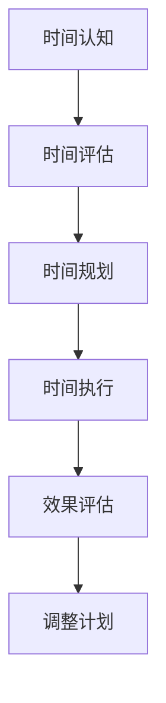

                 

### 管理者的时间效能：提高个人和团队生产力

## 引言

在快节奏的现代工作环境中，时间效能已成为衡量个人和团队成功的关键因素。对于管理者而言，合理利用时间和提高时间效能不仅关乎个人职业发展，更直接影响团队的整体绩效。本文旨在探讨管理者的时间效能问题，通过分析时间管理的重要性、个人时间管理方法、团队时间管理策略，以及实践案例，帮助管理者提升个人和团队生产力。

## 时间管理的重要性

时间管理是指通过规划和控制时间的使用，以提高个人和团队工作效率的过程。对于管理者来说，时间管理的重要性体现在以下几个方面：

1. **提高个人效能**：合理的时间管理可以帮助管理者明确工作目标，减少冗余任务，从而提高工作效率。

2. **增强团队协作**：有效的团队时间管理有助于明确团队目标，合理分配任务，提高团队协作效率。

3. **优化决策过程**：通过时间管理，管理者可以更清晰地分析工作需求，从而做出更加明智的决策。

4. **提升组织绩效**：良好的时间管理能够促进组织整体效能的提升，有助于实现组织战略目标。

### 个人时间管理的原则

个人时间管理是时间效能提升的基础。以下是一些关键原则：

1. **设定明确目标**：明确个人职业和短期目标，有助于有针对性地分配时间。

2. **优先级排序**：根据任务的重要性和紧急程度，对任务进行优先级排序。

3. **合理规划时间**：合理安排工作时间，确保高效利用每一天的时间。

4. **避免拖延**：及时处理任务，避免拖延，以减少压力和效率损失。

5. **持续反思与调整**：定期评估时间管理效果，根据实际情况进行调整。

### 背景介绍

在现代社会中，时间成为了一种稀缺资源。管理者的时间管理能力不仅影响个人生活品质，更对团队和组织的整体表现产生深远影响。随着科技的发展和全球化进程的加速，工作任务日益复杂，时间管理的需求变得愈加迫切。

### 核心概念与联系

时间管理的核心概念包括时间认知、时间评估、时间规划和时间执行。这些概念之间有着紧密的联系，共同构成了一个完整的时间管理过程。

1. **时间认知**：认识到时间的有限性和重要性，是有效时间管理的基础。
2. **时间评估**：对时间使用情况进行评估，识别时间浪费的原因。
3. **时间规划**：根据目标和工作内容，制定合理的时间计划。
4. **时间执行**：按照计划执行任务，确保时间得到有效利用。

下面是一个时间管理流程的Mermaid流程图：

### 提升个人时间效能的方法

#### 高效工作习惯

1. **分阶段工作**：将工作划分为多个阶段，每阶段集中精力完成一项任务。
2. **避免多任务处理**：减少同时处理多项任务的情况，以提高专注度。
3. **设定工作时间**：合理安排工作时间，确保有足够的休息和充电时间。

#### 提高专注力与注意力

1. **专注力训练**：通过专注力训练提高集中注意力的能力。
2. **消除干扰因素**：在工作环境中减少干扰因素，如关闭不必要的通知。
3. **使用专注工具**：如番茄工作法等，帮助集中注意力。

### 团队时间管理的策略

#### 团队时间效能的重要性

团队时间效能直接影响团队的工作效率和项目的进展。有效的团队时间管理有助于：

1. **提高团队协作效率**：明确团队成员的职责和任务，确保协作顺畅。
2. **减少时间浪费**：通过合理的时间分配和任务调度，减少不必要的等待和重复劳动。
3. **提升项目质量**：有效的时间管理有助于确保项目按时交付，提高项目质量。

#### 团队时间管理的基本原则

1. **明确目标**：确保团队成员对项目目标和任务有清晰的认识。
2. **合理分配资源**：根据团队成员的能力和任务需求，合理分配资源和时间。
3. **定期沟通**：通过定期沟通了解团队进展，及时调整计划和策略。

### 提升团队时间效能

#### 团队协作时间管理技巧

1. **任务分解**：将复杂任务分解为可管理的子任务，确保每个成员都有明确的工作目标。
2. **时间跟踪**：使用时间跟踪工具记录团队成员的工作时间，帮助管理者了解团队的进度和效率。
3. **定期评估**：定期评估团队的工作效率，找出问题并采取措施进行改进。

#### 如何减少会议时间并提高效率

1. **会议前准备**：在会议前明确会议目的、议程和所需时间，确保会议高效进行。
2. **限制会议时间**：设定会议时间限制，避免无限制的讨论。
3. **会议纪要**：记录会议内容和决定事项，确保会议结果得到有效执行。

### 时间效能与生产力

时间效能是提高个人和团队生产力的关键因素。通过有效的时间管理，可以提高工作效率，减少时间浪费，从而实现更高的生产力。

1. **个人生产力**：良好的时间管理可以帮助个人更高效地完成任务，提高个人生产力。
2. **团队生产力**：有效的团队时间管理可以提高团队协作效率，促进项目进展，提高团队生产力。

### 管理者个人时间效能提升实践

#### 个人时间效能提升案例解析

某公司管理者通过引入时间管理工具和培训，提高了个人时间效能。具体措施包括：

1. **设定明确目标**：制定个人职业发展目标，明确工作重点。
2. **时间评估**：定期评估时间使用情况，找出时间浪费的原因。
3. **培训与反思**：参加时间管理培训，定期反思和调整时间管理策略。

#### 管理者个人时间效能提升策略

1. **培养良好的工作习惯**：如早起、定期休息、避免拖延等。
2. **使用时间管理工具**：如时间跟踪软件、日历应用等。
3. **定期自我评估**：定期评估时间管理效果，调整策略。

### 团队时间效能提升实践

#### 团队时间效能提升案例

某IT公司通过实施团队时间管理策略，显著提高了团队时间效能。具体措施包括：

1. **明确团队目标**：确保团队成员对项目目标和任务有清晰的认识。
2. **任务分解与跟踪**：将复杂任务分解为子任务，并使用项目管理工具进行跟踪。
3. **定期团队会议**：通过定期团队会议了解团队进展，及时调整计划和策略。

#### 团队时间效能提升的实践方案

1. **建立有效的沟通机制**：确保团队成员之间的沟通顺畅，及时解决问题。
2. **培训与指导**：提供时间管理培训，提高团队成员的时间管理能力。
3. **持续优化**：根据实际情况不断优化时间管理策略，提高团队效能。

### 组织时间效能优化

#### 组织时间效能优化方案

1. **制定明确的时间管理政策**：明确时间管理的重要性和基本要求。
2. **提供培训与资源支持**：为员工提供时间管理培训，并配备必要的时间管理工具。
3. **建立反馈机制**：通过定期评估和反馈，优化时间管理策略。

#### 时间效能优化的可持续性

1. **建立企业文化**：通过企业文化培养员工的时间管理意识。
2. **持续改进**：根据组织发展和外部环境变化，持续优化时间管理策略。
3. **员工参与**：鼓励员工参与时间管理策略的制定和优化，提高员工的参与度和认同感。

### 时间效能提升工具与方法

#### 时间效能提升工具介绍

1. **时间跟踪工具**：如Toggl、Harvest等，帮助记录和评估时间使用情况。
2. **时间管理软件**：如Microsoft To Do、Google Calendar等，帮助规划和管理时间。

#### 时间效能提升方法总结

1. **培养良好的时间管理习惯**：如定期评估、设定优先级、避免拖延等。
2. **优化工作流程**：通过流程优化减少时间浪费，提高工作效率。
3. **持续学习和改进**：通过学习和实践，不断提高时间管理能力。

### 最佳实践 tips

1. **制定明确的目标和计划**：确保工作有明确的方向和目标。
2. **避免多任务处理**：提高专注力，减少任务切换带来的效率损失。
3. **合理利用工具**：借助时间管理工具提高时间管理效率。

### 小结

时间效能是提高个人和团队生产力的重要保障。通过有效的个人时间管理和团队时间管理，可以显著提高工作效率和生产力。管理者应注重时间管理的重要性，培养良好的时间管理习惯，并制定和实施有效的团队时间管理策略。同时，组织也应提供必要的支持和资源，为时间效能的提升创造有利条件。

### 注意事项

1. **避免过度依赖工具**：工具是辅助手段，核心在于培养良好的时间管理意识和习惯。
2. **定期评估和调整**：时间管理策略需要根据实际情况进行定期评估和调整。

### 拓展阅读

1. **《高效能人士的七个习惯》**：史蒂芬·柯维著，提供了关于个人时间管理的实用方法和策略。
2. **《团队协作工具与实践》**：介绍团队协作工具和策略，帮助提高团队时间效能。

### 附录

#### A. 时间效能提升工具介绍

1. **时间跟踪工具**：如Toggl、Harvest等，帮助记录和评估时间使用情况。
2. **时间管理软件**：如Microsoft To Do、Google Calendar等，帮助规划和管理时间。

#### B. 时间效能提升方法总结

1. **培养良好的时间管理习惯**：如定期评估、设定优先级、避免拖延等。
2. **优化工作流程**：通过流程优化减少时间浪费，提高工作效率。
3. **持续学习和改进**：通过学习和实践，不断提高时间管理能力。

### 作者信息

作者：AI天才研究院/AI Genius Institute & 禅与计算机程序设计艺术 /Zen And The Art of Computer Programming

本文由AI天才研究院/AI Genius Institute撰写，结合禅与计算机程序设计艺术 /Zen And The Art of Computer Programming的理念，深入探讨管理者的时间效能问题，旨在为管理者提供实用的时间管理策略和实践案例。希望本文能够帮助读者提高个人和团队的时间效能，实现更高的生产力。

